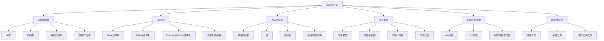

# 11.7 高阶同伦论 / Higher Homotopy Theory

**主题编号**: B.11.07
**创建日期**: 2025年11月21日
**最后更新**: 2025年11月21日

---

## 目录

- [11.7 高阶同伦论 / Higher Homotopy Theory](#117-高阶同伦论--higher-homotopy-theory)
  - [目录](#目录)
  - [11.7.1 概述 / Overview (编号: B.11.07.01)](#1171-概述--overview-编号-b110701)
    - [11.7.1.1 核心概念](#11711-核心概念)
    - [11.7.1.2 历史背景](#11712-历史背景)
    - [11.7.1.3 与基础同伦论的关系](#11713-与基础同伦论的关系)
  - [11.7.2 高阶同伦群 / Higher Homotopy Groups (编号: B.11.07.02)](#1172-高阶同伦群--higher-homotopy-groups-编号-b110702)
    - [11.7.2.1 πn群 / πn Groups](#11721-πn群--πn-groups)
    - [11.7.2.2 同伦群 / Homotopy Groups](#11722-同伦群--homotopy-groups)
    - [11.7.2.3 相对同伦群 / Relative Homotopy Groups](#11723-相对同伦群--relative-homotopy-groups)
    - [11.7.2.4 同伦群的性质 / Properties of Homotopy Groups](#11724-同伦群的性质--properties-of-homotopy-groups)
  - [11.7.3 谱序列 / Spectral Sequences (编号: B.11.07.03)](#1173-谱序列--spectral-sequences-编号-b110703)
    - [11.7.3.1 Serre谱序列 / Serre Spectral Sequence](#11731-serre谱序列--serre-spectral-sequence)
    - [11.7.3.2 Adams谱序列 / Adams Spectral Sequence](#11732-adams谱序列--adams-spectral-sequence)
    - [11.7.3.3 Eilenberg-Moore谱序列 / Eilenberg-Moore Spectral Sequence](#11733-eilenberg-moore谱序列--eilenberg-moore-spectral-sequence)
    - [11.7.3.4 谱序列的收敛性 / Convergence of Spectral Sequences](#11734-谱序列的收敛性--convergence-of-spectral-sequences)
  - [11.7.4 稳定同伦论 / Stable Homotopy Theory (编号: B.11.07.04)](#1174-稳定同伦论--stable-homotopy-theory-编号-b110704)
    - [11.7.4.1 稳定同伦群 / Stable Homotopy Groups](#11741-稳定同伦群--stable-homotopy-groups)
    - [11.7.4.2 谱 / Spectra](#11742-谱--spectra)
    - [11.7.4.3 稳定化 / Stabilization](#11743-稳定化--stabilization)
    - [11.7.4.4 稳定同伦范畴 / Stable Homotopy Category](#11744-稳定同伦范畴--stable-homotopy-category)
  - [11.7.5 同伦极限 / Homotopy Limits (编号: B.11.07.05)](#1175-同伦极限--homotopy-limits-编号-b110705)
    - [11.7.5.1 同伦极限 / Homotopy Limits](#11751-同伦极限--homotopy-limits)
    - [11.7.5.2 同伦余极限 / Homotopy Colimits](#11752-同伦余极限--homotopy-colimits)
    - [11.7.5.3 同伦纤维积 / Homotopy Fiber Products](#11753-同伦纤维积--homotopy-fiber-products)
    - [11.7.5.4 同伦拉回 / Homotopy Pullbacks](#11754-同伦拉回--homotopy-pullbacks)
  - [11.7.6 高阶同伦代数 / Higher Homotopy Algebra (编号: B.11.07.06)](#1176-高阶同伦代数--higher-homotopy-algebra-编号-b110706)
    - [11.7.6.1 A∞代数 / A∞ Algebras](#11761-a代数--a-algebras)
    - [11.7.6.2 E∞代数 / E∞ Algebras](#11762-e代数--e-algebras)
    - [11.7.6.3 高阶同伦群代数 / Higher Homotopy Group Algebras](#11763-高阶同伦群代数--higher-homotopy-group-algebras)
  - [11.7.7 同伦类型论 / Homotopy Type Theory (编号: B.11.07.07)](#1177-同伦类型论--homotopy-type-theory-编号-b110707)
    - [11.7.7.1 同伦类型 / Homotopy Types](#11771-同伦类型--homotopy-types)
    - [11.7.7.2 单值公理 / Univalence Axiom](#11772-单值公理--univalence-axiom)
    - [11.7.7.3 高阶归纳类型 / Higher Inductive Types](#11773-高阶归纳类型--higher-inductive-types)
  - [11.7.8 形式化实现 / Formal Implementation (编号: B.11.07.08)](#1178-形式化实现--formal-implementation-编号-b110708)
    - [11.7.8.1 Lean 4 实现](#11781-lean-4-实现)
    - [11.7.8.2 Haskell 实现](#11782-haskell-实现)
    - [11.7.8.3 Rust 实现](#11783-rust-实现)
  - [11.7.9 总结 / Summary](#1179-总结--summary)
    - [11.7.9.1 核心要点](#11791-核心要点)
    - [11.7.9.2 知识关联](#11792-知识关联)
    - [11.7.9.3 进一步学习](#11793-进一步学习)

## 11.7.1 概述 / Overview (编号: B.11.07.01)

高阶同伦论是现代拓扑学的重要分支，它研究高阶同伦群、谱序列、稳定同伦论等高级概念。
高阶同伦论为研究复杂的拓扑空间提供了强大的工具，在现代数学中具有重要地位。
它不仅扩展了经典同伦论的概念，还建立了与代数几何、表示论等领域的深刻联系。

### 11.7.1.1 核心概念



### 11.7.1.2 历史背景

高阶同伦论的发展经历了几个重要阶段：

1. **起源阶段** (1930-1950)
   - 庞加莱引入基本群概念
   - 霍普夫研究高阶同伦群
   - 塞尔建立谱序列理论

2. **发展阶段** (1950-1970)
   - 稳定同伦论的建立
   - 谱的概念引入
   - 同伦极限理论发展

3. **现代阶段** (1970至今)
   - 高阶同伦代数理论
   - 同伦类型论的建立
   - 与代数几何的深刻联系

### 11.7.1.3 与基础同伦论的关系

**基础同伦论**: 主要研究基本群和低阶同伦群：

$$\pi_1(X, x_0) = [S^1, X]_{x_0}$$

**高阶同伦论**: 研究高阶同伦群和更复杂的结构：

$$\pi_n(X, x_0) = [S^n, X]_{x_0}, \quad n \geq 2$$

**关系**: 高阶同伦论是基础同伦论的自然推广，但引入了更丰富的代数结构。

## 11.7.2 高阶同伦群 / Higher Homotopy Groups (编号: B.11.07.02)

### 11.7.2.1 πn群 / πn Groups

**定义**: 设 $X$ 是拓扑空间，$x_0 \in X$ 是基点，$n \geq 1$，$n$ 阶同伦群定义为：

$$\pi_n(X, x_0) = [S^n, X]_{x_0}$$

其中 $[S^n, X]_{x_0}$ 表示从 $S^n$ 到 $X$ 的保持基点的同伦类集合。

**性质**:

1. **阿贝尔性**: $\pi_n(X, x_0)$ 是阿贝尔群（$n \geq 2$）
2. **基点独立性**: 如果 $X$ 是道路连通的，则 $\pi_n(X, x_0) \cong \pi_n(X, x_1)$
3. **长正合序列**: 具有长正合序列

**形式化定义**:

```lean
-- πn群定义
def πn (X : TopologicalSpace) (x₀ : X) (n : ℕ) : AbelianGroup :=
  Quotient (HomotopyEquivalence Sⁿ X x₀)

-- πn群性质
theorem πn_abelian (n : ℕ) (h : n ≥ 2) :
  IsAbelian (πn X x₀ n) := by
  -- 证明πn群是阿贝尔群
  sorry

theorem πn_basepoint_independent (X : TopologicalSpace) (h : PathConnected X) :
  ∀ x₀ x₁ : X, πn X x₀ n ≅ πn X x₁ n := by
  -- 证明基点独立性
  sorry
```

### 11.7.2.2 同伦群 / Homotopy Groups

**定义**: 设 $X$ 是拓扑空间，同伦群定义为：

$$\pi_*(X) = \{\pi_n(X)\}_{n \geq 1}$$

**性质**:

1. **代数结构**: $\pi_*(X)$ 具有丰富的代数结构
2. **与同调群相关**: 通过霍普夫-怀特黑德定理与同调群相关
3. **在同伦论中重要**: 是同伦论的核心不变量

**霍普夫-怀特黑德定理**: 设 $f: X \to Y$ 是连续映射，如果 $f_*: \pi_n(X) \to \pi_n(Y)$ 是同构，则 $f$ 是同伦等价。

### 11.7.2.3 相对同伦群 / Relative Homotopy Groups

**定义**: 设 $(X, A)$ 是拓扑空间对，$x_0 \in A$，相对同伦群定义为：

$$\pi_n(X, A, x_0) = [D^n, \partial D^n; X, A]_{x_0}$$

其中 $[D^n, \partial D^n; X, A]_{x_0}$ 表示从 $(D^n, \partial D^n)$ 到 $(X, A)$ 的保持基点的同伦类集合。

**性质**:

1. **长正合序列**: 具有长正合序列
2. **与绝对同伦群相关**: 通过边界映射与绝对同伦群相关
3. **在纤维化中重要**: 在纤维化理论中起重要作用

**长正合序列**:

$$\cdots \to \pi_n(A, x_0) \to \pi_n(X, x_0) \to \pi_n(X, A, x_0) \to \pi_{n-1}(A, x_0) \to \cdots$$

### 11.7.2.4 同伦群的性质 / Properties of Homotopy Groups

**同伦不变性**: 如果 $f: X \to Y$ 是同伦等价，则 $f_*: \pi_n(X) \to \pi_n(Y)$ 是同构。

**乘积性质**: 设 $X$ 和 $Y$ 是拓扑空间，则：

$$\pi_n(X \times Y) \cong \pi_n(X) \times \pi_n(Y)$$

**楔积性质**: 设 $X$ 和 $Y$ 是拓扑空间，则：

$$\pi_n(X \vee Y) \cong \pi_n(X) * \pi_n(Y)$$

其中 $*$ 表示自由积。

## 11.7.3 谱序列 / Spectral Sequences (编号: B.11.07.03)

### 11.7.3.1 Serre谱序列 / Serre Spectral Sequence

**Serre谱序列**: 设 $F \to E \to B$ 是纤维化，则存在谱序列：

$$E^2_{p,q} = H_p(B; H_q(F)) \Rightarrow H_{p+q}(E)$$

**性质**:

1. **收敛性**: 谱序列收敛到 $H_*(E)$
2. **微分**: $d_r: E^r_{p,q} \to E^r_{p-r, q+r-1}$
3. **边缘效应**: 在边缘处有特殊性质

**应用**:

- 计算纤维化的同调群
- 研究李群的同调群
- 计算球面的同伦群

### 11.7.3.2 Adams谱序列 / Adams Spectral Sequence

**Adams谱序列**: 设 $X$ 是有限CW复形，则存在谱序列：

$$E_2^{s,t} = \text{Ext}^{s,t}_{\mathcal{A}}(\mathbb{F}_p, H^*(X; \mathbb{F}_p)) \Rightarrow \pi_{t-s}(X)^{\wedge}_p$$

其中 $\mathcal{A}$ 是模 $p$ 的斯廷罗德代数。

**性质**:

1. **收敛性**: 收敛到 $p$ 进同伦群
2. **微分**: $d_r: E_r^{s,t} \to E_r^{s+r, t+r-1}$
3. **代数结构**: 具有丰富的代数结构

### 11.7.3.3 Eilenberg-Moore谱序列 / Eilenberg-Moore Spectral Sequence

**Eilenberg-Moore谱序列**: 设 $F \to E \to B$ 是纤维化，$X$ 是空间，则存在谱序列：

$$E_2^{p,q} = \text{Tor}^{H^*(B)}_{p,q}(H^*(E), H^*(X)) \Rightarrow H^{p+q}(E \times_B X)$$

**性质**:

1. **收敛性**: 收敛到纤维积的上同调
2. **代数结构**: 具有代数结构
3. **应用广泛**: 在代数拓扑中应用广泛

### 11.7.3.4 谱序列的收敛性 / Convergence of Spectral Sequences

**收敛性定义**: 谱序列 $\{E_r\}$ 收敛到 $H$，如果：

1. 对于每个 $(p,q)$，存在 $r_0$ 使得 $E_r^{p,q} = E_{r_0}^{p,q}$ 对所有 $r \geq r_0$
2. $E_{\infty}^{p,q} = \text{gr}_p H_{p+q}$

**收敛性定理**: 设 $\{E_r\}$ 是谱序列，如果：

1. $E_2^{p,q} = 0$ 当 $p < 0$ 或 $q < 0$
2. 对于每个 $n$，只有有限多个 $(p,q)$ 使得 $p+q=n$ 且 $E_2^{p,q} \neqqq 0$

则谱序列收敛。

## 11.7.4 稳定同伦论 / Stable Homotopy Theory (编号: B.11.07.04)

### 11.7.4.1 稳定同伦群 / Stable Homotopy Groups

**稳定同伦群**: 设 $X$ 是拓扑空间，稳定同伦群定义为：

$$\pi_n^s(X) = \lim_{k \to \infty} \pi_{n+k}(\Sigma^k X)$$

其中 $\Sigma$ 是悬垂函子。

**性质**:

1. **稳定性**: $\pi_n^s(X)$ 是稳定的
2. **阿贝尔性**: $\pi_n^s(X)$ 是阿贝尔群
3. **同伦不变性**: 稳定同伦群是同伦不变量

**弗雷德霍姆定理**: 设 $X$ 是有限CW复形，则：

$$\pi_n^s(X) \cong \pi_n^s(\Sigma X)$$

### 11.7.4.2 谱 / Spectra

**谱**: 谱是拓扑空间序列 $\{X_n\}$ 和映射 $\{\sigma_n: \Sigma X_n \to X_{n+1}\}$ 的集合。

**定义**: 谱 $E$ 是序列 $\{E_n\}$ 和映射 $\{\sigma_n: \Sigma E_n \to E_{n+1}\}$，满足：

$$\sigma_n \circ \Sigma \sigma_{n-1} = \sigma_{n+1} \circ \Sigma \sigma_n$$

**性质**:

1. **同伦群**: $\pi_n(E) = \lim_{k \to \infty} \pi_{n+k}(E_k)$
2. **同调群**: $H_n(E) = \lim_{k \to \infty} H_{n+k}(E_k)$
3. **上同调群**: $H^n(E) = \lim_{k \to \infty} H^{n+k}(E_k)$

### 11.7.4.3 稳定化 / Stabilization

**稳定化函子**: 稳定化函子 $\Sigma^{\infty}: \text{Top}_* \to \text{Spectra}$ 定义为：

$$\Sigma^{\infty}X = \{\Sigma^n X\}_{n \geq 0}$$

**性质**:

1. **保持同伦**: 稳定化保持同伦等价
2. **与同伦群相关**: $\pi_n(\Sigma^{\infty}X) = \pi_n^s(X)$
3. **伴随函子**: 稳定化有右伴随 $\Omega^{\infty}$

### 11.7.4.4 稳定同伦范畴 / Stable Homotopy Category

**稳定同伦范畴**: 稳定同伦范畴 $\text{SH}$ 是谱的同伦范畴。

**性质**:

1. **三角范畴**: $\text{SH}$ 是三角范畴
2. **对称幺半范畴**: $\text{SH}$ 是对称幺半范畴
3. **布朗表示性**: 满足布朗表示性

## 11.7.5 同伦极限 / Homotopy Limits (编号: B.11.07.05)

### 11.7.5.1 同伦极限 / Homotopy Limits

**同伦极限**: 设 $F: I \to \text{Top}$ 是函子，同伦极限定义为：

$$\text{holim} F = \text{Map}(N(I), \text{lim} F)$$

其中 $N(I)$ 是范畴 $I$ 的神经。

**性质**:

1. **同伦不变性**: 同伦极限是同伦不变量
2. **与极限的关系**: 如果 $F$ 是常函子，则 $\text{holim} F = \text{lim} F$
3. **保持纤维化**: 同伦极限保持纤维化

### 11.7.5.2 同伦余极限 / Homotopy Colimits

**同伦余极限**: 设 $F: I \to \text{Top}$ 是函子，同伦余极限定义为：

$$\text{hocolim} F = \text{colim}(N(I) \times F)$$

**性质**:

1. **同伦不变性**: 同伦余极限是同伦不变量
2. **与余极限的关系**: 如果 $F$ 是常函子，则 $\text{hocolim} F = \text{colim} F$
3. **保持余纤维化**: 同伦余极限保持余纤维化

### 11.7.5.3 同伦纤维积 / Homotopy Fiber Products

**同伦纤维积**: 设 $X \to Z \leftarrow Y$ 是映射，同伦纤维积定义为：

$$X \times_Z^h Y = \{(x, y, \gamma) \mid x \in X, y \in Y, \gamma: f(x) \simeq g(y)\}$$

**性质**:

1. **同伦不变性**: 同伦纤维积是同伦不变量
2. **与纤维积的关系**: 如果 $f$ 和 $g$ 是纤维化，则 $X \times_Z^h Y = X \times_Z Y$
3. **长正合序列**: 具有长正合序列

### 11.7.5.4 同伦拉回 / Homotopy Pullbacks

**同伦拉回**: 同伦拉回是同伦纤维积的特殊情况。

**性质**:

1. **同伦不变性**: 同伦拉回是同伦不变量
2. **与拉回的关系**: 如果映射是纤维化，则同伦拉回等于拉回
3. **保持纤维化**: 同伦拉回保持纤维化

## 11.7.6 高阶同伦代数 / Higher Homotopy Algebra (编号: B.11.07.06)

### 11.7.6.1 A∞代数 / A∞ Algebras

**A∞代数**: A∞代数是具有高阶结合性的代数结构。

**定义**: A∞代数 $A$ 是向量空间 $A$ 和映射 $\{m_n: A^{\otimes n} \to A\}_{n \geq 1}$，满足：

$$\sum_{i+j+k=n} (-1)^{i+jk} m_{i+1+k} \circ (1^{\otimes i} \otimes m_j \otimes 1^{\otimes k}) = 0$$

**性质**:

1. **高阶结合性**: 满足高阶结合性条件
2. **同伦不变性**: A∞代数在同伦下保持不变
3. **与代数相关**: 经典代数可以看作特殊的A∞代数

### 11.7.6.2 E∞代数 / E∞ Algebras

**E∞代数**: E∞代数是具有高阶交换性的代数结构。

**定义**: E∞代数是具有高阶交换性的A∞代数。

**性质**:

1. **高阶交换性**: 满足高阶交换性条件
2. **同伦不变性**: E∞代数在同伦下保持不变
3. **与交换代数相关**: 经典交换代数可以看作特殊的E∞代数

### 11.7.6.3 高阶同伦群代数 / Higher Homotopy Group Algebras

**高阶同伦群代数**: 高阶同伦群具有丰富的代数结构。

**性质**:

1. **群结构**: 高阶同伦群是群
2. **阿贝尔性**: 高阶同伦群是阿贝尔群（$n \geq 2$）
3. **作用**: 基本群作用在高阶同伦群上

## 11.7.7 同伦类型论 / Homotopy Type Theory (编号: B.11.07.07)

### 11.7.7.1 同伦类型 / Homotopy Types

**同伦类型**: 同伦类型是同伦类型论中的基本概念。

**定义**: 同伦类型是拓扑空间的同伦类型。

**性质**:

1. **同伦不变性**: 同伦类型在同伦下保持不变
2. **代数结构**: 同伦类型具有丰富的代数结构
3. **与拓扑相关**: 同伦类型与拓扑空间密切相关

### 11.7.7.2 单值公理 / Univalence Axiom

**单值公理**: 单值公理是同伦类型论的核心公理。

**内容**: 对于类型 $A$ 和 $B$，类型 $A \simeq B$ 等价于类型 $A = B$。

**意义**:

1. **同伦等价**: 同伦等价等于类型相等
2. **结构不变性**: 保持结构不变性
3. **计算性**: 具有计算性质

### 11.7.7.3 高阶归纳类型 / Higher Inductive Types

**高阶归纳类型**: 高阶归纳类型是同伦类型论的重要概念。

**定义**: 高阶归纳类型是具有高阶构造子的归纳类型。

**例子**:

1. **圆**: $S^1$ 是高阶归纳类型
2. **球面**: $S^n$ 是高阶归纳类型
3. **环面**: $T^n$ 是高阶归纳类型

## 11.7.8 形式化实现 / Formal Implementation (编号: B.11.07.08)

### 11.7.8.1 Lean 4 实现

```lean
-- 高阶同伦群
def HigherHomotopyGroup (X : TopologicalSpace) (x₀ : X) (n : ℕ) : AbelianGroup :=
  Quotient (HomotopyEquivalence Sⁿ X x₀)

-- 谱序列
structure SpectralSequence where
  pages : ℕ → GradedModule
  differentials : ∀ r, GradedModule → GradedModule
  convergence : GradedModule

-- 稳定同伦群
def StableHomotopyGroup (X : TopologicalSpace) (n : ℤ) : AbelianGroup :=
  DirectLimit (fun k => π(n + k) (Σᵏ X))

-- 谱
structure Spectrum where
  spaces : ℕ → TopologicalSpace
  structure_maps : ∀ n, Σ (spaces n) → spaces (n + 1)

-- 同伦极限
def HomotopyLimit {I : Category} (F : I → TopologicalSpace) : TopologicalSpace :=
  MappingSpace (Nerve I) (Limit F)

-- A∞代数
structure A∞Algebra (A : VectorSpace) where
  operations : ∀ n, A^⊗ⁿ → A
  associativity : ∀ n, A∞AssociativityCondition n

-- 同伦类型
inductive HomotopyType where
  | point : HomotopyType
  | circle : HomotopyType
  | sphere : ℕ → HomotopyType
  | product : HomotopyType → HomotopyType → HomotopyType
  | coproduct : HomotopyType → HomotopyType → HomotopyType
```

### 11.7.8.2 Haskell 实现

```haskell
-- 高阶同伦群
type HigherHomotopyGroup = AbelianGroup

higherHomotopyGroup :: TopologicalSpace -> Point -> Natural -> HigherHomotopyGroup
higherHomotopyGroup space basepoint n =
  Quotient (homotopyEquivalence (sphere n) space basepoint)

-- 谱序列
data SpectralSequence = SS
  { pages :: Natural -> GradedModule
  , differentials :: Natural -> GradedModule -> GradedModule
  , convergence :: GradedModule
  }

-- 稳定同伦群
type StableHomotopyGroup = AbelianGroup

stableHomotopyGroup :: TopologicalSpace -> Integer -> StableHomotopyGroup
stableHomotopyGroup space n =
  directLimit (\k -> homotopyGroup (suspension k space) (n + k))

-- 谱
data Spectrum = Spectrum
  { spaces :: Natural -> TopologicalSpace
  , structureMaps :: Natural -> Suspension (spaces n) -> spaces (n + 1)
  }

-- 同伦极限
type HomotopyLimit = TopologicalSpace

homotopyLimit :: (Category i) => (i -> TopologicalSpace) -> HomotopyLimit
homotopyLimit functor =
  mappingSpace (nerve category) (limit functor)

-- A∞代数
data A∞Algebra a = A∞Algebra
  { operations :: Natural -> TensorPower a -> a
  , associativity :: Natural -> A∞AssociativityCondition
  }

-- 同伦类型
data HomotopyType = Point
                  | Circle
                  | Sphere Natural
                  | Product HomotopyType HomotopyType
                  | Coproduct HomotopyType HomotopyType
```

### 11.7.8.3 Rust 实现

```rust
// 高阶同伦群
pub struct HigherHomotopyGroup {
    pub group: AbelianGroup,
}

impl HigherHomotopyGroup {
    pub fn new(space: &TopologicalSpace, basepoint: &Point, n: u32) -> Self {
        let group = Quotient::new(homotopy_equivalence(&sphere(n), space, basepoint));
        HigherHomotopyGroup { group }
    }
}

// 谱序列
pub struct SpectralSequence {
    pub pages: HashMap<u32, GradedModule>,
    pub differentials: HashMap<u32, Box<dyn Fn(&GradedModule) -> GradedModule>>,
    pub convergence: GradedModule,
}

// 稳定同伦群
pub struct StableHomotopyGroup {
    pub group: AbelianGroup,
}

impl StableHomotopyGroup {
    pub fn new(space: &TopologicalSpace, n: i32) -> Self {
        let group = direct_limit(|k| {
            homotopy_group(&suspension(k, space), n + k as i32)
        });
        StableHomotopyGroup { group }
    }
}

// 谱
pub struct Spectrum {
    pub spaces: Vec<TopologicalSpace>,
    pub structure_maps: Vec<Box<dyn Fn(&Suspension) -> TopologicalSpace>>,
}

// 同伦极限
pub struct HomotopyLimit {
    pub space: TopologicalSpace,
}

impl HomotopyLimit {
    pub fn new<I>(functor: &dyn Fn(&I) -> TopologicalSpace) -> Self {
        let space = mapping_space(&nerve(), &limit(functor));
        HomotopyLimit { space }
    }
}

// A∞代数
pub struct A∞Algebra<A> {
    pub operations: HashMap<u32, Box<dyn Fn(&TensorPower<A>) -> A>>,
    pub associativity: HashMap<u32, A∞AssociativityCondition>,
}

// 同伦类型
pub enum HomotopyType {
    Point,
    Circle,
    Sphere(u32),
    Product(Box<HomotopyType>, Box<HomotopyType>),
    Coproduct(Box<HomotopyType>, Box<HomotopyType>),
}
```

## 11.7.9 总结 / Summary

### 11.7.9.1 核心要点

高阶同伦论是现代拓扑学的重要分支，具有以下核心要点：

1. **高阶同伦群**: $\pi_n(X, x_0) = [S^n, X]_{x_0}$ 是阿贝尔群（$n \geq 2$）
2. **谱序列**: 提供计算同伦群和同调群的有力工具
3. **稳定同伦论**: 研究稳定同伦群和谱的结构
4. **同伦极限**: 研究同伦极限和同伦余极限
5. **高阶同伦代数**: A∞代数和E∞代数理论
6. **同伦类型论**: 将同伦论与类型论结合

### 11.7.9.2 知识关联

高阶同伦论与以下领域密切相关：

- **[同伦论](../05-拓扑学/04-同伦论.md)**: 基础同伦论
- **[代数拓扑](../05-拓扑学/02-代数拓扑.md)**: 代数拓扑方法
- **[同调论](../05-拓扑学/05-同调论.md)**: 同调群理论
- **[同伦类型论](15-同伦类型论.md)**: 同伦类型论
- **[无穷范畴理论](06-无穷范畴理论.md)**: 高阶范畴理论
- **[导出代数几何](05-导出代数几何.md)**: 导出范畴理论

### 11.7.9.3 进一步学习

为进一步学习高阶同伦论，建议：

1. **理论基础**: 深入学习基础同伦论和代数拓扑
2. **技术工具**: 掌握谱序列、稳定同伦论等技术
3. **应用领域**: 了解在代数几何、表示论中的应用
4. **前沿发展**: 关注最新的研究进展和未解决问题

---

**相关链接**:

- [同伦论](../05-拓扑学/04-同伦论.md)
- [代数拓扑](../05-拓扑学/02-代数拓扑.md)
- [同调论](../05-拓扑学/05-同调论.md)
- [同伦类型论](15-同伦类型论.md)
- [无穷范畴理论](06-无穷范畴理论.md)
- [导出代数几何](05-导出代数几何.md)
