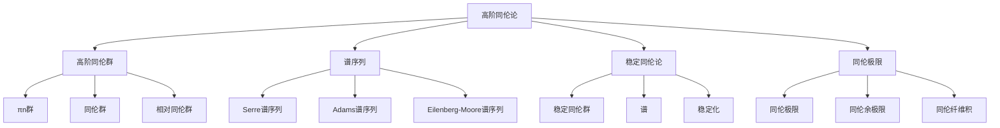

# 7. 高阶同伦论 / Higher Homotopy Theory

## 目录

- [7. 高阶同伦论 / Higher Homotopy Theory](#7-高阶同伦论--higher-homotopy-theory)
  - [目录](#目录)
  - [7.1 概述 / Overview](#71-概述--overview)
    - [7.1.1 核心概念](#711-核心概念)
  - [7.2 高阶同伦群 / Higher Homotopy Groups](#72-高阶同伦群--higher-homotopy-groups)
    - [7.2.1 πn群 / πn Groups](#721-πn群--πn-groups)
    - [7.2.2 同伦群 / Homotopy Groups](#722-同伦群--homotopy-groups)
    - [7.2.3 相对同伦群 / Relative Homotopy Groups](#723-相对同伦群--relative-homotopy-groups)
  - [7.3 谱序列 / Spectral Sequences](#73-谱序列--spectral-sequences)
    - [7.3.1 Serre谱序列 / Serre Spectral Sequence](#731-serre谱序列--serre-spectral-sequence)
    - [7.3.2 Adams谱序列 / Adams Spectral Sequence](#732-adams谱序列--adams-spectral-sequence)
    - [7.3.3 Eilenberg-Moore谱序列 / Eilenberg-Moore Spectral Sequence](#733-eilenberg-moore谱序列--eilenberg-moore-spectral-sequence)
  - [7.4 稳定同伦论 / Stable Homotopy Theory](#74-稳定同伦论--stable-homotopy-theory)
    - [7.4.1 稳定同伦群 / Stable Homotopy Groups](#741-稳定同伦群--stable-homotopy-groups)
    - [7.4.2 谱 / Spectra](#742-谱--spectra)
    - [7.4.3 稳定化 / Stabilization](#743-稳定化--stabilization)
  - [7.5 同伦极限 / Homotopy Limits](#75-同伦极限--homotopy-limits)
    - [7.5.1 同伦极限 / Homotopy Limits](#751-同伦极限--homotopy-limits)
    - [7.5.2 同伦余极限 / Homotopy Colimits](#752-同伦余极限--homotopy-colimits)
    - [7.5.3 同伦纤维积 / Homotopy Fiber Products](#753-同伦纤维积--homotopy-fiber-products)
  - [7.6 形式化实现 / Formal Implementation](#76-形式化实现--formal-implementation)
    - [7.6.1 Lean 4 实现](#761-lean-4-实现)
    - [7.6.2 Haskell 实现](#762-haskell-实现)
  - [7.7 总结 / Summary](#77-总结--summary)
    - [7.7.1 核心要点](#771-核心要点)
    - [7.7.2 知识关联](#772-知识关联)
    - [7.7.3 进一步学习](#773-进一步学习)

## 7.1 概述 / Overview

高阶同伦论是现代拓扑学的重要分支，它研究高阶同伦群、谱序列、稳定同伦论等高级概念。高阶同伦论为研究复杂的拓扑空间提供了强大的工具，在现代数学中具有重要地位。

### 7.1.1 核心概念



## 7.2 高阶同伦群 / Higher Homotopy Groups

### 7.2.1 πn群 / πn Groups

**定义**: 设 $X$ 是拓扑空间，$x_0 \in X$ 是基点，$n \geq 1$，$n$ 阶同伦群定义为：
$$\pi_n(X, x_0) = [S^n, X]_{x_0}$$

**性质**:

- $\pi_n(X, x_0)$ 是阿贝尔群（$n \geq 2$）
- $\pi_1(X, x_0)$ 是基本群
- 具有长正合序列

### 7.2.2 同伦群 / Homotopy Groups

**定义**: 设 $X$ 是拓扑空间，同伦群定义为：
$$\pi_*(X) = \{\pi_n(X)\}_{n \geq 1}$$

**性质**:

- 具有丰富的代数结构
- 与同调群相关
- 在同伦论中重要

### 7.2.3 相对同伦群 / Relative Homotopy Groups

**定义**: 设 $(X, A)$ 是拓扑空间对，相对同伦群定义为：
$$\pi_n(X, A, x_0) = [D^n, \partial D^n; X, A]_{x_0}$$

**性质**:

- 具有长正合序列
- 与绝对同伦群相关
- 在纤维化中重要

## 7.3 谱序列 / Spectral Sequences

### 7.3.1 Serre谱序列 / Serre Spectral Sequence

**定理**: 设 $F \to E \to B$ 是纤维化，则存在谱序列：
$$E_2^{p,q} = H^p(B; H^q(F)) \Rightarrow H^{p+q}(E)$$

**应用**:

- 计算纤维丛的同调群
- 研究群的上同调
- 分析代数几何中的层上同调

### 7.3.2 Adams谱序列 / Adams Spectral Sequence

**定理**: 设 $X, Y$ 是有限CW复形，则存在谱序列：
$$E_2^{s,t} = \text{Ext}_{\mathcal{A}}^{s,t}(H^*(Y), H^*(X)) \Rightarrow [X, Y]_t^s$$

**应用**:

- 计算稳定同伦群
- 研究球面之间的映射
- 分析谱的同伦群

### 7.3.3 Eilenberg-Moore谱序列 / Eilenberg-Moore Spectral Sequence

**定理**: 设 $F \to E \to B$ 是纤维化，$B$ 是单连通的，则存在谱序列：
$$E_2^{p,q} = \text{Tor}_p^{H^*(B)}(H^*(E), \mathbb{F}_p) \Rightarrow H^{p+q}(F)$$

## 7.4 稳定同伦论 / Stable Homotopy Theory

### 7.4.1 稳定同伦群 / Stable Homotopy Groups

**定义**: 设 $X$ 是拓扑空间，稳定同伦群定义为：
$$\pi_n^s(X) = \lim_{k \to \infty} \pi_{n+k}(\Sigma^k X)$$

**性质**:

- 满足弗洛伊登塔尔悬垂定理
- 具有丰富的代数结构
- 与谱理论密切相关

### 7.4.2 谱 / Spectra

**定义**: 谱是一个序列 $\{E_n\}_{n \in \mathbb{Z}}$ 和态射 $\sigma_n: \Sigma E_n \to E_{n+1}$，其中 $\Sigma$ 是悬垂函子。

**重要例子**:

1. **球谱**: $S = \{S^n\}_{n \geq 0}$
2. **Eilenberg-MacLane谱**: $H\mathbb{Z} = \{K(\mathbb{Z}, n)\}_{n \geq 0}$
3. **复配边谱**: $MU = \{MU_{2n}\}_{n \geq 0}$

### 7.4.3 稳定化 / Stabilization

**定义**: 设 $X$ 是拓扑空间，稳定化定义为：
$$\Sigma^\infty X = \{\Sigma^n X\}_{n \geq 0}$$

**性质**:

- 保持同伦类型
- 增加代数结构
- 简化计算

## 7.5 同伦极限 / Homotopy Limits

### 7.5.1 同伦极限 / Homotopy Limits

**定义**: 设 $F: \mathcal{I} \to \mathcal{C}$ 是函子，同伦极限定义为：
$$\text{holim} F = \text{Map}(\mathcal{I}, F)$$

**性质**:

- 保持弱等价
- 具有普遍性质
- 与普通极限相关

### 7.5.2 同伦余极限 / Homotopy Colimits

**定义**: 设 $F: \mathcal{I} \to \mathcal{C}$ 是函子，同伦余极限定义为：
$$\text{hocolim} F = \text{coMap}(\mathcal{I}, F)$$

**性质**:

- 保持弱等价
- 具有普遍性质
- 与普通余极限相关

### 7.5.3 同伦纤维积 / Homotopy Fiber Products

**定义**: 设 $X \to Z \leftarrow Y$ 是拓扑空间之间的映射，同伦纤维积定义为：
$$X \times_Z^h Y = \text{holim}(X \to Z \leftarrow Y)$$

**性质**:

- 保持弱等价
- 具有普遍性质
- 在纤维化中重要

## 7.6 形式化实现 / Formal Implementation

### 7.6.1 Lean 4 实现

```lean
-- 高阶同伦群
def HigherHomotopyGroup (X : TopologicalSpace) (n : ℕ) (x₀ : X) : AbGroup :=
  [Suspension n, X]_{x₀}

-- 谱序列
structure SpectralSequence where
  page : ℕ → Type
  differential : ∀ r, page r → page r
  convergence : ∀ r, page (r + 1) = homology (page r) (differential r)

-- 稳定同伦群
def StableHomotopyGroup (X : TopologicalSpace) (n : ℕ) : AbGroup :=
  lim (fun k => HomotopyGroup (n + k) (Suspension k X))

-- 同伦极限
def HomotopyLimit {I : Type} (F : I → TopologicalSpace) : TopologicalSpace :=
  Map I F
```

### 7.6.2 Haskell 实现

```haskell
-- 高阶同伦群
higherHomotopyGroup :: TopologicalSpace -> Int -> Point -> AbGroup
higherHomotopyGroup x n x0 = [suspension n, x]_{x0}

-- 谱序列
data SpectralSequence = SpectralSequence
  { page :: Int -> Type
  , differential :: Int -> page r -> page r
  , convergence :: Int -> page (r + 1) -> Homology (page r) (differential r)
  }

-- 稳定同伦群
stableHomotopyGroup :: TopologicalSpace -> Int -> AbGroup
stableHomotopyGroup x n = limit $ \k -> homotopyGroup (n + k) (suspension k x)

-- 同伦极限
homotopyLimit :: (I -> TopologicalSpace) -> TopologicalSpace
homotopyLimit f = map I f
```

## 7.7 总结 / Summary

### 7.7.1 核心要点

1. **高阶同伦群** 为拓扑空间提供了强大的代数不变量
2. **谱序列** 是研究复杂空间的重要方法
3. **稳定同伦论** 提供了强大的计算工具
4. **同伦极限** 为同伦论提供了抽象框架

### 7.7.2 知识关联

- 与[同伦论高级主题](02-同伦论高级主题.md)的基础理论相联系
- 与[无穷范畴理论](06-无穷范畴理论.md)的抽象方法相呼应
- 与[导出代数几何](05-导出代数几何.md)的几何结构相结合

### 7.7.3 进一步学习

1. **更高级的主题**:
   - 无穷同伦论
   - 高阶代数
   - 同伦类型论

2. **应用领域**:
   - 代数拓扑
   - 代数几何
   - 数学物理

---

**相关文档**:

- [同伦论高级主题](02-同伦论高级主题.md)
- [无穷范畴理论](06-无穷范畴理论.md)
- [导出代数几何](05-导出代数几何.md)
