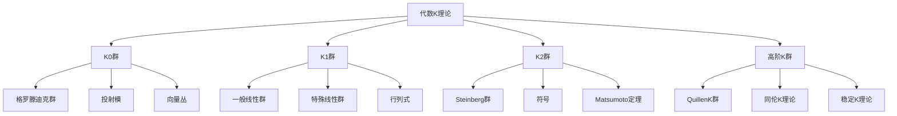

# 8. 代数K理论 / Algebraic K-Theory

## 目录

- [8. 代数K理论 / Algebraic K-Theory](#8-代数k理论--algebraic-k-theory)
  - [目录](#目录)
  - [8.1 概述 / Overview](#81-概述--overview)
    - [8.1.1 核心概念](#811-核心概念)
  - [8.2 K0群 / K0 Groups](#82-k0群--k0-groups)
    - [8.2.1 格罗滕迪克群 / Grothendieck Group](#821-格罗滕迪克群--grothendieck-group)
    - [8.2.2 投射模 / Projective Modules](#822-投射模--projective-modules)
    - [8.2.3 向量丛 / Vector Bundles](#823-向量丛--vector-bundles)
  - [8.3 K1群 / K1 Groups](#83-k1群--k1-groups)
    - [8.3.1 一般线性群 / General Linear Group](#831-一般线性群--general-linear-group)
    - [8.3.2 特殊线性群 / Special Linear Group](#832-特殊线性群--special-linear-group)
    - [8.3.3 行列式 / Determinant](#833-行列式--determinant)
  - [8.4 K2群 / K2 Groups](#84-k2群--k2-groups)
    - [8.4.1 Steinberg群 / Steinberg Group](#841-steinberg群--steinberg-group)
    - [8.4.2 符号 / Symbols](#842-符号--symbols)
    - [8.4.3 Matsumoto定理 / Matsumoto's Theorem](#843-matsumoto定理--matsumotos-theorem)
  - [8.5 高阶K群 / Higher K-Groups](#85-高阶k群--higher-k-groups)
    - [8.5.1 QuillenK群 / Quillen K-Groups](#851-quillenk群--quillen-k-groups)
    - [8.5.2 同伦K理论 / Homotopy K-Theory](#852-同伦k理论--homotopy-k-theory)
    - [8.5.3 稳定K理论 / Stable K-Theory](#853-稳定k理论--stable-k-theory)
  - [8.6 形式化实现 / Formal Implementation](#86-形式化实现--formal-implementation)
    - [8.6.1 Lean 4 实现](#861-lean-4-实现)
    - [8.6.2 Haskell 实现](#862-haskell-实现)
  - [8.7 总结 / Summary](#87-总结--summary)
    - [8.7.1 核心要点](#871-核心要点)
    - [8.7.2 知识关联](#872-知识关联)
    - [8.7.3 进一步学习](#873-进一步学习)

## 8.1 概述 / Overview

代数K理论是现代代数几何和代数拓扑的重要分支，它研究环和代数几何对象的K群。代数K理论包括K0群、K1群、K2群和高阶K群等概念，为研究代数结构和几何对象提供了强大的工具。

### 8.1.1 核心概念



## 8.2 K0群 / K0 Groups

### 8.2.1 格罗滕迪克群 / Grothendieck Group

**定义**: 设 $R$ 是环，$K_0(R)$ 是 $R$ 的格罗滕迪克群，定义为：
$$K_0(R) = \text{Free Abelian Group on } [P] / \text{Relations}$$
其中 $[P]$ 是有限生成投射 $R$-模的同构类。

**性质**:

- 具有群结构
- 满足加法性质
- 与环的代数性质相关

**重要例子**:

1. **域**: $K_0(F) \cong \mathbb{Z}$
2. **局部环**: $K_0(R) \cong \mathbb{Z}$
3. **多项式环**: $K_0(R[X]) \cong K_0(R)$

### 8.2.2 投射模 / Projective Modules

**定义**: 设 $R$ 是环，$P$ 是 $R$-模，$P$ 是投射的当且仅当 $P$ 是自由模的直和项。

**性质**:

- 具有提升性质
- 与自由模相关
- 在同调代数中重要

**重要例子**:

1. **自由模**: 所有自由模都是投射的
2. **主理想环**: 所有有限生成模都是投射的
3. **诺特环**: 有限生成投射模是自由的

### 8.2.3 向量丛 / Vector Bundles

**定义**: 设 $X$ 是拓扑空间，向量丛是局部平凡的纤维丛，纤维是向量空间。

**性质**:

- 具有群结构
- 与K0群相关
- 在代数几何中重要

**重要例子**:

1. **平凡丛**: $X \times \mathbb{R}^n$
2. **切丛**: 流形的切丛
3. **余切丛**: 流形的余切丛

## 8.3 K1群 / K1 Groups

### 8.3.1 一般线性群 / General Linear Group

**定义**: 设 $R$ 是环，一般线性群定义为：
$$\text{GL}_n(R) = \{A \in M_n(R) : \det(A) \in R^\times\}$$

**性质**:

- 具有群结构
- 与行列式相关
- 在代数中重要

**重要例子**:

1. **域**: $\text{GL}_n(F)$ 是域上的一般线性群
2. **局部环**: $\text{GL}_n(R)$ 是局部环上的一般线性群
3. **多项式环**: $\text{GL}_n(R[X])$ 是多项式环上的一般线性群

### 8.3.2 特殊线性群 / Special Linear Group

**定义**: 设 $R$ 是环，特殊线性群定义为：
$$\text{SL}_n(R) = \{A \in \text{GL}_n(R) : \det(A) = 1\}$$

**性质**:

- 是 $\text{GL}_n(R)$ 的正规子群
- 与行列式相关
- 在代数中重要

**重要例子**:

1. **域**: $\text{SL}_n(F)$ 是域上的特殊线性群
2. **局部环**: $\text{SL}_n(R)$ 是局部环上的特殊线性群
3. **多项式环**: $\text{SL}_n(R[X])$ 是多项式环上的特殊线性群

### 8.3.3 行列式 / Determinant

**定义**: 设 $A \in M_n(R)$，行列式定义为：
$$\det(A) = \sum_{\sigma \in S_n} \text{sgn}(\sigma) \prod_{i=1}^n a_{i,\sigma(i)}$$

**性质**:

- 具有乘法性质
- 与可逆性相关
- 在代数中重要

## 8.4 K2群 / K2 Groups

### 8.4.1 Steinberg群 / Steinberg Group

**定义**: 设 $R$ 是环，Steinberg群定义为：
$$\text{St}_n(R) = \langle x_{ij}(a) : 1 \leq i \neq j \leq n, a \in R \rangle / \text{Relations}$$

**性质**:

- 具有群结构
- 与特殊线性群相关
- 在代数中重要

**重要例子**:

1. **域**: $\text{St}_n(F)$ 是域上的Steinberg群
2. **局部环**: $\text{St}_n(R)$ 是局部环上的Steinberg群
3. **多项式环**: $\text{St}_n(R[X])$ 是多项式环上的Steinberg群

### 8.4.2 符号 / Symbols

**定义**: 设 $R$ 是环，符号定义为：
$$\{a, b\} = \text{image of } (a, b) \text{ in } K_2(R)$$

**性质**:

- 具有双线性性质
- 满足Steinberg关系
- 在代数中重要

**重要例子**:

1. **域**: $\{a, b\}$ 是域上的符号
2. **局部环**: $\{a, b\}$ 是局部环上的符号
3. **多项式环**: $\{a, b\}$ 是多项式环上的符号

### 8.4.3 Matsumoto定理 / Matsumoto's Theorem

**定理**: 设 $F$ 是域，则：
$$K_2(F) = \text{Free Abelian Group on } \{a, b\} / \text{Steinberg Relations}$$

**应用**:

- 计算域的K2群
- 研究符号的性质
- 在代数几何中应用

## 8.5 高阶K群 / Higher K-Groups

### 8.5.1 QuillenK群 / Quillen K-Groups

**定义**: 设 $R$ 是环，QuillenK群定义为：
$$K_n(R) = \pi_n(B\text{GL}(R)^+)$$

**性质**:

- 具有群结构
- 与同伦论相关
- 在代数中重要

**重要例子**:

1. **域**: $K_n(F)$ 是域的QuillenK群
2. **局部环**: $K_n(R)$ 是局部环的QuillenK群
3. **多项式环**: $K_n(R[X])$ 是多项式环的QuillenK群

### 8.5.2 同伦K理论 / Homotopy K-Theory

**定义**: 设 $R$ 是环，同伦K理论定义为：
$$KH_n(R) = \pi_n(\text{holim } K(R[X_1, \ldots, X_n]))$$

**性质**:

- 具有同伦不变性
- 与代数K理论相关
- 在代数几何中重要

**重要例子**:

1. **域**: $KH_n(F)$ 是域的同伦K理论
2. **局部环**: $KH_n(R)$ 是局部环的同伦K理论
3. **多项式环**: $KH_n(R[X])$ 是多项式环的同伦K理论

### 8.5.3 稳定K理论 / Stable K-Theory

**定义**: 设 $R$ 是环，稳定K理论定义为：
$$K_n^s(R) = \lim_{k \to \infty} K_{n+k}(\text{GL}_k(R))$$

**性质**:

- 具有稳定性
- 与代数K理论相关
- 在代数几何中重要

**重要例子**:

1. **域**: $K_n^s(F)$ 是域的稳定K理论
2. **局部环**: $K_n^s(R)$ 是局部环的稳定K理论
3. **多项式环**: $K_n^s(R[X])$ 是多项式环的稳定K理论

## 8.6 形式化实现 / Formal Implementation

### 8.6.1 Lean 4 实现

```lean
-- K0群
def K0Group (R : Ring) : AbGroup :=
  FreeAbelianGroup [P] / Relations where
  [P] := IsomorphismClass (FiniteGeneratedProjective R)
  Relations := AdditivityRelations

-- K1群
def K1Group (R : Ring) : AbGroup :=
  GL(R) / [GL(R), GL(R)] where
  GL(R) := GeneralLinearGroup R
  [GL(R), GL(R)] := CommutatorSubgroup GL(R)

-- K2群
def K2Group (R : Ring) : AbGroup :=
  St(R) / Relations where
  St(R) := SteinbergGroup R
  Relations := SteinbergRelations

-- 高阶K群
def HigherKGroup (R : Ring) (n : ℕ) : AbGroup :=
  π_n (BGL(R)^+) where
  BGL(R)^+ := PlusConstruction (BGL R)
```

### 8.6.2 Haskell 实现

```haskell
-- K0群
k0Group :: Ring -> AbGroup
k0Group r = freeAbelianGroup [p] `quotient` relations where
  [p] = isomorphismClass (finiteGeneratedProjective r)
  relations = additivityRelations

-- K1群
k1Group :: Ring -> AbGroup
k1Group r = gl r `quotient` commutatorSubgroup (gl r) where
  gl r = generalLinearGroup r

-- K2群
k2Group :: Ring -> AbGroup
k2Group r = st r `quotient` relations where
  st r = steinbergGroup r
  relations = steinbergRelations

-- 高阶K群
higherKGroup :: Ring -> Int -> AbGroup
higherKGroup r n = pi_n (plusConstruction (bgl r)) where
  bgl r = classifyingSpace (generalLinearGroup r)
```

## 8.7 总结 / Summary

### 8.7.1 核心要点

1. **K0群** 为环提供了基本的代数不变量
2. **K1群** 为环提供了线性代数不变量
3. **K2群** 为环提供了符号不变量
4. **高阶K群** 为环提供了同伦论不变量

### 8.7.2 知识关联

- 与[代数几何高级主题](01-代数几何高级主题.md)的概形理论相联系
- 与[同伦论高级主题](02-同伦论高级主题.md)的稳定同伦论相呼应
- 与[高阶同伦论](07-高阶同伦论.md)的同伦群相结合

### 8.7.3 进一步学习

1. **更高级的主题**:
   - 代数K理论的应用
   - 几何K理论
   - 拓扑K理论

2. **应用领域**:
   - 代数几何
   - 代数拓扑
   - 数论

---

**相关文档**:

- [代数几何高级主题](01-代数几何高级主题.md)
- [同伦论高级主题](02-同伦论高级主题.md)
- [高阶同伦论](07-高阶同伦论.md)
