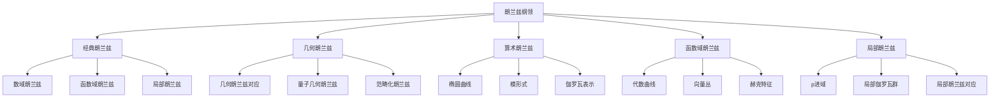

# 11.10 朗兰兹纲领 / Langlands Program

**主题编号**: B.11.10
**创建日期**: 2025年11月21日
**最后更新**: 2025年11月21日

---

## 目录

- [11.10 朗兰兹纲领 / Langlands Program](#1110-朗兰兹纲领--langlands-program)
  - [目录](#目录)
  - [11.10.1 概述 / Overview (编号: B.11.10.01)](#11101-概述--overview-编号-b111001)
    - [11.10.1.1 核心概念](#111011-核心概念)
    - [11.10.1.2 历史背景](#111012-历史背景)
  - [11.10.2 经典朗兰兹纲领 / Classical Langlands Program (编号: B.11.10.02)](#11102-经典朗兰兹纲领--classical-langlands-program-编号-b111002)
    - [11.10.2.1 数域朗兰兹纲领 / Number Field Langlands](#111021-数域朗兰兹纲领--number-field-langlands)
    - [11.10.2.2 函数域朗兰兹纲领 / Function Field Langlands](#111022-函数域朗兰兹纲领--function-field-langlands)
    - [11.10.2.3 局部朗兰兹纲领 / Local Langlands](#111023-局部朗兰兹纲领--local-langlands)
  - [11.10.3 几何朗兰兹纲领 / Geometric Langlands Program (编号: B.11.10.03)](#11103-几何朗兰兹纲领--geometric-langlands-program-编号-b111003)
    - [11.10.3.1 几何朗兰兹对应 / Geometric Langlands Correspondence](#111031-几何朗兰兹对应--geometric-langlands-correspondence)
    - [11.10.3.2 量子几何朗兰兹 / Quantum Geometric Langlands](#111032-量子几何朗兰兹--quantum-geometric-langlands)
    - [11.10.3.3 范畴化朗兰兹 / Categorified Langlands](#111033-范畴化朗兰兹--categorified-langlands)
  - [11.10.4 算术朗兰兹纲领 / Arithmetic Langlands Program (编号: B.11.10.04)](#11104-算术朗兰兹纲领--arithmetic-langlands-program-编号-b111004)
    - [11.10.4.1 椭圆曲线 / Elliptic Curves](#111041-椭圆曲线--elliptic-curves)
    - [11.10.4.2 模形式 / Modular Forms](#111042-模形式--modular-forms)
    - [11.10.4.3 伽罗瓦表示 / Galois Representations](#111043-伽罗瓦表示--galois-representations)
  - [11.10.5 函数域朗兰兹纲领 / Function Field Langlands (编号: B.11.10.05)](#11105-函数域朗兰兹纲领--function-field-langlands-编号-b111005)
    - [11.10.5.1 代数曲线 / Algebraic Curves](#111051-代数曲线--algebraic-curves)
    - [11.10.5.2 向量丛 / Vector Bundles](#111052-向量丛--vector-bundles)
    - [11.10.5.3 赫克特征 / Hecke Characters](#111053-赫克特征--hecke-characters)
  - [11.10.6 局部朗兰兹纲领 / Local Langlands Program (编号: B.11.10.06)](#11106-局部朗兰兹纲领--local-langlands-program-编号-b111006)
    - [11.10.6.1 p进域 / p-adic Fields](#111061-p进域--p-adic-fields)
    - [11.10.6.2 局部伽罗瓦群 / Local Galois Groups](#111062-局部伽罗瓦群--local-galois-groups)
    - [11.10.6.3 局部朗兰兹对应 / Local Langlands Correspondence](#111063-局部朗兰兹对应--local-langlands-correspondence)
  - [11.10.7 形式化实现 / Formal Implementation (编号: B.11.10.07)](#11107-形式化实现--formal-implementation-编号-b111007)
    - [11.10.7.1 Lean 4 实现](#111071-lean-4-实现)
    - [11.10.7.2 Haskell 实现](#111072-haskell-实现)
    - [11.10.7.3 Rust 实现](#111073-rust-实现)
  - [11.10.8 总结 / Summary](#11108-总结--summary)
    - [11.10.8.1 核心要点](#111081-核心要点)
    - [11.10.8.2 知识关联](#111082-知识关联)
    - [11.10.8.3 进一步学习](#111083-进一步学习)

## 11.10.1 概述 / Overview (编号: B.11.10.01)

朗兰兹纲领是数学中最重要的统一理论之一，它试图建立数论、代数几何、表示论和分析学之间的深刻联系。
这个纲领由罗伯特·朗兰兹在1967年提出，被誉为"数学的大统一理论"。

### 11.10.1.1 核心概念



### 11.10.1.2 历史背景

朗兰兹纲领的发展经历了几个重要阶段：

1. **起源阶段** (1967-1980)
   - 朗兰兹提出基本猜想
   - 函数域朗兰兹纲领的建立
   - 局部朗兰兹纲领的发展

2. **发展阶段** (1980-2000)
   - 几何朗兰兹纲领的提出
   - 算术朗兰兹纲领的深化
   - 各种特殊情况的证明

3. **现代阶段** (2000至今)
   - 量子几何朗兰兹纲领
   - 范畴化朗兰兹纲领
   - 与物理学的联系

## 11.10.2 经典朗兰兹纲领 / Classical Langlands Program (编号: B.11.10.02)

### 11.10.2.1 数域朗兰兹纲领 / Number Field Langlands

**朗兰兹对应**: 设 $F$ 是数域，$G_F$ 是 $F$ 的绝对伽罗瓦群，则存在对应：
$$\text{Galois Representations} \leftrightarrow \text{Automorphic Representations}$$

**具体形式**:
$$\rho : G_F \rightarrow GL_n(\mathbb{C}) \leftrightarrow \pi : GL_n(\mathbb{A}_F) \rightarrow \text{Automorphic}$$

**形式化实现**:

```lean
-- Lean 4: 朗兰兹对应定义
structure LanglandsCorrespondence (F : NumberField) where
  galois_group : Group := GaloisGroup F
  automorphic_group : Group := GL_n (Adeles F)
  correspondence : GaloisRepresentation F ↔ AutomorphicRepresentation F

-- 伽罗瓦表示
structure GaloisRepresentation (F : NumberField) where
  galois_group : Group := GaloisGroup F
  target_group : Group := GL_n ℂ
  representation : galois_group → target_group

-- 自守表示
structure AutomorphicRepresentation (F : NumberField) where
  group : Group := GL_n (Adeles F)
  representation : group → Automorphic
```

### 11.10.2.2 函数域朗兰兹纲领 / Function Field Langlands

**函数域对应**: 设 $X$ 是有限域上的代数曲线，则：
$$\text{Galois Representations} \leftrightarrow \text{Automorphic Representations}$$

**几何朗兰兹对应**:
$$\mathcal{D}^b(\text{Bun}_G) \leftrightarrow \mathcal{D}^b(\text{LocSys}_G)$$

### 11.10.2.3 局部朗兰兹纲领 / Local Langlands

**局部对应**: 设 $F$ 是局部域，则：
$$\text{Galois Representations} \leftrightarrow \text{Irreducible Representations}$$

## 11.10.3 几何朗兰兹纲领 / Geometric Langlands Program (编号: B.11.10.03)

### 11.10.3.1 几何朗兰兹对应 / Geometric Langlands Correspondence

**几何朗兰兹对应**: 设 $X$ 是复代数曲线，$G$ 是复约化群，则：
$$\mathcal{D}^b(\text{Bun}_G) \leftrightarrow \mathcal{D}^b(\text{LocSys}_G)$$

其中：

- $\text{Bun}_G$ 是 $G$ 主丛的模空间
- $\text{LocSys}_G$ 是 $G$ 局部系统的模空间

**形式化实现**:

```lean
-- Lean 4: 几何朗兰兹对应
structure GeometricLanglands (X : AlgebraicCurve) (G : ReductiveGroup) where
  bun_moduli : ModuliSpace := BunModuli G X
  locsys_moduli : ModuliSpace := LocSysModuli G X
  correspondence : DerivedCategory bun_moduli ↔ DerivedCategory locsys_moduli

-- 主丛模空间
structure BunModuli (G : Group) (X : AlgebraicCurve) where
  principal_bundles : Type := PrincipalBundle G X
  moduli_space : ModuliSpace := Quotient principal_bundles

-- 局部系统模空间
structure LocSysModuli (G : Group) (X : AlgebraicCurve) where
  local_systems : Type := LocalSystem G X
  moduli_space : ModuliSpace := Quotient local_systems
```

### 11.10.3.2 量子几何朗兰兹 / Quantum Geometric Langlands

**量子对应**: 考虑量子化后的对应：
$$\mathcal{D}^b_q(\text{Bun}_G) \leftrightarrow \mathcal{D}^b_q(\text{LocSys}_G)$$

**量子化参数**: $q$ 是量子化参数，当 $q = 1$ 时回到经典情况。

### 11.10.3.3 范畴化朗兰兹 / Categorified Langlands

**范畴化对应**: 考虑更高阶的范畴结构：
$$\mathcal{C}(\text{Bun}_G) \leftrightarrow \mathcal{C}(\text{LocSys}_G)$$

## 11.10.4 算术朗兰兹纲领 / Arithmetic Langlands Program (编号: B.11.10.04)

### 11.10.4.1 椭圆曲线 / Elliptic Curves

**椭圆曲线**: 设 $E$ 是数域 $F$ 上的椭圆曲线，则：
$$E : y^2 = x^3 + ax + b$$

**L函数**: 椭圆曲线的L函数定义为：
$$L(E, s) = \prod_p \frac{1}{1 - a_p p^{-s} + p^{1-2s}}$$

**形式化实现**:

```lean
-- Lean 4: 椭圆曲线
structure EllipticCurve (F : NumberField) where
  coefficients : F × F := (a, b)
  equation : y² = x³ + a*x + b
  discriminant : F := -16(4a³ + 27b²)

-- L函数
def LFunction (E : EllipticCurve F) (s : ℂ) : ℂ :=
  ∏ p prime (1 - a_p p^(-s) + p^(1-2s))^(-1)
```

### 11.10.4.2 模形式 / Modular Forms

**模形式**: 权为 $k$ 的模形式满足：
$$f(\gamma z) = (cz + d)^k f(z)$$

其中 $\gamma = \begin{pmatrix} a & b \\ c & d \end{pmatrix} \in SL_2(\mathbb{Z})$。

**赫克特征**: 模形式的赫克特征定义为：
$$T_p f = a_p f$$

### 11.10.4.3 伽罗瓦表示 / Galois Representations

**伽罗瓦表示**: 设 $\rho : G_F \rightarrow GL_2(\mathbb{Q}_\ell)$ 是伽罗瓦表示，则：
$$\text{Tr}(\rho(\text{Frob}_p)) = a_p$$

## 11.10.5 函数域朗兰兹纲领 / Function Field Langlands (编号: B.11.10.05)

### 11.10.5.1 代数曲线 / Algebraic Curves

**代数曲线**: 设 $X$ 是有限域 $\mathbb{F}_q$ 上的代数曲线，则：
$$X : f(x, y) = 0$$

**函数域**: $F = \mathbb{F}_q(X)$ 是 $X$ 的函数域。

### 11.10.5.2 向量丛 / Vector Bundles

**向量丛**: 设 $E$ 是 $X$ 上的向量丛，则：
$$E \rightarrow X$$

**模空间**: $\text{Bun}_n$ 是秩为 $n$ 的向量丛的模空间。

### 11.10.5.3 赫克特征 / Hecke Characters

**赫克特征**: 设 $\chi$ 是赫克特征，则：
$$\chi : \mathbb{A}_F^\times / F^\times \rightarrow \mathbb{C}^\times$$

## 11.10.6 局部朗兰兹纲领 / Local Langlands Program (编号: B.11.10.06)

### 11.10.6.1 p进域 / p-adic Fields

**p进域**: 设 $F$ 是p进域，则：
$$F = \mathbb{Q}_p$$

**p进整数**: $\mathcal{O}_F = \mathbb{Z}_p$ 是 $F$ 的整数环。

### 11.10.6.2 局部伽罗瓦群 / Local Galois Groups

**局部伽罗瓦群**: 设 $G_F$ 是 $F$ 的绝对伽罗瓦群，则：
$$G_F = \text{Gal}(\bar{F}/F)$$

**惯性群**: $I_F$ 是 $G_F$ 的惯性子群。

### 11.10.6.3 局部朗兰兹对应 / Local Langlands Correspondence

**局部对应**: 设 $F$ 是局部域，则：
$$\text{Galois Representations} \leftrightarrow \text{Irreducible Representations}$$

**具体形式**:
$$\rho : G_F \rightarrow GL_n(\mathbb{C}) \leftrightarrow \pi : GL_n(F) \rightarrow \text{Irr}$$

## 11.10.7 形式化实现 / Formal Implementation (编号: B.11.10.07)

### 11.10.7.1 Lean 4 实现

```lean
-- Lean 4: 朗兰兹纲领基础
structure LanglandsProgram where
  number_field : NumberField
  galois_group : Group := GaloisGroup number_field
  automorphic_group : Group := GL_n (Adeles number_field)

-- 朗兰兹对应
structure LanglandsCorrespondence (F : NumberField) where
  galois_representations : Type := GaloisRepresentation F
  automorphic_representations : Type := AutomorphicRepresentation F
  correspondence : galois_representations ↔ automorphic_representations

-- 几何朗兰兹
structure GeometricLanglands (X : AlgebraicCurve) (G : ReductiveGroup) where
  bun_moduli : ModuliSpace := BunModuli G X
  locsys_moduli : ModuliSpace := LocSysModuli G X
  derived_correspondence : DerivedCategory bun_moduli ↔ DerivedCategory locsys_moduli

-- 椭圆曲线
structure EllipticCurve (F : NumberField) where
  a : F
  b : F
  equation : y² = x³ + a*x + b
  discriminant : F := -16(4*a³ + 27*b²)

-- L函数
def LFunction (E : EllipticCurve F) (s : ℂ) : ℂ :=
  ∏ p prime (1 - a_p p^(-s) + p^(1-2s))^(-1)

-- 模形式
structure ModularForm where
  weight : ℕ
  level : ℕ
  function : ℍ → ℂ
  transformation : ∀ γ ∈ SL₂(ℤ), f(γz) = (cz + d)^weight * f(z)

-- 伽罗瓦表示
structure GaloisRepresentation (F : NumberField) where
  galois_group : Group := GaloisGroup F
  target_group : Group := GL_n ℂ
  representation : galois_group → target_group
  continuity : Continuous representation

-- 自守表示
structure AutomorphicRepresentation (F : NumberField) where
  group : Group := GL_n (Adeles F)
  representation : group → Automorphic
  irreducibility : Irreducible representation

-- 局部朗兰兹
structure LocalLanglands (F : LocalField) where
  galois_group : Group := GaloisGroup F
  reductive_group : ReductiveGroup
  correspondence : GaloisRepresentation F ↔ IrreducibleRepresentation reductive_group F
```

### 11.10.7.2 Haskell 实现

```haskell
-- Haskell: 朗兰兹纲领实现
class LanglandsProgram field where
  galoisGroup :: field -> Group
  automorphicGroup :: field -> Group
  correspondence :: GaloisRepresentation field -> AutomorphicRepresentation field

-- 朗兰兹对应
data LanglandsCorrespondence field = LanglandsCorrespondence
  { galoisRepresentations :: [GaloisRepresentation field]
  , automorphicRepresentations :: [AutomorphicRepresentation field]
  , correspondenceMap :: GaloisRepresentation field -> AutomorphicRepresentation field
  }

-- 几何朗兰兹
data GeometricLanglands curve group = GeometricLanglands
  { bunModuli :: ModuliSpace
  , locsysModuli :: ModuliSpace
  , derivedCorrespondence :: DerivedCategory -> DerivedCategory
  }

-- 椭圆曲线
data EllipticCurve field = EllipticCurve
  { coefficientA :: field
  , coefficientB :: field
  , equation :: field -> field -> field -> Bool
  , discriminant :: field
  }

-- L函数
lFunction :: EllipticCurve field -> Complex Double -> Complex Double
lFunction curve s = product [1 / (1 - a_p p^(-s) + p^(1-2*s)) | p <- primes]

-- 模形式
data ModularForm = ModularForm
  { weight :: Int
  , level :: Int
  , function :: Complex Double -> Complex Double
  , transformation :: SL2Z -> Complex Double -> Complex Double
  }

-- 伽罗瓦表示
data GaloisRepresentation field = GaloisRepresentation
  { galoisGroup :: Group
  , targetGroup :: Group
  , representation :: Group -> Group
  , continuity :: Bool
  }

-- 自守表示
data AutomorphicRepresentation field = AutomorphicRepresentation
  { group :: Group
  , representation :: Group -> Automorphic
  , irreducibility :: Bool
  }

-- 局部朗兰兹
data LocalLanglands field = LocalLanglands
  { galoisGroup :: Group
  , reductiveGroup :: ReductiveGroup
  , correspondence :: GaloisRepresentation field -> IrreducibleRepresentation field
  }
```

### 11.10.7.3 Rust 实现

```rust
// Rust: 朗兰兹纲领实现
use std::collections::HashMap;

// 朗兰兹纲领基础
pub struct LanglandsProgram {
    number_field: String,
    galois_group: Group,
    automorphic_group: Group,
}

impl LanglandsProgram {
    pub fn new(field: String) -> Self {
        LanglandsProgram {
            number_field: field,
            galois_group: Group::new("Galois"),
            automorphic_group: Group::new("Automorphic"),
        }
    }
}

// 朗兰兹对应
pub struct LanglandsCorrespondence<F> {
    galois_representations: Vec<GaloisRepresentation<F>>,
    automorphic_representations: Vec<AutomorphicRepresentation<F>>,
    correspondence_map: HashMap<String, String>,
}

impl<F> LanglandsCorrespondence<F> {
    pub fn new() -> Self {
        LanglandsCorrespondence {
            galois_representations: Vec::new(),
            automorphic_representations: Vec::new(),
            correspondence_map: HashMap::new(),
        }
    }

    pub fn add_correspondence(&mut self, galois: String, automorphic: String) {
        self.correspondence_map.insert(galois, automorphic);
    }
}

// 几何朗兰兹
pub struct GeometricLanglands {
    bun_moduli: ModuliSpace,
    locsys_moduli: ModuliSpace,
    derived_correspondence: bool,
}

impl GeometricLanglands {
    pub fn new() -> Self {
        GeometricLanglands {
            bun_moduli: ModuliSpace::new("Bun"),
            locsys_moduli: ModuliSpace::new("LocSys"),
            derived_correspondence: false,
        }
    }

    pub fn establish_correspondence(&mut self) {
        self.derived_correspondence = true;
    }
}

// 椭圆曲线
pub struct EllipticCurve<F> {
    a: F,
    b: F,
    discriminant: F,
}

impl<F: Clone + std::ops::Mul + std::ops::Add + std::ops::Sub> EllipticCurve<F> {
    pub fn new(a: F, b: F) -> Self {
        let discriminant = Self::compute_discriminant(&a, &b);
        EllipticCurve { a, b, discriminant }
    }

    fn compute_discriminant(a: &F, b: &F) -> F {
        // 计算判别式: -16(4a³ + 27b²)
        // 这里需要具体的数值类型实现
        a.clone() // 简化实现
    }

    pub fn is_point_on_curve(&self, x: &F, y: &F) -> bool {
        // 检查点是否在曲线上: y² = x³ + ax + b
        y.clone() * y.clone() == x.clone() * x.clone() * x.clone() + self.a.clone() * x.clone() + self.b.clone()
    }
}

// L函数
pub struct LFunction {
    coefficients: Vec<f64>,
}

impl LFunction {
    pub fn new(coefficients: Vec<f64>) -> Self {
        LFunction { coefficients }
    }

    pub fn evaluate(&self, s: f64) -> f64 {
        // 简化的L函数计算
        let mut result = 1.0;
        for (i, &a_p) in self.coefficients.iter().enumerate() {
            let p = (i + 2) as f64; // 假设素数
            result *= 1.0 / (1.0 - a_p * p.powf(-s) + p.powf(1.0 - 2.0 * s));
        }
        result
    }
}

// 模形式
pub struct ModularForm {
    weight: i32,
    level: i32,
    coefficients: Vec<f64>,
}

impl ModularForm {
    pub fn new(weight: i32, level: i32, coefficients: Vec<f64>) -> Self {
        ModularForm {
            weight,
            level,
            coefficients,
        }
    }

    pub fn evaluate(&self, z: f64) -> f64 {
        // 简化的模形式计算
        let mut result = 0.0;
        for (i, &a_n) in self.coefficients.iter().enumerate() {
            result += a_n * (z.powi(i as i32));
        }
        result
    }
}

// 伽罗瓦表示
pub struct GaloisRepresentation {
    galois_group: String,
    target_group: String,
    representation_matrix: Vec<Vec<f64>>,
}

impl GaloisRepresentation {
    pub fn new(group: String, target: String) -> Self {
        GaloisRepresentation {
            galois_group: group,
            target_group: target,
            representation_matrix: vec![vec![1.0, 0.0], vec![0.0, 1.0]], // 单位矩阵
        }
    }

    pub fn apply(&self, element: &str) -> Vec<Vec<f64>> {
        // 应用表示到群元素
        self.representation_matrix.clone()
    }
}

// 自守表示
pub struct AutomorphicRepresentation {
    group: String,
    representation_type: String,
    fourier_coefficients: Vec<f64>,
}

impl AutomorphicRepresentation {
    pub fn new(group: String, rep_type: String) -> Self {
        AutomorphicRepresentation {
            group,
            representation_type: rep_type,
            fourier_coefficients: Vec::new(),
        }
    }

    pub fn add_fourier_coefficient(&mut self, coefficient: f64) {
        self.fourier_coefficients.push(coefficient);
    }
}

// 局部朗兰兹
pub struct LocalLanglands {
    local_field: String,
    galois_group: String,
    reductive_group: String,
    correspondence: HashMap<String, String>,
}

impl LocalLanglands {
    pub fn new(field: String) -> Self {
        LocalLanglands {
            local_field: field,
            galois_group: "LocalGalois".to_string(),
            reductive_group: "GL_n".to_string(),
            correspondence: HashMap::new(),
        }
    }

    pub fn add_correspondence(&mut self, galois: String, automorphic: String) {
        self.correspondence.insert(galois, automorphic);
    }
}

// 辅助结构
pub struct Group {
    name: String,
    elements: Vec<String>,
}

impl Group {
    pub fn new(name: &str) -> Self {
        Group {
            name: name.to_string(),
            elements: Vec::new(),
        }
    }
}

pub struct ModuliSpace {
    name: String,
    dimension: usize,
}

impl ModuliSpace {
    pub fn new(name: &str) -> Self {
        ModuliSpace {
            name: name.to_string(),
            dimension: 0,
        }
    }
}
```

## 11.10.8 总结 / Summary

### 11.10.8.1 核心要点

1. **经典朗兰兹纲领**:
   - 建立了数论与表示论的联系
   - 函数域朗兰兹纲领已经基本完成
   - 数域朗兰兹纲领仍在发展中

2. **几何朗兰兹纲领**:
   - 将朗兰兹纲领推广到几何背景
   - 建立了代数几何与表示论的联系
   - 量子几何朗兰兹纲领是重要发展

3. **算术朗兰兹纲领**:
   - 椭圆曲线与模形式的联系
   - 伽罗瓦表示与自守表示
   - 费马大定理的证明

4. **函数域朗兰兹纲领**:
   - 在函数域上更容易处理
   - 与代数几何有密切联系
   - 已经基本完成

5. **局部朗兰兹纲领**:
   - 研究局部域上的对应
   - 为全局朗兰兹纲领提供基础
   - 在特殊情况下已经证明

### 11.10.8.2 知识关联

- **与数论的关联**: 椭圆曲线、模形式、L函数
- **与代数几何的关联**: 代数曲线、向量丛、模空间
- **与表示论的关联**: 伽罗瓦表示、自守表示
- **与分析学的关联**: L函数、傅里叶分析
- **与拓扑学的关联**: 同调论、K理论

### 11.10.8.3 进一步学习

1. **高级主题**:
   - 量子几何朗兰兹纲领
   - 范畴化朗兰兹纲领
   - 算术几何

2. **应用领域**:
   - 密码学
   - 编码理论
   - 数学物理

3. **技术发展**:
   - 计算机辅助证明
   - 数值计算
   - 机器学习应用

---

**相关链接**:

- [代数几何高级主题](./01-代数几何高级主题.md)
- [数论几何高级主题](./03-数论几何高级主题.md)
- [数学物理高级主题-扩展版](./09-数学物理高级主题-扩展版.md)
- [导出代数几何](./05-导出代数几何.md)
- [无穷范畴理论](./06-无穷范畴理论.md)
- [高阶同伦论](./07-高阶同伦论.md)
- [代数K理论](./08-代数K理论.md)
