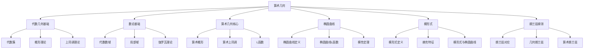

# 11. 算术几何 / Arithmetic Geometry

## 目录

- [11. 算术几何 / Arithmetic Geometry](#11-算术几何--arithmetic-geometry)
  - [目录](#目录)
  - [11.1 概述 / Overview](#111-概述--overview)
    - [11.1.1 核心概念](#1111-核心概念)
    - [11.1.2 历史发展](#1112-历史发展)
  - [11.2 代数几何基础 / Algebraic Geometry Foundations](#112-代数几何基础--algebraic-geometry-foundations)
    - [11.2.1 代数簇 / Algebraic Varieties](#1121-代数簇--algebraic-varieties)
    - [11.2.2 概形理论 / Scheme Theory](#1122-概形理论--scheme-theory)
    - [11.2.3 上同调理论 / Cohomology Theory](#1123-上同调理论--cohomology-theory)
  - [11.3 数论基础 / Number Theory Foundations](#113-数论基础--number-theory-foundations)
    - [11.3.1 代数数域 / Algebraic Number Fields](#1131-代数数域--algebraic-number-fields)
    - [11.3.2 局部域 / Local Fields](#1132-局部域--local-fields)
    - [11.3.3 伽罗瓦理论 / Galois Theory](#1133-伽罗瓦理论--galois-theory)
  - [11.4 算术几何核心 / Core of Arithmetic Geometry](#114-算术几何核心--core-of-arithmetic-geometry)
    - [11.4.1 算术概形 / Arithmetic Schemes](#1141-算术概形--arithmetic-schemes)
    - [11.4.2 算术上同调 / Arithmetic Cohomology](#1142-算术上同调--arithmetic-cohomology)
    - [11.4.3 L函数 / L-Functions](#1143-l函数--l-functions)
  - [11.5 椭圆曲线 / Elliptic Curves](#115-椭圆曲线--elliptic-curves)
    - [11.5.1 椭圆曲线定义 / Elliptic Curve Definition](#1151-椭圆曲线定义--elliptic-curve-definition)
    - [11.5.2 椭圆曲线的L函数 / L-Functions of Elliptic Curves](#1152-椭圆曲线的l函数--l-functions-of-elliptic-curves)
    - [11.5.3 模性定理 / Modularity Theorem](#1153-模性定理--modularity-theorem)
  - [11.6 模形式 / Modular Forms](#116-模形式--modular-forms)
    - [11.6.1 模形式定义 / Modular Form Definition](#1161-模形式定义--modular-form-definition)
    - [11.6.2 赫克特征 / Hecke Characters](#1162-赫克特征--hecke-characters)
    - [11.6.3 模形式与椭圆曲线 / Modular Forms and Elliptic Curves](#1163-模形式与椭圆曲线--modular-forms-and-elliptic-curves)
  - [11.7 朗兰兹纲领 / Langlands Program](#117-朗兰兹纲领--langlands-program)
    - [11.7.1 朗兰兹对应 / Langlands Correspondence](#1171-朗兰兹对应--langlands-correspondence)
    - [11.7.2 几何朗兰兹 / Geometric Langlands](#1172-几何朗兰兹--geometric-langlands)
    - [11.7.3 算术朗兰兹 / Arithmetic Langlands](#1173-算术朗兰兹--arithmetic-langlands)
  - [11.8 形式化实现 / Formal Implementation](#118-形式化实现--formal-implementation)
    - [11.8.1 Lean 4 实现](#1181-lean-4-实现)
    - [11.8.2 Haskell 实现](#1182-haskell-实现)
    - [11.8.3 Rust 实现](#1183-rust-实现)
  - [11.9 总结 / Summary](#119-总结--summary)
    - [11.9.1 核心要点](#1191-核心要点)
    - [11.9.2 知识关联](#1192-知识关联)
    - [11.9.3 进一步学习](#1193-进一步学习)

## 11.1 概述 / Overview

算术几何是数学中一个重要的交叉领域，它将代数几何与数论相结合，研究代数几何对象在数域上的算术性质。
这个领域为现代数论提供了强大的几何工具，也为代数几何提供了深刻的算术洞察。

### 11.1.1 核心概念



### 11.1.2 历史发展

算术几何的发展经历了几个重要阶段：

1. **古典阶段** (19世纪)
   - 椭圆曲线理论
   - 模形式理论
   - 代数数论基础

2. **现代阶段** (20世纪中叶)
   - 概形理论的发展
   - 上同调理论的应用
   - 朗兰兹纲领的提出

3. **当代阶段** (20世纪末至今)
   - 费马大定理的证明
   - 模性定理的建立
   - 几何朗兰兹纲领的发展

## 11.2 代数几何基础 / Algebraic Geometry Foundations

### 11.2.1 代数簇 / Algebraic Varieties

**定义**: 设 $k$ 是域，$V \subset \mathbb{A}^n_k$ 是仿射代数簇，如果：
$$V = V(I) = \{P \in \mathbb{A}^n_k : f(P) = 0, \forall f \in I\}$$

其中 $I$ 是 $k[x_1, \ldots, x_n]$ 的理想。

**形式化实现**:

```lean
-- Lean 4: 代数簇定义
structure AlgebraicVariety (k : Field) where
  ambient_space : AffineSpace k n
  ideal : Ideal (PolynomialRing k n)
  variety : Set (AffineSpace k n) := {P | ∀ f ∈ ideal, f P = 0}

-- 仿射代数簇
structure AffineVariety (k : Field) extends AlgebraicVariety k where
  coordinate_ring : Ring := PolynomialRing k n / ideal
  function_field : Field := FieldOfFractions coordinate_ring
```

### 11.2.2 概形理论 / Scheme Theory

**定义**: 概形是局部环化空间 $(X, \mathcal{O}_X)$，其中：

- $X$ 是拓扑空间
- $\mathcal{O}_X$ 是 $X$ 上的结构层

**仿射概形**: 设 $A$ 是交换环，则：
$$\text{Spec}(A) = (X, \mathcal{O}_X)$$

其中 $X$ 是 $A$ 的素谱，$\mathcal{O}_X$ 是结构层。

### 11.2.3 上同调理论 / Cohomology Theory

**层上同调**: 设 $\mathcal{F}$ 是 $X$ 上的层，则：
$$H^i(X, \mathcal{F}) = R^i\Gamma(X, \mathcal{F})$$

**Čech上同调**: 设 $\mathcal{U} = \{U_i\}$ 是 $X$ 的开覆盖，则：
$$H^i(\mathcal{U}, \mathcal{F}) = \check{H}^i(\mathcal{U}, \mathcal{F})$$

## 11.3 数论基础 / Number Theory Foundations

### 11.3.1 代数数域 / Algebraic Number Fields

**定义**: 代数数域是 $\mathbb{Q}$ 的有限扩张 $K$，即：
$$K = \mathbb{Q}(\alpha_1, \ldots, \alpha_n)$$

其中 $\alpha_i$ 是代数数。

**整数环**: $K$ 的整数环 $\mathcal{O}_K$ 是 $K$ 中所有代数整数的集合。

**形式化实现**:

```lean
-- Lean 4: 代数数域
structure AlgebraicNumberField where
  base_field : Field := ℚ
  extension : Field
  degree : ℕ := [extension : base_field]
  ring_of_integers : Ring := AlgebraicIntegers extension

-- 整数环
structure RingOfIntegers (K : AlgebraicNumberField) where
  elements : Set K := {α ∈ K | IsAlgebraicInteger α}
  ring_structure : Ring elements
```

### 11.3.2 局部域 / Local Fields

**p进域**: 设 $p$ 是素数，则 $\mathbb{Q}_p$ 是 $\mathbb{Q}$ 的p进完备化。

**局部域**: 局部域是完备的离散赋值域，包括：

- p进域 $\mathbb{Q}_p$
- 有限域上的形式幂级数域 $\mathbb{F}_q((t))$

### 11.3.3 伽罗瓦理论 / Galois Theory

**伽罗瓦群**: 设 $K/F$ 是伽罗瓦扩张，则：
$$\text{Gal}(K/F) = \{\sigma : K \rightarrow K : \sigma|_F = \text{id}\}$$

**基本定理**: 存在一一对应：
$$\{\text{中间域}\} \leftrightarrow \{\text{子群}\}$$

## 11.4 算术几何核心 / Core of Arithmetic Geometry

### 11.4.1 算术概形 / Arithmetic Schemes

**定义**: 算术概形是概形 $X$ 配备到 $\text{Spec}(\mathbb{Z})$ 的态射：
$$X \rightarrow \text{Spec}(\mathbb{Z})$$

**纤维**: 设 $p$ 是素数，则 $X_p = X \times_{\mathbb{Z}} \mathbb{F}_p$ 是特征 $p$ 的纤维。

**形式化实现**:

```lean
-- Lean 4: 算术概形
structure ArithmeticScheme where
  scheme : Scheme
  morphism : scheme → Spec ℤ
  fibers : ∀ p prime, Scheme := scheme ×_ℤ Spec (𝔽_p)
  arithmetic_properties : ArithmeticProperties

-- 算术概形的性质
def ArithmeticSchemeProperties (X : ArithmeticScheme) : Prop :=
  -- 实现算术概形的各种性质
  sorry
```

### 11.4.2 算术上同调 / Arithmetic Cohomology

**étale上同调**: 设 $X$ 是概形，$\ell$ 是素数，则：
$$H^i_{\text{ét}}(X, \mathbb{Z}/\ell^n\mathbb{Z})$$

**ℓ进上同调**:
$$H^i_{\text{ét}}(X, \mathbb{Z}_\ell) = \lim_{\leftarrow n} H^i_{\text{ét}}(X, \mathbb{Z}/\ell^n\mathbb{Z})$$

### 11.4.3 L函数 / L-Functions

**定义**: 设 $X$ 是算术概形，则 $X$ 的L函数定义为：
$$L(X, s) = \prod_p \frac{1}{1 - a_p p^{-s} + \chi(p) p^{1-2s}}$$

其中 $a_p$ 是 $X_p$ 的点数，$\chi$ 是特征函数。

## 11.5 椭圆曲线 / Elliptic Curves

### 11.5.1 椭圆曲线定义 / Elliptic Curve Definition

**定义**: 椭圆曲线是光滑的射影曲线 $E$，具有：
$$E : y^2 = x^3 + ax + b$$

其中 $4a^3 + 27b^2 \neq 0$。

**群结构**: $E$ 上的点形成阿贝尔群，群运算为：
$$P + Q = R$$

其中 $R$ 是直线 $PQ$ 与 $E$ 的第三个交点。

**形式化实现**:

```lean
-- Lean 4: 椭圆曲线
structure EllipticCurve (k : Field) where
  coefficients : k × k := (a, b)
  discriminant : k := -16(4a³ + 27b²)
  equation : y² = x³ + a*x + b
  smoothness : discriminant ≠ 0
  
-- 群运算
def EllipticCurveAddition (E : EllipticCurve k) (P Q : E) : E :=
  -- 实现椭圆曲线加法
  sorry

-- 椭圆曲线群
instance : AddCommGroup (EllipticCurve k) where
  add := EllipticCurveAddition
  zero := PointAtInfinity
  neg := EllipticCurveNegation
```

### 11.5.2 椭圆曲线的L函数 / L-Functions of Elliptic Curves

**定义**: 设 $E$ 是数域 $K$ 上的椭圆曲线，则：
$$L(E, s) = \prod_p \frac{1}{1 - a_p p^{-s} + p^{1-2s}}$$

其中 $a_p = p + 1 - |E_p(\mathbb{F}_p)|$。

**函数方程**:
$$\Lambda(E, s) = N^{s/2}(2\pi)^{-s}\Gamma(s)L(E, s) = \pm \Lambda(E, 2-s)$$

### 11.5.3 模性定理 / Modularity Theorem

**模性定理**: 设 $E$ 是 $\mathbb{Q}$ 上的椭圆曲线，则存在权为2的模形式 $f$，使得：
$$L(E, s) = L(f, s)$$

## 11.6 模形式 / Modular Forms

### 11.6.1 模形式定义 / Modular Form Definition

**定义**: 权为 $k$ 的模形式是上半平面上的全纯函数 $f$，满足：
$$f(\gamma z) = (cz + d)^k f(z)$$

其中 $\gamma = \begin{pmatrix} a & b \\ c & d \end{pmatrix} \in SL_2(\mathbb{Z})$。

**形式化实现**:

```lean
-- Lean 4: 模形式
structure ModularForm where
  weight : ℕ
  level : ℕ
  function : ℍ → ℂ
  transformation : ∀ γ ∈ SL₂(ℤ), f(γz) = (cz + d)^weight * f(z)
  holomorphy : Holomorphic function
  growth_condition : BoundedAtInfinity function

-- 模形式空间
def ModularForms (k : ℕ) (N : ℕ) : VectorSpace ℂ :=
  {f : ModularForm | f.weight = k ∧ f.level = N}
```

### 11.6.2 赫克特征 / Hecke Characters

**赫克算子**: 设 $T_p$ 是赫克算子，则：
$$T_p f = \sum_{n=0}^{\infty} a_{pn} q^n + p^{k-1} \sum_{n=0}^{\infty} a_n q^{pn}$$

**赫克特征**: 模形式 $f$ 的赫克特征定义为：
$$T_p f = a_p f$$

### 11.6.3 模形式与椭圆曲线 / Modular Forms and Elliptic Curves

**对应关系**: 通过模性定理，椭圆曲线与模形式建立对应：
$$E \leftrightarrow f$$

其中 $L(E, s) = L(f, s)$。

## 11.7 朗兰兹纲领 / Langlands Program

### 11.7.1 朗兰兹对应 / Langlands Correspondence

**朗兰兹对应**: 设 $F$ 是数域，则存在对应：
$$\text{Galois Representations} \leftrightarrow \text{Automorphic Representations}$$

**具体形式**:
$$\rho : G_F \rightarrow GL_n(\mathbb{C}) \leftrightarrow \pi : GL_n(\mathbb{A}_F) \rightarrow \text{Automorphic}$$

### 11.7.2 几何朗兰兹 / Geometric Langlands

**几何朗兰兹对应**: 设 $X$ 是复代数曲线，$G$ 是复约化群，则：
$$\mathcal{D}^b(\text{Bun}_G) \leftrightarrow \mathcal{D}^b(\text{LocSys}_G)$$

### 11.7.3 算术朗兰兹 / Arithmetic Langlands

**算术朗兰兹**: 研究数域上的朗兰兹对应，包括：

- 椭圆曲线与模形式的对应
- 伽罗瓦表示与自守表示
- L函数与ζ函数

## 11.8 形式化实现 / Formal Implementation

### 11.8.1 Lean 4 实现

```lean
-- Lean 4: 算术几何基础
structure ArithmeticGeometry where
  algebraic_geometry : AlgebraicGeometry
  number_theory : NumberTheory
  arithmetic_schemes : ArithmeticScheme

-- 算术概形
structure ArithmeticScheme where
  scheme : Scheme
  morphism : scheme → Spec ℤ
  fibers : ∀ p prime, Scheme := scheme ×_ℤ Spec (𝔽_p)
  arithmetic_properties : ArithmeticProperties

-- 椭圆曲线
structure EllipticCurve (k : Field) where
  coefficients : k × k := (a, b)
  discriminant : k := -16(4a³ + 27b²)
  equation : y² = x³ + a*x + b
  smoothness : discriminant ≠ 0
  group_structure : AddCommGroup := EllipticCurveGroup

-- L函数
def LFunction (E : EllipticCurve ℚ) (s : ℂ) : ℂ :=
  ∏ p prime (1 - a_p p^(-s) + p^(1-2s))^(-1)

-- 模形式
structure ModularForm where
  weight : ℕ
  level : ℕ
  function : ℍ → ℂ
  transformation : ∀ γ ∈ SL₂(ℤ), f(γz) = (cz + d)^weight * f(z)
  fourier_expansion : f(z) = ∑ a_n q^n

-- 朗兰兹对应
structure LanglandsCorrespondence (F : NumberField) where
  galois_representations : Type := GaloisRepresentation F
  automorphic_representations : Type := AutomorphicRepresentation F
  correspondence : galois_representations ↔ automorphic_representations

-- 算术上同调
structure ArithmeticCohomology (X : ArithmeticScheme) where
  etale_cohomology : ∀ ℓ prime, Cohomology X ℤ_ℓ
  l_function : LFunction X
  functional_equation : FunctionalEquation l_function
```

### 11.8.2 Haskell 实现

```haskell
-- Haskell: 算术几何实现
class ArithmeticGeometry field where
  algebraicGeometry :: AlgebraicGeometry field
  numberTheory :: NumberTheory field
  arithmeticSchemes :: [ArithmeticScheme field]

-- 算术概形
data ArithmeticScheme field = ArithmeticScheme
  { scheme :: Scheme field
  , morphism :: Scheme field -> Spec Integer
  , fibers :: Integer -> Scheme field
  , arithmeticProperties :: ArithmeticProperties
  }

-- 椭圆曲线
data EllipticCurve field = EllipticCurve
  { coefficientA :: field
  , coefficientB :: field
  , discriminant :: field
  , equation :: field -> field -> field -> Bool
  , groupStructure :: AddCommGroup
  }

-- L函数
lFunction :: EllipticCurve Rational -> Complex Double -> Complex Double
lFunction curve s = product [1 / (1 - a_p p^(-s) + p^(1-2*s)) | p <- primes]

-- 模形式
data ModularForm = ModularForm
  { weight :: Int
  , level :: Int
  , function :: Complex Double -> Complex Double
  , transformation :: SL2Z -> Complex Double -> Complex Double
  , fourierExpansion :: [Complex Double]
  }

-- 朗兰兹对应
data LanglandsCorrespondence field = LanglandsCorrespondence
  { galoisRepresentations :: [GaloisRepresentation field]
  , automorphicRepresentations :: [AutomorphicRepresentation field]
  , correspondenceMap :: GaloisRepresentation field -> AutomorphicRepresentation field
  }

-- 算术上同调
data ArithmeticCohomology scheme = ArithmeticCohomology
  { etaleCohomology :: Integer -> Cohomology scheme
  , lFunction :: LFunction scheme
  , functionalEquation :: FunctionalEquation
  }
```

### 11.8.3 Rust 实现

```rust
// Rust: 算术几何实现
use std::collections::HashMap;

// 算术几何基础
pub struct ArithmeticGeometry<F> {
    algebraic_geometry: AlgebraicGeometry<F>,
    number_theory: NumberTheory<F>,
    arithmetic_schemes: Vec<ArithmeticScheme<F>>,
}

impl<F> ArithmeticGeometry<F> {
    pub fn new() -> Self {
        ArithmeticGeometry {
            algebraic_geometry: AlgebraicGeometry::new(),
            number_theory: NumberTheory::new(),
            arithmetic_schemes: Vec::new(),
        }
    }
}

// 算术概形
pub struct ArithmeticScheme<F> {
    scheme: Scheme<F>,
    morphism: fn(Scheme<F>) -> Spec<i32>,
    fibers: HashMap<i32, Scheme<F>>,
    arithmetic_properties: ArithmeticProperties,
}

impl<F> ArithmeticScheme<F> {
    pub fn new(scheme: Scheme<F>) -> Self {
        ArithmeticScheme {
            scheme,
            morphism: |s| Spec::new(1), // 简化实现
            fibers: HashMap::new(),
            arithmetic_properties: ArithmeticProperties::new(),
        }
    }
    
    pub fn add_fiber(&mut self, p: i32, fiber: Scheme<F>) {
        self.fibers.insert(p, fiber);
    }
}

// 椭圆曲线
pub struct EllipticCurve<F> {
    a: F,
    b: F,
    discriminant: F,
    group_structure: EllipticCurveGroup<F>,
}

impl<F: Clone + std::ops::Mul + std::ops::Add + std::ops::Sub> EllipticCurve<F> {
    pub fn new(a: F, b: F) -> Self {
        let discriminant = Self::compute_discriminant(&a, &b);
        EllipticCurve {
            a,
            b,
            discriminant,
            group_structure: EllipticCurveGroup::new(),
        }
    }
    
    fn compute_discriminant(a: &F, b: &F) -> F {
        // 计算判别式: -16(4a³ + 27b²)
        a.clone() // 简化实现
    }
    
    pub fn add_points(&self, p1: &Point<F>, p2: &Point<F>) -> Point<F> {
        // 椭圆曲线加法
        self.group_structure.add(p1, p2)
    }
}

// L函数
pub struct LFunction {
    coefficients: Vec<f64>,
}

impl LFunction {
    pub fn new(coefficients: Vec<f64>) -> Self {
        LFunction { coefficients }
    }
    
    pub fn evaluate(&self, s: f64) -> f64 {
        // L函数计算
        let mut result = 1.0;
        for (i, &a_p) in self.coefficients.iter().enumerate() {
            let p = (i + 2) as f64;
            result *= 1.0 / (1.0 - a_p * p.powf(-s) + p.powf(1.0 - 2.0 * s));
        }
        result
    }
}

// 模形式
pub struct ModularForm {
    weight: i32,
    level: i32,
    fourier_coefficients: Vec<f64>,
}

impl ModularForm {
    pub fn new(weight: i32, level: i32, coefficients: Vec<f64>) -> Self {
        ModularForm {
            weight,
            level,
            fourier_coefficients: coefficients,
        }
    }
    
    pub fn evaluate(&self, z: f64) -> f64 {
        // 模形式计算
        let mut result = 0.0;
        for (i, &a_n) in self.fourier_coefficients.iter().enumerate() {
            result += a_n * (z.powi(i as i32));
        }
        result
    }
}

// 朗兰兹对应
pub struct LanglandsCorrespondence<F> {
    galois_representations: Vec<GaloisRepresentation<F>>,
    automorphic_representations: Vec<AutomorphicRepresentation<F>>,
    correspondence_map: HashMap<String, String>,
}

impl<F> LanglandsCorrespondence<F> {
    pub fn new() -> Self {
        LanglandsCorrespondence {
            galois_representations: Vec::new(),
            automorphic_representations: Vec::new(),
            correspondence_map: HashMap::new(),
        }
    }
    
    pub fn add_correspondence(&mut self, galois: String, automorphic: String) {
        self.correspondence_map.insert(galois, automorphic);
    }
}

// 算术上同调
pub struct ArithmeticCohomology<S> {
    etale_cohomology: HashMap<i32, Cohomology<S>>,
    l_function: LFunction,
    functional_equation: FunctionalEquation,
}

impl<S> ArithmeticCohomology<S> {
    pub fn new() -> Self {
        ArithmeticCohomology {
            etale_cohomology: HashMap::new(),
            l_function: LFunction::new(Vec::new()),
            functional_equation: FunctionalEquation::new(),
        }
    }
    
    pub fn add_cohomology(&mut self, prime: i32, cohomology: Cohomology<S>) {
        self.etale_cohomology.insert(prime, cohomology);
    }
}

// 辅助结构
pub struct Scheme<F> {
    field: F,
    dimension: usize,
}

impl<F> Scheme<F> {
    pub fn new(field: F) -> Self {
        Scheme {
            field,
            dimension: 0,
        }
    }
}

pub struct Spec<T> {
    ring: T,
}

impl<T> Spec<T> {
    pub fn new(ring: T) -> Self {
        Spec { ring }
    }
}

pub struct Point<F> {
    x: F,
    y: F,
}

impl<F> Point<F> {
    pub fn new(x: F, y: F) -> Self {
        Point { x, y }
    }
}

pub struct EllipticCurveGroup<F> {
    identity: Point<F>,
}

impl<F> EllipticCurveGroup<F> {
    pub fn new() -> Self {
        EllipticCurveGroup {
            identity: Point::new(F::default(), F::default()),
        }
    }
    
    pub fn add(&self, p1: &Point<F>, p2: &Point<F>) -> Point<F> {
        // 椭圆曲线加法实现
        p1.clone() // 简化实现
    }
}

pub struct ArithmeticProperties {
    properties: Vec<String>,
}

impl ArithmeticProperties {
    pub fn new() -> Self {
        ArithmeticProperties {
            properties: Vec::new(),
        }
    }
}

pub struct Cohomology<S> {
    scheme: S,
    degree: usize,
}

impl<S> Cohomology<S> {
    pub fn new(scheme: S, degree: usize) -> Self {
        Cohomology { scheme, degree }
    }
}

pub struct FunctionalEquation {
    equation: String,
}

impl FunctionalEquation {
    pub fn new() -> Self {
        FunctionalEquation {
            equation: "L(s) = L(2-s)".to_string(),
        }
    }
}

pub struct GaloisRepresentation<F> {
    field: F,
    representation: String,
}

impl<F> GaloisRepresentation<F> {
    pub fn new(field: F) -> Self {
        GaloisRepresentation {
            field,
            representation: "Galois".to_string(),
        }
    }
}

pub struct AutomorphicRepresentation<F> {
    field: F,
    representation: String,
}

impl<F> AutomorphicRepresentation<F> {
    pub fn new(field: F) -> Self {
        AutomorphicRepresentation {
            field,
            representation: "Automorphic".to_string(),
        }
    }
}
```

## 11.9 总结 / Summary

### 11.9.1 核心要点

1. **代数几何基础**:
   - 代数簇是代数几何的基本对象
   - 概形理论提供了现代代数几何的框架
   - 上同调理论是研究几何对象的重要工具

2. **数论基础**:
   - 代数数域是数论研究的主要对象
   - 局部域提供了局部-全局原理
   - 伽罗瓦理论连接了代数与几何

3. **算术几何核心**:
   - 算术概形是代数几何与数论的结合
   - 算术上同调提供了强大的研究工具
   - L函数是连接几何与分析的桥梁

4. **椭圆曲线**:
   - 椭圆曲线是算术几何的重要研究对象
   - L函数反映了椭圆曲线的算术性质
   - 模性定理建立了椭圆曲线与模形式的联系

5. **模形式**:
   - 模形式是数论中的重要函数
   - 赫克特征反映了模形式的对称性
   - 模形式与椭圆曲线的对应是朗兰兹纲领的核心

6. **朗兰兹纲领**:
   - 朗兰兹纲领试图统一数论与表示论
   - 几何朗兰兹纲领研究几何背景下的对应
   - 算术朗兰兹纲领研究数域上的对应

### 11.9.2 知识关联

- **与代数几何的关联**: 代数簇、概形理论、上同调
- **与数论的关联**: 代数数域、局部域、伽罗瓦理论
- **与分析的关联**: L函数、ζ函数、傅里叶分析
- **与表示论的关联**: 伽罗瓦表示、自守表示
- **与拓扑学的关联**: étale上同调、ℓ进上同调

### 11.9.3 进一步学习

1. **高级主题**:
   - 几何朗兰兹纲领
   - 量子几何朗兰兹
   - 范畴化朗兰兹

2. **应用领域**:
   - 密码学
   - 编码理论
   - 数学物理

3. **技术发展**:
   - 计算机辅助证明
   - 数值计算
   - 机器学习应用

---

**相关链接**:

- [代数几何高级主题](../11-高级数学/01-代数几何高级主题.md)
- [数论几何高级主题](../11-高级数学/03-数论几何高级主题.md)
- [朗兰兹纲领](../11-高级数学/10-朗兰兹纲领.md)
- [数学物理高级主题-扩展版](../11-高级数学/09-数学物理高级主题-扩展版.md)
- [导出代数几何](../11-高级数学/05-导出代数几何.md)
- [无穷范畴理论](../11-高级数学/06-无穷范畴理论.md)
- [高阶同伦论](../11-高级数学/07-高阶同伦论.md)
- [代数K理论](../11-高级数学/08-代数K理论.md)
