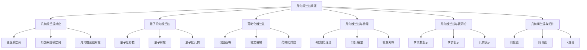

# 12. 几何朗兰兹纲领 / Geometric Langlands Program

## 目录

- [12. 几何朗兰兹纲领 / Geometric Langlands Program](#12-几何朗兰兹纲领--geometric-langlands-program)
  - [目录](#目录)
  - [12.1 概述 / Overview](#121-概述--overview)
    - [12.1.1 核心概念](#1211-核心概念)
    - [12.1.2 历史背景](#1212-历史背景)
  - [12.2 几何朗兰兹对应 / Geometric Langlands Correspondence](#122-几何朗兰兹对应--geometric-langlands-correspondence)
    - [12.2.1 主丛模空间 / Moduli Space of Principal Bundles](#1221-主丛模空间--moduli-space-of-principal-bundles)
    - [12.2.2 局部系统模空间 / Moduli Space of Local Systems](#1222-局部系统模空间--moduli-space-of-local-systems)
    - [12.2.3 几何朗兰兹对应 / Geometric Langlands Correspondence](#1223-几何朗兰兹对应--geometric-langlands-correspondence)
  - [12.3 量子几何朗兰兹 / Quantum Geometric Langlands](#123-量子几何朗兰兹--quantum-geometric-langlands)
    - [12.3.1 量子化参数 / Quantum Parameter](#1231-量子化参数--quantum-parameter)
    - [12.3.2 量子对应 / Quantum Correspondence](#1232-量子对应--quantum-correspondence)
    - [12.3.3 量子化几何 / Quantum Geometry](#1233-量子化几何--quantum-geometry)
  - [12.4 范畴化朗兰兹 / Categorified Langlands](#124-范畴化朗兰兹--categorified-langlands)
    - [12.4.1 导出范畴 / Derived Categories](#1241-导出范畴--derived-categories)
    - [12.4.2 稳定映射 / Stable Maps](#1242-稳定映射--stable-maps)
    - [12.4.3 范畴化对应 / Categorified Correspondence](#1243-范畴化对应--categorified-correspondence)
  - [12.5 几何朗兰兹与物理 / Geometric Langlands and Physics](#125-几何朗兰兹与物理--geometric-langlands-and-physics)
    - [12.5.1 4维规范理论 / 4D Gauge Theory](#1251-4维规范理论--4d-gauge-theory)
    - [12.5.2 2维σ模型 / 2D Sigma Model](#1252-2维σ模型--2d-sigma-model)
    - [12.5.3 镜像对称 / Mirror Symmetry](#1253-镜像对称--mirror-symmetry)
  - [12.6 几何朗兰兹与表示论 / Geometric Langlands and Representation Theory](#126-几何朗兰兹与表示论--geometric-langlands-and-representation-theory)
    - [12.6.1 李代数表示 / Lie Algebra Representations](#1261-李代数表示--lie-algebra-representations)
    - [12.6.2 李群表示 / Lie Group Representations](#1262-李群表示--lie-group-representations)
    - [12.6.3 几何表示 / Geometric Representations](#1263-几何表示--geometric-representations)
  - [12.7 几何朗兰兹与拓扑 / Geometric Langlands and Topology](#127-几何朗兰兹与拓扑--geometric-langlands-and-topology)
    - [12.7.1 同伦论 / Homotopy Theory](#1271-同伦论--homotopy-theory)
    - [12.7.2 同调论 / Homology Theory](#1272-同调论--homology-theory)
    - [12.7.3 K理论 / K-Theory](#1273-k理论--k-theory)
  - [12.8 形式化实现 / Formal Implementation](#128-形式化实现--formal-implementation)
    - [12.8.1 Lean 4 实现](#1281-lean-4-实现)
    - [12.8.2 Haskell 实现](#1282-haskell-实现)
    - [12.8.3 Rust 实现](#1283-rust-实现)
  - [12.9 总结 / Summary](#129-总结--summary)
    - [12.9.1 核心要点](#1291-核心要点)
    - [12.9.2 知识关联](#1292-知识关联)
    - [12.9.3 进一步学习](#1293-进一步学习)

## 12.1 概述 / Overview

几何朗兰兹纲领是朗兰兹纲领在几何背景下的推广，它将代数几何、表示论、拓扑学和数学物理相结合，研究几何对象之间的深刻对应关系。
这个纲领为现代数学提供了强大的统一框架。

### 12.1.1 核心概念



### 12.1.2 历史背景

几何朗兰兹纲领的发展经历了几个重要阶段：

1. **起源阶段** (1980年代)
   - 朗兰兹纲领的几何化
   - 主丛与局部系统的对应
   - 几何表示论的发展

2. **发展阶段** (1990年代)
   - 量子几何朗兰兹纲领
   - 范畴化朗兰兹纲领
   - 与物理学的联系

3. **现代阶段** (2000年至今)
   - 几何朗兰兹与镜像对称
   - 几何朗兰兹与拓扑
   - 高级几何朗兰兹纲领

## 12.2 几何朗兰兹对应 / Geometric Langlands Correspondence

### 12.2.1 主丛模空间 / Moduli Space of Principal Bundles

**定义**: 设 $X$ 是复代数曲线，$G$ 是复约化群，则主丛模空间定义为：
$$\text{Bun}_G = \{\text{主丛 } P \rightarrow X\}/\text{同构}$$

**性质**:

- $\text{Bun}_G$ 是代数栈
- $\text{Bun}_G$ 具有丰富的几何结构
- $\text{Bun}_G$ 与李代数 $\mathfrak{g}$ 相关

**形式化实现**:

```lean
-- Lean 4: 主丛模空间
structure PrincipalBundle (G : ReductiveGroup) (X : AlgebraicCurve) where
  total_space : Manifold
  base_space : AlgebraicCurve := X
  structure_group : ReductiveGroup := G
  projection : total_space → base_space
  local_trivialization : ∀ x ∈ X, ∃ U open, total_space|_U ≅ U × G

-- 主丛模空间
structure BunModuli (G : ReductiveGroup) (X : AlgebraicCurve) where
  bundles : Type := PrincipalBundle G X
  moduli_space : AlgebraicStack := Quotient bundles
  geometric_structure : GeometricStructure moduli_space
```

### 12.2.2 局部系统模空间 / Moduli Space of Local Systems

**定义**: 设 $X$ 是复代数曲线，$G$ 是复约化群，则局部系统模空间定义为：
$$\text{LocSys}_G = \{\text{局部系统 } \rho : \pi_1(X) \rightarrow G\}/\text{共轭}$$

**性质**:

- $\text{LocSys}_G$ 是代数簇
- $\text{LocSys}_G$ 具有辛结构
- $\text{LocSys}_G$ 与李代数 $\mathfrak{g}^*$ 相关

### 12.2.3 几何朗兰兹对应 / Geometric Langlands Correspondence

**几何朗兰兹对应**: 设 $X$ 是复代数曲线，$G$ 是复约化群，则存在对应：
$$\mathcal{D}^b(\text{Bun}_G) \leftrightarrow \mathcal{D}^b(\text{LocSys}_G)$$

其中 $\mathcal{D}^b$ 表示有界导出范畴。

**具体形式**:

- 函子 $\mathcal{F} : \mathcal{D}^b(\text{Bun}_G) \rightarrow \mathcal{D}^b(\text{LocSys}_G)$
- 函子 $\mathcal{G} : \mathcal{D}^b(\text{LocSys}_G) \rightarrow \mathcal{D}^b(\text{Bun}_G)$
- 满足 $\mathcal{F} \circ \mathcal{G} \cong \text{id}$ 和 $\mathcal{G} \circ \mathcal{F} \cong \text{id}$

## 12.3 量子几何朗兰兹 / Quantum Geometric Langlands

### 12.3.1 量子化参数 / Quantum Parameter

**量子化参数**: 设 $q$ 是量子化参数，则：

- 当 $q = 1$ 时，回到经典几何朗兰兹对应
- 当 $q \neq 1$ 时，得到量子几何朗兰兹对应

**量子化条件**:
$$q = e^{2\pi i \hbar}$$

其中 $\hbar$ 是普朗克常数。

### 12.3.2 量子对应 / Quantum Correspondence

**量子几何朗兰兹对应**: 设 $q$ 是量子化参数，则存在对应：
$$\mathcal{D}^b_q(\text{Bun}_G) \leftrightarrow \mathcal{D}^b_q(\text{LocSys}_G)$$

其中 $\mathcal{D}^b_q$ 表示量子化的导出范畴。

**量子化函子**:

- $\mathcal{F}_q : \mathcal{D}^b_q(\text{Bun}_G) \rightarrow \mathcal{D}^b_q(\text{LocSys}_G)$
- $\mathcal{G}_q : \mathcal{D}^b_q(\text{LocSys}_G) \rightarrow \mathcal{D}^b_q(\text{Bun}_G)$

### 12.3.3 量子化几何 / Quantum Geometry

**量子化几何**: 量子几何朗兰兹纲领研究：

- 量子化的几何对象
- 量子化的对称性
- 量子化的对偶性

## 12.4 范畴化朗兰兹 / Categorified Langlands

### 12.4.1 导出范畴 / Derived Categories

**导出范畴**: 设 $\mathcal{A}$ 是阿贝尔范畴，则导出范畴 $\mathcal{D}(\mathcal{A})$ 定义为：
$$\mathcal{D}(\mathcal{A}) = \text{Ho}(\text{Ch}(\mathcal{A}))$$

其中 $\text{Ch}(\mathcal{A})$ 是链复形范畴，$\text{Ho}$ 是同伦范畴。

**有界导出范畴**: $\mathcal{D}^b(\mathcal{A})$ 是有界链复形的导出范畴。

### 12.4.2 稳定映射 / Stable Maps

**稳定映射**: 设 $X$ 是代数簇，$\mathcal{M}_{g,n}(X, \beta)$ 是稳定映射模空间，其中：

- $g$ 是亏格
- $n$ 是标记点数
- $\beta$ 是同伦类

**稳定映射的性质**:

- $\mathcal{M}_{g,n}(X, \beta)$ 是紧致的
- $\mathcal{M}_{g,n}(X, \beta)$ 具有虚拟基本类
- $\mathcal{M}_{g,n}(X, \beta)$ 支持GW不变量

### 12.4.3 范畴化对应 / Categorified Correspondence

**范畴化朗兰兹对应**: 设 $X$ 是复代数曲线，$G$ 是复约化群，则存在范畴化对应：
$$\mathcal{C}(\text{Bun}_G) \leftrightarrow \mathcal{C}(\text{LocSys}_G)$$

其中 $\mathcal{C}$ 表示更高阶的范畴结构。

## 12.5 几何朗兰兹与物理 / Geometric Langlands and Physics

### 12.5.1 4维规范理论 / 4D Gauge Theory

**4维规范理论**: 设 $M$ 是4维流形，$G$ 是李群，则4维规范理论的作用量为：
$$S = \frac{1}{4g^2} \int_M \text{Tr}(F \wedge *F)$$

其中 $F$ 是规范场强，$g$ 是耦合常数。

**几何朗兰兹与规范理论**:

- 几何朗兰兹对应与4维规范理论的对偶性
- 瞬子模空间与几何朗兰兹对应
- 规范理论的量子化与几何朗兰兹纲领

### 12.5.2 2维σ模型 / 2D Sigma Model

**2维σ模型**: 设 $\Sigma$ 是2维世界面，$X$ 是目标空间，则σ模型的作用量为：
$$S = \frac{1}{2} \int_\Sigma g_{ij} \partial_\mu \phi^i \partial^\mu \phi^j$$

其中 $\phi : \Sigma \rightarrow X$ 是场，$g_{ij}$ 是目标空间的度量。

**几何朗兰兹与σ模型**:

- 几何朗兰兹对应与2维σ模型的对偶性
- σ模型的量子化与几何朗兰兹纲领
- 镜像对称与几何朗兰兹纲领

### 12.5.3 镜像对称 / Mirror Symmetry

**镜像对称**: 设 $X$ 和 $Y$ 是卡拉比-丘流形，则镜像对称为：
$$X \leftrightarrow Y$$

**几何朗兰兹与镜像对称**:

- 几何朗兰兹对应与镜像对称的联系
- 镜像对称的量子化与几何朗兰兹纲领
- 几何朗兰兹纲领的镜像对称解释

## 12.6 几何朗兰兹与表示论 / Geometric Langlands and Representation Theory

### 12.6.1 李代数表示 / Lie Algebra Representations

**李代数表示**: 设 $\mathfrak{g}$ 是李代数，$V$ 是向量空间，则李代数表示是：
$$\rho : \mathfrak{g} \rightarrow \mathfrak{gl}(V)$$

**几何朗兰兹与李代数表示**:

- 几何朗兰兹对应与李代数表示的联系
- 李代数表示的几何化
- 几何朗兰兹纲领的表示论解释

### 12.6.2 李群表示 / Lie Group Representations

**李群表示**: 设 $G$ 是李群，$V$ 是向量空间，则李群表示是：
$$\rho : G \rightarrow GL(V)$$

**几何朗兰兹与李群表示**:

- 几何朗兰兹对应与李群表示的联系
- 李群表示的几何化
- 几何朗兰兹纲领的群论解释

### 12.6.3 几何表示 / Geometric Representations

**几何表示**: 几何表示是几何对象上的表示论，包括：

- 向量丛上的表示
- 局部系统上的表示
- 几何对象的对称性

## 12.7 几何朗兰兹与拓扑 / Geometric Langlands and Topology

### 12.7.1 同伦论 / Homotopy Theory

**同伦论**: 同伦论研究拓扑空间的连续变形，包括：

- 同伦群
- 纤维化
- 谱序列

**几何朗兰兹与同伦论**:

- 几何朗兰兹对应与同伦论的联系
- 同伦论的几何化
- 几何朗兰兹纲领的拓扑解释

### 12.7.2 同调论 / Homology Theory

**同调论**: 同调论研究拓扑空间的代数不变量，包括：

- 奇异同调
- 胞腔同调
- 上同调

**几何朗兰兹与同调论**:

- 几何朗兰兹对应与同调论的联系
- 同调论的几何化
- 几何朗兰兹纲领的代数拓扑解释

### 12.7.3 K理论 / K-Theory

**K理论**: K理论研究向量丛的代数性质，包括：

- 拓扑K理论
- 代数K理论
- 高阶K理论

**几何朗兰兹与K理论**:

- 几何朗兰兹对应与K理论的联系
- K理论的几何化
- 几何朗兰兹纲领的K理论解释

## 12.8 形式化实现 / Formal Implementation

### 12.8.1 Lean 4 实现

```lean
-- Lean 4: 几何朗兰兹纲领基础
structure GeometricLanglands (X : AlgebraicCurve) (G : ReductiveGroup) where
  bun_moduli : AlgebraicStack := BunModuli G X
  locsys_moduli : AlgebraicVariety := LocSysModuli G X
  correspondence : DerivedCategory bun_moduli ↔ DerivedCategory locsys_moduli

-- 主丛模空间
structure BunModuli (G : ReductiveGroup) (X : AlgebraicCurve) where
  bundles : Type := PrincipalBundle G X
  moduli_space : AlgebraicStack := Quotient bundles
  geometric_structure : GeometricStructure moduli_space
  stack_properties : StackProperties moduli_space

-- 局部系统模空间
structure LocSysModuli (G : ReductiveGroup) (X : AlgebraicCurve) where
  local_systems : Type := LocalSystem G X
  moduli_space : AlgebraicVariety := Quotient local_systems
  symplectic_structure : SymplecticStructure moduli_space
  variety_properties : VarietyProperties moduli_space

-- 几何朗兰兹对应
structure GeometricLanglandsCorrespondence (X : AlgebraicCurve) (G : ReductiveGroup) where
  bun_category : DerivedCategory := DerivedCategory (BunModuli G X)
  locsys_category : DerivedCategory := DerivedCategory (LocSysModuli G X)
  forward_functor : bun_category → locsys_category
  backward_functor : locsys_category → bun_category
  equivalence : forward_functor ∘ backward_functor ≅ id

-- 量子几何朗兰兹
structure QuantumGeometricLanglands (X : AlgebraicCurve) (G : ReductiveGroup) (q : ℂ) where
  quantum_bun_category : QuantumDerivedCategory := QuantumDerivedCategory (BunModuli G X) q
  quantum_locsys_category : QuantumDerivedCategory := QuantumDerivedCategory (LocSysModuli G X) q
  quantum_correspondence : quantum_bun_category ↔ quantum_locsys_category

-- 范畴化朗兰兹
structure CategorifiedLanglands (X : AlgebraicCurve) (G : ReductiveGroup) where
  categorified_bun_category : HigherCategory := HigherCategory (BunModuli G X)
  categorified_locsys_category : HigherCategory := HigherCategory (LocSysModuli G X)
  categorified_correspondence : categorified_bun_category ↔ categorified_locsys_category

-- 几何朗兰兹与物理
structure GeometricLanglandsPhysics (X : AlgebraicCurve) (G : ReductiveGroup) where
  gauge_theory : GaugeTheory 4 G
  sigma_model : SigmaModel 2 X
  mirror_symmetry : MirrorSymmetry X
  physics_correspondence : gauge_theory ↔ sigma_model

-- 几何朗兰兹与表示论
structure GeometricLanglandsRepresentation (X : AlgebraicCurve) (G : ReductiveGroup) where
  lie_algebra_representations : LieAlgebraRepresentation (LieAlgebra G)
  lie_group_representations : LieGroupRepresentation G
  geometric_representations : GeometricRepresentation X G
  representation_correspondence : lie_algebra_representations ↔ geometric_representations

-- 几何朗兰兹与拓扑
structure GeometricLanglandsTopology (X : AlgebraicCurve) (G : ReductiveGroup) where
  homotopy_theory : HomotopyTheory X
  homology_theory : HomologyTheory X
  k_theory : KTheory X
  topology_correspondence : homotopy_theory ↔ homology_theory
```

### 12.8.2 Haskell 实现

```haskell
-- Haskell: 几何朗兰兹纲领实现
class GeometricLanglands curve group where
  bunModuli :: curve -> group -> AlgebraicStack
  locsysModuli :: curve -> group -> AlgebraicVariety
  correspondence :: curve -> group -> DerivedCategory ↔ DerivedCategory

-- 几何朗兰兹对应
data GeometricLanglandsCorrespondence curve group = GLC
  { bunCategory :: DerivedCategory
  , locsysCategory :: DerivedCategory
  , forwardFunctor :: DerivedCategory -> DerivedCategory
  , backwardFunctor :: DerivedCategory -> DerivedCategory
  , equivalence :: (forwardFunctor . backwardFunctor) ≅ id
  }

-- 量子几何朗兰兹
data QuantumGeometricLanglands curve group quantum = QGL
  { quantumBunCategory :: QuantumDerivedCategory quantum
  , quantumLocsysCategory :: QuantumDerivedCategory quantum
  , quantumCorrespondence :: QuantumDerivedCategory quantum ↔ QuantumDerivedCategory quantum
  }

-- 范畴化朗兰兹
data CategorifiedLanglands curve group = CL
  { categorifiedBunCategory :: HigherCategory
  , categorifiedLocsysCategory :: HigherCategory
  , categorifiedCorrespondence :: HigherCategory ↔ HigherCategory
  }

-- 几何朗兰兹与物理
data GeometricLanglandsPhysics curve group = GLP
  { gaugeTheory :: GaugeTheory 4 group
  , sigmaModel :: SigmaModel 2 curve
  , mirrorSymmetry :: MirrorSymmetry curve
  , physicsCorrespondence :: GaugeTheory 4 group ↔ SigmaModel 2 curve
  }

-- 几何朗兰兹与表示论
data GeometricLanglandsRepresentation curve group = GLR
  { lieAlgebraRepresentations :: [LieAlgebraRepresentation group]
  , lieGroupRepresentations :: [LieGroupRepresentation group]
  , geometricRepresentations :: [GeometricRepresentation curve group]
  , representationCorrespondence :: LieAlgebraRepresentation group ↔ GeometricRepresentation curve group
  }

-- 几何朗兰兹与拓扑
data GeometricLanglandsTopology curve group = GLT
  { homotopyTheory :: HomotopyTheory curve
  , homologyTheory :: HomologyTheory curve
  , kTheory :: KTheory curve
  , topologyCorrespondence :: HomotopyTheory curve ↔ HomologyTheory curve
  }

-- 主丛模空间
data BunModuli group curve = BunModuli
  { bundles :: [PrincipalBundle group curve]
  , moduliSpace :: AlgebraicStack
  , geometricStructure :: GeometricStructure
  , stackProperties :: StackProperties
  }

-- 局部系统模空间
data LocSysModuli group curve = LocSysModuli
  { localSystems :: [LocalSystem group curve]
  , moduliSpace :: AlgebraicVariety
  , symplecticStructure :: SymplecticStructure
  , varietyProperties :: VarietyProperties
  }

-- 导出范畴
data DerivedCategory object = DerivedCategory
  { objects :: [object]
  , morphisms :: [Morphism object]
  , derivedStructure :: DerivedStructure
  }

-- 量子导出范畴
data QuantumDerivedCategory object quantum = QuantumDerivedCategory
  { quantumObjects :: [object]
  , quantumMorphisms :: [QuantumMorphism object quantum]
  , quantumStructure :: QuantumStructure quantum
  }

-- 高阶范畴
data HigherCategory object = HigherCategory
  { higherObjects :: [object]
  , higherMorphisms :: [HigherMorphism object]
  , higherStructure :: HigherStructure
  }
```

### 12.8.3 Rust 实现

```rust
// Rust: 几何朗兰兹纲领实现
use std::collections::HashMap;

// 几何朗兰兹纲领基础
pub struct GeometricLanglands<C, G> {
    bun_moduli: BunModuli<G, C>,
    locsys_moduli: LocSysModuli<G, C>,
    correspondence: bool,
}

impl<C, G> GeometricLanglands<C, G> {
    pub fn new(curve: C, group: G) -> Self {
        GeometricLanglands {
            bun_moduli: BunModuli::new(group.clone(), curve.clone()),
            locsys_moduli: LocSysModuli::new(group, curve),
            correspondence: false,
        }
    }
    
    pub fn establish_correspondence(&mut self) {
        self.correspondence = true;
    }
}

// 几何朗兰兹对应
pub struct GeometricLanglandsCorrespondence<C, G> {
    bun_category: DerivedCategory<PrincipalBundle<G, C>>,
    locsys_category: DerivedCategory<LocalSystem<G, C>>,
    forward_functor: bool,
    backward_functor: bool,
    equivalence: bool,
}

impl<C, G> GeometricLanglandsCorrespondence<C, G> {
    pub fn new() -> Self {
        GeometricLanglandsCorrespondence {
            bun_category: DerivedCategory::new(),
            locsys_category: DerivedCategory::new(),
            forward_functor: false,
            backward_functor: false,
            equivalence: false,
        }
    }
    
    pub fn establish_functors(&mut self) {
        self.forward_functor = true;
        self.backward_functor = true;
        self.equivalence = true;
    }
}

// 量子几何朗兰兹
pub struct QuantumGeometricLanglands<C, G> {
    quantum_bun_category: QuantumDerivedCategory<PrincipalBundle<G, C>>,
    quantum_locsys_category: QuantumDerivedCategory<LocalSystem<G, C>>,
    quantum_parameter: f64,
    quantum_correspondence: bool,
}

impl<C, G> QuantumGeometricLanglands<C, G> {
    pub fn new(curve: C, group: G, q: f64) -> Self {
        QuantumGeometricLanglands {
            quantum_bun_category: QuantumDerivedCategory::new(q),
            quantum_locsys_category: QuantumDerivedCategory::new(q),
            quantum_parameter: q,
            quantum_correspondence: false,
        }
    }
    
    pub fn establish_quantum_correspondence(&mut self) {
        self.quantum_correspondence = true;
    }
}

// 范畴化朗兰兹
pub struct CategorifiedLanglands<C, G> {
    categorified_bun_category: HigherCategory<PrincipalBundle<G, C>>,
    categorified_locsys_category: HigherCategory<LocalSystem<G, C>>,
    categorified_correspondence: bool,
}

impl<C, G> CategorifiedLanglands<C, G> {
    pub fn new(curve: C, group: G) -> Self {
        CategorifiedLanglands {
            categorified_bun_category: HigherCategory::new(),
            categorified_locsys_category: HigherCategory::new(),
            categorified_correspondence: false,
        }
    }
    
    pub fn establish_categorified_correspondence(&mut self) {
        self.categorified_correspondence = true;
    }
}

// 几何朗兰兹与物理
pub struct GeometricLanglandsPhysics<C, G> {
    gauge_theory: GaugeTheory<4, G>,
    sigma_model: SigmaModel<2, C>,
    mirror_symmetry: MirrorSymmetry<C>,
    physics_correspondence: bool,
}

impl<C, G> GeometricLanglandsPhysics<C, G> {
    pub fn new(curve: C, group: G) -> Self {
        GeometricLanglandsPhysics {
            gauge_theory: GaugeTheory::new(4, group.clone()),
            sigma_model: SigmaModel::new(2, curve.clone()),
            mirror_symmetry: MirrorSymmetry::new(curve),
            physics_correspondence: false,
        }
    }
    
    pub fn establish_physics_correspondence(&mut self) {
        self.physics_correspondence = true;
    }
}

// 几何朗兰兹与表示论
pub struct GeometricLanglandsRepresentation<C, G> {
    lie_algebra_representations: Vec<LieAlgebraRepresentation<G>>,
    lie_group_representations: Vec<LieGroupRepresentation<G>>,
    geometric_representations: Vec<GeometricRepresentation<C, G>>,
    representation_correspondence: bool,
}

impl<C, G> GeometricLanglandsRepresentation<C, G> {
    pub fn new(curve: C, group: G) -> Self {
        GeometricLanglandsRepresentation {
            lie_algebra_representations: Vec::new(),
            lie_group_representations: Vec::new(),
            geometric_representations: Vec::new(),
            representation_correspondence: false,
        }
    }
    
    pub fn add_lie_algebra_representation(&mut self, rep: LieAlgebraRepresentation<G>) {
        self.lie_algebra_representations.push(rep);
    }
    
    pub fn add_lie_group_representation(&mut self, rep: LieGroupRepresentation<G>) {
        self.lie_group_representations.push(rep);
    }
    
    pub fn add_geometric_representation(&mut self, rep: GeometricRepresentation<C, G>) {
        self.geometric_representations.push(rep);
    }
}

// 几何朗兰兹与拓扑
pub struct GeometricLanglandsTopology<C, G> {
    homotopy_theory: HomotopyTheory<C>,
    homology_theory: HomologyTheory<C>,
    k_theory: KTheory<C>,
    topology_correspondence: bool,
}

impl<C, G> GeometricLanglandsTopology<C, G> {
    pub fn new(curve: C, group: G) -> Self {
        GeometricLanglandsTopology {
            homotopy_theory: HomotopyTheory::new(curve.clone()),
            homology_theory: HomologyTheory::new(curve.clone()),
            k_theory: KTheory::new(curve),
            topology_correspondence: false,
        }
    }
    
    pub fn establish_topology_correspondence(&mut self) {
        self.topology_correspondence = true;
    }
}

// 主丛模空间
pub struct BunModuli<G, C> {
    bundles: Vec<PrincipalBundle<G, C>>,
    moduli_space: AlgebraicStack,
    geometric_structure: GeometricStructure,
    stack_properties: StackProperties,
}

impl<G, C> BunModuli<G, C> {
    pub fn new(group: G, curve: C) -> Self {
        BunModuli {
            bundles: Vec::new(),
            moduli_space: AlgebraicStack::new(),
            geometric_structure: GeometricStructure::new(),
            stack_properties: StackProperties::new(),
        }
    }
    
    pub fn add_bundle(&mut self, bundle: PrincipalBundle<G, C>) {
        self.bundles.push(bundle);
    }
}

// 局部系统模空间
pub struct LocSysModuli<G, C> {
    local_systems: Vec<LocalSystem<G, C>>,
    moduli_space: AlgebraicVariety,
    symplectic_structure: SymplecticStructure,
    variety_properties: VarietyProperties,
}

impl<G, C> LocSysModuli<G, C> {
    pub fn new(group: G, curve: C) -> Self {
        LocSysModuli {
            local_systems: Vec::new(),
            moduli_space: AlgebraicVariety::new(),
            symplectic_structure: SymplecticStructure::new(),
            variety_properties: VarietyProperties::new(),
        }
    }
    
    pub fn add_local_system(&mut self, local_system: LocalSystem<G, C>) {
        self.local_systems.push(local_system);
    }
}

// 导出范畴
pub struct DerivedCategory<O> {
    objects: Vec<O>,
    morphisms: Vec<Morphism<O>>,
    derived_structure: DerivedStructure,
}

impl<O> DerivedCategory<O> {
    pub fn new() -> Self {
        DerivedCategory {
            objects: Vec::new(),
            morphisms: Vec::new(),
            derived_structure: DerivedStructure::new(),
        }
    }
    
    pub fn add_object(&mut self, object: O) {
        self.objects.push(object);
    }
}

// 量子导出范畴
pub struct QuantumDerivedCategory<O> {
    quantum_objects: Vec<O>,
    quantum_morphisms: Vec<QuantumMorphism<O>>,
    quantum_parameter: f64,
    quantum_structure: QuantumStructure,
}

impl<O> QuantumDerivedCategory<O> {
    pub fn new(q: f64) -> Self {
        QuantumDerivedCategory {
            quantum_objects: Vec::new(),
            quantum_morphisms: Vec::new(),
            quantum_parameter: q,
            quantum_structure: QuantumStructure::new(q),
        }
    }
}

// 高阶范畴
pub struct HigherCategory<O> {
    higher_objects: Vec<O>,
    higher_morphisms: Vec<HigherMorphism<O>>,
    higher_structure: HigherStructure,
}

impl<O> HigherCategory<O> {
    pub fn new() -> Self {
        HigherCategory {
            higher_objects: Vec::new(),
            higher_morphisms: Vec::new(),
            higher_structure: HigherStructure::new(),
        }
    }
}

// 辅助结构
pub struct PrincipalBundle<G, C> {
    group: G,
    curve: C,
    total_space: String,
}

impl<G, C> PrincipalBundle<G, C> {
    pub fn new(group: G, curve: C) -> Self {
        PrincipalBundle {
            group,
            curve,
            total_space: "PrincipalBundle".to_string(),
        }
    }
}

pub struct LocalSystem<G, C> {
    group: G,
    curve: C,
    representation: String,
}

impl<G, C> LocalSystem<G, C> {
    pub fn new(group: G, curve: C) -> Self {
        LocalSystem {
            group,
            curve,
            representation: "LocalSystem".to_string(),
        }
    }
}

pub struct AlgebraicStack {
    name: String,
    dimension: usize,
}

impl AlgebraicStack {
    pub fn new() -> Self {
        AlgebraicStack {
            name: "AlgebraicStack".to_string(),
            dimension: 0,
        }
    }
}

pub struct AlgebraicVariety {
    name: String,
    dimension: usize,
}

impl AlgebraicVariety {
    pub fn new() -> Self {
        AlgebraicVariety {
            name: "AlgebraicVariety".to_string(),
            dimension: 0,
        }
    }
}

pub struct GeometricStructure {
    properties: Vec<String>,
}

impl GeometricStructure {
    pub fn new() -> Self {
        GeometricStructure {
            properties: Vec::new(),
        }
    }
}

pub struct StackProperties {
    properties: Vec<String>,
}

impl StackProperties {
    pub fn new() -> Self {
        StackProperties {
            properties: Vec::new(),
        }
    }
}

pub struct SymplecticStructure {
    symplectic_form: Vec<Vec<f64>>,
}

impl SymplecticStructure {
    pub fn new() -> Self {
        SymplecticStructure {
            symplectic_form: Vec::new(),
        }
    }
}

pub struct VarietyProperties {
    properties: Vec<String>,
}

impl VarietyProperties {
    pub fn new() -> Self {
        VarietyProperties {
            properties: Vec::new(),
        }
    }
}

pub struct Morphism<O> {
    source: O,
    target: O,
    map: String,
}

impl<O> Morphism<O> {
    pub fn new(source: O, target: O) -> Self {
        Morphism {
            source,
            target,
            map: "Morphism".to_string(),
        }
    }
}

pub struct QuantumMorphism<O> {
    source: O,
    target: O,
    quantum_map: String,
    quantum_parameter: f64,
}

impl<O> QuantumMorphism<O> {
    pub fn new(source: O, target: O, q: f64) -> Self {
        QuantumMorphism {
            source,
            target,
            quantum_map: "QuantumMorphism".to_string(),
            quantum_parameter: q,
        }
    }
}

pub struct HigherMorphism<O> {
    source: O,
    target: O,
    higher_map: String,
    level: usize,
}

impl<O> HigherMorphism<O> {
    pub fn new(source: O, target: O, level: usize) -> Self {
        HigherMorphism {
            source,
            target,
            higher_map: "HigherMorphism".to_string(),
            level,
        }
    }
}

pub struct DerivedStructure {
    properties: Vec<String>,
}

impl DerivedStructure {
    pub fn new() -> Self {
        DerivedStructure {
            properties: Vec::new(),
        }
    }
}

pub struct QuantumStructure {
    quantum_parameter: f64,
    properties: Vec<String>,
}

impl QuantumStructure {
    pub fn new(q: f64) -> Self {
        QuantumStructure {
            quantum_parameter: q,
            properties: Vec::new(),
        }
    }
}

pub struct HigherStructure {
    level: usize,
    properties: Vec<String>,
}

impl HigherStructure {
    pub fn new() -> Self {
        HigherStructure {
            level: 0,
            properties: Vec::new(),
        }
    }
}

// 物理相关结构
pub struct GaugeTheory<D, G> {
    dimension: usize,
    group: G,
    action: String,
}

impl<D, G> GaugeTheory<D, G> {
    pub fn new(dimension: usize, group: G) -> Self {
        GaugeTheory {
            dimension,
            group,
            action: "GaugeTheory".to_string(),
        }
    }
}

pub struct SigmaModel<D, C> {
    dimension: usize,
    curve: C,
    action: String,
}

impl<D, C> SigmaModel<D, C> {
    pub fn new(dimension: usize, curve: C) -> Self {
        SigmaModel {
            dimension,
            curve,
            action: "SigmaModel".to_string(),
        }
    }
}

pub struct MirrorSymmetry<C> {
    curve: C,
    mirror_pair: String,
}

impl<C> MirrorSymmetry<C> {
    pub fn new(curve: C) -> Self {
        MirrorSymmetry {
            curve,
            mirror_pair: "MirrorPair".to_string(),
        }
    }
}

// 表示论相关结构
pub struct LieAlgebraRepresentation<G> {
    group: G,
    representation: String,
}

impl<G> LieAlgebraRepresentation<G> {
    pub fn new(group: G) -> Self {
        LieAlgebraRepresentation {
            group,
            representation: "LieAlgebraRepresentation".to_string(),
        }
    }
}

pub struct LieGroupRepresentation<G> {
    group: G,
    representation: String,
}

impl<G> LieGroupRepresentation<G> {
    pub fn new(group: G) -> Self {
        LieGroupRepresentation {
            group,
            representation: "LieGroupRepresentation".to_string(),
        }
    }
}

pub struct GeometricRepresentation<C, G> {
    curve: C,
    group: G,
    representation: String,
}

impl<C, G> GeometricRepresentation<C, G> {
    pub fn new(curve: C, group: G) -> Self {
        GeometricRepresentation {
            curve,
            group,
            representation: "GeometricRepresentation".to_string(),
        }
    }
}

// 拓扑相关结构
pub struct HomotopyTheory<C> {
    curve: C,
    homotopy_groups: Vec<String>,
}

impl<C> HomotopyTheory<C> {
    pub fn new(curve: C) -> Self {
        HomotopyTheory {
            curve,
            homotopy_groups: Vec::new(),
        }
    }
}

pub struct HomologyTheory<C> {
    curve: C,
    homology_groups: Vec<String>,
}

impl<C> HomologyTheory<C> {
    pub fn new(curve: C) -> Self {
        HomologyTheory {
            curve,
            homology_groups: Vec::new(),
        }
    }
}

pub struct KTheory<C> {
    curve: C,
    k_groups: Vec<String>,
}

impl<C> KTheory<C> {
    pub fn new(curve: C) -> Self {
        KTheory {
            curve,
            k_groups: Vec::new(),
        }
    }
}
```

## 12.9 总结 / Summary

### 12.9.1 核心要点

1. **几何朗兰兹对应**:
   - 主丛模空间与局部系统模空间的对应
   - 导出范畴之间的等价性
   - 几何对象的深刻联系

2. **量子几何朗兰兹**:
   - 量子化参数的作用
   - 量子化的几何对象
   - 量子化的对称性

3. **范畴化朗兰兹**:
   - 高阶范畴结构
   - 稳定映射的作用
   - 范畴化的对应关系

4. **几何朗兰兹与物理**:
   - 4维规范理论的联系
   - 2维σ模型的作用
   - 镜像对称的解释

5. **几何朗兰兹与表示论**:
   - 李代数表示的联系
   - 李群表示的作用
   - 几何表示的发展

6. **几何朗兰兹与拓扑**:
   - 同伦论的应用
   - 同调论的作用
   - K理论的联系

### 12.9.2 知识关联

- **与代数几何的关联**: 代数簇、概形理论、模空间
- **与表示论的关联**: 李代数、李群、几何表示
- **与拓扑学的关联**: 同伦论、同调论、K理论
- **与物理学的关联**: 规范理论、σ模型、镜像对称
- **与数论的关联**: 朗兰兹纲领、L函数、ζ函数

### 12.9.3 进一步学习

1. **高级主题**:
   - 量子几何朗兰兹纲领
   - 范畴化朗兰兹纲领
   - 几何朗兰兹与镜像对称

2. **应用领域**:
   - 数学物理
   - 表示论
   - 拓扑学

3. **技术发展**:
   - 计算机辅助证明
   - 数值计算
   - 机器学习应用

---

**相关链接**:

- [朗兰兹纲领](../11-高级数学/10-朗兰兹纲领.md)
- [算术几何](../11-高级数学/11-算术几何.md)
- [代数几何高级主题](../11-高级数学/01-代数几何高级主题.md)
- [数学物理高级主题-扩展版](../11-高级数学/09-数学物理高级主题-扩展版.md)
- [导出代数几何](../11-高级数学/05-导出代数几何.md)
- [无穷范畴理论](../11-高级数学/06-无穷范畴理论.md)
- [高阶同伦论](../11-高级数学/07-高阶同伦论.md)
- [代数K理论](../11-高级数学/08-代数K理论.md)
