# 13. 量子几何朗兰兹纲领 / Quantum Geometric Langlands Program

## 目录

- [13. 量子几何朗兰兹纲领 / Quantum Geometric Langlands Program](#13-量子几何朗兰兹纲领--quantum-geometric-langlands-program)
  - [目录](#目录)
  - [13.1 概述 / Overview](#131-概述--overview)
    - [13.1.1 核心概念](#1311-核心概念)
    - [13.1.2 历史背景](#1312-历史背景)
    - [13.1.3 与经典朗兰兹的关系](#1313-与经典朗兰兹的关系)
  - [13.2 量子化参数 / Quantum Parameter](#132-量子化参数--quantum-parameter)
    - [13.2.1 量子化参数的定义](#1321-量子化参数的定义)
    - [13.2.2 量子化条件](#1322-量子化条件)
    - [13.2.3 量子化极限](#1323-量子化极限)
  - [13.3 量子对应 / Quantum Correspondence](#133-量子对应--quantum-correspondence)
    - [13.3.1 量子几何朗兰兹对应](#1331-量子几何朗兰兹对应)
    - [13.3.2 量子导出范畴](#1332-量子导出范畴)
    - [13.3.3 量子函子](#1333-量子函子)
    - [13.3.4 量子化对称性](#1334-量子化对称性)
  - [13.4 量子化几何 / Quantum Geometry](#134-量子化几何--quantum-geometry)
    - [13.4.1 量子化对象](#1341-量子化对象)
    - [13.4.2 量子化对称性](#1342-量子化对称性)
    - [13.4.3 量子化不变量](#1343-量子化不变量)
  - [13.5 量子化表示论 / Quantum Representation Theory](#135-量子化表示论--quantum-representation-theory)
    - [13.5.1 量子化李代数](#1351-量子化李代数)
    - [13.5.2 量子化特征标](#1352-量子化特征标)
    - [13.5.3 量子化赫克算子](#1353-量子化赫克算子)
  - [13.6 量子化上同调 / Quantum Cohomology](#136-量子化上同调--quantum-cohomology)
    - [13.6.1 量子化层上同调](#1361-量子化层上同调)
    - [13.6.2 量子化德拉姆上同调](#1362-量子化德拉姆上同调)
    - [13.6.3 量子化陈类](#1363-量子化陈类)
  - [13.7 量子化模空间 / Quantum Moduli Spaces](#137-量子化模空间--quantum-moduli-spaces)
    - [13.7.1 量子化向量丛模空间](#1371-量子化向量丛模空间)
    - [13.7.2 量子化局部系统模空间](#1372-量子化局部系统模空间)
    - [13.7.3 量子化稳定映射](#1373-量子化稳定映射)
  - [13.8 量子化镜像对称 / Quantum Mirror Symmetry](#138-量子化镜像对称--quantum-mirror-symmetry)
    - [13.8.1 量子化镜像对应](#1381-量子化镜像对应)
    - [13.8.2 量子化卡拉比-丘流形](#1382-量子化卡拉比-丘流形)
    - [13.8.3 量子化弦论](#1383-量子化弦论)
  - [13.9 形式化实现 / Formal Implementation](#139-形式化实现--formal-implementation)
    - [13.9.1 Lean 4 实现](#1391-lean-4-实现)
    - [13.9.2 Haskell 实现](#1392-haskell-实现)
    - [13.9.3 Rust 实现](#1393-rust-实现)
  - [13.10 总结 / Summary](#1310-总结--summary)
    - [13.10.1 核心要点](#13101-核心要点)
    - [13.10.2 知识关联](#13102-知识关联)
    - [13.10.3 进一步学习](#13103-进一步学习)

## 13.1 概述 / Overview

量子几何朗兰兹纲领是几何朗兰兹纲领的量子化推广，它研究量子化参数 $q$ 对几何朗兰兹对应的影响。
当 $q = 1$ 时回到经典几何朗兰兹对应，当 $q \neq 1$ 时得到量子化的对应关系。
这个纲领将量子场论、表示论、代数几何和拓扑学等不同领域联系起来。

### 13.1.1 核心概念

```mermaid
graph TD
    A[量子几何朗兰兹] --> B[量子化参数]
    A --> C[量子对应]
    A --> D[量子化几何]
    A --> E[量子化表示论]
    A --> F[量子化上同调]
    A --> G[量子化模空间]
    A --> H[量子化镜像对称]
    
    B --> I[q = e^2πiℏ]
    B --> J[量子化条件]
    B --> K[量子化极限]
    
    C --> L[量子导出范畴]
    C --> M[量子函子]
    C --> N[量子化对称性]
    
    D --> O[量子化对象]
    D --> P[量子化对称性]
    D --> Q[量子化不变量]
    
    E --> R[量子化李代数]
    E --> S[量子化特征标]
    E --> T[量子化赫克算子]
    
    F --> U[量子化层上同调]
    F --> V[量子化德拉姆上同调]
    F --> W[量子化陈类]
    
    G --> X[量子化向量丛模空间]
    G --> Y[量子化局部系统模空间]
    G --> Z[量子化稳定映射]
    
    H --> AA[量子化镜像对应]
    H --> BB[量子化卡拉比-丘流形]
    H --> CC[量子化弦论]
```



### 13.1.2 历史背景

量子几何朗兰兹纲领的发展经历了几个重要阶段：

1. **起源阶段** (1990-2000)
   - 几何朗兰兹纲领的建立
   - 量子化概念的引入
   - 基本对应关系的发现

2. **发展阶段** (2000-2010)
   - 量子化参数的深入研究
   - 量子化表示论的发展
   - 量子化上同调理论的建立

3. **现代阶段** (2010至今)
   - 量子化镜像对称的发现
   - 与弦论的深刻联系
   - 量子化模空间理论

### 13.1.3 与经典朗兰兹的关系

**经典极限**: 当 $q \to 1$ 时，量子几何朗兰兹纲领回到经典几何朗兰兹纲领：

$$\lim_{q \to 1} \mathcal{D}^b_q(\text{Bun}_G) = \mathcal{D}^b(\text{Bun}_G)$$

**量子化效应**: 当 $q \neq 1$ 时，出现量子化效应：

$$\mathcal{D}^b_q(\text{Bun}_G) \neq \mathcal{D}^b(\text{Bun}_G)$$

## 13.2 量子化参数 / Quantum Parameter

### 13.2.1 量子化参数的定义

**量子化参数**: $q = e^{2\pi i \hbar}$，其中 $\hbar$ 是普朗克常数。

**物理意义**: $q$ 控制量子化的程度，$q = 1$ 对应经典情况，$q \neq 1$ 对应量子化情况。

**数学性质**:

- $q$ 是单位根或一般复数
- $q$ 控制量子化的非交换性
- $q$ 影响量子化的对称性

### 13.2.2 量子化条件

**量子化条件**: 当 $q = 1$ 时回到经典情况，当 $q \neq 1$ 时得到量子化。

**具体条件**:

1. **经典极限**: $\lim_{q \to 1} [x, y]_q = [x, y]$
2. **量子化关系**: $[x, y]_q = xy - qyx$
3. **量子化对称性**: $[x, y]_q = -q[y, x]_{q^{-1}}$

### 13.2.3 量子化极限

**经典极限**: 当 $q \to 1$ 时，量子化结构回到经典结构：

$$\lim_{q \to 1} \mathcal{A}_q = \mathcal{A}$$

**量子化极限**: 当 $q \to 0$ 时，得到极限量子化结构：

$$\lim_{q \to 0} \mathcal{A}_q = \mathcal{A}_0$$

## 13.3 量子对应 / Quantum Correspondence

### 13.3.1 量子几何朗兰兹对应

**量子几何朗兰兹对应**: 设 $X$ 是代数曲线，$G$ 是约化群，$q$ 是量子化参数，则存在对应：

$$\mathcal{D}^b_q(\text{Bun}_G(X)) \leftrightarrow \mathcal{D}^b_q(\text{LocSys}_G(X))$$

其中 $\mathcal{D}^b_q$ 表示量子化的导出范畴。

**具体形式**:

$$\text{Hom}_{\mathcal{D}^b_q(\text{Bun}_G)}(F, G) \cong \text{Hom}_{\mathcal{D}^b_q(\text{LocSys}_G)}(\mathbb{F}_q(F), \mathbb{F}_q(G))$$

其中 $\mathbb{F}_q$ 是量子化傅里叶变换。

### 13.3.2 量子导出范畴

**量子导出范畴**: $\mathcal{D}^b_q(\mathcal{C})$ 是范畴 $\mathcal{C}$ 的量子化导出范畴。

**性质**:

1. **量子化同构**: $\mathcal{D}^b_q(\mathcal{C}) \cong \mathcal{D}^b(\mathcal{C}_q)$
2. **量子化函子**: $F_q: \mathcal{C} \to \mathcal{C}_q$
3. **量子化自然变换**: $\eta_q: F_q \to F_q$

**形式化定义**:

```lean
-- 量子导出范畴
structure QuantumDerivedCategory (C : Category) (q : ℂ) where
  objects : Type := DerivedCategory C
  morphisms : objects → objects → Type := QuantumMorphisms q
  composition : ∀ {X Y Z}, morphisms X Y → morphisms Y Z → morphisms X Z
  identity : ∀ X, morphisms X X
  associativity : ∀ {W X Y Z} (f : morphisms W X) (g : morphisms X Y) (h : morphisms Y Z),
    composition (composition f g) h = composition f (composition g h)
  left_identity : ∀ {X Y} (f : morphisms X Y), composition (identity X) f = f
  right_identity : ∀ {X Y} (f : morphisms X Y), composition f (identity Y) = f
  quantum_parameter : ℂ := q
```

### 13.3.3 量子函子

**量子化函子**: 设 $F: \mathcal{C} \to \mathcal{D}$ 是函子，$q$ 是量子化参数，则量子化函子 $F_q: \mathcal{C}_q \to \mathcal{D}_q$ 定义为：

$$F_q(X) = F(X) \otimes \mathbb{C}_q$$

**性质**:

1. **量子化保持**: $F_q$ 保持量子化结构
2. **量子化自然性**: $F_q$ 是量子化自然变换
3. **量子化伴随**: $F_q$ 有量子化左伴随和右伴随

### 13.3.4 量子化对称性

**量子化对称性**: 量子化参数 $q$ 引入新的对称性。

**具体形式**:

1. **量子化对偶**: $X \mapsto X^*_q$
2. **量子化张量积**: $X \otimes_q Y$
3. **量子化内部同态**: $\text{Hom}_q(X, Y)$

## 13.4 量子化几何 / Quantum Geometry

### 13.4.1 量子化对象

**量子化代数簇**: 设 $X$ 是代数簇，$q$ 是量子化参数，量子化代数簇 $X_q$ 定义为：

$$X_q = \text{Spec}(\mathcal{O}_X \otimes \mathbb{C}_q)$$

**量子化向量丛**: 设 $E$ 是向量丛，量子化向量丛 $E_q$ 定义为：

$$E_q = E \otimes \mathcal{O}_{X_q}$$

**量子化局部系统**: 设 $L$ 是局部系统，量子化局部系统 $L_q$ 定义为：

$$L_q = L \otimes \mathbb{C}_q$$

### 13.4.2 量子化对称性

**量子化李群**: 设 $G$ 是李群，量子化李群 $G_q$ 定义为：

$$G_q = \text{Spec}(\mathcal{O}_G \otimes \mathbb{C}_q)$$

**量子化李代数**: 设 $\mathfrak{g}$ 是李代数，量子化李代数 $\mathfrak{g}_q$ 定义为：

$$[x, y]_q = xy - qyx$$

**量子化表示**: 设 $V$ 是表示，量子化表示 $V_q$ 定义为：

$$V_q = V \otimes \mathbb{C}_q$$

### 13.4.3 量子化不变量

**量子化陈类**: 设 $E$ 是向量丛，量子化陈类 $c_q(E)$ 定义为：

$$c_q(E) = \sum_{i=0}^{\text{rk}(E)} c_i(E) q^i$$

**量子化示性类**: 设 $X$ 是代数簇，量子化示性类 $\chi_q(X)$ 定义为：

$$\chi_q(X) = \sum_{i=0}^{\dim(X)} (-1)^i h^i(X, \mathcal{O}_X) q^i$$

## 13.5 量子化表示论 / Quantum Representation Theory

### 13.5.1 量子化李代数

**量子化李代数**: 设 $\mathfrak{g}$ 是李代数，量子化李代数 $U_q(\mathfrak{g})$ 定义为：

$$U_q(\mathfrak{g}) = \mathbb{C}[X_1, \ldots, X_n] / \langle [X_i, X_j]_q \rangle$$

其中 $[X_i, X_j]_q = X_i X_j - q X_j X_i$。

**性质**:

1. **量子化霍普夫代数**: $U_q(\mathfrak{g})$ 是量子化霍普夫代数
2. **量子化余积**: $\Delta_q: U_q(\mathfrak{g}) \to U_q(\mathfrak{g}) \otimes U_q(\mathfrak{g})$
3. **量子化对极**: $S_q: U_q(\mathfrak{g}) \to U_q(\mathfrak{g})$

### 13.5.2 量子化特征标

**量子化特征标**: 设 $\rho$ 是表示，量子化特征标 $\chi_q(\rho)$ 定义为：

$$\chi_q(\rho)(g) = \text{Tr}(\rho_q(g))$$

其中 $\rho_q$ 是量子化表示。

**性质**:

1. **量子化中心性**: $\chi_q(\rho)$ 是量子化中心函数
2. **量子化正交性**: 不同不可约表示的量子化特征标正交
3. **量子化完备性**: 量子化特征标构成完备基

### 13.5.3 量子化赫克算子

**量子化赫克算子**: 设 $G$ 是约化群，量子化赫克算子 $H_q$ 定义为：

$$H_q = \sum_{w \in W} T_w \otimes q^{\ell(w)}$$

其中 $W$ 是外尔群，$T_w$ 是赫克算子，$\ell(w)$ 是长度函数。

**性质**:

1. **量子化交换性**: $H_q$ 与量子化中心交换
2. **量子化特征值**: $H_q$ 的特征值是量子化特征标
3. **量子化谱**: $H_q$ 的谱是量子化谱

## 13.6 量子化上同调 / Quantum Cohomology

### 13.6.1 量子化层上同调

**量子化层上同调**: 设 $\mathcal{F}$ 是层，量子化层上同调 $H^i_q(X, \mathcal{F})$ 定义为：

$$H^i_q(X, \mathcal{F}) = H^i(X, \mathcal{F} \otimes \mathcal{O}_{X_q})$$

**性质**:

1. **量子化长正合序列**: 具有量子化长正合序列
2. **量子化对偶**: $H^i_q(X, \mathcal{F})^* \cong H^{n-i}_q(X, \mathcal{F}^* \otimes \omega_X)$
3. **量子化基变换**: 具有量子化基变换公式

### 13.6.2 量子化德拉姆上同调

**量子化德拉姆上同调**: 设 $X$ 是光滑代数簇，量子化德拉姆上同调 $H^i_{q,\text{dR}}(X)$ 定义为：

$$H^i_{q,\text{dR}}(X) = H^i(X, \Omega^\bullet_{X_q})$$

其中 $\Omega^\bullet_{X_q}$ 是量子化德拉姆复形。

**性质**:

1. **量子化霍奇分解**: $H^i_{q,\text{dR}}(X) = \bigoplus_{p+q=i} H^p_q(X, \Omega^q_{X_q})$
2. **量子化德拉姆定理**: $H^i_{q,\text{dR}}(X) \cong H^i_q(X, \mathbb{C})$
3. **量子化庞加莱对偶**: $H^i_{q,\text{dR}}(X) \cong H^{2n-i}_{q,\text{dR}}(X)^*$

### 13.6.3 量子化陈类

**量子化陈类**: 设 $E$ 是向量丛，量子化陈类 $c_q(E)$ 定义为：

$$c_q(E) = \sum_{i=0}^{\text{rk}(E)} c_i(E) q^i$$

其中 $c_i(E)$ 是经典陈类。

**性质**:

1. **量子化惠特尼公式**: $c_q(E \oplus F) = c_q(E) \cup c_q(F)$
2. **量子化分裂原理**: $c_q(E) = \prod_{i=1}^{\text{rk}(E)} (1 + \alpha_i q)$
3. **量子化陈-韦伊理论**: $c_q(E) = \text{ch}_q(E) \cup \text{td}_q(X)$

## 13.7 量子化模空间 / Quantum Moduli Spaces

### 13.7.1 量子化向量丛模空间

**量子化向量丛模空间**: 设 $X$ 是代数曲线，$G$ 是约化群，量子化向量丛模空间 $\mathcal{M}_q(G, X)$ 定义为：

$$\mathcal{M}_q(G, X) = \text{Bun}_G(X) \times_{\text{Spec}(\mathbb{C})} \text{Spec}(\mathbb{C}_q)$$

**性质**:

1. **量子化紧致性**: $\mathcal{M}_q(G, X)$ 是量子化紧致的
2. **量子化光滑性**: $\mathcal{M}_q(G, X)$ 是量子化光滑的
3. **量子化有理连通性**: $\mathcal{M}_q(G, X)$ 是量子化有理连通的

### 13.7.2 量子化局部系统模空间

**量子化局部系统模空间**: 设 $X$ 是代数曲线，$G$ 是约化群，量子化局部系统模空间 $\mathcal{L}_q(G, X)$ 定义为：

$$\mathcal{L}_q(G, X) = \text{LocSys}_G(X) \times_{\text{Spec}(\mathbb{C})} \text{Spec}(\mathbb{C}_q)$$

**性质**:

1. **量子化代数性**: $\mathcal{L}_q(G, X)$ 是量子化代数的
2. **量子化有限性**: $\mathcal{L}_q(G, X)$ 是量子化有限的
3. **量子化分离性**: $\mathcal{L}_q(G, X)$ 是量子化分离的

### 13.7.3 量子化稳定映射

**量子化稳定映射**: 设 $X$ 是代数簇，量子化稳定映射 $\overline{\mathcal{M}}_{g,n,q}(X, \beta)$ 定义为：

$$\overline{\mathcal{M}}_{g,n,q}(X, \beta) = \overline{\mathcal{M}}_{g,n}(X, \beta) \times_{\text{Spec}(\mathbb{C})} \text{Spec}(\mathbb{C}_q)$$

**性质**:

1. **量子化紧致性**: $\overline{\mathcal{M}}_{g,n,q}(X, \beta)$ 是量子化紧致的
2. **量子化维数**: $\dim(\overline{\mathcal{M}}_{g,n,q}(X, \beta)) = 3g-3+n+\deg(\beta)$
3. **量子化边界**: 具有量子化边界结构

## 13.8 量子化镜像对称 / Quantum Mirror Symmetry

### 13.8.1 量子化镜像对应

**量子化镜像对应**: 设 $X$ 和 $Y$ 是镜像对称的卡拉比-丘流形，量子化镜像对应为：

$$\mathcal{D}^b_q(X) \leftrightarrow \mathcal{D}^b_q(Y)$$

**具体形式**:

$$\text{Hom}_{\mathcal{D}^b_q(X)}(F, G) \cong \text{Hom}_{\mathcal{D}^b_q(Y)}(\mathbb{M}_q(F), \mathbb{M}_q(G))$$

其中 $\mathbb{M}_q$ 是量子化镜像变换。

### 13.8.2 量子化卡拉比-丘流形

**量子化卡拉比-丘流形**: 设 $X$ 是卡拉比-丘流形，量子化卡拉比-丘流形 $X_q$ 定义为：

$$X_q = X \times_{\text{Spec}(\mathbb{C})} \text{Spec}(\mathbb{C}_q)$$

**性质**:

1. **量子化卡拉比-丘条件**: $X_q$ 满足量子化卡拉比-丘条件
2. **量子化全纯体积形式**: $X_q$ 具有量子化全纯体积形式
3. **量子化霍奇数**: $X_q$ 的量子化霍奇数满足 $h^{p,q}_q = h^{q,p}_q$

### 13.8.3 量子化弦论

**量子化弦论**: 量子化弦论是经典弦论的量子化推广。

**A模型**: 量子化A模型研究量子化全纯映射：

$$\phi: \Sigma_q \to X_q$$

其中 $\Sigma_q$ 是量子化黎曼曲面。

**B模型**: 量子化B模型研究量子化复结构：

$$J_q: T_q X_q \to T_q X_q$$

其中 $J_q^2 = -1$ 且 $J_q$ 是量子化全纯的。

## 13.9 形式化实现 / Formal Implementation

### 13.9.1 Lean 4 实现

```lean
-- 量子几何朗兰兹纲领
structure QuantumGeometricLanglands (X : AlgebraicCurve) (G : ReductiveGroup) (q : ℂ) where
  quantum_bun_category : QuantumDerivedCategory := QuantumDerivedCategory (BunModuli G X) q
  quantum_locsys_category : QuantumDerivedCategory := QuantumDerivedCategory (LocSysModuli G X) q
  quantum_correspondence : quantum_bun_category ↔ quantum_locsys_category
  quantum_parameter : ℂ := q

-- 量子化参数
def QuantumParameter (q : ℂ) : Prop :=
  q ≠ 0 ∧ q ≠ 1

-- 量子化李代数
structure QuantumLieAlgebra (g : LieAlgebra) (q : ℂ) where
  generators : List g.carrier
  relations : List (g.carrier × g.carrier × g.carrier)
  quantum_commutator : ∀ x y, [x, y]_q = x * y - q * y * x

-- 量子化表示
structure QuantumRepresentation (V : Module) (q : ℂ) where
  action : QuantumLieAlgebra → V → V
  quantum_invariance : ∀ g v, action (quantum_adjoint g) v = quantum_adjoint (action g v)

-- 量子化上同调
def QuantumCohomology (X : AlgebraicVariety) (q : ℂ) : Type :=
  DerivedCategory (Sheaf X) ⊗ ℂ_q

-- 量子化模空间
structure QuantumModuliSpace (G : Group) (X : AlgebraicCurve) (q : ℂ) where
  points : Type := BunModuli G X ⊗ ℂ_q
  topology : Topology points := InducedTopology (BunModuli G X) q
  quantum_structure : QuantumStructure q
```

### 13.9.2 Haskell 实现

```haskell
-- 量子几何朗兰兹
data QuantumGeometricLanglands curve group quantum = QGL
  { quantumBunCategory :: QuantumDerivedCategory quantum
  , quantumLocsysCategory :: QuantumDerivedCategory quantum
  , quantumCorrespondence :: QuantumDerivedCategory quantum ↔ QuantumDerivedCategory quantum
  , quantumParameter :: quantum
  }

-- 量子化参数
type QuantumParameter = Complex Double

quantumParameter :: QuantumParameter -> Bool
quantumParameter q = q /= 0 && q /= 1

-- 量子化李代数
data QuantumLieAlgebra g q = QLA
  { generators :: [g]
  , relations :: [(g, g, g)]
  , quantumCommutator :: g -> g -> g
  }

instance (Eq g, Num g) => Eq (QuantumLieAlgebra g q) where
  (QLA g1 r1 c1) == (QLA g2 r2 c2) = g1 == g2 && r1 == r2

-- 量子化表示
data QuantumRepresentation v q = QR
  { action :: QuantumLieAlgebra g q -> v -> v
  , quantumInvariance :: QuantumLieAlgebra g q -> v -> v
  }

-- 量子化上同调
type QuantumCohomology x q = DerivedCategory (Sheaf x) ⊗ ℂ_q

-- 量子化模空间
data QuantumModuliSpace g x q = QMS
  { points :: BunModuli g x ⊗ ℂ_q
  , topology :: Topology (BunModuli g x) q
  , quantumStructure :: QuantumStructure q
  }

-- 量子化函子
class QuantumFunctor f where
  quantumMap :: QuantumParameter -> f a -> f b
  quantumNaturality :: QuantumParameter -> f a -> f b -> Bool

-- 量子化自然变换
data QuantumNaturalTransformation f g q = QNT
  { component :: forall a. f a -> g a
  , quantumNaturality :: forall a b. (a -> b) -> f a -> g b
  }
```

### 13.9.3 Rust 实现

```rust
// 量子几何朗兰兹
pub struct QuantumGeometricLanglands<C, G> {
    quantum_bun_category: QuantumDerivedCategory<PrincipalBundle<G, C>>,
    quantum_locsys_category: QuantumDerivedCategory<LocalSystem<G, C>>,
    quantum_parameter: f64,
    quantum_correspondence: bool,
}

// 量子化参数
pub struct QuantumParameter {
    pub q: Complex<f64>,
}

impl QuantumParameter {
    pub fn new(q: Complex<f64>) -> Self {
        QuantumParameter { q }
    }
    
    pub fn is_valid(&self) -> bool {
        self.q.norm() != 0.0 && self.q.norm() != 1.0
    }
}

// 量子化李代数
pub struct QuantumLieAlgebra<G> {
    pub generators: Vec<G>,
    pub relations: Vec<(G, G, G)>,
    pub quantum_commutator: Box<dyn Fn(&G, &G) -> G>,
}

impl<G> QuantumLieAlgebra<G> {
    pub fn new(generators: Vec<G>, relations: Vec<(G, G, G)>) -> Self {
        QuantumLieAlgebra {
            generators,
            relations,
            quantum_commutator: Box::new(|x, y| x.clone() * y.clone()),
        }
    }
    
    pub fn commutator(&self, x: &G, y: &G) -> G {
        (self.quantum_commutator)(x, y)
    }
}

// 量子化表示
pub struct QuantumRepresentation<V, G> {
    pub action: Box<dyn Fn(&QuantumLieAlgebra<G>, &V) -> V>,
    pub quantum_invariance: Box<dyn Fn(&QuantumLieAlgebra<G>, &V) -> V>,
}

// 量子化上同调
pub struct QuantumCohomology<X> {
    pub derived_category: DerivedCategory<Sheaf<X>>,
    pub quantum_parameter: QuantumParameter,
}

// 量子化模空间
pub struct QuantumModuliSpace<G, X> {
    pub points: Vec<PrincipalBundle<G, X>>,
    pub topology: Topology<PrincipalBundle<G, X>>,
    pub quantum_structure: QuantumStructure,
}

// 量子化函子
pub trait QuantumFunctor<A, B> {
    fn quantum_map(&self, q: &QuantumParameter, a: A) -> B;
    fn quantum_naturality(&self, q: &QuantumParameter, f: impl Fn(A) -> B) -> bool;
}

// 量子化自然变换
pub struct QuantumNaturalTransformation<F, G, A, B> {
    pub component: Box<dyn Fn(F<A>) -> G<B>>,
    pub quantum_naturality: Box<dyn Fn(Box<dyn Fn(A) -> B>) -> bool>,
}
```

## 13.10 总结 / Summary

### 13.10.1 核心要点

量子几何朗兰兹纲领是现代数学的重要发展，具有以下核心要点：

1. **量子化参数**: $q = e^{2\pi i \hbar}$ 控制量子化的程度
2. **量子对应**: $\mathcal{D}^b_q(\text{Bun}_G) \leftrightarrow \mathcal{D}^b_q(\text{LocSys}_G)$
3. **量子化几何**: 研究量子化的几何对象和对称性
4. **量子化表示论**: 量子化李代数和表示论
5. **量子化上同调**: 量子化层上同调和德拉姆上同调
6. **量子化模空间**: 量子化向量丛和局部系统模空间
7. **量子化镜像对称**: 量子化卡拉比-丘流形和弦论

### 13.10.2 知识关联

量子几何朗兰兹纲领与以下领域密切相关：

- **[几何朗兰兹纲领](../12-几何朗兰兹纲领.md)**: 经典几何朗兰兹纲领
- **[朗兰兹纲领](../10-朗兰兹纲领.md)**: 经典朗兰兹纲领
- **[数学物理高级主题-扩展版](../09-数学物理高级主题-扩展版.md)**: 量子场论和弦论
- **[导出代数几何](../05-导出代数几何.md)**: 导出范畴理论
- **[无穷范畴理论](../06-无穷范畴理论.md)**: 高阶范畴理论
- **[同伦类型论](../15-同伦类型论.md)**: 同伦类型论

### 13.10.3 进一步学习

为进一步学习量子几何朗兰兹纲领，建议：

1. **理论基础**: 深入学习几何朗兰兹纲领和量子场论
2. **技术工具**: 掌握导出范畴、量子化李代数等技术
3. **应用领域**: 了解在弦论、镜像对称中的应用
4. **前沿发展**: 关注最新的研究进展和未解决问题

---

**相关链接**:

- [几何朗兰兹纲领](../12-几何朗兰兹纲领.md)
- [朗兰兹纲领](../10-朗兰兹纲领.md)
- [数学物理高级主题-扩展版](../09-数学物理高级主题-扩展版.md)
- [导出代数几何](../05-导出代数几何.md)
- [无穷范畴理论](../06-无穷范畴理论.md)
- [同伦类型论](../15-同伦类型论.md)
