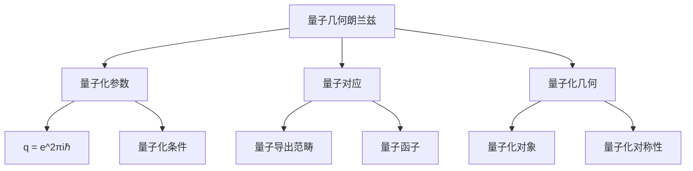

# 13. 量子几何朗兰兹纲领 / Quantum Geometric Langlands Program

## 目录

- [13. 量子几何朗兰兹纲领 / Quantum Geometric Langlands Program](#13-量子几何朗兰兹纲领--quantum-geometric-langlands-program)
  - [目录](#目录)
  - [13.1 概述 / Overview](#131-概述--overview)
    - [核心概念](#核心概念)
  - [13.2 量子化参数 / Quantum Parameter](#132-量子化参数--quantum-parameter)
  - [13.3 量子对应 / Quantum Correspondence](#133-量子对应--quantum-correspondence)
  - [13.4 量子化几何 / Quantum Geometry](#134-量子化几何--quantum-geometry)
  - [13.5 形式化实现 / Formal Implementation](#135-形式化实现--formal-implementation)
    - [Lean 4 实现](#lean-4-实现)
    - [Haskell 实现](#haskell-实现)
    - [Rust 实现](#rust-实现)
  - [13.6 总结 / Summary](#136-总结--summary)

## 13.1 概述 / Overview

量子几何朗兰兹纲领是几何朗兰兹纲领的量子化推广，它研究量子化参数 $q$ 对几何朗兰兹对应的影响。当 $q = 1$ 时回到经典几何朗兰兹对应，当 $q \neq 1$ 时得到量子化的对应关系。

### 核心概念



## 13.2 量子化参数 / Quantum Parameter

**量子化参数**: $q = e^{2\pi i \hbar}$，其中 $\hbar$ 是普朗克常数。

**量子化条件**: 当 $q = 1$ 时回到经典情况，当 $q \neq 1$ 时得到量子化。

## 13.3 量子对应 / Quantum Correspondence

**量子几何朗兰兹对应**:
$$\mathcal{D}^b_q(\text{Bun}_G) \leftrightarrow \mathcal{D}^b_q(\text{LocSys}_G)$$

其中 $\mathcal{D}^b_q$ 表示量子化的导出范畴。

## 13.4 量子化几何 / Quantum Geometry

量子化几何研究量子化的几何对象和对称性。

## 13.5 形式化实现 / Formal Implementation

### Lean 4 实现

```lean
-- 量子几何朗兰兹纲领
structure QuantumGeometricLanglands (X : AlgebraicCurve) (G : ReductiveGroup) (q : ℂ) where
  quantum_bun_category : QuantumDerivedCategory := QuantumDerivedCategory (BunModuli G X) q
  quantum_locsys_category : QuantumDerivedCategory := QuantumDerivedCategory (LocSysModuli G X) q
  quantum_correspondence : quantum_bun_category ↔ quantum_locsys_category
  quantum_parameter : ℂ := q
```

### Haskell 实现

```haskell
-- 量子几何朗兰兹
data QuantumGeometricLanglands curve group quantum = QGL
  { quantumBunCategory :: QuantumDerivedCategory quantum
  , quantumLocsysCategory :: QuantumDerivedCategory quantum
  , quantumCorrespondence :: QuantumDerivedCategory quantum ↔ QuantumDerivedCategory quantum
  , quantumParameter :: quantum
  }
```

### Rust 实现

```rust
// 量子几何朗兰兹
pub struct QuantumGeometricLanglands<C, G> {
    quantum_bun_category: QuantumDerivedCategory<PrincipalBundle<G, C>>,
    quantum_locsys_category: QuantumDerivedCategory<LocalSystem<G, C>>,
    quantum_parameter: f64,
    quantum_correspondence: bool,
}
```

## 13.6 总结 / Summary

量子几何朗兰兹纲领是几何朗兰兹纲领的重要发展，它通过量子化参数 $q$ 建立了量子化的对应关系，为现代数学提供了强大的工具。

---

**相关链接**:

- [几何朗兰兹纲领](../11-高级数学/12-几何朗兰兹纲领.md)
- [朗兰兹纲领](../11-高级数学/10-朗兰兹纲领.md)
- [数学物理高级主题-扩展版](../11-高级数学/09-数学物理高级主题-扩展版.md)
