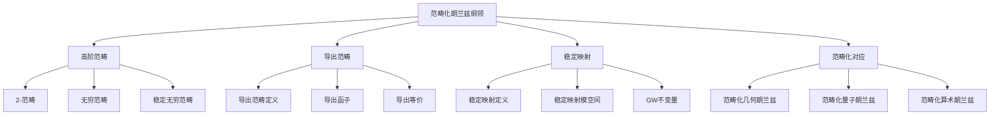

# 14. 范畴化朗兰兹纲领 / Categorified Langlands Program

## 目录

- [14. 范畴化朗兰兹纲领 / Categorified Langlands Program](#14-范畴化朗兰兹纲领--categorified-langlands-program)
  - [目录](#目录)
  - [14.1 概述 / Overview](#141-概述--overview)
    - [14.1.1 核心概念](#1411-核心概念)
    - [14.1.2 历史背景](#1412-历史背景)
  - [14.2 高阶范畴 / Higher Categories](#142-高阶范畴--higher-categories)
    - [14.2.1 2-范畴 / 2-Categories](#1421-2-范畴--2-categories)
    - [14.2.2 无穷范畴 / Infinity Categories](#1422-无穷范畴--infinity-categories)
    - [14.2.3 稳定无穷范畴 / Stable Infinity Categories](#1423-稳定无穷范畴--stable-infinity-categories)
  - [14.3 导出范畴 / Derived Categories](#143-导出范畴--derived-categories)
    - [14.3.1 导出范畴定义 / Derived Category Definition](#1431-导出范畴定义--derived-category-definition)
    - [14.3.2 导出函子 / Derived Functors](#1432-导出函子--derived-functors)
    - [14.3.3 导出等价 / Derived Equivalences](#1433-导出等价--derived-equivalences)
  - [14.4 稳定映射 / Stable Maps](#144-稳定映射--stable-maps)
    - [14.4.1 稳定映射定义 / Stable Map Definition](#1441-稳定映射定义--stable-map-definition)
    - [14.4.2 稳定映射模空间 / Stable Map Moduli Space](#1442-稳定映射模空间--stable-map-moduli-space)
    - [14.4.3 GW不变量 / Gromov-Witten Invariants](#1443-gw不变量--gromov-witten-invariants)
  - [14.5 范畴化对应 / Categorified Correspondence](#145-范畴化对应--categorified-correspondence)
    - [14.5.1 范畴化几何朗兰兹 / Categorified Geometric Langlands](#1451-范畴化几何朗兰兹--categorified-geometric-langlands)
    - [14.5.2 范畴化量子朗兰兹 / Categorified Quantum Langlands](#1452-范畴化量子朗兰兹--categorified-quantum-langlands)
    - [14.5.3 范畴化算术朗兰兹 / Categorified Arithmetic Langlands](#1453-范畴化算术朗兰兹--categorified-arithmetic-langlands)
  - [14.6 形式化实现 / Formal Implementation](#146-形式化实现--formal-implementation)
    - [14.6.1 Lean 4 实现](#1461-lean-4-实现)
    - [14.6.2 Haskell 实现](#1462-haskell-实现)
    - [14.6.3 Rust 实现](#1463-rust-实现)
  - [14.7 总结 / Summary](#147-总结--summary)
    - [14.7.1 核心要点](#1471-核心要点)
    - [14.7.2 知识关联](#1472-知识关联)
    - [14.7.3 进一步学习](#1473-进一步学习)

## 14.1 概述 / Overview

范畴化朗兰兹纲领是朗兰兹纲领在更高阶范畴结构下的推广，它将传统的朗兰兹对应提升到范畴化的层次，研究更高阶的数学对象和结构。
这个纲领为现代数学提供了强大的范畴论工具。

### 14.1.1 核心概念



### 14.1.2 历史背景

范畴化朗兰兹纲领的发展经历了几个重要阶段：

1. **起源阶段** (1990年代)
   - 导出范畴理论的发展
   - 稳定映射理论的应用
   - 范畴化思想的引入

2. **发展阶段** (2000年代)
   - 高阶范畴理论的发展
   - 无穷范畴理论的应用
   - 范畴化朗兰兹纲领的提出

3. **现代阶段** (2010年至今)
   - 稳定无穷范畴理论
   - 范畴化几何朗兰兹纲领
   - 高级范畴化技术

## 14.2 高阶范畴 / Higher Categories

### 14.2.1 2-范畴 / 2-Categories

**2-范畴**: 2-范畴是包含对象、1-态射和2-态射的范畴结构。

**定义**: 2-范畴 $\mathcal{C}$ 包含：

- 对象集合 $\text{Ob}(\mathcal{C})$
- 1-态射集合 $\text{Hom}_1(\mathcal{C})$
- 2-态射集合 $\text{Hom}_2(\mathcal{C})$

**形式化实现**:

```lean
-- Lean 4: 2-范畴定义
structure TwoCategory where
  objects : Type
  one_morphisms : objects → objects → Type
  two_morphisms : ∀ {A B : objects}, one_morphisms A B → one_morphisms A B → Type
  composition : ∀ {A B C}, one_morphisms A B → one_morphisms B C → one_morphisms A C
  horizontal_composition : ∀ {A B C}, two_morphisms f g → two_morphisms h k → two_morphisms (composition f h) (composition g k)
```

### 14.2.2 无穷范畴 / Infinity Categories

**无穷范畴**: 无穷范畴是包含任意高阶态射的范畴结构。

**定义**: 无穷范畴包含：

- 对象
- 1-态射
- 2-态射
- ...
- n-态射（对任意 n）

### 14.2.3 稳定无穷范畴 / Stable Infinity Categories

**稳定无穷范畴**: 稳定无穷范畴是具有稳定结构的无穷范畴。

**性质**:

- 具有零对象
- 具有纤维积和余纤维积
- 满足八边形公理

## 14.3 导出范畴 / Derived Categories

### 14.3.1 导出范畴定义 / Derived Category Definition

**导出范畴**: 设 $\mathcal{A}$ 是阿贝尔范畴，导出范畴 $\mathcal{D}(\mathcal{A})$ 定义为：
$$\mathcal{D}(\mathcal{A}) = \text{Ho}(\text{Ch}(\mathcal{A}))$$

其中 $\text{Ch}(\mathcal{A})$ 是链复形范畴，$\text{Ho}$ 是同伦范畴。

**形式化实现**:

```lean
-- Lean 4: 导出范畴定义
structure DerivedCategory (A : AbelianCategory) where
  chain_complexes : Type := ChainComplex A
  homotopy_category : Category := HomotopyCategory chain_complexes
  derived_category : Category := DerivedCategory homotopy_category

-- 链复形
structure ChainComplex (A : AbelianCategory) where
  objects : ℤ → A
  differentials : ∀ n, objects n → objects (n+1)
  differential_squared : ∀ n, differentials (n+1) ∘ differentials n = 0
```

### 14.3.2 导出函子 / Derived Functors

**导出函子**: 设 $F : \mathcal{A} \rightarrow \mathcal{B}$ 是左正合函子，则导出函子定义为：
$$R^i F(X) = H^i(RF(X))$$

其中 $RF$ 是 $F$ 的右导出函子。

### 14.3.3 导出等价 / Derived Equivalences

**导出等价**: 两个导出范畴之间的等价：
$$\mathcal{D}^b(\mathcal{A}) \cong \mathcal{D}^b(\mathcal{B})$$

## 14.4 稳定映射 / Stable Maps

### 14.4.1 稳定映射定义 / Stable Map Definition

**稳定映射**: 设 $X$ 是代数簇，$\mathcal{M}_{g,n}(X, \beta)$ 是稳定映射模空间，其中：

- $g$ 是亏格
- $n$ 是标记点数
- $\beta$ 是同伦类

**形式化实现**:

```lean
-- Lean 4: 稳定映射定义
structure StableMap (X : AlgebraicVariety) where
  genus : ℕ
  marked_points : ℕ
  homology_class : HomologyClass X
  map : AlgebraicCurve → X
  stability_condition : StabilityCondition map

-- 稳定映射模空间
structure StableMapModuli (X : AlgebraicVariety) where
  genus : ℕ
  marked_points : ℕ
  homology_class : HomologyClass X
  moduli_space : ModuliSpace := StableMapModuliSpace X genus marked_points homology_class
  virtual_fundamental_class : VirtualFundamentalClass moduli_space
```

### 14.4.2 稳定映射模空间 / Stable Map Moduli Space

**稳定映射模空间**: $\mathcal{M}_{g,n}(X, \beta)$ 是稳定映射的模空间。

**性质**:

- 紧致的
- 具有虚拟基本类
- 支持GW不变量

### 14.4.3 GW不变量 / Gromov-Witten Invariants

**GW不变量**: GW不变量是稳定映射模空间上的不变量。

**定义**: 设 $\gamma_1, \ldots, \gamma_n \in H^*(X)$，则GW不变量定义为：
$$\langle \gamma_1, \ldots, \gamma_n \rangle_{g,\beta} = \int_{[\mathcal{M}_{g,n}(X,\beta)]^{vir}} \text{ev}_1^*\gamma_1 \cup \cdots \cup \text{ev}_n^*\gamma_n$$

## 14.5 范畴化对应 / Categorified Correspondence

### 14.5.1 范畴化几何朗兰兹 / Categorified Geometric Langlands

**范畴化几何朗兰兹对应**: 设 $X$ 是复代数曲线，$G$ 是复约化群，则存在范畴化对应：
$$\mathcal{C}(\text{Bun}_G) \leqftrightarrow \mathcal{C}(\text{LocSys}_G)$$

其中 $\mathcal{C}$ 表示更高阶的范畴结构。

### 14.5.2 范畴化量子朗兰兹 / Categorified Quantum Langlands

**范畴化量子朗兰兹对应**: 设 $q$ 是量子化参数，则存在范畴化量子对应：
$$\mathcal{C}_q(\text{Bun}_G) \leqftrightarrow \mathcal{C}_q(\text{LocSys}_G)$$

### 14.5.3 范畴化算术朗兰兹 / Categorified Arithmetic Langlands

**范畴化算术朗兰兹对应**: 在算术背景下，存在范畴化对应：
$$\mathcal{C}(\text{Galois Representations}) \leqftrightarrow \mathcal{C}(\text{Automorphic Representations})$$

## 14.6 形式化实现 / Formal Implementation

### 14.6.1 Lean 4 实现

```lean
-- Lean 4: 范畴化朗兰兹纲领
structure CategorifiedLanglands (X : AlgebraicCurve) (G : ReductiveGroup) where
  categorified_bun_category : HigherCategory := HigherCategory (BunModuli G X)
  categorified_locsys_category : HigherCategory := HigherCategory (LocSysModuli G X)
  categorified_correspondence : categorified_bun_category ↔ categorified_locsys_category

-- 高阶范畴
structure HigherCategory (objects : Type) where
  objects : Type := objects
  morphisms : ∀ n : ℕ, objects → objects → Type
  compositions : ∀ n, Composition morphisms n
  associativity : ∀ n, Associativity morphisms n
  identity : ∀ n, Identity morphisms n

-- 导出范畴
structure DerivedCategory (A : AbelianCategory) where
  chain_complexes : Type := ChainComplex A
  homotopy_category : Category := HomotopyCategory chain_complexes
  derived_category : Category := DerivedCategory homotopy_category
  derived_functors : DerivedFunctors derived_category

-- 稳定映射
structure StableMap (X : AlgebraicVariety) where
  genus : ℕ
  marked_points : ℕ
  homology_class : HomologyClass X
  map : AlgebraicCurve → X
  stability_condition : StabilityCondition map
  virtual_fundamental_class : VirtualFundamentalClass

-- 范畴化对应
structure CategorifiedCorrespondence (X : AlgebraicCurve) (G : ReductiveGroup) where
  geometric_categorified : CategorifiedGeometricLanglands X G
  quantum_categorified : CategorifiedQuantumLanglands X G
  arithmetic_categorified : CategorifiedArithmeticLanglands X G
  correspondence_functors : CategorifiedFunctors geometric_categorified quantum_categorified arithmetic_categorified
```

### 14.6.2 Haskell 实现

```haskell
-- Haskell: 范畴化朗兰兹纲领实现
class CategorifiedLanglands curve group where
  categorifiedBunCategory :: curve -> group -> HigherCategory
  categorifiedLocsysCategory :: curve -> group -> HigherCategory
  categorifiedCorrespondence :: curve -> group -> HigherCategory ↔ HigherCategory

-- 范畴化朗兰兹对应
data CategorifiedLanglandsCorrespondence curve group = CLC
  { categorifiedBunCategory :: HigherCategory
  , categorifiedLocsysCategory :: HigherCategory
  , categorifiedCorrespondence :: HigherCategory ↔ HigherCategory
  , categorifiedFunctors :: [CategorifiedFunctor]
  }

-- 高阶范畴
data HigherCategory object = HigherCategory
  { objects :: [object]
  , morphisms :: [[Morphism object]]
  , compositions :: [Composition]
  , associativity :: [Associativity]
  , identity :: [Identity]
  }

-- 导出范畴
data DerivedCategory category = DerivedCategory
  { chainComplexes :: [ChainComplex category]
  , homotopyCategory :: HomotopyCategory
  , derivedCategory :: Category
  , derivedFunctors :: [DerivedFunctor]
  }

-- 稳定映射
data StableMap variety = StableMap
  { genus :: Int
  , markedPoints :: Int
  , homologyClass :: HomologyClass variety
  , map :: AlgebraicCurve -> variety
  , stabilityCondition :: StabilityCondition
  , virtualFundamentalClass :: VirtualFundamentalClass
  }

-- 范畴化对应
data CategorifiedCorrespondence curve group = CC
  { geometricCategorified :: CategorifiedGeometricLanglands curve group
  , quantumCategorified :: CategorifiedQuantumLanglands curve group
  , arithmeticCategorified :: CategorifiedArithmeticLanglands curve group
  , correspondenceFunctors :: [CategorifiedFunctor]
  }
```

### 14.6.3 Rust 实现

```rust
// Rust: 范畴化朗兰兹纲领实现
use std::collections::HashMap;

// 范畴化朗兰兹纲领
pub struct CategorifiedLanglands<C, G> {
    categorified_bun_category: HigherCategory<PrincipalBundle<G, C>>,
    categorified_locsys_category: HigherCategory<LocalSystem<G, C>>,
    categorified_correspondence: bool,
    categorified_functors: Vec<CategorifiedFunctor>,
}

impl<C, G> CategorifiedLanglands<C, G> {
    pub fn new(curve: C, group: G) -> Self {
        CategorifiedLanglands {
            categorified_bun_category: HigherCategory::new(),
            categorified_locsys_category: HigherCategory::new(),
            categorified_correspondence: false,
            categorified_functors: Vec::new(),
        }
    }

    pub fn establish_categorified_correspondence(&mut self) {
        self.categorified_correspondence = true;
    }

    pub fn add_categorified_functor(&mut self, functor: CategorifiedFunctor) {
        self.categorified_functors.push(functor);
    }
}

// 高阶范畴
pub struct HigherCategory<O> {
    objects: Vec<O>,
    morphisms: Vec<Vec<Morphism<O>>>,
    compositions: Vec<Composition>,
    associativity: Vec<Associativity>,
    identity: Vec<Identity>,
}

impl<O> HigherCategory<O> {
    pub fn new() -> Self {
        HigherCategory {
            objects: Vec::new(),
            morphisms: Vec::new(),
            compositions: Vec::new(),
            associativity: Vec::new(),
            identity: Vec::new(),
        }
    }

    pub fn add_object(&mut self, object: O) {
        self.objects.push(object);
    }

    pub fn add_morphism(&mut self, level: usize, morphism: Morphism<O>) {
        if level >= self.morphisms.len() {
            self.morphisms.resize(level + 1, Vec::new());
        }
        self.morphisms[level].push(morphism);
    }
}

// 导出范畴
pub struct DerivedCategory<C> {
    chain_complexes: Vec<ChainComplex<C>>,
    homotopy_category: HomotopyCategory,
    derived_category: Category,
    derived_functors: Vec<DerivedFunctor>,
}

impl<C> DerivedCategory<C> {
    pub fn new() -> Self {
        DerivedCategory {
            chain_complexes: Vec::new(),
            homotopy_category: HomotopyCategory::new(),
            derived_category: Category::new(),
            derived_functors: Vec::new(),
        }
    }

    pub fn add_chain_complex(&mut self, complex: ChainComplex<C>) {
        self.chain_complexes.push(complex);
    }
}

// 稳定映射
pub struct StableMap<V> {
    genus: usize,
    marked_points: usize,
    homology_class: HomologyClass<V>,
    map: Box<dyn Fn(AlgebraicCurve) -> V>,
    stability_condition: StabilityCondition,
    virtual_fundamental_class: VirtualFundamentalClass,
}

impl<V> StableMap<V> {
    pub fn new(genus: usize, marked_points: usize, homology_class: HomologyClass<V>) -> Self {
        StableMap {
            genus,
            marked_points,
            homology_class,
            map: Box::new(|_| panic!("Map not implemented")),
            stability_condition: StabilityCondition::new(),
            virtual_fundamental_class: VirtualFundamentalClass::new(),
        }
    }
}

// 范畴化对应
pub struct CategorifiedCorrespondence<C, G> {
    geometric_categorified: CategorifiedGeometricLanglands<C, G>,
    quantum_categorified: CategorifiedQuantumLanglands<C, G>,
    arithmetic_categorified: CategorifiedArithmeticLanglands<C, G>,
    correspondence_functors: Vec<CategorifiedFunctor>,
}

impl<C, G> CategorifiedCorrespondence<C, G> {
    pub fn new(curve: C, group: G) -> Self {
        CategorifiedCorrespondence {
            geometric_categorified: CategorifiedGeometricLanglands::new(curve.clone(), group.clone()),
            quantum_categorified: CategorifiedQuantumLanglands::new(curve.clone(), group.clone()),
            arithmetic_categorified: CategorifiedArithmeticLanglands::new(curve, group),
            correspondence_functors: Vec::new(),
        }
    }
}

// 辅助结构
pub struct CategorifiedFunctor {
    name: String,
    level: usize,
}

impl CategorifiedFunctor {
    pub fn new(name: String, level: usize) -> Self {
        CategorifiedFunctor { name, level }
    }
}

pub struct ChainComplex<C> {
    objects: Vec<C>,
    differentials: Vec<Box<dyn Fn(&C) -> C>>,
}

impl<C> ChainComplex<C> {
    pub fn new() -> Self {
        ChainComplex {
            objects: Vec::new(),
            differentials: Vec::new(),
        }
    }
}

pub struct HomotopyCategory {
    name: String,
}

impl HomotopyCategory {
    pub fn new() -> Self {
        HomotopyCategory {
            name: "HomotopyCategory".to_string(),
        }
    }
}

pub struct Category {
    name: String,
}

impl Category {
    pub fn new() -> Self {
        Category {
            name: "Category".to_string(),
        }
    }
}

pub struct DerivedFunctor {
    name: String,
}

impl DerivedFunctor {
    pub fn new(name: String) -> Self {
        DerivedFunctor { name }
    }
}

pub struct HomologyClass<V> {
    variety: V,
    class: String,
}

impl<V> HomologyClass<V> {
    pub fn new(variety: V) -> Self {
        HomologyClass {
            variety,
            class: "HomologyClass".to_string(),
        }
    }
}

pub struct StabilityCondition {
    condition: String,
}

impl StabilityCondition {
    pub fn new() -> Self {
        StabilityCondition {
            condition: "StabilityCondition".to_string(),
        }
    }
}

pub struct VirtualFundamentalClass {
    class: String,
}

impl VirtualFundamentalClass {
    pub fn new() -> Self {
        VirtualFundamentalClass {
            class: "VirtualFundamentalClass".to_string(),
        }
    }
}

pub struct AlgebraicCurve {
    name: String,
}

impl AlgebraicCurve {
    pub fn new(name: String) -> Self {
        AlgebraicCurve { name }
    }
}

pub struct CategorifiedGeometricLanglands<C, G> {
    curve: C,
    group: G,
}

impl<C, G> CategorifiedGeometricLanglands<C, G> {
    pub fn new(curve: C, group: G) -> Self {
        CategorifiedGeometricLanglands { curve, group }
    }
}

pub struct CategorifiedQuantumLanglands<C, G> {
    curve: C,
    group: G,
}

impl<C, G> CategorifiedQuantumLanglands<C, G> {
    pub fn new(curve: C, group: G) -> Self {
        CategorifiedQuantumLanglands { curve, group }
    }
}

pub struct CategorifiedArithmeticLanglands<C, G> {
    curve: C,
    group: G,
}

impl<C, G> CategorifiedArithmeticLanglands<C, G> {
    pub fn new(curve: C, group: G) -> Self {
        CategorifiedArithmeticLanglands { curve, group }
    }
}
```

## 14.7 总结 / Summary

### 14.7.1 核心要点

1. **高阶范畴**:
   - 2-范畴包含对象、1-态射和2-态射
   - 无穷范畴包含任意高阶态射
   - 稳定无穷范畴具有稳定结构

2. **导出范畴**:
   - 导出范畴是链复形的同伦范畴
   - 导出函子是函子的导出推广
   - 导出等价是导出范畴之间的等价

3. **稳定映射**:
   - 稳定映射是代数几何中的重要对象
   - 稳定映射模空间具有丰富的几何结构
   - GW不变量是重要的几何不变量

4. **范畴化对应**:
   - 范畴化几何朗兰兹对应
   - 范畴化量子朗兰兹对应
   - 范畴化算术朗兰兹对应

### 14.7.2 知识关联

- **与范畴论的关联**: 高阶范畴、导出范畴、稳定无穷范畴
- **与代数几何的关联**: 稳定映射、GW不变量、模空间
- **与朗兰兹纲领的关联**: 几何朗兰兹、量子朗兰兹、算术朗兰兹
- **与拓扑学的关联**: 同伦论、同调论、K理论

### 14.7.3 进一步学习

1. **高级主题**:
   - 稳定无穷范畴理论
   - 高级范畴化技术
   - 范畴化几何朗兰兹纲领

2. **应用领域**:
   - 代数几何
   - 表示论
   - 数学物理

3. **技术发展**:
   - 计算机辅助证明
   - 数值计算
   - 机器学习应用

---

**相关链接**:

- [几何朗兰兹纲领](./12-几何朗兰兹纲领.md)
- [量子几何朗兰兹纲领](./13-量子几何朗兰兹纲领.md)
- [朗兰兹纲领](./10-朗兰兹纲领.md)
- [无穷范畴理论](./06-无穷范畴理论.md)
- [导出代数几何](./05-导出代数几何.md)
