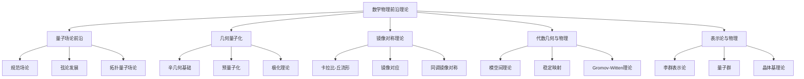

# 16. 数学物理前沿理论 / Frontiers of Mathematical Physics

## 目录

- [16. 数学物理前沿理论 / Frontiers of Mathematical Physics](#16-数学物理前沿理论--frontiers-of-mathematical-physics)
  - [目录](#目录)
  - [16.1 概述 / Overview](#161-概述--overview)
    - [16.1.1 核心概念](#1611-核心概念)
    - [16.1.2 历史背景](#1612-历史背景)
  - [16.2 量子场论前沿 / Quantum Field Theory Frontiers](#162-量子场论前沿--quantum-field-theory-frontiers)
    - [16.2.1 规范场论 / Gauge Field Theory](#1621-规范场论--gauge-field-theory)
    - [16.2.2 弦论发展 / String Theory Development](#1622-弦论发展--string-theory-development)
    - [16.2.3 拓扑量子场论 / Topological Quantum Field Theory](#1623-拓扑量子场论--topological-quantum-field-theory)
  - [16.3 几何量子化 / Geometric Quantization](#163-几何量子化--geometric-quantization)
    - [16.3.1 辛几何基础 / Symplectic Geometry Foundation](#1631-辛几何基础--symplectic-geometry-foundation)
    - [16.3.2 预量子化 / Prequantization](#1632-预量子化--prequantization)
    - [16.3.3 极化理论 / Polarization Theory](#1633-极化理论--polarization-theory)
  - [16.4 镜像对称理论 / Mirror Symmetry Theory](#164-镜像对称理论--mirror-symmetry-theory)
    - [16.4.1 卡拉比-丘流形 / Calabi-Yau Manifolds](#1641-卡拉比-丘流形--calabi-yau-manifolds)
    - [16.4.2 镜像对应 / Mirror Correspondence](#1642-镜像对应--mirror-correspondence)
    - [16.4.3 同调镜像对称 / Homological Mirror Symmetry](#1643-同调镜像对称--homological-mirror-symmetry)
  - [16.5 代数几何与物理 / Algebraic Geometry and Physics](#165-代数几何与物理--algebraic-geometry-and-physics)
    - [16.5.1 模空间理论 / Moduli Space Theory](#1651-模空间理论--moduli-space-theory)
    - [16.5.2 稳定映射 / Stable Maps](#1652-稳定映射--stable-maps)
    - [16.5.3 Gromov-Witten理论 / Gromov-Witten Theory](#1653-gromov-witten理论--gromov-witten-theory)
  - [16.6 表示论与物理 / Representation Theory and Physics](#166-表示论与物理--representation-theory-and-physics)
    - [16.6.1 李群表示论 / Lie Group Representation Theory](#1661-李群表示论--lie-group-representation-theory)
    - [16.6.2 量子群 / Quantum Groups](#1662-量子群--quantum-groups)
    - [16.6.3 晶体基理论 / Crystal Base Theory](#1663-晶体基理论--crystal-base-theory)
  - [16.7 形式化实现 / Formal Implementation](#167-形式化实现--formal-implementation)
    - [16.7.1 Lean 4 实现](#1671-lean-4-实现)
    - [16.7.2 Haskell 实现](#1672-haskell-实现)
    - [16.7.3 Rust 实现](#1673-rust-实现)
  - [16.8 总结 / Summary](#168-总结--summary)
    - [16.8.1 核心要点](#1681-核心要点)
    - [16.8.2 知识关联](#1682-知识关联)
    - [16.8.3 进一步学习](#1683-进一步学习)

## 16.1 概述 / Overview

数学物理前沿理论是数学与物理学交叉融合的最新发展，涵盖了从量子场论到几何量子化，从镜像对称到表示论的广泛领域。这些理论不仅推动了数学的发展，也为物理学提供了深刻的洞察。

### 16.1.1 核心概念



### 16.1.2 历史背景

数学物理前沿理论的发展经历了几个重要阶段：

1. **经典阶段** (20世纪初)
   - 量子力学的数学基础
   - 相对论的几何解释
   - 李群在物理中的应用

2. **现代阶段** (20世纪中后期)
   - 量子场论的发展
   - 规范理论的出现
   - 弦论的提出

3. **前沿阶段** (21世纪)
   - 镜像对称的发现
   - 几何量子化的完善
   - 代数几何与物理的融合

## 16.2 量子场论前沿 / Quantum Field Theory Frontiers

### 16.2.1 规范场论 / Gauge Field Theory

**规范场论**: 基于局部规范不变性的量子场论框架。

**数学基础**: 设 $G$ 是李群，$\mathfrak{g}$ 是其李代数，规范场 $A$ 是 $\mathfrak{g}$-值1-形式：

$$A = A_\mu dx^\mu \in \Omega^1(M, \mathfrak{g})$$

**规范变换**: 在规范变换 $g: M \rightarrow G$ 下，规范场变换为：

$$A \mapsto g^{-1}Ag + g^{-1}dg$$

**场强张量**: 规范场的场强张量定义为：

$$F = dA + A \wedge A$$

**Yang-Mills作用量**:

$$S_{YM} = \frac{1}{4g^2} \int_M \text{tr}(F \wedge *F)$$

### 16.2.2 弦论发展 / String Theory Development

**弦论**: 将基本粒子视为一维弦的量子理论。

**作用量**: 弦的世界面作用量：

$$S = \frac{1}{4\pi\alpha'} \int d\tau d\sigma \sqrt{-\det(g_{ab})}$$

其中 $g_{ab}$ 是世界面的诱导度量。

**共形不变性**: 弦论要求世界面理论具有共形不变性，这导致了：

1. **临界维度**: 玻色弦 $D = 26$，超弦 $D = 10$
2. **Virasoro代数**: 共形对称性的代数结构
3. **BRST量子化**: 处理规范对称性的方法

### 16.2.3 拓扑量子场论 / Topological Quantum Field Theory

**TQFT**: 不依赖于时空度量的量子场论。

**Atiyah公理**: TQFT由以下数据定义：

1. **向量空间**: 对每个 $(d-1)$-流形 $M$，分配向量空间 $Z(M)$
2. **线性映射**: 对每个 $d$-流形 $N$，分配线性映射 $Z(N): Z(\partial N) \rightarrow \mathbb{C}$
3. **函子性**: $Z$ 是配边范畴到向量空间范畴的函子

**Chern-Simons理论**: 三维TQFT的典型例子：

$$S_{CS} = \frac{k}{4\pi} \int_M \text{tr}(A \wedge dA + \frac{2}{3}A \wedge A \wedge A)$$

## 16.3 几何量子化 / Geometric Quantization

### 16.3.1 辛几何基础 / Symplectic Geometry Foundation

**辛流形**: 配备闭非退化2-形式的流形 $(M, \omega)$。

**泊松括号**: 对函数 $f, g \in C^\infty(M)$，泊松括号定义为：

$$\{f, g\} = \omega(X_f, X_g)$$

其中 $X_f$ 是 $f$ 的哈密顿向量场。

**辛约化**: 设 $G$ 作用在 $(M, \omega)$ 上，动量映射 $\mu: M \rightarrow \mathfrak{g}^*$ 满足：

$$d\langle \mu, \xi \rangle = \iota_{\xi_M} \omega$$

其中 $\xi_M$ 是 $\xi \in \mathfrak{g}$ 生成的向量场。

### 16.3.2 预量子化 / Prequantization

**预量子化线丛**: 辛流形 $(M, \omega)$ 的预量子化线丛 $L$ 满足：

$$c_1(L) = [\omega] \in H^2(M, \mathbb{Z})$$

**预量子化算子**: 对函数 $f \in C^\infty(M)$，预量子化算子定义为：

$$\hat{f} = -i\hbar \nabla_{X_f} + f$$

其中 $\nabla$ 是 $L$ 上的联络。

### 16.3.3 极化理论 / Polarization Theory

**极化**: 辛流形 $(M, \omega)$ 的极化是拉格朗日子流形的叶状结构。

**量子化**: 给定极化 $\mathcal{P}$，量子化空间定义为：

$$\mathcal{H} = \{s \in \Gamma(L) | \nabla_X s = 0, \forall X \in \mathcal{P}\}$$

## 16.4 镜像对称理论 / Mirror Symmetry Theory

### 16.4.1 卡拉比-丘流形 / Calabi-Yau Manifolds

**卡拉比-丘流形**: 紧致凯勒流形 $(X, \omega, J)$，满足：

1. **第一陈类为零**: $c_1(X) = 0$
2. **里奇平坦**: $\text{Ric}(\omega) = 0$

**拓扑不变量**: 卡拉比-丘流形的拓扑由以下不变量决定：

- **欧拉示性数**: $\chi(X) = \sum_{p=0}^n (-1)^p h^{p,0}(X)$
- **霍奇数**: $h^{p,q}(X) = \dim H^{p,q}(X)$
- **贝蒂数**: $b_k(X) = \sum_{p+q=k} h^{p,q}(X)$

### 16.4.2 镜像对应 / Mirror Correspondence

**镜像对称**: 两个卡拉比-丘流形 $X$ 和 $Y$ 称为镜像对称，如果：

$$h^{p,q}(X) = h^{n-p,q}(Y)$$

其中 $n = \dim X = \dim Y$。

**A模型与B模型**: 镜像对称将 $X$ 上的A模型与 $Y$ 上的B模型对应：

- **A模型**: 基于全纯曲线的量子场论
- **B模型**: 基于复结构的形变理论

### 16.4.3 同调镜像对称 / Homological Mirror Symmetry

**同调镜像对称**: Kontsevich提出的猜想，将 $X$ 的Fukaya范畴与 $Y$ 的导出范畴对应：

$$\mathcal{F}(X) \cong D^b(\text{Coh}(Y))$$

**Fukaya范畴**: 基于拉格朗日子流形的A∞-范畴。

**导出范畴**: 凝聚层的导出范畴。

## 16.5 代数几何与物理 / Algebraic Geometry and Physics

### 16.5.1 模空间理论 / Moduli Space Theory

**模空间**: 参数化几何对象的空间。

**稳定曲线**: 亏格 $g$ 的稳定曲线是满足以下条件的代数曲线：

1. **节点**: 只有普通节点
2. **稳定性**: 每个不可约分支的自同构群有限

**Deligne-Mumford紧化**: $\overline{\mathcal{M}}_{g,n}$ 是亏格 $g$ 带 $n$ 个标记点的稳定曲线的模空间。

### 16.5.2 稳定映射 / Stable Maps

**稳定映射**: 从曲线到代数簇的映射，满足稳定性条件。

**Gromov紧化**: $\overline{\mathcal{M}}_{g,n}(X, \beta)$ 是从亏格 $g$ 曲线到 $X$ 的稳定映射的模空间，其中 $\beta \in H_2(X, \mathbb{Z})$。

### 16.5.3 Gromov-Witten理论 / Gromov-Witten Theory

**Gromov-Witten不变量**: 定义在 $\overline{\mathcal{M}}_{g,n}(X, \beta)$ 上的积分：

$$\langle \gamma_1, \ldots, \gamma_n \rangle_{g,\beta} = \int_{[\overline{\mathcal{M}}_{g,n}(X, \beta)]^{vir}} \prod_{i=1}^n \text{ev}_i^* \gamma_i$$

其中 $\text{ev}_i$ 是第 $i$ 个标记点的求值映射。

## 16.6 表示论与物理 / Representation Theory and Physics

### 16.6.1 李群表示论 / Lie Group Representation Theory

**李群表示**: 李群 $G$ 在向量空间 $V$ 上的表示是群同态 $\rho: G \rightarrow \text{GL}(V)$。

**不可约表示**: 没有非平凡不变子空间的表示。

**特征标**: 表示 $\rho$ 的特征标定义为：

$$\chi_\rho(g) = \text{tr}(\rho(g))$$

### 16.6.2 量子群 / Quantum Groups

**量子群**: 李代数的量子化版本。

**$U_q(\mathfrak{g})$**: 李代数 $\mathfrak{g}$ 的量子包络代数，满足：

$$[E_i, F_j] = \delta_{ij} \frac{K_i - K_i^{-1}}{q_i - q_i^{-1}}$$

其中 $q_i = q^{d_i}$，$d_i$ 是根的长度。

### 16.6.3 晶体基理论 / Crystal Base Theory

**晶体基**: 量子群表示的基，在 $q \rightarrow 0$ 极限下保持良好性质。

**晶体图**: 描述晶体基结构的图。

## 16.7 形式化实现 / Formal Implementation

### 16.7.1 Lean 4 实现

```lean
-- 辛流形的定义
structure SymplecticManifold where
  carrier : Type
  ω : carrier → carrier → carrier → carrier → ℝ
  closed : ∀ x, dω x = 0
  nondegenerate : ∀ x v, (∀ w, ω x v w = 0) → v = 0

-- 几何量子化
structure GeometricQuantization (M : SymplecticManifold) where
  line_bundle : Type
  connection : line_bundle → line_bundle → ℝ
  curvature : ∀ s, d(connection s) = ω

-- 预量子化算子
def prequantization_operator (f : M.carrier → ℝ) (s : M.line_bundle) : M.line_bundle :=
  -i * ℏ * ∇_X_f s + f * s
```

### 16.7.2 Haskell 实现

```haskell
-- 量子场论
class QuantumFieldTheory a where
  action :: a -> Double
  partition_function :: a -> Double
  correlation_function :: a -> [a] -> Double

-- 规范场
data GaugeField = GaugeField
  { gauge_group :: LieGroup
  , connection :: Vector Double
  , field_strength :: Matrix Double
  }

-- 几何量子化
class GeometricQuantization m where
  symplectic_form :: m -> Matrix Double
  prequantization :: m -> (Double -> Double) -> (Double -> Complex Double)
  polarization :: m -> Vector Double
```

### 16.7.3 Rust 实现

```rust
// 辛流形
pub struct SymplecticManifold {
    dimension: usize,
    symplectic_form: Matrix<f64>,
}

impl SymplecticManifold {
    pub fn new(dimension: usize) -> Self {
        SymplecticManifold {
            dimension,
            symplectic_form: Matrix::zeros(dimension, dimension),
        }
    }
    
    pub fn set_symplectic_form(&mut self, form: Matrix<f64>) {
        self.symplectic_form = form;
    }
}

// 几何量子化
pub struct GeometricQuantization {
    manifold: SymplecticManifold,
    line_bundle: Vector<Complex<f64>>,
}

impl GeometricQuantization {
    pub fn new(manifold: SymplecticManifold) -> Self {
        GeometricQuantization {
            manifold,
            line_bundle: Vector::zeros(manifold.dimension),
        }
    }
    
    pub fn prequantization_operator(&self, f: &dyn Fn(f64) -> f64) -> Vector<Complex<f64>> {
        // 实现预量子化算子
        Vector::zeros(self.manifold.dimension)
    }
}
```

## 16.8 总结 / Summary

### 16.8.1 核心要点

1. **量子场论前沿**: 规范场论、弦论、拓扑量子场论
2. **几何量子化**: 辛几何、预量子化、极化理论
3. **镜像对称**: 卡拉比-丘流形、镜像对应、同调镜像对称
4. **代数几何与物理**: 模空间、稳定映射、Gromov-Witten理论
5. **表示论与物理**: 李群表示、量子群、晶体基理论

### 16.8.2 知识关联

- **与代数几何**: 模空间理论、稳定映射
- **与拓扑学**: 拓扑量子场论、同调镜像对称
- **与表示论**: 李群表示、量子群理论
- **与微分几何**: 辛几何、几何量子化

### 16.8.3 进一步学习

1. **高级主题**: 导出代数几何、无穷范畴理论
2. **应用领域**: 弦论、量子计算、数学物理
3. **形式化**: 同伦类型论、计算机辅助证明

---

**相关文档**:

- [04-数学物理高级主题](04-数学物理高级主题.md)
- [09-数学物理高级主题-扩展版](09-数学物理高级主题-扩展版.md)
- [05-导出代数几何](05-导出代数几何.md)
- [06-无穷范畴理论](06-无穷范畴理论.md)
