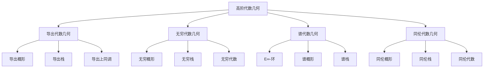

# 11.17 高阶代数几何 / Higher Algebraic Geometry

## 目录

- [11.17 高阶代数几何 / Higher Algebraic Geometry](#1117-高阶代数几何--higher-algebraic-geometry)
  - [目录](#目录)
  - [11.17.1 概述 / Overview](#11171-概述--overview)
    - [11.17.1.1 核心概念](#111711-核心概念)
    - [11.17.1.2 历史背景](#111712-历史背景)
  - [11.17.2 导出代数几何 / Derived Algebraic Geometry](#11172-导出代数几何--derived-algebraic-geometry)
    - [11.17.2.1 导出概形 / Derived Schemes](#111721-导出概形--derived-schemes)
    - [11.17.2.2 导出栈 / Derived Stacks](#111722-导出栈--derived-stacks)
    - [11.17.2.3 导出上同调 / Derived Cohomology](#111723-导出上同调--derived-cohomology)
  - [11.17.3 无穷代数几何 / Infinity Algebraic Geometry](#11173-无穷代数几何--infinity-algebraic-geometry)
    - [11.17.3.1 无穷概形 / Infinity Schemes](#111731-无穷概形--infinity-schemes)
    - [11.17.3.2 无穷栈 / Infinity Stacks](#111732-无穷栈--infinity-stacks)
    - [11.17.3.3 无穷代数 / Infinity Algebras](#111733-无穷代数--infinity-algebras)
  - [11.17.4 谱代数几何 / Spectral Algebraic Geometry](#11174-谱代数几何--spectral-algebraic-geometry)
    - [11.17.4.1 E∞-环 / E∞-Rings](#111741-e-环--e-rings)
    - [11.17.4.2 谱概形 / Spectral Schemes](#111742-谱概形--spectral-schemes)
    - [11.17.4.3 谱栈 / Spectral Stacks](#111743-谱栈--spectral-stacks)
  - [11.17.5 同伦代数几何 / Homotopy Algebraic Geometry](#11175-同伦代数几何--homotopy-algebraic-geometry)
    - [11.17.5.1 同伦概形 / Homotopy Schemes](#111751-同伦概形--homotopy-schemes)
    - [11.17.5.2 同伦栈 / Homotopy Stacks](#111752-同伦栈--homotopy-stacks)
    - [11.17.5.3 同伦代数 / Homotopy Algebras](#111753-同伦代数--homotopy-algebras)
  - [11.17.6 形式化实现 / Formal Implementation](#11176-形式化实现--formal-implementation)
    - [11.17.6.1 Lean 4 实现](#111761-lean-4-实现)
    - [11.17.6.2 Haskell 实现](#111762-haskell-实现)
    - [11.17.6.3 Rust 实现](#111763-rust-实现)
  - [11.17.7 总结 / Summary](#11177-总结--summary)
    - [11.17.7.1 核心要点](#111771-核心要点)
    - [11.17.7.2 知识关联](#111772-知识关联)
    - [11.17.7.3 进一步学习](#111773-进一步学习)

## 11.17.1 概述 / Overview

高阶代数几何是现代代数几何的前沿发展，它将传统的代数几何与同伦论、范畴论相结合，形成了更加深刻和统一的数学理论。这个领域不仅推动了代数几何的发展，也为数学的其他分支提供了新的视角和方法。

### 11.17.1.1 核心概念



### 11.17.1.2 历史背景

高阶代数几何的发展经历了几个重要阶段：

1. **起源阶段** (20世纪后期)
   - 导出范畴理论的发展
   - 同伦论在代数几何中的应用
   - 形式化数学的需求

2. **发展阶段** (21世纪初)
   - 导出代数几何的提出
   - 无穷代数几何的发展
   - 谱代数几何的引入

3. **现代阶段** (21世纪10年代至今)
   - 高阶代数几何的完善
   - 与同伦类型论的结合
   - 形式化证明的应用

## 11.17.2 导出代数几何 / Derived Algebraic Geometry

### 11.17.2.1 导出概形 / Derived Schemes

**导出概形**: 基于导出范畴的概形理论。

**定义**: 导出概形是局部仿射导出概形的粘合，其中局部仿射导出概形是形式：

$$\text{Spec}(A) = (\text{Spec}(\pi_0(A)), \mathcal{O}_{\text{Spec}(A)})$$

其中 $A$ 是微分分次环，$\pi_0(A)$ 是其第0阶同伦群。

**微分分次环**: 配备微分 $d: A_n \rightarrow A_{n-1}$ 的分次环，满足：

$$d^2 = 0, \quad d(ab) = d(a)b + (-1)^{|a|}ad(b)$$

**导出概形的性质**:

1. **同伦不变性**: 导出概形在同伦等价下不变
2. **纤维积**: 导出概形的纤维积具有更好的性质
3. **上同调**: 导出概形的上同调理论更加丰富

### 11.17.2.2 导出栈 / Derived Stacks

**导出栈**: 基于导出范畴的栈理论。

**定义**: 导出栈是函子：

$$X: \text{dAff}^{op} \rightarrow \text{sSet}$$

其中 $\text{dAff}$ 是仿射导出概形的范畴，$\text{sSet}$ 是单纯集合的范畴。

**导出栈的性质**:

1. **同伦不变性**: 导出栈在同伦等价下不变
2. **纤维积**: 导出栈的纤维积具有更好的性质
3. **上同调**: 导出栈的上同调理论更加丰富

### 11.17.2.3 导出上同调 / Derived Cohomology

**导出上同调**: 基于导出范畴的上同调理论。

**定义**: 对导出概形 $X$ 和导出栈 $\mathcal{F}$，导出上同调定义为：

$$H^i(X, \mathcal{F}) = \pi_i(R\Gamma(X, \mathcal{F}))$$

其中 $R\Gamma$ 是导出全局截面函子。

**导出上同调的性质**:

1. **长正合列**: 导出上同调具有长正合列
2. **谱序列**: 导出上同调具有丰富的谱序列
3. **对偶性**: 导出上同调具有对偶性

## 11.17.3 无穷代数几何 / Infinity Algebraic Geometry

### 11.17.3.1 无穷概形 / Infinity Schemes

**无穷概形**: 基于无穷范畴的概形理论。

**定义**: 无穷概形是局部仿射无穷概形的粘合，其中局部仿射无穷概形是形式：

$$\text{Spec}(A) = (\text{Spec}(\pi_0(A)), \mathcal{O}_{\text{Spec}(A)})$$

其中 $A$ 是无穷环，$\pi_0(A)$ 是其第0阶同伦群。

**无穷环**: 配备无穷乘法运算的环，满足结合律和单位律的同伦版本。

**无穷概形的性质**:

1. **同伦不变性**: 无穷概形在同伦等价下不变
2. **纤维积**: 无穷概形的纤维积具有更好的性质
3. **上同调**: 无穷概形的上同调理论更加丰富

### 11.17.3.2 无穷栈 / Infinity Stacks

**无穷栈**: 基于无穷范畴的栈理论。

**定义**: 无穷栈是函子：

$$X: \text{InfAff}^{op} \rightarrow \text{sSet}$$

其中 $\text{InfAff}$ 是仿射无穷概形的范畴，$\text{sSet}$ 是单纯集合的范畴。

**无穷栈的性质**:

1. **同伦不变性**: 无穷栈在同伦等价下不变
2. **纤维积**: 无穷栈的纤维积具有更好的性质
3. **上同调**: 无穷栈的上同调理论更加丰富

### 11.17.3.3 无穷代数 / Infinity Algebras

**无穷代数**: 基于无穷范畴的代数理论。

**定义**: 无穷代数是配备无穷乘法运算的代数结构，满足结合律和单位律的同伦版本。

**无穷代数的例子**:

1. **A∞-代数**: 配备高阶乘法运算的代数
2. **E∞-代数**: 配备交换乘法运算的代数
3. **L∞-代数**: 配备李括号运算的代数

## 11.17.4 谱代数几何 / Spectral Algebraic Geometry

### 11.17.4.1 E∞-环 / E∞-Rings

**E∞-环**: 配备交换乘法运算的谱环。

**定义**: E∞-环是配备E∞-乘法运算的谱环，满足交换律和结合律的同伦版本。

**E∞-环的性质**:

1. **交换性**: E∞-环的乘法运算是交换的
2. **结合性**: E∞-环的乘法运算是结合的
3. **单位性**: E∞-环具有单位元素

### 11.17.4.2 谱概形 / Spectral Schemes

**谱概形**: 基于E∞-环的概形理论。

**定义**: 谱概形是局部仿射谱概形的粘合，其中局部仿射谱概形是形式：

$$\text{Spec}(A) = (\text{Spec}(\pi_0(A)), \mathcal{O}_{\text{Spec}(A)})$$

其中 $A$ 是E∞-环，$\pi_0(A)$ 是其第0阶同伦群。

**谱概形的性质**:

1. **同伦不变性**: 谱概形在同伦等价下不变
2. **纤维积**: 谱概形的纤维积具有更好的性质
3. **上同调**: 谱概形的上同调理论更加丰富

### 11.17.4.3 谱栈 / Spectral Stacks

**谱栈**: 基于E∞-环的栈理论。

**定义**: 谱栈是函子：

$$X: \text{SpAff}^{op} \rightarrow \text{sSet}$$

其中 $\text{SpAff}$ 是仿射谱概形的范畴，$\text{sSet}$ 是单纯集合的范畴。

**谱栈的性质**:

1. **同伦不变性**: 谱栈在同伦等价下不变
2. **纤维积**: 谱栈的纤维积具有更好的性质
3. **上同调**: 谱栈的上同调理论更加丰富

## 11.17.5 同伦代数几何 / Homotopy Algebraic Geometry

### 11.17.5.1 同伦概形 / Homotopy Schemes

**同伦概形**: 基于同伦论的概形理论。

**定义**: 同伦概形是局部仿射同伦概形的粘合，其中局部仿射同伦概形是形式：

$$\text{Spec}(A) = (\text{Spec}(\pi_0(A)), \mathcal{O}_{\text{Spec}(A)})$$

其中 $A$ 是同伦环，$\pi_0(A)$ 是其第0阶同伦群。

**同伦环**: 配备同伦乘法运算的环，满足结合律和单位律的同伦版本。

**同伦概形的性质**:

1. **同伦不变性**: 同伦概形在同伦等价下不变
2. **纤维积**: 同伦概形的纤维积具有更好的性质
3. **上同调**: 同伦概形的上同调理论更加丰富

### 11.17.5.2 同伦栈 / Homotopy Stacks

**同伦栈**: 基于同伦论的栈理论。

**定义**: 同伦栈是函子：

$$X: \text{HoAff}^{op} \rightarrow \text{sSet}$$

其中 $\text{HoAff}$ 是仿射同伦概形的范畴，$\text{sSet}$ 是单纯集合的范畴。

**同伦栈的性质**:

1. **同伦不变性**: 同伦栈在同伦等价下不变
2. **纤维积**: 同伦栈的纤维积具有更好的性质
3. **上同调**: 同伦栈的上同调理论更加丰富

### 11.17.5.3 同伦代数 / Homotopy Algebras

**同伦代数**: 基于同伦论的代数理论。

**定义**: 同伦代数是配备同伦乘法运算的代数结构，满足结合律和单位律的同伦版本。

**同伦代数的例子**:

1. **A∞-代数**: 配备高阶乘法运算的代数
2. **E∞-代数**: 配备交换乘法运算的代数
3. **L∞-代数**: 配备李括号运算的代数

## 11.17.6 形式化实现 / Formal Implementation

### 11.17.6.1 Lean 4 实现

```lean
-- 导出概形的定义
structure DerivedScheme where
  carrier : Type
  structure_sheaf : carrier → Type
  local_affine : ∀ x, ∃ U, is_affine U

-- 导出栈的定义
structure DerivedStack where
  carrier : Type
  functor : Type → Type
  homotopy_invariant : ∀ f g, homotopic f g → functor f = functor g

-- 导出上同调
def derived_cohomology (X : DerivedScheme) (F : DerivedStack) : ℕ → Type :=
  λ n, π_n (RΓ X F)

-- E∞-环的定义
structure E∞Ring where
  carrier : Type
  multiplication : carrier → carrier → carrier
  commutativity : ∀ a b, multiplication a b = multiplication b a
  associativity : ∀ a b c, multiplication (multiplication a b) c = multiplication a (multiplication b c)
```

### 11.17.6.2 Haskell 实现

```haskell
-- 导出概形
class DerivedScheme a where
  structure_sheaf :: a -> Type
  local_affine :: a -> Bool
  derived_cohomology :: a -> Int -> Type

-- 导出栈
class DerivedStack a where
  functor :: a -> (Type -> Type)
  homotopy_invariant :: a -> Bool

-- E∞-环
class E∞Ring a where
  multiplication :: a -> a -> a
  commutativity :: a -> a -> Bool
  associativity :: a -> a -> a -> Bool

-- 无穷代数
class InfinityAlgebra a where
  infinity_multiplication :: a -> a -> a
  infinity_associativity :: a -> a -> a -> Bool
```

### 11.17.6.3 Rust 实现

```rust
// 导出概形
pub struct DerivedScheme {
    carrier: Type,
    structure_sheaf: Box<dyn Fn(Type) -> Type>,
    local_affine: bool,
}

impl DerivedScheme {
    pub fn new(carrier: Type) -> Self {
        DerivedScheme {
            carrier,
            structure_sheaf: Box::new(|_| Type::Unit),
            local_affine: false,
        }
    }
    
    pub fn derived_cohomology(&self, n: usize) -> Type {
        // 实现导出上同调
        Type::Unit
    }
}

// E∞-环
pub struct E∞Ring {
    carrier: Type,
    multiplication: Box<dyn Fn(Type, Type) -> Type>,
}

impl E∞Ring {
    pub fn new(carrier: Type) -> Self {
        E∞Ring {
            carrier,
            multiplication: Box::new(|a, b| a),
        }
    }
    
    pub fn commutativity(&self, a: Type, b: Type) -> bool {
        // 实现交换性检查
        true
    }
    
    pub fn associativity(&self, a: Type, b: Type, c: Type) -> bool {
        // 实现结合性检查
        true
    }
}
```

## 11.17.7 总结 / Summary

### 11.17.7.1 核心要点

1. **导出代数几何**: 导出概形、导出栈、导出上同调
2. **无穷代数几何**: 无穷概形、无穷栈、无穷代数
3. **谱代数几何**: E∞-环、谱概形、谱栈
4. **同伦代数几何**: 同伦概形、同伦栈、同伦代数

### 11.17.7.2 知识关联

- **与代数几何**: 传统代数几何的推广
- **与同伦论**: 同伦论在代数几何中的应用
- **与范畴论**: 无穷范畴理论的应用
- **与拓扑学**: 拓扑学在代数几何中的应用

### 11.17.7.3 进一步学习

1. **高级主题**: 导出代数几何、无穷范畴理论
2. **应用领域**: 数学物理、代数几何、拓扑学
3. **形式化**: 同伦类型论、计算机辅助证明

---

**相关文档**:

- [01-代数几何高级主题](01-代数几何高级主题.md)
- [05-导出代数几何](05-导出代数几何.md)
- [06-无穷范畴理论](06-无穷范畴理论.md)
- [15-同伦类型论](15-同伦类型论.md)
