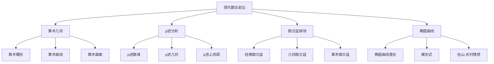

# 11.18 现代数论前沿 / Modern Number Theory Frontiers

## 目录

- [11.18 现代数论前沿 / Modern Number Theory Frontiers](#1118-现代数论前沿--modern-number-theory-frontiers)
  - [目录](#目录)
  - [11.18.1 概述 / Overview](#11181-概述--overview)
    - [11.18.1.1 核心概念](#111811-核心概念)
    - [11.18.1.2 历史背景](#111812-历史背景)
  - [11.18.2 算术几何 / Arithmetic Geometry](#11182-算术几何--arithmetic-geometry)
    - [11.18.2.1 算术概形 / Arithmetic Schemes](#111821-算术概形--arithmetic-schemes)
    - [11.18.2.2 算术曲线 / Arithmetic Curves](#111822-算术曲线--arithmetic-curves)
    - [11.18.2.3 算术曲面 / Arithmetic Surfaces](#111823-算术曲面--arithmetic-surfaces)
  - [11.18.3 p进分析 / p-adic Analysis](#11183-p进分析--p-adic-analysis)
    - [11.18.3.1 p进数域 / p-adic Number Fields](#111831-p进数域--p-adic-number-fields)
    - [11.18.3.2 p进几何 / p-adic Geometry](#111832-p进几何--p-adic-geometry)
    - [11.18.3.3 p进上同调 / p-adic Cohomology](#111833-p进上同调--p-adic-cohomology)
  - [11.18.4 朗兰兹纲领 / Langlands Program](#11184-朗兰兹纲领--langlands-program)
    - [11.18.4.1 经典朗兰兹 / Classical Langlands](#111841-经典朗兰兹--classical-langlands)
    - [11.18.4.2 几何朗兰兹 / Geometric Langlands](#111842-几何朗兰兹--geometric-langlands)
    - [11.18.4.3 算术朗兰兹 / Arithmetic Langlands](#111843-算术朗兰兹--arithmetic-langlands)
  - [11.18.5 椭圆曲线 / Elliptic Curves](#11185-椭圆曲线--elliptic-curves)
    - [11.18.5.1 椭圆曲线理论 / Elliptic Curve Theory](#111851-椭圆曲线理论--elliptic-curve-theory)
    - [11.18.5.2 模形式 / Modular Forms](#111852-模形式--modular-forms)
    - [11.18.5.3 谷山-志村猜想 / Taniyama-Shimura Conjecture](#111853-谷山-志村猜想--taniyama-shimura-conjecture)
  - [11.18.6 形式化实现 / Formal Implementation](#11186-形式化实现--formal-implementation)
    - [11.18.6.1 Lean 4 实现](#111861-lean-4-实现)
    - [11.18.6.2 Haskell 实现](#111862-haskell-实现)
    - [11.18.6.3 Rust 实现](#111863-rust-实现)
  - [11.18.7 总结 / Summary](#11187-总结--summary)
    - [11.18.7.1 核心要点](#111871-核心要点)
    - [11.18.7.2 知识关联](#111872-知识关联)
    - [11.18.7.3 进一步学习](#111873-进一步学习)

## 11.18.1 概述 / Overview

现代数论前沿是数论与几何、代数、分析等数学分支深度融合的最新发展，涵盖了从算术几何到朗兰兹纲领，从p进分析到椭圆曲线的广泛领域。这些理论不仅推动了数论的发展，也为数学的其他分支提供了深刻的洞察。

### 11.18.1.1 核心概念



### 11.18.1.2 历史背景

现代数论前沿的发展经历了几个重要阶段：

1. **经典阶段** (19世纪)
   - 代数数论的发展
   - 解析数论的出现
   - 椭圆曲线理论

2. **现代阶段** (20世纪)
   - 算术几何的提出
   - p进分析的发展
   - 朗兰兹纲领的提出

3. **前沿阶段** (21世纪)
   - 几何朗兰兹的发展
   - 算术朗兰兹的深化
   - 形式化证明的应用

## 11.18.2 算术几何 / Arithmetic Geometry

### 11.18.2.1 算术概形 / Arithmetic Schemes

**算术概形**: 在整数环上的概形理论。

**定义**: 算术概形是局部仿射算术概形的粘合，其中局部仿射算术概形是形式：

$$\text{Spec}(A) = (\text{Spec}(A \otimes \mathbb{Q}), \mathcal{O}_{\text{Spec}(A)})$$

其中 $A$ 是整数环上的代数。

**算术概形的性质**:

1. **纤维化**: 算术概形具有纤维化结构
2. **约化**: 算术概形具有约化结构
3. **上同调**: 算术概形的上同调理论丰富

### 11.18.2.2 算术曲线 / Arithmetic Curves

**算术曲线**: 在整数环上的曲线理论。

**定义**: 算术曲线是亏格 $g$ 的代数曲线，配备整数环上的结构。

**算术曲线的例子**:

1. **椭圆曲线**: 亏格1的算术曲线
2. **超椭圆曲线**: 亏格大于1的算术曲线
3. **模曲线**: 参数化椭圆曲线的算术曲线

### 11.18.2.3 算术曲面 / Arithmetic Surfaces

**算术曲面**: 在整数环上的曲面理论。

**定义**: 算术曲面是二维算术概形，具有丰富的几何结构。

**算术曲面的性质**:

1. **纤维化**: 算术曲面具有纤维化结构
2. **相交理论**: 算术曲面具有相交理论
3. **上同调**: 算术曲面的上同调理论丰富

## 11.18.3 p进分析 / p-adic Analysis

### 11.18.3.1 p进数域 / p-adic Number Fields

**p进数域**: 基于p进赋值的数域。

**定义**: p进数域 $\mathbb{Q}_p$ 是 $\mathbb{Q}$ 关于p进赋值的完备化。

**p进赋值**: 对素数 $p$，p进赋值定义为：

$$|x|_p = p^{-v_p(x)}$$

其中 $v_p(x)$ 是 $x$ 中 $p$ 的幂次。

**p进数域的性质**:

1. **完备性**: p进数域是完备的
2. **紧致性**: p进整数环是紧致的
3. **局部性**: p进数域是局部域

### 11.18.3.2 p进几何 / p-adic Geometry

**p进几何**: 基于p进数域的几何理论。

**定义**: p进几何研究p进数域上的代数几何。

**p进几何的例子**:

1. **p进曲线**: p进数域上的曲线
2. **p进曲面**: p进数域上的曲面
3. **p进流形**: p进数域上的流形

### 11.18.3.3 p进上同调 / p-adic Cohomology

**p进上同调**: 基于p进数域的上同调理论。

**定义**: p进上同调是p进数域上的上同调理论。

**p进上同调的性质**:

1. **局部性**: p进上同调具有局部性质
2. **对偶性**: p进上同调具有对偶性
3. **谱序列**: p进上同调具有谱序列

## 11.18.4 朗兰兹纲领 / Langlands Program

### 11.18.4.1 经典朗兰兹 / Classical Langlands

**经典朗兰兹**: 数论与表示论的对应。

**定义**: 经典朗兰兹纲领建立了数论与表示论之间的对应关系。

**朗兰兹对应**: 设 $G$ 是代数群，$L$ 是朗兰兹群，则存在对应：

$$\text{Gal}(\overline{\mathbb{Q}}/\mathbb{Q}) \rightarrow {}^L G$$

**经典朗兰兹的例子**:

1. **类域论**: 阿贝尔扩张的朗兰兹对应
2. **模形式**: 模形式与伽罗瓦表示的对应
3. **椭圆曲线**: 椭圆曲线与模形式的对应

### 11.18.4.2 几何朗兰兹 / Geometric Langlands

**几何朗兰兹**: 几何版本的朗兰兹纲领。

**定义**: 几何朗兰兹纲领建立了几何对象之间的对应关系。

**几何朗兰兹对应**: 设 $X$ 是代数曲线，$G$ 是代数群，则存在对应：

$$\text{D-modules on } \text{Bun}_G(X) \leqqftrightarrow \text{Sheaves on } \text{Loc}_G(X)$$

**几何朗兰兹的例子**:

1. **D-模**: 代数曲线上的D-模
2. **局部系统**: 代数曲线上的局部系统
3. **朗兰兹对偶**: 几何朗兰兹的对偶性

### 11.18.4.3 算术朗兰兹 / Arithmetic Langlands

**算术朗兰兹**: 算术版本的朗兰兹纲领。

**定义**: 算术朗兰兹纲领建立了算术对象之间的对应关系。

**算术朗兰兹对应**: 设 $K$ 是数域，$G$ 是代数群，则存在对应：

$$\text{Gal}(\overline{K}/K) \rightarrow {}^L G$$

**算术朗兰兹的例子**:

1. **伽罗瓦表示**: 数域的伽罗瓦表示
2. **自守表示**: 代数群的自守表示
3. **朗兰兹函子**: 算术朗兰兹的函子性

## 11.18.5 椭圆曲线 / Elliptic Curves

### 11.18.5.1 椭圆曲线理论 / Elliptic Curve Theory

**椭圆曲线**: 亏格1的代数曲线。

**定义**: 椭圆曲线是形如：

$$y^2 = x^3 + ax + b$$

的代数曲线，其中 $4a^3 + 27b^2 \neqqq 0$。

**椭圆曲线的性质**:

1. **群结构**: 椭圆曲线具有群结构
2. **有理点**: 椭圆曲线的有理点群
3. **L函数**: 椭圆曲线的L函数

### 11.18.5.2 模形式 / Modular Forms

**模形式**: 满足变换性质的解析函数。

**定义**: 模形式是满足以下条件的解析函数：

$$f(\frac{az + b}{cz + d}) = (cz + d)^k f(z)$$

其中 $\begin{pmatrix} a & b \\ c & d \end{pmatrix} \in \text{SL}_2(\mathbb{Z})$。

**模形式的性质**:

1. **傅里叶展开**: 模形式具有傅里叶展开
2. **Hecke算子**: 模形式具有Hecke算子
3. **L函数**: 模形式具有L函数

### 11.18.5.3 谷山-志村猜想 / Taniyama-Shimura Conjecture

**谷山-志村猜想**: 椭圆曲线与模形式的对应。

**定理**: 每个椭圆曲线都对应一个模形式。

**证明**: 谷山-志村猜想由Wiles等人证明，是费马大定理证明的关键步骤。

## 11.18.6 形式化实现 / Formal Implementation

### 11.18.6.1 Lean 4 实现

```lean
-- p进数域的定义
structure PAdicField where
  prime : ℕ
  valuation : ℚ → ℝ
  completion : Type

-- 椭圆曲线的定义
structure EllipticCurve where
  a : ℚ
  b : ℚ
  discriminant : ℚ
  discriminant_nonzero : discriminant ≠ 0

-- 模形式的定义
structure ModularForm where
  weight : ℕ
  level : ℕ
  function : ℂ → ℂ
  transformation : ∀ γ ∈ SL2Z, f(γz) = (cz + d)^weight * f(z)

-- 朗兰兹对应的定义
structure LanglandsCorrespondence where
  galois_group : Type
  langlands_group : Type
  correspondence : galois_group → langlands_group
```

### 11.18.6.2 Haskell 实现

```haskell
-- p进数域
class PAdicField a where
  prime :: a -> Integer
  valuation :: a -> Rational -> Double
  completion :: a -> Type

-- 椭圆曲线
data EllipticCurve = EllipticCurve
  { a :: Rational
  , b :: Rational
  , discriminant :: Rational
  }

-- 模形式
class ModularForm a where
  weight :: a -> Integer
  level :: a -> Integer
  function :: a -> Complex Double -> Complex Double
  transformation :: a -> Bool

-- 朗兰兹对应
class LanglandsCorrespondence a where
  galois_group :: a -> Type
  langlands_group :: a -> Type
  correspondence :: a -> (Type -> Type)
```

### 11.18.6.3 Rust 实现

```rust
// p进数域
pub struct PAdicField {
    prime: u64,
    valuation: Box<dyn Fn(Rational) -> f64>,
    completion: Type,
}

impl PAdicField {
    pub fn new(prime: u64) -> Self {
        PAdicField {
            prime,
            valuation: Box::new(|_| 0.0),
            completion: Type::Unit,
        }
    }

    pub fn valuation(&self, x: Rational) -> f64 {
        // 实现p进赋值
        0.0
    }
}

// 椭圆曲线
pub struct EllipticCurve {
    a: Rational,
    b: Rational,
    discriminant: Rational,
}

impl EllipticCurve {
    pub fn new(a: Rational, b: Rational) -> Self {
        let discriminant = -16 * (4 * a * a * a + 27 * b * b);
        EllipticCurve { a, b, discriminant }
    }

    pub fn is_smooth(&self) -> bool {
        self.discriminant != Rational::zero()
    }
}

// 模形式
pub struct ModularForm {
    weight: i64,
    level: i64,
    function: Box<dyn Fn(Complex<f64>) -> Complex<f64>>,
}

impl ModularForm {
    pub fn new(weight: i64, level: i64) -> Self {
        ModularForm {
            weight,
            level,
            function: Box::new(|_| Complex::new(0.0, 0.0)),
        }
    }

    pub fn evaluate(&self, z: Complex<f64>) -> Complex<f64> {
        (self.function)(z)
    }
}
```

## 11.18.7 总结 / Summary

### 11.18.7.1 核心要点

1. **算术几何**: 算术概形、算术曲线、算术曲面
2. **p进分析**: p进数域、p进几何、p进上同调
3. **朗兰兹纲领**: 经典朗兰兹、几何朗兰兹、算术朗兰兹
4. **椭圆曲线**: 椭圆曲线理论、模形式、谷山-志村猜想

### 11.18.7.2 知识关联

- **与代数几何**: 算术几何、p进几何
- **与表示论**: 朗兰兹纲领、自守表示
- **与分析学**: p进分析、模形式
- **与拓扑学**: 上同调理论、几何朗兰兹

### 11.18.7.3 进一步学习

1. **高级主题**: 几何朗兰兹、算术朗兰兹
2. **应用领域**: 密码学、数学物理、代数几何
3. **形式化**: 同伦类型论、计算机辅助证明

---

**相关文档**:

- [11-算术几何](11-算术几何.md)
- [10-朗兰兹纲领](10-朗兰兹纲领.md)
- [12-几何朗兰兹纲领](12-几何朗兰兹纲领.md)
- [13-量子几何朗兰兹纲领](13-量子几何朗兰兹纲领.md)
