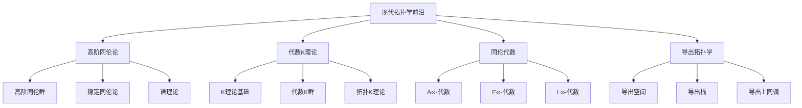

# 19. 现代拓扑学前沿 / Modern Topology Frontiers

## 目录

- [19. 现代拓扑学前沿 / Modern Topology Frontiers](#19-现代拓扑学前沿--modern-topology-frontiers)
  - [目录](#目录)
  - [19.1 概述 / Overview](#191-概述--overview)
    - [19.1.1 核心概念](#1911-核心概念)
    - [19.1.2 历史背景](#1912-历史背景)
  - [19.2 高阶同伦论 / Higher Homotopy Theory](#192-高阶同伦论--higher-homotopy-theory)
    - [19.2.1 高阶同伦群 / Higher Homotopy Groups](#1921-高阶同伦群--higher-homotopy-groups)
    - [19.2.2 稳定同伦论 / Stable Homotopy Theory](#1922-稳定同伦论--stable-homotopy-theory)
    - [19.2.3 谱理论 / Spectral Theory](#1923-谱理论--spectral-theory)
  - [19.3 代数K理论 / Algebraic K-Theory](#193-代数k理论--algebraic-k-theory)
    - [19.3.1 K理论基础 / K-Theory Foundation](#1931-k理论基础--k-theory-foundation)
    - [19.3.2 代数K群 / Algebraic K-Groups](#1932-代数k群--algebraic-k-groups)
    - [19.3.3 拓扑K理论 / Topological K-Theory](#1933-拓扑k理论--topological-k-theory)
  - [19.4 同伦代数 / Homotopy Algebra](#194-同伦代数--homotopy-algebra)
    - [19.4.1 A∞-代数 / A∞-Algebras](#1941-a-代数--a-algebras)
    - [19.4.2 E∞-代数 / E∞-Algebras](#1942-e-代数--e-algebras)
    - [19.4.3 L∞-代数 / L∞-Algebras](#1943-l-代数--l-algebras)
  - [19.5 导出拓扑学 / Derived Topology](#195-导出拓扑学--derived-topology)
    - [19.5.1 导出空间 / Derived Spaces](#1951-导出空间--derived-spaces)
    - [19.5.2 导出栈 / Derived Stacks](#1952-导出栈--derived-stacks)
    - [19.5.3 导出上同调 / Derived Cohomology](#1953-导出上同调--derived-cohomology)
  - [19.6 形式化实现 / Formal Implementation](#196-形式化实现--formal-implementation)
    - [19.6.1 Lean 4 实现](#1961-lean-4-实现)
    - [19.6.2 Haskell 实现](#1962-haskell-实现)
    - [19.6.3 Rust 实现](#1963-rust-实现)
  - [19.7 总结 / Summary](#197-总结--summary)
    - [19.7.1 核心要点](#1971-核心要点)
    - [19.7.2 知识关联](#1972-知识关联)
    - [19.7.3 进一步学习](#1973-进一步学习)

## 19.1 概述 / Overview

现代拓扑学前沿是拓扑学与现代数学其他分支深度融合的最新发展，涵盖了从高阶同伦论到代数K理论，从同伦代数到导出拓扑学的广泛领域。这些理论不仅推动了拓扑学的发展，也为数学的其他分支提供了深刻的洞察。

### 19.1.1 核心概念



### 19.1.2 历史背景

现代拓扑学前沿的发展经历了几个重要阶段：

1. **经典阶段** (20世纪初)
   - 同伦论的基础发展
   - 代数拓扑的出现
   - 同调论的发展

2. **现代阶段** (20世纪中后期)
   - 高阶同伦论的发展
   - 代数K理论的提出
   - 同伦代数的引入

3. **前沿阶段** (21世纪)
   - 导出拓扑学的出现
   - 同伦类型论的发展
   - 形式化证明的应用

## 19.2 高阶同伦论 / Higher Homotopy Theory

### 19.2.1 高阶同伦群 / Higher Homotopy Groups

**高阶同伦群**: 拓扑空间的高维同伦不变量。

**定义**: 设 $X$ 是拓扑空间，$x_0 \in X$ 是基点，$n \geq 2$，则第 $n$ 个同伦群定义为：

$$\pi_n(X, x_0) = [S^n, X]$$

其中 $[S^n, X]$ 表示从 $n$ 维球面到 $X$ 的连续映射的同伦类。

**高阶同伦群的性质**:

1. **阿贝尔性**: 当 $n \geq 2$ 时，$\pi_n(X, x_0)$ 是阿贝尔群
2. **函子性**: $\pi_n$ 是函子
3. **长正合列**: 纤维化诱导长正合列

**计算例子**:

- $\pi_n(S^n) = \mathbb{Z}$
- $\pi_n(S^m) = 0$ 当 $n < m$
- $\pi_3(S^2) = \mathbb{Z}$

### 19.2.2 稳定同伦论 / Stable Homotopy Theory

**稳定同伦论**: 研究同伦群在稳定化下的性质。

**稳定化**: 对空间 $X$，其稳定化定义为：

$$\Sigma X = S^1 \wedge X$$

**稳定同伦群**:

$$\pi_n^s(X) = \lim_{k \rightarrow \infty} \pi_{n+k}(\Sigma^k X)$$

**稳定同伦论的性质**:

1. **稳定性**: 稳定同伦群在充分高阶后稳定
2. **周期性**: 某些稳定同伦群具有周期性
3. **谱序列**: 稳定同伦论具有丰富的谱序列

### 19.2.3 谱理论 / Spectral Theory

**谱**: 拓扑空间的高阶同伦不变量。

**定义**: 谱是配备结构映射的序列：

$$E = \{E_n, \sigma_n: \Sigma E_n \rightarrow E_{n+1}\}$$

**谱的性质**:

1. **同伦群**: $\pi_n(E) = \lim_{k \rightarrow \infty} \pi_{n+k}(E_k)$
2. **上同调**: $E^n(X) = [X, E_n]$
3. **乘法结构**: 谱具有乘法结构

## 19.3 代数K理论 / Algebraic K-Theory

### 19.3.1 K理论基础 / K-Theory Foundation

**K理论**: 研究向量丛和代数结构的理论。

**Grothendieck群**: 设 $R$ 是环，$K_0(R)$ 是有限生成投射 $R$-模的Grothendieck群：

$$K_0(R) = \text{Grothendieck group of } \text{Proj}(R)$$

**K理论的性质**:

1. **函子性**: $K_0$ 是函子
2. **加法性**: $K_0(R \times S) = K_0(R) \times K_0(S)$
3. **周期性**: 某些环的K群具有周期性

### 19.3.2 代数K群 / Algebraic K-Groups

**高阶K群**: 通过加性范畴定义的K群。

**定义**: 对 $n \geq 1$，$K_n(R)$ 定义为：

$$K_n(R) = \pi_n(BGL(R)^+)$$

其中 $BGL(R)^+$ 是 $BGL(R)$ 的加性化。

**代数K群的性质**:

1. **周期性**: $K_n(R) = K_{n+8}(R)$ 对某些环
2. **函子性**: $K_n$ 是函子
3. **长正合列**: 短正合列诱导长正合列

### 19.3.3 拓扑K理论 / Topological K-Theory

**拓扑K理论**: 研究向量丛的拓扑性质。

**定义**: 对紧致豪斯多夫空间 $X$，拓扑K理论定义为：

$$K^0(X) = \text{Grothendieck group of vector bundles over } X$$

**拓扑K理论的性质**:

1. **周期性**: $K^n(X) = K^{n+2}(X)$
2. **函子性**: $K^*$ 是反变函子
3. **乘法结构**: $K^*(X)$ 具有乘法结构

## 19.4 同伦代数 / Homotopy Algebra

### 19.4.1 A∞-代数 / A∞-Algebras

**A∞-代数**: 配备高阶乘法运算的代数。

**定义**: A∞-代数是配备映射 $m_n: A^{\otimes n} \rightarrow A$ 的向量空间 $A$，满足：

$$\sum_{i+j+k=n} (-1)^{i+jk} m_{i+1+k} \circ (1^{\otimes i} \otimes m_j \otimes 1^{\otimes k}) = 0$$

**A∞-代数的例子**:

1. **微分分次代数**: 配备微分的分次代数
2. **同伦结合代数**: 在同伦意义下结合的代数
3. **A∞-范畴**: 配备A∞-结构的范畴

### 19.4.2 E∞-代数 / E∞-Algebras

**E∞-代数**: 配备交换乘法运算的代数。

**定义**: E∞-代数是配备交换乘法运算的代数，满足交换律和结合律的同伦版本。

**E∞-代数的例子**:

1. **交换代数**: 传统的交换代数
2. **E∞-环**: 配备E∞-乘法运算的环
3. **E∞-范畴**: 配备E∞-结构的范畴

### 19.4.3 L∞-代数 / L∞-Algebras

**L∞-代数**: 配备李括号运算的代数。

**定义**: L∞-代数是配备李括号运算的代数，满足雅可比恒等式的同伦版本。

**L∞-代数的例子**:

1. **李代数**: 传统的李代数
2. **微分分次李代数**: 配备微分的分次李代数
3. **L∞-范畴**: 配备L∞-结构的范畴

## 19.5 导出拓扑学 / Derived Topology

### 19.5.1 导出空间 / Derived Spaces

**导出空间**: 基于导出范畴的拓扑空间理论。

**定义**: 导出空间是局部仿射导出空间的粘合，其中局部仿射导出空间是形式：

$$\text{Spec}(A) = (\text{Spec}(\pi_0(A)), \mathcal{O}_{\text{Spec}(A)})$$

其中 $A$ 是微分分次环，$\pi_0(A)$ 是其第0阶同伦群。

**导出空间的性质**:

1. **同伦不变性**: 导出空间在同伦等价下不变
2. **纤维积**: 导出空间的纤维积具有更好的性质
3. **上同调**: 导出空间的上同调理论更加丰富

### 19.5.2 导出栈 / Derived Stacks

**导出栈**: 基于导出范畴的栈理论。

**定义**: 导出栈是函子：

$$X: \text{dAff}^{op} \rightarrow \text{sSet}$$

其中 $\text{dAff}$ 是仿射导出空间的范畴，$\text{sSet}$ 是单纯集合的范畴。

**导出栈的性质**:

1. **同伦不变性**: 导出栈在同伦等价下不变
2. **纤维积**: 导出栈的纤维积具有更好的性质
3. **上同调**: 导出栈的上同调理论更加丰富

### 19.5.3 导出上同调 / Derived Cohomology

**导出上同调**: 基于导出范畴的上同调理论。

**定义**: 对导出空间 $X$ 和导出栈 $\mathcal{F}$，导出上同调定义为：

$$H^i(X, \mathcal{F}) = \pi_i(R\Gamma(X, \mathcal{F}))$$

其中 $R\Gamma$ 是导出全局截面函子。

**导出上同调的性质**:

1. **长正合列**: 导出上同调具有长正合列
2. **谱序列**: 导出上同调具有丰富的谱序列
3. **对偶性**: 导出上同调具有对偶性

## 19.6 形式化实现 / Formal Implementation

### 19.6.1 Lean 4 实现

```lean
-- 高阶同伦群的定义
structure HigherHomotopyGroup (X : Type) (n : ℕ) where
  base_point : X
  group_structure : Group (π_n X base_point)

-- 代数K理论的定义
structure AlgebraicKTheory (R : Ring) where
  K0 : Type
  K1 : Type
  K2 : Type
  periodicity : K_n R = K_{n+8} R

-- A∞-代数的定义
structure A∞Algebra where
  carrier : Type
  multiplication : carrier → carrier → carrier
  higher_multiplication : ∀ n, carrier^n → carrier
  associativity : ∀ n, associativity_condition n
```

### 19.6.2 Haskell 实现

```haskell
-- 高阶同伦群
class HigherHomotopyGroup a where
  base_point :: a
  group_structure :: Group (π_n a base_point)

-- 代数K理论
class AlgebraicKTheory a where
  k0 :: a -> Type
  k1 :: a -> Type
  k2 :: a -> Type
  periodicity :: a -> Bool

-- A∞-代数
class A∞Algebra a where
  multiplication :: a -> a -> a
  higher_multiplication :: Int -> [a] -> a
  associativity :: a -> Bool

-- E∞-代数
class E∞Algebra a where
  multiplication :: a -> a -> a
  commutativity :: a -> a -> Bool
  associativity :: a -> a -> a -> Bool
```

### 19.6.3 Rust 实现

```rust
// 高阶同伦群
pub struct HigherHomotopyGroup {
    base_point: Type,
    group_structure: Group,
}

impl HigherHomotopyGroup {
    pub fn new(base_point: Type) -> Self {
        HigherHomotopyGroup {
            base_point,
            group_structure: Group::new(),
        }
    }
    
    pub fn homotopy_group(&self, n: usize) -> Group {
        // 实现高阶同伦群计算
        Group::new()
    }
}

// 代数K理论
pub struct AlgebraicKTheory {
    ring: Ring,
    k_groups: Vec<Group>,
}

impl AlgebraicKTheory {
    pub fn new(ring: Ring) -> Self {
        AlgebraicKTheory {
            ring,
            k_groups: Vec::new(),
        }
    }
    
    pub fn k_group(&self, n: usize) -> Group {
        // 实现K群计算
        Group::new()
    }
    
    pub fn periodicity(&self, n: usize) -> bool {
        // 实现周期性检查
        n % 8 == 0
    }
}

// A∞-代数
pub struct A∞Algebra {
    carrier: Type,
    multiplication: Box<dyn Fn(Type, Type) -> Type>,
    higher_multiplication: Box<dyn Fn(usize, Vec<Type>) -> Type>,
}

impl A∞Algebra {
    pub fn new(carrier: Type) -> Self {
        A∞Algebra {
            carrier,
            multiplication: Box::new(|a, b| a),
            higher_multiplication: Box::new(|_, _| Type::Unit),
        }
    }
    
    pub fn associativity(&self, a: Type, b: Type, c: Type) -> bool {
        // 实现结合性检查
        true
    }
}
```

## 19.7 总结 / Summary

### 19.7.1 核心要点

1. **高阶同伦论**: 高阶同伦群、稳定同伦论、谱理论
2. **代数K理论**: K理论基础、代数K群、拓扑K理论
3. **同伦代数**: A∞-代数、E∞-代数、L∞-代数
4. **导出拓扑学**: 导出空间、导出栈、导出上同调

### 19.7.2 知识关联

- **与代数拓扑**: 高阶同伦论、代数K理论
- **与同伦论**: 稳定同伦论、谱理论
- **与代数**: 同伦代数、导出代数
- **与几何**: 导出拓扑学、导出几何

### 19.7.3 进一步学习

1. **高级主题**: 导出拓扑学、同伦代数
2. **应用领域**: 代数几何、数学物理、拓扑学
3. **形式化**: 同伦类型论、计算机辅助证明

---

**相关文档**:

- [07-高阶同伦论](07-高阶同伦论.md)
- [08-代数K理论](08-代数K理论.md)
- [15-同伦类型论](15-同伦类型论.md)
- [17-高阶代数几何](17-高阶代数几何.md)
