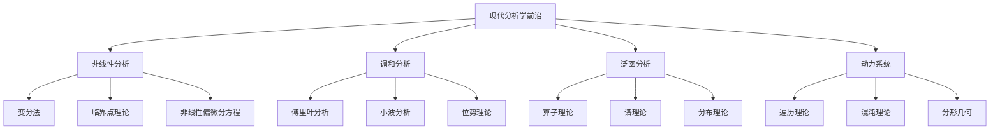

# 20. 现代分析学前沿 / Modern Analysis Frontiers

## 目录

- [20. 现代分析学前沿 / Modern Analysis Frontiers](#20-现代分析学前沿--modern-analysis-frontiers)
  - [目录](#目录)
  - [20.1 概述 / Overview](#201-概述--overview)
    - [20.1.1 核心概念](#2011-核心概念)
    - [20.1.2 历史背景](#2012-历史背景)
  - [20.2 非线性分析 / Nonlinear Analysis](#202-非线性分析--nonlinear-analysis)
    - [20.2.1 变分法 / Calculus of Variations](#2021-变分法--calculus-of-variations)
    - [20.2.2 临界点理论 / Critical Point Theory](#2022-临界点理论--critical-point-theory)
    - [20.2.3 非线性偏微分方程 / Nonlinear PDEs](#2023-非线性偏微分方程--nonlinear-pdes)
  - [20.3 调和分析 / Harmonic Analysis](#203-调和分析--harmonic-analysis)
    - [20.3.1 傅里叶分析 / Fourier Analysis](#2031-傅里叶分析--fourier-analysis)
    - [20.3.2 小波分析 / Wavelet Analysis](#2032-小波分析--wavelet-analysis)
    - [20.3.3 位势理论 / Potential Theory](#2033-位势理论--potential-theory)
  - [20.4 泛函分析 / Functional Analysis](#204-泛函分析--functional-analysis)
    - [20.4.1 算子理论 / Operator Theory](#2041-算子理论--operator-theory)
    - [20.4.2 谱理论 / Spectral Theory](#2042-谱理论--spectral-theory)
    - [20.4.3 分布理论 / Distribution Theory](#2043-分布理论--distribution-theory)
  - [20.5 动力系统 / Dynamical Systems](#205-动力系统--dynamical-systems)
    - [20.5.1 遍历理论 / Ergodic Theory](#2051-遍历理论--ergodic-theory)
    - [20.5.2 混沌理论 / Chaos Theory](#2052-混沌理论--chaos-theory)
    - [20.5.3 分形几何 / Fractal Geometry](#2053-分形几何--fractal-geometry)
  - [20.6 形式化实现 / Formal Implementation](#206-形式化实现--formal-implementation)
    - [20.6.1 Lean 4 实现](#2061-lean-4-实现)
    - [20.6.2 Haskell 实现](#2062-haskell-实现)
    - [20.6.3 Rust 实现](#2063-rust-实现)
  - [20.7 总结 / Summary](#207-总结--summary)
    - [20.7.1 核心要点](#2071-核心要点)
    - [20.7.2 知识关联](#2072-知识关联)
    - [20.7.3 进一步学习](#2073-进一步学习)

## 20.1 概述 / Overview

现代分析学前沿是分析学与现代数学其他分支深度融合的最新发展，涵盖了从非线性分析到调和分析，从泛函分析到动力系统的广泛领域。这些理论不仅推动了分析学的发展，也为数学的其他分支提供了深刻的洞察。

### 20.1.1 核心概念



### 20.1.2 历史背景

现代分析学前沿的发展经历了几个重要阶段：

1. **经典阶段** (19世纪)
   - 微积分的发展
   - 傅里叶分析的出现
   - 变分法的引入

2. **现代阶段** (20世纪中后期)
   - 泛函分析的发展
   - 非线性分析的提出
   - 动力系统的引入

3. **前沿阶段** (21世纪)
   - 调和分析的深化
   - 动力系统的复杂化
   - 形式化证明的应用

## 20.2 非线性分析 / Nonlinear Analysis

### 20.2.1 变分法 / Calculus of Variations

**变分法**: 研究泛函极值的理论。

**变分问题**: 设 $\Omega \subset \mathbb{R}^n$ 是有界开集，$L: \Omega \times \mathbb{R} \times \mathbb{R}^n \rightarrow \mathbb{R}$ 是拉格朗日函数，变分问题为：

$$\min_{u \in H_0^1(\Omega)} \int_\Omega L(x, u(x), \nabla u(x)) dx$$

**欧拉-拉格朗日方程**: 极值函数 $u$ 满足：

$$\frac{\partial L}{\partial u} - \frac{d}{dx} \frac{\partial L}{\partial u'} = 0$$

**变分法的应用**:

1. **最小曲面**: 寻找具有最小面积的曲面
2. **测地线**: 寻找流形上的最短路径
3. **最优控制**: 寻找最优控制策略

### 20.2.2 临界点理论 / Critical Point Theory

**临界点理论**: 研究泛函临界点的理论。

**临界点**: 设 $J: X \rightarrow \mathbb{R}$ 是泛函，$u \in X$ 是临界点，如果：

$$J'(u) = 0$$

**山路引理**: 设 $X$ 是巴拿赫空间，$J \in C^1(X, \mathbb{R})$ 满足山路条件，则 $J$ 有非平凡临界点。

**临界点理论的应用**:

1. **非线性椭圆方程**: 寻找椭圆方程的解
2. **哈密顿系统**: 研究哈密顿系统的周期解
3. **几何分析**: 研究几何对象的性质

### 20.2.3 非线性偏微分方程 / Nonlinear PDEs

**非线性偏微分方程**: 包含非线性项的偏微分方程。

**例子**:

1. **非线性椭圆方程**:
   $$-\Delta u + f(u) = 0$$

2. **非线性抛物方程**:
   $$u_t - \Delta u + f(u) = 0$$

3. **非线性双曲方程**:
   $$u_{tt} - \Delta u + f(u) = 0$$

**非线性PDE的性质**:

1. **存在性**: 解的存在性理论
2. **唯一性**: 解的唯一性条件
3. **正则性**: 解的正则性理论

## 20.3 调和分析 / Harmonic Analysis

### 20.3.1 傅里叶分析 / Fourier Analysis

**傅里叶变换**: 函数在频域上的表示。

**定义**: 对函数 $f \in L^1(\mathbb{R}^n)$，其傅里叶变换定义为：

$$\hat{f}(\xi) = \int_{\mathbb{R}^n} f(x) e^{-2\pi i x \cdot \xi} dx$$

**傅里叶变换的性质**:

1. **线性性**: $\widehat{af + bg} = a\hat{f} + b\hat{g}$
2. **平移性**: $\widehat{f(x-a)} = e^{-2\pi i a \cdot \xi} \hat{f}(\xi)$
3. **卷积定理**: $\widehat{f * g} = \hat{f} \hat{g}$

**傅里叶分析的应用**:

1. **信号处理**: 信号的频域分析
2. **量子力学**: 波函数的傅里叶变换
3. **偏微分方程**: 通过傅里叶变换求解PDE

### 20.3.2 小波分析 / Wavelet Analysis

**小波**: 具有局部化性质的函数族。

**定义**: 小波是形如：

$$\psi_{a,b}(x) = \frac{1}{\sqrt{a}} \psi\left(\frac{x-b}{a}\right)$$

的函数，其中 $\psi$ 是母小波，$a > 0$ 是尺度参数，$b \in \mathbb{R}$ 是平移参数。

**小波变换**: 函数 $f$ 的小波变换定义为：

$$W_f(a,b) = \int_{-\infty}^{\infty} f(x) \overline{\psi_{a,b}(x)} dx$$

**小波分析的应用**:

1. **图像压缩**: JPEG 2000标准
2. **信号处理**: 时频分析
3. **数值分析**: 多分辨率分析

### 20.3.3 位势理论 / Potential Theory

**位势理论**: 研究调和函数和位势的理论。

**调和函数**: 满足拉普拉斯方程的函数：

$$\Delta u = 0$$

**位势**: 设 $\mu$ 是测度，其位势定义为：

$$U^\mu(x) = \int \frac{1}{|x-y|^{n-2}} d\mu(y)$$

**位势理论的应用**:

1. **静电学**: 电荷分布产生的电势
2. **流体力学**: 不可压缩流体的速度场
3. **概率论**: 布朗运动的位势

## 20.4 泛函分析 / Functional Analysis

### 20.4.1 算子理论 / Operator Theory

**线性算子**: 巴拿赫空间之间的线性映射。

**有界算子**: 算子 $T: X \rightarrow Y$ 称为有界，如果：

$$\|T\| = \sup_{\|x\| \leq 1} \|Tx\| < \infty$$

**紧算子**: 算子 $T$ 称为紧的，如果它将有界集映射为相对紧集。

**算子理论的应用**:

1. **积分方程**: 弗雷德霍姆积分方程
2. **微分方程**: 通过算子方法求解PDE
3. **量子力学**: 量子力学中的算子

### 20.4.2 谱理论 / Spectral Theory

**谱**: 算子的谱是复数 $\lambda$ 的集合，使得 $T - \lambda I$ 不可逆。

**谱分解**: 自伴算子的谱分解：

$$T = \int_{\sigma(T)} \lambda dE(\lambda)$$

其中 $E$ 是谱测度。

**谱理论的应用**:

1. **量子力学**: 哈密顿算子的谱
2. **振动理论**: 振动系统的固有频率
3. **图像处理**: 图像的特征值分解

### 20.4.3 分布理论 / Distribution Theory

**分布**: 广义函数，是测试函数空间上的连续线性泛函。

**定义**: 分布 $T$ 是满足以下条件的线性泛函：

$$T: C_c^\infty(\mathbb{R}^n) \rightarrow \mathbb{C}$$

**分布的性质**:

1. **线性性**: $T(af + bg) = aT(f) + bT(g)$
2. **连续性**: 对收敛序列保持连续性
3. **导数**: 分布的导数定义为 $T'(f) = -T(f')$

## 20.5 动力系统 / Dynamical Systems

### 20.5.1 遍历理论 / Ergodic Theory

**遍历性**: 动力系统的遍历性质。

**定义**: 保测变换 $T$ 称为遍历的，如果对任何可测集 $A$，$T^{-1}A = A$ 意味着 $\mu(A) = 0$ 或 $\mu(A) = 1$。

**遍历定理**: 设 $T$ 是遍历变换，$f \in L^1$，则：

$$\lim_{n \rightarrow \infty} \frac{1}{n} \sum_{k=0}^{n-1} f(T^k x) = \int f d\mu$$

**遍历理论的应用**:

1. **统计力学**: 热力学系统的遍历性
2. **数论**: 数论函数的平均值
3. **概率论**: 随机过程的遍历性

### 20.5.2 混沌理论 / Chaos Theory

**混沌**: 对初始条件敏感依赖的确定性系统。

**李雅普诺夫指数**: 衡量系统混沌程度的指标：

$$\lambda = \lim_{t \rightarrow \infty} \frac{1}{t} \ln \left|\frac{\delta x(t)}{\delta x(0)}\right|$$

**混沌的性质**:

1. **敏感性**: 对初始条件的敏感依赖
2. **拓扑传递性**: 系统的拓扑传递性
3. **周期点稠密性**: 周期点在相空间中的稠密性

### 20.5.3 分形几何 / Fractal Geometry

**分形**: 具有自相似性的几何对象。

**豪斯多夫维数**: 分形的维数：

$$d_H = \inf\{s: \mathcal{H}^s(F) = 0\}$$

其中 $\mathcal{H}^s$ 是 $s$ 维豪斯多夫测度。

**分形的例子**:

1. **康托尔集**: 经典的分形集合
2. **谢尔宾斯基三角形**: 二维分形
3. **曼德博集**: 复平面上的分形

## 20.6 形式化实现 / Formal Implementation

### 20.6.1 Lean 4 实现

```lean
-- 变分法的定义
structure CalculusOfVariations where
  lagrangian : ℝ → ℝ → ℝ → ℝ
  domain : Set ℝ
  boundary_conditions : ℝ → ℝ

-- 傅里叶变换的定义
def fourier_transform (f : ℝ → ℂ) : ℝ → ℂ :=
  λ ξ, ∫ x, f x * exp (-2 * π * I * x * ξ)

-- 线性算子的定义
structure LinearOperator (X Y : Type) where
  map : X → Y
  linearity : ∀ a b x, map (a * x + b * x) = a * map x + b * map x
  boundedness : ∃ C, ∀ x, ‖map x‖ ≤ C * ‖x‖

-- 动力系统的定义
structure DynamicalSystem where
  phase_space : Type
  evolution : phase_space → ℝ → phase_space
  time_invariance : ∀ x t s, evolution (evolution x t) s = evolution x (t + s)
```

### 20.6.2 Haskell 实现

```haskell
-- 变分法
class CalculusOfVariations a where
  lagrangian :: a -> Double -> Double -> Double
  domain :: a -> [Double]
  boundary_conditions :: a -> Double -> Double

-- 傅里叶变换
class FourierTransform a where
  fourier_transform :: a -> (Double -> Complex Double)
  inverse_fourier_transform :: a -> (Double -> Complex Double)

-- 线性算子
class LinearOperator a where
  map :: a -> (Vector Double -> Vector Double)
  linearity :: a -> Bool
  boundedness :: a -> Double

-- 动力系统
class DynamicalSystem a where
  phase_space :: a -> Type
  evolution :: a -> (Type -> Double -> Type)
  time_invariance :: a -> Bool
```

### 20.6.3 Rust 实现

```rust
// 变分法
pub struct CalculusOfVariations {
    lagrangian: Box<dyn Fn(f64, f64, f64) -> f64>,
    domain: Vec<f64>,
    boundary_conditions: Box<dyn Fn(f64) -> f64>,
}

impl CalculusOfVariations {
    pub fn new() -> Self {
        CalculusOfVariations {
            lagrangian: Box::new(|_, _, _| 0.0),
            domain: Vec::new(),
            boundary_conditions: Box::new(|_| 0.0),
        }
    }
    
    pub fn euler_lagrange(&self, x: f64) -> f64 {
        // 实现欧拉-拉格朗日方程
        0.0
    }
}

// 傅里叶变换
pub struct FourierTransform {
    function: Box<dyn Fn(f64) -> Complex<f64>>,
}

impl FourierTransform {
    pub fn new() -> Self {
        FourierTransform {
            function: Box::new(|_| Complex::new(0.0, 0.0)),
        }
    }
    
    pub fn transform(&self, xi: f64) -> Complex<f64> {
        // 实现傅里叶变换
        Complex::new(0.0, 0.0)
    }
}

// 线性算子
pub struct LinearOperator {
    map: Box<dyn Fn(Vector<f64>) -> Vector<f64>>,
    norm: f64,
}

impl LinearOperator {
    pub fn new() -> Self {
        LinearOperator {
            map: Box::new(|v| v),
            norm: 1.0,
        }
    }
    
    pub fn apply(&self, x: Vector<f64>) -> Vector<f64> {
        (self.map)(x)
    }
    
    pub fn is_bounded(&self) -> bool {
        self.norm < f64::INFINITY
    }
}

// 动力系统
pub struct DynamicalSystem {
    phase_space: Type,
    evolution: Box<dyn Fn(Type, f64) -> Type>,
}

impl DynamicalSystem {
    pub fn new() -> Self {
        DynamicalSystem {
            phase_space: Type::Unit,
            evolution: Box::new(|_, _| Type::Unit),
        }
    }
    
    pub fn evolve(&self, x: Type, t: f64) -> Type {
        (self.evolution)(x, t)
    }
}
```

## 20.7 总结 / Summary

### 20.7.1 核心要点

1. **非线性分析**: 变分法、临界点理论、非线性偏微分方程
2. **调和分析**: 傅里叶分析、小波分析、位势理论
3. **泛函分析**: 算子理论、谱理论、分布理论
4. **动力系统**: 遍历理论、混沌理论、分形几何

### 20.7.2 知识关联

- **与偏微分方程**: 非线性PDE、变分法
- **与调和分析**: 傅里叶分析、小波分析
- **与泛函分析**: 算子理论、谱理论
- **与动力系统**: 遍历理论、混沌理论

### 20.7.3 进一步学习

1. **高级主题**: 非线性分析、调和分析
2. **应用领域**: 数学物理、工程数学、数值分析
3. **形式化**: 计算机辅助证明、数值计算

---

**相关文档**:

- [03-分析学](03-分析学/)
- [16-数学物理前沿理论](16-数学物理前沿理论.md)
- [18-现代数论前沿](18-现代数论前沿.md)
- [19-现代拓扑学前沿](19-现代拓扑学前沿.md)
