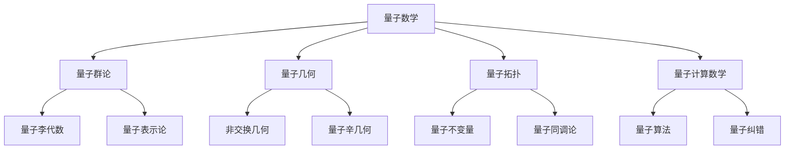
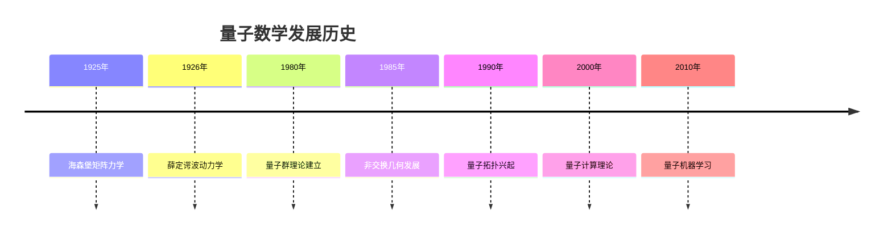

# 24. 量子数学 / Quantum Mathematics

## 目录

- [24. 量子数学 / Quantum Mathematics](#24-量子数学--quantum-mathematics)
  - [目录](#目录)
  - [24.1 概述 / Overview](#241-概述--overview)
    - [24.1.1 量子数学的定义](#2411-量子数学的定义)
    - [24.1.2 量子数学的核心思想](#2412-量子数学的核心思想)
  - [24.2 历史发展 / Historical Development](#242-历史发展--historical-development)
    - [24.2.1 发展时间线](#2421-发展时间线)
    - [24.2.2 重要人物贡献](#2422-重要人物贡献)
    - [24.2.3 理论发展脉络](#2423-理论发展脉络)
  - [24.3 量子群论 / Quantum Group Theory](#243-量子群论--quantum-group-theory)
    - [24.3.1 量子群的定义](#2431-量子群的定义)
    - [24.3.2 量子李代数](#2432-量子李代数)
    - [24.3.3 量子表示论](#2433-量子表示论)
  - [24.4 量子几何 / Quantum Geometry](#244-量子几何--quantum-geometry)
    - [24.4.1 非交换几何](#2441-非交换几何)
    - [24.4.2 量子辛几何](#2442-量子辛几何)
    - [24.4.3 量子代数几何](#2443-量子代数几何)
  - [24.5 量子拓扑 / Quantum Topology](#245-量子拓扑--quantum-topology)
    - [24.5.1 量子不变量](#2451-量子不变量)
    - [24.5.2 量子同调论](#2452-量子同调论)
    - [24.5.3 量子结理论](#2453-量子结理论)
  - [24.6 量子计算数学 / Quantum Computing Mathematics](#246-量子计算数学--quantum-computing-mathematics)
    - [24.6.1 量子算法](#2461-量子算法)
    - [24.6.2 量子纠错](#2462-量子纠错)
    - [24.6.3 量子复杂性理论](#2463-量子复杂性理论)
  - [24.7 应用实例 / Application Examples](#247-应用实例--application-examples)
    - [24.7.1 物理应用](#2471-物理应用)
    - [24.7.2 计算机科学应用](#2472-计算机科学应用)
    - [24.7.3 密码学应用](#2473-密码学应用)
  - [24.8 思维过程 / Thinking Process](#248-思维过程--thinking-process)
    - [24.8.1 量子化思维](#2481-量子化思维)
    - [24.8.2 非交换思维](#2482-非交换思维)
    - [24.8.3 量子算法思维](#2483-量子算法思维)
  - [24.9 总结 / Summary](#249-总结--summary)
    - [24.9.1 核心要点 / Key Points](#2491-核心要点--key-points)
    - [24.9.2 知识关联 / Knowledge Connections](#2492-知识关联--knowledge-connections)
    - [24.9.3 进一步学习 / Further Learning](#2493-进一步学习--further-learning)

## 24.1 概述 / Overview

量子数学是现代数学的重要分支，它将量子力学的概念和方法引入数学研究，形成了包括量子群论、量子几何、量子拓扑和量子计算数学在内的完整理论体系。

### 24.1.1 量子数学的定义

量子数学是研究量子化数学结构的分支，主要特征包括：

- **非交换性**: 量子对象通常不满足交换律
- **量子化参数**: 引入普朗克常数等量子化参数
- **概率性**: 量子现象具有内在的概率性质
- **纠缠性**: 量子系统表现出非局域关联

### 24.1.2 量子数学的核心思想



## 24.2 历史发展 / Historical Development

### 24.2.1 发展时间线



### 24.2.2 重要人物贡献

| 人物 | 贡献 | 时间 |
|------|------|------|
| 海森堡 | 矩阵力学、不确定性原理 | 1925 |
| 薛定谔 | 波动力学、薛定谔方程 | 1926 |
| 冯·诺依曼 | 量子力学数学基础 | 1932 |
| 德林费尔德 | 量子群理论 | 1985 |
| 孔涅 | 非交换几何 | 1980 |
| 威滕 | 量子拓扑、拓扑量子场论 | 1988 |

### 24.2.3 理论发展脉络

1. **经典量子力学阶段** (1920-1950)
   - 建立量子力学数学基础
   - 发展算子理论
   - 建立测量理论

2. **量子代数阶段** (1950-1980)
   - 量子群理论萌芽
   - 李代数量子化
   - 表示论发展

3. **现代量子数学阶段** (1980-至今)
   - 量子群理论完善
   - 非交换几何发展
   - 量子拓扑兴起
   - 量子计算理论

## 24.3 量子群论 / Quantum Group Theory

### 24.3.1 量子群的定义

**定义**: 量子群是经典李群的量子化版本，满足霍普夫代数结构。

**数学表述**:
设 $H$ 是一个霍普夫代数，满足：

1. **结合律**: $(a \otimes b) \otimes c = a \otimes (b \otimes c)$
2. **单位元**: $\eta: \mathbb{C} \to H$
3. **余乘法**: $\Delta: H \to H \otimes H$
4. **余单位元**: $\epsilon: H \to \mathbb{C}$
5. **对极**: $S: H \to H$

### 24.3.2 量子李代数

**量子李代数**是经典李代数的量子化版本：

```lean
-- 量子李代数的形式化定义
structure QuantumLieAlgebra where
  carrier : Type
  bracket : carrier → carrier → carrier
  quantum_parameter : ℝ
  quantum_relations : List Relation
  coproduct : carrier → carrier ⊗ carrier
  antipode : carrier → carrier
```

**实例 24.1** (量子 $\mathfrak{sl}_2$)
量子 $\mathfrak{sl}_2$ 的李代数关系：
$$[H, E] = 2E, \quad [H, F] = -2F, \quad [E, F] = \frac{q^H - q^{-H}}{q - q^{-1}}$$

### 24.3.3 量子表示论

**量子表示**是量子群的表示理论：

```haskell
-- 量子表示的Haskell实现
class QuantumRepresentation a where
  quantum_action :: a -> a -> a
  quantum_tensor :: a -> a -> a
  quantum_direct_sum :: a -> a -> a
  quantum_dual :: a -> a
```

## 24.4 量子几何 / Quantum Geometry

### 24.4.1 非交换几何

**非交换几何**是经典几何的量子化版本：

**定义**: 非交换几何研究非交换代数上的几何结构。

**核心概念**:

1. **非交换代数**: 不满足交换律的代数
2. **谱三元组**: $(A, H, D)$ 其中 $A$ 是代数，$H$ 是希尔伯特空间，$D$ 是狄拉克算子
3. **非交换微分**: 通过交换子定义的微分

### 24.4.2 量子辛几何

**量子辛几何**是辛几何的量子化：

```rust
// 量子辛几何的Rust实现
pub struct QuantumSymplecticGeometry {
    pub manifold: QuantumManifold,
    pub symplectic_form: QuantumTwoForm,
    pub quantization: QuantizationScheme,
}

impl QuantumSymplecticGeometry {
    pub fn quantum_poisson_bracket(&self, f: &QuantumFunction, g: &QuantumFunction) -> QuantumFunction {
        // 量子泊松括号的实现
    }

    pub fn geometric_quantization(&self) -> QuantumHilbertSpace {
        // 几何量子化
    }
}
```

### 24.4.3 量子代数几何

**量子代数几何**是代数几何的量子化：

**实例 24.2** (量子射影空间)
量子射影空间 $\mathbb{P}_q^n$ 的坐标代数：
$$A_q = \mathbb{C}\langle x_0, x_1, \ldots, x_n \rangle / (x_i x_j = q x_j x_i, i < j)$$

## 24.5 量子拓扑 / Quantum Topology

### 24.5.1 量子不变量

**量子不变量**是拓扑对象的量子化不变量：

**实例 24.3** (琼斯多项式)
琼斯多项式是结的量子不变量：
$$J(K; q) = \sum_{n=0}^{\infty} (-1)^n q^{n(n+1)/2} [n+1]_q$$

### 24.5.2 量子同调论

**量子同调论**是同调论的量子化版本：

```lean
-- 量子同调论的形式化
structure QuantumHomology where
  space : TopologicalSpace
  quantum_chain_complex : ChainComplex
  quantum_boundary_operator : ChainComplex → ChainComplex
  quantum_cycles : List Chain
  quantum_boundaries : List Chain
```

### 24.5.3 量子结理论

**量子结理论**是结理论的量子化：

**实例 24.4** (量子结)
量子结的琼斯多项式满足：
$$J(K_+; q) - J(K_-; q) = (q^{1/2} - q^{-1/2}) J(K_0; q)$$

## 24.6 量子计算数学 / Quantum Computing Mathematics

### 24.6.1 量子算法

**量子算法**是基于量子力学原理的算法：

**实例 24.5** (Shor算法)
Shor量子算法用于大数分解：

1. 选择随机数 $a < N$
2. 计算 $a^r \bmod N$ 的周期
3. 使用量子傅里叶变换找到周期
4. 通过周期找到因子

### 24.6.2 量子纠错

**量子纠错**是保护量子信息的方法：

```haskell
-- 量子纠错码的Haskell实现
data QuantumCode = QuantumCode {
  logical_qubits :: Int,
  physical_qubits :: Int,
  stabilizers :: [PauliOperator],
  logical_operators :: [PauliOperator]
}

class QuantumErrorCorrection a where
  encode :: a -> QuantumState
  decode :: QuantumState -> a
  correct :: QuantumState -> QuantumState
```

### 24.6.3 量子复杂性理论

**量子复杂性理论**研究量子计算的复杂性：

**实例 24.6** (BQP类)
BQP是量子多项式时间类：
$$BQP = \{L : \exists \text{量子算法 } A, A \text{ 在多项式时间内以高概率判定 } L\}$$

## 24.7 应用实例 / Application Examples

### 24.7.1 物理应用

1. **量子场论**
   - 路径积分量子化
   - 正则量子化
   - 几何量子化

2. **统计物理**
   - 量子统计力学
   - 玻色-爱因斯坦凝聚
   - 费米-狄拉克统计

3. **凝聚态物理**
   - 量子霍尔效应
   - 拓扑绝缘体
   - 超导体理论

### 24.7.2 计算机科学应用

1. **量子计算**
   - 量子算法设计
   - 量子编程语言
   - 量子编译器

2. **量子密码学**
   - BB84协议
   - 量子密钥分发
   - 后量子密码学

3. **量子机器学习**
   - 量子神经网络
   - 量子支持向量机
   - 量子主成分分析

### 24.7.3 密码学应用

1. **量子密钥分发**
   - BB84协议
   - E91协议
   - BBM92协议

2. **后量子密码学**
   - 格密码学
   - 多变量密码学
   - 基于哈希的签名

## 24.8 思维过程 / Thinking Process

### 24.8.1 量子化思维

**量子化思维**是将经典概念量子化的过程：

1. **识别经典结构**: 找到需要量子化的经典数学结构
2. **引入量子参数**: 添加普朗克常数等量子化参数
3. **修改代数关系**: 将交换关系改为非交换关系
4. **保持对称性**: 确保量子化后保持重要的对称性

### 24.8.2 非交换思维

**非交换思维**是处理非交换结构的思维方式：

1. **放弃交换律**: 接受 $ab \neqq ba$ 的事实
2. **使用交换子**: 通过 $[a,b] = ab - ba$ 研究非交换性
3. **考虑序结构**: 注意非交换代数中的序结构
4. **利用对偶性**: 通过对偶性理解非交换结构

### 24.8.3 量子算法思维

**量子算法思维**是设计量子算法的思维方式：

1. **量子并行性**: 利用量子叠加态实现并行计算
2. **量子干涉**: 利用量子干涉增强正确结果
3. **量子测量**: 通过测量获得计算结果
4. **量子纠缠**: 利用纠缠实现非局域计算

## 24.9 总结 / Summary

量子数学作为现代数学的重要分支，将量子力学的概念和方法引入数学研究，形成了包括量子群论、量子几何、量子拓扑和量子计算数学在内的完整理论体系。

**Quantum mathematics, as an important branch of modern mathematics, introduces concepts and methods from quantum mechanics into mathematical research, forming a complete theoretical system including quantum group theory, quantum geometry, quantum topology, and quantum computing mathematics.**

### 24.9.1 核心要点 / Key Points

1. **量子化方法**: 将经典数学结构量子化的系统方法
2. **非交换性**: 量子数学的核心特征是非交换性
3. **量子参数**: 通过量子化参数控制经典极限
4. **量子算法**: 基于量子力学原理的计算方法
5. **量子纠错**: 保护量子信息的重要技术
6. **实际应用**: 在物理、计算机科学、密码学等领域广泛应用

**1. Quantization Methods**: Systematic methods for quantizing classical mathematical structures
**2. Non-commutativity**: The core feature of quantum mathematics is non-commutativity
**3. Quantum Parameters**: Controlling classical limits through quantum parameters
**4. Quantum Algorithms**: Computational methods based on quantum mechanical principles
**5. Quantum Error Correction**: Important technology for protecting quantum information
**6. Practical Applications**: Wide applications in physics, computer science, cryptography, etc.

### 24.9.2 知识关联 / Knowledge Connections

- **与群论的关系**: 量子群论是群论的量子化扩展
- **与几何学的关系**: 量子几何是几何学的非交换推广
- **与拓扑学的关系**: 量子拓扑是拓扑学的量子化版本
- **与计算理论的关系**: 量子计算是经典计算的量子化扩展

### 24.9.3 进一步学习 / Further Learning

- **高级量子群论**: 量子仿射代数、量子Kac-Moody代数
- **非交换几何**: 谱三元组、非交换微分几何
- **量子拓扑**: 量子不变量、拓扑量子场论
- **量子计算**: 量子算法、量子复杂性理论

---

**参考文献 / References**:

1. Drinfeld, V.G. "Quantum Groups". 1985.
2. Connes, A. "Noncommutative Geometry". 1994.
3. Witten, E. "Quantum Field Theory and the Jones Polynomial". 1989.
4. Nielsen, M.A. and Chuang, I.L. "Quantum Computation and Quantum Information". 2000.
5. Kassel, C. "Quantum Groups". 1995.

---

**相关链接 / Related Links**:

- [群论](../02-代数结构/群论/01-群论.md)
- [李代数](../02-代数结构/05-李代数.md)
- [代数几何](../04-几何学/05-代数几何.md)
- [拓扑学](../05-拓扑学/01-点集拓扑.md)
- [量子几何朗兰兹纲领](13-量子几何朗兰兹纲领.md)
- [数学物理高级主题](09-数学物理高级主题-扩展版.md)

**高级主题链接 / Advanced Topics Links**:

- [量子群论高级主题](./量子群论高级主题.md)
- [非交换几何高级主题](./非交换几何高级主题.md)
- [量子拓扑高级主题](./量子拓扑高级主题.md)
- [量子计算高级主题](./量子计算高级主题.md)

---
