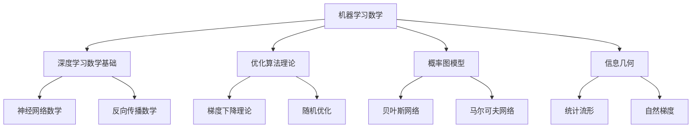
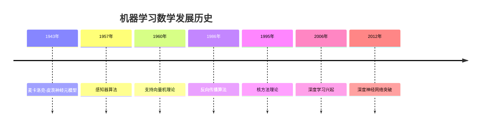

# 25. 机器学习数学 / Machine Learning Mathematics

## 目录

- [25. 机器学习数学 / Machine Learning Mathematics](#25-机器学习数学--machine-learning-mathematics)
  - [目录](#目录)
  - [25.1 概述 / Overview](#251-概述--overview)
    - [25.1.1 机器学习数学的定义](#2511-机器学习数学的定义)
    - [25.1.2 机器学习数学的核心思想](#2512-机器学习数学的核心思想)
  - [25.2 历史发展 / Historical Development](#252-历史发展--historical-development)
    - [25.2.1 发展时间线](#2521-发展时间线)
    - [25.2.2 重要人物贡献](#2522-重要人物贡献)
    - [25.2.3 理论发展脉络](#2523-理论发展脉络)
  - [25.3 深度学习数学基础 / Deep Learning Mathematical Foundations](#253-深度学习数学基础--deep-learning-mathematical-foundations)
    - [25.3.1 神经网络数学](#2531-神经网络数学)
    - [25.3.2 反向传播数学](#2532-反向传播数学)
    - [25.3.3 激活函数数学](#2533-激活函数数学)
  - [25.4 优化算法理论 / Optimization Algorithm Theory](#254-优化算法理论--optimization-algorithm-theory)
    - [25.4.1 梯度下降理论](#2541-梯度下降理论)
    - [25.4.2 随机优化](#2542-随机优化)
    - [25.4.3 自适应优化](#2543-自适应优化)
  - [25.5 概率图模型 / Probabilistic Graphical Models](#255-概率图模型--probabilistic-graphical-models)
    - [25.5.1 贝叶斯网络](#2551-贝叶斯网络)
    - [25.5.2 马尔可夫网络](#2552-马尔可夫网络)
    - [25.5.3 变分推断](#2553-变分推断)
  - [25.6 信息几何 / Information Geometry](#256-信息几何--information-geometry)
    - [25.6.1 统计流形](#2561-统计流形)
    - [25.6.2 费舍尔信息](#2562-费舍尔信息)
    - [25.6.3 自然梯度](#2563-自然梯度)
  - [25.7 应用实例 / Application Examples](#257-应用实例--application-examples)
    - [25.7.1 计算机视觉应用](#2571-计算机视觉应用)
    - [25.7.2 自然语言处理应用](#2572-自然语言处理应用)
    - [25.7.3 强化学习应用](#2573-强化学习应用)
  - [25.8 思维过程 / Thinking Process](#258-思维过程--thinking-process)
    - [25.8.1 优化思维](#2581-优化思维)
    - [25.8.2 概率思维](#2582-概率思维)
    - [25.8.3 几何思维](#2583-几何思维)
  - [25.9 总结 / Summary](#259-总结--summary)
    - [25.9.1 核心要点 / Key Points](#2591-核心要点--key-points)
    - [25.9.2 知识关联 / Knowledge Connections](#2592-知识关联--knowledge-connections)
    - [25.9.3 进一步学习 / Further Learning](#2593-进一步学习--further-learning)

## 25.1 概述 / Overview

机器学习数学是机器学习理论的基础，它将数学工具和方法应用于机器学习问题，包括深度学习数学基础、优化算法理论、概率图模型和信息几何等核心领域。

### 25.1.1 机器学习数学的定义

机器学习数学是研究机器学习算法数学基础的学科，主要特征包括：

- **优化理论**: 研究损失函数的最小化问题
- **概率论**: 处理不确定性和随机性
- **线性代数**: 处理高维数据和矩阵运算
- **微分几何**: 研究参数空间的几何结构

### 25.1.2 机器学习数学的核心思想



## 25.2 历史发展 / Historical Development

### 25.2.1 发展时间线



### 25.2.2 重要人物贡献

| 人物 | 贡献 | 时间 |
|------|------|------|
| 麦卡洛克 | 神经元数学模型 | 1943 |
| 罗森布拉特 | 感知器算法 | 1957 |
| 瓦普尼克 | 支持向量机理论 | 1960 |
| 鲁梅尔哈特 | 反向传播算法 | 1986 |
| 辛顿 | 深度学习理论 | 2006 |
| 本吉奥 | 深度神经网络 | 2012 |

### 25.2.3 理论发展脉络

1. **早期神经网络阶段** (1940-1960)
   - 神经元数学模型
   - 感知器算法
   - 线性分类器

2. **统计学习阶段** (1960-2000)
   - 支持向量机理论
   - 核方法发展
   - 统计学习理论

3. **深度学习阶段** (2000-至今)
   - 深度神经网络
   - 反向传播算法
   - 优化理论发展

## 25.3 深度学习数学基础 / Deep Learning Mathematical Foundations

### 25.3.1 神经网络数学

**神经网络**是深度学习的基础数学模型：

**定义**: 神经网络是由多个神经元层组成的函数：
$$f(x) = \sigma_n(W_n \sigma_{n-1}(W_{n-1} \cdots \sigma_1(W_1 x + b_1) + b_{n-1}) + b_n)$$

其中 $W_i$ 是权重矩阵，$b_i$ 是偏置向量，$\sigma_i$ 是激活函数。

### 25.3.2 反向传播数学

**反向传播**是计算梯度的核心算法：

```lean
-- 反向传播的形式化定义
structure Backpropagation where
  network : NeuralNetwork
  loss_function : LossFunction
  gradients : List Matrix
  learning_rate : ℝ

def backpropagate (bp : Backpropagation) (x : Input) (y : Target) : List Matrix :=
  -- 前向传播
  let forward := forward_pass bp.network x
  -- 计算损失
  let loss := bp.loss_function forward y
  -- 反向传播梯度
  let gradients := compute_gradients bp.network loss
  gradients
```

### 25.3.3 激活函数数学

**激活函数**是神经网络的非线性组件：

**实例 25.1** (ReLU激活函数)
ReLU激活函数：$\text{ReLU}(x) = \max(0, x)$

**导数**: $\frac{d}{dx}\text{ReLU}(x) = \begin{cases} 1 & \text{if } x > 0 \\ 0 & \text{if } x \leq 0 \end{cases}$

## 25.4 优化算法理论 / Optimization Algorithm Theory

### 25.4.1 梯度下降理论

**梯度下降**是最基本的优化算法：

**数学表述**:
$$\theta_{t+1} = \theta_t - \alpha \nabla f(\theta_t)$$

其中 $\alpha$ 是学习率，$\nabla f(\theta_t)$ 是梯度。

```haskell
-- 梯度下降的Haskell实现
class GradientDescent a where
  gradient :: a -> a -> a
  update :: a -> a -> a -> a
  
instance GradientDescent NeuralNetwork where
  gradient network loss = -- 计算梯度
  update network grad lr = -- 更新参数
```

### 25.4.2 随机优化

**随机梯度下降**是处理大数据集的优化方法：

**数学表述**:
$$\theta_{t+1} = \theta_t - \alpha \nabla f_i(\theta_t)$$

其中 $f_i$ 是第 $i$ 个样本的损失函数。

### 25.4.3 自适应优化

**Adam算法**是自适应优化方法的代表：

```rust
// Adam优化算法的Rust实现
pub struct AdamOptimizer {
    pub learning_rate: f64,
    pub beta1: f64,
    pub beta2: f64,
    pub epsilon: f64,
    pub m: Vec<f64>,  // 一阶矩估计
    pub v: Vec<f64>,  // 二阶矩估计
    pub t: i32,       // 时间步
}

impl AdamOptimizer {
    pub fn update(&mut self, params: &mut Vec<f64>, gradients: &[f64]) {
        self.t += 1;
        
        for i in 0..params.len() {
            // 更新一阶矩估计
            self.m[i] = self.beta1 * self.m[i] + (1.0 - self.beta1) * gradients[i];
            
            // 更新二阶矩估计
            self.v[i] = self.beta2 * self.v[i] + (1.0 - self.beta2) * gradients[i].powi(2);
            
            // 偏差修正
            let m_hat = self.m[i] / (1.0 - self.beta1.powi(self.t));
            let v_hat = self.v[i] / (1.0 - self.beta2.powi(self.t));
            
            // 更新参数
            params[i] -= self.learning_rate * m_hat / (v_hat.sqrt() + self.epsilon);
        }
    }
}
```

## 25.5 概率图模型 / Probabilistic Graphical Models

### 25.5.1 贝叶斯网络

**贝叶斯网络**是表示概率依赖关系的有向图：

**数学定义**:
$$P(X_1, X_2, \ldots, X_n) = \prod_{i=1}^n P(X_i | \text{Pa}(X_i))$$

其中 $\text{Pa}(X_i)$ 是 $X_i$ 的父节点。

### 25.5.2 马尔可夫网络

**马尔可夫网络**是无向概率图模型：

**数学定义**:
$$P(X) = \frac{1}{Z} \prod_{c \in C} \phi_c(X_c)$$

其中 $Z$ 是配分函数，$\phi_c$ 是势函数。

### 25.5.3 变分推断

**变分推断**是近似后验分布的方法：

```lean
-- 变分推断的形式化定义
structure VariationalInference where
  true_posterior : ProbabilityDistribution
  approximate_posterior : ProbabilityDistribution
  evidence_lower_bound : ℝ
  
def optimize_elbo (vi : VariationalInference) : VariationalInference :=
  -- 最大化证据下界
  let optimized := maximize_elbo vi.approximate_posterior vi.true_posterior
  {vi with approximate_posterior := optimized}
```

## 25.6 信息几何 / Information Geometry

### 25.6.1 统计流形

**统计流形**是概率分布的几何结构：

**定义**: 统计流形是参数化的概率分布族，具有黎曼几何结构。

**实例 25.2** (正态分布流形)
正态分布族 $\{N(\mu, \sigma^2) : \mu \in \mathbb{R}, \sigma > 0\}$ 构成二维统计流形。

### 25.6.2 费舍尔信息

**费舍尔信息矩阵**是统计流形的度量张量：

**定义**:
$$I_{ij}(\theta) = \mathbb{E}\left[\frac{\partial \log p(x|\theta)}{\partial \theta_i} \frac{\partial \log p(x|\theta)}{\partial \theta_j}\right]$$

### 25.6.3 自然梯度

**自然梯度**是考虑流形几何的梯度：

**数学定义**:
$$\tilde{\nabla} f(\theta) = I(\theta)^{-1} \nabla f(\theta)$$

其中 $I(\theta)$ 是费舍尔信息矩阵。

```haskell
-- 自然梯度的Haskell实现
class NaturalGradient a where
  fisher_information :: a -> Matrix
  natural_gradient :: a -> Vector -> Vector
  
instance NaturalGradient StatisticalModel where
  fisher_information model = -- 计算费舍尔信息矩阵
  natural_gradient model grad = 
    let fisher = fisher_information model
    in inverse fisher `multiply` grad
```

## 25.7 应用实例 / Application Examples

### 25.7.1 计算机视觉应用

1. **卷积神经网络**
   - 图像分类
   - 目标检测
   - 语义分割

2. **生成对抗网络**
   - 图像生成
   - 风格迁移
   - 超分辨率

3. **自编码器**
   - 降维
   - 特征学习
   - 异常检测

### 25.7.2 自然语言处理应用

1. **循环神经网络**
   - 语言建模
   - 机器翻译
   - 文本生成

2. **注意力机制**
   - Transformer模型
   - BERT预训练
   - GPT系列

3. **图神经网络**
   - 知识图谱
   - 关系抽取
   - 实体链接

### 25.7.3 强化学习应用

1. **策略梯度**
   - 策略优化
   - 演员-评论家方法
   - 自然策略梯度

2. **Q学习**
   - 值函数估计
   - 深度Q网络
   - 双Q学习

3. **蒙特卡洛方法**
   - 策略评估
   - 树搜索
   - 蒙特卡洛树搜索

## 25.8 思维过程 / Thinking Process

### 25.8.1 优化思维

**优化思维**是机器学习中的核心思维方式：

1. **目标函数**: 定义明确的优化目标
2. **约束条件**: 考虑问题的约束条件
3. **梯度信息**: 利用梯度信息指导搜索
4. **收敛性**: 确保算法的收敛性

### 25.8.2 概率思维

**概率思维**是处理不确定性的思维方式：

1. **贝叶斯推理**: 利用先验知识和数据更新信念
2. **不确定性量化**: 量化预测的不确定性
3. **模型选择**: 在模型复杂度和拟合度之间平衡
4. **正则化**: 防止过拟合的技术

### 25.8.3 几何思维

**几何思维**是从几何角度理解机器学习：

1. **流形学习**: 在高维空间中寻找低维结构
2. **距离度量**: 定义合适的距离函数
3. **几何优化**: 在流形上进行优化
4. **不变性**: 保持几何不变性

## 25.9 总结 / Summary

机器学习数学为机器学习算法提供了坚实的理论基础，包括深度学习数学基础、优化算法理论、概率图模型和信息几何等核心领域，为现代人工智能的发展提供了重要的数学支撑。

**Machine learning mathematics provides a solid theoretical foundation for machine learning algorithms, including deep learning mathematical foundations, optimization algorithm theory, probabilistic graphical models, and information geometry, providing important mathematical support for the development of modern artificial intelligence.**

### 25.9.1 核心要点 / Key Points

1. **优化理论**: 研究损失函数最小化的数学方法
2. **概率论**: 处理不确定性和随机性的数学工具
3. **线性代数**: 处理高维数据和矩阵运算的基础
4. **微分几何**: 研究参数空间几何结构的数学
5. **信息论**: 量化信息内容和传输的数学理论
6. **实际应用**: 在计算机视觉、自然语言处理、强化学习等领域广泛应用

**1. Optimization Theory**: Mathematical methods for minimizing loss functions
**2. Probability Theory**: Mathematical tools for handling uncertainty and randomness
**3. Linear Algebra**: Foundation for processing high-dimensional data and matrix operations
**4. Differential Geometry**: Mathematics for studying geometric structures of parameter spaces
**5. Information Theory**: Mathematical theory for quantifying information content and transmission
**6. Practical Applications**: Wide applications in computer vision, natural language processing, reinforcement learning, etc.

### 25.9.2 知识关联 / Knowledge Connections

- **与优化理论的关系**: 机器学习本质上是优化问题
- **与概率论的关系**: 概率论为机器学习提供不确定性建模
- **与线性代数的关系**: 线性代数是处理高维数据的基础
- **与信息论的关系**: 信息论为机器学习提供信息度量

### 25.9.3 进一步学习 / Further Learning

- **高级优化理论**: 凸优化、非凸优化、随机优化
- **概率图模型**: 贝叶斯网络、马尔可夫网络、变分推断
- **信息几何**: 统计流形、费舍尔信息、自然梯度
- **深度学习理论**: 神经网络理论、表示学习、生成模型

---

**参考文献 / References**:

1. Bishop, C.M. "Pattern Recognition and Machine Learning". 2006.
2. Goodfellow, I., Bengio, Y., and Courville, A. "Deep Learning". 2016.
3. Murphy, K.P. "Machine Learning: A Probabilistic Perspective". 2012.
4. Amari, S. "Information Geometry and Its Applications". 2016.
5. Boyd, S. and Vandenberghe, L. "Convex Optimization". 2004.

---

**相关链接 / Related Links**:

- [概率论](../12-应用数学/01-概率论.md)
- [统计学](../12-应用数学/02-统计学.md)
- [优化理论](../08-计算数学/02-优化理论.md)
- [线性代数](../02-代数结构/环论/02-环论.md)
- [微分几何](../04-几何学/03-微分几何.md)
- [机器学习数学基础](../12-应用数学/06-机器学习数学基础.md)

**高级主题链接 / Advanced Topics Links**:

- [深度学习理论高级主题](./深度学习理论高级主题.md)
- [优化理论高级主题](./优化理论高级主题.md)
- [概率图模型高级主题](./概率图模型高级主题.md)
- [信息几何高级主题](./信息几何高级主题.md)
