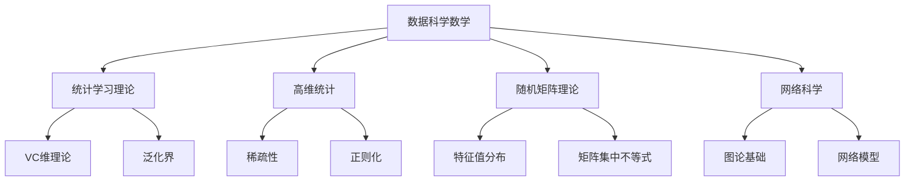
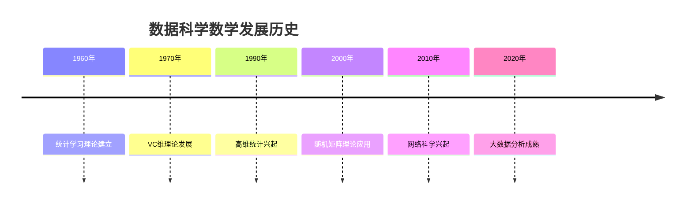

# 26. 数据科学数学 / Data Science Mathematics

## 目录

- [26. 数据科学数学 / Data Science Mathematics](#26-数据科学数学--data-science-mathematics)
  - [目录](#目录)
  - [26.1 概述 / Overview](#261-概述--overview)
    - [26.1.1 数据科学数学的定义](#2611-数据科学数学的定义)
    - [26.1.2 数据科学数学的核心思想](#2612-数据科学数学的核心思想)
  - [26.2 历史发展 / Historical Development](#262-历史发展--historical-development)
    - [26.2.1 发展时间线](#2621-发展时间线)
    - [26.2.2 重要人物贡献](#2622-重要人物贡献)
    - [26.2.3 理论发展脉络](#2623-理论发展脉络)
  - [26.3 统计学习理论 / Statistical Learning Theory](#263-统计学习理论--statistical-learning-theory)
    - [26.3.1 VC维理论](#2631-vc维理论)
    - [26.3.2 泛化界](#2632-泛化界)
    - [26.3.3 结构风险最小化](#2633-结构风险最小化)
  - [26.4 高维统计 / High-Dimensional Statistics](#264-高维统计--high-dimensional-statistics)
    - [26.4.1 稀疏性](#2641-稀疏性)
    - [26.4.2 正则化](#2642-正则化)
    - [26.4.3 高维渐近](#2643-高维渐近)
  - [26.5 随机矩阵理论 / Random Matrix Theory](#265-随机矩阵理论--random-matrix-theory)
    - [26.5.1 特征值分布](#2651-特征值分布)
    - [26.5.2 矩阵集中不等式](#2652-矩阵集中不等式)
    - [26.5.3 随机矩阵应用](#2653-随机矩阵应用)
  - [26.6 网络科学 / Network Science](#266-网络科学--network-science)
    - [26.6.1 图论基础](#2661-图论基础)
    - [26.6.2 网络模型](#2662-网络模型)
    - [26.6.3 网络分析](#2663-网络分析)
  - [26.7 应用实例 / Application Examples](#267-应用实例--application-examples)
    - [26.7.1 大数据分析](#2671-大数据分析)
    - [26.7.2 生物信息学](#2672-生物信息学)
    - [26.7.3 社会科学](#2673-社会科学)
  - [26.8 思维过程 / Thinking Process](#268-思维过程--thinking-process)
    - [26.8.1 高维思维](#2681-高维思维)
    - [26.8.2 稀疏思维](#2682-稀疏思维)
    - [26.8.3 网络思维](#2683-网络思维)
  - [26.9 总结 / Summary](#269-总结--summary)
    - [26.9.1 核心要点 / Key Points](#2691-核心要点--key-points)
    - [26.9.2 知识关联 / Knowledge Connections](#2692-知识关联--knowledge-connections)
    - [26.9.3 进一步学习 / Further Learning](#2693-进一步学习--further-learning)

## 26.1 概述 / Overview

数据科学数学是数据科学的核心理论基础，它将数学工具和方法应用于大数据分析，包括统计学习理论、高维统计、随机矩阵理论和网络科学等前沿领域。

### 26.1.1 数据科学数学的定义

数据科学数学是研究数据科学算法数学基础的学科，主要特征包括：

- **高维性**: 处理高维数据空间
- **稀疏性**: 利用数据的稀疏结构
- **随机性**: 处理随机性和不确定性
- **网络性**: 研究复杂网络结构

### 26.1.2 数据科学数学的核心思想



## 26.2 历史发展 / Historical Development

### 26.2.1 发展时间线



### 26.2.2 重要人物贡献

| 人物 | 贡献 | 时间 |
|------|------|------|
| 瓦普尼克 | 统计学习理论 | 1960 |
| 切尔沃嫩基斯 | VC维理论 | 1970 |
| 蒂布希拉尼 | Lasso回归 | 1996 |
| 维格纳 | 随机矩阵理论 | 1950 |
| 巴拉巴西 | 无标度网络 | 1999 |
| 瓦茨 | 小世界网络 | 1998 |

### 26.2.3 理论发展脉络

1. **统计学习理论阶段** (1960-1990)
   - VC维理论建立
   - 泛化界发展
   - 结构风险最小化

2. **高维统计阶段** (1990-2010)
   - 稀疏性理论
   - 正则化方法
   - 高维渐近理论

3. **现代数据科学阶段** (2010-至今)
   - 随机矩阵理论
   - 网络科学
   - 大数据分析

## 26.3 统计学习理论 / Statistical Learning Theory

### 26.3.1 VC维理论

**VC维**是衡量模型复杂度的关键概念：

**定义**: 函数类 $\mathcal{F}$ 的VC维是能被 $\mathcal{F}$ 完全打散的最大样本数。

**实例 26.1** (线性分类器的VC维)
在 $\mathbb{R}^d$ 中，线性分类器的VC维为 $d+1$。

### 26.3.2 泛化界

**泛化界**是连接经验风险和真实风险的桥梁：

**定理** (VC泛化界):
对于任何 $\delta > 0$，以概率至少 $1-\delta$，
$$R(f) \leq \hat{R}(f) + \sqrt{\frac{\log|\mathcal{F}| + \log(1/\delta)}{2n}}$$

其中 $R(f)$ 是真实风险，$\hat{R}(f)$ 是经验风险。

### 26.3.3 结构风险最小化

**结构风险最小化**是平衡模型复杂度和拟合度的原则：

```lean
-- 结构风险最小化的形式化定义
structure StructuralRiskMinimization where
  hypothesis_space : Set Function
  complexity_measure : Function → ℝ
  regularization_parameter : ℝ
  empirical_risk : Function → ℝ

def minimize_structural_risk (srm : StructuralRiskMinimization) : Function :=
  let objective f := srm.empirical_risk f + srm.regularization_parameter * srm.complexity_measure f
  argmin objective srm.hypothesis_space
```

## 26.4 高维统计 / High-Dimensional Statistics

### 26.4.1 稀疏性

**稀疏性**是高维统计的核心概念：

**定义**: 向量 $\beta \in \mathbb{R}^p$ 是 $s$-稀疏的，如果 $\|\beta\|_0 \leq s$。

**Lasso回归**:
$$\min_{\beta} \frac{1}{2n}\|y - X\beta\|_2^2 + \lambda\|\beta\|_1$$

### 26.4.2 正则化

**正则化**是处理高维问题的关键技术：

```haskell
-- 正则化的Haskell实现
class Regularization a where
  l1_regularization :: a -> a -> a
  l2_regularization :: a -> a -> a
  elastic_net :: a -> a -> a -> a

instance Regularization Vector where
  l1_regularization lambda beta = lambda * sum (map abs beta)
  l2_regularization lambda beta = lambda * sum (map (^2) beta)
  elastic_net alpha lambda beta = alpha * l1_regularization lambda beta + (1-alpha) * l2_regularization lambda beta
```

### 26.4.3 高维渐近

**高维渐近**研究 $p \to \infty$ 时的统计性质：

**实例 26.2** (高维线性回归)
在高维线性回归中，当 $p/n \to \gamma > 0$ 时，最小二乘估计不再一致。

## 26.5 随机矩阵理论 / Random Matrix Theory

### 26.5.1 特征值分布

**随机矩阵的特征值分布**是随机矩阵理论的核心：

**维格纳半圆律**: 对于 $n \times n$ 对称随机矩阵 $A$，其特征值分布收敛到半圆分布：
$$\rho(x) = \frac{1}{2\pi}\sqrt{4-x^2}, \quad |x| \leq 2$$

### 26.5.2 矩阵集中不等式

**矩阵集中不等式**是随机矩阵理论的重要工具：

**定理** (矩阵伯恩斯坦不等式):
对于独立随机矩阵 $X_1, \ldots, X_n$，以高概率：
$$\left\|\sum_{i=1}^n X_i\right\| \leq C\sqrt{\log n} \max\{\sigma, R\}$$

其中 $\sigma$ 是方差参数，$R$ 是范数界。

### 26.5.3 随机矩阵应用

**随机矩阵**在数据科学中有广泛应用：

```rust
// 随机矩阵的Rust实现
pub struct RandomMatrix {
    pub rows: usize,
    pub cols: usize,
    pub entries: Vec<f64>,
}

impl RandomMatrix {
    pub fn gaussian_random_matrix(rows: usize, cols: usize) -> Self {
        let mut rng = rand::thread_rng();
        let entries: Vec<f64> = (0..rows * cols)
            .map(|_| rng.sample(rand_distr::StandardNormal))
            .collect();

        RandomMatrix { rows, cols, entries }
    }

    pub fn singular_value_decomposition(&self) -> (Matrix, Vector, Matrix) {
        // 奇异值分解的实现
    }
}
```

## 26.6 网络科学 / Network Science

### 26.6.1 图论基础

**图论**是网络科学的数学基础：

**定义**: 图 $G = (V, E)$ 由顶点集 $V$ 和边集 $E$ 组成。

**实例 26.3** (度分布)
度分布 $P(k)$ 表示度为 $k$ 的顶点比例。

### 26.6.2 网络模型

**网络模型**是描述复杂网络结构的数学模型：

**Erdős-Rényi模型**:
$$P(G) = p^{|E|}(1-p)^{\binom{n}{2}-|E|}$$

**Barabási-Albert模型**:

- 优先连接
- 幂律度分布
- 无标度特性

### 26.6.3 网络分析

**网络分析**是研究网络结构和动态的方法：

```lean
-- 网络分析的形式化定义
structure NetworkAnalysis where
  graph : Graph
  centrality_measures : List CentralityMeasure
  community_detection : CommunityDetection
  network_dynamics : NetworkDynamics

def compute_centrality (na : NetworkAnalysis) (node : Node) : ℝ :=
  -- 计算节点中心性
  let degree_centrality := degree node / (na.graph.vertex_count - 1)
  let betweenness_centrality := compute_betweenness na.graph node
  let eigenvector_centrality := compute_eigenvector na.graph node
  (degree_centrality + betweenness_centrality + eigenvector_centrality) / 3
```

## 26.7 应用实例 / Application Examples

### 26.7.1 大数据分析

1. **推荐系统**
   - 协同过滤
   - 矩阵分解
   - 深度学习推荐

2. **搜索引擎**
   - PageRank算法
   - 文本相似度
   - 查询理解

3. **广告投放**
   - 点击率预测
   - 实时竞价
   - 用户画像

### 26.7.2 生物信息学

1. **基因表达分析**
   - 差异表达分析
   - 聚类分析
   - 网络分析

2. **蛋白质结构预测**
   - 序列比对
   - 结构预测
   - 功能注释

3. **药物发现**
   - 分子对接
   - 虚拟筛选
   - 药效预测

### 26.7.3 社会科学

1. **社交网络分析**
   - 影响力分析
   - 社区发现
   - 信息传播

2. **经济学应用**
   - 金融风险建模
   - 市场微观结构
   - 行为经济学

3. **政治学应用**
   - 选举预测
   - 政策影响评估
   - 舆论分析

## 26.8 思维过程 / Thinking Process

### 26.8.1 高维思维

**高维思维**是处理高维数据的思维方式：

1. **维度诅咒**: 理解高维空间的稀疏性
2. **稀疏性假设**: 利用数据的稀疏结构
3. **正则化**: 通过正则化控制复杂度
4. **降维**: 寻找低维表示

### 26.8.2 稀疏思维

**稀疏思维**是处理稀疏数据的思维方式：

1. **稀疏表示**: 寻找数据的稀疏表示
2. **压缩感知**: 利用稀疏性进行压缩
3. **变量选择**: 识别重要变量
4. **模型选择**: 选择合适复杂度的模型

### 26.8.3 网络思维

**网络思维**是从网络角度理解复杂系统：

1. **连接性**: 关注节点间的连接关系
2. **中心性**: 识别网络中的重要节点
3. **社区结构**: 发现网络的模块化结构
4. **动态演化**: 研究网络的演化规律

## 26.9 总结 / Summary

数据科学数学为现代数据科学提供了坚实的理论基础，包括统计学习理论、高维统计、随机矩阵理论和网络科学等核心领域，为大数据分析和人工智能应用提供了重要的数学支撑。

**Data science mathematics provides a solid theoretical foundation for modern data science, including statistical learning theory, high-dimensional statistics, random matrix theory, and network science, providing important mathematical support for big data analysis and artificial intelligence applications.**

### 26.9.1 核心要点 / Key Points

1. **统计学习理论**: 为机器学习提供理论基础
2. **高维统计**: 处理高维数据的统计方法
3. **随机矩阵理论**: 研究随机矩阵的数学理论
4. **网络科学**: 研究复杂网络结构的科学
5. **稀疏性**: 利用数据稀疏性的数学工具
6. **实际应用**: 在大数据分析、生物信息学、社会科学等领域广泛应用

**1. Statistical Learning Theory**: Provides theoretical foundation for machine learning
**2. High-Dimensional Statistics**: Statistical methods for handling high-dimensional data
**3. Random Matrix Theory**: Mathematical theory for studying random matrices
**4. Network Science**: Science for studying complex network structures
**5. Sparsity**: Mathematical tools for utilizing data sparsity
**6. Practical Applications**: Wide applications in big data analysis, bioinformatics, social sciences, etc.

### 26.9.2 知识关联 / Knowledge Connections

- **与统计学习理论的关系**: 为机器学习提供理论基础
- **与高维统计的关系**: 处理高维数据的统计方法
- **与随机矩阵理论的关系**: 研究随机矩阵的数学理论
- **与网络科学的关系**: 研究复杂网络结构的科学

### 26.9.3 进一步学习 / Further Learning

- **高级统计学习**: 核方法、支持向量机、深度学习理论
- **高维统计**: 稀疏性理论、正则化方法、高维渐近
- **随机矩阵**: 特征值分布、矩阵集中不等式、随机矩阵应用
- **网络科学**: 复杂网络、网络动力学、网络分析

---

**参考文献 / References**:

1. Vapnik, V.N. "Statistical Learning Theory". 1998.
2. Hastie, T., Tibshirani, R., and Friedman, J. "The Elements of Statistical Learning". 2001.
3. Wainwright, M.J. "High-Dimensional Statistics". 2019.
4. Tao, T. "Random Matrix Theory". 2012.
5. Newman, M.E.J. "Networks: An Introduction". 2010.

---

**相关链接 / Related Links**:

- [统计学](../12-应用数学/02-统计学.md)
- [概率论](../12-应用数学/01-概率论.md)
- [机器学习数学](25-机器学习数学.md)
- [图论](../01-基础数学/图论基础.md)
- [线性代数](../02-代数结构/环论/02-环论.md)
- [优化理论](../08-计算数学/02-优化理论.md)

**高级主题链接 / Advanced Topics Links**:

- [统计学习理论高级主题](./统计学习理论高级主题.md)
- [高维统计高级主题](./高维统计高级主题.md)
- [随机矩阵理论高级主题](./随机矩阵理论高级主题.md)
- [网络科学高级主题](./网络科学高级主题.md)

---
