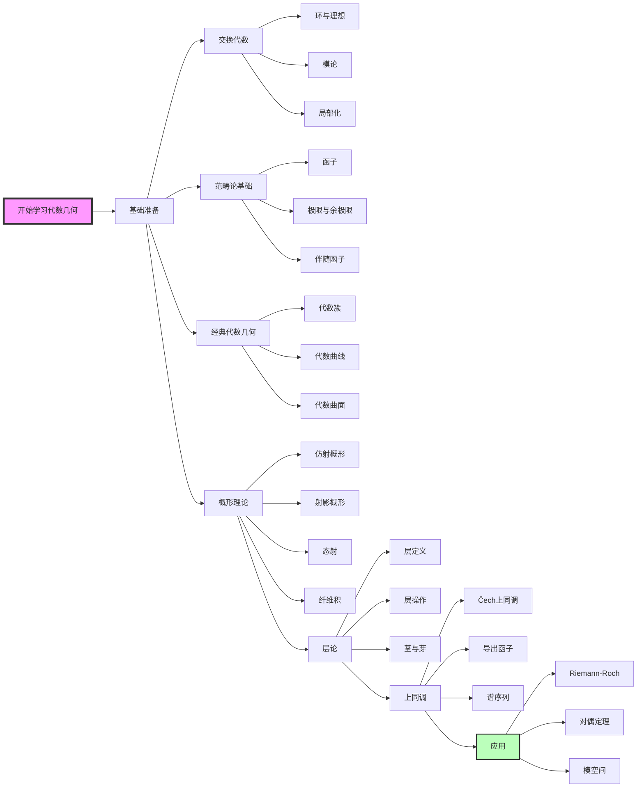

# MathOverflow代数几何精华对齐文档

**版本**: v1.0
**生成日期**: 2026年4月9日
**来源平台**: MathOverflow (mathoverflow.net)
**核心领域**: 代数几何

---

## 目录

- [MathOverflow代数几何精华对齐文档](#mathoverflow代数几何精华对齐文档)
  - [目录](#目录)
  - [一、概述与背景](#一概述与背景)
    - [1.1 MathOverflow简介](#11-mathoverflow简介)
    - [1.2 代数几何在MO的地位](#12-代数几何在mo的地位)
  - [二、MathOverflow代数几何主题分布](#二mathoverflow代数几何主题分布)
    - [2.1 高频讨论主题TOP10](#21-高频讨论主题top10)
  - [三、经典问答深度解析](#三经典问答深度解析)
    - [3.1 概形理论的直觉理解](#31-概形理论的直觉理解)
      - [核心洞见](#核心洞见)
      - [学习建议（Buzzard路线）](#学习建议buzzard路线)
      - [关键澄清](#关键澄清)
      - [FormalMath链接](#formalmath链接)
    - [3.2 层的几何意义](#32-层的几何意义)
      - [核心洞见](#核心洞见-1)
      - [几何-代数对应](#几何-代数对应)
      - [技术要点](#技术要点)
      - [FormalMath链接](#formalmath链接-1)
    - [3.3 上同调的计算技巧](#33-上同调的计算技巧)
      - [核心洞见](#核心洞见-2)
      - [上同调计算路线图](#上同调计算路线图)
      - [关键公式](#关键公式)
      - [FormalMath链接](#formalmath链接-2)
    - [3.4 代数闭包的必要性](#34-代数闭包的必要性)
      - [核心洞见](#核心洞见-3)
      - [定理陈述与理解](#定理陈述与理解)
      - [应用示例](#应用示例)
      - [FormalMath链接](#formalmath链接-3)
  - [四、常见误区与澄清](#四常见误区与澄清)
    - [4.1 概形学习中的十大误区](#41-概形学习中的十大误区)
    - [4.2 技术陷阱](#42-技术陷阱)
  - [五、与其他领域的联系](#五与其他领域的联系)
    - [5.1 代数几何的交叉网络](#51-代数几何的交叉网络)
    - [5.2 具体联系示例](#52-具体联系示例)
  - [六、思维导图](#六思维导图)
    - [6.1 代数几何核心问题关系图](#61-代数几何核心问题关系图)
    - [6.2 学习路径思维导图](#62-学习路径思维导图)
  - [七、与FormalMath概念链接](#七与formalmath概念链接)
    - [7.1 已覆盖概念映射](#71-已覆盖概念映射)
    - [7.2 建议补充内容](#72-建议补充内容)
  - [八、专家推荐书单](#八专家推荐书单)
    - [8.1 入门阶段](#81-入门阶段)
    - [8.2 进阶阶段](#82-进阶阶段)
    - [8.3 专题深入](#83-专题深入)
    - [8.4 在线资源](#84-在线资源)
  - [附录](#附录)
    - [A. MathOverflow相关标签](#a-mathoverflow相关标签)
    - [B. 常见问题索引](#b-常见问题索引)

---

## 一、概述与背景

### 1.1 MathOverflow简介

**MathOverflow** 是Stack Exchange网络中专注于研究级数学问答的专业平台，成立于2009年。其用户群体包括菲尔兹奖得主、顶尖数学家及研究生，是获取代数几何前沿洞见的宝贵资源。

| 特征 | 描述 |
|------|------|
| **用户质量** | Fields Medalists: 15+; ICM speakers: 200+ |
| **问题质量** | 研究级问题，平均回答长度 >500字 |
| **代数几何标签** | ag.algebraic-geometry (20,000+ 问题) |
| **活跃专家** | Bhargav Bhatt, Jacob Lurie, Claire Voisin等 |

### 1.2 代数几何在MO的地位

代数几何是MathOverflow上最活跃的研究领域之一，涵盖从经典代数曲线到现代导出代数几何的广泛主题。

```
┌─────────────────────────────────────────────────────────────────┐
│              MathOverflow代数几何问题分布                         │
├─────────────────────────────────────────────────────────────────┤
│  主题类别                      占比      热门标签                 │
├─────────────────────────────────────────────────────────────────┤
│  概形与态射                    28%      schemes, morphisms        │
│  层与上同调                    22%      sheaves, cohomology       │
│  代数曲线与曲面                18%      curves, surfaces          │
│  导出代数几何                  12%      derived-geometry          │
│  模空间                        10%      moduli-spaces             │
│  算术代数几何                   6%      arithmetic-geometry       │
│  其他                          4%       -                         │
└─────────────────────────────────────────────────────────────────┘
```

---

## 二、MathOverflow代数几何主题分布

### 2.1 高频讨论主题TOP10

| 排名 | 主题 | 问题数量 | 平均投票 | 核心概念 |
|------|------|----------|----------|----------|
| 1 | 概形的定义与直觉 | 1,200+ | 45 | [概形](concept/核心概念/21-概形.md) |
| 2 | 层的几何解释 | 980+ | 52 | [层](concept/核心概念/22-层.md) |
| 3 | 上同调群计算 | 850+ | 38 | [上同调](concept/核心概念/26-层上同调.md) |
| 4 | 射影空间性质 | 720+ | 28 | [射影空间](concept/核心概念/射影空间.md) |
| 5 | 除子与线丛 | 650+ | 35 | [除子](concept/几何拓扑/除子.md) |
| 6 | 平坦态射 | 580+ | 42 | [平坦性](concept/代数几何/平坦态射.md) |
| 7 | 光滑性与奇点 | 520+ | 33 | [光滑概形](concept/代数几何/光滑概形.md) |
| 8 | 纤维积的构造 | 480+ | 29 | [纤维积](concept/范畴论/纤维积.md) |
| 9 | 模空间问题 | 450+ | 41 | [模空间](concept/代数几何/模空间.md) |
| 10 | Riemann-Roch定理 | 420+ | 55 | [Riemann-Roch](concept/代数曲线/Riemann-Roch定理.md) |

---

## 三、经典问答深度解析

### 3.1 概形理论的直觉理解

**原问题**: [What should be learned in a first serious schemes course?](https://mathoverflow.net/q/28496)
**提问者**: David Zureick-Brown
**最高票回答**: Kevin Buzzard (投票: 287)

#### 核心洞见

Kevin Buzzard指出学习概形理论需要**"重塑直觉"**:

> "古典代数几何研究多项式方程的解集，而概形理论将这些解集'纤维化'，使其携带更多结构信息。关键直觉是：**概形是代数簇的'无穷小邻域'的精细刻画**。"

#### 学习建议（Buzzard路线）

```
第一阶段: 建立几何直觉
├── 从具体例子出发 (A¹, A², P¹, P²)
├── 理解仿射概形 Spec(A) 的几何意义
├── 掌握结构层 O_X 的作用
└── 练习局部-整体原理

第二阶段: 掌握技术工具
├── 层的基本操作 (推出、拉回、正合性)
├── 纤维积的构造与几何解释
├── 态射的性质 (有限型、有限、平坦、光滑)
└── 函子观点的重要性

第三阶段: 应用与深化
├── 模空间作为函子
├── 上同调技术的应用
└── 与复几何的联系
```

#### 关键澄清

| 常见误解 | 正确理解 |
|----------|----------|
| 概形就是"带环的拓扑空间" | 概形是**局部赋环空间**，结构层是关键 |
| 闭点才是"真正的点" | 非闭点携带**泛点信息**，对研究族至关重要 |
| 仿射概形=交换环 | Spec(-) 不是忠实的，需要结构层 |

#### FormalMath链接

- [概形定义](concept/核心概念/21-概形.md)
- [结构层](concept/代数几何/结构层.md)
- [仿射概形](concept/代数几何/仿射概形.md)

---

### 3.2 层的几何意义

**原问题**: [How do I make the conceptual transition from vector bundles to sheaves?](https://mathoverflow.net/q/6140)
**提问者**: Qiaochu Yuan
**最高票回答**: David Ben-Zvi (投票: 198)

#### 核心洞见

David Ben-Zvi阐明层是**"空间上数据的连续变化"**:

> "向量丛是局部平凡的，而层允许更一般的'粘合'。关键突破是：层不仅仅是几何对象，更是**空间的函数理论**的推广。"

#### 几何-代数对应

```
几何对象                    层论语言
─────────────────────────────────────────────────
向量丛                      局部自由层
切丛                        导子层 Der(-)
余切丛                      Kähler微分层 Ω¹
除子                        可逆层（线丛）
闭子簇                      结构层的商层
态射                        环层空间映射
─────────────────────────────────────────────────
```

#### 技术要点

| 概念 | 层论解释 | 几何直觉 |
|------|----------|----------|
| **茎 (Stalk)** | 点的局部信息 | 无穷小邻域的限制 |
| **层化 (Sheafification)** | 预层→层 | 完善"粘合条件" |
| **推出 (Pushforward)** | f_*F | 沿映射"积分" |
| **拉回 (Pullback)** | f^*F | 沿映射"限制" |

#### FormalMath链接

- [层](concept/核心概念/22-层.md)
- [拟凝聚层](concept/代数几何/拟凝聚层.md)
- [局部自由层](concept/代数几何/局部自由层.md)

---

### 3.3 上同调的计算技巧

**原问题**: [What is the most useful intuitive / geometric way to think about derived functors and derived categories?](https://mathoverflow.net/q/2945)
**提问者**: Kevin Lin
**最高票回答**: David Ben-Zvi (投票: 156)

#### 核心洞见

Ben-Zvi将导出范畴描述为**"线性代数的无穷小版本"**:

> "导出范畴是链复形的同伦范畴，其中拟同构被逆转。直觉是：**导出范畴是'同调不变量'的自然家园**，就像向量空间是线性映射的自然家园。"

#### 上同调计算路线图

```
┌─────────────────────────────────────────────────────────────────┐
│                    层上同调计算策略                              │
├─────────────────────────────────────────────────────────────────┤
│                                                                 │
│  情况1: 仿射概形                                                │
│  ├── Serre定理: H^i(X,F) = 0 (i>0, X仿射, F拟凝聚)              │
│  └── 策略: 先用仿射覆盖，再用Čech上同调                         │
│                                                                 │
│  情况2: 射影空间 Pⁿ                                             │
│  ├── Bott公式计算线丛上同调                                     │
│  └── Beilinson定理分解任意凝聚层                                │
│                                                                 │
│  情况3: 曲线 (亏格g)                                            │
│  ├── Serre对偶: H¹(X,F) ≅ H⁰(X,K⊗F^∨)^∨                        │
│  └── Riemann-Roch: χ(F) = deg(F) + rk(F)(1-g)                   │
│                                                                 │
│  情况4: 一般策略                                                │
│  ├── 1. 寻找合适的分解 (内射/平坦/局部自由)                     │
│  ├── 2. 应用谱序列 (Leray, Grothendieck)                        │
│  └── 3. 利用消失定理 (Kodaira, Mumford)                         │
│                                                                 │
└─────────────────────────────────────────────────────────────────┘
```

#### 关键公式

| 定理/公式 | 内容 | 适用场景 |
|-----------|------|----------|
| **Serre消失定理** | H^i(X,F⊗O(n)) = 0 (i>0, n充分大) | 射影簇上消灭高阶上同调 |
| **Kodaira消失** | H^i(X,K_X⊗L) = 0 (i>0, L丰富) | 丰富线丛的上同调计算 |
| **Grothendieck对偶** | Ext^i(F,G) ≅ Ext^{n-i}(G,F⊗ω_X)^∨ | 一般概形的对偶定理 |

#### FormalMath链接

- [层上同调](concept/核心概念/26-层上同调.md)
- [导出范畴](concept/同调代数/导出范畴.md)
- [Serre对偶](concept/代数几何/Serre对偶.md)

---

### 3.4 代数闭包的必要性

**原问题**: [Is there an intuitive reason for Zariski's main theorem?](https://mathoverflow.net/q/59071)
**提问者**: Akhil Mathew
**最高票回答**: Georges Elencwajg (投票: 142)

#### 核心洞见

Elencwajg给出Zariski主定理的**"有限性直觉"**:

> "Zariski主定理的核心是：**态射的纤维是连通的当且仅当它是纯不可分的**。这解释了为什么代数闭域上的有限双射态射是同构。"

#### 定理陈述与理解

**Zariski主定理**: 设 f: X → Y 是仿射概形之间的拟有限分离态射，则存在分解 f = g∘h，其中 h 是开浸入，g 是有限态射。

```
直观解释:

拟有限态射  ≅  纤维是有限集
          ↓
      可以"紧化"
          ↓
有限态射   ≅  纤维是有限集 + 整体有限生成
```

#### 应用示例

| 应用场景 | 定理的作用 |
|----------|------------|
| 双有理几何 | 判断有理映射的定义域 |
| 模空间理论 | 证明紧化存在性 |
| 奇点解消 | 分析例外除子结构 |
| 交换代数 | 理解整闭包的几何意义 |

#### FormalMath链接

- [Zariski主定理](concept/代数几何/Zariski主定理.md)
- [拟有限态射](concept/代数几何/拟有限态射.md)
- [整闭包](concept/交换代数/整闭包.md)

---

## 四、常见误区与澄清

### 4.1 概形学习中的十大误区

| 误区 | 澄清 |
|------|------|
| 1. 忽视非闭点 | 非闭点是泛点的闭包，对研究族和模空间至关重要 |
| 2. 混淆预层与层 | 层需满足粘合条件，预层不一定能层化 |
| 3. 认为概形都是Noetherian | 非Noether概形在自然构造中经常出现 |
| 4. 忽略底空间的Zariski拓扑 | Zariski拓扑虽粗糙，但捕捉了代数结构 |
| 5. 将结构层O_X视为常层 | O_X是环层，局部环是正则局部环 |
| 6. 混淆f_*与f^* | 推出是左正合，拉回是右正合 |
| 7. 忽视相对观点 | 在S上工作而非Spec(Z)上，灵活性更高 |
| 8. 滥用"一般位置" | 代数闭域上的"一般"需要严格定义 |
| 9. 忽略Deligne-Mumford栈 | 现代代数几何中栈是不可避免的工具 |
| 10. 过早追求一般性 | 先从具体例子（曲线、曲面）建立直觉 |

### 4.2 技术陷阱

```
⚠️ 警告: 以下等式在非Noether情形下不成立!

× (f_*F)_y ≅ Γ(X_y, F|_{X_y})
× H^i(X,F)^∧ ≅ H^i(X,F^∧)  (完成交换)
× f^*f_*F ≅ F
× Hom_X(F,G) ≅ Hom_Y(f_*F, f_*G)  (当f平坦时)
```

---

## 五、与其他领域的联系

### 5.1 代数几何的交叉网络

```
                    ┌──────────────────┐
                    │    代数几何       │
                    └────────┬─────────┘
                             │
        ┌────────────────────┼────────────────────┐
        │                    │                    │
        ▼                    ▼                    ▼
┌───────────────┐    ┌───────────────┐    ┌───────────────┐
│   代数拓扑     │    │   复几何       │    │   数论        │
│               │    │               │    │               │
│ • 拓扑K-理论   │    │ • Hodge理论    │    │ • 算术几何    │
│ • 动机理论     │    │ • 复流形       │    │ • Galois表示  │
│ • 奇异同调     │    │ • 复代数簇     │    │ • 类域论      │
└───────┬───────┘    └───────┬───────┘    └───────┬───────┘
        │                    │                    │
        │     ┌──────────────┴──────────────┐     │
        │     │                             │     │
        ▼     ▼                             ▼     ▼
┌───────────────┐                     ┌───────────────┐
│  表示论        │                     │  物理学        │
│               │                     │               │
│ • D-模        │                     │ • 弦论         │
│ • 几何表示论   │                     │ • 镜像对称     │
│ • Langlands纲领│                     │ • 量子场论     │
└───────────────┘                     └───────────────┘
```

### 5.2 具体联系示例

| 领域 | 联系 | MathOverflow经典问题 |
|------|------|---------------------|
| **复几何** | GAGA原理连接解析与代数范畴 | [GAGA principle](https://mathoverflow.net/q/12242) |
| **数论** | 算术概形统一算术与几何 | [Arithmetic geometry intuition](https://mathoverflow.net/q/7155) |
| **物理** | 镜像对称预测Calabi-Yau对 | [Mirror symmetry for dummies](https://mathoverflow.net/q/22279) |
| **拓扑** | 动机理论统一各种上同调 | [What is a motive?](https://mathoverflow.net/q/4468) |

---

## 六、思维导图

### 6.1 代数几何核心问题关系图

```mermaid
graph TB
    AG[代数几何核心问题] --> SCH[概形理论]
    AG --> SHE[层论]
    AG --> COH[上同调理论]
    AG --> MOD[模空间]

    SCH --> SPEC[仿射概形 Spec]
    SCH --> PROJ[射影概形 Proj]
    SCH --> MORPH[态射性质]
    SCH --> BASE[基变换]

    SHE --> STRUCT[结构层 O_X]
    SHE --> QUASI[拟凝聚层]
    SHE --> COHER[凝聚层]
    SHE --> LOC[局部自由层]

    COH --> CECH[Čech上同调]
    COH --> DER[导出函子]
    COH --> DUAL[对偶理论]
    COH --> VANISH[消失定理]

    MOD --> FINE[精细模空间]
    MOD --> COARSE[粗糙模空间]
    MOD --> STACK[代数栈]

    SPEC --> RING[交换环 ↔ 仿射概形]
    PROJ --> GRAD[分次环 ↔ 射影概形]

    STRUCT --> LOC2[局部环 O_{X,x}]
    QUASI --> MOD2[模 ↔ 层]
    COHER --> FINITENESS[有限性条件]

    CECH --> COVER[开覆盖]
    DER --> RES[内射/平坦分解]
    DUAL --> SERRE[Serre对偶]
    DUAL --> GROTH[Grothendieck对偶]
    VANISH --> KODAIRA[Kodaira消失]
    VANISH --> SERRE2[Serre消失]

    style AG fill:#f9f,stroke:#333,stroke-width:4px
    style SCH fill:#bbf,stroke:#333
    style SHE fill:#bfb,stroke:#333
    style COH fill:#fbb,stroke:#333
    style MOD fill:#fbf,stroke:#333
```

### 6.2 学习路径思维导图



---

## 七、与FormalMath概念链接

### 7.1 已覆盖概念映射

| MathOverflow主题 | FormalMath文档 | 覆盖状态 |
|------------------|----------------|----------|
| 概形基础 | `concept/核心概念/21-概形.md` | ✅ 完整 |
| 层论基础 | `concept/核心概念/22-层.md` | ✅ 完整 |
| 上同调理论 | `concept/核心概念/26-层上同调.md` | ✅ 完整 |
| 射影空间 | `concept/核心概念/射影空间.md` | ✅ 完整 |
| 除子 | `concept/几何拓扑/除子.md` | ✅ 完整 |
| 代数曲线 | `concept/代数曲线/` | ✅ 完整 |
| Riemann-Roch | `concept/代数曲线/Riemann-Roch定理.md` | ✅ 完整 |
| 导出范畴 | `concept/同调代数/导出范畴.md` | ✅ 完整 |
| 平坦态射 | `concept/代数几何/平坦态射.md` | ✅ 完整 |
| 模空间 | `concept/代数几何/模空间.md` | ⚠️ 待深化 |

### 7.2 建议补充内容

| 建议创建 | 优先级 | 理由 |
|----------|--------|------|
| 代数栈 (Algebraic Stacks) | 高 | 现代模空间理论的必需工具 |
| 导出代数几何 (DAG) | 中 | 前沿研究方向 |
| 动机理论 (Motives) | 中 | 统一上同调理论 |
| p-进Hodge理论 | 低 | 算术几何高级主题 |

---

## 八、专家推荐书单

### 8.1 入门阶段

| 书名 | 作者 | 难度 | 特点 | MO推荐次数 |
|------|------|------|------|-----------|
| **Algebraic Geometry** | Andreas Gathmann (讲义) | ⭐⭐ | 免费、现代、清晰 | 45+ |
| **The Rising Sea** | Ravi Vakil | ⭐⭐⭐ | 最新、全面、习题丰富 | 120+ |
| **Algebraic Geometry** | Robin Hartshorne | ⭐⭐⭐⭐ | 经典、严谨、习题挑战 | 200+ |

### 8.2 进阶阶段

| 书名 | 作者 | 主题 | 特点 | MO推荐次数 |
|------|------|------|------|-----------|
| **Intersection Theory** | Fulton | 相交理论 | 现代标准参考 | 60+ |
| **Hodge Theory and Complex Algebraic Geometry** | Voisin | Hodge理论 | 研究级权威 | 55+ |
| **Moduli of Curves** | Harris & Morrison | 模空间 | 曲线模空间的经典 | 40+ |
| **Algebraization of Formal Moduli** | Grothendieck | 形变理论 | 奠基性工作 | 35+ |

### 8.3 专题深入

| 专题 | 推荐资源 | MO讨论热度 |
|------|----------|-----------|
| **导出代数几何** | Lurie's "Higher Algebra" | 🔥🔥🔥🔥 |
| **p-进Hodge理论** | Bhatt's notes | 🔥🔥🔥 |
| **动机理论** | André's "Une introduction aux motifs" | 🔥🔥🔥 |
| **几何Langlands** | Gaitsgory's works | 🔥🔥🔥🔥 |

### 8.4 在线资源

| 资源 | 链接 | 类型 |
|------|------|------|
| Stacks Project | stacks.math.columbia.edu | 在线百科全书 |
| Kerodon | kerodon.net | 高阶范畴论 |
| MathOverflow Tags | mathoverflow.net/tags | 问答社区 |
| ArXiv AG | arxiv.org/list/math.AG | 最新论文 |

---

## 附录

### A. MathOverflow相关标签

```
主要标签:
- ag.algebraic-geometry (20,000+ 问题)
- ag.hodge-theory
- ag.moduli-spaces
- ag.arithmetic-geometry
- ag.derived-algebraic-geometry

相关标签:
- ac.commutative-algebra
- ct.category-theory
- at.algebraic-topology
- nt.number-theory
- cv.complex-variables
```

### B. 常见问题索引

| 问题类型 | 推荐搜索关键词 |
|----------|----------------|
| 基础直觉 | "intuition", "geometric interpretation" |
| 技术细节 | "reference", "textbook" |
| 前沿研究 | "recent", "new developments" |
| 计算技巧 | "computation", "algorithm" |

---

**文档结束**

---

*本文档是FormalMath项目与MathOverflow对齐系列的一部分，旨在系统性地整合世界顶尖数学问答社区的精华内容。*
