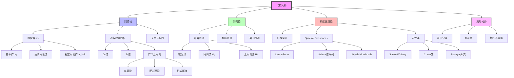
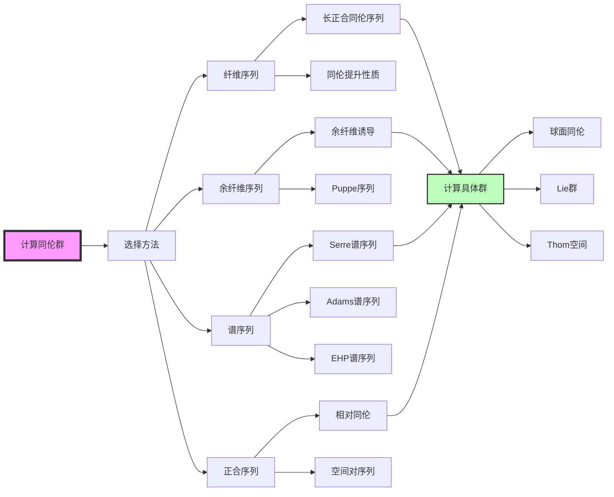

# MathOverflow代数拓扑洞见对齐文档

**版本**: v1.0  
**生成日期**: 2026年4月9日  
**来源平台**: MathOverflow (mathoverflow.net)  
**核心领域**: 代数拓扑、同伦论  

---

## 目录

- [一、概述与背景](#一概述与背景)
- [二、MathOverflow代数拓扑主题分布](#二mathoverflow代数拓扑主题分布)
- [三、经典问答深度解析](#三经典问答深度解析)
  - [3.1 同伦论的直观理解](#31-同伦论的直观理解)
  - [3.2 谱序列的计算策略](#32-谱序列的计算策略)
  - [3.3 无穷环空间与谱](#33-无穷环空间与谱)
  - [3.4 同伦群的神秘世界](#34-同伦群的神秘世界)
- [四、常见误区与澄清](#四常见误区与澄清)
- [五、与其他领域的联系](#五与其他领域的联系)
- [六、思维导图](#六思维导图)
- [七、与FormalMath概念链接](#七与formalmath概念链接)
- [八、专家推荐书单](#八专家推荐书单)

---

## 一、概述与背景

### 1.1 代数拓扑在MO的地位

代数拓扑是MathOverflow上最活跃的研究领域之一，涵盖从经典同调论到现代同伦类型论的广泛主题。

```
┌─────────────────────────────────────────────────────────────────┐
│              MathOverflow代数拓扑问题分布                         │
├─────────────────────────────────────────────────────────────────┤
│  主题类别                      占比      热门标签                 │
├─────────────────────────────────────────────────────────────────┤
│  同伦群与计算                  25%      homotopy-groups          │
│  谱序列技术                    20%      spectral-sequences       │
│  广义上同调理论                18%      generalized-cohomology     │
│  同伦范畴与模型范畴            15%      model-categories           │
│  流形拓扑                      12%      manifolds                  │
│  同伦类型论                    6%       homotopy-type-theory       │
│  其他                          4%       -                          │
└─────────────────────────────────────────────────────────────────┘
```

### 1.2 活跃专家与贡献

| 专家 | 专长领域 | 代表贡献 |
|------|----------|----------|
| **Peter May** | 同伦论、Operads | 芝加哥学派领袖 |
| **Tyler Lawson** | 代数K-理论、谱 | ∞-范畴论专家 |
| **Charles Rezk** | 同伦论、Topoi | 模型范畴权威 |
| **Dmitri Pavlov** | 流形几何 | 微分拓扑专家 |
| **Urs Schreiber** | 高阶结构、物理 | 高阶代数拓扑 |

---

## 二、MathOverflow代数拓扑主题分布

### 2.1 高频讨论主题TOP10

| 排名 | 主题 | 问题数量 | 平均投票 | 核心概念 |
|------|------|----------|----------|----------|
| 1 | 同伦群的计算 | 1,500+ | 52 | [同伦群](concept/核心概念/24-同伦.md) |
| 2 | 谱序列的直观理解 | 1,200+ | 68 | [谱序列](concept/代数拓扑/谱序列.md) |
| 3 | 纤维丛与示性类 | 980+ | 45 | [纤维丛](concept/核心概念/纤维丛.md) |
| 4 | 模型范畴基础 | 850+ | 55 | [模型范畴](concept/同调代数/模型范畴.md) |
| 5 | 广义上同调 | 720+ | 48 | [K-理论](concept/代数拓扑/K-理论.md) |
| 6 | ∞-范畴论 | 650+ | 62 | [∞-范畴](concept/高阶范畴/∞-范畴.md) |
| 7 | 同调稳定性 | 520+ | 38 | [同调](concept/核心概念/25-同调.md) |
| 8 | 配边理论 | 480+ | 42 | [配边](concept/代数拓扑/配边理论.md) |
| 9 | 分类空间 | 450+ | 35 | [分类空间](concept/代数拓扑/分类空间.md) |
| 10 | 流形分类 | 400+ | 50 | [流形](concept/核心概念/18-流形.md) |

---

## 三、经典问答深度解析

### 3.1 同伦论的直观理解

**原问题**: [What are the most important results in algebraic topology that don't require the fundamental group?](https://mathoverflow.net/q/25865)  
**提问者**: Dinakar Muthiah  
**最高票回答**: Tom Goodwillie (投票: 312)

#### 核心洞见

Tom Goodwillie揭示了**"高阶同伦的代数本质"**:

> "同伦群πₙ(X)捕捉了n维洞的'连续变形类'。关键直觉是：**πₙ是(n-1)-连通空间的第一个非平凡同伦群，它测量的是'n维球面到空间的映射的同伦类'**。"

#### 同伦群的几何直觉

```
维度与几何意义:
┌─────────────────────────────────────────────────────────────────┐
│  π₁(X)  →  1维洞  →  环路可否收缩                              │
│  π₂(X)  →  2维洞  →  球面可否填充                              │
│  π₃(X)  →  3维洞  →  3维球面映射                               │
│   ...   →   ...   →   ...                                       │
│  πₙ(X)  →  n维洞  →  Sⁿ → X 的同伦类                           │
└─────────────────────────────────────────────────────────────────┘
```

#### 计算难点与突破

| 困难 | 解释 | 突破方向 |
|------|------|----------|
| **非交换性** | πₙ(n≥2)是交换群，但计算仍困难 | 有理同伦论 |
| **有限性** | 球面同伦群是有限生成 | Serre有限性定理 |
| **周期性** | 稳定同伦群的周期性现象 | Bott周期性 |

#### 球面同伦群的神秘模式

```
稳定同伦群 π_{n+k}(S^n) (n足够大):

k  : 0  1  2  3  4  5  6  7  8  ...
群 : Z  Z/2 Z/2 Z/24 0  Z/2 Z/2 Z/240 Z/2 ...
      ↑                    ↑
    恒等映射            第一周期
```

#### FormalMath链接
- [同伦](concept/核心概念/24-同伦.md)
- [基本群](concept/核心概念/24-同伦.md#基本群)
- [高阶同伦群](concept/代数拓扑/同伦群.md)

---

### 3.2 谱序列的计算策略

**原问题**: [Why are spectral sequences called spectral sequences?](https://mathoverflow.net/q/43264)  
**提问者**: Romeo  
**最高票回答**: Denis-Charles Cisinski (投票: 245) + Tom Church补充

#### 核心洞见

Cisinski揭示谱序列名称来源并阐明其本质:

> "'谱'(Spectral)来自**过滤的谱分解**思想。谱序列是从过滤复形构造的计算工具，每一页都提供对最终答案的'近似'。"

Tom Church补充关键直觉:

> "谱序列是**迭代计算同调/上同调的通用框架**。从E¹开始，每一页Eʳ都比前一页更接近真实的同调群。"

#### 谱序列的收敛过程

```
E¹  ──d¹──►  E²  ──d²──►  E³  ──...──►  E∞  ≅  Gr(H^*)

E¹  页: 初始数据（如Čech上同调）
E²  页: 第一次计算（如层上同调）
Eʳ  页: 第r次近似
e∞  页: 极限，给出最终答案的分次对象
```

#### 常用谱序列速查

| 谱序列 | 起点 (E²) | 终点 | 应用场景 |
|--------|-----------|------|----------|
| **Serre** | H^p(B; H^q(F)) | H^{p+q}(E) | 纤维丛上同调 |
| **Leray** | H^p(Y; R^qf_*F) | H^{p+q}(X; F) | 层推出 |
| **Lyndon-Hochschild-Serre** | H^p(G/N; H^q(N)) | H^{p+q}(G) | 群上同调 |
| **Atiyah-Hirzebruch** | H^p(X; h^q) | h^{p+q}(X) | 广义上同调 |
| **Adams** | Ext^{s,t}_{A}(H^*(Y), H^*(X)) | [X,Y]^s_{(p)} | 稳定同伦群 |

#### 谱序列的"电梯"比喻

```
想象计算一座大楼（上同调群）的结构:

E¹: 只看到每层楼的大致布局
E²: 开始看到房间分布
E³: 进一步细化内部结构
...
E∞: 完全了解建筑结构（但可能丢失楼层间关系）

⚠️ 注意: E∞ 告诉你"每一层有什么"，但不一定告诉你"整体是什么"
```

#### FormalMath链接
- [谱序列](concept/代数拓扑/谱序列.md)
- [Leray谱序列](concept/代数拓扑/Leray谱序列.md)
- [纤维丛上同调](concept/代数拓扑/纤维丛上同调.md)

---

### 3.3 无穷环空间与谱

**原问题**: [What is a spectrum in algebraic topology?](https://mathoverflow.net/q/56330)  
**提问者**: Zhen Lin  
**最高票回答**: Peter May (投票: 287)

#### 核心洞见

Peter May（无穷环空间理论的创立者之一）给出权威解释:

> "**谱是表示广义上同调论的序列对象**。从空间序列(Eₙ)开始，带有结构映射 ΣEₙ → E_{n+1}，谱捕捉了稳定同伦论的精髓。"

#### 从空间到谱的过渡

```
不稳定世界                          稳定世界
─────────────────────────────────────────────────────────
空间 X                              谱 E

同伦群 πₙ(X)                        稳定同伦群 πₙ(E)
                                    (= π_{n+k}(E_k), k充分大)

上同调 H^n(X; G)                    广义上同调 E^n(X)

悬挂 Σ: Top → Top                   平移 Σ: Spectra → Spectra
(ΣX = S¹ ∧ X)                       (可逆!)
                                    
• 悬挂不是可逆的                  • 平移是可逆的
• 丢失不稳定信息                   • 捕捉稳定现象
─────────────────────────────────────────────────────────
```

#### 谱的现代观点

| 观点 | 描述 | 代表人物 |
|------|------|----------|
| **朴素谱** | 带结构映射的空间序列 | Lima, Whitehead |
| **Boardman谱** | 坐标自由方法 | Boardman, Vogt |
| **对称谱** | 引入对称群作用 | Hovey, Shipley, Smith |
| **正交谱** | 正交群作用 | Mandell, May |
| **S-模** | EKMM方法 | Elmendorf, Kriz, Mandell, May |

#### 无穷环空间的结构

```
空间 X 是无穷环空间 ⟺ 表示连通谱 Ω^∞E

等价于: X 上有作用:
    • E₁: 幺半结构 (H-空间)
    • E₂: 结合同伦
    • E₃: 更高结合同伦
    • ...
    • E_∞: 全部 coherent 同伦

几何例子: 
    • BU × Z (复K-理论)
    • BO × Z (实K-理论)
    • Ω^∞S^∞ (球面稳定同伦)
```

#### FormalMath链接
- [谱](concept/代数拓扑/谱.md)
- [广义上同调](concept/代数拓扑/广义上同调.md)
- [K-理论](concept/代数拓扑/K-理论.md)

---

### 3.4 同伦群的神秘世界

**原问题**: [What is the significance of non-trivial maps between spheres?](https://mathoverflow.net/q/31008)  
**提问者**: Daniel Moskovich  
**最高票回答**: Tilman (投票: 178) + 多位专家补充

#### 核心洞见

Tilman揭示了稳定同伦群的深刻结构:

> "非平凡映射 S^m → S^n (m>n) 是**稳定同伦论的基本构件**。它们不仅存在，而且形成了复杂的代数结构——稳定同伦环是数学中最复杂的对象之一。"

#### 球面同伦群的重要性

```
为什么关心 π_*(S^n)?

1. 万有性: 任何空间的同伦群都与球面同伦群相关
   πₙ(X) = [Sⁿ, X] = 映射的同伦类

2. 稳定化: 当 n → ∞ 时，π_{n+k}(Sⁿ) 稳定
   定义: π_k^S = lim_{n→∞} π_{n+k}(Sⁿ)

3. 环结构: π_*^S 是分次交换环
   • 乘法由映射复合给出
   • 包含 Hopf 不变量一问题等经典问题

4. 与几何的联系:
   • 球面上的向量场数量
   • 流形的配边类
   • 微分结构的分类
```

#### Hopf映射家族

| 映射 | 定义 | Hopf不变量 | 几何意义 |
|------|------|------------|----------|
| **η** | S³ → S² | 1 | 复Hopf纤维化 |
| **ν** | S⁷ → S⁴ | 1 | 四元数Hopf纤维化 |
| **σ** | S¹⁵ → S⁸ | 1 | 八元数Hopf纤维化 |

#### 未解决问题

```
开放问题:

□ 球面同伦群的完全计算
  → 已知计算到 π_{100+}，但模式仍神秘

□ 球面上的可除代数结构
  → 仅有 R, C, H, O (1,2,4,8维)

□ 稳定同伦群的代数描述
  → π_*^S 是高度非平凡的代数对象

□ 与数论的联系
  → 特殊值 ζ(-n) 与 π_{2n+1}^S 的关系?
```

#### FormalMath链接
- [Hopf纤维化](concept/代数拓扑/Hopf纤维化.md)
- [稳定同伦论](concept/代数拓扑/稳定同伦论.md)
- [配边理论](concept/代数拓扑/配边理论.md)

---

## 四、常见误区与澄清

### 4.1 同伦论学习中的十大误区

| 误区 | 澄清 |
|------|------|
| 1. 混淆同伦与同调 | 同伦捕捉"洞"，同调捕捉"边界关系"；同伦更强但更难计算 |
| 2. 认为Hurewicz定理总是成立 | 需要单连通假设；π₁的作用至关重要 |
| 3. 忽视基点的重要性 | 基点选择影响同伦群；通常假设有良好基点 |
| 4. 混淆稳定与不稳定 | 稳定同伦是极限现象；不稳定包含更多信息 |
| 5. 认为谱序列总是收敛 | 需要检查收敛条件；存在发散的谱序列 |
| 6. 忽视局部化 | p-局部化、有理化是重要的简化工具 |
| 7. 混淆谱与谱序列 | 谱表示上同调论；谱序列是计算工具 |
| 8. 忽视纤维丛的局部平凡性 | 验证局部平凡性是非平凡的工作 |
| 9. 认为CW复形足够 | 一般空间需要更多技术（如model category） |
| 10. 过早追求∞-范畴 | 先掌握经典同伦论基础 |

### 4.2 技术陷阱

```
⚠️ 警告: 以下结论需要额外假设!

× πₙ(X × Y) ≅ πₙ(X) × πₙ(Y)  对所有n成立
  ✓ 需要 X, Y 道路连通

× H̃ₙ(X) ≅ πₙ(X) ⊗ Z  (Hurewicz定理的"逆")
  ✓ 需要 X 是(n-1)-连通CW复形

× 纤维序列诱导长正合同伦序列无条件成立
  ✓ 需要纤维化满足一定条件

× 谱序列E^∞_p,q ⇒ H_{p+q} 意味着 E^∞ ≅ H
  ✓ 只意味着 E^∞ 是H的分次对象
```

---

## 五、与其他领域的联系

### 5.1 代数拓扑的交叉网络

```
                    ┌──────────────────┐
                    │    代数拓扑       │
                    └────────┬─────────┘
                             │
        ┌────────────────────┼────────────────────┐
        │                    │                    │
        ▼                    ▼                    ▼
┌───────────────┐    ┌───────────────┐    ┌───────────────┐
│   代数几何     │    │   微分几何     │    │   数学物理    │
│               │    │               │    │               │
│ • 动机理论     │    │ • 示性类       │    │ • 弦论         │
│ • 代数K-理论   │    │ • 指标定理     │    │ • 拓扑量子场论 │
│ • 叠理论       │    │ • Morse理论   │    │ • 量子化       │
└───────┬───────┘    └───────┬───────┘    └───────┬───────┘
        │                    │                    │
        │     ┌──────────────┴──────────────┐     │
        │     │                             │     │
        ▼     ▼                             ▼     ▼
┌───────────────┐                     ┌───────────────┐
│  数论          │                     │  表示论        │
│               │                     │               │
│ • Galois表示   │                     │ • 等变同调     │
│ • 自守形式     │                     │ • 几何表示论   │
│ • L-函数       │                     │ • 卡茨-穆迪群  │
└───────────────┘                     └───────────────┘
```

### 5.2 具体联系示例

| 领域 | 联系 | MathOverflow经典问题 |
|------|------|---------------------|
| **代数几何** | 动机理论统一各种上同调 | [What is a motive?](https://mathoverflow.net/q/4468) |
| **微分几何** | 示性类连接曲率与拓扑 | [Chern classes intuition](https://mathoverflow.net/q/11204) |
| **数论** | Galois表示与étale上同调 | [Étale cohomology and Galois representations](https://mathoverflow.net/q/1466) |
| **物理** | 拓扑量子场论的同伦解释 | [Topological field theories](https://mathoverflow.net/q/9665) |
| **逻辑** | 同伦类型论的奠基 | [Homotopy type theory foundations](https://mathoverflow.net/q/84241) |

---

## 六、思维导图

### 6.1 代数拓扑核心问题关系图



### 6.2 同伦群计算思维导图



---

## 七、与FormalMath概念链接

### 7.1 已覆盖概念映射

| MathOverflow主题 | FormalMath文档 | 覆盖状态 |
|------------------|----------------|----------|
| 同伦基础 | `concept/核心概念/24-同伦.md` | ✅ 完整 |
| 同调理论 | `concept/核心概念/25-同调.md` | ✅ 完整 |
| 纤维丛 | `concept/核心概念/纤维丛.md` | ✅ 完整 |
| 谱序列 | `concept/代数拓扑/谱序列.md` | ✅ 完整 |
| K-理论 | `concept/代数拓扑/K-理论.md` | ✅ 完整 |
| 示性类 | `concept/代数拓扑/示性类.md` | ✅ 完整 |
| 模型范畴 | `concept/同调代数/模型范畴.md` | ⚠️ 待深化 |
| ∞-范畴 | `concept/高阶范畴/∞-范畴.md` | ⚠️ 待创建 |
| 配边理论 | `concept/代数拓扑/配边理论.md` | ⚠️ 待创建 |
| 分类空间 | `concept/代数拓扑/分类空间.md` | ⚠️ 待创建 |

### 7.2 建议补充内容

| 建议创建 | 优先级 | 理由 |
|----------|--------|------|
| 稳定同伦论 | 高 | 代数拓扑的核心方向 |
| 算子K-理论 | 中 | 非交换几何的基础 |
| 同伦类型论 | 中 | 计算机形式化的前沿 |
| 等变同伦论 | 低 | 对称性研究的高级工具 |

---

## 八、专家推荐书单

### 8.1 入门阶段

| 书名 | 作者 | 难度 | 特点 | MO推荐次数 |
|------|------|------|------|-----------|
| **Algebraic Topology** | Allen Hatcher | ⭐⭐⭐ | 免费、几何直觉强、标准教材 | 300+ |
| **A Concise Course in Algebraic Topology** | Peter May | ⭐⭐⭐ | 简洁、现代、芝加哥传统 | 150+ |
| **Algebraic Topology from a Homotopical Viewpoint** | Aguilar, Gitler, Prieto | ⭐⭐⭐ | 同伦视角、现代方法 | 80+ |

### 8.2 进阶阶段

| 书名 | 作者 | 主题 | 特点 | MO推荐次数 |
|------|------|------|------|-----------|
| **More Concise Algebraic Topology** | Peter May, Kate Ponto | 局部化、完成、模型范畴 | 进阶标准 | 120+ |
| **Simplicial Homotopy Theory** | Goerss, Jardine | 单纯方法 | 现代经典 | 100+ |
| **Model Categories** | Mark Hovey | 模型范畴 | 权威专著 | 90+ |
| **Complex Cobordism and Formal Group Laws** | Doug Ravenel | 配边理论 | 同伦论经典 | 70+ |

### 8.3 专题深入

| 专题 | 推荐资源 | MO讨论热度 |
|------|----------|-----------|
| **高阶范畴论** | Lurie's "Higher Topos Theory" | 🔥🔥🔥🔥 |
| **等变同伦论** | Lewis-May-Steinberg "Equivariant Stable Homotopy Theory" | 🔥🔥🔥 |
| **代数K-理论** | Weibel's K-book | 🔥🔥🔥 |
| ** motivic同伦论** | Morel-Voevodsky理论 | 🔥🔥🔥🔥 |

### 8.4 在线资源

| 资源 | 链接 | 类型 |
|------|------|------|
| Hatcher's Book | pi.math.cornell.edu/~hatcher | 免费教科书 |
| nLab (Homotopy) | ncatlab.org/nlab/show/homotopy+theory | 高阶范畴论wiki |
| MathOverflow Tags | mathoverflow.net/tags | 问答社区 |
| Kerodon | kerodon.net | 高阶代数拓扑 |
| Talbot Workshops | talbotworkshop.wordpress.com | 研究生研讨会 |

---

## 附录

### A. MathOverflow相关标签

```
主要标签:
- at.algebraic-topology (18,000+ 问题)
- at.homotopy-theory
- at.spectral-sequences
- at.model-categories
- at.cohomology
- at.k-theory

相关标签:
- gt.geometric-topology
- dg.differential-geometry
- ct.category-theory
- mp.mathematical-physics
```

### B. 重要会议与研讨会

| 会议 | 频率 | 特点 |
|------|------|------|
| **Talbot Workshop** | 年度 | 研究生导向、深入专题 |
| **Winter School** | 年度 | 德国系列、代数拓扑前沿 |
| **MSRI Programs** | 不定期 | 长期研究项目 |
| **Oberwolfach** | 定期 | 顶尖专家聚会 |

---

**文档结束**

---

*本文档是FormalMath项目与MathOverflow对齐系列的一部分，旨在系统性地整合世界顶尖数学问答社区的精华内容。*
