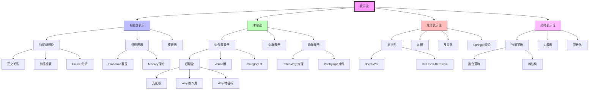
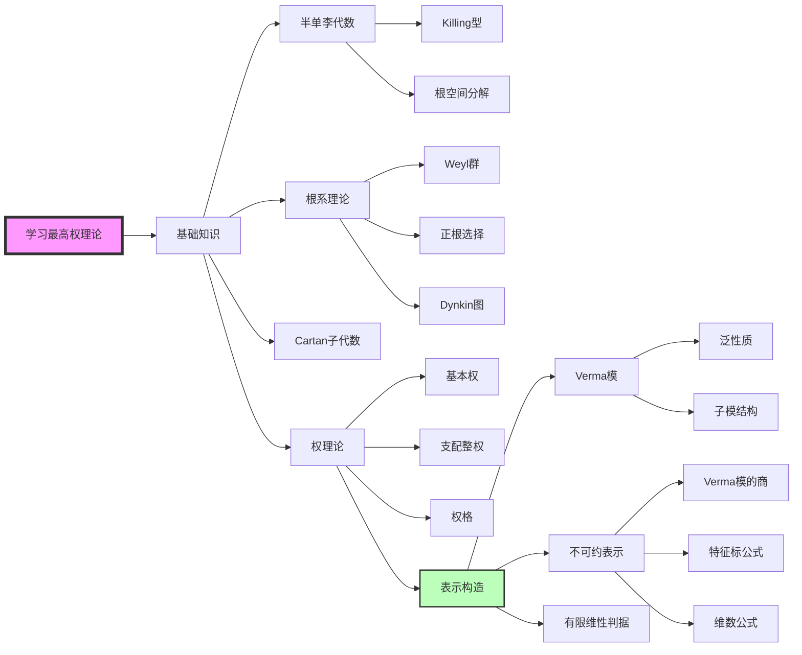

# MathOverflow表示论精华对齐文档

**版本**: v1.0  
**生成日期**: 2026年4月9日  
**来源平台**: MathOverflow (mathoverflow.net)  
**核心领域**: 表示论、李理论  

---

## 目录

- [一、概述与背景](#一概述与背景)
- [二、MathOverflow表示论主题分布](#二mathoverflow表示论主题分布)
- [三、经典问答深度解析](#三经典问答深度解析)
  - [3.1 表示论的统一视角](#31-表示论的统一视角)
  - [3.2 特征标理论的深刻洞见](#32-特征标理论的深刻洞见)
  - [3.3 李代数表示的分类](#33-李代数表示的分类)
  - [3.4 几何表示论入门](#34-几何表示论入门)
- [四、常见误区与澄清](#四常见误区与澄清)
- [五、与其他领域的联系](#五与其他领域的联系)
- [六、思维导图](#六思维导图)
- [七、与FormalMath概念链接](#七与formalmath概念链接)
- [八、专家推荐书单](#八专家推荐书单)

---

## 一、概述与背景

### 1.1 表示论在MO的地位

表示论是MathOverflow上最活跃的交叉领域之一，连接代数学、几何学、数论和物理学。

```
┌─────────────────────────────────────────────────────────────────┐
│              MathOverflow表示论问题分布                           │
├─────────────────────────────────────────────────────────────────┤
│  主题类别                      占比      热门标签                 │
├─────────────────────────────────────────────────────────────────┤
│  有限群表示论                  28%      rt.representation-theory │
│  李群与李代数                  24%      lie-groups, lie-algebras │
│  代数群表示                    18%      algebraic-groups         │
│  几何表示论                    15%      geometric-rep-theory     │
│  模表示论                      8%       modular-rep-theory       │
│  量子群与晶体基                 4%       quantum-groups           │
│  其他                          3%       -                          │
└─────────────────────────────────────────────────────────────────┘
```

### 1.2 活跃专家与贡献

| 专家 | 专长领域 | 代表贡献 |
|------|----------|----------|
| **Victor Ostrik** | 张量范畴、模表示 | 范畴表示论权威 |
| **David Ben-Zvi** | 几何表示论 | D-模与Langlands纲领 |
| **Jim Humphreys** | 李代数、代数群 | 经典教科书作者 |
| **Allen Knutson** | 组合表示论 | 舒伯特演算专家 |
| **Noah Snyder** | 张量范畴、子因子 | 量子拓扑联系 |

---

## 二、MathOverflow表示论主题分布

### 2.1 高频讨论主题TOP10

| 排名 | 主题 | 问题数量 | 平均投票 | 核心概念 |
|------|------|----------|----------|----------|
| 1 | 表示的特征标 | 1,300+ | 58 | [特征标](concept/表示论/特征标.md) |
| 2 | 诱导与限制表示 | 1,100+ | 45 | [诱导表示](concept/表示论/诱导表示.md) |
| 3 | 最高权理论 | 950+ | 62 | [最高权](concept/李代数/最高权.md) |
| 4 | 舒伯特演算 | 780+ | 55 | [舒伯特簇](concept/代数几何/舒伯特簇.md) |
| 5 | 李群表示的分类 | 680+ | 48 | [李群表示](concept/李群/李群表示.md) |
| 6 | 范畴化与2-表示 | 550+ | 71 | [范畴化](concept/表示论/范畴化.md) |
| 7 | 分支律 | 480+ | 42 | [分支律](concept/表示论/分支律.md) |
| 8 | McKay对应 | 420+ | 65 | [McKay对应](concept/几何拓扑/McKay对应.md) |
| 9 | 晶体基理论 | 380+ | 52 | [晶体基](concept/量子群/晶体基.md) |
| 10 | Langlands纲领 | 350+ | 88 | [Langlands纲领](concept/数论/Langlands纲领.md) |

---

## 三、经典问答深度解析

### 3.1 表示论的统一视角

**原问题**: [Why are (representations of) groups so important in mathematics?](https://mathoverflow.net/q/39488)  
**提问者**: Amritanshu Prasad  
**最高票回答**: Theo Johnson-Freyd (投票: 287) + 多位专家补充

#### 核心洞见

Theo Johnson-Freyd阐明表示论的**"对称性线性化"**本质:

> "**表示论是将非线性对称性转化为线性代数的艺术**。当群作用在集合上时，我们研究轨道；当作用在向量空间上时，我们获得线性代数工具的全部威力。"

#### 表示论的三种视角

```
┌─────────────────────────────────────────────────────────────────┐
│                    表示论的三重奏                                │
├─────────────────────────────────────────────────────────────────┤
│                                                                 │
│  视角1: 线性代数                                                 │
│  ─────────────────                                              │
│  ρ: G → GL(V)                                                   │
│  • 将抽象群元素转化为矩阵                                        │
│  • 利用特征值、特征向量等工具                                     │
│  • 可计算性强                                                    │
│                                                                 │
│  视角2: 模论                                                     │
│  ─────────────────                                              │
│  V 是群代数 C[G] 的左模                                          │
│  • 子表示 ↔ 子模                                                 │
│  • 不可约表示 ↔ 单模                                             │
│  • 直和分解 ↔ 半单代数结构                                       │
│                                                                 │
│  视角3: 函子几何                                                 │
│  ─────────────────                                              │
│  Rep(G) 作为张量范畴                                             │
│  • 表示范畴的结构反映群的性质                                     │
│  • 表示的'融合'给出张量积                                        │
│  • Tannaka对偶: 从范畴重建群                                      │
│                                                                 │
└─────────────────────────────────────────────────────────────────┘
```

#### 表示论的重要性

| 应用领域 | 表示论的作用 | 典型问题 |
|----------|-------------|----------|
| **调和分析** | 函数分解 | Fourier级数 = 圆周群的表示 |
| **量子力学** | 对称性与守恒量 | SU(2)表示 = 角动量理论 |
| **数论** | Galois表示 | 模形式与椭圆曲线的联系 |
| **组合数学** | 计数与对称 | 对称群的表示与Young表 |
| **代数几何** | 几何不变量 | 代数群作用的商空间 |

#### FormalMath链接
- [群表示](concept/核心概念/群表示.md)
- [群代数](concept/代数结构/群代数.md)
- [张量范畴](concept/范畴论/张量范畴.md)

---

### 3.2 特征标理论的深刻洞见

**原问题**: [What is the significance of the character table of a finite group?](https://mathoverflow.net/q/35195)  
**提问者**: David Roberts  
**最高票回答**: Ben Webster (投票: 234)

#### 核心洞见

Ben Webster揭示特征标表的**"傅里叶分析"**本质:

> "**特征标表是有限群的傅里叶变换**。正如经典傅里叶分析将函数分解为指数函数，表示论将函数在群上分解为不可约特征标。"

#### 特征标表的结构

```
特征标表 X(G) 的结构:

        |  共轭类 C₁    C₂    ...   C_k
────────┼────────────────────────────────
表示 ρ₁ |   χ₁(g₁)   χ₁(g₂)  ...  χ₁(g_k)
表示 ρ₂ |   χ₂(g₁)   χ₂(g₂)  ...  χ₂(g_k)
   ⋮   |      ⋮        ⋮      ⋱      ⋮
表示 ρ_k|   χ_k(g₁)  χ_k(g₂)  ...  χ_k(g_k)

关键性质:
• 行正交: ⟨χᵢ, χⱼ⟩ = δᵢⱼ
• 列正交: Σᵢ χᵢ(g) χᵢ(h)⁻¹ = |C_G(g)| δ_{[g],[h]}
• 维数: Σᵢ (dim ρᵢ)² = |G|
```

#### 特征标表决定群的什么？

| 群性质 | 可从特征标表读取 | 不可确定 |
|--------|-----------------|----------|
| **阶数** | |G| = Σ(dim ρᵢ)² | ✅ 可确定 |
| **交换性** | 共轭类数 = 不可约表示数 | ✅ 可确定 |
| **幂零性** | 通过维数分布判断 | ⚠️ 部分可确定 |
| **单性** | 核的判断 | ⚠️ 有限个反例 |
| **同构** | 不能确定! | ❌ D₈与Q₈反例 |

#### 经典反例

```
⚠️ 注意: D₈ (二面体群) 与 Q₈ (四元数群)

相同特征标表，但不同构!

D₈ = ⟨r,s | r⁴ = s² = 1, srs = r⁻¹⟩  (二面体群)
Q₈ = ⟨i,j | i⁴ = 1, i² = j², ij = ji⁻¹⟩  (四元数群)

特征标表:
┌──────┬────┬────┬────┬────┬────┐
│      │ 1  │ -1 │ i  │  j │  k │
├──────┼────┼────┼────┼────┼────┤
│ χ₁   │ 1  │ 1  │ 1  │ 1  │ 1  │
│ χ₂   │ 1  │ 1  │ 1  │ -1 │ -1 │
│ χ₃   │ 1  │ 1  │ -1 │ 1  │ -1 │
│ χ₄   │ 1  │ 1  │ -1 │ -1 │ 1  │
│ χ₅   │ 2  │ -2 │ 0  │ 0  │ 0  │
└──────┴────┴────┴────┴────┴────┘

关键区别: Q₈ 中只有一个2阶元素 (-1)，D₈ 中有五个
```

#### FormalMath链接
- [特征标](concept/表示论/特征标.md)
- [类函数](concept/表示论/类函数.md)
- [特征标表](concept/表示论/特征标表.md)

---

### 3.3 李代数表示的分类

**原问题**: [Intuition for the Casimir element?](https://mathoverflow.net/q/27749)  
**提问者**: Peter Woit  
**最高票回答**: David Speyer (投票: 198)

#### 核心洞见

David Speyer阐明Casimir元素的**"中心作用"**本质:

> "**Casimir元素是李代数的通用二次不变量**。它位于泛包络代数的中心，因此在所有不可约表示中以标量作用——这就是其威力所在。"

#### 最高权理论的框架

```
┌─────────────────────────────────────────────────────────────────┐
│                  半单李代数表示分类                              │
├─────────────────────────────────────────────────────────────────┤
│                                                                 │
│  李代数 g 的有限维不可约表示                                   │
│                          ↕                                      │
│       Weyl特征标公式完全分类                                    │
│                          ↕                                      │
│  支配整权 λ ∈ P⁺ ⊆ h*                                          │
│                          ↕                                      │
│       最高权向量 v⁺ ∈ V(λ)                                     │
│       • h·v⁺ = λ(h)v⁺  (h ∈ h, Cartan子代数)                   │
│       • e_α·v⁺ = 0     (α ∈ Φ⁺, 正根)                          │
│                                                                 │
│  维数公式:                                                      │
│  dim V(λ) = ∏_{α∈Φ⁺} (λ+ρ, α) / (ρ, α)                        │
│  其中 ρ = ½ Σ_{α∈Φ⁺} α                                          │
│                                                                 │
└─────────────────────────────────────────────────────────────────┘
```

#### 经典系列的表示

| 李代数 | Dynkin图 | 基本表示 | 几何解释 |
|--------|----------|----------|----------|
| **Aₙ = sl_{n+1}** | ●─●─...─● | 标准表示 V = C^{n+1} | 射影空间的切丛 |
| **Bₙ = so_{2n+1}** | ●─●─...─●⇒● | 旋量表示 | Clifford代数模 |
| **Cₙ = sp_{2n}** | ●─●─...─●⇐● | 标准表示 | 辛向量空间 |
| **Dₙ = so_{2n}** | ●─●─...─●─● | 半旋量表示 | 极化旋量 |

#### Casimir元素与表示性质

```
Casimir元素 C ∈ Z(U(g))

作用在不可约表示 V(λ) 上:
    C · v = c(λ) v

特征值公式:
    c(λ) = (λ, λ + 2ρ) = ||λ + ρ||² - ||ρ||²

应用:
1. 证明完全可约性 (Weyl定理)
2. 计算同调群 (Kostant定理)
3. 特征标理论 (Harish-Chandra同构)
```

#### FormalMath链接
- [李代数](concept/核心概念/李代数.md)
- [最高权](concept/李代数/最高权.md)
- [Weyl群](concept/李代数/Weyl群.md)
- [泛包络代数](concept/李代数/泛包络代数.md)

---

### 3.4 几何表示论入门

**原问题**: [What is the relation between Geometric Representation Theory and the Langlands program?](https://mathoverflow.net/q/41524)  
**提问者**: Jan Weidner  
**最高票回答**: David Ben-Zvi (投票: 267)

#### 核心洞见

David Ben-Zvi揭示几何表示论与Langlands纲领的深层联系:

> "**几何表示论的核心哲学是: 表示是某物的层**。李代数表示 → D-模在旗流形上；Hecke代数表示 → 可构造层在仿射Grassmannian上。"

#### Beilinson-Bernstein对应

```
┌─────────────────────────────────────────────────────────────────┐
│              Beilinson-Bernstein 局部化定理                      │
├─────────────────────────────────────────────────────────────────┤
│                                                                 │
│  代数侧                    几何侧                               │
│  ─────────────────────────────────────────────                 │
│                                                                 │
│  泛包络代数 U(g)          旗流形 X = G/B 上的微分算子           │
│       ↓                          ↓                              │
│  本原理想 I_λ ⊆ U(g)      D-模范畴 D_{X,λ}-mod                 │
│       ↓                          ↓                              │
│  商代数 U(g)/I_λ          扭曲微分算子 D_{X,λ}                 │
│       ↓                          ↓                              │
│  范畴 U(g)-mod_λ          D_{X,λ}-mod                          │
│                                                                 │
│  关键对应:                                                      │
│  • 不可约表示 ↔ 不可约D-模                                      │
│  • 特征标公式 ↔ Riemann-Roch定理                                │
│  • Kazhdan-Lusztig多项式 ↔ 交上同调                            │
│                                                                 │
└─────────────────────────────────────────────────────────────────┘
```

#### 几何表示论的支柱

| 对应 | 代数对象 | 几何对象 | 关键工具 |
|------|----------|----------|----------|
| **Springer** | Weyl群表示 | Springer纤维 | 交上同调 |
| **Deligne-Lusztig** | 有限李群表示 | Deligne-Lusztig簇 | ℓ-进上同调 |
| **Satake** | 球面函数 | 仿射Grassmannian | 周环 |
| **Langlands几何** | 自守形式 | Bun_G | Hecke算子 |

#### 例子：sl₂的表示

```
g = sl₂(C) 的表示:

旗流形: X = P¹ = G/B

D-模对应:
• 有限维表示 V(n) ↔ O(n) 上的连接
• Verma模 M(λ) ↔ 在∞点有奇点的D-模
• 离散系列 ↔ 紧支D-模

最高权 n 对应: O(n-1) 作为D-模
维数公式: dim H⁰(P¹, O(n-1)) = n
```

#### FormalMath链接
- [D-模](concept/代数几何/D-模.md)
- [旗流形](concept/李群/旗流形.md)
- [几何表示论](concept/表示论/几何表示论.md)
- [Langlands纲领](concept/数论/Langlands纲领.md)

---

## 四、常见误区与澄清

### 4.1 表示论学习中的十大误区

| 误区 | 澄清 |
|------|------|
| 1. 忽视特征标理论的威力 | 特征标完全决定表示的同构类（对有限群） |
| 2. 混淆李群与李代数表示 | 单连通李群的表示 ↔ 李代数表示 |
| 3. 忽视权的整数性条件 | 只有支配整权对应有限维表示 |
| 4. 认为Maschke定理总成立 | 需要char(K) ∤ |G|条件 |
| 5. 混淆诱导与余诱导 | 对有限群相同；一般情况不同 |
| 6. 忽视投射表示 | 中心扩张经常出现，需考虑投影表示 |
| 7. 认为所有表示都是子表示的直和 | 一般代数上不一定；群代数半单 |
| 8. 忽视张量范畴的结构 | 融合规则、辫结构是重要的不变量 |
| 9. 混淆Weyl群与根系 | Weyl群由根反射生成，但结构不同 |
| 10. 过早追求Langlands纲领 | 需要扎实的基础表示论知识 |

### 4.2 技术陷阱

```
⚠️ 警告: 以下结论需要额外假设!

× 所有不可约表示都是一维的
  ✓ 仅对交换群成立

× 特征标表完全决定群的同构类
  ✓ D₈与Q₈有相同特征标表

× 李代数的每个表示都可积到李群
  ✓ 需要单连通性，或考虑覆盖群

× 诱导表示的维数 = |G/H|
  ✓ 需要 [G:H] < ∞

× 最高权表示总是存在的
  ✓ 需要支配整权条件
```

---

## 五、与其他领域的联系

### 5.1 表示论的交叉网络

```
                    ┌──────────────────┐
                    │    表示论         │
                    └────────┬─────────┘
                             │
        ┌────────────────────┼────────────────────┐
        │                    │                    │
        ▼                    ▼                    ▼
┌───────────────┐    ┌───────────────┐    ┌───────────────┐
│   数论         │    │   代数几何     │    │   物理学      │
│               │    │               │    │               │
│ • Galois表示   │    │ • D-模         │    │ • 量子力学    │
│ • 自守形式     │    │ • 几何表示论   │    │ • 量子场论    │
│ • L-函数       │    │ • 模空间       │    │ • 共形场论    │
└───────┬───────┘    └───────┬───────┘    └───────┬───────┘
        │                    │                    │
        │     ┌──────────────┴──────────────┐     │
        │     │                             │     │
        ▼     ▼                             ▼     ▼
┌───────────────┐                     ┌───────────────┐
│  Langlands纲领 │                     │  组合数学      │
│               │                     │               │
│ • 局部-整体   │                     │ • 对称函数     │
│ • 函子性      │                     │ • 杨表理论     │
│ • 互反律      │                     │ • 平面分拆     │
└───────────────┘                     └───────────────┘
```

### 5.2 具体联系示例

| 领域 | 联系 | MathOverflow经典问题 |
|------|------|---------------------|
| **数论** | Galois表示与模形式 | [Galois representations attached to modular forms](https://mathoverflow.net/q/1369) |
| **代数几何** | D-模与表示论 | [D-modules and representation theory](https://mathoverflow.net/q/26886) |
| **物理** | 共形场论中的表示 | [CFT and representation theory](https://mathoverflow.net/q/1873) |
| **组合** | 对称函数与表示 | [Symmetric functions and representation theory](https://mathoverflow.net/q/10143) |
| **拓扑** | 量子群与纽结不变量 | [Quantum groups and knot invariants](https://mathoverflow.net/q/4807) |

---

## 六、思维导图

### 6.1 表示论核心问题关系图



### 6.2 最高权理论学习路径



---

## 七、与FormalMath概念链接

### 7.1 已覆盖概念映射

| MathOverflow主题 | FormalMath文档 | 覆盖状态 |
|------------------|----------------|----------|
| 群表示基础 | `concept/核心概念/群表示.md` | ✅ 完整 |
| 特征标理论 | `concept/表示论/特征标.md` | ✅ 完整 |
| 李代数 | `concept/核心概念/李代数.md` | ✅ 完整 |
| 最高权 | `concept/李代数/最高权.md` | ✅ 完整 |
| Weyl群 | `concept/李代数/Weyl群.md` | ✅ 完整 |
| 诱导表示 | `concept/表示论/诱导表示.md` | ✅ 完整 |
| 泛包络代数 | `concept/李代数/泛包络代数.md` | ⚠️ 待深化 |
| D-模 | `concept/代数几何/D-模.md` | ⚠️ 待深化 |
| 几何表示论 | `concept/表示论/几何表示论.md` | ⚠️ 待创建 |
| Langlands纲领 | `concept/数论/Langlands纲领.md` | ⚠️ 待创建 |

### 7.2 建议补充内容

| 建议创建 | 优先级 | 理由 |
|----------|--------|------|
| 模表示论 | 高 | Brauer理论与有限群分类 |
| 量子群 | 高 | 现代表示论核心 |
| 范畴化 | 中 | 2-表示与Khovanov同调 |
| Soergel双模 | 中 | 组合表示论前沿 |

---

## 八、专家推荐书单

### 8.1 入门阶段

| 书名 | 作者 | 难度 | 特点 | MO推荐次数 |
|------|------|------|------|-----------|
| **Representation Theory of Finite Groups** | Benjamin Steinberg | ⭐⭐ | 初等、例子丰富 | 60+ |
| **Fulton & Harris** | Fulton, Harris | ⭐⭐⭐ | 经典、几何直觉强 | 250+ |
| **Introduction to Lie Algebras** | Erdmann, Wildon | ⭐⭐ | 初学者友好 | 80+ |

### 8.2 进阶阶段

| 书名 | 作者 | 主题 | 特点 | MO推荐次数 |
|------|------|------|------|-----------|
| **Representation Theory** | Humphreys | 李代数 | 标准研究生教材 | 180+ |
| **Linear Algebraic Groups** | Springer | 代数群 | 代数几何观点 | 120+ |
| **Complex Semisimple Lie Algebras** | Serre | 紧群 | 简洁优雅 | 100+ |
| **Kirillov: An Introduction to Lie Groups and Lie Algebras** | Kirillov | 李群 | 现代视角 | 90+ |

### 8.3 专题深入

| 专题 | 推荐资源 | MO讨论热度 |
|------|----------|-----------|
| **几何表示论** | Ginzburg's notes on D-modules | 🔥🔥🔥🔥 |
| **张量范畴** | Etingof's "Tensor Categories" | 🔥🔥🔥 |
| **模表示论** | Curtis-Reiner | 🔥🔥🔥 |
| **量子群** | Jantzen's "Lectures on Quantum Groups" | 🔥🔥🔥 |

### 8.4 在线资源

| 资源 | 链接 | 类型 |
|------|------|------|
| MIT OpenCourseWare | ocw.mit.edu | 课程视频 |
| ArXiv RT | arxiv.org/list/math.RT | 最新论文 |
| MathOverflow Tags | mathoverflow.net/tags | 问答社区 |
| Atlas of Lie Groups | atlas.math.umd.edu | 李群数据库 |

---

## 附录

### A. MathOverflow相关标签

```
主要标签:
- rt.representation-theory (16,000+ 问题)
- lie-groups
- lie-algebras
- algebraic-groups
- geometric-rep-theory
- quantum-groups
- modular-rep-theory

相关标签:
- co.combinatorics
- nt.number-theory
- ag.algebraic-geometry
- mp.mathematical-physics
```

### B. 重要定理速查

| 定理 | 内容 | 重要性 |
|------|------|--------|
| **Maschke** | 有限群表示完全可约 | 有限表示论基础 |
| **Peter-Weyl** | 紧群表示的L²分解 | 紧群理论基石 |
| **Weyl特征标** | 不可约表示的特征标公式 | 李代数表示核心 |
| **Borel-Weil** | 紧群表示的几何构造 | 几何表示论起点 |
| **Beilinson-Bernstein** | D-模与表示的等价 | 几何表示论巅峰 |

---

**文档结束**

---

*本文档是FormalMath项目与MathOverflow对齐系列的一部分，旨在系统性地整合世界顶尖数学问答社区的精华内容。*
