# MathOverflow数论精华对齐文档

**版本**: v1.0  
**生成日期**: 2026年4月9日  
**来源平台**: MathOverflow (mathoverflow.net)  
**核心领域**: 数论、算术几何  

---

## 目录

- [一、概述与背景](#一概述与背景)
- [二、MathOverflow数论主题分布](#二mathoverflow数论主题分布)
- [三、经典问答深度解析](#三经典问答深度解析)
  - [3.1 椭圆曲线的深层结构](#31-椭圆曲线的深层结构)
  - [3.2 模形式的神秘联系](#32-模形式的神秘联系)
  - [3.3 Galois表示的力量](#33-galois表示的力量)
  - [3.4 L-函数的零点分布](#34-l-函数的零点分布)
- [四、常见误区与澄清](#四常见误区与澄清)
- [五、与其他领域的联系](#五与其他领域的联系)
- [六、思维导图](#六思维导图)
- [七、与FormalMath概念链接](#七与formalmath概念链接)
- [八、专家推荐书单](#八专家推荐书单)

---

## 一、概述与背景

### 1.1 数论在MO的地位

数论是MathOverflow上最具历史深度和前沿活力的领域之一，连接古典算术与现代算术几何。

```
┌─────────────────────────────────────────────────────────────────┐
│              MathOverflow数论问题分布                             │
├─────────────────────────────────────────────────────────────────┤
│  主题类别                      占比      热门标签                 │
├─────────────────────────────────────────────────────────────────┤
│  代数数论                      32%      nt.number-theory         │
│  算术几何                      28%      arithmetic-geometry       │
│  解析数论                      18%      analytic-number-theory    │
│  模形式与自守形式               12%      modular-forms             │
│  超越数论                      5%       transcendence             │
│  计算数论                      3%       computational-number-theory│
│  其他                          2%       -                          │
└─────────────────────────────────────────────────────────────────┘
```

### 1.2 活跃专家与贡献

| 专家 | 专长领域 | 代表贡献 |
|------|----------|----------|
| **Noam Elkies** | 椭圆曲线、格点 | 哈佛教授、IMO金牌 |
| **David Speyer** | 代数几何、组合 | 密歇根大学教授 |
| **Kevin Buzzard** | p-进Langlands | 帝国理工、Lean形式化 |
| **Bhargav Bhatt** | 代数几何、数论 | 普林斯顿教授 |
| **Peter Scholze** | 完满空间 | Fields奖得主 |

---

## 二、MathOverflow数论主题分布

### 2.1 高频讨论主题TOP10

| 排名 | 主题 | 问题数量 | 平均投票 | 核心概念 |
|------|------|----------|----------|----------|
| 1 | 椭圆曲线的算术 | 1,500+ | 72 | [椭圆曲线](concept/数论/椭圆曲线.md) |
| 2 | 模形式与Fermat大定理 | 1,200+ | 85 | [模形式](concept/数论/模形式.md) |
| 3 | Galois表示 | 980+ | 68 | [Galois表示](concept/数论/Galois表示.md) |
| 4 | 类域论 | 850+ | 55 | [类域论](concept/代数数论/类域论.md) |
| 5 | L-函数特殊值 | 720+ | 62 | [L-函数](concept/数论/L-函数.md) |
| 6 | 素数分布 | 680+ | 58 | [素数定理](concept/数论/素数定理.md) |
| 7 | BSD猜想 | 550+ | 78 | [BSD猜想](concept/数论/BSD猜想.md) |
| 8 | p-进数 | 480+ | 45 | [p-进数](concept/数论/p-进数.md) |
| 9 | 代数整数环 | 420+ | 42 | [代数整数](concept/代数数论/代数整数.md) |
| 10 | Langlands纲领 | 380+ | 95 | [Langlands纲领](concept/数论/Langlands纲领.md) |

---

## 三、经典问答深度解析

### 3.1 椭圆曲线的深层结构

**原问题**: [What is the Birch and Swinnerton-Dyer conjecture about?](https://mathoverflow.net/q/74028)  
**提问者**: Terry Tao  
**最高票回答**: Tim Dokchitser (投票: 387)

#### 核心洞见

Tim Dokchitser阐明BSD猜想的**"算术-解析桥梁"**本质:

> "**BSD猜想断言: 椭圆曲线的算术复杂度（有理点群的结构）与其解析复杂度（L-函数在s=1处的行为）完全对应**。这是数论中最深刻的预言之一。"

#### BSD猜想的精确陈述

```
┌─────────────────────────────────────────────────────────────────┐
│                 Birch-Swinnerton-Dyer 猜想                      │
├─────────────────────────────────────────────────────────────────┤
│                                                                 │
│  设 E/Q 是椭圆曲线                                              │
│                                                                 │
│  算术侧:                                                        │
│  • E(Q) 是有限生成Abel群                                        │
│  • 秩 r = rank E(Q)                                             │
│  • 挠部分 E(Q)_{tor}                                            │
│  • Sha(E/Q) Tate-Shafarevich群（"阻碍群"）                       │
│  • Regulator R_E                                                │
│  • 周期 Ω_E                                                     │
│  • Tamagawa数 c_p (p | N_E)                                     │
│                                                                 │
│  解析侧:                                                        │
│  • L(E,s) = Σ a_n n^{-s}  (Re(s) > 3/2)                        │
│  • 在 s=1 处有 r 阶零点                                         │
│                                                                 │
│  BSD公式:                                                       │
│  lim_{s→1} L(E,s)/(s-1)^r = (Ω_E · R_E · |Sha| · ∏ c_p) / |E_{tor}|² │
│                                                                 │
│  弱BSD: rank E(Q) = ord_{s=1} L(E,s)                           │
│                                                                 │
└─────────────────────────────────────────────────────────────────┘
```

#### BSD猜想的状态

| 方面 | 已知结果 | 证明者 |
|------|----------|--------|
| **秩0或1** | 弱BSD成立 | Gross-Zagier, Kolyvagin (1986-89) |
| **解析秩0** | E(Q)有限 | Coates-Wiles (1977) |
| **解析秩1** | E(Q)秩≥1 | Gross-Zagier (1986) |
| **高秩** | 基本未解决 | - |
| **Sha有限性** | 秩0或1时已知 | 一般情况开放 |

#### 专家洞见摘录

```
Noam Elkies:
"BSD的难点在于它连接了两个世界：
• E(Q) 是Diophantine对象——寻找有理点
• L(E,1) 是超越对象——复分析的产物

猜想的深刻之处在于断言它们'同步'。"

John Coates:
"BSD是数论的罗塞塔石碑——它将算术、代数、分析统一在一起。
证明它将需要全新的数学思想。"
```

#### FormalMath链接
- [椭圆曲线](concept/数论/椭圆曲线.md)
- [BSD猜想](concept/数论/BSD猜想.md)
- [Mordell-Weil定理](concept/数论/Mordell-Weil定理.md)
- [Tate-Shafarevich群](concept/数论/Tate-Shafarevich群.md)

---

### 3.2 模形式的神秘联系

**原问题**: [Why are modular forms interesting?](https://mathoverflow.net/q/24604)  
**提问者**: David Hansen  
**最高票回答**: Richard Borcherds (投票: 412)

#### 核心洞见

Richard Borcherds（模形式专家、Fields奖得主）揭示模形式的**"对称性函数"**本质:

> "**模形式是具有大量对称性的函数**。它们在模群作用下不变，这种刚性使它们成为算术与几何之间的桥梁。"

#### 模形式的多重身份

```
┌─────────────────────────────────────────────────────────────────┐
│                   模形式的多重面貌                                │
├─────────────────────────────────────────────────────────────────┤
│                                                                 │
│  1. 解析函数                                                    │
│  ───────────────                                                │
│  f: ℍ → C 全纯                                                  │
│  f(γ·z) = (cz+d)^k f(z)  (γ ∈ SL₂(Z))                          │
│  在∞处全纯                                                      │
│                                                                 │
│  2. 几何对象                                                    │
│  ───────────────                                                │
│  模曲线 X₀(N) 上的全纯k-微分形式                                 │
│  ↓                                                              │
│  代数曲线上的代数对象                                            │
│                                                                 │
│  3. 表示论对象                                                  │
│  ───────────────                                                │
│  GL₂(A_Q) 上的自守形式                                          │
│  ↓                                                              │
│  Langlands纲领的GL₂情形                                          │
│                                                                 │
│  4. 组合/算术对象                                               │
│  ─────────────────                                              │
│  Fourier系数 a_n 携带深刻算术信息                                │
│  • a_p = p+1 - #E(F_p)  (椭圆曲线)                              │
│  • a_n = τ(n) Ramanujan τ-函数                                  │
│  • 分拆函数 p(n) 的渐进公式                                      │
│                                                                 │
└─────────────────────────────────────────────────────────────────┘
```

#### 历史里程碑

| 年份 | 发现 | 意义 |
|------|------|------|
| 1829 | Jacobi: θ函数恒等式 | 椭圆函数理论起点 |
| 1916 | Ramanujan猜想 | τ(n)的估计猜想 |
| 1974 | Deligne证明 | Weil猜想推论 |
| 1995 | Wiles证明FLT | 谷山-志村猜想的应用 |
| 2001 | 模提升定理 | Fontaine-Mazur猜想 |

#### Taniyama-Shimura猜想

```
谷山-志村猜想 (现称模提升定理):

"所有定义在Q上的椭圆曲线都是模的"

等价表述:
• 存在权2新形式 f，使 L(E,s) = L(f,s)
• E 的L-函数与模形式的L-函数一致
• E 对应于从模曲线到E的模参量化

证明意义:
• 建立了椭圆曲线与模形式的深刻联系
• 证明了Fermat大定理
• 开启了Langlands纲领的新篇章
```

#### FormalMath链接
- [模形式](concept/数论/模形式.md)
- [谷山-志村猜想](concept/数论/谷山-志村猜想.md)
- [Hecke算子](concept/数论/Hecke算子.md)
- [Fermat大定理](concept/数论/Fermat大定理.md)

---

### 3.3 Galois表示的力量

**原问题**: [What are Galois representations and why are they important?](https://mathoverflow.net/q/11747)  
**提问者**: Qiaochu Yuan  
**最高票回答**: Emerton (投票: 298)

#### 核心洞见

Emerton阐明Galois表示的**"对称性编码"**本质:

> "**Galois表示是将Galois群的作用线性化的方法**。它让我们用线性代数（矩阵）研究域扩张的抽象对称性，从而连接算术与几何。"

#### Galois表示的框架

```
┌─────────────────────────────────────────────────────────────────┐
│                  Galois表示的基本框架                            │
├─────────────────────────────────────────────────────────────────┤
│                                                                 │
│  绝对Galois群:                                                  │
│  G_Q = Gal(Q̄/Q)                                                 │
│      = lim← Gal(K/Q)  (K/Q 有限Galois扩张)                      │
│                                                                 │
│  Galois表示:                                                    │
│  ρ: G_Q → GL_n(Q̄_ℓ)  (ℓ-adic表示)                              │
│     ↓                                                           │
│  连续群同态                                                      │
│                                                                 │
│  来源:                                                          │
│  ┌─────────────┬─────────────────────────────────────────────┐  │
│  │ 几何来源    │ 来源                                        │  │
│  ├─────────────┼─────────────────────────────────────────────┤  │
│  │ 椭圆曲线    │ T_ℓ(E) ≅ Z_ℓ², Galois作用                    │  │
│  │ Abel簇      │ H¹_et(A, Q_ℓ)                               │  │
│  │ 模形式      │ 关联的Galois表示 (Deligne构造)                │  │
│  │ 代数簇      │ H^i_et(X, Q_ℓ)                              │  │
│  └─────────────┴─────────────────────────────────────────────┘  │
│                                                                 │
└─────────────────────────────────────────────────────────────────┘
```

#### p-进Galois表示的分类

| 类型 | 特征 | 例子 |
|------|------|------|
| **晶体表示** | 可被Fontaine-Lafaille模描述 | 好约化的椭圆曲线 |
| **半稳定表示** | 推广晶体表示 | 半稳定约化 |
| **de Rham表示** | 与de Rham上同调相关 | 所有几何来源的表示 |
| **Hodge-Tate表示** | 有Hodge-Tate分解 | de Rham表示的子类 |

#### p-进Hodge理论的联系

```
比较定理:

设 X/K 是光滑射影簇，K/Q_p 有限扩张

H^i_{dR}(X/K) ⊗_K B_{dR} ≅ H^i_{et}(X_{K̄}, Q_p) ⊗_{Q_p} B_{dR}

其中 B_{dR} 是de Rham周期环

意义: 连接 p-进étale上同调与代数de Rham上同调
     ↓
      p-进Hodge理论的核心
```

#### FormalMath链接
- [Galois表示](concept/数论/Galois表示.md)
- [Galois群](concept/伽罗瓦理论/Galois群.md)
- [p-进Hodge理论](concept/数论/p-进Hodge理论.md)
- [étale上同调](concept/代数几何/étale上同调.md)

---

### 3.4 L-函数的零点分布

**原问题**: [What is the current status of the Riemann Hypothesis?](https://mathoverflow.net/q/17209)  
**提问者**: unknown  
**最高票回答**: Kiran Kedlaya (投票: 356)

#### 核心洞见

Kiran Kedlaya综述Riemann假设的**"零点分布"**问题:

> "**Riemann假设断言: Riemann ζ函数的所有非平凡零点都位于临界线 Re(s) = 1/2 上**。这是数学中最著名的未解决问题，蕴含了素数分布的最精确信息。"

#### 数值验证状态

```
┌─────────────────────────────────────────────────────────────────┐
│               Riemann假设的数值验证                              │
├─────────────────────────────────────────────────────────────────┤
│                                                                 │
│  验证高度:                                                      │
│  • 1986: 1.5×10⁹ 个零点 (van de Lune)                          │
│  • 2001: 10¹³ 个零点 (van de Lune et al.)                      │
│  • 2004: 10²² 个零点 (Gourdon)                                 │
│  • 2020: 10¹² 个零点 (Platt-Trudgian)                          │
│                                                                 │
│  关键结果:                                                      │
│  • 所有验证的零点都在临界线上                                    │
│  • 前10万亿个零点满足RH                                         │
│  • 零点间隔分布符合GUE预测                                      │
│                                                                 │
│  ⚠️ 注意: 数值验证≠证明                                          │
│                                                                 │
└─────────────────────────────────────────────────────────────────┘
```

#### L-函数的通用框架

| L-函数 | 定义 | 函数方程 | 猜想 |
|--------|------|----------|------|
| **Riemann ζ** | Σ n^{-s} | s ↔ 1-s | RH |
| **Dirichlet L** | Σ χ(n)n^{-s} | s ↔ 1-s | GRH |
| **Dedekind ζ_K** | Σ N(a)^{-s} | s ↔ 1-s | ERH |
| **椭圆曲线 L** | Σ a_n n^{-s} | s ↔ 2-s | BSD |
| **模形式 L** | Σ a_n n^{-s} | s ↔ k-s | 解析延拓 |

#### Langlands纲领中的L-函数

```
Langlands对应 (简化版):

自守表示 π ↔ Galois表示 ρ
     ↓                ↓
   L(π,s)     =    L(ρ,s)

关键性质:
• L-函数的解析延拓
• 函数方程
• 特殊值的算术意义

应用:
• Artin猜想的证明 (Langlands-Tunnell)
• Sato-Tate猜想 (Taylor et al.)
• 函子性提升
```

#### FormalMath链接
- [Riemann假设](concept/数论/Riemann假设.md)
- [L-函数](concept/数论/L-函数.md)
- [解析延拓](concept/复分析/解析延拓.md)
- [Langlands纲领](concept/数论/Langlands纲领.md)

---

## 四、常见误区与澄清

### 4.1 数论学习中的十大误区

| 误区 | 澄清 |
|------|------|
| 1. 认为RH接近被证明 | RH仍是开放问题；数值验证≠证明 |
| 2. 混淆代数闭包与代数整数 | Q̄包含所有代数数；O_K是整数环 |
| 3. 忽视素数在整数环中的分解 | 分解行为决定算术性质 |
| 4. 认为所有椭圆曲线秩有限 | Mordell-Weil定理保证；但计算困难 |
| 5. 混淆模形式与尖点形式 | 尖点形式是模形式的子空间 |
| 6. 忽视局部-整体原理 | Hasse原理不总成立（Sha阻碍） |
| 7. 认为p-进分析是"类比" | p-进分析有独立的深刻理论 |
| 8. 混淆绝对Galois群与相对Galois群 | G_Q是逆极限；G(K/Q)是有限群 |
| 9. 忽视Weil猜想的重要性 | 奠定现代算术几何基础 |
| 10. 过早追求Langlands纲领 | 需要扎实的代数数论和表示论基础 |

### 4.2 技术陷阱

```
⚠️ 警告: 以下结论需要额外假设!

× 椭圆曲线 E/Q 必有有理点
  ✓ 由Mordell-Weil，E(Q)是有限生成
     但可能没有非平凡有理点

× 两个椭圆曲线同构 ⟺ j-不变量相同
  ✓ 只在代数闭域上成立
     Q上还需考虑二次扭

× L(E,1) ≠ 0 ⟹ E(Q)有限
  ✓ Kolyvagin定理：秩0时成立
     一般情况需弱BSD

× 多项式在Q上可约 ⟺ mod p可约
  ✓ 逆不成立！Dedekind定理给出部分结果

× 类数1 ⟹ 唯一分解整环
  ✓ 对O_K的整数环成立
     但对一般序不成立
```

---

## 五、与其他领域的联系

### 5.1 数论的交叉网络

```
                    ┌──────────────────┐
                    │    数论           │
                    └────────┬─────────┘
                             │
        ┌────────────────────┼────────────────────┐
        │                    │                    │
        ▼                    ▼                    ▼
┌───────────────┐    ┌───────────────┐    ┌───────────────┐
│   代数几何     │    │   表示论       │    │   复分析       │
│               │    │               │    │               │
│ • 椭圆曲线     │    │ • Galois表示   │    │ • L-函数       │
│ • 概形         │    │ • 自守形式     │    │ • 模形式       │
│ • 上同调       │    │ • Langlands   │    │ • ζ函数        │
└───────┬───────┘    └───────┬───────┘    └───────┬───────┘
        │                    │                    │
        │     ┌──────────────┴──────────────┐     │
        │     │                             │     │
        ▼     ▼                             ▼     ▼
┌───────────────┐                     ┌───────────────┐
│  物理学        │                     │  密码学        │
│               │                     │               │
│ • 弦论         │                     │ • 椭圆曲线密码 │
│ • 镜像对称     │                     │ • 量子密码     │
│ • 算术物理     │                     │ • 公钥系统     │
└───────────────┘                     └───────────────┘
```

### 5.2 具体联系示例

| 领域 | 联系 | MathOverflow经典问题 |
|------|------|---------------------|
| **代数几何** | Weil猜想、Motive理论 | [Weil conjectures for dummies](https://mathoverflow.net/q/2216) |
| **表示论** | 自守形式、Langlands纲领 | [Langlands for physicists](https://mathoverflow.net/q/4249) |
| **物理** | 弦论、算术物理 | [Arithmetic geometry and physics](https://mathoverflow.net/q/3205) |
| **密码学** | ECC、同态加密 | [Elliptic curve cryptography](https://mathoverflow.net/q/8587) |

---

## 六、思维导图

### 6.1 数论核心问题关系图

```mermaid
graph TB
    NT[数论] --> ANT[代数数论]
    NT --> AG[算术几何]
    NT --> ANA[解析数论]
    NT --> TRAN[超越数论]
    
    ANT --> AK[代数数域]
    ANT --> CLASS[类域论]
    ANT --> GALOIS[Galois理论]
    
    AK --> OK[整数环 O_K]
    AK --> IDEAL[理想论]
    AK --> UNIT[单位群]
    AK --> CLASSGROUP[类群]
    
    CLASS --> LOCAL[局部类域论]
    CLASS --> GLOBAL[整体类域论]
    CLASS --> RECIPROCITY[互反律]
    
    GALOIS --> EXTENSION[域扩张]
    GALOIS --> GALOISGROUP[Galois群]
    GALOIS --> REPRESENTATION[Galois表示]
    
    AG --> ELLIPTIC[椭圆曲线]
    AG --> MODULAR[模形式]
    AG --> DIOPHANTINE[Diophantine几何]
    AG --> ARITHMETIC[算术簇]
    
    ELLIPTIC --> MORDELL[Mordell-Weil]
    ELLIPTIC --> BSD[BSD猜想]
    ELLIPTIC --> TORSION[挠子群]
    ELLIPTIC --> RANK[秩问题]
    
    MODULAR --> HECKE[Hecke算子]
    MODULAR --> LFUNCTION[L-函数]
    MODULAR --> TANIYAMA[谷山-志村]
    
    ANA --> PRIME[素数分布]
    ANA --> ZETA[Riemann ζ函数]
    ANA --> SIEVES[筛法]
    ANA --> ADDITIVE[堆垒数论]
    
    ZETA --> RH[Riemann假设]
    ZETA --> PRIMENUMBER[素数定理]
    ZETA --> DIRICHLET[Dirichlet定理]
    
    REPRESENTATION --> PADIC[p-进表示]
    REPRESENTATION --> DEFORMATION[形变理论]
    REPRESENTATION --> LANGLANDS[Langlands纲领]
    
    style NT fill:#f9f,stroke:#333,stroke-width:4px
    style ANT fill:#bbf,stroke:#333
    style AG fill:#bfb,stroke:#333
    style ANA fill:#fbb,stroke:#333
    style TRAN fill:#fbf,stroke:#333
```



### 6.2 椭圆曲线研究思维导图

```mermaid
graph LR
    EC[椭圆曲线 E/Q] --> ARITH[算术性质]
    EC --> ANALYTIC[解析性质]
    EC --> GEOM[几何性质]
    
    ARITH --> POINTS[有理点 E(Q)]
    ARITH --> TORSION2[挠子群]
    ARITH --> RANK2[秩 rank E]
    ARITH --> TATE[Tate-Shafarevich]
    
    POINTS --> MORDELL2[Mordell-Weil定理]
    POINTS --> COMPUTATION[点计算]
    POINTS --> HEIGHT[高度理论]
    
    ANALYTIC --> LFUNC[L-函数 L(E,s)]
    ANALYTIC --> CONDUCTOR[导子 N_E]
    ANALYTIC --> FOURIER[Fourier系数 a_p]
    
    LFUNC --> ANALYTICCONT[解析延拓]
    LFUNC --> FUNCTIONAL[函数方程]
    LFUNC --> SPECIAL[特殊值]
    
    SPECIAL --> LE1[L(E,1)]
    SPECIAL --> DERIVATIVE[L'(E,1)]
    
    GEOM --> MODULARITY[模性]
    GEOM --> ISOGENY[同源]
    GEOM --> REDUCTION[约化类型]
    
    MODULARITY --> PARAM[模参量化]
    MODULARITY --> GALOIS2[关联Galois表示]
    
    ARITH --> BSD2[Birch-Swinnerton-Dyer]
    ANALYTIC --> BSD2
    
    BSD2 --> WEAKBSD[弱BSD]
    BSD2 --> STRONGBSD[精确公式]
    
    style EC fill:#f9f,stroke:#333,stroke-width:4px
    style BSD2 fill:#bfb,stroke:#333,stroke-width:2px
```

---

## 七、与FormalMath概念链接

### 7.1 已覆盖概念映射

| MathOverflow主题 | FormalMath文档 | 覆盖状态 |
|------------------|----------------|----------|
| 素数 | `concept/核心概念/05-素数.md` | ✅ 完整 |
| 同余 | `concept/核心概念/04-同余.md` | ✅ 完整 |
| 椭圆曲线 | `concept/数论/椭圆曲线.md` | ✅ 完整 |
| 模形式 | `concept/数论/模形式.md` | ✅ 完整 |
| p-进数 | `concept/数论/p-进数.md` | ✅ 完整 |
| 代数整数 | `concept/代数数论/代数整数.md` | ✅ 完整 |
| Galois理论 | `concept/伽罗瓦理论/` | ✅ 完整 |
| BSD猜想 | `concept/数论/BSD猜想.md` | ⚠️ 待深化 |
| Galois表示 | `concept/数论/Galois表示.md` | ⚠️ 待创建 |
| Langlands纲领 | `concept/数论/Langlands纲领.md` | ⚠️ 待创建 |

### 7.2 建议补充内容

| 建议创建 | 优先级 | 理由 |
|----------|--------|------|
| Galois表示 | 高 | 现代数论核心工具 |
| 自守形式 | 高 | Langlands纲领基础 |
| 完满空间 (Perfectoid) | 中 | 现代p-进Hodge理论 |
| 高阶Chow群 | 低 | 算术几何前沿 |

---

## 八、专家推荐书单

### 8.1 入门阶段

| 书名 | 作者 | 难度 | 特点 | MO推荐次数 |
|------|------|------|------|-----------|
| **A Friendly Introduction to Number Theory** | Silverman | ⭐⭐ | 非常初等、椭圆曲线入门 | 70+ |
| **An Introduction to the Theory of Numbers** | Hardy, Wright | ⭐⭐⭐ | 经典、全面 | 120+ |
| **Elementary Number Theory** | Burton | ⭐⭐ | 习题丰富 | 60+ |

### 8.2 进阶阶段

| 书名 | 作者 | 主题 | 特点 | MO推荐次数 |
|------|------|------|------|-----------|
| **Algebraic Number Theory** | Neukirch | 代数数论 | 现代标准 | 200+ |
| **The Arithmetic of Elliptic Curves** | Silverman | 椭圆曲线 | 该领域圣经 | 250+ |
| **Advanced Topics in the Arithmetic of Elliptic Curves** | Silverman | 椭圆曲线进阶 | BSD猜想详解 | 180+ |
| **A First Course in Modular Forms** | Diamond, Shurman | 模形式 | 现代方法 | 150+ |
| **p-adic Numbers** | Gouvêa | p-进数 | 入门友好 | 100+ |

### 8.3 专题深入

| 专题 | 推荐资源 | MO讨论热度 |
|------|----------|-----------|
| **Langlands纲领** | Gelbart's "Automorphic Forms on Adele Groups" | 🔥🔥🔥🔥 |
| **算术几何** | Cornell-Silverman-Stevens "Modular Forms and Fermat's Last Theorem" | 🔥🔥🔥🔥 |
| **p-进Hodge理论** | Brinon-Conrad notes | 🔥🔥🔥 |
| **完满空间** | Scholze's papers | 🔥🔥🔥🔥 |

### 8.4 在线资源

| 资源 | 链接 | 类型 |
|------|------|------|
| LMFDB | lmfdb.org | L-函数与模形式数据库 |
| SageMath | sagemath.org | 计算数论软件 |
| ArXiv NT | arxiv.org/list/math.NT | 最新论文 |
| MathOverflow | mathoverflow.net/tags | 问答社区 |
| Number Theory Web | numbertheory.org | 资源汇总 |

---

## 附录

### A. MathOverflow相关标签

```
主要标签:
- nt.number-theory (25,000+ 问题)
- nt.algebraic-number-theory
- nt.analytic-number-theory
- ag.arithmetic-geometry
- nt.elliptic-curves
- nt.modular-forms
- nt.l-functions
- nt.class-field-theory

相关标签:
- ag.algebraic-geometry
- rt.representation-theory
- co.combinatorics
```

### B. 重要猜想列表

| 猜想 | 状态 | 重要性 |
|------|------|--------|
| **Riemann假设** | 开放 | 素数分布核心 |
| **BSD猜想** | 部分已知 | 椭圆曲线算术核心 |
| **Langlands函子性** | 部分已知 | 表示论与数论统一 |
| **abc猜想** | 声称证明(待验证) | Diophantine方程 |
| **Goldbach猜想** | 部分进展 | 经典问题 |
| **Collatz猜想** | 开放 | 经典问题 |

---

**文档结束**

---

*本文档是FormalMath项目与MathOverflow对齐系列的一部分，旨在系统性地整合世界顶尖数学问答社区的精华内容。*
