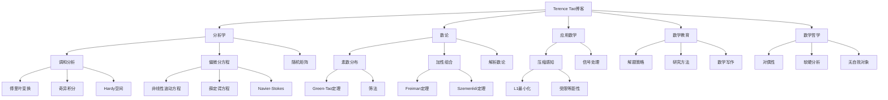
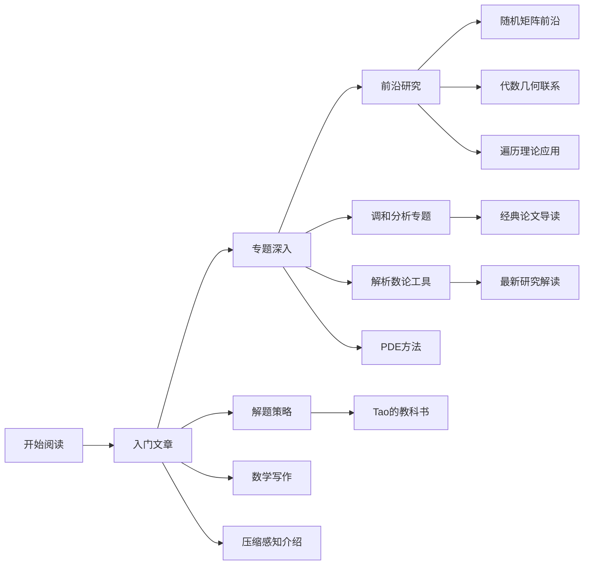

# Terence Tao博客精华整理

**版本**: v1.0
**生成日期**: 2026年4月9日
**来源**: What's New (https://terrytao.wordpress.com)
**数学家**: Terence Tao (陶哲轩)

---

## 目录

- [Terence Tao博客精华整理](#terence-tao博客精华整理)
  - [目录](#目录)
  - [一、概述与背景](#一概述与背景)
    - [1.1 陶哲轩简介](#11-陶哲轩简介)
    - [1.2 博客特点](#12-博客特点)
  - [二、分析学洞见](#二分析学洞见)
    - [2.1 调和分析](#21-调和分析)
      - [关键概念与博文](#关键概念与博文)
      - [应用联系](#应用联系)
    - [2.2 偏微分方程](#22-偏微分方程)
      - [主要贡献领域](#主要贡献领域)
    - [2.3 随机矩阵理论](#23-随机矩阵理论)
  - [三、数论问题解析](#三数论问题解析)
    - [3.1 素数分布](#31-素数分布)
      - [Green-Tao定理相关博文](#green-tao定理相关博文)
    - [3.2 堆垒数论](#32-堆垒数论)
    - [3.3 解析数论方法](#33-解析数论方法)
  - [四、压缩感知与信号处理](#四压缩感知与信号处理)
    - [4.1 压缩感知基础](#41-压缩感知基础)
      - [关键数学工具](#关键数学工具)
    - [4.2 应用实例](#42-应用实例)
  - [五、数学教育观点](#五数学教育观点)
    - [5.1 解题策略](#51-解题策略)
      - [解题的七个阶段](#解题的七个阶段)
      - [常见陷阱与对策](#常见陷阱与对策)
    - [5.2 研究方法论](#52-研究方法论)
    - [5.3 数学交流](#53-数学交流)
  - [六、经典博文深度解读](#六经典博文深度解读)
    - [6.1 对素数定理的初等证明的思考](#61-对素数定理的初等证明的思考)
    - [6.2 波利亚计数法的直观理解](#62-波利亚计数法的直观理解)
    - [6.3 傅里叶分析与数论的联系](#63-傅里叶分析与数论的联系)
    - [6.4 随机矩阵与量子混沌](#64-随机矩阵与量子混沌)
    - [6.5 从压缩感知到稀疏恢复](#65-从压缩感知到稀疏恢复)
    - [6.6 数学中的软分析与硬分析](#66-数学中的软分析与硬分析)
    - [6.7 对偶性原理的普遍性](#67-对偶性原理的普遍性)
    - [6.8 热方程的几何解释](#68-热方程的几何解释)
    - [6.9 组合数论中的遍历方法](#69-组合数论中的遍历方法)
    - [6.10 大数学图景的层次结构](#610-大数学图景的层次结构)
  - [七、与FormalMath概念链接](#七与formalmath概念链接)
    - [7.1 核心概念映射表](#71-核心概念映射表)
    - [7.2 学习路径建议](#72-学习路径建议)
  - [八、思维导图](#八思维导图)
    - [8.1 博客内容结构图](#81-博客内容结构图)
    - [8.2 阅读路线图](#82-阅读路线图)
  - [九、中英文术语对照](#九中英文术语对照)
    - [9.1 分析学术语](#91-分析学术语)
    - [9.2 数论术语](#92-数论术语)
    - [9.3 应用数学术语](#93-应用数学术语)
    - [9.4 数学教育术语](#94-数学教育术语)
  - [十、推荐阅读路径](#十推荐阅读路径)
    - [10.1 按主题阅读](#101-按主题阅读)
    - [10.2 按难度阅读](#102-按难度阅读)
    - [10.3 相关资源](#103-相关资源)

---

## 一、概述与背景

### 1.1 陶哲轩简介

**Terence Tao（陶哲轩）**，1975年生于澳大利亚阿德莱德，是当代最具影响力的数学家之一。2006年菲尔兹奖得主，UCLA数学系教授。

| 成就 | 详情 |
|------|------|
| **菲尔兹奖** | 2006年，表彰其对偏微分方程、组合数学、调和分析和加性数论的贡献 |
| **早期天赋** | 7岁自学微积分，10岁参加IMO获铜牌，11岁获银牌，12岁获金牌 |
| **研究成果** | 发表300+篇论文，h-index超过90 |
| **合作网络** | 与100+位数学家合作，包括Jean Bourgain、Ben Green等 |

### 1.2 博客特点

```
┌─────────────────────────────────────────────────────────────────┐
│                   What's New 博客特色                             │
├─────────────────────────────────────────────────────────────────┤
│  内容层次                                                        │
│  ├── 研究级：最新研究进展、预印本解读                            │
│  ├── 研究生级：课题综述、方法讲解                                │
│  ├── 本科级：课程补充、经典问题                                  │
│  └── 科普级：数学文化、教育观点                                  │
├─────────────────────────────────────────────────────────────────┤
│  写作风格                                                        │
│  ├── 从具体例子出发，逐步抽象                                    │
│  ├── 强调"动机"(motivation)的重要性                             │
│  ├── 多视角阐述同一概念                                          │
│  └── 大量使用类比和直观解释                                      │
├─────────────────────────────────────────────────────────────────┤
│  互动特点                                                        │
│  ├── 开放评论，常与读者深入讨论                                  │
│  ├── 根据反馈持续更新文章                                        │
│  └── 跨文章链接形成知识网络                                      │
└─────────────────────────────────────────────────────────────────┘
```

---

## 二、分析学洞见

### 2.1 调和分析

**核心洞见**：调和分析是研究函数"频率分解"的数学分支，在现代分析学中处于核心地位。

#### 关键概念与博文

| 主题 | 代表博文 | 核心概念 |
|------|----------|----------|
| **傅里叶变换** | "The Fourier Transform" | [傅里叶变换](concept/分析学/傅里叶变换.md) |
| **奇异积分** | "Calderón-Zygmund theory" | [奇异积分](concept/分析学/奇异积分.md) |
| **Hardy空间** | "Hardy spaces and BMO" | [Hardy空间](concept/分析学/Hardy空间.md) |
| **小波分析** | "Wavelets and function spaces" | [小波分析](concept/分析学/小波分析.md) |

**重要洞见摘录**：

> "调和分析的核心思想是将复杂的函数分解为简单的波动成分，这就像将白光分解为七彩光谱。" —— Tao, 2008

#### 应用联系

```
调和分析
├── 偏微分方程 → 解的正则性估计
├── 信号处理 → 压缩感知、去噪
├── 概率论 → 随机级数、鞅论
├── 数论 → 圆法、指数和估计
└── 几何 → 几何测度论
```

### 2.2 偏微分方程

**核心洞见**：PDE是描述自然界连续变化的基本语言，其研究需要融合分析、几何和物理的洞见。

#### 主要贡献领域

| 领域 | 贡献 | 相关概念 |
|------|------|----------|
| **非线性波动方程** | 低正则性解的局部/整体存在性 | [波动方程](concept/偏微分方程/波动方程.md) |
| **薛定谔方程** | 色散方程的Strichartz估计 | [薛定谔方程](concept/偏微分方程/薛定谔方程.md) |
| **Navier-Stokes方程** | 部分正则性结果 | [Navier-Stokes方程](concept/偏微分方程/Navier-Stokes方程.md) |
| **Korteweg-de Vries方程** | 多孤子解的稳定性 | [KdV方程](concept/可积系统/KdV方程.md) |

**研究方法论**：

1. **先验估计方法**：在解存在之前建立其性质估计
2. **迭代方法**：通过逐次逼近构造解
3. **能量方法**：利用守恒律和单调性
4. **调和分析方法**：利用频率空间的性质

### 2.3 随机矩阵理论

**核心洞见**：随机矩阵研究大维度随机矩阵的谱性质，在量子物理、统计学和数据科学中有广泛应用。

| 研究方向 | 关键结果 | FormalMath链接 |
|----------|----------|----------------|
| **Wigner矩阵** | 半圆律的普适性 | [随机矩阵](concept/概率论/随机矩阵.md) |
| **Marchenko-Pastur律** | 样本协方差矩阵的谱分布 | [谱分布](concept/概率论/谱分布.md) |
| **稀疏随机矩阵** | 相变现象的精确刻画 | [相变](concept/统计物理/相变.md) |

---

## 三、数论问题解析

### 3.1 素数分布

**核心洞见**：素数分布的研究揭示了数论与分析之间的深刻联系。

#### Green-Tao定理相关博文

| 博文标题 | 日期 | 核心内容 |
|----------|------|----------|
| "The Green-Tao theorem" | 2008 | 素数中包含任意长的等差数列 |
| "The parity problem" | 2007 | 筛法的奇偶性问题及克服方法 |
| "Linear equations in primes" | 2010 | 素数中的线性方程组 |

**关键概念映射**：

```
素数分布研究
├── 解析方法
│   ├── Riemann zeta函数 → [Riemann假设](concept/数论/Riemann假设.md)
│   ├── 素数定理 → [素数定理](concept/数论/素数定理.md)
│   └── 指数和估计 → [指数和](concept/数论/指数和.md)
├── 组合方法
│   ├── 筛法 → [筛法](concept/数论/筛法.md)
│   ├── 圆法 → [圆法](concept/数论/圆法.md)
│   └── 遍历方法 → [遍历理论](concept/动力系统/遍历理论.md)
└── 代数方法
    ├── 代数几何 → [代数几何](concept/代数几何/概形.md)
    └── 自守形式 → [自守形式](concept/数论/自守形式.md)
```

### 3.2 堆垒数论

**核心洞见**：研究整数集合的加法性质，特别是小集合的和集结构。

| 主题 | 关键结果 | 博文链接 |
|------|----------|----------|
| **Freiman定理** | 具有小和集的集合的结构 | "Freiman's theorem and related results" |
| **Plünnecke-Ruzsa不等式** | 和集增长的组合估计 | "Plünnecke's inequalities" |
| **反演和集问题** | 从和集结构推断原集合 | "Inverse sumset theorems" |

### 3.3 解析数论方法

**博客中强调的方法论**：

1. **多尺度分析**：同时考虑不同尺度上的行为
2. **结构vs随机性二分**：分解对象为结构部分和随机部分
3. **传递性原理**：将有限系统的性质与无限系统的性质联系起来

---

## 四、压缩感知与信号处理

### 4.1 压缩感知基础

**核心洞见**：稀疏信号可以从远少于奈奎斯特定理所要求的样本中恢复。

```
压缩感知核心框架
├── 稀疏性假设
│   └── 信号在某基底下只有少量非零系数
├── 测量矩阵设计
│   ├── 受限等距性(RIP)
│   ├── 随机矩阵（高斯、伯努利）
│   └── 确定性构造
├── 恢复算法
│   ├── L1最小化（基追踪）
│   ├── 贪婪算法（OMP, CoSaMP）
│   └── 迭代阈值算法
└── 理论保证
    ├── 精确恢复条件
    └── 稳定性与鲁棒性
```

#### 关键数学工具

| 工具 | 作用 | 相关概念 |
|------|------|----------|
| **凸优化** | L1最小化问题的求解 | [凸优化](concept/优化/凸优化.md) |
| **概率方法** | 随机矩阵的性质分析 | [概率不等式](concept/概率论/集中不等式.md) |
| **调和分析** | 不相干基底的构造 | [不相干性](concept/分析学/不相干性.md) |
| **逼近论** | 稀疏逼近的误差估计 | [逼近论](concept/分析学/逼近论.md) |

### 4.2 应用实例

博客中讨论的应用领域：

| 应用领域 | 具体问题 | 数学挑战 |
|----------|----------|----------|
| **医学成像** | MRI加速成像 | 测量时间vs图像质量 |
| **单像素相机** | 压缩图像采集 | 硬件实现与算法优化 |
| **雷达信号处理** | 稀疏目标检测 | 实时处理需求 |
| **基因组学** | 基因表达分析 | 高维数据降维 |

---

## 五、数学教育观点

### 5.1 解题策略

陶哲轩在博客中分享的解题方法论：

#### 解题的七个阶段

```
graph LR
    A[理解问题] --> B[制定计划]
    B --> C[执行计划]
    C --> D[检验结果]
    D --> E[反思总结]
    E --> F[推广延伸]
    F --> G[交流分享]

    A -.-> A1[明确已知和目标]
    B -.-> B1[寻找类似问题]
    C -.-> C1[耐心细致]
    D -.-> D1[多种验证方法]
    E -.-> E1[提取一般原则]
    F -.-> F1[改变条件]
    G -.-> G1[清晰表达]
```

#### 常见陷阱与对策

| 陷阱 | 表现 | 对策 |
|------|------|------|
| **符号恐惧** | 被复杂符号吓倒 | 从简单特例开始 |
| **过早优化** | 追求巧妙方法 | 先找到任何解决方法 |
| **忽视边界** | 不考虑极端情况 | 系统检验边界条件 |
| **循环论证** | 无意中假设结论 | 明确区分已知和待证 |

### 5.2 研究方法论

**从博客提炼的研究建议**：

1. **选择问题的重要性**
   - 问题要有"深度"：有非平凡的数学结构
   - 问题要有"广度"：与其他领域有联系
   - 问题要有"可及性"：当前技术可以触及

2. **研究过程中的心态**
   - 接受失败是常态
   - 保持"玩具问题"的练习
   - 广泛阅读，不限于自己的领域

3. **合作与交流**
   - 寻找互补的合作者
   - 积极参与学术讨论
   - 清晰的书面表达

### 5.3 数学交流

**写作建议**：

> "好的数学写作应该让读者感到'我本该想到这个'，而不是'我永远不会想到这个'。" —— Tao

| 写作原则 | 具体建议 |
|----------|----------|
| **动机先行** | 在给出定义之前解释为什么需要它 |
| **例子驱动** | 每个抽象概念都配以具体例子 |
| **分层结构** | 读者可以按需深入细节 |
| **视觉辅助** | 善用图表和示意图 |

---

## 六、经典博文深度解读

### 6.1 对素数定理的初等证明的思考

**博文**: "A prime number theorem for polynomials"
**核心洞见**：初等证明（无需复分析）的存在并不意味着更好的理解。

**关键观点**：

- 初等证明往往更复杂，难以推广
- 解析方法揭示了更深层的结构
- 选择合适的技术比追求初等性更重要

**FormalMath链接**：

- [素数定理](concept/数论/素数定理.md)
- [Riemann zeta函数](concept/分析学/Riemann-zeta函数.md)

### 6.2 波利亚计数法的直观理解

**博文**: "Pólya's enumeration theorem and the Polya-Redfield enumeration theorem"
**核心洞见**：群作用下的计数问题可以通过循环指标多项式系统解决。

**核心概念**：

| 概念 | 直观解释 | 数学表述 |
|------|----------|----------|
| **群作用** | 对称性操作 | G × X → X |
| **轨道** | 等价类 | G-轨道分解 |
| **循环指标** | 对称性的代数编码 | Z(G; x₁, x₂, ...) |

### 6.3 傅里叶分析与数论的联系

**博文**: "The Fourier-analytic approach to counting solutions to Diophantine equations"
**核心洞见**：Hardy-Littlewood圆法将离散计数问题转化为连续积分。

```
圆法框架
├── 设置
│   └── 用指数和表示解的计数
├── 主要弧(Major arcs)
│   ├── 靠近有理点的区域
│   ├── 贡献主要项
│   └── 需要解析数论技术
├── 次要弧(Minor arcs)
│   ├── 远离有理点的区域
│   ├── 需要抵消估计
│   └── 通常使用调和分析
└── 结论
    └── 解的渐近公式
```

### 6.4 随机矩阵与量子混沌

**博文**: "The Berry-Tabor conjecture and the Gaussian unitary ensemble"
**核心洞见**：量子系统的能级统计与随机矩阵的特征值统计有深刻联系。

**关键猜想**：

- **Berry-Tabor猜想**：可积系统的能级统计服从Poisson分布
- **Bohigas-Giannoni-Schmit猜想**：混沌系统的能级统计服从随机矩阵分布

### 6.5 从压缩感知到稀疏恢复

**博文**: "Compressed sensing and single-pixel cameras"
**核心洞见**：稀疏性作为先验知识可以极大减少采样需求。

**数学核心**：

```
恢复问题: y = Ax + noise
├── 稀疏性: x 是K-稀疏的（最多K个非零元）
├── 测量数: m = O(K log(n/K)) << n
├── 恢复条件: A 满足2K阶RIP
└── 算法: min ||x||₁ subject to ||y-Ax||₂ ≤ ε
```

### 6.6 数学中的软分析与硬分析

**博文**: "Soft analysis, hard analysis, and the finite convergence principle"
**核心洞见**："软"分析（定性）和"硬"分析（定量）各有优势，可以相互转化。

| 特征 | 软分析 | 硬分析 |
|------|--------|--------|
| **典型表述** | 存在性、收敛性 | 明确的界、收敛速率 |
| **优势** | 简洁、通用 | 具体、可计算 |
| **劣势** | 无法给出显式估计 | 技术复杂、依赖常数 |
| **联系** | 紧致性论证 | ε-δ论证 |

### 6.7 对偶性原理的普遍性

**博文**: "Duality and the Hahn-Banach theorem"
**核心洞见**：对偶性是贯穿数学的基本主题，从线性代数到几何到分析无处不在。

**对偶性的表现形式**：

```
对偶性实例
├── 线性代数
│   └── 向量空间 ↔ 对偶空间
├── 泛函分析
│   └── 空间 ↔ 连续线性泛函空间
├── 凸几何
│   └── 凸体 ↔ 支撑函数
├── 代数几何
│   └── 概形 ↔ 坐标环
├── 数论
│   └── 加法 ↔ 乘法（傅里叶变换）
└── 逻辑
    └── 语法 ↔ 语义
```

### 6.8 热方程的几何解释

**博文**: "The heat equation and monotonicity formulas"
**核心洞见**：热方程不仅是物理模型，也是研究几何结构的工具。

**核心应用**：

- **Ricci流**：Hamilton和Perelman证明Poincaré猜想的核心工具
- **单调性公式**：证明正则性的关键技术
- **概率解释**：随机游走的连续极限

### 6.9 组合数论中的遍历方法

**博文**: "The ergodic approach to Szemerédi's theorem"
**核心洞见**：Furstenberg将组合问题转化为动力系统问题，开创了新的研究范式。

**Furstenberg对应原理**：

```
组合陈述                    动力系统陈述
─────────────────────────────────────────────────
具有正密度的集合A          保测系统(X, B, μ, T)
A包含k项等差数列           存在x使得x, Tⁿx, T²ⁿx, ...
                           同时落在某可测集
```

### 6.10 大数学图景的层次结构

**博文**: "The 'no self-defeating object' argument"
**核心洞见**：许多数学中的不可能性结果（如停机问题、Gödel不完备定理）共享相同的逻辑结构。

**共同模式**：

> 假设存在最/最大/全知的对象X → 构造一个用X定义的更/更大/更全知的对象Y → 矛盾

**实例**：

- Cantor对角线论证
- Russell悖论
- Gödel不完备定理
- Turing停机问题
- 不确定性原理

---

## 七、与FormalMath概念链接

### 7.1 核心概念映射表

| Tao博客主题 | FormalMath概念文档 | 关键词 |
|-------------|-------------------|--------|
| 调和分析 | [傅里叶分析](concept/分析学/傅里叶分析.md) | Fourier变换、Hardy空间 |
| PDE正则性 | [Sobolev空间](concept/分析学/Sobolev空间.md) | Sobolev嵌入、先验估计 |
| 随机矩阵 | [随机矩阵理论](concept/概率论/随机矩阵.md) | 半圆律、普适性 |
| 素数分布 | [解析数论](concept/数论/解析数论.md) | zeta函数、筛法 |
| 加性组合 | [加性组合学](concept/组合数学/加性组合学.md) | 和集、Freiman定理 |
| 压缩感知 | [稀疏恢复](concept/应用数学/压缩感知.md) | L1最小化、RIP |

### 7.2 学习路径建议

```
初级读者
├── 数学教育类文章
│   └── 解题策略、写作建议
├── 科普级数论文章
│   └── 素数分布直观
└── 应用数学介绍
    └── 压缩感知概述

中级读者（研究生）
├── 调和分析专题
│   └── 傅里叶变换、奇异积分
├── PDE方法综述
│   └── 先验估计、能量方法
└── 解析数论工具
    └── 圆法、筛法基础

高级读者（研究者）
├── 前沿研究解读
│   └── 最新预印本分析
├── 跨学科联系
│   └── 随机矩阵、动力系统
└── 方法论反思
    └── 软/硬分析、对偶性
```

---

## 八、思维导图

### 8.1 博客内容结构图



### 8.2 阅读路线图



---

## 九、中英文术语对照

### 9.1 分析学术语

| 中文 | English | 符号/备注 |
|:----:|:-------:|:---------:|
| 调和分析 | Harmonic Analysis | - |
| 傅里叶变换 | Fourier Transform | ℱ[f] 或 f̂ |
| 奇异积分 | Singular Integral | - |
| Hardy空间 | Hardy Space | H^p |
| BMO空间 | Bounded Mean Oscillation | - |
| Calderón-Zygmund理论 | Calderón-Zygmund Theory | - |
| 小波分析 | Wavelet Analysis | - |
| Sobolev空间 | Sobolev Space | W^{k,p}, H^s |
| 偏微分方程 | Partial Differential Equation | PDE |
| 先验估计 | A Priori Estimate | - |
| Strichartz估计 | Strichartz Estimate | - |
| 色散估计 | Dispersive Estimate | - |
| 随机矩阵 | Random Matrix | - |
| 半圆律 | Semicircle Law | - |
| 普适性 | Universality | - |

### 9.2 数论术语

| 中文 | English | 符号/备注 |
|:----:|:-------:|:---------:|
| 解析数论 | Analytic Number Theory | - |
| 堆垒数论 | Additive Number Theory | - |
| 加性组合学 | Additive Combinatorics | - |
| 素数定理 | Prime Number Theorem | π(x) ~ x/ln x |
| Riemann假设 | Riemann Hypothesis | RH |
| Riemann zeta函数 | Riemann Zeta Function | ζ(s) |
| 筛法 | Sieve Method | - |
| 圆法 | Circle Method | Hardy-Littlewood |
| 指数和 | Exponential Sum | - |
| 等差数列 | Arithmetic Progression | AP |
| Green-Tao定理 | Green-Tao Theorem | - |
| Freiman定理 | Freiman's Theorem | - |
| Szemerédi定理 | Szemerédi's Theorem | - |
| 和集 | Sumset | A+B |
| Plünnecke-Ruzsa不等式 | Plünnecke-Ruzsa Inequality | - |

### 9.3 应用数学术语

| 中文 | English | 符号/备注 |
|:----:|:-------:|:---------:|
| 压缩感知 | Compressed Sensing | CS |
| 稀疏恢复 | Sparse Recovery | - |
| L1最小化 | L1 Minimization | - |
| 基追踪 | Basis Pursuit | - |
| 受限等距性 | Restricted Isometry Property | RIP |
| 不相干性 | Incoherence | - |
| 随机投影 | Random Projection | - |
| 凸优化 | Convex Optimization | - |
| 贪婪算法 | Greedy Algorithm | OMP, CoSaMP |

### 9.4 数学教育术语

| 中文 | English | 符号/备注 |
|:----:|:-------:|:---------:|
| 解题策略 | Problem-Solving Strategy | - |
| 启发法 | Heuristics | - |
| 动机 | Motivation | - |
| 直观 | Intuition | - |
| 形式化 | Formalization | - |
| 推广 | Generalization | - |
| 抽象 | Abstraction | - |
| 类比 | Analogy | - |
| 软分析 | Soft Analysis | 定性分析 |
| 硬分析 | Hard Analysis | 定量分析 |
| 对偶性 | Duality | - |
| 无自败对象论证 | No Self-Defeating Object Argument | - |

---

## 十、推荐阅读路径

### 10.1 按主题阅读

**路径一：调和分析与PDE**（约20篇文章）

1. 基础: "The Fourier Transform"
2. 进阶: "Singular integrals and the Calderón-Zygmund theory"
3. 应用: "Strichartz estimates for the wave and Schrödinger equations"
4. 前沿: "Recent progress on the Navier-Stokes problem"

**路径二：数论探索**（约25篇文章）

1. 基础: "Analytic number theory in the blogosphere"
2. 核心: "The Green-Tao theorem"
3. 方法: "The parity problem in sieve theory"
4. 前沿: "Progress on the twin prime conjecture"

**路径三：应用数学**（约15篇文章）

1. 基础: "Compressed sensing and single-pixel cameras"
2. 理论: "The restricted isometry property"
3. 应用: "Sparse recovery algorithms"
4. 拓展: "Matrix completion and recommendation systems"

### 10.2 按难度阅读

| 难度 | 推荐文章数量 | 预计阅读时间 |
|------|-------------|-------------|
| **入门级** | 30篇 | 40小时 |
| **中级** | 50篇 | 80小时 |
| **高级** | 100+篇 | 200+小时 |

### 10.3 相关资源

| 资源类型 | 链接/说明 |
|----------|----------|
| **博客主页** | https://terrytao.wordpress.com |
| **Tao的教科书** | https://terrytao.wordpress.com/books/ |
| **Tao的论文** | https://arxiv.org/a/tao_t_1 |
| **UCLA主页** | https://math.ucla.edu/~tao/ |

---

**文档结束**

*本文档为FormalMath项目学术资源系列的一部分，最后更新于2026年4月。*
