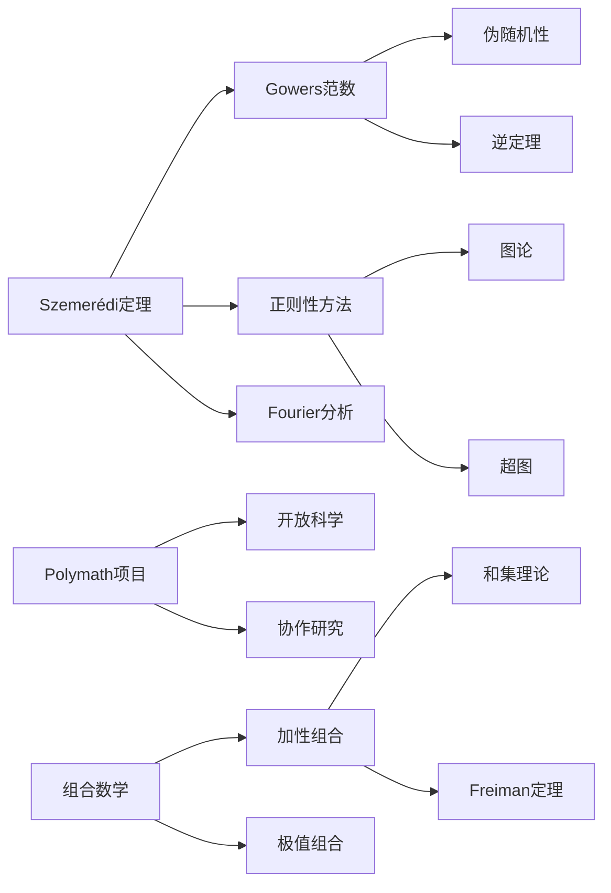

# Timothy Gowers博客精华整理

**版本**: v1.0
**生成日期**: 2026年4月9日
**来源**: Gowers's Weblog (https://gowers.wordpress.com)
**数学家**: Sir Timothy Gowers (提莫西·高尔斯)

---

## 目录

- [Timothy Gowers博客精华整理](#timothy-gowers博客精华整理)
  - [目录](#目录)
  - [一、概述与背景](#一概述与背景)
    - [1.1 Timothy Gowers简介](#11-timothy-gowers简介)
    - [1.2 博客特色](#12-博客特色)
  - [二、组合数学新视角](#二组合数学新视角)
    - [2.1 极值组合学](#21-极值组合学)
      - [Gowers的核心贡献](#gowers的核心贡献)
      - [Gowers范数详解](#gowers范数详解)
    - [2.2 算术组合学](#22-算术组合学)
      - [关键概念网络](#关键概念网络)
      - [Gowers的关键博文](#gowers的关键博文)
    - [2.3 图论中的正则性方法](#23-图论中的正则性方法)
  - [三、数学教育革新](#三数学教育革新)
    - [3.1 Polymath项目](#31-polymath项目)
      - [Polymath项目概览](#polymath项目概览)
      - [Polymath1：密度Hales-Jewett定理](#polymath1密度hales-jewett定理)
    - [3.2 数学思维培养](#32-数学思维培养)
      - [Gowers的学习理念](#gowers的学习理念)
      - [关键教育博文](#关键教育博文)
    - [3.3 课程改革倡议](#33-课程改革倡议)
  - [四、数学写作技巧](#四数学写作技巧)
    - [4.1 清晰写作的原则](#41-清晰写作的原则)
      - [核心原则](#核心原则)
    - [4.2 证明呈现的艺术](#42-证明呈现的艺术)
      - [证明写作的层次](#证明写作的层次)
      - [常见写作问题与解决方案](#常见写作问题与解决方案)
    - [4.3 解释复杂概念](#43-解释复杂概念)
      - [案例分析：解释张量积](#案例分析解释张量积)
  - [五、数学问题解决策略](#五数学问题解决策略)
    - [5.1 寻找证明的方法论](#51-寻找证明的方法论)
      - [Gowers的问题解决框架](#gowers的问题解决框架)
      - [具体技术](#具体技术)
    - [5.2 克服数学障碍](#52-克服数学障碍)
      - [应对策略](#应对策略)
    - [5.3 研究问题的选择](#53-研究问题的选择)
  - [六、经典博文深度解读](#六经典博文深度解读)
    - [6.1 组合数学的对称性方法](#61-组合数学的对称性方法)
    - [6.2 密度Hales-Jewett定理的Polymath证明](#62-密度hales-jewett定理的polymath证明)
    - [6.3 关于数学证明的社会学思考](#63-关于数学证明的社会学思考)
    - [6.4 布尔函数分析的革命](#64-布尔函数分析的革命)
    - [6.5 数学直觉与严格性的平衡](#65-数学直觉与严格性的平衡)
  - [七、与FormalMath概念链接](#七与formalmath概念链接)
    - [7.1 核心概念映射表](#71-核心概念映射表)
    - [7.2 学习路径建议](#72-学习路径建议)
  - [八、思维导图](#八思维导图)
    - [8.1 博客内容结构图](#81-博客内容结构图)
    - [8.2 概念关联图](#82-概念关联图)
  - [九、中英文术语对照](#九中英文术语对照)
    - [9.1 组合数学术语](#91-组合数学术语)
    - [9.2 教育与创新术语](#92-教育与创新术语)
    - [9.3 分析方法术语](#93-分析方法术语)
  - [十、推荐阅读路径](#十推荐阅读路径)
    - [10.1 按主题阅读](#101-按主题阅读)
    - [10.2 Polymath项目追踪](#102-polymath项目追踪)
    - [10.3 相关资源](#103-相关资源)

---

## 一、概述与背景

### 1.1 Timothy Gowers简介

**Sir William Timothy Gowers**，1963年生于英国，1998年菲尔兹奖得主，剑桥大学Rouse Ball数学讲座教授，皇家学会会员。

| 成就 | 详情 |
|------|------|
| **菲尔兹奖** | 1998年，表彰其在泛函分析和组合数学领域的贡献，特别是Banach空间理论和Szemerédi定理的新证明 |
| **学术贡献** | 将泛函分析方法引入组合数学，开创了算术组合学的新方向 |
| **公共服务** | 积极推动开放获取，反对Elsevier的学术出版垄断 |
| **教育创新** | 创建Polymath项目，探索大规模协作数学研究 |

**主要研究方向**：

- Banach空间理论（博士论文方向）
- 组合数学（后来的主要领域）
- 算术组合学（Additive Combinatorics）

### 1.2 博客特色

```
┌─────────────────────────────────────────────────────────────────┐
│                 Gowers's Weblog 特色                              │
├─────────────────────────────────────────────────────────────────┤
│  内容类型                                                        │
│  ├── 原创数学研究                                                │
│  │   └── 许多博文直接贡献新结果                                  │
│  ├── 研究项目进展                                                │
│  │   └── Polymath项目的实时记录                                  │
│  ├── 教学反思                                                    │
│  │   └── 剑桥数学Tripos课程的经验                                │
│  ├── 学术政策评论                                                │
│  │   └── 开放获取、学术评价                                      │
│  └── 数学写作指导                                                │
│      └── "How to write mathematics"系列                         │
├─────────────────────────────────────────────────────────────────┤
│  写作风格                                                        │
│  ├── 对话式、非正式                                              │
│  ├── 鼓励读者思考和提问                                          │
│  ├── 大量未解决问题的讨论                                        │
│  └── 重视概念理解胜过技术细节                                    │
└─────────────────────────────────────────────────────────────────┘
```

---

## 二、组合数学新视角

### 2.1 极值组合学

**核心洞见**：极值组合学研究在特定约束条件下数学结构的最大/最小规模。

#### Gowers的核心贡献

| 主题 | Gowers的贡献 | 与传统方法的区别 |
|------|-------------|----------------|
| **Szemerédi定理** | 给出了首个基于傅里叶分析的新证明 | 避免了遍历理论，更具构造性 |
| **Gowers范数** | 发明了用于度量伪随机性的范数族 | 统一了组合与分析的方法 |
| **超图正则性** | 发展了超图的正则性引理 | 将图论方法推广到高维 |

#### Gowers范数详解

```
Gowers范数体系
├── 定义动机
│   └── 区分"结构"与"伪随机"
├── 低阶范数
│   ├── U¹范数：平均值控制
│   ├── U²范数：与傅里叶分析相关
│   └── ‖f‖_{U²}⁴ = Σ |f̂(ξ)|⁴
├── 高阶范数
│   ├── U³范数：与二次相位相关
│   └── U^k范数：推广到高阶
└── 应用
    ├── 逆定理：范数大蕴含相关性
    └── 计数引理：伪随机集合的计数
```

**FormalMath链接**：

- [Gowers范数](concept/组合数学/Gowers范数.md)
- [极值图论](concept/组合数学/极值图论.md)

### 2.2 算术组合学

**核心洞见**：算术组合学研究整数集合的加法结构，揭示了组合、分析和数论的深刻联系。

#### 关键概念网络

| 概念 | 定义 | 应用 |
|------|------|------|
| **和集** | A+B = {a+b: a∈A, b∈B} | 研究集合的加法结构 |
| **倍集** | kA = A+A+...+A (k次) | Freiman定理的研究对象 |
| **能量** | E(A) = |{(a,b,c,d)∈A⁴: a+b=c+d}| | 度量集合的加法结构 |
| **Ruzsa距离** | d(A,B) = log(|A-B|/√|A||B|) | 度量集合的相似性 |

#### Gowers的关键博文

| 博文标题 | 核心贡献 | 难度 |
|----------|----------|------|
| "A new proof of Szemerédi's theorem" | 傅里叶分析方法 | 高 |
| "What is deep mathematics?" | 算术组合学的哲学思考 | 中 |
| "Quasirandomness, counting and regularity" | 伪随机性框架 | 中高 |

### 2.3 图论中的正则性方法

**核心洞见**：Szemerédi正则性引理断言任何大图都可以用少量随机图近似。

```
正则性方法框架
├── Szemerédi正则性引理
│   ├── 输入：任意图G
│   ├── 输出：顶点集的划分
│   └── 性质：大部分对是ε-正则的
├── 正则对
│   ├── 定义：边的分布均匀
│   └── 重要性：行为类似随机二分图
├── 计数引理
│   └── 从局部信息推断子图计数
└── 应用
    ├── 三角形移除引理
    ├── Roth定理（3项等差数列）
    └── 图性质测试
```

**Gowers的洞察**：
> "正则性引理的威力在于它将任意复杂的图结构转化为可以用概率方法处理的形式。"

**FormalMath链接**：

- [Szemerédi正则性引理](concept/组合数学/Szemerédi正则性引理.md)
- [极值图论](concept/图论/极值图论.md)

---

## 三、数学教育革新

### 3.1 Polymath项目

**核心洞见**：大规模开放式协作可以解决传统单人或小团队无法解决的数学问题。

#### Polymath项目概览

| 项目编号 | 问题 | 状态 | 参与人数 |
|----------|------|------|----------|
| **Polymath1** | 密度Hales-Jewett定理 | ✅ 成功 | 40+ |
| **Polymath2** | 随机k-SAT阈值 | 🔄 进行中 | - |
| **Polymath3** | 多项式Hirsch猜想 | 🔄 部分进展 | - |
| **Polymath4** | 寻找素数的新方法 | ✅ 成功 | 30+ |
| **Polymath5** | Erdős离散对数问题 | ❌ 未解决 | - |
| **Polymath6** | 迷你Polymath（IMO问题） | ✅ 每年举办 | - |
| **Polymath7** | 热核单调性 | ✅ 成功 | - |
| **Polymath8** | 有界素数间隔 | ✅ 重大突破 | 50+ |

#### Polymath1：密度Hales-Jewett定理

**问题陈述**：对于任意维数k和密度δ>0，存在n使得[3]ⁿ的任何δ-稠密子集包含组合线。

**协作特点**：

```
Polymath协作模式
├── 开放编辑
│   └── 任何人可以发表评论
├── 思想快速迭代
│   └── 想法被立即检验和改进
├── 去中心化
│   └── 没有单一领导者
├── 实时记录
│   └── 使用wiki整理进展
└── 快速发表
    └── 以"D.H.J. Polymath"为作者
```

**Gowers的教育反思**：
> "Polymath项目表明，数学发现的过程可以被记录和分享，这对数学教育有深远意义。"

### 3.2 数学思维培养

**核心洞见**：数学能力不是天生的，而是可以通过正确的方法培养。

#### Gowers的学习理念

| 传统观念 | Gowers的修正 | 实践建议 |
|----------|-------------|----------|
| 数学天赋是固定的 | 数学能力可发展 | 强调努力胜过天赋 |
| 证明是一蹴而就的 | 证明是迭代过程 | 展示发现的过程 |
| 数学家总是知道答案 | 数学家经常困惑 | 诚实地讨论困难 |
| 形式化是目的 | 形式化是工具 | 先直观后严格 |

#### 关键教育博文

| 博文 | 核心观点 |
|------|----------|
| "The two cultures of mathematics" | 数学中存在"理论构建者"和"问题解决者"两种文化 |
| "Mathematical discussions" | 数学交流对理解的重要性 |
| "How should mathematics be taught?" | 教学应关注思维过程而非结果 |

### 3.3 课程改革倡议

**剑桥数学Tripos的反思**：

Gowers对数学课程设计的建议：

1. **减少课程数量，增加深度**
   - 与其浅尝辄止多门课程，不如深入少数核心课程

2. **强调概念理解**
   - 技术熟练度应在概念理解的基础上建立

3. **整合不同领域**
   - 展示数学不同分支之间的联系

4. **引入研究式学习**
   - 让学生体验真正的数学发现过程

---

## 四、数学写作技巧

### 4.1 清晰写作的原则

**Gowers的写作哲学**：好的数学写作应该让读者感到"我本该想到这个"。

#### 核心原则

```
清晰写作的六大原则
├── 1. 动机优先
│   └── 先解释为什么，再解释是什么
├── 2. 分层呈现
│   └── 读者可以按需深入
├── 3. 具体先于抽象
│   └── 先用例子说明，再给出一般定义
├── 4. 视觉辅助
│   └── 善用图表和直观解释
├── 5. 避免符号滥用
│   └── 只在必要时引入新符号
└── 6. 明确依赖关系
    └── 清楚地说明使用了什么前置知识
```

### 4.2 证明呈现的艺术

**博文系列**: "How to write a proof"（如何写证明）

#### 证明写作的层次

| 层次 | 特点 | 适用场景 |
|------|------|----------|
| **草图** | 关键步骤的概述 | 专家交流、研究笔记 |
| **完整证明** | 所有细节 | 论文、教科书 |
| **解释性证明** | 解释为什么这样思考 | 教学、博客 |
| **形式证明** | 机器可验证 | 形式化验证项目 |

#### 常见写作问题与解决方案

| 问题 | 表现 | 解决方案 |
|------|------|----------|
| **符号恐惧** | 过多符号让读者迷失 | 用文字解释符号含义 |
| **跳跃过大** | 关键步骤被省略 | 明确说明使用了什么定理 |
| **缺乏动机** | 不知道为什么要这样做 | 在证明前解释策略 |
| **过度形式化** | 机械地堆砌逻辑 | 用自然语言补充 |

### 4.3 解释复杂概念

**Gowers的方法**：将复杂概念分解为简单的思想步骤。

#### 案例分析：解释张量积

**传统定义**：
> 向量空间V和W的张量积V⊗W是满足泛性质的向量空间...

**Gowers的解释方式**：

1. **动机**：为什么需要张量积？——为了表示多线性映射
2. **直观**：V⊗W中的元素是V和W中元素的"乘积"
3. **构造**：如何通过基构造张量积
4. **例子**：具体计算矩阵的张量积
5. **应用**：量子力学中的复合系统

**FormalMath链接**：

- [张量积](concept/线性代数/张量积.md)
- [泛性质](concept/范畴论/泛性质.md)

---

## 五、数学问题解决策略

### 5.1 寻找证明的方法论

**核心洞见**：数学发现不是魔法，而是可以学习和训练的过程。

#### Gowers的问题解决框架

```
寻找证明的策略
├── 理解问题
│   ├── 明确已知条件和目标
│   ├── 检验简单特例
│   └── 寻找反例（如果可能）
├── 探索阶段
│   ├── 尝试已知技术
│   ├── 寻找类比
│   ├── 分解问题
│   └── 改变视角
├── 深入阶段
│   ├── 建立猜想
│   ├── 寻找中间引理
│   ├── 构建证明草图
│   └── 检验关键步骤
└── 完善阶段
    ├── 填补细节
    ├── 简化论证
    ├── 寻找反例验证边界
    └── 探索推广
```

#### 具体技术

| 技术 | 描述 | 示例 |
|------|------|------|
| **极端原理** | 考虑最大/最小/极端情况 | 图论中的极值问题 |
| **不变量方法** | 寻找保持不变的数量 | 组合博弈论 |
| **单调性论证** | 利用单调变化的量 | 动力系统 |
| **密度论证** | 利用鸽巢原理的变体 | Ramsey理论 |
| **概率方法** | 证明存在性而不构造 | Erdős的经典方法 |

### 5.2 克服数学障碍

**博文**: "How to use mathematical concepts that you don't fully understand"

#### 应对策略

| 障碍 | Gowers的建议 |
|------|-------------|
| **概念过于抽象** | 先用具体例子工作，理解会逐渐深入 |
| **技术过于复杂** | 暂时接受为黑箱，专注于应用 |
| **证明过于冗长** | 提取核心思想，细节可以后期补 |
| **符号系统不同** | 建立自己的翻译表 |

**关键洞见**：
> "数学家经常在不完全理解的情况下使用概念，这是正常的学习过程。"

### 5.3 研究问题的选择

**选择好的研究问题的标准**：

1. **重要性**
   - 结果会对领域产生显著影响
   - 与其他问题有联系

2. **可及性**
   - 当前技术可以触及
   - 有可行的攻击路径

3. **个人匹配**
   - 符合个人兴趣和技能
   - 能够长期保持热情

4. **创新性**
   - 有机会发展新技术
   - 不是已有结果的直接推论

---

## 六、经典博文深度解读

### 6.1 组合数学的对称性方法

**博文**: "The importance of mathematics"（2000年，ICM演讲）
**核心洞见**：组合数学的进步常常来自于发现隐藏的对称性或结构。

**关键概念映射**：

```
对称性在组合数学中的作用
├── 群作用
│   ├── 计数问题 → Burnside引理
│   └── 结构分类 → 轨道-稳定子定理
├── 不变量
│   ├── 区分不同构的结构
│   └── 证明不可能性
└── 表示论
    ├── 将组合问题转化为代数问题
    └── 特征标理论的应用
```

### 6.2 密度Hales-Jewett定理的Polymath证明

**博文系列**: "A combinatorial approach to density Hales-Jewett"
**核心洞见**：开放式协作可以产生传统方法无法达到的创新。

**数学背景**：

- Hales-Jewett定理：在足够高维的立方体中，任何着色都包含组合线
- 密度版本：稠密子集（而非任意着色）包含组合线

**Polymath的创新**：

1. **密度增量法**：如果没有组合线，可以在子空间上获得密度增量
2. **随机化论证**：利用概率方法构造结构
3. **迭代论证**：重复密度增量直到得到矛盾

**FormalMath链接**：

- [Hales-Jewett定理](concept/组合数学/Hales-Jewett定理.md)
- [密度Ramsey理论](concept/组合数学/密度Ramsey理论.md)

### 6.3 关于数学证明的社会学思考

**博文**: "Does mathematics need a philosophy?"
**核心洞见**：数学证明不仅是逻辑验证，也是社会建构。

**Gowers的观点**：

- 数学证明需要被数学共同体接受
- 形式化证明只是理想，实际证明依赖共识
- 计算机辅助证明引发了新的哲学问题

### 6.4 布尔函数分析的革命

**博文**: "The polynomial method"
**核心洞见**：多项式方法在组合数学中的应用产生了突破性的结果。

**应用实例**：

| 问题 | 多项式方法的应用 |
|------|----------------|
| Kakeya问题 | 有限域上的维数估计 |
| 错误校正码 | 列表解码的新界限 |
| 组合Nullstellensatz | 组合存在性证明 |

**FormalMath链接**：

- [多项式方法](concept/组合数学/多项式方法.md)
- [布尔函数分析](concept/理论计算机科学/布尔函数分析.md)

### 6.5 数学直觉与严格性的平衡

**博文**: "Mathematics meets real life"
**核心洞见**：纯粹的形式主义不是数学的全部，直觉同样重要。

**平衡原则**：

1. **直觉引导发现**：用直观理解指导研究
2. **严格验证结果**：最终需要形式化证明
3. **直觉可以修正**：证明中的矛盾反馈给直觉
4. **不同任务不同侧重**：探索阶段重直觉，写作阶段重严格

---

## 七、与FormalMath概念链接

### 7.1 核心概念映射表

| Gowers博客主题 | FormalMath概念文档 | 关键词 |
|---------------|-------------------|--------|
| 极值组合学 | [极值图论](concept/组合数学/极值图论.md) | Turán定理、极值问题 |
| Szemerédi定理 | [Szemerédi定理](concept/数论/Szemerédi定理.md) | 等差数列、遍历方法 |
| Gowers范数 | [Gowers范数](concept/组合数学/Gowers范数.md) | 伪随机性、逆定理 |
| 正则性引理 | [正则性引理](concept/组合数学/Szemerédi正则性引理.md) | 图分解、计数引理 |
| 算术组合学 | [加性组合学](concept/组合数学/加性组合学.md) | 和集、Freiman定理 |
| 多项式方法 | [多项式方法](concept/组合数学/多项式方法.md) | 组合Nullstellensatz |
| Polymath项目 | [协作数学](concept/数学教育/协作数学.md) | 开放科学、众包 |

### 7.2 学习路径建议

```
初学者路径
├── 数学教育文章
│   └── "如何写数学"系列
├── 科普级组合数学
│   └── 直观理解组合概念
└── Polymath项目介绍
    └── 了解协作数学模式

研究生路径
├── 极值组合学
│   ├── Szemerédi正则性引理
│   └── 极值图论工具
├── 算术组合学
│   ├── Gowers范数
│   └── 傅里叶分析方法
└── 多项式方法
    └── 有限域几何应用

研究者路径
├── 前沿研究
│   └── Polymath项目参与
├── 方法论反思
│   └── "两种数学文化"
└── 写作指导
    └── 改进学术写作
```

---

## 八、思维导图

### 8.1 博客内容结构图

```mermaid
graph TB
    Gowers[Timothy Gowers博客] --> Combinatorics[组合数学]
    Gowers --> Education[数学教育]
    Gowers --> Writing[数学写作]
    Gowers --> ProblemSolving[问题解决]
    Gowers --> Philosophy[数学哲学]

    Combinatorics --> Extremal[极值组合学]
    Combinatorics --> Arithmetic[算术组合学]
    Combinatorics --> Regularity[正则性方法]

    Extremal --> Turan[Turán理论]
    Extremal --> Ramsey[Ramsey理论]
    Extremal --> Hypergraphs[超图理论]

    Arithmetic --> Szemeredi[Szemerédi定理]
    Arithmetic --> GowersNorms[Gowers范数]
    Arithmetic --> Sumsets[和集理论]

    Regularity --> GraphRegularity[图正则性]
    Regularity --> HypergraphRegularity[超图正则性]
    Regularity --> CountingLemma[计数引理]

    Education --> Polymath[Polymath项目]
    Education --> Curriculum[课程改革]
    Education --> Mindset[思维模式]

    Polymath --> DHJ[密度Hales-Jewett]
    Polymath --> BoundedGaps[有界素数间隔]
    Polymath --> Collaboration[协作模式]

    Writing --> Principles[写作原则]
    Writing --> Proofs[证明呈现]
    Writing --> Explanation[解释技巧]

    ProblemSolving --> Methodology[方法论]
    ProblemSolving --> Strategies[具体策略]
    ProblemSolving --> Obstacles[克服障碍]

    Philosophy --> TwoCultures[两种文化]
    Philosophy --> Intuition[直觉vs严格]
    Philosophy --> Social[社会维度]
```



### 8.2 概念关联图



---

## 九、中英文术语对照

### 9.1 组合数学术语

| 中文 | English | 符号/备注 |
|:----:|:-------:|:---------:|
| 组合数学 | Combinatorics | - |
| 极值组合学 | Extremal Combinatorics | - |
| 算术组合学 | Arithmetic Combinatorics | Additive Combinatorics |
| 加性组合学 | Additive Combinatorics | - |
| 图论 | Graph Theory | - |
| 超图 | Hypergraph | - |
| 极值问题 | Extremal Problem | - |
| Turán定理 | Turán's Theorem | - |
| Ramsey理论 | Ramsey Theory | - |
| Szemerédi定理 | Szemerédi's Theorem | - |
| Szemerédi正则性引理 | Szemerédi Regularity Lemma | - |
| Gowers范数 | Gowers Norm | U^k范数 |
| 伪随机性 | Quasirandomness | - |
| 密度 | Density | - |
| 和集 | Sumset | A+B |
| 倍集 | Dilate | kA |
| 加性能量 | Additive Energy | E(A) |
| Ruzsa距离 | Ruzsa Distance | - |
| Freiman定理 | Freiman's Theorem | - |
| Hales-Jewett定理 | Hales-Jewett Theorem | - |
| 多项式方法 | Polynomial Method | - |
| 组合Nullstellensatz | Combinatorial Nullstellensatz | - |

### 9.2 教育与创新术语

| 中文 | English | 符号/备注 |
|:----:|:-------:|:---------:|
| Polymath项目 | Polymath Project | - |
| 协作数学 | Collaborative Mathematics | - |
| 开放获取 | Open Access | - |
| 开放科学 | Open Science | - |
| 众包 | Crowdsourcing | - |
| 数学教育 | Mathematics Education | - |
| 课程改革 | Curriculum Reform | - |
| 数学写作 | Mathematical Writing | - |
| 问题解决 | Problem Solving | - |
| 数学直觉 | Mathematical Intuition | - |
| 形式化 | Formalization | - |
| 严格性 | Rigor | - |
| 数学文化 | Mathematical Culture | - |
| 理论构建者 | Theory Builder | - |
| 问题解决者 | Problem Solver | - |

### 9.3 分析方法术语

| 中文 | English | 符号/备注 |
|:----:|:-------:|:---------:|
| Fourier分析 | Fourier Analysis | - |
| 调和分析 | Harmonic Analysis | - |
| 遍历理论 | Ergodic Theory | - |
| 泛函分析 | Functional Analysis | - |
| Banach空间 | Banach Space | - |
| 范数 | Norm | ‖·‖ |
| 正则对 | Regular Pair | - |
| ε-正则 | ε-regular | - |
| 计数引理 | Counting Lemma | - |
| 移除引理 | Removal Lemma | - |
| 逆定理 | Inverse Theorem | - |
| 分解定理 | Decomposition Theorem | - |

---

## 十、推荐阅读路径

### 10.1 按主题阅读

**路径一：组合数学入门**（约15篇文章）

1. 基础: "What is deep mathematics?"
2. 核心: "A new proof of Szemerédi's theorem"
3. 工具: "Quasirandomness, counting and regularity"
4. 前沿: "The polynomial method"

**路径二：数学教育改革**（约10篇文章）

1. 理念: "The two cultures of mathematics"
2. 实践: Polymath项目系列文章
3. 反思: "How should mathematics be taught?"
4. 展望: "Mathematics meets real life"

**路径三：学术写作提升**（约12篇文章）

1. 原则: "How to write mathematics"系列
2. 技巧: "On writing short proofs"
3. 案例: 具体博文的写作分析
4. 练习: 模仿改写经典证明

### 10.2 Polymath项目追踪

| 项目 | 相关博文数量 | 建议阅读顺序 |
|------|-------------|-------------|
| **Polymath1** (DHJ) | 20+ | 按时间顺序 |
| **Polymath4** (素数) | 15+ | 先看总结，再读过程 |
| **Polymath8** (有界间隔) | 30+ | 结合张益唐的突破 |

### 10.3 相关资源

| 资源类型 | 链接/说明 |
|----------|----------|
| **博客主页** | https://gowers.wordpress.com |
| **Gowers主页** | https://www.dpmms.cam.ac.uk/~wtg10/ |
| **Polymath维基** | https://michaelnielsen.org/polymath1/ |
| **数学写作指南** | 博客中的"Tricks Wiki"系列 |

---

**文档结束**

*本文档为FormalMath项目学术资源系列的一部分，最后更新于2026年4月。*
