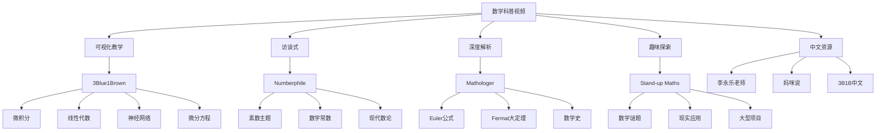
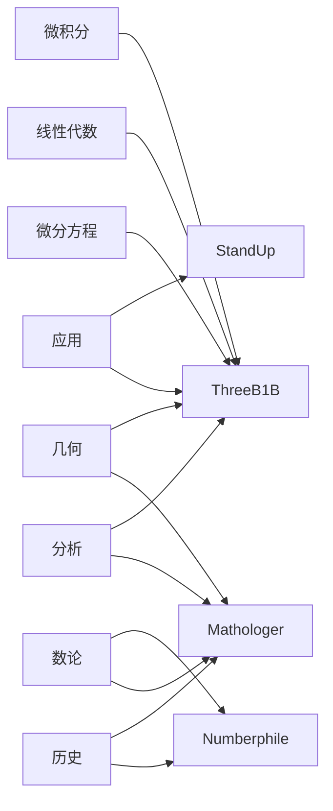

# 数学科普视频资源索引

**版本**: v1.0
**生成日期**: 2026年4月9日
**资源类型**: 数学科普视频
**平台覆盖**: YouTube、Bilibili等

---

## 目录

- [数学科普视频资源索引](#数学科普视频资源索引)
  - [目录](#目录)
  - [一、概述](#一概述)
    - [1.1 索引范围](#11-索引范围)
    - [1.2 使用指南](#12-使用指南)
  - [二、3Blue1Brown](#二3blue1brown)
    - [2.1 频道简介](#21-频道简介)
    - [2.2 Essence of系列](#22-essence-of系列)
      - [Essence of Calculus (微积分的本质) ⭐📚](#essence-of-calculus-微积分的本质-)
      - [Essence of Linear Algebra (线性代数的本质) ⭐📚](#essence-of-linear-algebra-线性代数的本质-)
      - [Essence of Neural Networks (神经网络的本质) ⭐📚](#essence-of-neural-networks-神经网络的本质-)
    - [2.3 其他系列](#23-其他系列)
      - [微分方程系列 📚](#微分方程系列-)
      - [其他热门视频 🔥](#其他热门视频-)
  - [三、Numberphile](#三numberphile)
    - [3.1 频道简介](#31-频道简介)
    - [3.2 数论专题](#32-数论专题)
      - [素数主题 ⭐](#素数主题-)
      - [特殊数列与常数](#特殊数列与常数)
      - [现代数论 🔥](#现代数论-)
    - [3.3 趣味数学](#33-趣味数学)
      - [经典问题](#经典问题)
      - [数学魔术与游戏](#数学魔术与游戏)
  - [四、Mathologer](#四mathologer)
    - [4.1 频道简介](#41-频道简介)
    - [4.2 深度解析系列](#42-深度解析系列)
      - [经典长视频 ⭐⭐](#经典长视频-)
      - [微积分与分析的深入探讨](#微积分与分析的深入探讨)
      - [几何与拓扑](#几何与拓扑)
  - [五、Stand-up Maths](#五stand-up-maths)
    - [5.1 频道简介](#51-频道简介)
    - [5.2 趣味数学探索](#52-趣味数学探索)
      - [热门视频 🔥](#热门视频-)
      - [大型项目](#大型项目)
      - [数学与现实的连接](#数学与现实的连接)
  - [六、其他优质频道](#六其他优质频道)
    - [6.1 中文数学科普](#61-中文数学科普)
    - [6.2 专业教学频道](#62-专业教学频道)
    - [6.3 数学史频道](#63-数学史频道)
  - [七、按主题分类索引](#七按主题分类索引)
    - [7.1 基础数学](#71-基础数学)
    - [7.2 高等数学](#72-高等数学)
    - [7.3 应用数学](#73-应用数学)
    - [7.4 趣味数学](#74-趣味数学)
  - [八、与FormalMath概念链接](#八与formalmath概念链接)
    - [8.1 核心概念映射](#81-核心概念映射)
    - [8.2 学习路径推荐](#82-学习路径推荐)
  - [九、思维导图](#九思维导图)
    - [9.1 视频资源总览](#91-视频资源总览)
    - [9.2 主题-频道映射](#92-主题-频道映射)
  - [十、中英文术语对照](#十中英文术语对照)
    - [10.1 频道与创作者](#101-频道与创作者)
    - [10.2 数学主题](#102-数学主题)
    - [10.3 视频相关术语](#103-视频相关术语)

---

## 一、概述

### 1.1 索引范围

本索引系统整理了YouTube等平台上的优质数学科普视频资源，帮助学习者通过可视化方式理解数学概念。

```
┌─────────────────────────────────────────────────────────────────┐
│                   数学科普视频资源分布                             │
├─────────────────────────────────────────────────────────────────┤
│  内容层次                                                        │
│  ├── 基础数学 (中小学至大学预科)                                  │
│  ├── 本科数学 (微积分、线性代数、微分方程)                        │
│  ├── 研究生数学 (抽象代数、拓扑、分析)                            │
│  └── 前沿研究 (当前数学热点)                                      │
├─────────────────────────────────────────────────────────────────┤
│  视频类型                                                        │
│  ├── 概念可视化 (动画演示)                                        │
│  ├── 问题解析 (经典问题详解)                                      │
│  ├── 历史脉络 (数学发展故事)                                      │
│  └── 实际应用 (数学在现实中的应用)                                │
└─────────────────────────────────────────────────────────────────┘
```

### 1.2 使用指南

| 符号 | 含义 |
|:----:|:----:|
| ⭐ | 强烈推荐，必看内容 |
| 🔥 | 热门视频，播放量百万+ |
| 🎓 | 适合系统学习 |
| 🌐 | 有多语言字幕 |
| 📚 | 系列视频，可连续观看 |

---

## 二、3Blue1Brown

### 2.1 频道简介

**频道名称**: 3Blue1Brown
**创作者**: Grant Sanderson
**平台**: [YouTube](https://www.youtube.com/c/3blue1brown) | [Bilibili](https://space.bilibili.com/88461692)
**订阅量**: 500万+ (YouTube)
**特点**: 使用Manim动画引擎创建高质量数学可视化

**频道特色**：

- 高质量动画演示复杂概念
- 强调几何直观
- 从动机出发讲解数学
- 覆盖从基础到高级的广泛主题

### 2.2 Essence of系列

#### Essence of Calculus (微积分的本质) ⭐📚

| 集数 | 标题 | 核心概念 | FormalMath链接 |
|:----:|:-----|:---------|:---------------|
| 1 | The Essence of Calculus | 微积分概述 | [微积分](concept/分析学/微积分.md) |
| 2 | The paradox of derivative | 导数悖论 | [导数](concept/分析学/导数.md) |
| 3 | Derivative formulas | 求导法则 | [微分](concept/分析学/微分.md) |
| 4 | Visualizing the chain rule | 链式法则可视化 | [链式法则](concept/分析学/链式法则.md) |
| 5 | Visualizing derivatives | 导数可视化 | [切线](concept/几何/切线.md) |
| 6 | Implicit differentiation | 隐函数微分 | [隐函数](concept/分析学/隐函数.md) |
| 7 | Limits | 极限 | [极限](concept/分析学/极限.md) |
| 8 | Integration and area | 积分与面积 | [积分](concept/分析学/积分.md) |
| 9 | Higher order derivatives | 高阶导数 | [高阶导数](concept/分析学/高阶导数.md) |
| 10 | Taylor series | 泰勒级数 | [泰勒级数](concept/分析学/泰勒级数.md) |
| 11 | What does area have to do with slope? | 微积分基本定理 | [微积分基本定理](concept/分析学/微积分基本定理.md) |

#### Essence of Linear Algebra (线性代数的本质) ⭐📚

| 集数 | 标题 | 核心概念 | FormalMath链接 |
|:----:|:-----|:---------|:---------------|
| 1 | Vectors | 向量 | [向量](concept/线性代数/向量.md) |
| 2 | Linear combinations | 线性组合 | [线性组合](concept/线性代数/线性组合.md) |
| 3 | Matrices as linear transformations | 矩阵作为线性变换 | [矩阵](concept/线性代数/矩阵.md) |
| 4 | Matrix multiplication | 矩阵乘法 | [矩阵乘法](concept/线性代数/矩阵乘法.md) |
| 5 | Three-dimensional linear transformations | 三维线性变换 | [线性变换](concept/线性代数/线性变换.md) |
| 6 | The determinant | 行列式 | [行列式](concept/线性代数/行列式.md) |
| 7 | Inverse matrices, column space, null space | 逆矩阵、列空间、零空间 | [逆矩阵](concept/线性代数/逆矩阵.md) |
| 8 | Nonsquare matrices | 非方阵 | [秩](concept/线性代数/秩.md) |
| 9 | Dot products and duality | 点积与对偶 | [内积](concept/线性代数/内积.md) |
| 10 | Cross products | 叉积 | [叉积](concept/线性代数/叉积.md) |
| 11 | Change of basis | 基变换 | [基变换](concept/线性代数/基变换.md) |
| 12 | Eigenvectors and eigenvalues | 特征向量与特征值 | [特征值](concept/线性代数/特征值.md) |
| 13 | Abstract vector spaces | 抽象向量空间 | [向量空间](concept/线性代数/向量空间.md) |
| 14 | Hilbert spaces | 希尔伯特空间 | [希尔伯特空间](concept/泛函分析/希尔伯特空间.md) |
| 15 | Tensor products | 张量积 | [张量积](concept/线性代数/张量积.md) |

#### Essence of Neural Networks (神经网络的本质) ⭐📚

| 集数 | 标题 | 核心概念 | FormalMath链接 |
|:----:|:-----|:---------|:---------------|
| 1 | The essence of neural networks | 神经网络概述 | [神经网络](concept/机器学习/神经网络.md) |
| 2 | Gradient descent | 梯度下降 | [梯度下降](concept/优化/梯度下降.md) |
| 3 | Backpropagation | 反向传播 | [反向传播](concept/机器学习/反向传播.md) |
| 4 | Backpropagation calculus | 反向传播微积分 | [链式法则](concept/分析学/链式法则.md) |

### 2.3 其他系列

#### 微分方程系列 📚

| 视频 | 主题 | 难度 |
|:-----|:-----|:----:|
| Differential equations, a tourist's guide | 微分方程导论 | 入门 |
| But what is a Fourier series? | 傅里叶级数 | 中级 |
| But what is the Fourier Transform? | 傅里叶变换 | 中级 |
| But what is a partial differential equation? | 偏微分方程 | 高级 |
| The heat equation | 热方程 | 高级 |

**FormalMath链接**：

- [常微分方程](concept/微分方程/常微分方程.md)
- [傅里叶级数](concept/分析学/傅里叶级数.md)
- [偏微分方程](concept/偏微分方程/偏微分方程.md)

#### 其他热门视频 🔥

| 视频 | 主题 | 特色 |
|:-----|:-----|:-----|
| The most unexpected answer to a counting puzzle | 帽子谜题 | 组合数学 |
| Pi hiding in prime regularities | 素数中的π | 数论 |
| The Riemann Hypothesis | Riemann假设 | 解析数论 |
| But why is a sphere's surface area 4πr²? | 球面面积 | 几何 |
| Fractals are typically not self-similar | 分形 | 分形几何 |
| Why is there no equation for the perimeter of an ellipse? | 椭圆周长 | 椭圆积分 |

---

## 三、Numberphile

### 3.1 频道简介

**频道名称**: Numberphile
**创作者**: Brady Haran
**平台**: [YouTube](https://www.youtube.com/c/numberphile)
**订阅量**: 400万+
**特点**: 采访世界顶尖数学家，讨论趣味数论问题

**频道特色**：

- 采访风格，与数学家常对话
- 黑纸黄笔的经典视觉风格
- 涵盖从简单到深奥的各种数论主题
- 强调数学的趣味性和美学

### 3.2 数论专题

#### 素数主题 ⭐

| 视频 | 嘉宾 | 核心内容 | FormalMath链接 |
|:-----|:-----|:---------|:---------------|
| The Prime Number Theorem | James Maynard | 素数定理 | [素数定理](concept/数论/素数定理.md) |
| Twin Prime Conjecture | James Maynard | 孪生素数猜想 | [孪生素数猜想](concept/数论/孪生素数猜想.md) |
| The Riemann Hypothesis | Edward Frenkel | Riemann假设 | [Riemann假设](concept/数论/Riemann假设.md) |
| Goldbach Conjecture | David Eisenbud | Goldbach猜想 | [Goldbach猜想](concept/数论/Goldbach猜想.md) |
| The Sieve of Eratosthenes | Dr. James Grime | 埃拉托斯特尼筛法 | [筛法](concept/数论/筛法.md) |
| Prime Spirals | Dr. James Grime | Ulam螺旋 | [素数分布](concept/数论/素数分布.md) |

#### 特殊数列与常数

| 视频 | 主题 | FormalMath链接 |
|:-----|:-----|:---------------|
| Fibonacci Mystery | 斐波那契数列 | [斐波那契数](concept/数论/斐波那契数.md) |
| The Golden Ratio | 黄金比例 | [黄金比例](concept/代数/黄金比例.md) |
| Pi | π的计算与性质 | [圆周率](concept/分析学/圆周率.md) |
| e (Euler's Number) | 自然常数e | [自然常数](concept/分析学/自然常数.md) |
| 666 | 数字的趣味性质 | [数论函数](concept/数论/数论函数.md) |

#### 现代数论 🔥

| 视频 | 主题 | 难度 |
|:-----|:-----|:----:|
| The ABC Conjecture | ABC猜想 | 研究级 |
| Fermat's Last Theorem | Fermat大定理 | 高级 |
| Modularity Theorem | 模性定理 | 高级 |
| Elliptic Curves | 椭圆曲线 | 高级 |
| p-adic Numbers | p进数 | 高级 |

**FormalMath链接**：

- [椭圆曲线](concept/代数几何/椭圆曲线.md)
- [p进数](concept/数论/p进数.md)
- [模形式](concept/数论/模形式.md)

### 3.3 趣味数学

#### 经典问题

| 视频 | 问题 | 类型 |
|:-----|:-----|:-----|
| The Bridges of Königsberg | 哥尼斯堡七桥 | 图论 |
| The Monty Hall Problem | 蒙提霍尔问题 | 概率 |
| The Josephus Problem | Josephus问题 | 组合 |
| The Four Color Theorem | 四色定理 | 图论 |
| The Mandelbrot Set | Mandelbrot集合 | 分形 |

#### 数学魔术与游戏

| 视频 | 内容 | 数学概念 |
|:-----|:-----|:---------|
| Magic Squares | 幻方 | 组合设计 |
| Mathematical card trick | 数学纸牌魔术 | 置换群 |
| The Fold and Cut Theorem | 折叠剪切定理 | 几何 |
| Unexpected Shapes | 意外形状 | 拓扑 |

---

## 四、Mathologer

### 4.1 频道简介

**频道名称**: Mathologer
**创作者**: Burkard Polster (Monash大学教授)
**平台**: [YouTube](https://www.youtube.com/c/Mathologer)
**订阅量**: 100万+
**特点**: 深度解析数学主题，时长通常30分钟以上

**频道特色**：

- 长视频深度讲解（30-60分钟）
- 学术级别的严谨性
- 从简单问题引出深刻数学
- 大量历史背景

### 4.2 深度解析系列

#### 经典长视频 ⭐⭐

| 视频 | 时长 | 核心内容 | FormalMath链接 |
|:-----|:----:|:---------|:---------------|
| The hardest "What comes next?" (Euler's identity) | 50min | Euler公式及其推广 | [Euler公式](concept/分析学/Euler公式.md) |
| Why was this visual proof missed for 400 years? | 45min | 无穷级数可视化 | [无穷级数](concept/分析学/无穷级数.md) |
| The original proof of Fermat's Last Theorem | 60min | Fermat大定理的历史 | [Fermat大定理](concept/数论/Fermat大定理.md) |
| Times Tables, Mandelbrot and the Heart of Mathematics | 45min | Mandelbrot集合与数学之美 | [Mandelbrot集合](concept/动力系统/Mandelbrot集合.md) |
| Triangle of Power | 35min | 对数的新视角 | [对数](concept/分析学/对数.md) |

#### 微积分与分析的深入探讨

| 视频 | 主题 | 特色 |
|:-----|:-----|:-----|
| What they won't teach you in calculus | 微积分的深层理解 | 概念澄清 |
| The wallis product for pi | Wallis乘积 | 历史证明 |
| The most beautiful equation in math | Euler恒等式 | 多视角分析 |
| The fundamental theorem of algebra | 代数基本定理 | 多种证明 |

#### 几何与拓扑

| 视频 | 主题 | FormalMath链接 |
|:-----|:-----|:---------------|
| The most elegant proof in mathematics | 多面体Euler公式 | [Euler示性数](concept/拓扑/Euler示性数.md) |
| Turning a sphere inside out | 球面外翻 | [微分拓扑](concept/拓扑/微分拓扑.md) |
| Theban Band | Möbius带 | [Möbius带](concept/拓扑/Möbius带.md) |

---

## 五、Stand-up Maths

### 5.1 频道简介

**频道名称**: Stand-up Maths
**创作者**: Matt Parker
**平台**: [YouTube](https://www.youtube.com/c/standupmaths)
**订阅量**: 100万+
**特点**: 幽默风趣的数学讲解，常有实地探索

**频道特色**：

- 幽默风趣的表演风格
- 实地探索数学现象
- 与观众的互动性强
- 涵盖数学在各个领域的应用

### 5.2 趣味数学探索

#### 热门视频 🔥

| 视频 | 主题 | 特色 |
|:-----|:-----|:-----|
| Why is there no equation for the perimeter of an ellipse? | 椭圆周长 | 数值计算 |
| The unexpected logic behind rolling dice | 掷骰子的逻辑 | 概率 |
| Can you solve The Frog Problem? | 青蛙问题 | 期望值 |
| The 10,958 Problem | 使用1-9得到10958 | 挑战问题 |
| Why do calculators get this wrong? | 计算器精度问题 | 数值分析 |

#### 大型项目

| 视频 | 项目 | 规模 |
|:-----|:-----|:-----|
| The world's largest mathematical proof | 国际象棋骑士游历 | 超大规模计算 |
| I hate the number 7 | 数字偏好统计 | 大规模调查 |
| How many chess games are possible? | Shannon数 | 组合爆炸 |

#### 数学与现实的连接

| 视频 | 应用领域 |
|:-----|:---------|
| How airlines schedule flights | 运筹优化 |
| The mathematics of voting | 社会选择理论 |
| The shortest math paper ever | 数学出版 |
| Why the UK shape is mathematically optimal | 几何应用 |

---

## 六、其他优质频道

### 6.1 中文数学科普

| 频道 | 平台 | 特色 | 推荐视频 |
|:-----|:-----|:-----|:---------|
| **李永乐老师** | Bilibili/YouTube | 高中到大学数学 | 微积分、概率统计系列 |
| **妈咪说** | Bilibili | 物理与数学结合 | 相对论、量子力学中的数学 |
| **3Blue1Brown中文社区** | Bilibili | 3B1B中文配音 | Essence系列中文版 |
| **数学午餐** | Bilibili | 趣味数学 | 数学悖论、游戏 |
| **张宇考研数学** | Bilibili | 考研数学 | 高等数学系统讲解 |

### 6.2 专业教学频道

| 频道 | 创作者 | 特色 | 适用对象 |
|:-----|:-------|:-----|:---------|
| **PatrickJMT** | Patrick Jones | 习题详解 | 本科生 |
| **Khan Academy** | Sal Khan | 系统课程 | 全阶段 |
| **Professor Leonard** | Professor Leonard | 长视频讲座 | 大学生 |
| **MIT OpenCourseWare** | MIT | 完整课程 | 自学者 |
| **nptelhrd** | 印度理工 | 工程数学 | 工程师 |

### 6.3 数学史频道

| 频道 | 特色 | 推荐系列 |
|:-----|:-----|:---------|
| **Math History** | 数学史纪录片风格 | 古代数学文明 |
| **Welch Labs** | 数学概念的进化 | 虚数的历史 |
| **Tipping Point Math** | 数学家的故事 | 数学家传记 |

---

## 七、按主题分类索引

### 7.1 基础数学

```
基础数学视频资源
├── 代数
│   ├── 3B1B Essence of Algebra
│   ├── Khan Academy Algebra
│   └── PatrickJMT Algebra
├── 几何
│   ├── 3B1B几何可视化
│   ├── Numberphile几何谜题
│   └── Mathologer几何证明
├── 三角函数
│   ├── 3B1B三角函数本质
│   ├── Unit circle可视化
│   └── 复数与三角函数
└── 初等数论
    ├── Numberphile素数系列
    ├── 模运算可视化
    └── 同余与Diophantine方程
```

### 7.2 高等数学

| 主题 | 推荐频道 | 推荐系列 |
|:-----|:---------|:---------|
| **微积分** | 3Blue1Brown | Essence of Calculus |
| **线性代数** | 3Blue1Brown | Essence of Linear Algebra |
| **微分方程** | 3Blue1Brown | DE系列 |
| **概率统计** | 3Blue1Brown | Probability系列 |
| **复分析** | Mathologer | 复数深度解析 |
| **抽象代数** | Socratica | Abstract Algebra |
| **拓扑学** | Mathologer | 拓扑入门 |
| **微分几何** | XylyXylyX | 曲线与曲面 |

### 7.3 应用数学

| 应用领域 | 推荐资源 | 特色 |
|:---------|:---------|:-----|
| **机器学习** | 3Blue1Brown | 神经网络可视化 |
| **优化理论** | Khan Academy | 线性规划 |
| **数值计算** | MIT OCW | 数值分析课程 |
| **金融数学** | Quantopian | 量化金融 |
| **密码学** | Numberphile | RSA、椭圆曲线 |

### 7.4 趣味数学

| 类型 | 推荐频道 | 特色内容 |
|:-----|:---------|:---------|
| **数学谜题** | Stand-up Maths | 实地解谜 |
| **数学魔术** | Numberphile | 数学原理魔术 |
| **数学游戏** | 3Blue1Brown | 游戏背后的数学 |
| **数学艺术** | Mathologer | 分形、对称性 |

---

## 八、与FormalMath概念链接

### 8.1 核心概念映射

| 视频主题 | 推荐视频 | FormalMath链接 |
|:---------|:---------|:---------------|
| 导数与积分 | 3B1B Essence of Calculus | [微积分](concept/分析学/微积分.md) |
| 矩阵与向量 | 3B1B Essence of Linear Algebra | [线性代数](concept/线性代数/线性代数.md) |
| 特征值 | 3B1B Eigenvectors | [特征值](concept/线性代数/特征值.md) |
| 傅里叶分析 | 3B1B Fourier series | [傅里叶分析](concept/分析学/傅里叶分析.md) |
| 素数分布 | Numberphile Prime series | [素数定理](concept/数论/素数定理.md) |
| Riemann假设 | Numberphile Riemann | [Riemann假设](concept/数论/Riemann假设.md) |
| Euler公式 | Mathologer Euler video | [Euler公式](concept/分析学/Euler公式.md) |
| 神经网络 | 3B1B Neural Networks | [神经网络](concept/机器学习/神经网络.md) |

### 8.2 学习路径推荐

```
高中水平
├── 3B1B Essence of Calculus
├── 3B1B Essence of Linear Algebra
├── Numberphile趣味数论
└── Stand-up Maths数学应用

大学本科
├── 3B1B微分方程系列
├── Mathologer深度解析
├── PatrickJMT习题讲解
└── Khan Academy系统课程

研究生及以上
├── Mathologer高级主题
├── MIT OCW研究生课程
├── Numberphile现代数论
└── 专业会议录像
```

---

## 九、思维导图

### 9.1 视频资源总览



### 9.2 主题-频道映射



---

## 十、中英文术语对照

### 10.1 频道与创作者

| 中文 | English | 备注 |
|:----:|:-------:|:----:|
| 3Blue1Brown | 3Blue1Brown | Grant Sanderson |
| Numberphile | Numberphile | Brady Haran |
| Mathologer | Mathologer | Burkard Polster |
| Stand-up Maths | Stand-up Maths | Matt Parker |
| 李永乐老师 | Li Yongle | 中文科普 |
| 妈咪说 | MomTalk | 中文科普 |

### 10.2 数学主题

| 中文 | English | 备注 |
|:----:|:-------:|:----:|
| 微积分 | Calculus | - |
| 线性代数 | Linear Algebra | - |
| 微分方程 | Differential Equation | DE |
| 偏微分方程 | Partial Differential Equation | PDE |
| 数论 | Number Theory | - |
| 素数 | Prime Number | - |
| 傅里叶分析 | Fourier Analysis | - |
| 傅里叶级数 | Fourier Series | - |
| 傅里叶变换 | Fourier Transform | - |
| 神经网络 | Neural Network | - |
| 深度学习 | Deep Learning | - |
| 机器学习 | Machine Learning | ML |
| 概率论 | Probability Theory | - |
| 统计学 | Statistics | - |
| 几何学 | Geometry | - |
| 拓扑学 | Topology | - |
| 抽象代数 | Abstract Algebra | - |
| 复分析 | Complex Analysis | - |
| 实分析 | Real Analysis | - |
| 泛函分析 | Functional Analysis | - |

### 10.3 视频相关术语

| 中文 | English | 备注 |
|:----:|:-------:|:----:|
| 可视化 | Visualization | - |
| 动画 | Animation | - |
| 系列 | Series | - |
| 剧集 | Episode | - |
| 频道 | Channel | - |
| 订阅 | Subscribe | - |
| 播放列表 | Playlist | - |
| 字幕 | Subtitle/Caption | - |
| 弹幕 | Danmaku/Bullet comments | 中文平台特色 |

---

**文档结束**

*本文档为FormalMath项目学术资源系列的一部分，最后更新于2026年4月。*
