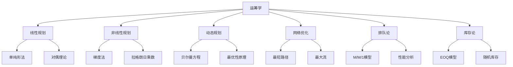
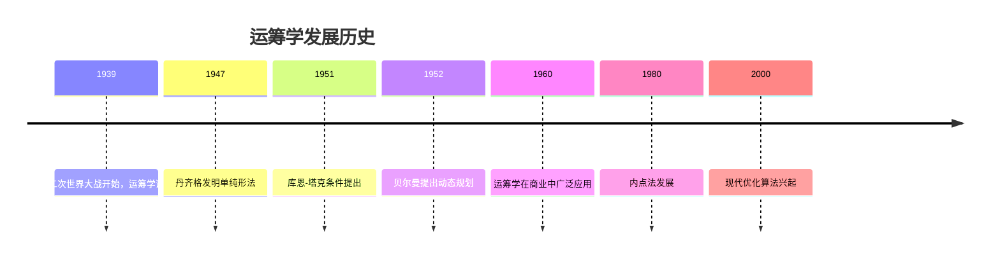
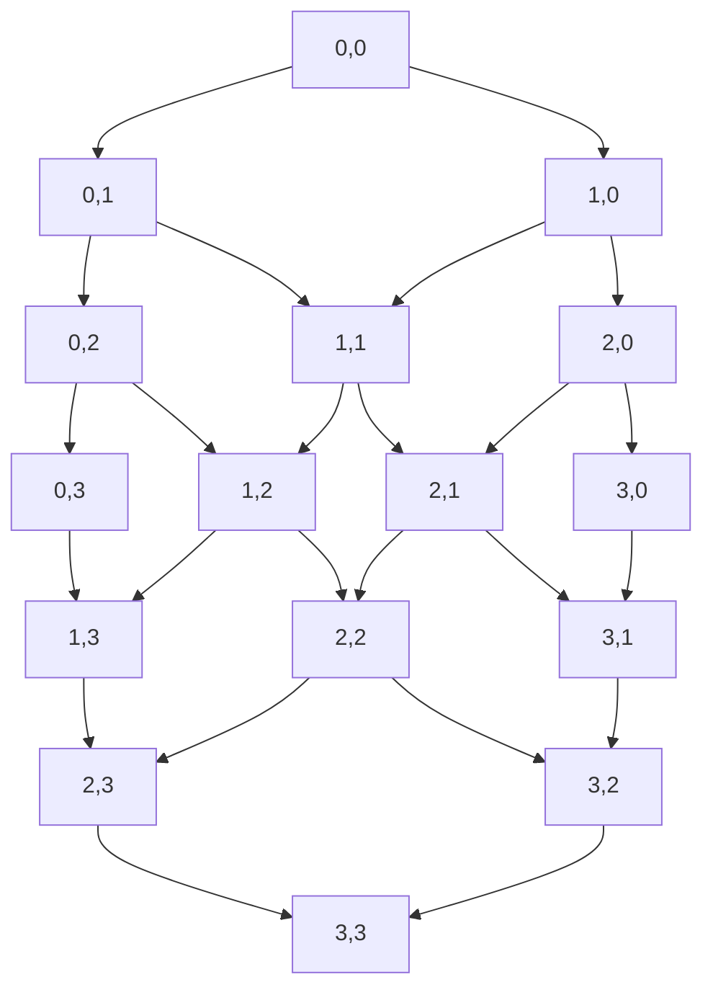
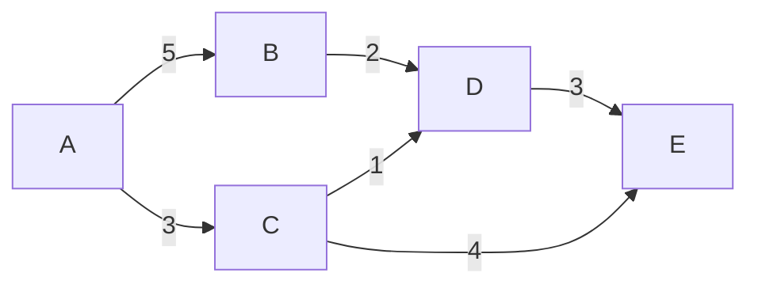
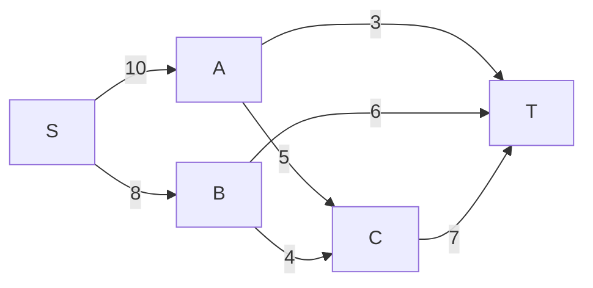
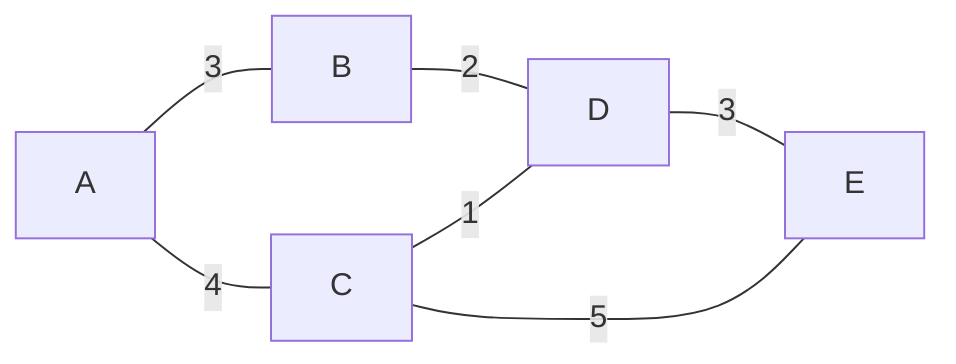
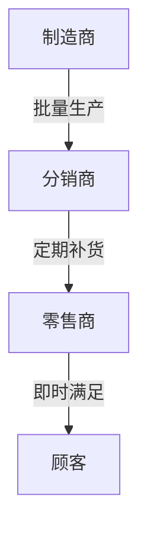

# 3. 运筹学 / Operations Research

**主题编号**: B.12.03
**创建日期**: 2025年11月21日
**最后更新**: 2025年11月21日

---

## 目录

- [3. 运筹学 / Operations Research](#3-运筹学--operations-research)
  - [目录](#目录)
  - [3.1 概述 / Overview (编号: B.12.03.01)](#31-概述--overview-编号-b120301)
    - [3.1.1 核心概念](#311-核心概念)
    - [3.1.2 历史发展](#312-历史发展)
  - [3.2 线性规划 / Linear Programming (编号: B.12.03.02)](#32-线性规划--linear-programming-编号-b120302)
    - [3.2.1 基本概念](#321-基本概念)
    - [实例表征 / Instance Representation](#实例表征--instance-representation)
      - [实例1: 线性规划基本实例 / Basic Linear Programming Examples](#实例1-线性规划基本实例--basic-linear-programming-examples)
      - [实例2: 单纯形法求解实例 / Simplex Method Examples](#实例2-单纯形法求解实例--simplex-method-examples)
      - [实例3: 对偶理论实例 / Duality Theory Examples](#实例3-对偶理论实例--duality-theory-examples)
      - [实例4: 非线性规划实例 / Nonlinear Programming Examples](#实例4-非线性规划实例--nonlinear-programming-examples)
    - [3.2.2 单纯形法](#322-单纯形法)
    - [3.2.3 对偶理论](#323-对偶理论)
  - [3.3 非线性规划 / Nonlinear Programming (编号: B.12.03.03)](#33-非线性规划--nonlinear-programming-编号-b120303)
    - [3.3.1 无约束优化](#331-无约束优化)
    - [3.3.2 约束优化](#332-约束优化)
    - [3.3.3 拉格朗日乘数法](#333-拉格朗日乘数法)
  - [3.4 动态规划 / Dynamic Programming (编号: B.12.03.04)](#34-动态规划--dynamic-programming-编号-b120304)
    - [3.4.1 最优性原理](#341-最优性原理)
    - [3.4.2 贝尔曼方程](#342-贝尔曼方程)
    - [3.4.3 应用实例](#343-应用实例)
    - [1实例表征 / Instance Representation](#1实例表征--instance-representation)
      - [实例1: 动态规划基本实例 / Basic Dynamic Programming Examples](#实例1-动态规划基本实例--basic-dynamic-programming-examples)
      - [实例2: 背包问题实例 / Knapsack Problem Examples](#实例2-背包问题实例--knapsack-problem-examples)
      - [实例3: 最长公共子序列实例 / Longest Common Subsequence Examples](#实例3-最长公共子序列实例--longest-common-subsequence-examples)
      - [实例4: 网络优化实例 / Network Optimization Examples](#实例4-网络优化实例--network-optimization-examples)
  - [3.5 网络优化 / Network Optimization (编号: B.12.03.05)](#35-网络优化--network-optimization-编号-b120305)
    - [3.5.1 最短路径问题](#351-最短路径问题)
    - [3.5.2 最大流问题](#352-最大流问题)
    - [3.5.3 最小生成树](#353-最小生成树)
  - [3.6 排队论 / Queueing Theory (编号: B.12.03.06)](#36-排队论--queueing-theory-编号-b120306)
    - [3.6.1 基本模型](#361-基本模型)
    - [3.6.2 性能分析](#362-性能分析)
    - [3.6.3 应用场景](#363-应用场景)
  - [3.7 库存论 / Inventory Theory (编号: B.12.03.07)](#37-库存论--inventory-theory-编号-b120307)
    - [3.7.1 基本模型](#371-基本模型)
    - [3.7.2 最优策略](#372-最优策略)
    - [3.7.3 随机库存](#373-随机库存)
  - [3.8 形式化实现 / Formal Implementation (编号: B.12.03.08)](#38-形式化实现--formal-implementation-编号-b120308)
    - [3.8.1 Lean 4 实现](#381-lean-4-实现)
    - [3.8.2 Haskell 实现](#382-haskell-实现)
  - [3.9 总结 / Summary](#39-总结--summary)
    - [3.9.1 核心要点](#391-核心要点)
    - [3.9.2 知识关联](#392-知识关联)
    - [3.9.3 进一步学习](#393-进一步学习)
  - [12.8 应用案例 / Application Cases](#128-应用案例--application-cases)
    - [12.8.1 物流与供应链管理 / Logistics and Supply Chain Management](#1281-物流与供应链管理--logistics-and-supply-chain-management)
      - [配送路线优化 / Delivery Route Optimization](#配送路线优化--delivery-route-optimization)
      - [库存管理优化 / Inventory Management Optimization](#库存管理优化--inventory-management-optimization)
    - [12.8.2 生产计划与调度 / Production Planning and Scheduling](#1282-生产计划与调度--production-planning-and-scheduling)
      - [生产排程优化 / Production Scheduling Optimization](#生产排程优化--production-scheduling-optimization)
      - [人力资源调度 / Human Resource Scheduling](#人力资源调度--human-resource-scheduling)
    - [12.8.3 金融投资优化 / Financial Investment Optimization](#1283-金融投资优化--financial-investment-optimization)
      - [投资组合优化 / Portfolio Optimization](#投资组合优化--portfolio-optimization)
      - [期权定价与对冲 / Option Pricing and Hedging](#期权定价与对冲--option-pricing-and-hedging)
    - [12.8.4 交通网络优化 / Transportation Network Optimization](#1284-交通网络优化--transportation-network-optimization)
      - [公共交通规划 / Public Transportation Planning](#公共交通规划--public-transportation-planning)
      - [交通信号控制 / Traffic Signal Control](#交通信号控制--traffic-signal-control)
    - [12.8.5 能源系统优化 / Energy System Optimization](#1285-能源系统优化--energy-system-optimization)
      - [电力系统调度 / Power System Dispatch](#电力系统调度--power-system-dispatch)
      - [可再生能源规划 / Renewable Energy Planning](#可再生能源规划--renewable-energy-planning)

## 3.1 概述 / Overview (编号: B.12.03.01)

运筹学是应用数学的重要分支，研究如何通过数学方法优化决策过程。
它结合了数学、统计学、经济学和计算机科学，为复杂系统的优化提供了强大的工具。

### 3.1.1 核心概念



### 3.1.2 历史发展



## 3.2 线性规划 / Linear Programming (编号: B.12.03.02)

### 3.2.1 基本概念

**标准形式**:
$$
\begin{align}
\text{最大化} \quad & c^T x \\
\text{约束条件} \quad & Ax \leqq b \\
& x \geqq 0
\end{align}
$$

### 实例表征 / Instance Representation

#### 实例1: 线性规划基本实例 / Basic Linear Programming Examples

**概念**: 线性规划的标准形式和求解
**实例**:

- **生产计划问题**:
  - 目标：最大化利润 $Z = 3x_1 + 2x_2$
  - 约束：$2x_1 + x_2 \leqq 8$, $x_1 + 2x_2 \leqq 6$, $x_1, x_2 \geqq 0$
  - 解：$x_1 = 4, x_2 = 0, Z = 12$
- **运输问题**:
  - 目标：最小化运输成本
  - 约束：供应量、需求量平衡
  - 应用：物流配送优化
- **投资组合问题**:
  - 目标：最大化收益
  - 约束：风险控制、资金限制
  - 应用：金融投资决策

#### 实例2: 单纯形法求解实例 / Simplex Method Examples

**概念**: 单纯形法的计算过程
**实例**:

- **标准形式转换**:
  - 原问题：$\max Z = 3x_1 + 2x_2$
  - 约束：$2x_1 + x_2 \leqq 8$, $x_1 + 2x_2 \leqq 6$
  - 标准形式：$\max Z = 3x_1 + 2x_2 + 0s_1 + 0s_2$
  - 约束：$2x_1 + x_2 + s_1 = 8$, $x_1 + 2x_2 + s_2 = 6$
- **单纯形表计算**:
  - 初始基可行解：$s_1 = 8, s_2 = 6, x_1 = x_2 = 0$
  - 迭代过程：选择入基变量、出基变量
  - 最优解：$x_1 = 4, x_2 = 0, Z = 12$

#### 实例3: 对偶理论实例 / Duality Theory Examples

**概念**: 原问题与对偶问题的关系
**实例**:

- **原问题**:
  - $\max Z = 3x_1 + 2x_2$
  - $2x_1 + x_2 \leqq 8$, $x_1 + 2x_2 \leqq 6$, $x_1, x_2 \geqq 0$
- **对偶问题**:
  - $\min W = 8y_1 + 6y_2$
  - $2y_1 + y_2 \geqq 3$, $y_1 + 2y_2 \geqq 2$, $y_1, y_2 \geqq 0$
- **对偶性质**:
  - 弱对偶性：$Z \leqq W$
  - 强对偶性：最优值相等
  - 互补松弛性：$y_i(b_i - \sum a_{ij}x_j) = 0$

#### 实例4: 非线性规划实例 / Nonlinear Programming Examples

**概念**: 非线性优化问题的求解
**实例**:

- **二次规划问题**:
  - 目标：$\min f(x) = x_1^2 + x_2^2$
  - 约束：$x_1 + x_2 = 1$
  - 解：$x_1 = x_2 = 0.5$
- **拉格朗日乘数法**:
  - 拉格朗日函数：$L(x, \lambda) = x_1^2 + x_2^2 + \lambda(1 - x_1 - x_2)$
  - 必要条件：$\nabla L = 0$
  - 解得：$x_1 = x_2 = 0.5, \lambda = 1$

**实例 3.1** (生产计划问题)
某工厂生产两种产品，每种产品需要不同的资源：

- 产品A：需要2单位劳动力和3单位原材料，利润为5元
- 产品B：需要4单位劳动力和1单位原材料，利润为4元
- 可用资源：20单位劳动力，15单位原材料

**数学模型**:
$$
\begin{align}
\text{最大化} \quad & 5x_1 + 4x_2 \\
\text{约束条件} \quad & 2x_1 + 4x_2 \leqq 20 \\
& 3x_1 + x_2 \leqq 15 \\
& x_1, x_2 \geqq 0
\end{align}
$$

### 3.2.2 单纯形法

**算法步骤**:

1. **初始化**: 将问题转化为标准形式
2. **选择入基变量**: 选择最大正系数的非基变量
3. **选择出基变量**: 使用最小比值法则
4. **更新基**: 进行高斯消元
5. **重复**: 直到所有系数非正

**实例 3.2** (单纯形法求解)
求解上述生产计划问题：

**初始单纯形表**:

| 基变量 | $x_1$ | $x_2$ | $s_1$ | $s_2$ | 右端项 |
|--------|-------|-------|-------|-------|--------|
| $s_1$  | 2     | 4     | 1     | 0     | 20     |
| $s_2$  | 3     | 1     | 0     | 1     | 15     |
| $z$    | -5    | -4    | 0     | 0     | 0      |

**第一次迭代**:

- 入基变量：$x_1$ (系数-5最大)
- 出基变量：$s_2$ (比值15/3最小)

**更新后的表**:

| 基变量 | $x_1$ | $x_2$ | $s_1$ | $s_2$ | 右端项 |
|--------|-------|-------|-------|-------|--------|
| $s_1$  | 0     | 10/3  | 1     | -2/3  | 10     |
| $x_1$  | 1     | 1/3   | 0     | 1/3   | 5      |
| $z$    | 0     | -7/3  | 0     | 5/3   | 25     |

**最优解**: $x_1 = 5, x_2 = 0$，最大利润为25元。

### 3.2.3 对偶理论

**对偶问题**:

$$
\begin{align}
\text{最小化} \quad & b^T y \\
\text{约束条件} \quad & A^T y \geqq c \\
& y \geqq 0
\end{align}
$$

**对偶性质**:

1. **弱对偶性**: 对偶问题的任何可行解的目标值不小于原问题的任何可行解的目标值
2. **强对偶性**: 如果原问题和对偶问题都有有限最优解，则最优值相等
3. **互补松弛性**: 最优解满足互补松弛条件

## 3.3 非线性规划 / Nonlinear Programming (编号: B.12.03.03)

### 3.3.1 无约束优化

**梯度下降法**:
$$x_{k+1} = x_k - \alpha_k \nabla f(x_k)$$

**牛顿法**:
$$x_{k+1} = x_k - [\nabla^2 f(x_k)]^{-1} \nabla f(x_k)$$

**实例 3.3** (梯度下降法)
最小化函数 $f(x) = x^2 + 2x + 1$：

1. 计算梯度：$\nabla f(x) = 2x + 2$
2. 选择步长：$\alpha = 0.1$
3. 迭代公式：$x_{k+1} = x_k - 0.1(2x_k + 2)$

**迭代过程**:

- $x_0 = 0, f(x_0) = 1$
- $x_1 = 0 - 0.1(2) = -0.2, f(x_1) = 0.64$
- $x_2 = -0.2 - 0.1(1.6) = -0.36, f(x_2) = 0.41$
- ...

### 3.3.2 约束优化

**库恩-塔克条件**:
对于约束优化问题：
$$
\begin{align}
\text{最小化} \quad & f(x) \\
\text{约束条件} \quad & g_i(x) \leqq 0, \quad i = 1, \ldots, m \\
& h_j(x) = 0, \quad j = 1, \ldots, p
\end{align}
$$

库恩-塔克条件为：
$$
\begin{align}
\nabla f(x^*) + \sum_{i=1}^m \lambda_i \nabla g_i(x^*) + \sum_{j=1}^p \mu_j \nabla h_j(x^*) = 0 \\
\lambda_i g_i(x^*) = 0, \quad i = 1, \ldots, m \\
\lambda_i \geqq 0, \quad i = 1, \ldots, m
\end{align}
$$

### 3.3.3 拉格朗日乘数法

**拉格朗日函数**:
$$L(x, \lambda, \mu) = f(x) + \sum_{i=1}^m \lambda_i g_i(x) + \sum_{j=1}^p \mu_j h_j(x)$$

**实例 3.4** (拉格朗日乘数法)
在约束 $x + y = 1$ 下最小化 $f(x, y) = x^2 + y^2$：

1. 拉格朗日函数：$L(x, y, \lambda) = x^2 + y^2 + \lambda(1 - x - y)$
2. 偏导数：
   - $\frac{\partial L}{\partial x} = 2x - \lambda = 0$
   - $\frac{\partial L}{\partial y} = 2y - \lambda = 0$
   - $\frac{\partial L}{\partial \lambda} = 1 - x - y = 0$
3. 解得：$x = y = 0.5, \lambda = 1$

## 3.4 动态规划 / Dynamic Programming (编号: B.12.03.04)

### 3.4.1 最优性原理

**最优性原理**: 一个多阶段决策过程的最优策略具有这样的性质：无论初始状态和初始决策如何，其后的决策相对于由第一个决策所形成的状态来说，必定构成最优策略。

### 3.4.2 贝尔曼方程

**贝尔曼方程**:
$$V_t(s) = \max_{a \in A(s)} \leqft\{ r(s, a) + \sum_{s'} P(s'|s, a) V_{t+1}(s') \right\}$$

**实例 3.5** (最短路径问题)
在网格中从左上角到右下角的最短路径：



**动态规划求解**:

1. 定义状态：$V(i, j)$ 表示从 $(i, j)$ 到终点的最短距离
2. 边界条件：$V(3, 3) = 0$
3. 递推公式：$V(i, j) = \min\{V(i+1, j), V(i, j+1)\} + d(i, j)$

### 3.4.3 应用实例

**实例 3.6** (背包问题)
有 $n$ 个物品，第 $i$ 个物品的重量为 $w_i$，价值为 $v_i$，背包容量为 $W$。

**动态规划解法**:
$$dp[i][j] = \max(dp[i-1][j], dp[i-1][j-w_i] + v_i)$$

**实例 3.7** (最长公共子序列)
给定两个字符串 $X$ 和 $Y$，求它们的最长公共子序列。

**动态规划解法**:

$$
`dp[i][j]` = \begin{cases}
`dp[i-1][j-1]` + 1 & \text{if } X[i] = Y[j] \\
\max(`dp[i-1][j]`, `dp[i][j-1]`) & \text{otherwise}
\end{cases}
$$

### 1实例表征 / Instance Representation

#### 实例1: 动态规划基本实例 / Basic Dynamic Programming Examples

**概念**: 动态规划的基本思想和应用
**实例**:

- **斐波那契数列**:
  - 问题：计算第n个斐波那契数
  - 状态定义：$dp[i]$ 表示第i个斐波那契数
  - 递推公式：$dp[i] = dp[i-1] + dp[i-2]$
  - 边界条件：$dp[0] = 0, dp[1] = 1$
- **爬楼梯问题**:
  - 问题：n级楼梯，每次爬1或2级，有多少种方法
  - 状态定义：$dp[i]$ 表示爬到第i级的方法数
  - 递推公式：$dp[i] = dp[i-1] + dp[i-2]$
  - 边界条件：$dp[0] = 1, dp[1] = 1$

#### 实例2: 背包问题实例 / Knapsack Problem Examples

**概念**: 0-1背包问题的动态规划解法
**实例**:

- **问题描述**:
  - 物品：重量 $w = [2, 1, 3]$, 价值 $v = [4, 2, 3]$
  - 背包容量：$W = 4$
  - 目标：最大化总价值
- **动态规划解法**:
  - 状态定义：$dp[i][j]$ 表示前i个物品，容量j的最大价值
  - 递推公式：$dp[i][j] = \max(dp[i-1][j], dp[i-1][j-w_i] + v_i)$
  - 最优解：$dp[3][4] = 6$ (选择物品1和2)

#### 实例3: 最长公共子序列实例 / Longest Common Subsequence Examples

**概念**: 两个序列的最长公共子序列
**实例**:

- **问题描述**:
  - 序列A：$[1, 2, 3, 4, 5]$
  - 序列B：$[2, 4, 1, 3, 5]$
  - 目标：找到最长公共子序列
- **动态规划解法**:
  - 状态定义：$dp[i][j]$ 表示A[1..i]和B[1..j]的LCS长度
  - 递推公式：
    - 如果 $A[i] = B[j]$：$dp[i][j] = dp[i-1][j-1] + 1$
    - 否则：$dp[i][j] = \max(dp[i-1][j], dp[i][j-1])$
  - 最优解：LCS长度为3，子序列为$[2, 3, 5]$

#### 实例4: 网络优化实例 / Network Optimization Examples

**概念**: 网络中的优化问题
**实例**:

- **最短路径问题**:
  - 图：城市间的距离网络
  - 算法：Dijkstra算法
  - 应用：导航系统、物流配送
- **最大流问题**:
  - 网络：管道运输系统
  - 算法：Ford-Fulkerson算法
  - 应用：网络流量优化、供应链管理
- **最小生成树**:
  - 图：通信网络
  - 算法：Kruskal算法、Prim算法
  - 应用：网络设计、电路布线

---

## 3.5 网络优化 / Network Optimization (编号: B.12.03.05)

### 3.5.1 最短路径问题

**Dijkstra算法**:

```python
def dijkstra(graph, start):
    distances = {node: float('infinity') for node in graph}
    distances[start] = 0
    unvisited = set(graph.keys())

    while unvisited:
        current = min(unvisited, key=lambda node: distances[node])
        unvisited.remove(current)

        for neighbor, weight in graph[current].items():
            if neighbor in unvisited:
                new_distance = distances[current] + weight
                if new_distance < distances[neighbor]:
                    distances[neighbor] = new_distance

    return distances
```

**实例 3.8** (城市间距离)
求从城市A到其他城市的最短距离：



**求解过程**:

- 初始距离：$d(A) = 0, d(B) = d(C) = d(D) = d(E) = \infty$
- 选择A：$d(B) = 5, d(C) = 3$
- 选择C：$d(D) = 4, d(E) = 7$
- 选择B：$d(D) = 4$ (不变)
- 选择D：$d(E) = 7$ (不变)

### 3.5.2 最大流问题

**Ford-Fulkerson算法**:

1. 初始化流量为0
2. 在残量网络中寻找增广路径
3. 沿增广路径增加流量
4. 重复直到没有增广路径

**实例 3.9** (网络流量)
求从源点S到汇点T的最大流量：



**求解过程**:

1. 找到增广路径：S→A→T，流量为3
2. 找到增广路径：S→B→T，流量为6
3. 找到增广路径：S→A→C→T，流量为2
4. 找到增广路径：S→B→C→T，流量为4
5. 最大流量：3 + 6 + 2 + 4 = 15

### 3.5.3 最小生成树

**Kruskal算法**:

1. 将所有边按权重排序
2. 依次选择边，如果不会形成环则加入
3. 重复直到选择 $n-1$ 条边

**实例 3.10** (通信网络)
为5个城市建立通信网络，最小化总成本：



**求解过程**:

1. 选择边C-D，权重1
2. 选择边B-D，权重2
3. 选择边A-B，权重3
4. 选择边D-E，权重3
5. 最小生成树总权重：9

## 3.6 排队论 / Queueing Theory (编号: B.12.03.06)

### 3.6.1 基本模型

**M/M/1模型**:

- 到达过程：泊松分布，参数 $\lambda$
- 服务过程：指数分布，参数 $\mu$
- 服务台数：1个

**性能指标**:

- 平均等待时间：$W_q = \frac{\lambda}{\mu(\mu-\lambda)}$
- 平均系统时间：$W = \frac{1}{\mu-\lambda}$
- 平均队列长度：$L_q = \frac{\lambda^2}{\mu(\mu-\lambda)}$
- 平均系统长度：$L = \frac{\lambda}{\mu-\lambda}$

**实例 3.11** (银行服务)
某银行平均每小时到达10个客户，服务时间为3分钟。

**计算**:

- $\lambda = 10$ 客户/小时
- $\mu = 20$ 客户/小时
- $\rho = \lambda/\mu = 0.5$

**性能指标**:

- 平均等待时间：$W_q = \frac{10}{20(20-10)} = 0.05$ 小时 = 3分钟
- 平均系统时间：$W = \frac{1}{20-10} = 0.1$ 小时 = 6分钟
- 平均队列长度：$L_q = \frac{10^2}{20(20-10)} = 0.5$ 客户
- 平均系统长度：$L = \frac{10}{20-10} = 1$ 客户

### 3.6.2 性能分析

**Little公式**:
$$L = \lambda W$$

**实例 3.12** (Little公式验证)
对于M/M/1模型：

- $L = \frac{\lambda}{\mu-\lambda}$
- $W = \frac{1}{\mu-\lambda}$
- $L = \lambda \cdot \frac{1}{\mu-\lambda} = \frac{\lambda}{\mu-\lambda}$ ✓

### 3.6.3 应用场景

**实例 3.13** (呼叫中心设计)
某呼叫中心需要设计服务台数量：

- 平均每小时到达100个电话
- 平均服务时间为3分钟
- 目标：平均等待时间不超过1分钟

**分析**:

1. 单服务台：$W_q = \frac{100}{20(20-100)} = \infty$ (不稳定)
2. 多服务台：使用M/M/c模型
3. 计算所需服务台数：$c \geqq 6$

## 3.7 库存论 / Inventory Theory (编号: B.12.03.07)

### 3.7.1 基本模型

**经济订货量(EOQ)模型**:
$$\text{EOQ} = \sqrt{\frac{2KD}{h}}$$

其中：

- $K$：订货成本
- $D$：年需求量
- $h$：单位库存持有成本

**实例 3.14** (库存优化)
某公司年需求量为1000件，每次订货成本为100元，单位库存持有成本为2元/件。

**计算**:
$$\text{EOQ} = \sqrt{\frac{2 \times 100 \times 1000}{2}} = \sqrt{100000} = 316.23 \approx 316 \text{件}$$

**总成本**:

- 订货成本：$\frac{1000}{316} \times 100 = 316.46$ 元
- 库存持有成本：$\frac{316}{2} \times 2 = 316$ 元
- 总成本：632.46 元

### 3.7.2 最优策略

**实例 3.15** (多级库存)
某供应链包含制造商、分销商和零售商：



**优化策略**:

1. **制造商**: 经济生产批量
2. **分销商**: 考虑运输成本的EOQ
3. **零售商**: 考虑缺货成本的库存策略

### 3.7.3 随机库存

**实例 3.16** (随机需求)
某产品需求服从正态分布 $N(100, 20^2)$，服务水平为95%。

**安全库存计算**:

- 服务水平95%对应的z值为1.645
- 安全库存：$1.645 \times 20 = 32.9 \approx 33$ 件
- 再订货点：$100 + 33 = 133$ 件

## 3.8 形式化实现 / Formal Implementation (编号: B.12.03.08)

### 3.8.1 Lean 4 实现

```lean
-- 线性规划标准形式
structure LinearProgram where
  objective : Vector ℝ
  constraints : Matrix ℝ
  rhs : Vector ℝ
  lb : Vector ℝ
  ub : Vector ℝ

-- 单纯形法
def simplex (lp : LinearProgram) : Option (Vector ℝ) :=
  -- 实现单纯形算法
  sorry

-- 动态规划
def dynamicProgramming {α β : Type} [Fintype α] [Fintype β]
  (f : α → β → ℝ) (T : ℕ) : α → ℝ :=
  -- 实现动态规划
  sorry

-- 最短路径
def shortestPath (graph : Matrix ℝ) (start end : Fin n) : ℝ :=
  -- 实现Dijkstra算法
  sorry
```

### 3.8.2 Haskell 实现

```haskell
-- 线性规划
data LinearProgram = LinearProgram
  { objective :: [Double]
  , constraints :: [[Double]]
  , rhs :: [Double]
  , lb :: [Double]
  , ub :: [Double]
  }

-- 单纯形法
simplex :: LinearProgram -> Maybe [Double]
simplex lp = do
  -- 实现单纯形算法
  return []

-- 动态规划
dynamicProgramming :: (Eq a, Ord a) =>
  (a -> b -> Double) -> Int -> a -> Double
dynamicProgramming f t s = dp t s
  where
    dp 0 s = 0
    dp t s = maximum [f s a + dp (t-1) (transition s a) | a <- actions s]

-- 最短路径
shortestPath :: [[Double]] -> Int -> Int -> Double
shortestPath graph start end = dijkstra graph start !! end
  where
    dijkstra graph start =
      let distances = replicate (length graph) infinity
          distances' = updateAt start 0 distances
      in dijkstra' graph distances' [start..length graph - 1]
```

## 3.9 总结 / Summary

### 3.9.1 核心要点

1. **线性规划** 为资源分配提供了强大的优化工具
2. **非线性规划** 处理复杂的优化问题
3. **动态规划** 解决多阶段决策问题
4. **网络优化** 处理图论中的优化问题
5. **排队论** 分析服务系统的性能
6. **库存论** 优化供应链管理

### 3.9.2 知识关联

- 与[优化理论](../08-计算数学/02-优化理论.md)的算法理论相联系
- 与[概率论](01-概率论.md)的随机过程相呼应
- 与[统计学](02-统计学.md)的数据分析方法相结合
- 与[机器学习数学基础](06-机器学习数学基础.md)的优化算法相呼应

### 3.9.3 进一步学习

1. **高级主题**:
   - 随机优化
   - 多目标优化
   - 鲁棒优化

2. **应用领域**:
   - 金融工程
   - 物流管理
   - 生产调度

---

**相关文档**:

- [优化理论](../08-计算数学/02-优化理论.md)
- [概率论](01-概率论.md)
- [统计学](02-统计学.md)
- [机器学习数学基础](06-机器学习数学基础.md)

## 12.8 应用案例 / Application Cases

### 12.8.1 物流与供应链管理 / Logistics and Supply Chain Management

#### 配送路线优化 / Delivery Route Optimization

**应用场景**: 快递、外卖、物流配送的路径规划
**优化方法**: 车辆路径问题（VRP）、旅行商问题（TSP）
**具体实例**:

- **问题**: 为50个客户点设计最优配送路线，最小化总行驶距离
- **约束条件**: 车辆载重限制、时间窗口、客户优先级
- **数学模型**:
  $$\min \sum_{i=0}^n \sum_{j=0}^n c_{ij} x_{ij}$$
  $$\text{s.t.} \sum_{j=1}^n x_{0j} = K$$
  $$\sum_{i=0}^n x_{ih} - \sum_{j=0}^n x_{hj} = 0, \quad h = 1,\ldots,n$$
- **求解方法**: 遗传算法、模拟退火、蚁群算法
- **实际应用**: 顺丰、京东、美团等物流配送优化

#### 库存管理优化 / Inventory Management Optimization

**应用场景**: 零售、制造、电商的库存控制
**优化方法**: 经济订货量模型、动态规划、随机库存模型
**具体实例**:

- **问题**: 确定最优订货量和订货时机，平衡库存成本与缺货成本
- **成本函数**: 总成本 = 订货成本 + 持有成本 + 缺货成本
- **EOQ模型**: $Q^* = \sqrt{\frac{2DS}{H}}$，其中 $D$ 是年需求量，$S$ 是订货成本，$H$ 是单位持有成本
- **安全库存**: 考虑需求不确定性的缓冲库存
- **实际应用**: 沃尔玛、亚马逊、制造业供应链

### 12.8.2 生产计划与调度 / Production Planning and Scheduling

#### 生产排程优化 / Production Scheduling Optimization

**应用场景**: 制造业的生产计划安排
**优化方法**: 作业车间调度、流水线平衡、资源分配
**具体实例**:

- **问题**: 在有限机器资源下安排生产任务，最小化完工时间
- **约束条件**: 机器容量、任务优先级、工艺路线
- **数学模型**:
  $$\min C_{max} = \max_{i,j} C_{ij}$$
  $$\text{s.t.} \sum_{j=1}^n x_{ijk} \leqq 1, \quad \forall i,k$$
- **启发式算法**: 最短加工时间优先（SPT）、最早截止时间优先（EDD）
- **实际应用**: 汽车制造、电子产品生产、化工生产

#### 人力资源调度 / Human Resource Scheduling

**应用场景**: 医院、航空公司、服务业的排班管理
**优化方法**: 整数规划、约束满足问题、多目标优化
**具体实例**:

- **问题**: 为医院护士安排最优排班，满足工作需求和员工偏好
- **约束条件**: 最低人员配置、连续工作时间限制、技能匹配
- **目标函数**: 最小化总成本，最大化员工满意度
- **求解方法**: 列生成、分支定界、元启发式算法
- **实际应用**: 医院管理、航空调度、客服中心

### 12.8.3 金融投资优化 / Financial Investment Optimization

#### 投资组合优化 / Portfolio Optimization

**应用场景**: 基金、银行、保险公司的资产配置
**优化方法**: 马科维茨均值-方差模型、风险平价、Black-Litterman模型
**具体实例**:

- **问题**: 在给定风险水平下最大化投资组合期望收益
- **数学模型**:
  $$\max \sum_{i=1}^n w_i \mu_i$$
  $$\text{s.t.} \sum_{i=1}^n \sum_{j=1}^n w_i w_j \sigma_{ij} \leqq \sigma^2_{target}$$
  $$\sum_{i=1}^n w_i = 1, \quad w_i \geqq 0$$
- **风险度量**: 方差、VaR、CVaR、最大回撤
- **实际应用**: 基金管理、养老金投资、银行资产管理

#### 期权定价与对冲 / Option Pricing and Hedging

**应用场景**: 金融衍生品交易与风险管理
**优化方法**: 动态规划、随机控制、蒙特卡洛模拟
**具体实例**:

- **问题**: 计算期权价格并设计最优对冲策略
- **定价模型**: Black-Scholes模型、二叉树模型、蒙特卡洛方法
- **对冲策略**: Delta对冲、Gamma对冲、动态对冲
- **风险控制**: 最小化对冲成本，控制风险敞口
- **实际应用**: 投资银行、对冲基金、期权交易所

### 12.8.4 交通网络优化 / Transportation Network Optimization

#### 公共交通规划 / Public Transportation Planning

**应用场景**: 城市公交、地铁、共享单车的路线设计
**优化方法**: 网络流、多目标规划、动态规划
**具体实例**:

- **问题**: 设计公交路线网络，最大化乘客便利性和运营效率
- **目标函数**: 最小化总运营成本，最大化乘客满意度
- **约束条件**: 车辆数量、站点容量、时间间隔
- **网络模型**: 图论模型、流量分配、路径选择
- **实际应用**: 北京地铁、上海公交、共享出行平台

#### 交通信号控制 / Traffic Signal Control

**应用场景**: 城市交通信号灯的智能控制
**优化方法**: 动态规划、强化学习、自适应控制
**具体实例**:

- **问题**: 优化交叉路口信号配时，减少车辆延误
- **控制变量**: 绿灯时间、相位顺序、周期长度
- **性能指标**: 平均延误、排队长度、通行能力
- **实时优化**: 基于交通流量的自适应控制
- **实际应用**: 智能交通系统、城市交通管理

### 12.8.5 能源系统优化 / Energy System Optimization

#### 电力系统调度 / Power System Dispatch

**应用场景**: 电网运行、发电厂调度、新能源并网
**优化方法**: 线性规划、混合整数规划、随机规划
**具体实例**:

- **问题**: 在满足电力需求的前提下最小化发电成本
- **约束条件**: 发电机组容量、爬坡率、最小运行时间
- **目标函数**: 最小化总发电成本
- **不确定性**: 负荷预测误差、新能源出力波动
- **实际应用**: 国家电网、发电集团、新能源运营商

#### 可再生能源规划 / Renewable Energy Planning

**应用场景**: 风电场、光伏电站的选址和容量规划
**优化方法**: 多目标规划、随机规划、鲁棒优化
**具体实例**:

- **问题**: 确定风电场最优位置和装机容量
- **目标函数**: 最大化发电量，最小化投资成本
- **约束条件**: 土地可用性、电网接入能力、环境影响
- **不确定性**: 风速预测、设备故障、政策变化
- **实际应用**: 风电开发、光伏项目、储能系统

---

**应用案例状态**: 涵盖物流、生产、金融、交通、能源等主要领域
**案例质量**: 理论联系实际 + 优化方法明确 + 应用价值突出
**扩展方向**: 可继续添加更多行业和新兴技术应用案例
