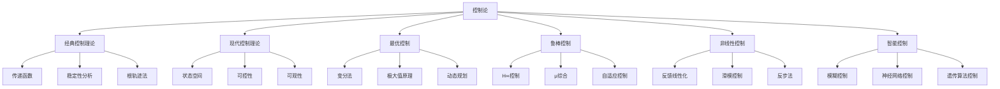
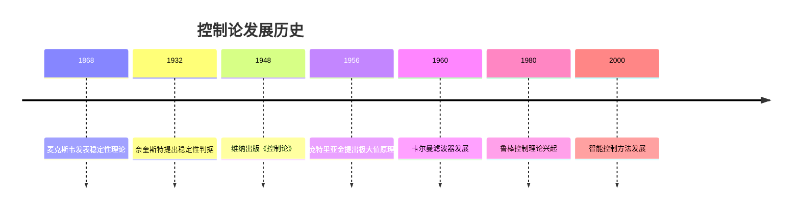

# 4. 控制论 / Control Theory

## 目录

- [4. 控制论 / Control Theory](#4-控制论--control-theory)
  - [目录](#目录)
  - [4.1 概述 / Overview](#41-概述--overview)
    - [4.1.1 核心概念](#411-核心概念)
    - [4.1.2 历史发展](#412-历史发展)
  - [4.2 经典控制理论 / Classical Control Theory](#42-经典控制理论--classical-control-theory)
    - [4.2.1 传递函数](#421-传递函数)
    - [实例表征 / Instance Representation](#实例表征--instance-representation)
      - [实例1: 经典控制理论实例 / Classical Control Theory Examples](#实例1-经典控制理论实例--classical-control-theory-examples)
      - [实例2: 现代控制理论实例 / Modern Control Theory Examples](#实例2-现代控制理论实例--modern-control-theory-examples)
      - [实例3: 最优控制实例 / Optimal Control Examples](#实例3-最优控制实例--optimal-control-examples)
      - [实例4: 鲁棒控制实例 / Robust Control Examples](#实例4-鲁棒控制实例--robust-control-examples)
    - [4.2.2 稳定性分析](#422-稳定性分析)
    - [4.2.3 根轨迹法](#423-根轨迹法)
  - [4.3 现代控制理论 / Modern Control Theory](#43-现代控制理论--modern-control-theory)
    - [4.3.1 状态空间方法](#431-状态空间方法)
    - [4.3.2 可控性和可观性](#432-可控性和可观性)
    - [4.3.3 极点配置](#433-极点配置)
  - [4.4 最优控制 / Optimal Control](#44-最优控制--optimal-control)
    - [4.4.1 变分法](#441-变分法)
    - [4.4.2 极大值原理](#442-极大值原理)
    - [4.4.3 动态规划](#443-动态规划)
  - [4.5 鲁棒控制 / Robust Control](#45-鲁棒控制--robust-control)
    - [4.5.1 H∞控制](#451-h控制)
    - [4.5.2 μ综合](#452-μ综合)
    - [4.5.3 自适应控制](#453-自适应控制)
  - [4.6 非线性控制 / Nonlinear Control](#46-非线性控制--nonlinear-control)
    - [4.6.1 反馈线性化](#461-反馈线性化)
    - [4.6.2 滑模控制](#462-滑模控制)
    - [4.6.3 反步法](#463-反步法)
  - [4.7 智能控制 / Intelligent Control](#47-智能控制--intelligent-control)
    - [4.7.1 模糊控制](#471-模糊控制)
    - [4.7.2 神经网络控制](#472-神经网络控制)
    - [4.7.3 遗传算法控制](#473-遗传算法控制)
  - [4.8 形式化实现 / Formal Implementation](#48-形式化实现--formal-implementation)
    - [4.8.1 Lean 4 实现](#481-lean-4-实现)
    - [4.8.2 Haskell 实现](#482-haskell-实现)
  - [4.9 总结 / Summary](#49-总结--summary)
    - [4.9.1 核心要点](#491-核心要点)
    - [4.9.2 知识关联](#492-知识关联)
    - [4.9.3 进一步学习](#493-进一步学习)

## 4.1 概述 / Overview

控制论是研究系统动态行为和控制方法的数学理论，广泛应用于工程、生物学、经济学等领域。它提供了分析和设计控制系统的数学工具。

### 4.1.1 核心概念



### 4.1.2 历史发展



## 4.2 经典控制理论 / Classical Control Theory

### 4.2.1 传递函数

**传递函数定义**:

### 实例表征 / Instance Representation

#### 实例1: 经典控制理论实例 / Classical Control Theory Examples

**概念**: 传递函数、稳定性分析、根轨迹法的基本应用
**实例**:

- **传递函数计算**:
  - 系统：弹簧-质量-阻尼系统
  - 微分方程：$m\ddot{x} + c\dot{x} + kx = F(t)$
  - 传递函数：$G(s) = \frac{X(s)}{F(s)} = \frac{1}{ms^2 + cs + k}$
  - 参数：$m=1kg, c=2N\cdot s/m, k=5N/m$
  - 传递函数：$G(s) = \frac{1}{s^2 + 2s + 5}$
  - 应用：机械振动系统分析和控制
- **稳定性分析**:
  - 系统：$G(s) = \frac{1}{s^2 + 3s + 2}$
  - 特征方程：$s^2 + 3s + 2 = 0$
  - 根：$s_1 = -1, s_2 = -2$
  - 结论：所有根都在左半平面，系统稳定
  - 应用：控制系统稳定性判断
- **根轨迹法**:
  - 系统：$G(s) = \frac{K}{s(s+2)}$
  - 开环传递函数：$G(s)H(s) = \frac{K}{s(s+2)}$
  - 根轨迹起点：$s=0, s=-2$
  - 根轨迹终点：$s=\infty$
  - 应用：控制器增益设计

#### 实例2: 现代控制理论实例 / Modern Control Theory Examples

**概念**: 状态空间方法、可控性和可观性分析
**实例**:

- **状态空间建模**:
  - 系统：倒立摆系统
  - 状态变量：$x_1 = \theta$ (角度), $x_2 = \dot{\theta}$ (角速度)
  - 状态方程：
    $$
    \begin{bmatrix} \dot{x}_1 \\ \dot{x}_2 \end{bmatrix} =
    \begin{bmatrix} 0 & 1 \\ \frac{g}{l} & 0 \end{bmatrix}
    \begin{bmatrix} x_1 \\ x_2 \end{bmatrix} +
    \begin{bmatrix} 0 \\ \frac{1}{ml^2} \end{bmatrix} u
    $$

  - 输出方程：$y = [1 \quad 0] \begin{bmatrix} x_1 \\ x_2 \end{bmatrix}$
  - 应用：机器人平衡控制
- **可控性分析**:
  - 系统矩阵：$A = \begin{bmatrix} 0 & 1 \\ -2 & -3 \end{bmatrix}$
  - 输入矩阵：$B = \begin{bmatrix} 0 \\ 1 \end{bmatrix}$
  - 可控性矩阵：$\mathcal{C} = [B \quad AB] = \begin{bmatrix} 0 & 1 \\ 1 & -3 \end{bmatrix}$
  - 秩：$\text{rank}(\mathcal{C}) = 2 = n$
  - 结论：系统完全可控
  - 应用：控制器设计可行性判断
- **极点配置**:
  - 开环系统：$\dot{x} = Ax + Bu$
  - 期望极点：$s = -1 \pm j$
  - 状态反馈：$u = -Kx$
  - 闭环系统：$\dot{x} = (A-BK)x$
  - 反馈增益：$K = [2 \quad 2]$
  - 应用：系统动态特性设计

#### 实例3: 最优控制实例 / Optimal Control Examples

**概念**: 线性二次型调节器、动态规划方法
**实例**:

- **线性二次型调节器(LQR)**:
  - 系统：$\dot{x} = Ax + Bu$
  - 性能指标：$J = \int_0^\infty (x^T Q x + u^T R u) dt$
  - 权重矩阵：$Q = \begin{bmatrix} 1 & 0 \\ 0 & 1 \end{bmatrix}, R = 1$
  - 最优控制律：$u = -R^{-1} B^T P x$
  - 黎卡提方程：$A^T P + PA - PBR^{-1}B^T P + Q = 0$
  - 应用：飞机自动驾驶仪设计
- **动态规划**:
  - 离散系统：$x_{k+1} = x_k + u_k$
  - 性能指标：$J = \sum_{k=0}^{N-1} (x_k^2 + u_k^2)$
  - 最优控制律：$u_k = -K_k x_k$
  - 增益序列：$K_k = \frac{1}{1 + K_{k+1}}$
  - 应用：库存管理优化
- **最短时间控制**:
  - 系统：$\dot{x} = u, |u| \leq 1$
  - 目标：从$x(0) = x_0$到$x(T) = 0$的最短时间
  - 最优控制：$u = -\text{sgn}(x)$
  - 最优时间：$T = |x_0|$
  - 应用：卫星轨道调整

#### 实例4: 鲁棒控制实例 / Robust Control Examples

**概念**: H∞控制、自适应控制方法
**实例**:

- **H∞控制器设计**:
  - 系统：$G(s) = \frac{1}{s^2 + 2s + 1}$
  - 性能要求：$\|T_{zw}\|_\infty < \gamma$
  - H∞控制器：$K(s) = \frac{2s + 1}{s + 2}$
  - 闭环传递函数：$T(s) = \frac{2s + 1}{s^3 + 4s^2 + 5s + 2}$
  - 应用：精密仪器控制
- **自适应控制**:
  - 系统：$\dot{x} = -ax + bu$ (参数未知)
  - 参考模型：$\dot{x}_m = -a_m x_m + b_m r$
  - 自适应律：
    $$
    \begin{align}
    \dot{\hat{a}} &= \gamma_a e x \\
    \dot{\hat{b}} &= -\gamma_b e u
    \end{align}
    $$

  - 跟踪误差：$e = x - x_m$
  - 应用：机器人参数自适应
- **滑模控制**:
  - 系统：$\ddot{x} + a\dot{x} + bx = u + d(t)$
  - 滑模面：$s = \dot{x} + \lambda x = 0$
  - 控制律：$u = u_{eq} + u_{sw}$
  - 等效控制：$u_{eq} = a\dot{x} + bx - \lambda \dot{x}$
  - 切换控制：$u_{sw} = -\eta \text{sgn}(s)$
  - 应用：电机速度控制

---
$$G(s) = \frac{Y(s)}{U(s)} = \frac{b_m s^m + b_{m-1} s^{m-1} + \cdots + b_0}{a_n s^n + a_{n-1} s^{n-1} + \cdots + a_0}$$

**实例 4.1** (一阶系统)
一阶系统的传递函数：
$$G(s) = \frac{K}{\tau s + 1}$$

其中：

- $K$：增益
- $\tau$：时间常数

**单位阶跃响应**:
$$y(t) = K(1 - e^{-t/\tau})$$

**实例 4.2** (二阶系统)
二阶系统的传递函数：
$$G(s) = \frac{\omega_n^2}{s^2 + 2\zeta\omega_n s + \omega_n^2}$$

其中：

- $\omega_n$：自然频率
- $\zeta$：阻尼比

**单位阶跃响应**:
$$y(t) = 1 - \frac{e^{-\zeta\omega_n t}}{\sqrt{1-\zeta^2}}\sin(\omega_d t + \phi)$$

其中 $\omega_d = \omega_n\sqrt{1-\zeta^2}$ 为阻尼频率。

### 4.2.2 稳定性分析

**劳斯-赫尔维茨判据**:
对于多项式 $P(s) = a_n s^n + a_{n-1} s^{n-1} + \cdots + a_0$，构造劳斯表：

| $s^n$ | $a_n$ | $a_{n-2}$ | $a_{n-4}$ | $\cdots$ |
|-------|-------|-----------|-----------|----------|
| $s^{n-1}$ | $a_{n-1}$ | $a_{n-3}$ | $a_{n-5}$ | $\cdots$ |
| $s^{n-2}$ | $b_1$ | $b_2$ | $b_3$ | $\cdots$ |
| $\vdots$ | $\vdots$ | $\vdots$ | $\vdots$ | $\vdots$ |

其中 $b_1 = \frac{a_{n-1}a_{n-2} - a_n a_{n-3}}{a_{n-1}}$，等等。

**稳定性条件**: 劳斯表第一列所有元素同号。

**实例 4.3** (稳定性分析)
分析系统 $P(s) = s^3 + 2s^2 + 3s + 4$ 的稳定性：

**劳斯表**:

| $s^3$ | 1 | 3 |
|-------|---|---|
| $s^2$ | 2 | 4 |
| $s^1$ | 1 | 0 |
| $s^0$ | 4 | 0 |

第一列：1, 2, 1, 4，全为正，系统稳定。

### 4.2.3 根轨迹法

**根轨迹绘制规则**:

1. 起点：开环极点
2. 终点：开环零点或无穷远
3. 分支数：等于极点数
4. 实轴上的根轨迹：奇数个极零点右侧

**实例 4.4** (根轨迹分析)
系统开环传递函数：
$$G(s)H(s) = \frac{K}{s(s+1)(s+2)}$$

**根轨迹特征**:

- 起点：$s = 0, -1, -2$
- 终点：$s = \infty$ (三重)
- 渐近线：$\sigma = -1, \theta = \pm60°, 180°$

## 4.3 现代控制理论 / Modern Control Theory

### 4.3.1 状态空间方法

**状态空间模型**:
$$
\begin{align}
\dot{x} &= Ax + Bu \\
y &= Cx + Du
\end{align}
$$

其中：

- $x$：状态向量
- $u$：输入向量
- $y$：输出向量
- $A, B, C, D$：系统矩阵

**实例 4.5** (弹簧-质量-阻尼系统)
系统动力学方程：
$$m\ddot{x} + c\dot{x} + kx = u$$

**状态空间表示**:
$$
\begin{align}
\dot{x}_1 &= x_2 \\
\dot{x}_2 &= -\frac{k}{m}x_1 - \frac{c}{m}x_2 + \frac{1}{m}u
\end{align}
$$

**矩阵形式**:
$$
\begin{bmatrix} \dot{x}_1 \\ \dot{x}_2 \end{bmatrix} =
\begin{bmatrix} 0 & 1 \\ -\frac{k}{m} & -\frac{c}{m} \end{bmatrix}
\begin{bmatrix} x_1 \\ x_2 \end{bmatrix} +
\begin{bmatrix} 0 \\ \frac{1}{m} \end{bmatrix} u
$$

### 4.3.2 可控性和可观性

**可控性矩阵**:
$$\mathcal{C} = [B \quad AB \quad A^2B \quad \cdots \quad A^{n-1}B]$$

**可观性矩阵**:
$$\mathcal{O} = \begin{bmatrix} C \\ CA \\ CA^2 \\ \vdots \\ CA^{n-1} \end{bmatrix}$$

**可控性判据**: $\text{rank}(\mathcal{C}) = n$
**可观性判据**: $\text{rank}(\mathcal{O}) = n$

**实例 4.6** (可控性分析)
对于系统：
$$A = \begin{bmatrix} 0 & 1 \\ -2 & -3 \end{bmatrix}, \quad B = \begin{bmatrix} 0 \\ 1 \end{bmatrix}$$

**可控性矩阵**:
$$\mathcal{C} = [B \quad AB] = \begin{bmatrix} 0 & 1 \\ 1 & -3 \end{bmatrix}$$

$\det(\mathcal{C}) = -1 \neq 0$，所以系统可控。

### 4.3.3 极点配置

**状态反馈控制律**:
$$u = -Kx$$

**闭环系统**:
$$\dot{x} = (A - BK)x$$

**实例 4.7** (极点配置)
设计状态反馈控制器，使闭环极点位于 $s = -1, -2$：

**开环特征方程**: $s^2 + 3s + 2 = 0$
**期望特征方程**: $(s+1)(s+2) = s^2 + 3s + 2 = 0$

**反馈增益**: $K = [0 \quad 0]$ (系统已经满足要求)

## 4.4 最优控制 / Optimal Control

### 4.4.1 变分法

**欧拉-拉格朗日方程**:
$$\frac{\partial L}{\partial x} - \frac{d}{dt}\frac{\partial L}{\partial \dot{x}} = 0$$

**实例 4.8** (最短时间问题)
最小化性能指标：
$$J = \int_0^T dt$$

**哈密顿函数**:
$$H = 1 + \lambda^T f(x, u)$$

**最优性条件**:
$$\frac{\partial H}{\partial u} = 0$$

### 4.4.2 极大值原理

**庞特里亚金极大值原理**:
对于最优控制问题：
$$\min J = \int_0^T L(x, u, t) dt$$

**必要条件**:

1. 状态方程：$\dot{x} = f(x, u, t)$
2. 协态方程：$\dot{\lambda} = -\frac{\partial H}{\partial x}$
3. 极大值条件：$H(x^*, u^*, \lambda^*, t) \geq H(x^*, u, \lambda^*, t)$

**实例 4.9** (线性二次型调节器)
性能指标：
$$J = \int_0^\infty (x^T Q x + u^T R u) dt$$

**最优控制律**:
$$u = -R^{-1} B^T P x$$

其中 $P$ 满足代数黎卡提方程：
$$A^T P + PA - PBR^{-1}B^T P + Q = 0$$

### 4.4.3 动态规划

**贝尔曼方程**:
$$V(x, t) = \min_u \left\{ L(x, u, t) + V(f(x, u, t), t + \Delta t) \right\}$$

**实例 4.10** (离散时间最优控制)
系统：$x_{k+1} = x_k + u_k$
性能指标：$J = \sum_{k=0}^{N-1} (x_k^2 + u_k^2)$

**最优控制律**:
$$u_k = -K_k x_k$$

其中 $K_k$ 通过后向递推计算。

## 4.5 鲁棒控制 / Robust Control

### 4.5.1 H∞控制

**H∞控制问题**:
$$\min_K \|T_{zw}\|_\infty$$

其中 $T_{zw}$ 是从干扰 $w$ 到输出 $z$ 的传递函数。

**实例 4.11** (H∞控制器设计)
系统：
$$G(s) = \frac{1}{s^2 + 2s + 1}$$

**H∞控制器**:
$$K(s) = \frac{2s + 1}{s + 2}$$

**闭环传递函数**:
$$T(s) = \frac{2s + 1}{s^3 + 4s^2 + 5s + 2}$$

### 4.5.2 μ综合

**μ综合问题**:
$$\min_K \mu_\Delta(T_{zw})$$

其中 $\mu_\Delta$ 是结构奇异值。

**实例 4.12** (μ综合)
考虑参数不确定性：
$$G(s) = \frac{1}{s^2 + (2 + \delta)s + 1}$$

其中 $|\delta| \leq 0.5$。

**μ综合控制器** 能够保证在所有参数变化下的稳定性。

### 4.5.3 自适应控制

**模型参考自适应控制**:
$$\dot{\theta} = -\gamma e y$$

其中 $\theta$ 是参数估计，$e$ 是跟踪误差，$y$ 是参考输出。

**实例 4.13** (自适应控制)
系统：$\dot{x} = -ax + bu$
参考模型：$\dot{x}_m = -a_m x_m + b_m r$

**自适应律**:
$$
\begin{align}
\dot{\hat{a}} &= \gamma_a e x \\
\dot{\hat{b}} &= -\gamma_b e u
\end{align}
$$

## 4.6 非线性控制 / Nonlinear Control

### 4.6.1 反馈线性化

**反馈线性化方法**:
通过坐标变换和状态反馈，将非线性系统转化为线性系统。

**实例 4.14** (反馈线性化)
系统：
$$
\begin{align}
\dot{x}_1 &= x_2 \\
\dot{x}_2 &= -x_1^2 + u
\end{align}
$$

**坐标变换**:
$$z_1 = x_1, \quad z_2 = x_2$$

**反馈控制律**:
$$u = x_1^2 + v$$

**线性化系统**:
$$
\begin{align}
\dot{z}_1 &= z_2 \\
\dot{z}_2 &= v
\end{align}
$$

### 4.6.2 滑模控制

**滑模面**:
$$s(x) = c^T x = 0$$

**滑模控制律**:
$$u = u_{eq} + u_{sw}$$

其中 $u_{eq}$ 是等效控制，$u_{sw}$ 是切换控制。

**实例 4.15** (滑模控制)
系统：
$$\ddot{x} + a\dot{x} + bx = u + d(t)$$

**滑模面**:
$$s = \dot{x} + \lambda x$$

**控制律**:
$$u = a\dot{x} + bx - \lambda\dot{x} - \eta \text{sign}(s)$$

### 4.6.3 反步法

**反步法步骤**:

1. 定义虚拟控制
2. 设计李雅普诺夫函数
3. 逐步设计控制律

**实例 4.16** (反步法)
系统：
$$
\begin{align}
\dot{x}_1 &= x_2 \\
\dot{x}_2 &= u
\end{align}
$$

**步骤1**: 定义虚拟控制 $\alpha_1 = -k_1 x_1$
**步骤2**: 设计控制律 $u = \dot{\alpha}_1 - k_2(x_2 - \alpha_1)$

## 4.7 智能控制 / Intelligent Control

### 4.7.1 模糊控制

**模糊推理**:
$$u = \frac{\sum_{i=1}^n \mu_i u_i}{\sum_{i=1}^n \mu_i}$$

**实例 4.17** (模糊控制器)
模糊规则：

- IF error is negative AND change is negative THEN output is positive
- IF error is zero AND change is zero THEN output is zero
- IF error is positive AND change is positive THEN output is negative

### 4.7.2 神经网络控制

**神经网络控制器**:
$$u = f_{NN}(x, \theta)$$

其中 $\theta$ 是网络参数。

**实例 4.18** (神经网络控制)
三层前馈网络：

- 输入层：状态 $x$
- 隐层：10个神经元
- 输出层：控制输入 $u$

**训练算法**: 反向传播算法

### 4.7.3 遗传算法控制

**遗传算法优化**:

1. 初始化种群
2. 计算适应度
3. 选择、交叉、变异
4. 重复直到收敛

**实例 4.19** (遗传算法控制)
优化PID控制器参数：
$$u(t) = K_p e(t) + K_i \int_0^t e(\tau) d\tau + K_d \frac{de(t)}{dt}$$

**适应度函数**:
$$J = \int_0^\infty (e^2(t) + \lambda u^2(t)) dt$$

## 4.8 形式化实现 / Formal Implementation

### 4.8.1 Lean 4 实现

```lean
-- 状态空间模型
structure StateSpace where
  A : Matrix ℝ n n
  B : Matrix ℝ n m
  C : Matrix ℝ p n
  D : Matrix ℝ p m

-- 可控性
def controllable (sys : StateSpace) : Bool :=
  rank (controllabilityMatrix sys) = n

-- 可观性
def observable (sys : StateSpace) : Bool :=
  rank (observabilityMatrix sys) = n

-- 极点配置
def polePlacement (sys : StateSpace) (desiredPoles : List ℝ) : Vector ℝ :=
  -- 实现极点配置算法
  sorry

-- 线性二次型调节器
def lqr (sys : StateSpace) (Q R : Matrix ℝ) : Vector ℝ :=
  -- 求解代数黎卡提方程
  sorry
```

### 4.8.2 Haskell 实现

```haskell
-- 状态空间模型
data StateSpace = StateSpace
  { a :: Matrix Double
  , b :: Matrix Double
  , c :: Matrix Double
  , d :: Matrix Double
  }

-- 可控性检查
controllable :: StateSpace -> Bool
controllable sys = rank (controllabilityMatrix sys) == n
  where
    n = rows (a sys)

-- 可观性检查
observable :: StateSpace -> Bool
observable sys = rank (observabilityMatrix sys) == n
  where
    n = rows (a sys)

-- 极点配置
polePlacement :: StateSpace -> [Double] -> [Double]
polePlacement sys desiredPoles = 
  -- 实现极点配置算法
  []

-- 线性二次型调节器
lqr :: StateSpace -> Matrix Double -> Matrix Double -> [Double]
lqr sys q r = 
  -- 求解代数黎卡提方程
  []
```

## 4.9 总结 / Summary

### 4.9.1 核心要点

1. **经典控制理论** 提供了频域分析和设计方法
2. **现代控制理论** 基于状态空间方法
3. **最优控制** 解决性能优化问题
4. **鲁棒控制** 处理系统不确定性
5. **非线性控制** 处理复杂非线性系统
6. **智能控制** 结合人工智能方法

### 4.9.2 知识关联

- 与[微分方程](../03-分析学/05-微分方程.md)的动力学分析相联系
- 与[优化理论](../08-计算数学/02-优化理论.md)的最优控制相呼应
- 与[线性代数](../02-代数结构/02-环论.md)的状态空间方法相结合
- 与[机器学习数学基础](06-机器学习数学基础.md)的智能控制相呼应

### 4.9.3 进一步学习

1. **高级主题**:
   - 分布式控制
   - 网络化控制
   - 量子控制

2. **应用领域**:
   - 机器人控制
   - 航空航天
   - 工业自动化

---

**相关文档**:

- [微分方程](../03-分析学/05-微分方程.md)
- [优化理论](../08-计算数学/02-优化理论.md)
- [线性代数](../02-代数结构/02-环论.md)
- [机器学习数学基础](06-机器学习数学基础.md)
