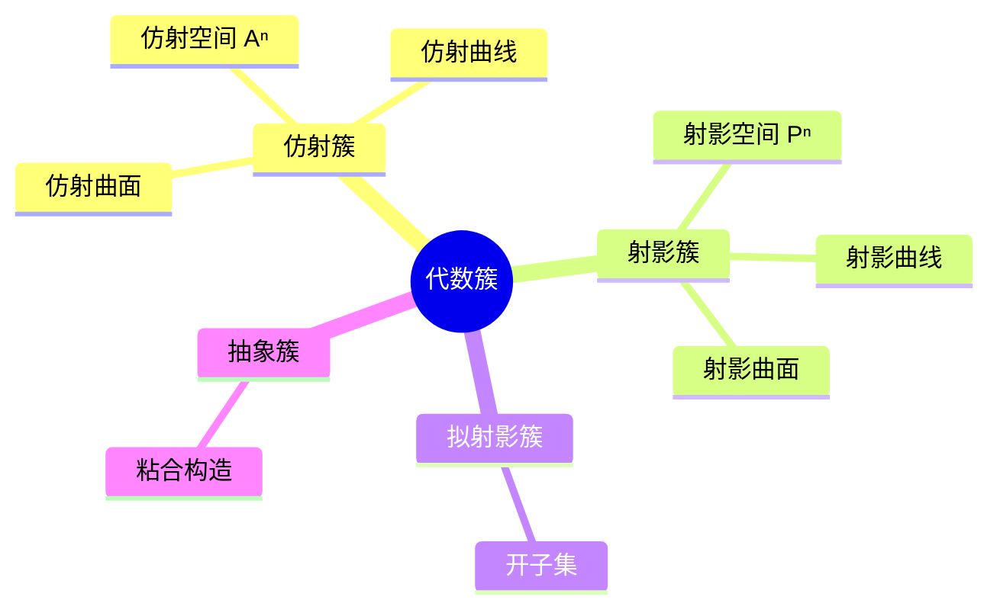

# 仿射簇与Zariski拓扑 - 深度版

**主题**: 代数几何基础 - 仿射代数簇
**难度**: ⭐⭐⭐⭐ (高级)
**先修知识**: 交换代数、多项式环、理想理论

---

## 目录

1. [概念深度解析](#1-概念深度解析)
   - 1.1 几何直观
   - 1.2 形式定义
   - 1.3 代数表述
2. [属性与关系](#2-属性与关系)
   - 2.1 核心定理
   - 2.2 完整证明
   - 2.3 层次结构
3. [示例与习题](#3-示例与习题)
4. [形式化实现](#4-形式化实现)
5. [应用与拓展](#5-应用与拓展)
6. [思维表征](#6-思维表征)

---

## 1. 概念深度解析

### 1.1 几何直观

**仿射簇**是多项式方程组在仿射空间中的零点集合。几何上，它们是"代数定义的"几何对象：

- **仿射直线**: $V(x) \subset \mathbb{A}^2$ 是 $y$ 轴
- **圆**: $V(x^2 + y^2 - 1) \subset \mathbb{A}^2$ 是单位圆
- **扭三次曲线**: $V(y - x^2, z - x^3) \subset \mathbb{A}^3$

**Zariski拓扑**是一种"粗"拓扑：闭集由代数方程定义。这与通常的欧氏拓扑截然不同：

- Zariski开集"很大"（除非空外都稠密）
- 两个非空开集必相交
- 反映了代数簇的刚性

### 1.2 形式定义

**定义 1.1** (仿射空间 / Affine Space)
设 $k$ 为域，$n \geq 0$，**$n$ 维仿射空间**定义为：
$$\mathbb{A}_k^n := k^n = \{(a_1, \ldots, a_n) : a_i \in k\}$$

当 $k$ 明确时，简记为 $\mathbb{A}^n$。

**定义 1.2** (仿射代数集 / Affine Algebraic Set)
设 $S \subseteq k[x_1, \ldots, x_n]$ 为多项式集合，定义：
$$V(S) := \{P \in \mathbb{A}^n : f(P) = 0, \forall f \in S\}$$

子集 $X \subseteq \mathbb{A}^n$ 称为**仿射代数集**，若 $X = V(S)$ 对某 $S$ 成立。

**定义 1.3** (Zariski拓扑 / Zariski Topology)
在 $\mathbb{A}^n$ 上，以所有仿射代数集为闭集定义的拓扑称为**Zariski拓扑**。

开集形如 $D(f) = \mathbb{A}^n \setminus V(f) = \{P : f(P) \neq 0\}$，称为**主开集**。

### 1.3 代数表述

**Hilbert基定理**保证有限生成：

**定理 1.1** (Hilbert Basis Theorem)
$k[x_1, \ldots, x_n]$ 是Noether环。因此每个仿射代数集可表为 $V(f_1, \ldots, f_m)$。

**理想与代数集的对应**（Hilbert零点定理的核心）：

对 $X \subseteq \mathbb{A}^n$，定义**理想**：
$$I(X) := \{f \in k[x_1, \ldots, x_n] : f(P) = 0, \forall P \in X\}$$

**命题 1.2**
(1) $S_1 \subseteq S_2 \Rightarrow V(S_2) \subseteq V(S_1)$
(2) $X_1 \subseteq X_2 \Rightarrow I(X_2) \subseteq I(X_1)$
(3) $V(I(X)) = \overline{X}$（Zariski闭包）
(4) $I(V(\mathfrak{a})) = \sqrt{\mathfrak{a}}$（当 $k$ 代数闭时，Hilbert零点定理）

---

## 2. 属性与关系

### 2.1 核心定理

**定理 2.1** (Hilbert Nullstellensatz / 希尔伯特零点定理)
设 $k$ 是代数闭域，$\mathfrak{a} \subseteq k[x_1, \ldots, x_n]$ 为理想，则：
$$I(V(\mathfrak{a})) = \sqrt{\mathfrak{a}}$$

特别地，$V(\mathfrak{a}) = \emptyset \Leftrightarrow 1 \in \mathfrak{a}$（弱形式）。

**定理 2.2** (不可约分解 / Irreducible Decomposition)
每个仿射代数集可唯一地（不计次序）写成有限个不可约代数簇的并：
$$X = X_1 \cup X_2 \cup \cdots \cup X_r$$

**定理 2.3** (维数理论 / Dimension Theory)
设 $X$ 为不可约仿射簇，则：

- $\dim X = \text{tr.deg}_k k(X)$（超越次数）
- $\dim X = \dim k[x_1, \ldots, x_n]/I(X)$（Krull维数）
- 若 $f \in k[X]$ 非零非单位，则 $\dim V(f) = \dim X - 1$（主理想定理）

### 2.2 完整证明

**定理 2.1 的证明** (Hilbert零点定理)

*弱形式的证明*：

设 $V(\mathfrak{a}) = \emptyset$。需证 $1 \in \mathfrak{a}$。

**步骤1**：设 $\mathfrak{a} = (f_1, \ldots, f_m)$。引入新变量 $y$，考虑：
$$\mathfrak{b} = (f_1, \ldots, f_m, y \cdot f - 1) \subseteq k[x_1, \ldots, x_n, y]$$

其中 $f = f_1^2 + \cdots + f_m^2$（或直接证）。

**步骤2**：$V(\mathfrak{b}) = \emptyset$（在 $\mathbb{A}^{n+1}$ 中），因为 $y \cdot f = 1$ 与 $f_i = 0$ 矛盾。

**步骤3**：由弱形式的代数版本（可用Noether正规化或模型论证明），存在 $g_i, h$ 使得：
$$\sum g_i f_i + h(yf - 1) = 1$$

**步骤4**：令 $y = 1/f$，在局部化 $k[x_1, \ldots, x_n]_f$ 中：
$$\sum g_i(x, 1/f) f_i = 1$$

乘以 $f$ 的足够高次幂，得 $f^N \in \mathfrak{a}$。

*强形式的推导*：

设 $f \in I(V(\mathfrak{a}))$。考虑 $\mathfrak{a}' = \mathfrak{a} + (1 - yf) \subseteq k[x_1, \ldots, x_n, y]$。

对任意 $P \in V(\mathfrak{a}')$，有 $f(P) = 0$（因 $P \in V(\mathfrak{a})$）且 $1 - y(P)f(P) = 1 = 0$，矛盾。

故 $V(\mathfrak{a}') = \emptyset$，由弱形式 $1 \in \mathfrak{a}'$，即：
$$1 = a_0 + a_1 y + \cdots + a_m y^m$$

其中 $a_i \in \mathfrak{a}$。乘以 $f^m$ 并整理得 $f^m \in \mathfrak{a}$。$\square$

### 2.3 层次结构

```
仿射代数集
    ├── 不可约代数簇 (代数簇 = 不可约代数集)
    │       ├── 仿射空间 A^n
    │       ├── 仿射曲线 (dim = 1)
    │       ├── 仿射曲面 (dim = 2)
    │       └── 高维簇
    └── 可约代数集
            └── 有限个不可约分支的并
```

**Noether拓扑空间**：Zariski拓扑使 $\mathbb{A}^n$ 成为Noether空间（降链条件），保证不可约分解的存在性。

---

## 3. 示例与习题

### 3.1 具体代数簇示例

**示例 3.1** (抛物线)
$X = V(y - x^2) \subset \mathbb{A}^2$

- 不可约（因 $y - x^2$ 不可约）
- $\dim X = 1$
- 坐标环 $k[X] \cong k[x]$（通过 $y \mapsto x^2$）

**示例 3.2** (结曲线 / Node)
$X = V(y^2 - x^2(x+1)) \subset \mathbb{A}^2$

- 在 $(0,0)$ 处有**结点**（node）奇点
- 在 $(0,0)$ 处切线：$y = \pm x$
- 不可约但奇异

**示例 3.3** (尖点曲线 / Cusp)
$X = V(y^2 - x^3) \subset \mathbb{A}^2$

- 在 $(0,0)$ 处有**尖点**（cusp）奇点
- 参数化：$t \mapsto (t^2, t^3)$
- 奇点处切锥为 $y^2 = 0$（重切线）

### 3.2 反例

**反例 3.4** (非代数集)
$\{(x, y) \in \mathbb{A}^2 : y = \sin(x)\}$ 不是代数集。

*证明*：若有有限个多项式定义此集，则与水平线 $y = c$（$|c| < 1$）的交应为有限集，但实际有无穷多个交点。$\square$

**反例 3.5** (Zariski拓扑不Hausdorff)
$\mathbb{A}^2$ 中任意两个非空开集相交。

### 3.3 习题

**习题 1**
证明：$V(xy, xz) = V(x) \cup V(y, z) \subset \mathbb{A}^3$，并确定各分支的维数。

**解答**：由 $xy = 0$ 且 $xz = 0$，有 $x = 0$ 或 ($y = 0$ 且 $z = 0$)。故分解为 $V(x)$（平面，dim=2）和 $V(y,z)$（直线，dim=1）。

**习题 2**
设 $X = V(x^2 + y^2 - 1, z) \subset \mathbb{A}^3$，证明 $X$ 不可约并计算其维数。

**习题 3**
在 $\mathbb{A}^3$ 中，求 $V(xy, yz, zx)$ 的不可约分解。

**解答**：$V(xy, yz, zx) = V(x, y) \cup V(y, z) \cup V(z, x)$，即三个坐标轴的并。

**习题 4**
设 $k = \mathbb{C}$，证明 $V(x^2 + y^2 + 1) \subset \mathbb{A}^2$ 在Zariski拓扑中稠密。

**习题 5**
对 $X = V(y^2 - x^3 + x) \subset \mathbb{A}^2$，确定：
(a) $X$ 是否不可约；(b) 奇点（若有）；(c) 维数。

---

## 4. 形式化实现

### Lean4 代码

```lean4
import Mathlib

-- 仿射空间 A^n 作为 n 元组的类型
def AffineSpace (k : Type) [Field k] (n : ℕ) := Fin n → k

-- 多项式环 k[x_1, ..., x_n]
abbrev PolyRing (k : Type) [Field k] (n : ℕ) := MvPolynomial (Fin n) k

-- 代数集 V(S) 的定义
structure AffineAlgebraicSet (k : Type) [Field k] (n : ℕ) where
  -- 理想
  I : Ideal (PolyRing k n)
  -- 点集
  carrier : Set (AffineSpace k n) :=
    {p | ∀ f ∈ I, MvPolynomial.eval p f = 0}

-- Zariski闭包的定义
def zariskiClosure {k : Type} [Field k] {n : ℕ} (S : Set (AffineSpace k n)) :
    AffineAlgebraicSet k n where
  I := Ideal.span {f | ∀ p ∈ S, MvPolynomial.eval p f = 0}
  carrier := S

-- 不可约性定义
structure Irreducible {k : Type} [Field k] {n : ℕ} (X : AffineAlgebraicSet k n) : Prop where
  -- 不能写成两个真闭子集的并
  not_union : ∀ Y Z : AffineAlgebraicSet k n,
    Y.carrier ⊆ X.carrier → Z.carrier ⊆ X.carrier →
    X.carrier = Y.carrier ∪ Z.carrier →
    X.carrier = Y.carrier ∨ X.carrier = Z.carrier

-- 维数（简化定义，实际应使用超越次数或Krull维数）
def dimension {k : Type} [Field k] {n : ℕ} (X : AffineAlgebraicSet k n) : ℕ :=
  -- 使用坐标环的Krull维数
  sorry  -- 需要环论基础

-- Hilbert零点定理的弱形式
theorem hilbert_nullstellensatz_weak {k : Type} [Field k] [IsAlgClosed k] {n : ℕ}
    (I : Ideal (PolyRing k n)) (h : ∀ p : AffineSpace k n, ∃ f ∈ I, MvPolynomial.eval p f ≠ 0) :
    1 ∈ I := by
  -- 证明依赖于代数闭域的性质
  sorry

-- 主开集 D(f)
def principalOpen {k : Type} [Field k] {n : ℕ} (f : PolyRing k n) :
    Set (AffineSpace k n) := {p | MvPolynomial.eval p f ≠ 0}

-- Zariski拓扑的开集基由主开集构成
theorem zariski_basis {k : Type} [Field k] {n : ℕ} (U : Set (AffineSpace k n))
    (h : IsOpen U) :
    ∃ (fs : Set (PolyRing k n)), U = ⋃ f ∈ fs, principalOpen f := by
  sorry
```

---

## 5. 应用与拓展

### 5.1 数论联系

**丢番图方程**：仿射簇 $X \subset \mathbb{A}^n_\mathbb{Q}$ 的有理点与整数解研究。例如：

- Mordell方程：$y^2 = x^3 + k$ 的整数解
- 椭圆曲线的有理点构成有限生成Abel群（Mordell-Weil定理）

**Arakelov几何**：将数论问题转化为算术概形上的几何问题。

### 5.2 物理应用

**弦理论**：Calabi-Yau流形作为紧化流形，由代数簇定义。

**可积系统**：代数曲线在经典力学可积系统中的作用（如谱曲线）。

### 5.3 前沿方向

**tropical几何**：将代数簇退化为组合对象（tropical簇），用于计数问题。

**导出代数几何**：将概形推广到导出几何，处理相交理论的虚拟 fundamental class。

---

## 6. 思维表征

### 6.1 几何图示描述

**仿射空间 $\mathbb{A}^3$ 中的代数集**:

```
        z
        |
        |     / 曲面 V(f(x,y,z))
        |    /
        |   /_____ y
        |  /
        | /
        |/________ x
```

**Zariski拓扑 vs 欧氏拓扑**:

- 欧氏拓扑：开球构成基，可任意小
- Zariski拓扑：开集为补代数集，"大"且"粗"

### 6.2 Mermaid图

**理想-代数集对应**:

```mermaid
graph TB
    subgraph "代数侧"
        A[理想 I ⊆ k[x₁,...,xₙ]]
        B[根理想 √I]
        C[素理想]
    end

    subgraph "几何侧"
        D[代数集 V(I)]
        E[不可约代数簇]
        F[点]
    end

    A -->|V(-)| D
    D -->|I(-)| A
    B -.->|Hilbert零点定理| A
    C -->|V(-)| E
    E -->|I(-)| C
    F -->|极大理想| C
```

**代数簇分类**:



---

## 参考文献

1. Hartshorne, R. *Algebraic Geometry*. Springer, 1977. (Chapter I)
2. Shafarevich, I.R. *Basic Algebraic Geometry I*. Springer, 2013.
3. Cox, D., Little, J., O'Shea, D. *Ideals, Varieties, and Algorithms*. Springer, 2015.
4. Fulton, W. *Algebraic Curves*. Addison-Wesley, 1989.
5. Milne, J.S. *Algebraic Geometry*. Lecture notes, 2020.

---

**维护者**: FormalMath项目组
**最后更新**: 2026年4月8日
**难度等级**: ⭐⭐⭐⭐ (高级)
