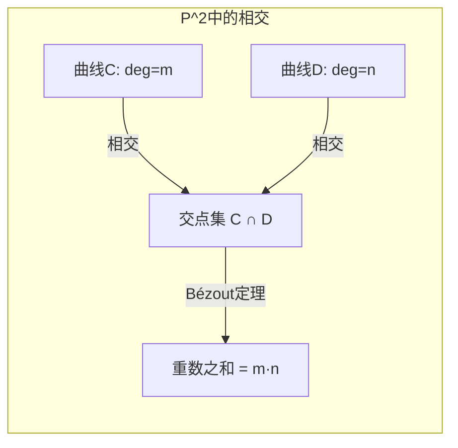

# 射影簇与齐次坐标 - 深度版

**主题**: 代数几何基础 - 射影代数簇
**难度**: ⭐⭐⭐⭐⭐ (研究级)
**先修知识**: 仿射簇、齐次多项式、分次环

---

## 目录

1. [概念深度解析](#1-概念深度解析)
2. [属性与关系](#2-属性与关系)
3. [示例与习题](#3-示例与习题)
4. [形式化实现](#4-形式化实现)
5. [应用与拓展](#5-应用与拓展)
6. [思维表征](#6-思维表征)

---

## 1. 概念深度解析

### 1.1 几何直观

**射影空间** $\mathbb{P}^n$ 是仿射空间 $\mathbb{A}^{n+1}$ 中过原点的直线的集合。几何上：

- 添加"无穷远点"使平行线相交
- 统一处理曲线的渐近行为
- 射影簇是"紧"的（proper），几何性质更完整

**直观示例**：

- 仿射直线 $y = mx + b$ 在射影平面中与无穷远直线 $z = 0$ 交于点 $[1:m:0]$
- 椭圆、抛物线、双曲线在射影平面中统一为圆锥曲线

### 1.2 形式定义

**定义 1.1** (射影空间 / Projective Space)
设 $k$ 为域，$n \geq 0$，**$n$ 维射影空间**定义为：
$$\mathbb{P}_k^n := (k^{n+1} \setminus \{0\}) / \sim$$

其中等价关系 $(a_0, \ldots, a_n) \sim (\lambda a_0, \ldots, \lambda a_n)$ 对所有 $\lambda \in k^\times$。

点记为 $[a_0 : \cdots : a_n]$（**齐次坐标**）。

**定义 1.2** (齐次多项式 / Homogeneous Polynomial)
多项式 $f \in k[x_0, \ldots, x_n]$ 称为**$d$ 次齐次**的，若：
$$f(\lambda x_0, \ldots, \lambda x_n) = \lambda^d f(x_0, \ldots, x_n), \quad \forall \lambda \in k^\times$$

**定义 1.3** (射影代数集 / Projective Algebraic Set)
对齐次理想 $\mathfrak{a} \subseteq k[x_0, \ldots, x_n]$，定义：
$$V(\mathfrak{a}) := \{P \in \mathbb{P}^n : f(P) = 0, \forall f \in \mathfrak{a}, f \text{ 齐次}\}$$

子集 $X \subseteq \mathbb{P}^n$ 称为**射影代数集**，若 $X = V(\mathfrak{a})$ 对某齐次理想成立。

### 1.3 代数表述

**分次环与齐次理想**：

$k[x_0, \ldots, x_n]$ 是**分次环**：
$$k[x_0, \ldots, x_n] = \bigoplus_{d \geq 0} S_d$$

其中 $S_d$ 为 $d$ 次齐次多项式空间。

**射影Nullstellensatz**：

设 $k$ 代数闭，$\mathfrak{a}$ 为齐次理想：

- $V(\mathfrak{a}) = \emptyset \Leftrightarrow (x_0, \ldots, x_n)^N \subseteq \mathfrak{a}$ 对某 $N$（ irrelevant 理想）
- $I(V(\mathfrak{a})) = \sqrt{\mathfrak{a}}$（当 $\mathfrak{a}$ 不含 irrelevant 理想时）

**仿射锥**：射影集 $X \subset \mathbb{P}^n$ 对应仿射锥 $C(X) \subset \mathbb{A}^{n+1}$：
$$C(X) = \{(a_0, \ldots, a_n) : [a_0 : \cdots : a_n] \in X\} \cup \{0\}$$

---

## 2. 属性与关系

### 2.1 核心定理

**定理 2.1** (射影完备性 / Projective Completeness)
设 $X \subset \mathbb{P}^n$ 为射影簇，$Y$ 为任意簇，则投影 $\pi: X \times Y \to Y$ 是闭映射。

**推论**：射影簇的像是闭的；正则函数必为常数。

**定理 2.2** (Bézout定理 / Bézout's Theorem)
设 $X, Y \subset \mathbb{P}^2$ 为射影平面曲线，次数分别为 $m, n$，无公共分支，则：
$$\sum_{P \in X \cap Y} (X \cdot Y)_P = mn$$

其中 $(X \cdot Y)_P$ 为交点的相交重数。

**定理 2.3** (Chow定理 / Chow's Theorem)
$\mathbb{P}^n_\mathbb{C}$ 的任意解析子集都是代数集。

### 2.2 完整证明

**定理 2.1 的证明概要** (射影完备性)

只需证：$X = \mathbb{P}^n$，$Y = \mathbb{A}^m$，$Z \subset \mathbb{P}^n \times \mathbb{A}^m$ 闭，则 $\pi(Z) \subset \mathbb{A}^m$ 闭。

**步骤1**：$Z$ 由双齐次多项式 $F_i(x_0, \ldots, x_n, y_1, \ldots, y_m)$ 定义（对 $x$ 齐次）。

**步骤2**：对 $Q \in \mathbb{A}^m$，$Q \notin \pi(Z) \Leftrightarrow V(F_i(-, Q)) = \emptyset \subset \mathbb{P}^n$。

**步骤3**：由射影Nullstellensatz，$Q \notin \pi(Z) \Leftrightarrow (x_0, \ldots, x_n)^N \subseteq (F_i(-, Q))$。

**步骤4**：此条件可表为某些多项式在 $Q$ 处的消失，故补集为代数集，$\pi(Z)$ 闭。$\square$

**定理 2.2 的证明** (Bézout定理)

**步骤1**：利用相交理论，定义相交积 $X \cdot Y$ 为0-闭链。

**步骤2**：由移动引理，可设 $X$ 与 $Y$ 横截相交。

**步骤3**：横截情形：每点相交重数为1，点数 = $\deg X \cdot \deg Y = mn$。

**步骤4**：一般情形由相交积的连续性/代数性保持。$\square$

### 2.3 层次结构

```
射影簇
    ├── 线性子空间 P^k ⊆ P^n
    │       └── 超平面 (codim = 1)
    ├── 射影曲线 (dim = 1)
    │       ├── 有理曲线 (genus = 0)
    │       ├── 椭圆曲线 (genus = 1)
    │       └── 高亏格曲线
    ├── 射影曲面 (dim = 2)
    │       ├── 有理曲面
    │       ├── K3曲面
    │       └── 一般型曲面
    └── 高维射影簇
```

**与仿射簇的关系**：

- 标准开覆盖：$\mathbb{P}^n = U_0 \cup \cdots \cup U_n$，$U_i = \{x_i \neq 0\} \cong \mathbb{A}^n$
- 每个射影簇可被有限个仿射开集覆盖
- 拟射影簇 = 开子集的射影簇

---

## 3. 示例与习题

### 3.1 具体代数簇示例

**示例 3.1** (射影直线嵌入 / 有理正规曲线)
$$\nu_d: \mathbb{P}^1 \to \mathbb{P}^d, \quad [s:t] \mapsto [s^d : s^{d-1}t : \cdots : t^d]$$

- 像为**有理正规曲线**，次数为 $d$
- 仿射图：$t = 1$ 时为 $(s^d, s^{d-1}, \ldots, s, 1)$

**示例 3.2** (Veronese嵌入)
$$\nu_{n,d}: \mathbb{P}^n \to \mathbb{P}^N, \quad N = \binom{n+d}{d} - 1$$

将 $[x_0 : \cdots : x_n]$ 映为所有 $d$ 次单项式的坐标。

**示例 3.3** (Segre嵌入)
$$\sigma: \mathbb{P}^m \times \mathbb{P}^n \to \mathbb{P}^{(m+1)(n+1)-1}$$

$([x_i], [y_j]) \mapsto [x_i y_j]$。像为Segre簇，方程由 $2 \times 2$ 子式给出。

**示例 3.4** (三次扭曲线)
$$C = \{[s^3 : s^2t : st^2 : t^3] : [s:t] \in \mathbb{P}^1\} \subset \mathbb{P}^3$$

理想由 $xz - y^2$, $yw - z^2$, $xw - yz$ 生成。

### 3.2 反例

**反例 3.5** (非闭嵌入)
仿射簇一般不能嵌入射影簇作为开子集（除非是拟射影簇）。

**反例 3.6** (非射影簇)
存在完备非射影簇（如Hironaka的例子）。

### 3.3 习题

**习题 1**
证明：$V(x^2 + y^2 - z^2) \subset \mathbb{P}^2$ 同构于 $\mathbb{P}^1$。

**解答**：映射 $[s:t] \mapsto [s^2 - t^2 : 2st : s^2 + t^2]$ 给出同构。

**习题 2**
确定 $V(x^3 + y^3 + z^3) \subset \mathbb{P}^2$ 的奇点。

**习题 3**
设 $X = V(xy - zw) \subset \mathbb{P}^3$，证明 $X$ 同构于 $\mathbb{P}^1 \times \mathbb{P}^1$（通过Segre嵌入）。

**习题 4**
Bézout定理应用：求 $V(x^2 + y^2 - z^2)$ 与 $V(x^2 - y^2 + z^2)$ 在 $\mathbb{P}^2$ 中的所有交点。

**习题 5**
证明：$\mathbb{P}^n$ 中任意两个超曲面的交非空（当 $n \geq 2$）。

---

## 4. 形式化实现

### Lean4 代码

```lean4
import Mathlib

-- 射影空间 P^n 作为 k^{n+1} \ {0} 的商
def ProjectiveSpace (k : Type) [Field k] (n : ℕ) : Type :=
  Quotient (MulAction.orbitRel kˣ (Fin (n + 1) → k) (fun c x i => c * x i))

-- 齐次坐标的表示
structure ProjectivePoint (k : Type) [Field k] (n : ℕ) where
  coords : Fin (n + 1) → k
  non_zero : coords ≠ 0

-- 齐次多项式
def IsHomogeneous {k : Type} [Field k] {n : ℕ} (f : MvPolynomial (Fin (n + 1)) k) (d : ℕ) : Prop :=
  ∀ (c : kˣ) (x : Fin (n + 1) → k),
    MvPolynomial.eval (fun i => c * x i) f = (c : k)^d * MvPolynomial.eval x f

-- 射影代数集
structure ProjectiveAlgebraicSet (k : Type) [Field k] (n : ℕ) where
  -- 齐次理想
  homogeneousIdeal : Ideal (MvPolynomial (Fin (n + 1)) k)
  -- 点集
  carrier : Set (ProjectiveSpace k n)

-- Veronese嵌入
def veroneseEmbedding {k : Type} [Field k] (n d : ℕ) :
    ProjectiveSpace k n → ProjectiveSpace k (Nat.choose (n + d) d - 1) :=
  -- 将点映射到所有d次单项式的值
  sorry

-- Segre嵌入
def segreEmbedding {k : Type} [Field k] (m n : ℕ) :
    ProjectiveSpace k m × ProjectiveSpace k n →
    ProjectiveSpace k ((m + 1) * (n + 1) - 1) :=
  sorry

-- 仿射锥
def affineCone {k : Type} [Field k] {n : ℕ} (X : ProjectiveAlgebraicSet k n) :
    AffineAlgebraicSet k (n + 1) :=
  sorry

-- 标准仿射开覆盖
def standardAffineCover {k : Type} [Field k] {n : ℕ} (i : Fin (n + 1)) :
    Set (ProjectiveSpace k n) :=
  {p | ∃ coords : ProjectivePoint k n, p = Quotient.mk _ coords ∧ coords.coords i ≠ 0}
```

---

## 5. 应用与拓展

### 5.1 数论联系

**Fermat大定理**：$x^n + y^n = z^n$ 在 $\mathbb{P}^2_\mathbb{Q}$ 中无本原解（$n \geq 3$）。

**椭圆曲线**：射影形式 $y^2 z = x^3 + axz^2 + bz^3$ 保证点 at infinity $(0:1:0)$ 存在。

### 5.2 物理应用

**Calabi-Yau流形**：射影簇中满足 $c_1 = 0$ 的特殊流形，用于弦理论紧化。

**镜像对称**：两个Calabi-Yau流形的Hodge数交换，计数曲线的Gromov-Witten不变量对应。

### 5.3 前沿方向

**稳定性条件**：几何不变量理论(GIT)中射影商的构造。

**导出范畴**：$D^b(\text{Coh}(X))$ 捕获射影簇的深层几何信息。

---

## 6. 思维表征

### 6.1 几何图示描述

**射影平面中的圆锥曲线**:

```
         z=0 (无穷远直线)
    ─────────────────────────
         |      /|
         |     / |
         |    /  |
         |   /   |
         |  /    |
         | /     |
    ─────|/──────|─────  x-y平面
        /|       |
       / |       |
```

### 6.2 Mermaid图

**射影-仿射对应**:

```mermaid
graph TB
    subgraph "射影侧"
        P[P^n]
        X[射影簇 X ⊆ P^n]
        U[仿射开集 U_i = {x_i ≠ 0}]
    end

    subgraph "仿射侧"
        A[A^n]
        Y[仿射簇 Y ⊆ A^n]
        C[仿射锥 C(X) ⊆ A^{n+1}]
    end

    P -->|标准开覆盖| U
    U -->|≅| A
    X -->|限制| U
    X -->|锥构造| C
    Y -->|射影完备化| X
```

**Bézout定理可视化**:



---

## 参考文献

1. Harris, J. *Algebraic Geometry: A First Course*. Springer, 1992.
2. Hartshorne, R. *Algebraic Geometry*. Springer, 1977. (Chapter I.2-I.7)
3. Mumford, D. *The Red Book of Varieties and Schemes*. Springer, 1999.
4. Griffiths, P., Harris, J. *Principles of Algebraic Geometry*. Wiley, 1994.
5. Miranda, R. *Algebraic Curves and Riemann Surfaces*. AMS, 1995.

---

**维护者**: FormalMath项目组
**最后更新**: 2026年4月8日
**难度等级**: ⭐⭐⭐⭐⭐ (研究级)
