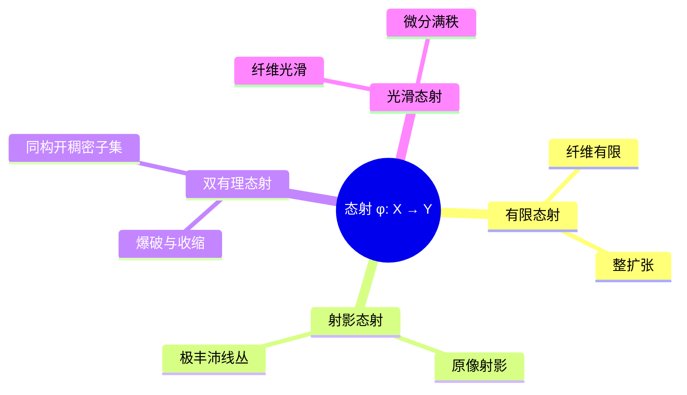

# 代数簇的态射 - 深度版

**主题**: 代数几何 - 簇间映射与有理映射
**难度**: ⭐⭐⭐⭐⭐ (研究级)
**先修知识**: 仿射簇、射影簇、坐标环

---

## 目录

1. [概念深度解析](#1-概念深度解析)
2. [属性与关系](#2-属性与关系)
3. [示例与习题](#3-示例与习题)
4. [形式化实现](#4-形式化实现)
5. [应用与拓展](#5-应用与拓展)
6. [思维表征](#6-思维表征)

---

## 1. 概念深度解析

### 1.1 几何直观

**态射**是保持代数结构的映射。与连续映射或光滑映射不同，态射由多项式（或有理函数）定义：

- **几何直观**："代数定义的"几何映射
- **与拓扑/微分结构的兼容性**：态射自动连续（Zariski拓扑）
- **维数变化**：一般纤维的维数为 $\dim X - \dim Y$

### 1.2 形式定义

**定义 1.1** (仿射簇的态射 / Morphism of Affine Varieties)
设 $X \subseteq \mathbb{A}^n$, $Y \subseteq \mathbb{A}^m$ 为仿射簇。映射 $\varphi: X \to Y$ 称为**态射**，若存在多项式 $f_1, \ldots, f_m \in k[x_1, \ldots, x_n]$ 使得：
$$\varphi(P) = (f_1(P), \ldots, f_m(P)), \quad \forall P \in X$$

**定义 1.2** (有理映射 / Rational Map)
设 $X, Y$ 为簇。**有理映射** $\varphi: X \dashrightarrow Y$ 是等价类 $(U, \varphi_U)$，其中 $U \subseteq X$ 非空开集，$\varphi_U: U \to Y$ 为态射，且 $(U, \varphi_U) \sim (V, \varphi_V)$ 当它们在 $U \cap V$ 上一致。

**定义 1.3** (双有理等价 / Birational Equivalence)
簇 $X$ 与 $Y$ **双有理等价**，若存在有理映射 $\varphi: X \dashrightarrow Y$ 和 $\psi: Y \dashrightarrow X$ 使得：
$$\psi \circ \varphi = \text{id}_X, \quad \varphi \circ \psi = \text{id}_Y$$
（在定义域内成立）

### 1.3 代数表述

**坐标环的拉回**：

态射 $\varphi: X \to Y$ 诱导**$k$-代数同态**：
$$\varphi^*: k[Y] \to k[X], \quad g \mapsto g \circ \varphi$$

**关键定理**：

$$\text{Hom}_{\text{Var}}(X, Y) \cong \text{Hom}_{k\text{-alg}}(k[Y], k[X])$$

**有理函数域**：

不可约簇 $X$ 的**有理函数域** $k(X) = \text{Frac}(k[X])$。

有理映射对应于域嵌入 $k(Y) \hookrightarrow k(X)$。

---

## 2. 属性与关系

### 2.1 核心定理

**定理 2.1** (态射的纤维维数 / Fiber Dimension)
设 $\varphi: X \to Y$ 为簇的满射态射，$\dim X = n$, $\dim Y = m$。则：

- 对一般点 $y \in Y$，$\dim \varphi^{-1}(y) = n - m$
- 对所有 $y \in Y$，$\dim \varphi^{-1}(y) \geq n - m$

**定理 2.2** (Zariski主定理 / Zariski's Main Theorem)
设 $\varphi: X \to Y$ 为双有理态射，$Y$ 正规。则纤维 $\varphi^{-1}(y)$ 连通。

**定理 2.3** (双有理分类)

| 维数 | 分类 |
|------|------|
| 1 | 唯一光滑射影模型，亏格为双有理不变量 |
| 2 | Castelnuovo定理：$P_2 = q = 0 \Leftrightarrow$ 有理 |
| $\geq 3$ | 无完全分类，Mori理论研究极端射线 |

### 2.2 完整证明

**定理 2.1 的证明** (纤维维数)

**步骤1**：设 $X, Y$ 仿射，$\varphi$ 诱导 $k[Y] \hookrightarrow k[X]$。

**步骤2**：Noether正规化：$k[Y] \subseteq k[X]$ 是整扩张（可能在局部化后）。

**步骤3**：对 $y \in Y$，纤维为 $\text{Spec}(k[X] \otimes_{k[Y]} k(y))$。

**步骤4**：由Krull主理想定理，纤维维数 $\geq n - m$，一般等号成立。$\square$

### 2.3 层次结构

```
态射类型
    ├── 有限态射 (k[Y] → k[X] 有限)
    ├── 仿射态射 (原像仿射)
    ├── 射影态射 (原像射影)
    │       └── 极丰沛线丛存在
    ├── 平坦态射 (纤维"连续"变化)
    ├── 光滑态射 (纤维光滑)
    │       └── 平展态射 (相对dim = 0)
    └── 双有理态射
            ├── 爆破 (Blow-up)
            └── 收缩 (Contraction)
```

---

## 3. 示例与习题

### 3.1 具体代数簇示例

**示例 3.1** (标准双有理映射)
$\varphi: \mathbb{P}^2 \dashrightarrow \mathbb{P}^2$，$[x:y:z] \mapsto [1/x : 1/y : 1/z]$（Cremona变换）。

- 在 $(1:1:1)$ 外定义
- 爆破三个点后成为自同构

**示例 3.2** (有限态射)
$\varphi: \mathbb{P}^1 \to \mathbb{P}^1$，$[s:t] \mapsto [s^d : t^d]$。

- 次数为 $d$ 的有限态射
- 纤维：$d$ 个点（除分歧点外）

**示例 3.3** (椭圆曲线的群律)
设 $E$ 为椭圆曲线，$O$ 为单位点。加法 $E \times E \to E$ 是态射。

### 3.2 反例

**反例 3.4** (非态射的双有理映射)
$\mathbb{A}^2 \dashrightarrow \mathbb{P}^2$，$(x, y) \mapsto [x : y : 1]$ 是有理映射但不是态射（在无穷远处不定义）。

### 3.3 习题

**习题 1**
证明：$\varphi: \mathbb{A}^1 \to V(y^2 - x^3)$，$t \mapsto (t^2, t^3)$ 是双有理态射但不同构。

**习题 2**
确定 Cremona 变换 $\varphi: [x:y:z] \mapsto [yz:zx:xy]$ 的不确定点集。

**习题 3**
证明：两个曲线双有理等价 $\Leftrightarrow$ 它们的光滑射影模型同构。

**习题 4**
设 $\varphi: X \to Y$ 为有限态射，证明 $\varphi$ 是仿射的且纤维有限。

**习题 5**
构造 $\mathbb{P}^1 \times \mathbb{P}^1$ 到 $\mathbb{P}^2$ 的双有理映射（Segre簇的投影）。

---

## 4. 形式化实现

### Lean4 代码

```lean4
import Mathlib

-- 簇的态射结构
structure Morphism (k : Type) [Field k] (X Y : AffineAlgebraicSet k n) where
  map : X.carrier → Y.carrier
  polynomialMap : ∃ (fs : Fin m → PolyRing k n),
    ∀ x ∈ X.carrier, map x = (fun i => MvPolynomial.eval x (fs i))

-- 有理映射
def RationalMap (k : Type) [Field k] (X Y : AffineAlgebraicSet k n) : Type :=
  {φ : Nonempty (Set X.carrier) × (Set X.carrier → Y.carrier) |
    ∃ U : Set X.carrier, U.Nonempty ∧ U.IsOpen ∧
      ∃ f : Morphism k X Y, ∀ x ∈ U, φ.2 x = f.map x}

-- 双有理等价
def BirationalEquivalence (k : Type) [Field k] (X Y : AffineAlgebraicSet k n) : Prop :=
  ∃ (φ : RationalMap k X Y) (ψ : RationalMap k Y X),
    ∀ x ∈ X.carrier, ψ.2 (φ.2 x) = x ∧
    ∀ y ∈ Y.carrier, φ.2 (ψ.2 y) = y

-- 有限态射
def IsFiniteMorphism {k : Type} [Field k] {X Y : AffineAlgebraicSet k n}
    (φ : Morphism k X Y) : Prop :=
  -- k[Y] → k[X] 是有限扩张
  sorry

-- 光滑态射（简化定义）
def IsSmoothMorphism {k : Type} [Field k] {X Y : AffineAlgebraicSet k n}
    (φ : Morphism k X Y) : Prop :=
  -- 微分满秩条件
  sorry
```

---

## 5. 应用与拓展

### 5.1 数论联系

**下降法**：曲线上的有理点研究通过双有理映射转化为标准形式。

**Faltings定理**：曲线 $C$ 的亏格 $\geq 2$ 时，$C(\mathbb{Q})$ 有限，依赖于Arakelov几何中的高度理论。

### 5.2 物理应用

**弦理论中的对偶性**：不同Calabi-Yau流形的双有理等价对应物理对偶。

### 5.3 前沿方向

**MMP (Minimal Model Program)**：寻找簇的双有理标准型。

**导出双有理几何**：$D^b(X) \cong D^b(Y) \Rightarrow X$ 与 $Y$ 双有理（Bondal-Orlov猜想）。

---

## 6. 思维表征

### 6.2 Mermaid图

**态射分类**:



---

**维护者**: FormalMath项目组
**最后更新**: 2026年4月8日
**难度等级**: ⭐⭐⭐⭐⭐ (研究级)
