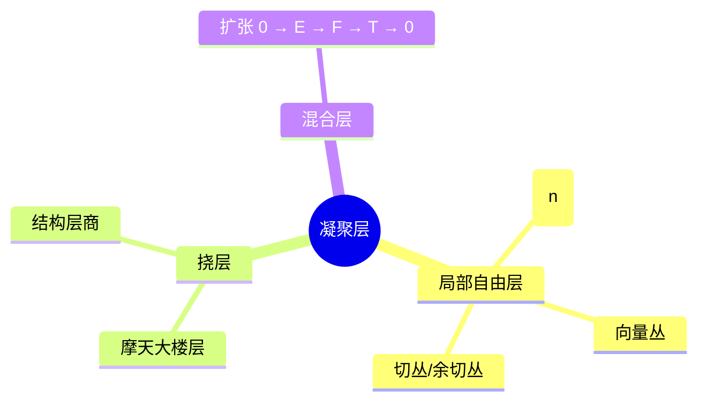
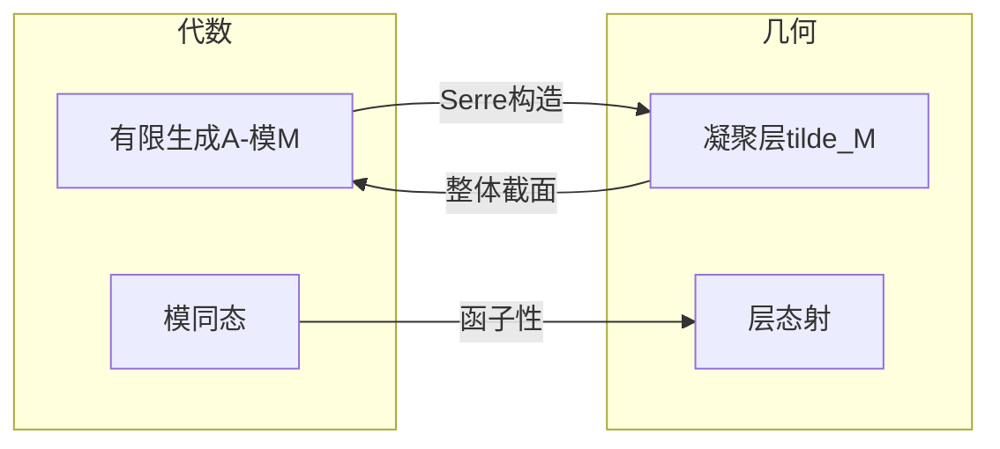

# 结构层与凝聚层 - 深度版

**主题**: 代数几何 - 环化空间与模层
**难度**: ⭐⭐⭐⭐⭐ (研究级)
**先修知识**: 层论基础、交换代数、模论

---

## 目录

1. [概念深度解析](#1-概念深度解析)
2. [属性与关系](#2-属性与关系)
3. [示例与习题](#3-示例与习题)
4. [形式化实现](#4-形式化实现)
5. [应用与拓展](#5-应用与拓展)
6. [思维表征](#6-思维表征)

---

## 1. 概念深度解析

### 1.1 几何直观

**结构层 $\mathcal{O}_X$** 是代数簇的"函数环"层：

- 局部：$\mathcal{O}_{X,x}$ 是局部环（极大理想为在 $x$ 消失的函数）
- 整体：$\mathcal{O}_X(X)$ 是坐标环（仿射情形）

**凝聚层 (Coherent Sheaves)** 是"有限表现"的模层：

- 局部有限生成
- 关系模也有限生成
- 几何上对应"几何构造"的层（向量丛、理想层等）

### 1.2 形式定义

**定义 1.1** (环化空间 / Ringed Space)
**环化空间** $(X, \mathcal{O}_X)$ 由拓扑空间 $X$ 和环层 $\mathcal{O}_X$ 组成。

**局部环化空间**：所有茎 $\mathcal{O}_{X,x}$ 为局部环。

**定义 1.2** (结构层 / Structure Sheaf)
代数簇 $X$ 的**结构层**：
$$\mathcal{O}_X(U) := \{f: U \to k \text{ 正则函数}\}$$

正则 = 局部为多项式商。

**定义 1.3** ($\mathcal{O}_X$-模层 / $\mathcal{O}_X$-Module)
层 $\mathcal{F}$ 称为**$\mathcal{O}_X$-模**，若：

- 每个 $\mathcal{F}(U)$ 是 $\mathcal{O}_X(U)$-模
- 限制映射与模结构相容

**定义 1.4** (凝聚层 / Coherent Sheaf)
$\mathcal{O}_X$-模 $\mathcal{F}$ 称为**凝聚的**，若：

- **局部有限生成**：$X$ 可被开集 $U$ 覆盖，使存在满射 $\mathcal{O}_U^{\oplus n} \to \mathcal{F}|_U$
- **关系有限**：对任意开 $U \subseteq X$ 和满射 $\varphi: \mathcal{O}_U^{\oplus n} \to \mathcal{F}|_U$，$\ker(\varphi)$ 也局部有限生成

### 1.3 代数表述

**仿射情形对应**：

设 $X = \text{Spec}(A)$，则：
$$\{\text{拟凝聚层}\} \leftrightarrow \{A\text{-模}\}$$
$$\{\text{凝聚层}\} \leftrightarrow \{\text{有限生成 } A\text{-模}\}$$

**具体构造**：对 $A$-模 $M$，定义层 $\tilde{M}$：
$$\tilde{M}(D(f)) := M_f = M[f^{-1}]$$

---

## 2. 属性与关系

### 2.1 核心定理

**定理 2.1** (Serre有限性定理)
设 $\mathcal{F}$ 为射影簇 $X$ 上的凝聚层，则：

- $H^i(X, \mathcal{F})$ 为有限维 $k$-向量空间
- $H^i(X, \mathcal{F}(n)) = 0$ 对 $i > 0$ 和 $n \gg 0$

**定理 2.2** (凝聚层的判定)
$\mathcal{O}_X$-模 $\mathcal{F}$ 凝聚 $\Leftrightarrow$ $X$ 存在仿射开覆盖 $\{U_i = \text{Spec}(A_i)\}$ 使 $\mathcal{F}|_{U_i} \cong \tilde{M}_i$ 对有限生成 $A_i$-模 $M_i$。

**定理 2.3** (凝聚层的运算)
凝聚层在以下运算下封闭：

- 核、余核、像
- 张量积 $\otimes$
- Hom 层 $\mathcal{H}om$
- 逆像 $f^*$（对适当态射）
- 直像 $f_*$（对 proper 态射）

### 2.2 完整证明

**定理 2.1 的证明概要** (Serre有限性)

**步骤1**：对 $X = \mathbb{P}^n$，$\mathcal{F} = \mathcal{O}(m)$，直接计算 Čech 上同调。

**步骤2**：对一般凝聚层，用消解 $0 \to \mathcal{F} \to \bigoplus \mathcal{O}(m_i) \to \cdots$。

**步骤3**：由长正合列和归纳，$H^i(X, \mathcal{F})$ 有限维。

**消没性**：扭曲层 $\mathcal{O}(n)$ 对 $n \gg 0$ 有足够的截面使映射 $\mathcal{O}_X^N \to \mathcal{F}(n) \to 0$ 满。$\square$

### 2.3 层次结构

```
O_X-模层
    ├── 拟凝聚层 (Quasi-coherent)
    │       └── 仿射上对应任意模
    ├── 凝聚层 (Coherent)
    │       ├── 局部自由层 (= 向量丛)
    │       ├── 理想层
    │       ├── 结构层 O_X
    │       └── 支集余维 ≥ 1 的层
    └── 非凝聚层
            └── 如无限直和
```

**向量丛 ↔ 局部自由层**：

| 几何 | 层论 |
|------|------|
| 向量丛 $E \to X$ | 局部自由层 $\mathcal{E} = \underline{\Gamma(E)}$ |
| 丛映射 | 层态射 |
| 张量积 | $\mathcal{E}_1 \otimes \mathcal{E}_2$ |
| 对偶丛 | $\mathcal{E}^\vee = \mathcal{H}om(\mathcal{E}, \mathcal{O}_X)$ |

---

## 3. 示例与习题

### 3.1 具体层示例

**示例 3.1** (射影空间的扭曲层)
$\mathbb{P}^n$ 上的 $\mathcal{O}(m)$：

- $\Gamma(\mathbb{P}^n, \mathcal{O}(m)) = k[x_0, \ldots, x_n]_m$（$m$ 次齐次多项式）
- $\mathcal{O}(m)$ 局部自由秩1（线丛）
- $\mathcal{O}(m) \otimes \mathcal{O}(n) = \mathcal{O}(m+n)$

**示例 3.2** (理想层)
闭子簇 $Y \subseteq X$ 的**理想层** $\mathcal{I}_Y$：

- $\mathcal{I}_Y(U) = \{f \in \mathcal{O}_X(U) : f|_{Y \cap U} = 0\}$
- 正合列：$0 \to \mathcal{I}_Y \to \mathcal{O}_X \to \mathcal{O}_Y \to 0$

**示例 3.3** (微分层)
光滑簇 $X$ 的**Kähler微分层** $\Omega_X^1$：

- $\Omega_X^1(U) = \Gamma(U, T^*X)$
- 局部自由秩 = $\dim X$
- 外幂 $\Omega_X^p = \Lambda^p \Omega_X^1$

### 3.2 反例

**反例 3.4** (非凝聚的拟凝聚层)
$X = \mathbb{A}^1$，$\mathcal{F} = \widetilde{k[x]^{(\mathbb{N})}}$（可数个拷贝的直和）。拟凝聚但非凝聚。

### 3.3 习题

**习题 1**
证明：$\mathcal{O}_{\mathbb{P}^1}(-1)$（tautological线丛）无整体截面。

**解答**：$\Gamma(\mathbb{P}^1, \mathcal{O}(-1)) = 0$，因负次齐次多项式只有0。

**习题 2**
计算 $\mathcal{H}om(\mathcal{O}(m), \mathcal{O}(n))$ 在 $\mathbb{P}^1$ 上。

**习题 3**
设 $Y \subseteq \mathbb{P}^n$ 为超曲面 $V(f)$（$\deg f = d$）。证明 $\mathcal{I}_Y \cong \mathcal{O}(-d)$。

**习题 4**
证明：凝聚层在 proper 态射下的直像仍凝聚（Grothendieck相干定理）。

**习题 5**
设 $\mathcal{E}$ 为秩 $r$ 局部自由层，计算 $\det(\mathcal{E}) := \Lambda^r \mathcal{E}$。

---

## 4. 形式化实现

### Lean4 代码

```lean4
import Mathlib

-- 结构层
def StructureSheaf (X : Type) [TopologicalSpace X] [AlgebraicGeometry.Scheme X] :
    SheafOfCommRings X :=
  sorry

-- O_X-模层
structure OXModule {X : Type} [TopologicalSpace X] (O_X : SheafOfCommRings X) where
  toSheaf : SheafOfAbelianGroups X
  moduleStructure : ∀ U : Opens X, Module (O_X.1.obj U) (toSheaf.1.obj U)
  -- 限制映射为模同态
  restriction_linear : ∀ {U V : Opens X} (h : V ≤ U),
    IsLinearMap (O_X.1.map h) (toSheaf.1.map h)

-- 凝聚层条件
structure IsCoherent {X : Type} [TopologicalSpace X] {O_X : SheafOfCommRings X}
    (F : OXModule O_X) : Prop where
  -- 局部有限生成
  locallyFiniteGenerated : ∀ x : X, ∃ U : Opens X, x ∈ U ∧
    ∃ n : ℕ, ∃ φ : (O_X.1.obj U)^n → F.toSheaf.1.obj U, Function.Surjective φ
  -- 关系有限（简化表述）
  finiteRelation : ∀ U : Opens X, ∀ n : ℕ, ∀ φ : (O_X.1.obj U)^n → F.toSheaf.1.obj U,
    Function.Surjective φ →
    ∀ x ∈ U, ∃ V : Opens X, x ∈ V ∧ V ≤ U ∧
      ∃ m : ℕ, ∃ ψ : (O_X.1.obj V)^m → ker (φ.restrict V), Function.Surjective ψ

-- 局部自由层 (= 向量丛)
def IsLocallyFree {X : Type} [TopologicalSpace X] {O_X : SheafOfCommRings X}
    (F : OXModule O_X) (r : ℕ) : Prop :=
  ∀ x : X, ∃ U : Opens X, x ∈ U ∧
    ∃ e : F.toSheaf.1.obj U ≃ₗ[O_X.1.obj U] (O_X.1.obj U)^r, True

-- 理想层
def IdealSheaf {X : Type} [TopologicalSpace X] {O_X : SheafOfCommRings X}
    (Y : Set X) [IsClosed Y] : OXModule O_X where
  toSheaf := sorry  -- 消失的函数
  moduleStructure := sorry
  restriction_linear := sorry

-- Serre有限性定理陈述
theorem SerreFiniteness {X : Type} [TopologicalSpace X] [AlgebraicGeometry.Scheme X]
    (F : OXModule (StructureSheaf X)) (h : IsCoherent F) :
    FiniteDimensional k (Sheaf.cohomology F 0) :=
  sorry
```

---

## 5. 应用与拓展

### 5.1 数论联系

**算术簇**：$\mathcal{O}_X$ 在整数环上的推广，Arakelov理论结合复几何。

### 5.2 物理应用

**Yang-Mills理论**：主丛的联络作为局部1-形式层，曲率在凝聚层框架下研究。

### 5.3 前沿方向

**导出凝聚层**：$D^b(\text{Coh}(X))$ 捕获簇的深层几何，镜像对称的核心对象。

---

## 6. 思维表征

### 6.2 Mermaid图

**凝聚层分类**:



**Serre对应**:



---

**维护者**: FormalMath项目组
**最后更新**: 2026年4月8日
**难度等级**: ⭐⭐⭐⭐⭐ (研究级)
