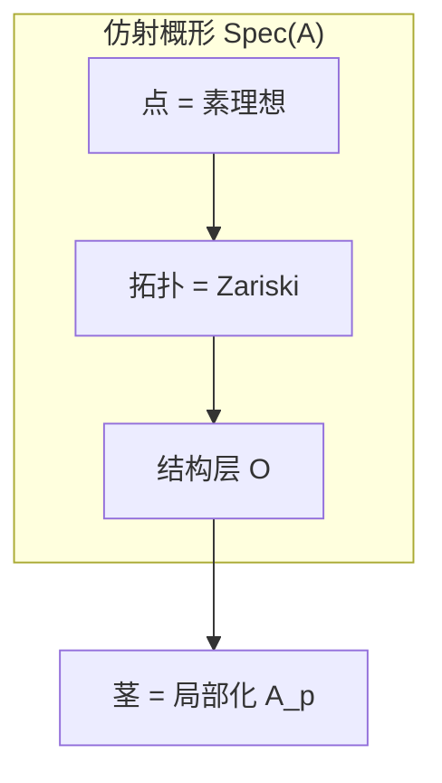

# 仿射概形 - 深度版

**主题**: 代数几何 - 环的谱与结构层
**难度**: ⭐⭐⭐⭐⭐ (研究级)
**先修知识**: 交换代数、层论、Zariski拓扑

---

## 目录

1. [概念深度解析](#1-概念深度解析)
2. [属性与关系](#2-属性与关系)
3. [示例与习题](#3-示例与习题)
4. [形式化实现](#4-形式化实现)
5. [应用与拓展](#5-应用与拓展)
6. [思维表征](#6-思维表征)

---

## 1. 概念深度解析

### 1.1 几何直观

**仿射概形 Spec(A)** 是交换环 A 的"几何实现"：

- **点**：素理想 p ⊂ A（几何点对应极大理想）
- **拓扑**：Zariski拓扑，闭集为 V(I) = {p ⊇ I}
- **结构层**：O_{Spec(A)} 的茎为局部化 A_p

**关键洞见**：环的幂零元提供"无穷小方向"的信息，这是概形相对于代数簇的核心优势。

### 1.2 形式定义

**定义 1.1** (素谱 / Prime Spectrum)
交换环 A 的**素谱**：
Spec(A) := {p ⊆ A : p 是素理想}

**Zariski拓扑**：对理想 I ⊆ A，定义闭集：
V(I) := {p ∈ Spec(A) : I ⊆ p}

**定义 1.2** (结构层的构造)
对 f ∈ A，令 D(f) = Spec(A) \ V(f)（主开集）。定义预层：
O(D(f)) := A_f = A[f^{-1}]

**定理**：此预层是层，且 (Spec(A), O) 是局部环化空间。

**定义 1.3** (仿射概形 / Affine Scheme)
**仿射概形**是同构于 (Spec(A), O_{Spec(A)}) 的局部环化空间，其中 A 为交换环。

### 1.3 代数表述

**伴随等价**：
Hom_{Ring}(A, Γ(X, O_X)) ≅ Hom_{LRS}(X, Spec(A))

这表明 Spec 与全局截面函子 Γ 构成伴随。

**层与模的对应**：
{拟凝聚层} ↔ {A-模}
{凝聚层} ↔ {有限生成A-模}

---

## 2. 属性与关系

### 2.1 核心定理

**定理 2.1** (Hilbert零点定理，概形版本)
设 k 代数闭，A 为有限生成 k-代数，则：

- 闭点 ↔ 极大理想 ↔ k-点
- 约化仿射概形对应经典代数簇

**定理 2.2** (仿射性判别)
概形 X 仿射 ⇔ 存在有限生成理想 I ⊆ Γ(X, O_X) 使 X ≅ Spec(Γ(X, O_X)/I)。

Serre判别：X 仿射 ⇔ H^i(X, F) = 0 对所有 i > 0 和拟凝聚 F。

**定理 2.3** (开浸入的仿射性)
设 U ⊆ Spec(A) 为开子集，则：

- U 一般**不**是仿射的
- 但 U 是概形（可用多个仿射开集覆盖）

### 2.2 完整证明

**定理 2.2 (Serre判别) 的证明概要**

(⇒) 仿射 ⇒ 消没：由 Serre 定理。

(⇐) 设消没条件成立。令 A = Γ(X, O_X)。

**步骤1**：构造态射 f: X → Spec(A)。

**步骤2**：证明 f 是同胚。

**步骤3**：证明 O_X = f^* O_{Spec(A)}。

**步骤4**：由凝聚层生成整个范畴，消没条件保证 f 是同构。□

---

## 3. 示例与习题

### 3.1 具体示例

**示例 3.1** (仿射空间)
A^n = Spec(k[x_1, ..., x_n])

- 点：素理想 (f_1, ..., f_r)
- 闭点：极大理想 (x_1 - a_1, ..., x_n - a_n) ≅ k^n
- 一般点：不可约子簇的 generic point

**示例 3.2** (双重原点)
X = A^1 ⊔_{A^1 \ {0}} A^1（两条仿射直线在零点外粘合）。

- 非分离概形
- 不是仿射的

**示例 3.3** (幂零元)
Spec(k[ε]/(ε^2)) 是单点 {pt}，但结构层为 k[ε]/(ε^2)。

- "无穷小邻域"
- 切空间 = (ε)/(ε^2) ≅ k

**示例 3.4** (整数环)
Spec(Z) = {(0), (2), (3), (5), ...}

- (0)：一般点，闭包为整个 Spec(Z)
- (p)：闭点，剩余域 F_p
- 算术概形的基础

### 3.2 反例

**反例 3.5** (非仿射开子集)
A^2 \ {(0,0)} 不是仿射的（H^1 ≠ 0）。

### 3.3 习题

**习题 1**
描述 Spec(k[x,y]/(xy)) 的拓扑结构。

**解答**：两条直线在原点相交，V(x) 和 V(y) 为闭集。

**习题 2**
证明：Spec(k[x]_{(x)}) 为一点带无穷小邻域。

**习题 3**
计算 Γ(A^n \ {0}, O) 对 n ≥ 2。

**解答**：= k[x_1, ..., x_n]（由Hartogs定理/代数版本）。

**习题 4**
构造非约化概形 Spec(k[x,y]/(x^2)) 的几何直观。

**习题 5**
证明：Spec(Z) 的闭子集为有限点集。

---

## 4. 形式化实现

```lean4
import Mathlib

-- 素谱
def Spec (A : CommRing) : Type := PrimeSpectrum A

-- Zariski拓扑
instance zariskiTopology (A : CommRing) : TopologicalSpace (Spec A) :=
  PrimeSpectrum.zariskiTopology

-- 结构层
def structureSheaf (A : CommRing) : SheafOfCommRings (Spec A) :=
  algebraicGeometry.structureSheaf A

-- 仿射概形结构
structure AffineScheme where
  ring : CommRing
  toLocallyRingedSpace : LocallyRingedSpace
  iso : toLocallyRingedSpace ≅ Spec.toLocallyRingedSpace ring

-- 全局截面
def globalSections (X : AffineScheme) : CommRing :=
  Γ(X.toLocallyRingedSpace, O_X)

-- 伴随等价
theorem adjunction (A : CommRing) (X : LocallyRingedSpace) :
    (A → Γ(X, O_X)) ≅ (X → Spec.toLocallyRingedSpace A) :=
  sorry
```

---

## 5. 应用与拓展

### 5.1 数论联系

**算术概形**：Spec(Z) 上的概形，统一数论与几何。

**Hasse原理**：整体解 ⇔ 所有局部解，用概形的 adelic 观点。

### 5.2 物理应用

**形变理论**：幂零元参数化物理理论的形变空间。

### 5.3 前沿方向

**导出仿射概形**：交换微分分次代数的谱。

**完美胚空间**：p进几何中的新基础。

---

## 6. 思维表征



---

**维护者**: FormalMath项目组
**最后更新**: 2026年4月8日
**难度等级**: ⭐⭐⭐⭐⭐ (研究级)
