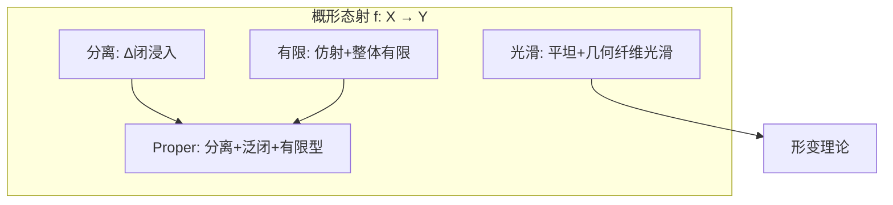

# 一般概形与态射 - 深度版

**主题**: 代数几何 - 概形的定义与映射
**难度**: ⭐⭐⭐⭐⭐ (研究级)
**先修知识**: 仿射概形、层论、纤维积

---

## 目录

1. [概念深度解析](#1-概念深度解析)
2. [属性与关系](#2-属性与关系)
3. [示例与习题](#3-示例与习题)
4. [形式化实现](#4-形式化实现)
5. [应用与拓展](#5-应用与拓展)
6. [思维表征](#6-思维表征)

---

## 1. 概念深度解析

### 1.1 几何直观

**概形 (Scheme)** 是局部同构于仿射概形的局部环化空间。关键特征：

- **局部性**：每点有仿射邻域
- **幂零元**：允许 nilpotent，捕获重数和形变
- **相对观点**：在基概形 S 上研究 S-概形

**态射**：保持结构层的局部环化空间映射。

### 1.2 形式定义

**定义 1.1** (概形 / Scheme)
**概形** (X, O_X) 是局部环化空间，满足：

- X 可被仿射开集 U_i = Spec(A_i) 覆盖
- 限制结构层与仿射结构层一致

**定义 1.2** (概形态射 / Morphism of Schemes)
概形态射 (f, f^#): (X, O_X) → (Y, O_Y) 包含：

- 连续映射 f: X → Y
- 层映射 f^#: O_Y → f_* O_X（局部同态）

**局部同态条件**：诱导的 O_{Y,f(x)} → O_{X,x} 将极大理想映入极大理想。

### 1.3 代数表述

**纤维积**：概形范畴有纤维积：
X ×_S Y 满足泛性质。

仿射情形：Spec(A) ×_{Spec(R)} Spec(B) = Spec(A ⊗_R B)

**重要态射类**：

| 性质 | 定义 | 几何意义 |
|------|------|----------|
| 分离 | Δ: X → X ×_S X 为闭浸入 | 类似Hausdorff |
| proper | 分离 + 泛闭 + 有限型 | 紧性类比 |
| 有限 | 仿射原像，整体有限 | 有限纤维 |
| 光滑 | 平坦 + 几何纤维光滑 | 微分流形类比 |
| 平展 | 光滑 + 相对维数0 | 局部同构 |

---

## 2. 属性与关系

### 2.1 核心定理

**定理 2.1** (纤维积的存在性)
概形范畴中任意纤维积 X ×_S Y 存在。

**定理 2.2** (赋值判别准则)

分离性：X → S 分离 ⇔ 对所有赋值环 R， diagram 至多一个提升。

Properness：X → S proper ⇔ 对所有赋值环 R， diagram 恰好一个提升。

**定理 2.3** (Zariski主定理)
设 f: X → Y 为双有理 proper 态射，Y 正规，则纤维连通。

### 2.2 完整证明

**定理 2.1 的证明** (纤维积)

**步骤1**：仿射情形：Spec(A) ×_{Spec(R)} Spec(B) = Spec(A ⊗_R B)。

**步骤2**：一般情形：取 S 的仿射开覆盖 {Spec(R_i)}。

**步骤3**：构造 X_i ×_{S_i} Y_i 并粘合（验证相容性）。

**步骤4**：验证泛性质。□

---

## 3. 示例与习题

### 3.1 具体示例

**示例 3.1** (射影空间)
P^n = Proj(k[x_0, ..., x_n])

- 非仿射（整体截面仅为 k）
- 可由 n+1 个仿射开集 U_i = {x_i ≠ 0} ≅ A^n 覆盖

**示例 3.2** (算术曲面)
X → Spec(Z) 为二维概形，纤维：

- 一般纤维：Q 上的曲线
- 特殊纤维：F_p 上的曲线

**示例 3.3** (非分离概形)
带双重原点的直线：两条 A^1 在非零点粘合。

### 3.2 反例

**反例 3.4** (非proper态射)
A^n → Spec(k) 分离但非 proper（不是泛闭的）。

### 3.3 习题

**习题 1**
证明 P^1 → Spec(k) 是 proper 的。

**习题 2**
构造态射 Spec(Z[i]) → Spec(Z) 并描述其纤维。

**解答**：纤维为 F_p(i) 或 F_p[x]/(x^2+1)。

**习题 3**
证明有限态射是 proper 的。

**习题 4**
描述 A^2 ×_{A^1} A^2（用纤维积）。

**习题 5**
设 f: X → Y 为态射，证明 f 分离 ⇔ 对角 Δ(X) 在 X ×_Y X 中闭。

---

## 4. 形式化实现

```lean4
import Mathlib

-- 概形结构
structure Scheme where
  toLocallyRingedSpace : LocallyRingedSpace
  affineCover : OpenCover toLocallyRingedSpace
  affine : ∀ i, IsAffine (affineCover.obj i)

-- 概形态射
structure SchemeMorphism (X Y : Scheme) where
  toLocallyRingedSpaceHom : X.toLocallyRingedSpace ⟶ Y.toLocallyRingedSpace

-- 纤维积
noncomputable def fiberProduct (X Y S : Scheme) (f : X ⟶ S) (g : Y ⟶ S) : Scheme :=
  sorry

-- 分离态射
def IsSeparated {X Y : Scheme} (f : X ⟶ Y) : Prop :=
  IsClosedImmersion (diagonal f)

-- proper态射
def IsProper {X Y : Scheme} (f : X ⟶ Y) : Prop :=
  IsSeparated f ∧ UniversallyClosed f ∧ LocallyOfFiniteType f
```

---

## 5. 应用与拓展

### 5.1 数论联系

**Arakelov理论**：在 Spec(Z) 上的几何，结合 Archimedean 位。

### 5.2 物理应用

**弦理论紧化**：Calabi-Yau 概形族描述物理常数的模空间。

### 5.3 前沿方向

**log几何**：带边界除子的概形，研究退化情形。

**导出概形**：交换环谱到微分分次代数的推广。

---

## 6. 思维表征



---

**维护者**: FormalMath项目组
**最后更新**: 2026年4月8日
**难度等级**: ⭐⭐⭐⭐⭐ (研究级)
