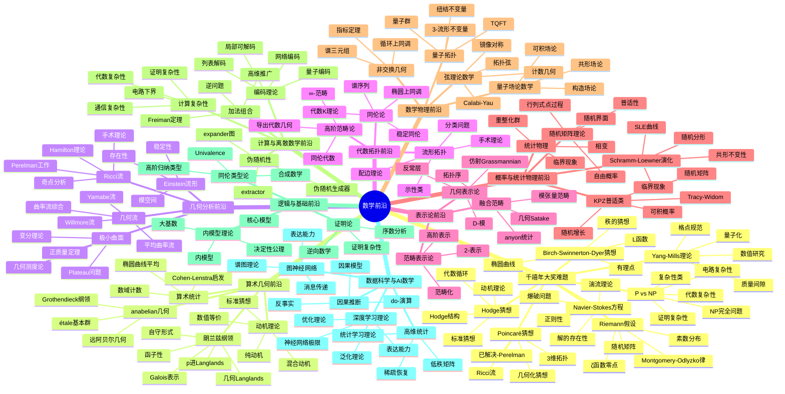
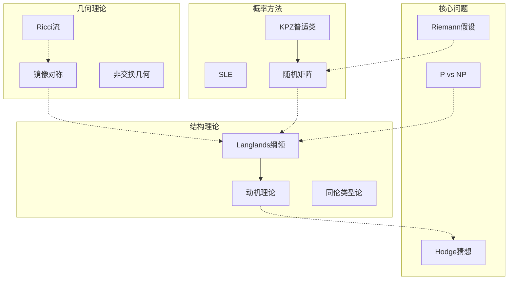
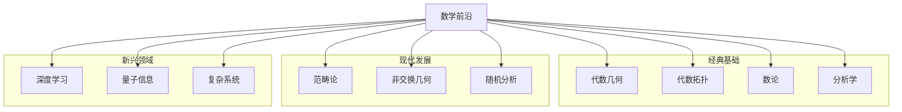
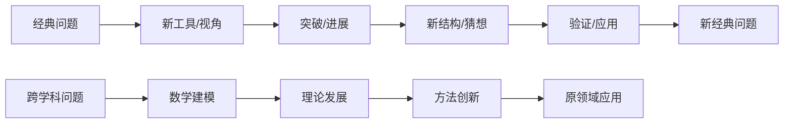

# 数学前沿思维导图

> 数学前沿探索人类知识的边界，从千禧年问题到新兴交叉领域，展现数学的无限可能。

---

## 🧠 核心概念层级关系



---

## 🔗 前沿交叉关系图



---

## 📍 重要前沿成果

### 已解决重大问题

| 问题 | 解决者 | 年份 | 方法 |
|-----|-------|------|------|
| Poincaré猜想 | Perelman | 2003 | Ricci流 |
| Fermat大定理 | Wiles | 1995 | 模性提升 |
| 模性定理 | Breuil-Conrad-Diamond-Taylor | 2001 | 模形式 |
| 几何化猜想 | Perelman | 2003 | Ricci流手术 |

### 活跃研究领域

| 领域 | 核心问题 | 重要性 | 进展 |
|-----|---------|-------|------|
| Langlands纲领 | 函子性 | ⭐⭐⭐⭐⭐ | 部分进展 |
| Ricci流 | 奇点分析 | ⭐⭐⭐⭐⭐ | 持续研究 |
| P vs NP | 复杂性下界 | ⭐⭐⭐⭐⭐ | 开放问题 |
| 镜像对称 | SYZ猜想 | ⭐⭐⭐⭐⭐ | 部分理解 |
| 同伦类型论 | 数学基础 | ⭐⭐⭐⭐ | 快速发展 |

### 新兴交叉领域

| 领域 | 交叉方向 | 潜力 | 应用 |
|-----|---------|------|------|
| 深度学习理论 | 统计/优化 | ⭐⭐⭐⭐⭐ | AI |
| 量子拓扑 | 物理/拓扑 | ⭐⭐⭐⭐⭐ | 量子计算 |
| 高维统计 | 统计/几何 | ⭐⭐⭐⭐⭐ | 数据科学 |
| 算术几何 | 数论/几何 | ⭐⭐⭐⭐⭐ | 密码学 |

---

## 🔄 与经典数学的连接



---

## 📊 前沿领域热度评估

| 领域 | 理论深度 | 应用潜力 | 活跃程度 | 交叉性 |
|-----|---------|---------|---------|-------|
| Langlands纲领 | ⭐⭐⭐⭐⭐ | ⭐⭐⭐ | ⭐⭐⭐⭐ | ⭐⭐⭐⭐ |
| 镜像对称 | ⭐⭐⭐⭐⭐ | ⭐⭐⭐⭐ | ⭐⭐⭐⭐ | ⭐⭐⭐⭐⭐ |
| Ricci流 | ⭐⭐⭐⭐⭐ | ⭐⭐⭐⭐ | ⭐⭐⭐⭐ | ⭐⭐⭐⭐ |
| P vs NP | ⭐⭐⭐⭐⭐ | ⭐⭐⭐⭐⭐ | ⭐⭐⭐⭐⭐ | ⭐⭐⭐⭐ |
| 深度学习理论 | ⭐⭐⭐⭐ | ⭐⭐⭐⭐⭐ | ⭐⭐⭐⭐⭐ | ⭐⭐⭐⭐⭐ |
| 量子拓扑 | ⭐⭐⭐⭐⭐ | ⭐⭐⭐⭐⭐ | ⭐⭐⭐⭐ | ⭐⭐⭐⭐⭐ |
| 高维统计 | ⭐⭐⭐⭐ | ⭐⭐⭐⭐⭐ | ⭐⭐⭐⭐⭐ | ⭐⭐⭐⭐⭐ |

---

## 🎯 学习路径推荐

### 纯数学前沿路径

```
经典数学深入 → 现代理论 → 前沿论文 → 研究问题
```

### 应用数学前沿路径

```
应用数学基础 → 交叉领域 → 实际问题 → 创新方法
```

### 跨学科前沿路径

```
数学基础 + 领域知识 → 交叉研究 → 新理论/方法
```

---

## 📚 重要资源

### 顶级期刊

| 期刊 | 领域 | 影响 |
|-----|------|------|
| Annals of Math | 纯数学 | ⭐⭐⭐⭐⭐ |
| Inventiones | 纯数学 | ⭐⭐⭐⭐⭐ |
| J. Amer. Math. Soc. | 纯数学 | ⭐⭐⭐⭐⭐ |
| Acta Mathematica | 纯数学 | ⭐⭐⭐⭐⭐ |
| Nature/Science | 交叉 | ⭐⭐⭐⭐⭐ |

### 重要会议

| 会议 | 领域 | 规模 |
|-----|------|------|
| ICM | 全数学 | 最大 |
| 专长会议 | 各领域 | 中等 |
| 跨学科会议 | 交叉 | 增长 |

### 预印本平台

- arXiv（数学各分支）
- bioRxiv（生物数学）
- SSRN（金融数学）

---

## 🔍 前沿探索方法论



---

> 💡 **探索建议**：数学前沿需要深厚的经典基础和创新思维。建议选择一个方向深入，同时保持对其他领域的关注。交叉领域往往产生突破性成果，保持开放心态很重要。跟踪arXiv最新论文、参加学术会议是了解前沿的有效途径。
