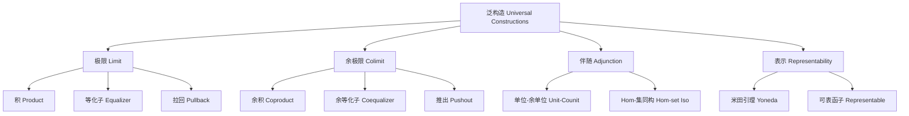
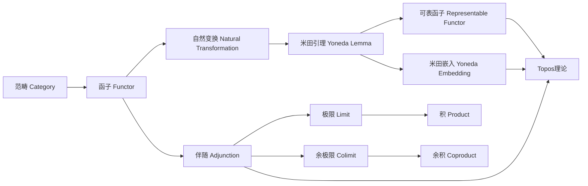
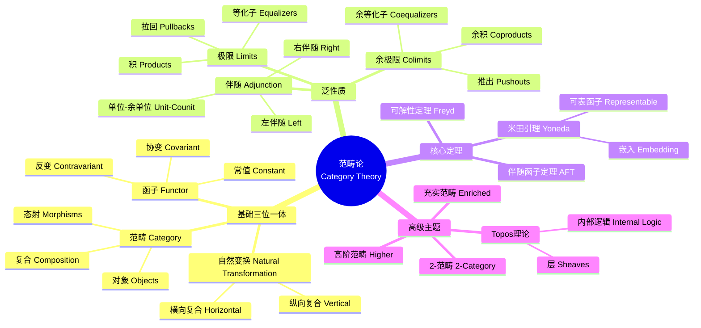

# nLab范畴论精粹 (nLab Category Theory Essentials)

---

**文档编号**: FM-NLAB-CT-001
**主题**: 范畴论核心概念（基于nLab权威资源）
**MSC分类**: 18A05 (Category Theory - General Theory)
**创建日期**: 2026年4月9日
**版本**: 1.0

---

## 一、核心定义 (Core Definitions)

### 1.1 范畴 (Category)

**nLab标准定义**：
> 一个**范畴** $\mathcal{C}$ 由以下数据组成：
>
> - 对象类 (Class of objects) $Obj(\mathcal{C})$
> - 对每对对象 $X, Y \in Obj(\mathcal{C})$，一个态射集 $Hom_{\mathcal{C}}(X, Y)$
> - 复合运算 $\circ: Hom_{\mathcal{C}}(Y,Z) \times Hom_{\mathcal{C}}(X,Y) \to Hom_{\mathcal{C}}(X,Z)$
> - 单位态射 $id_X \in Hom_{\mathcal{C}}(X,X)$ 对每个对象 $X$
>
> 满足：
>
> - **结合律**: $(h \circ g) \circ f = h \circ (g \circ f)$
> - **单位律**: $id_Y \circ f = f = f \circ id_X$

**关键属性**：

| 属性 | 说明 | nLab术语 |
|------|------|----------|
| 局部小性 (Locally Small) | $Hom(X,Y)$ 是集合而非真类 | locally small category |
| 小性 (Small) | 对象类是集合 | small category |
| 具体性 (Concrete) | 对象有"元素"，态射是函数 | concrete category |

### 1.2 函子 (Functor)

**nLab标准定义**：
> 函子 $F: \mathcal{C} \to \mathcal{D}$ 是两个范畴之间的结构保持映射：
>
> - 对象映射：$X \mapsto F(X)$
> - 态射映射：$f: X \to Y$ 映射为 $F(f): F(X) \to F(Y)$
>
> 满足：
>
> - $F(g \circ f) = F(g) \circ F(f)$
> - $F(id_X) = id_{F(X)}$

### 1.3 自然变换 (Natural Transformation)

**nLab标准定义**：
> 自然变换 $\alpha: F \Rightarrow G$ 在两个函子 $F, G: \mathcal{C} \to \mathcal{D}$ 之间，由一族态射组成：
> $$\alpha_X: F(X) \to G(X) \quad \text{对每个 } X \in \mathcal{C}$$
>
> 使得下图对任意 $f: X \to Y$ 交换：
> $$
> \begin{array}{ccc}
> F(X) & \xrightarrow{\alpha_X} & G(X) \\
> F(f)\downarrow & & \downarrow G(f) \\
> F(Y) & \xrightarrow{\alpha_Y} & G(Y)
> \end{array}
> $$

---

## 二、关键属性与结构 (Key Properties)

### 2.1 泛构造 (Universal Constructions)

### 2.2 伴随函子 (Adjunction)

**nLab定义**：
> 伴随是一对函子 $F: \mathcal{C} \leftrightarrows \mathcal{D}: G$，记作 $F \dashv G$，满足以下等价条件之一：
>
> 1. **Hom-集同构**: $Hom_{\mathcal{D}}(F(X), Y) \cong Hom_{\mathcal{C}}(X, G(Y))$（自然于 $X, Y$）
> 2. **单位-余单位**: 自然变换 $\eta: id_{\mathcal{C}} \Rightarrow GF$ 和 $\varepsilon: FG \Rightarrow id_{\mathcal{D}}$ 满足三角恒等式

**关键定理**：

| 定理 | 陈述 | nLab链接 |
|------|------|----------|
| 伴随函子定理 | 保持极限的函子有左伴随（在一定条件下） | adjoint functor theorem |
| 唯一性 | 左/右伴随在唯一同构下唯一 | uniqueness of adjoints |

---

## 三、重要示例 (Important Examples)

### 3.1 基本范畴

| 范畴 | 对象 | 态射 | nLab页面 |
|------|------|------|----------|
| **Set** | 集合 | 函数 | Set |
| **Grp** | 群 | 群同态 | Grp |
| **Ring** | 环 | 环同态 | Ring |
| **Top** | 拓扑空间 | 连续映射 | Top |
| **Vect$_k$** | $k$-向量空间 | 线性映射 | Vect |

### 3.2 特殊范畴

**离散范畴 (Discrete Category)**：

- 只有恒等态射
- 本质上就是集合

**预序范畴 (Preorder Category)**：

- 对象：预序集的元素
- 态射：$Hom(a,b)$ 当且仅当 $a \leq b$（最多一个态射）

**群胚 (Groupoid)**：

- 所有态射都是同构
- 基本群胚 $\Pi_1(X)$ 是同伦论的基础

### 3.3 函子范畴

**nLab定义**：
> 对范畴 $\mathcal{C}, \mathcal{D}$，**函子范畴** $[\mathcal{C}, \mathcal{D}]$ 或 $\mathcal{D}^{\mathcal{C}}$ 以：
>
> - 对象：函子 $F: \mathcal{C} \to \mathcal{D}$
> - 态射：自然变换 $\alpha: F \Rightarrow G$

**特例 - 预层范畴 (Presheaf Category)**：
$$PSh(\mathcal{C}) := [\mathcal{C}^{op}, \mathbf{Set}]$$
这是Topos理论的基础。

---

## 四、核心定理 (Core Theorems)

### 4.1 米田引理 (Yoneda Lemma)

**nLab陈述**（范畴论中最基本的定理）：

> **定理**（米田引理）：设 $\mathcal{C}$ 是局部小范畴，$F: \mathcal{C}^{op} \to \mathbf{Set}$ 是反变函子，则对任意 $C \in \mathcal{C}$：
> $$Nat(Hom_{\mathcal{C}}(-, C), F) \cong F(C)$$
> 这个同构自然于 $C$ 和 $F$。

**推论**：

1. **米田嵌入**：$y: \mathcal{C} \to [\mathcal{C}^{op}, \mathbf{Set}]$，$C \mapsto Hom(-, C)$ 是全忠实函子
2. **对象由其表示确定**：$C$ 由其"所有关系"完全确定

**意义**（nLab评语）：
> "To understand a thing is to see it from all perspectives" — 理解一个对象就是看到它从所有其他对象来的所有映射。

### 4.2 概念关系图

---

## 五、与其他概念的关系 (Relations)

### 5.1 与代数的关系

| 代数概念 | 范畴论对应 | 统一视角 |
|----------|------------|----------|
| 群作用 | 函子 $G \to \mathbf{Set}$ | 表示论 |
| 模 | 函子 $R \to \mathbf{Ab}$ | 模范畴 |
| 群上同调 | 导出函子 $Ext$ | 同调代数 |

### 5.2 与拓扑的关系

| 拓扑概念 | 范畴论对应 | nLab页面 |
|----------|------------|----------|
| 拓扑空间 | 站点 (Site) | site |
| 层 (Sheaf) | 满足下降条件的函子 | sheaf |
| 基本群胚 | 道路的同伦类 | fundamental groupoid |

### 5.3 与逻辑的关系

**Curry-Howard-Lambek 对应**（nLab核心内容）：

| 逻辑 | 类型论 | 范畴论 |
|------|--------|--------|
| 命题 | 类型 | 对象 |
| 证明 | 项 | 态射 |
| 合取 $\land$ | 积类型 | 积 (Product) |
| 析取 $\lor$ | 和类型 | 余积 (Coproduct) |
| 蕴涵 $\to$ | 函数类型 | 指数 (Exponential) |
| 全称量词 | 依赖积 | 右伴随 |
| 存在量词 | 依赖和 | 左伴随 |

---

## 六、思维导图 (Mind Map)

---

## 七、中英文术语对照 (Terminology)

| 中文 | English | nLab标准 | 符号 |
|------|---------|----------|------|
| 范畴 | Category | category | $\mathcal{C}$ |
| 对象 | Object | object | $X, Y, Z$ |
| 态射 | Morphism | morphism | $f, g, h$ |
| 函子 | Functor | functor | $F, G, H$ |
| 自然变换 | Natural Transformation | natural transformation | $\alpha, \beta$ |
| 极限 | Limit | limit | $\lim$ |
| 余极限 | Colimit | colimit | $\text{colim}$ |
| 伴随 | Adjunction | adjunction | $F \dashv G$ |
| 积 | Product | product | $\prod$ |
| 余积 | Coproduct | coproduct | $\coprod$ |
| 米田引理 | Yoneda Lemma | Yoneda lemma | - |
| 可表函子 | Representable Functor | representable functor | $Hom(-, X)$ |
| 群胚 | Groupoid | groupoid | - |
| 预层 | Presheaf | presheaf | - |
| 层 | Sheaf | sheaf | - |
| Topos | Topos | topos | - |

---

## 八、FormalMath链接 (Links)

### 8.1 内部文档链接

| 主题 | FormalMath文档路径 |
|------|-------------------|
| 范畴论入门 | [docs/01-基础数学/范畴论入门/01-范畴论入门-增强版.md](../01-基础数学/范畴论入门/01-范畴论入门-增强版.md) |
| 范畴理解三问 | [docs/00-核心概念理解三问/10-范畴-理解三问.md](../00-核心概念理解三问/10-范畴-理解三问.md) |
| 米田引理 | [docs/00-核心概念理解三问/11-核心定理多表征/05-米田引理-五种表征.md](../00-核心概念理解三问/11-核心定理多表征/05-米田引理-五种表征.md) |
| 同调代数 | [docs/00-知识层次体系/L3-理论建构层/01-代数方向/02-同调代数理论.md](../00-知识层次体系/L3-理论建构层/01-代数方向/02-同调代数理论.md) |
| 代数几何基础 | [docs/00-知识层次体系/L3-理论建构层/01-代数方向/01-代数几何基础理论.md](../00-知识层次体系/L3-理论建构层/01-代数方向/01-代数几何基础理论.md) |

### 8.2 相关概念链接

- [Hom-函子](../01-基础数学/范畴论入门/01-范畴论入门-增强版.md)
- [泛性质](../00-核心概念理解三问/11-核心定理多表征/05-米田引理-五种表征.md)
- [层与Topos](../00-知识层次体系/L3-理论建构层/01-代数方向/01-代数几何基础理论.md)

---

## 九、nLab参考资源 (References)

### 9.1 nLab核心页面

1. **Category Theory**: https://ncatlab.org/nlab/show/category+theory
2. **Functor**: https://ncatlab.org/nlab/show/functor
3. **Natural Transformation**: https://ncatlab.org/nlab/show/natural+transformation
4. **Yoneda Lemma**: https://ncatlab.org/nlab/show/Yoneda+lemma
5. **Adjunction**: https://ncatlab.org/nlab/show/adjunction
6. **Limit**: https://ncatlab.org/nlab/show/limit
7. **Topos**: https://ncatlab.org/nlab/show/topos

### 9.2 推荐文献

1. **Mac Lane, S.** (1998). *Categories for the Working Mathematician* (2nd ed.). Springer.
2. **Riehl, E.** (2016). *Category Theory in Context*. Dover.
3. **Leinster, T.** (2014). *Basic Category Theory*. Cambridge University Press.
4. **Awodey, S.** (2010). *Category Theory* (2nd ed.). Oxford University Press.
5. **Borceux, F.** (1994). *Handbook of Categorical Algebra*. Cambridge University Press.

---

**文档状态**: ✅ 完成
**最后更新**: 2026年4月9日
**nLab对齐版本**: 2026年4月
