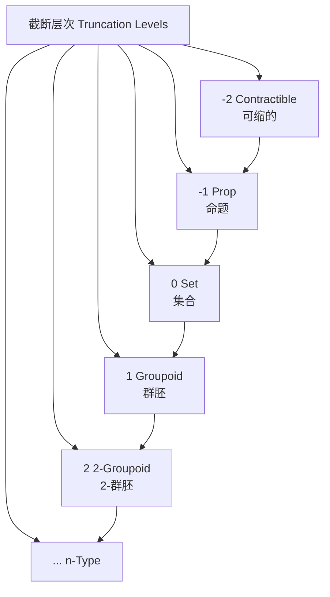
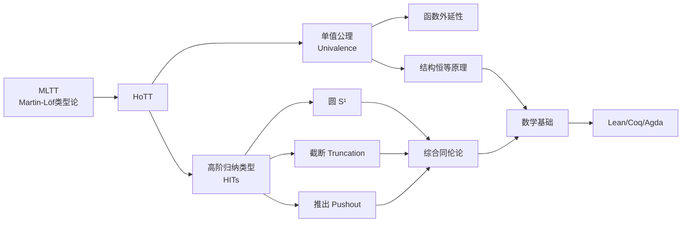
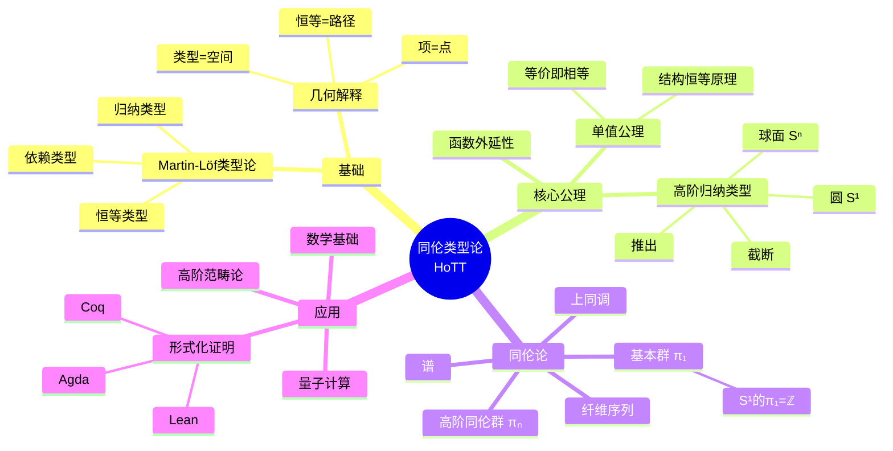

# 同伦类型论导论 (Introduction to Homotopy Type Theory)

---

**文档编号**: FM-NLAB-HoTT-001  
**主题**: 同伦类型论（基于nLab权威资源）  
**MSC分类**: 03B38 (Type Theory), 55U35 (Abstract Homotopy Theory)  
**创建日期**: 2026年4月9日  
**版本**: 1.0

---

## 一、核心定义 (Core Definitions)

### 1.1 同伦类型论概述

**nLab标准定义**：
> **同伦类型论**（Homotopy Type Theory, HoTT）是Martin-Löf类型论的扩展，增加了：
> 1. **单值公理**（Univalence Axiom）
> 2. **高阶归纳类型**（Higher Inductive Types, HITs）
>
> 核心洞见：类型可以被解释为拓扑空间，恒等类型被解释为路径空间。

### 1.2 几何解释

**nLab提出的"类型即空间"解释**：

| 类型论概念 | 拓扑解释 | 高阶结构 |
|------------|----------|----------|
| 类型 $A$ | 空间 $A$ | - |
| 项 $a: A$ | 点 $a \in A$ | - |
| 恒等类型 $a =_A b$ | 路径空间 $Path_A(a,b)$ | 同伦类 |
| 高阶恒等 $p =_{a=b} q$ | 同伦 $Homotopy(p,q)$ | 高阶同伦 |
| 类型族 $B: A \to \mathcal{U}$ | 纤维化 $B \to A$ | 层 |

### 1.3 截断层次 (Truncation Levels)

**nLab定义**：
> 类型 $A$ 的**截断层次**（h-level）归纳定义：
> - **Contractible** (-2-类型)：存在中心点，所有点都等于它
> - **Proposition** (-1-类型，真值)：任意两点相等（最多一个元素）
> - **Set** (0-类型)：恒等类型是命题
> - **Groupoid** (1-类型)：恒等类型是集合
> - **n-类型**：恒等类型是 $(n-1)$-类型



---

## 二、关键属性与公理 (Key Axioms)

### 2.1 单值公理 (Univalence Axiom)

**nLab定义**（Voevodsky, 2006）：
> **单值公理**：对类型 $A, B : \mathcal{U}$，恒等类型 $A =_{\mathcal{U}} B$ 等价于等价类型 $A \simeq B$：
> $$(A =_{\mathcal{U}} B) \simeq (A \simeq B)$$
>
> 等价地，典范映射 $idtoeqv: (A = B) \to (A \simeq B)$ 是等价。

**核心意义**：
| 方面 | 解释 |
|------|------|
| **结构恒等原理** | 同构的结构在类型论中恒等 |
| **不变性** | 所有性质在同构下不变 |
| **数学实践** | 符合数学家"视同构为相等"的实践 |

**nLab评语**：
> "Univalence captures the mathematical practice of treating equivalent structures as identical."

### 2.2 函数外延性 (Function Extensionality)

**定理**（由单值公理推出）：
> 两个函数 $f, g: \prod_{x:A} B(x)$ 相等当且仅当它们逐点相等：
> $$(f = g) \simeq \prod_{x:A} (f(x) = g(x))$$

### 2.3 高阶归纳类型 (Higher Inductive Types)

**nLab定义**：
> **高阶归纳类型**是允许为恒等类型指定构造子的归纳类型。

**经典示例 - 圆 $S^1$**：
```
Inductive S¹ : Type where
  | base : S¹
  | loop : base = base
```

**意义**：
- `base`：圆上的一点
- `loop`：从base到base的非平凡路径（生成基本群）

```mermaid
graph LR
    subgraph S¹ Circle
    A[base] -->|loop| A
    end
```

### 2.4 其他重要HITs

| HIT | 构造子 | 几何意义 | nLab页面 |
|-----|--------|----------|----------|
| **Interval** | 两点 + 路径 | 单位区间 $[0,1]$ | interval type |
| **Circle** | 一点 + 自环 | $S^1$ | circle type |
| **Suspension** | 两点 + 两个点之间的路径 | $\Sigma A$ | suspension type |
| **Sphere** | 基点 + 二维路径 | $S^n$ | n-sphere type |
| **Truncation** | 使类型成为n-类型 | $\|A\|_n$ | truncation |
| **Pushout** | 推出构造 | $A \cup_C B$ | pushout type |

---

## 三、重要示例 (Important Examples)

### 3.1 综合同伦论构造

**nLab/HoTT Book中的核心构造**：

```mermaid
graph TD
    A[综合同伦论<br/>Synthetic Homotopy Theory] --> B[基本群]<br/>π₁
    A --> C[高阶同伦群]<br/>πₙ
    A --> D[纤维序列]<br/>Fiber Sequences
    A --> E[上同调]<br/>Cohomology
    A --> F[谱]<br/>Spectra
    
    B --> B1[S¹的π₁ = ℤ]
    C --> C1[Sⁿ的πₙ = ℤ]
    D --> D1[长正合序列]
    E --> E1[K(G,n)]
    F --> F1[稳定同伦论]
```

### 3.2 基本群计算

**定理**（HoTT Book）：
> $$\pi_1(S^1) \cong \mathbb{Z}$$

**证明概要**：
1. 定义万有覆叠 $cover: \mathbb{Z} \to S^1$
2. 使用路径提升性质
3. 证明环路类与整数一一对应

### 3.3 Eilenberg-MacLane空间

**nLab定义**：
> 类型 $K(G, n)$ 满足：
> - $\pi_n(K(G,n)) = G$
> - $\pi_k(K(G,n)) = 0$ 对 $k \neq n$

**构造**：使用高阶归纳类型和截断。

---

## 四、核心定理 (Core Theorems)

### 4.1 结构恒等原理 (Structure Identity Principle)

**nLab陈述**：
> 由单值公理，结构类型的路径对应于结构同构：
> - 群的路径 $\leftrightarrow$ 群同构
> - 环的路径 $\leftrightarrow$ 环同构
> - 拓扑空间的路径 $\leftrightarrow$ 同胚

**意义**：
> "Isomorphic mathematical structures are identified in HoTT."

### 4.2 同论论定理的构造性证明

**nLab/HoTT成就**：

| 定理 | 传统证明 | HoTT证明 | 形式化 |
|------|----------|----------|--------|
| $\pi_1(S^1) = \mathbb{Z}$ | 覆叠空间 | 类型论构造 | ✅ |
| Seifert-van Kampen | 代数拓扑 | 推出归纳 | ✅ |
| Blakers-Massey | 同伦论 | 高阶归纳 | ✅ |
| Serre谱序列 | 谱序列 | 构造性 | ✅ |
| Atiyah-Hirzebruch | 广义上同调 | 谱论 | 进行中 |

### 4.3 概念关系图



---

## 五、与其他概念的关系 (Relations)

### 5.1 与范畴论的关系

| 范畴论 | HoTT对应 | nLab页面 |
|--------|----------|----------|
| 群胚 (Groupoid) | 1-类型 | groupoid |
| 高阶群胚 ($\infty$-groupoid) | 一般类型 | infinity-groupoid |
| 函子范畴 | 函数类型 | functor category |
| 自然变换 | 恒等的恒等 | natural transformation |
| Grothendieck构造 | 依赖对类型 | Grothendieck construction |

**核心洞见**（nLab）：
> "Types are weak $\infty$-groupoids." — 类型是弱无穷群胚。

### 5.2 与Topos理论的关系

**nLab联系**：
> HoTT是$(\infty,1)$-Topos的**内部语言**（internal language）。

| 概念 | HoTT | $(\infty,1)$-Topos | nLab |
|------|------|-------------------|------|
| 类型 | 层 | object | internal logic |
| 命题 | 子终对象 | subterminal | subobject classifier |
| 量词 | 伴随 | dependent product/sum | quantifiers |
| 单值 | 对象分类器 | object classifier | univalent universe |

### 5.3 与代数拓扑的关系

**综合 vs 分析**：

| 方法 | 特点 | 代表 |
|------|------|------|
| **分析同伦论** | 用集合论定义空间、路径 | 经典代数拓扑 |
| **综合同伦论** | 路径是原始概念 | HoTT |

**nLab评语**：
> "HoTT provides a synthetic approach to homotopy theory, where homotopical structures are primitive rather than derived."

---

## 六、思维导图 (Mind Map)



---

## 七、中英文术语对照 (Terminology)

| 中文 | English | nLab标准 | 符号 |
|------|---------|----------|------|
| 同伦类型论 | Homotopy Type Theory | homotopy type theory | HoTT |
| 单值公理 | Univalence Axiom | univalence | - |
| 高阶归纳类型 | Higher Inductive Type | higher inductive type | HIT |
| 恒等类型 | Identity Type | identity type | $=_A$ |
| 路径 | Path | path | $p: a = b$ |
| 同伦 | Homotopy | homotopy | $H: p = q$ |
| 可缩的 | Contractible | contractible | - |
| 命题 | Proposition | h-proposition | $IsProp$ |
| 集合 | Set | h-set | $IsSet$ |
| 群胚 | Groupoid | h-groupoid | - |
| 截断 | Truncation | truncation | $\|A\|_n$ |
| 综合同伦论 | Synthetic Homotopy Theory | synthetic homotopy theory | - |
| 依赖类型 | Dependent Type | dependent type | $\Pi, \Sigma$ |
| 纤维 | Fiber | fiber | $fib_f(y)$ |
| 等价 | Equivalence | equivalence | $\simeq$ |
| 覆叠 | Covering | covering space | - |

---

## 八、FormalMath链接 (Links)

### 8.1 内部文档链接

| 主题 | FormalMath文档路径 |
|------|-------------------|
| 同伦类型论（L3） | [docs/00-知识层次体系/L3-理论建构层/03-几何拓扑方向/25-同伦类型论.md](../00-知识层次体系/L3-理论建构层/03-几何拓扑方向/25-同伦类型论.md) |
| 同伦类型论（L4） | [docs/00-知识层次体系/L4-前沿研究层/02-拓扑几何前沿/02-同伦类型论.md](../00-知识层次体系/L4-前沿研究层/02-拓扑几何前沿/02-同伦类型论.md) |
| 类型论基础 | [docs/01-基础数学/类型论基础/01-类型论基础-深度版.md](../01-基础数学/类型论基础/01-类型论基础-深度版.md) |
| 基础群 | [docs/00-工作示例库/01-基础数学/17-同伦与基本群-工作示例.md](../00-工作示例库/01-基础数学/17-同伦与基本群-工作示例.md) |

### 8.2 相关概念链接

- [形式化证明](../09-形式化证明/README.md)
- [高阶范畴论](./06-高阶范畴浅说.md)
- [代数拓扑](../04-几何与拓扑/代数拓扑基础.md)

---

## 九、Lean 4形式化参考 (Lean 4 Formalization)

### 9.1 Mathlib4中的HoTT

```lean
-- 等价类型
structure Equiv (A B : Type _) where
  toFun : A → B
  invFun : B → A
  left_inv : invFun ∘ toFun = id
  right_inv : toFun ∘ invFun = id

-- 单值公理（概念性表示）
axiom univalence (A B : Type _) : (A = B) ≃ (A ≃ B)

-- 截断层次
class IsContr (A : Type _) where
  center : A
  isContr : ∀ x : A, x = center

class IsProp (A : Type _) where
  isProp : ∀ (x y : A), x = y

class IsSet (A : Type _) where
  isSet : ∀ (x y : A) (p q : x = y), p = q
```

### 9.2 形式化资源

| 资源 | 链接 | 说明 |
|------|------|------|
| HoTT Book | https://homotopytypetheory.org/book/ | 权威教材 |
| Lean 4 HoTT | https://github.com/leanprover-community/lean-hott | HoTT库 |
| FormalMath HoTT | 待开发 | FormalMath HoTT形式化 |

---

## 十、nLab参考资源 (References)

### 10.1 nLab核心页面

1. **Homotopy Type Theory**: https://ncatlab.org/nlab/show/homotopy+type+theory
2. **Univalence Axiom**: https://ncatlab.org/nlab/show/univalence+axiom
3. **Higher Inductive Type**: https://ncatlab.org/nlab/show/higher+inductive+type
4. **Synthetic Homotopy Theory**: https://ncatlab.org/nlab/show/synthetic+homotopy+theory
5. **Identity Type**: https://ncatlab.org/nlab/show/identity+type
6. **Truncation**: https://ncatlab.org/nlab/show/truncation
7. **Circle Type**: https://ncatlab.org/nlab/show/circle+type

### 10.2 推荐文献

1. **The Univalent Foundations Program** (2013). *Homotopy Type Theory: Univalent Foundations of Mathematics*. IAS.
2. **Voevodsky, V.** (2006). A very short note on homotopy $\lambda$-calculus.
3. **Kapulkin, K. & Lumsdaine, P.** (2012). The Simplicial Model of Univalent Foundations.
4. **Riehl, E. & Shulman, M.** (2017). A type theory for synthetic $\infty$-categories.
5. **Licata, D. & Shulman, M.** (2013). Calculating the Fundamental Group of the Circle in Homotopy Type Theory.

---

**文档状态**: ✅ 完成  
**最后更新**: 2026年4月9日  
**nLab对齐版本**: 2026年4月
