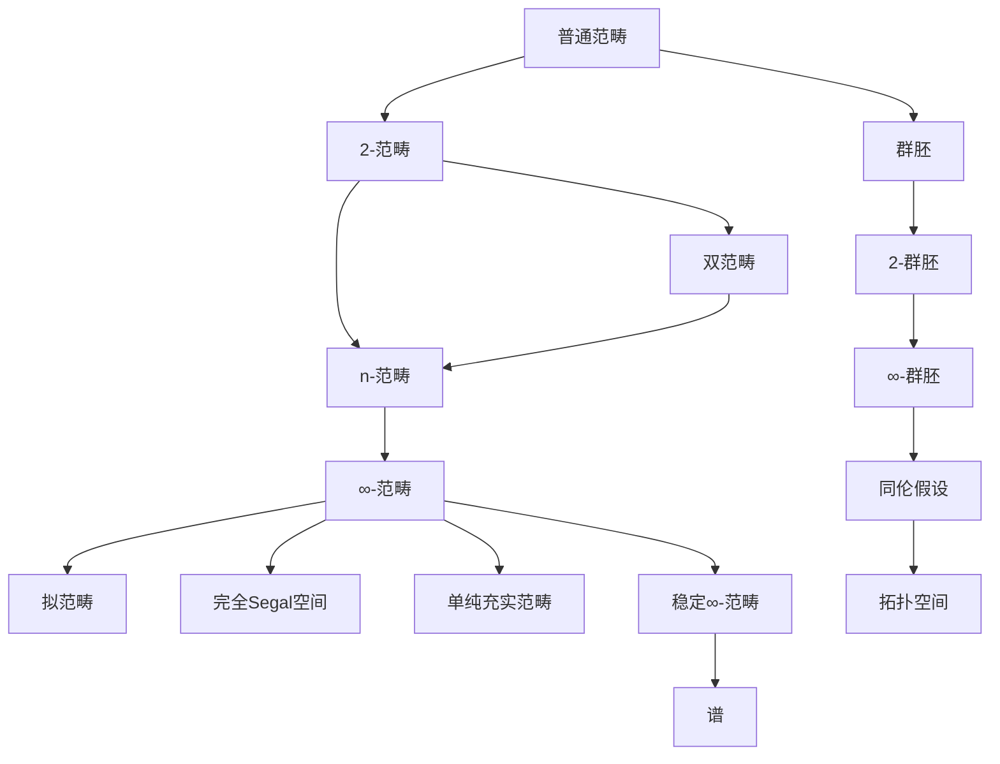

# 高阶范畴浅说 (Introduction to Higher Category Theory)

---

**文档编号**: FM-NLAB-HCT-001
**主题**: 高阶范畴论（基于nLab权威资源）
**MSC分类**: 18N60 (Higher Category Theory)
**创建日期**: 2026年4月9日
**版本**: 1.0

---

## 一、核心定义 (Core Definitions)

### 1.1 高阶范畴概述

**nLab标准定义**：
> **高阶范畴**是范畴论向"高维箭头"的推广。在普通范畴中，我们有：
>
> - 0-态射：对象
> - 1-态射：对象之间的箭头
>
> 在高阶范畴中，还有：
>
> - 2-态射：1-态射之间的箭头（2-胞腔）
> - 3-态射：2-态射之间的箭头
> - ...直到n-态射

### 1.2 (n,r)-范畴

**nLab精确定义**：
> 一个**$(n,r)$-范畴**是具有以下特性的高阶范畴：
>
> - 有 $k$-态射 对 $0 \leq k \leq n$
> - $k > r$ 的 $k$-态射都是可逆的（同构/等价）

**重要特例**：

| 记号 | 名称 | 特点 | nLab页面 |
|------|------|------|----------|
| $(n,n)$-category | n-范畴 | 最高非可逆n-态射 | n-category |
| $(n,0)$-category | n-群胚 | 所有 $k>0$ 态射可逆 | n-groupoid |
| $(\infty,0)$-category | $\infty$-群胚 | 无穷层次，全可逆 | infinity-groupoid |
| $(\infty,1)$-category | $\infty$-范畴 | 无穷层次，$k>1$ 可逆 | infinity-category |
| $(\infty,\infty)$-category | 无穷范畴 | 无限制 | strict infinity-category |

### 1.3 弱 vs 严格

**nLab区分**：

| 类型 | 定义 | 特点 |
|------|------|------|
| **严格** (Strict) | 所有结合律、交换律严格相等 | 简单但少见 |
| **弱** (Weak) | 结合律、交换律仅"同伦"或"等价" | 灵活且常见 |

**nLab评语**：
> "Nature is weak." — 自然界是弱的（指数学中的自然例子通常是弱高阶范畴）。

---

## 二、关键属性与结构 (Key Properties)

### 2.1 高阶范畴的周期表

**nLab - 高阶代数的"周期表"**：

|  | r=0 | r=1 | r=2 | ... |
|--|-----|-----|-----|-----|
| **n=0** | 集合 (Set) | 偏序集 (Poset) | 2-偏序集 | ... |
| **n=1** | 群胚 (Groupoid) | 范畴 (Category) | 双范畴 (Bicategory) | ... |
| **n=2** | 2-群胚 (2-Groupoid) | 2-范畴 (2-Category) | 三范畴 (Tricategory) | ... |
| **...** | ... | ... | ... | ... |
| **n=∞** | ∞-群胚 (Space) | ∞-范畴 (∞-Cat) | ... | ... |

### 2.2 同伦假设 (Homotopy Hypothesis)

**nLab陈述**（Grothendieck提出）：
> **同伦假设**：$\infty$-群胚与拓扑空间（模去弱同伦等价）等价。
>
> 形式化表述：
> $$\infty\text{-Groupoids} \simeq \text{Topological Spaces}$$

**意义**：

- 拓扑空间的同伦论可以完全用 $\infty$-群胚语言表达
- 这是HoTT的几何基础

### 2.3 稳定化假设 (Stabilization Hypothesis)

**nLab陈述**：
> 当 $n \to \infty$ 时，$(n+k, n)$-范畴的结构"稳定"，对应于**谱**（Spectra）和**稳定同伦论**。

---

## 三、重要示例 (Important Examples)

### 3.1 2-范畴 (2-Categories)

**nLab定义**：
> **2-范畴** $\mathcal{C}$ 包含：
>
> - 对象 $X, Y, Z, ...$
> - 1-态射 $f: X \to Y$（水平复合 $\circ$）
> - 2-态射 $\alpha: f \Rightarrow g$（垂直复合）
>
> 满足垂直/水平复合的交换律。

**经典示例**：

| 2-范畴 | 对象 | 1-态射 | 2-态射 |
|--------|------|--------|--------|
| **Cat** | 小范畴 | 函子 | 自然变换 |
| **Top** | 空间 | 连续映射 | 同伦类 |
| **MonCat** | 单范畴 | 单函子 | 单自然变换 |

### 3.2 双范畴 (Bicategories)

**nLab定义**：
> **双范畴**是弱2-范畴，其中结合律和单位律仅成立到"同构的2-态射"。

**Benabou的经典例子 - Span**：
>
> - 对象：集合
> - 1-态射 $A \to B$：span $A \leftarrow X \to B$
> - 2-态射：span之间的映射

### 3.3 $(\infty,1)$-范畴的模型

**nLab - 主要模型**：

| 模型 | 定义者 | 特点 |
|------|--------|------|
| **拟范畴** (Quasi-category) | Joyal, Lurie | 满足内角填充的单纯集 |
| **完全Segal空间** | Rezk | 满足Segal条件和完全性 |
| **单纯充实范畴** | Bergner |  enriching over simplicial sets |
| **相对范畴** | Barwick-Kan | 范畴 + 弱等价子范畴 |

#### 拟范畴 (Quasi-categories)

**nLab定义**（Joyal, Lurie）：
> **拟范畴**是满足**内角填充条件**的单纯集 $X$：
> 对任意 $0 < k < n$，每个内角可扩展到 $n$-单形。

**直观**：

- 0-单形：对象
- 1-单形：1-态射
- 2-单形：可复合的2-胞腔（显示结合律的同伦）

### 3.4 无穷群胚 ($\infty$-Groupoids)

**nLab定义**：
> **$\infty$-群胚**是所有 $k$-态射（$k \geq 1$）都是可逆的 $(\infty,0)$-范畴。

**Kan复形模型**：
> Kan复形是满足所有角填充条件的单纯集，精确地建模了 $\infty$-群胚。

---

## 四、核心定理 (Core Theorems)

### 4.1 模型范畴的等价性

**nLab定理**：
> 以下模型范畴是Quillen等价的（即建模相同的同伦论）：
>
> 1. 拟范畴（Joyal模型结构）
> 2. 完全Segal空间（Rezk模型结构）
> 3. 单纯充实范畴（Bergner模型结构）
> 4. 相对范畴（Barwick-Kan模型结构）

**意义**：
> 不同的模型提供了不同的计算优势，但描述相同的本质结构。

### 4.2 $(\infty,1)$-Yoneda引理

**nLab陈述**：
> 在$(\infty,1)$-范畴中，米田引理仍然成立：
> $$Map_{PSh(\mathcal{C})}(y(C), F) \simeq F(C)$$
> 其中 $Map$ 是映射空间（而非Hom-集）。

### 4.3 概念关系图



---

## 五、与其他概念的关系 (Relations)

### 5.1 与同伦类型论的关系

**nLab核心联系**：

| 高阶范畴论 | HoTT | 对应 |
|------------|------|------|
| $\infty$-群胚 | 类型 | 类型 = 弱 $\infty$-群胚 |
| $(\infty,1)$-范畴 | 预层类型 | 内部模型 |
| 极限/余极限 | 依赖积/和 | 伴随 |
| 对象分类器 | 单值宇宙 | 单值公理 |

**nLab定理**：
> HoTT是$(\infty,1)$-Topos的内部语言。

### 5.2 与导出代数几何的关系

**nLab联系**：
> 导出代数几何使用$(\infty,1)$-范畴论：
>
> - 导出范畴作为$(\infty,1)$-范畴
> - 叠（Stacks）作为函子 $CAlg^{cn} \to \mathcal{S}$（到$\infty$-群胚的函子）

### 5.3 与量子场论的关系

**nLab - 拓扑量子场论 (TQFT)**：
> **Cobordism假设**（Baez-Dolan, 由Lurie证明）：
> 完全扩展的TQFT由$(\infty,n)$-范畴 $  ext{Bord}_n$ 的表示完全确定。

---

## 六、思维导图 (Mind Map)

```mermaid
mindmap
  root((高阶范畴论))
    基础概念
      (n,r)-范畴
        n-范畴
        n-群胚
        ∞-范畴
        ∞-群胚
      弱vs严格
        弱高阶范畴
        严格高阶范畴
    核心假设
      同伦假设
        ∞-群胚=空间
      稳定化假设
        稳定同伦论
      去圈假设
        Delooping
    具体模型
      拟范畴
        Joyal模型
        内角填充
      完全Segal空间
        Rezk模型
      单纯充实范畴
        Bergner模型
      相对范畴
        Barwick-Kan
    应用
      同伦论
      代数几何
        导出代数几何
      数学基础
        HoTT
      量子场论
        TQFT
```

---

## 七、中英文术语对照 (Terminology)

| 中文 | English | nLab标准 | 符号 |
|------|---------|----------|------|
| 高阶范畴 | Higher Category | higher category | - |
| (n,r)-范畴 | (n,r)-category | (n,r)-category | - |
| n-范畴 | n-Category | n-category | - |
| n-群胚 | n-Groupoid | n-groupoid | - |
| ∞-范畴 | Infinity Category | infinity-category | ∞-Cat |
| ∞-群胚 | Infinity Groupoid | infinity-groupoid | ∞-Grpd |
| 2-范畴 | 2-Category | 2-category | - |
| 双范畴 | Bicategory | bicategory | - |
| 拟范畴 | Quasi-category | quasi-category | - |
| Segal空间 | Segal Space | Segal space | - |
| 完全Segal空间 | Complete Segal Space | complete Segal space | - |
| 单纯集 | Simplicial Set | simplicial set | Δ^op → Set |
| Kan复形 | Kan Complex | Kan complex | - |
| k-态射 | k-Morphism | k-morphism | - |
| 水平复合 | Horizontal Composition | horizontal composition | ∘ |
| 垂直复合 | Vertical Composition | vertical composition | · |
| 同伦假设 | Homotopy Hypothesis | homotopy hypothesis | - |
| 稳定化 | Stabilization | stabilization | - |
| 去圈 | Delooping | delooping | B |
| 叠 | Stack | stack | - |
| 导出叠 | Derived Stack | derived stack | - |

---

## 八、FormalMath链接 (Links)

### 8.1 内部文档链接

| 主题 | FormalMath文档路径 |
|------|-------------------|
| 范畴论入门 | ../01-基础数学/范畴论入门/01-范畴论入门-增强版.md |
| 同伦类型论 | ./05-同伦类型论导论.md |
| 导出代数几何 | ../00-知识层次体系/L4-前沿研究层/01-代数几何前沿/03-导出代数几何.md |
| nLab范畴论对齐报告 | ../../00-nLab范畴论对齐报告.md |

### 8.2 相关概念链接

- [范畴论精粹](./04-nLab范畴论精粹.md)
- [同伦类型论导论](./05-同伦类型论导论.md)
- [导出范畴入门](./07-导出范畴入门.md)

---

## 九、nLab参考资源 (References)

### 9.1 nLab核心页面

1. **Higher Category Theory**: https://ncatlab.org/nlab/show/higher+category+theory
2. **(n,r)-Category**: https://ncatlab.org/nlab/show/(n,r)-category
3. **Infinity-Category**: https://ncatlab.org/nlab/show/infinity-category
4. **Quasi-category**: https://ncatlab.org/nlab/show/quasi-category
5. **Infinity-Groupoid**: https://ncatlab.org/nlab/show/infinity-groupoid
6. **Homotopy Hypothesis**: https://ncatlab.org/nlab/show/homotopy+hypothesis
7. **Bicategory**: https://ncatlab.org/nlab/show/bicategory
8. **2-Category**: https://ncatlab.org/nlab/show/2-category

### 9.2 推荐文献

1. **Lurie, J.** (2009). *Higher Topos Theory*. Princeton University Press.
2. **Lurie, J.** (2017). *Higher Algebra*.
3. **Cisinski, D.-C.** (2019). *Higher Categories and Homotopical Algebra*.
4. **Riehl, E. & Verity, D.** (2022). *Elements of ∞-Category Theory*.
5. **Leinster, T.** (2004). *Higher Operads, Higher Categories*.
6. **Baez, J. & Dolan, J.** (1995). Higher-dimensional algebra and topological quantum field theory.

---

**文档状态**: ✅ 完成
**最后更新**: 2026年4月9日
**nLab对齐版本**: 2026年4月
