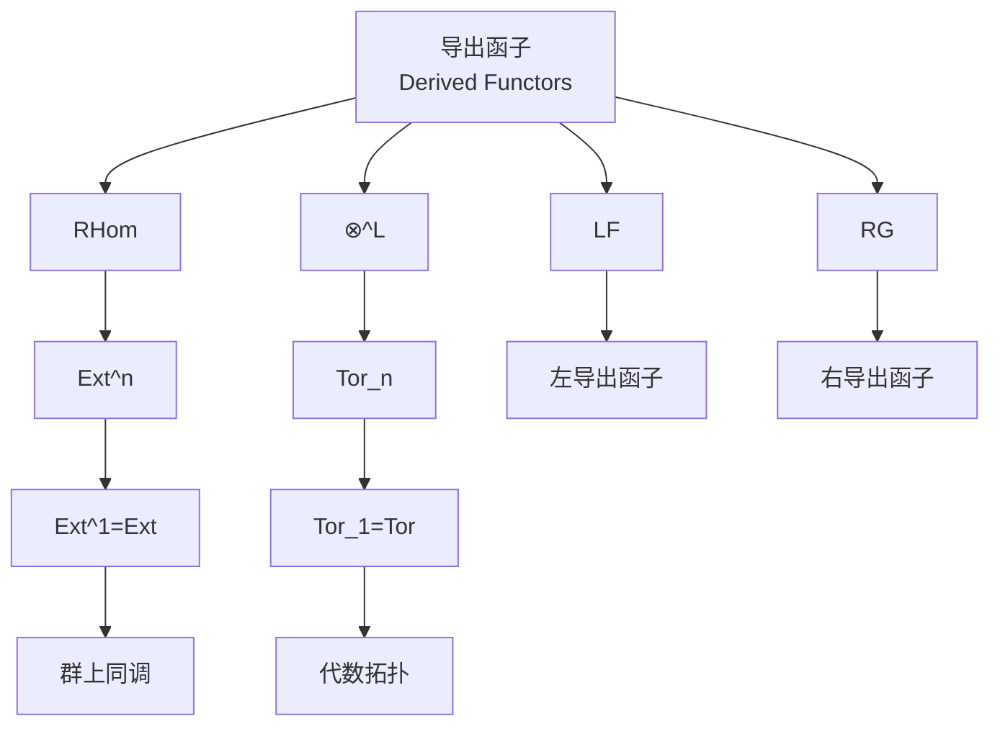
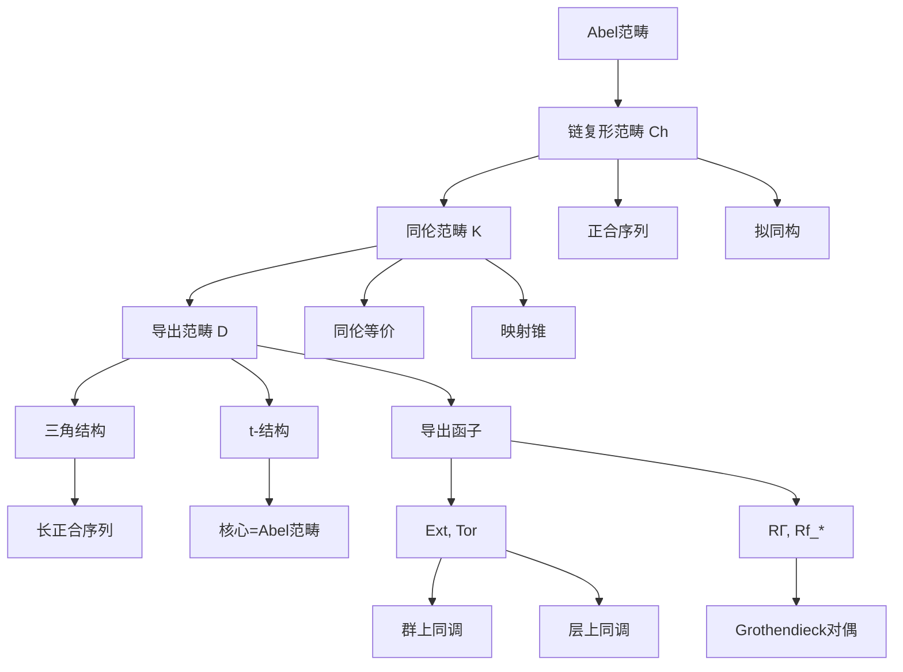
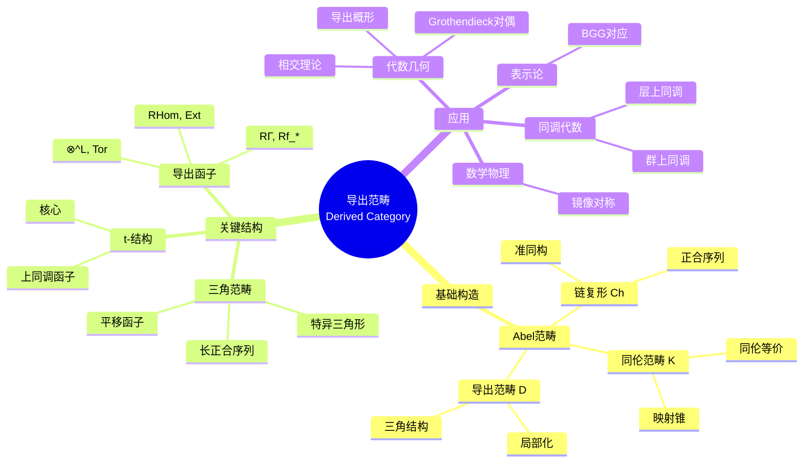

# 导出范畴入门 (Introduction to Derived Categories)

---

**文档编号**: FM-NLAB-DER-001  
**主题**: 导出范畴（基于nLab权威资源）  
**MSC分类**: 18G80 (Derived Categories), 14F08 (Derived Categories in Algebraic Geometry)  
**创建日期**: 2026年4月9日  
**版本**: 1.0

---

## 一、核心定义 (Core Definitions)

### 1.1 导出范畴概述

**nLab标准定义**：
> **导出范畴** $D(\mathcal{A})$ 是Abel范畴 $\mathcal{A}$ 的链复形范畴 $Ch(\mathcal{A})$ 在同调等价（准同构）下的局部化。
>
> 形式化表述：
> $$D(\mathcal{A}) := Ch(\mathcal{A})[W^{-1}]$$
> 其中 $W$ 是准同构的类。

**核心洞见**：
> 导出范畴"遗忘"了同调等价的细节，保留了同调本质。

### 1.2 链复形与准同构

**nLab定义**：

**链复形** (Chain Complex)：
> 序列 $(C_\bullet, d)$：
> $$... \xrightarrow{d_{n+1}} C_n \xrightarrow{d_n} C_{n-1} \xrightarrow{d_{n-1}} ...$$
> 满足 $d_{n} \circ d_{n+1} = 0$（即 $Im(d_{n+1}) \subseteq Ker(d_n)$）

**准同构** (Quasi-isomorphism)：
> 链映射 $f: C_\bullet \to D_\bullet$ 是**准同构**，如果它在同调上诱导同构：
> $$H_n(f): H_n(C_\bullet) \xrightarrow{\cong} H_n(D_\bullet) \quad \forall n$$

### 1.3 有界性

**nLab分类**：

| 记号 | 名称 | 定义 |
|------|------|------|
| $Ch(\mathcal{A})$ | 链复形 | 无限制 |
| $Ch^+(\mathcal{A})$ | 下有界 | $C_n = 0$ 对 $n \ll 0$ |
| $Ch^-(\mathcal{A})$ | 上有界 | $C_n = 0$ 对 $n \gg 0$ |
| $Ch^b(\mathcal{A})$ | 有界 | 同时有上下界 |
| $D(\mathcal{A})$ | 导出范畴 | $Ch(\mathcal{A})[q.iso^{-1}]$ |
| $D^+(\mathcal{A})$ | 下有界导出 | $Ch^+(\mathcal{A})[q.iso^{-1}]$ |
| $D^-(\mathcal{A})$ | 上有界导出 | $Ch^-(\mathcal{A})[q.iso^{-1}]$ |
| $D^b(\mathcal{A})$ | 有界导出 | $Ch^b(\mathcal{A})[q.iso^{-1}]$ |

---

## 二、关键属性与结构 (Key Properties)

### 2.1 三角结构 (Triangulated Structure)

**nLab定义**：
> 导出范畴 $D(\mathcal{A})$ 具有**三角范畴**结构：
> - **平移函子** $[1]$：$C[1]_n = C_{n-1}$，$d_{C[1]} = -d_C$
> - **特异三角形**（Distinguished Triangles）：与短正合序列对应的三角形

**nLab - 同伦范畴 vs 导出范畴**：

```
Ch(A) ──→ K(A) ──→ D(A)
           │        │
           │        └── 关于准同构的局部化
           └── 同伦等价下的商
```

| 范畴 | 对象 | 态射 | nLab页面 |
|------|------|------|----------|
| $Ch(\mathcal{A})$ | 链复形 | 链映射 | chain complex |
| $K(\mathcal{A})$ | 链复形 | 链映射的同伦类 | homotopy category of chain complexes |
| $D(\mathcal{A})$ | 链复形 |  roofs / 局部化后的态射 | derived category |

### 2.2 导出Hom与导出张量积

**nLab定义**：

**导出Hom** (RHom)：
> $$RHom(C_\bullet, D_\bullet) := Hom^\bullet(C_\bullet, I^\bullet)$$
> 其中 $D_\bullet \to I^\bullet$ 是内射分解。

**导出张量积** (Derived Tensor Product)：
> $$C_\bullet \otimes^L D_\bullet := P_\bullet \otimes D_\bullet$$
> 其中 $P_\bullet \to C_\bullet$ 是投射分解。

**nLab - 导出函子关系图**：



### 2.3 t-结构 (t-Structures)

**nLab定义**（Beilinson-Bernstein-Deligne）：
> **t-结构**是三角范畴 $D$ 中的对 $D^{\leq 0}, D^{\geq 0}$，满足：
> 1. $D^{\leq 0}[1] \subseteq D^{\leq 0}$
> 2. $D^{\geq 0}[-1] \subseteq D^{\geq 0}$
> 3. $Hom(D^{\leq 0}, D^{\geq 0}[-1]) = 0$
> 4. 对任意 $X \in D$，存在特异三角形 $A \to X \to B \to$ 其中 $A \in D^{\leq 0}, B \in D^{\geq 0}[-1]$

**nLab - 标准t-结构**：
> $D^{\leq 0}(\mathcal{A}) = \{C_\bullet | H_n(C_\bullet) = 0 \text{ for } n > 0\}$
> $D^{\geq 0}(\mathcal{A}) = \{C_\bullet | H_n(C_\bullet) = 0 \text{ for } n < 0\}$

**核心对象**：
- **核心**（Heart）：$D^{\leq 0} \cap D^{\geq 0} \cong \mathcal{A}$
- **上同调函子**：$H^0: D \to \mathcal{A}$

---

## 三、重要示例 (Important Examples)

### 3.1 代数几何中的导出范畴

**nLab核心示例**：

| 范畴 | 对象 | 应用 |
|------|------|------|
| $D^b_{coh}(X)$ | 凝聚层的有界导出范畴 | 相交理论 |
| $D_{qcoh}(X)$ | 拟凝聚层的导出范畴 | 导出代数几何 |
| $D^b(X)$ | 导出范畴（层） | 奇点理论 |
| $D_{perf}(X)$ | 完美复形 | K-理论 |

**nLab - 导出代数几何视角**：
> 导出概形（Derived Scheme）的"函数"不仅仅是层，而是复形。

### 3.2 同调代数中的Ext与Tor

**nLab定义**：

**Ext函子**：
> $$Ext^n_A(M, N) := R^nHom_A(M, N) = H^n(RHom_A(M, N))$$

**Tor函子**：
> $$Tor_n^A(M, N) := L_n(M \otimes_A N) = H_n(M \otimes^L N)$$

**nLab - 长正合序列**：
> 导出函子给出连接同态的长正合序列，这是同调代数的基本工具。

### 3.3 层上同调

**nLab定义**：
> 对拓扑空间 $X$ 上的Abel群层 $\mathcal{F}$：
> $$H^n(X, \mathcal{F}) := R^n\Gamma(X, \mathcal{F})$$
> 其中 $\Gamma(X, -)$ 是全局截面函子。

**nLab - 导出视角**：
> $$R\Gamma(X, \mathcal{F}^\bullet) \in D(Ab)$$
> 这是Grothendieck对代数几何中上同调理论的革命性贡献。

---

## 四、核心定理 (Core Theorems)

### 4.1 导出范畴的基本性质

**nLab - 关键定理**：

| 定理 | 陈述 | 意义 |
|------|------|------|
| **同调长正合序列** | 特异三角形诱导同调长正合序列 | 同调代数基础 |
| **局部化泛性质** | 导出范畴是使准同构可逆的泛范畴 | 范畴论定义 |
| **内射/投射分解** | $D^+(\mathcal{A}) \cong K^+(Inj)$, $D^-(\mathcal{A}) \cong K^-(Proj)$ | 计算导出函子 |
| **Grothendieck对偶** | 对适当态射 $f$，$Rf_*$ 有右伴随 | 对偶理论 |

### 4.2 Grothendieck对偶

**nLab陈述**：
> 对适当态射 $f: X \to Y$（光滑簇），有：
> $$Rf_* R\mathcal{H}om_X(\mathcal{F}^\bullet, f^!\mathcal{G}^\bullet) \cong R\mathcal{H}om_Y(Rf_*\mathcal{F}^\bullet, \mathcal{G}^\bullet)$$
> 其中 $f^!$ 是例外逆像函子。

**nLab - 特殊情况（Serre对偶）**：
> 对光滑射影簇 $X$，$dim(X) = n$：
> $$H^i(X, \mathcal{F})^\vee \cong H^{n-i}(X, \mathcal{F}^\vee \otimes \omega_X)$$

### 4.3 概念关系图



---

## 五、与其他概念的关系 (Relations)

### 5.1 与高阶范畴论的关系

**nLab - 导出范畴作为$(\infty,1)$-范畴**：

| 角度 | 三角范畴 | $(\infty,1)$-范畴 |
|------|----------|-------------------|
| 层次 | 经典 | 高阶 |
| 同伦信息 | 丢失高阶 | 保留高阶 |
| 应用 | 计算方便 | 理论统一 |

**nLab定理**：
> 稳定$(\infty,1)$-范畴的homotopy范畴是三角范畴。

### 5.2 与导出代数几何的关系

**nLab - 导出叠 (Derived Stacks)**：
> 导出叠是函子 $X: CAlg^{cn} \to \mathcal{S}$（到$\infty$-群胚）。
> 其"坐标环"是导出环（simplicial commutative rings / E_∞-rings）。

**nLab - 应用**：
> - 相交理论：导出纤维积给出正确的相交重数
> - 形变理论：导出切空间

### 5.3 与表示论的关系

**nLab - 导出表示论**：
> $D^b(Rep(G))$：群表示的有界导出范畴
> - BGG对应：$D^b(O_\lambda) \cong D^b(Coh(\mathcal{B}))$

---

## 六、思维导图 (Mind Map)



---

## 七、中英文术语对照 (Terminology)

| 中文 | English | nLab标准 | 符号 |
|------|---------|----------|------|
| 导出范畴 | Derived Category | derived category | D(A) |
| 链复形 | Chain Complex | chain complex | C_• |
| 上链复形 | Cochain Complex | cochain complex | C^• |
| 准同构 | Quasi-isomorphism | quasi-isomorphism | q.iso |
| 同伦范畴 | Homotopy Category | homotopy category | K(A) |
| 同伦 | Homotopy | homotopy | ≃ |
| 三角范畴 | Triangulated Category | triangulated category | - |
| 特异三角形 | Distinguished Triangle | distinguished triangle | →→→[1] |
| t-结构 | t-Structure | t-structure | - |
| 核心 | Heart | heart | - |
| 导出函子 | Derived Functor | derived functor | RF, LG |
| RHom | Right Derived Hom | right derived hom | RHom |
| 导出张量积 | Derived Tensor Product | derived tensor product | ⊗^L |
| Ext | Ext Functor | Ext functor | Ext^n |
| Tor | Tor Functor | Tor functor | Tor_n |
| 投射分解 | Projective Resolution | projective resolution | P_• → M |
| 内射分解 | Injective Resolution | injective resolution | M → I^• |
| 层上同调 | Sheaf Cohomology | sheaf cohomology | H^n(X, F) |
| 完美复形 | Perfect Complex | perfect complex | - |

---

## 八、FormalMath链接 (Links)

### 8.1 内部文档链接

| 主题 | FormalMath文档路径 |
|------|-------------------|
| 同调代数理论 | ../00-知识层次体系/L3-理论建构层/01-代数方向/02-同调代数理论.md |
| 导出代数几何 | ../00-知识层次体系/L4-前沿研究层/01-代数几何前沿/03-导出代数几何.md |
| 代数几何基础 | ../00-知识层次体系/L3-理论建构层/01-代数方向/01-代数几何基础理论.md |
| 层上同调 | ../00-工作示例库/03-分析学/11-层上同调计算-仿射概形-工作示例.md |
| Ext与Tor | ../00-工作示例库/03-分析学/12-导出函子与Ext计算-工作示例.md |

### 8.2 相关概念链接

- [nLab范畴论精粹](./04-nLab范畴论精粹.md)
- [同伦类型论导论](./05-同伦类型论导论.md)
- [高阶范畴浅说](./06-高阶范畴浅说.md)

---

## 九、Lean 4形式化参考 (Lean 4 Formalization)

### 9.1 Mathlib4中的导出范畴

```lean
-- 链复形
structure ChainComplex (V : Type*) [Category V] where
  X : ℤ → V
  d (i : ℤ) : X i ⟶ X (i - 1)
  d_comp_d' : ∀ i, d (i - 1) ∘ d i = 0

-- 同调
def Homology (C : ChainComplex V) (i : ℤ) : V :=
  -- 实现依赖于范畴V的性质
  
-- 准同构
def IsQuasiIso {C D : ChainComplex V} (f : C ⟶ D) : Prop :=
  ∀ i, IsIso (homologyMap f i)

-- 导出范畴（概念性表示）
-- 实际构造需要局部化技术
def DerivedCategory (V : Type*) [Abelian V] :=
  Localization (ChainComplex V) (QuasiIso V)
```

### 9.2 形式化资源

| 资源 | 链接 | 说明 |
|------|------|------|
| Mathlib4 Homological Algebra | https://leanprover-community.github.io/mathlib4_docs/Mathlib/Algebra/Homology/ | Mathlib4同调代数 |
| Stacks Project | https://stacks.math.columbia.edu/tag/05QI | 导出范畴 |
| Kerodon | https://kerodon.net/tag/00VG | Lurie的高阶范畴论 |

---

## 十、nLab参考资源 (References)

### 10.1 nLab核心页面

1. **Derived Category**: https://ncatlab.org/nlab/show/derived+category
2. **Triangulated Category**: https://ncatlab.org/nlab/show/triangulated+category
3. **Quasi-isomorphism**: https://ncatlab.org/nlab/show/quasi-isomorphism
4. **Derived Functor**: https://ncatlab.org/nlab/show/derived+functor
5. **t-Structure**: https://ncatlab.org/nlab/show/t-structure
6. **Ext**: https://ncatlab.org/nlab/show/Ext
7. **Tor**: https://ncatlab.org/nlab/show/Tor
8. **Sheaf Cohomology**: https://ncatlab.org/nlab/show/sheaf+cohomology
9. **Grothendieck Duality**: https://ncatlab.org/nlab/show/Grothendieck+duality

### 10.2 推荐文献

1. **Verdier, J.-L.** (1963). Des categories derivees des categories abeliennes. (博士论文)
2. **Hartshorne, R.** (1966). *Residues and Duality*.
3. **Gelfand, S. & Manin, Y.** (2003). *Methods of Homological Algebra* (2nd ed.). Springer.
4. **Weibel, C.** (1994). *An Introduction to Homological Algebra*. Cambridge.
5. **Huybrechts, D.** (2006). *Fourier-Mukai Transforms in Algebraic Geometry*.
6. **Kashiwara, M. & Schapira, P.** (1990). *Sheaves on Manifolds*.

---

**文档状态**: ✅ 完成  
**最后更新**: 2026年4月9日  
**nLab对齐版本**: 2026年4月
