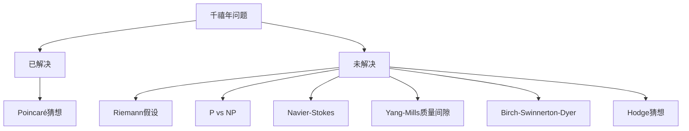
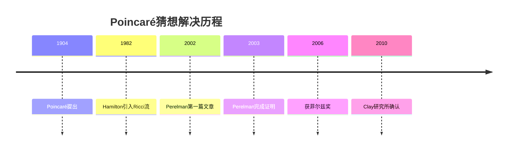
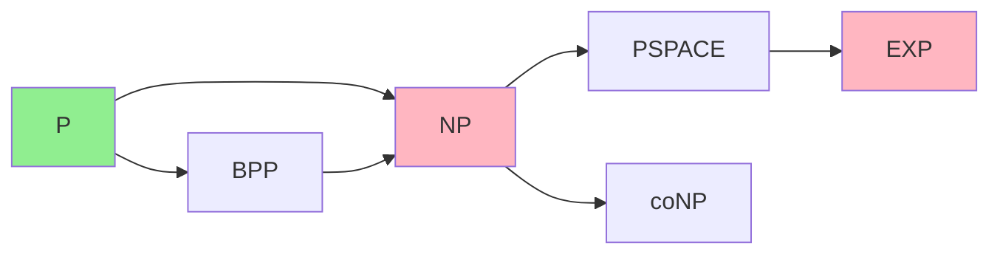
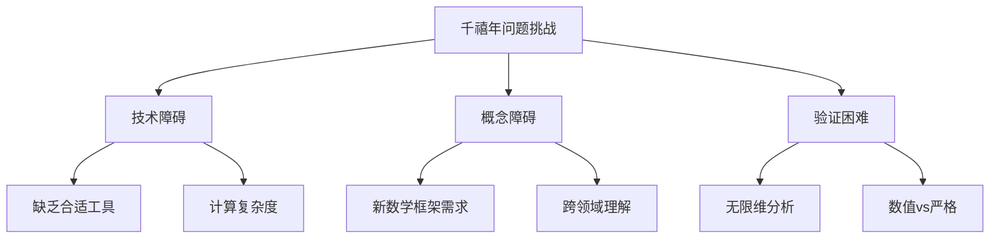

# 千禧年问题研究进展

## 概述

2000年5月，克雷数学研究所（Clay Mathematics Institute）公布了七个千禧年大奖难题，每个问题的解决将获得100万美元奖金。这些问题涵盖了数学的核心领域，代表了人类知识的前沿边界。本报告追踪截至2026年的研究进展。

---

## 七个千禧年问题概览

### 状态汇总表

| 问题 | 领域 | 状态 | 难度评估 |
|------|------|------|----------|
| Poincaré猜想 | 几何拓扑 | ✅ 已解决 | 极高 |
| Riemann假设 | 解析数论 | ❌ 开放 | 极高 |
| P vs NP | 计算理论 | ❌ 开放 | 极高 |
| Navier-Stokes | 偏微分方程 | ❌ 开放 | 极高 |
| Yang-Mills质量间隙 | 数学物理 | ❌ 开放 | 极高 |
| Birch-Swinnerton-Dyer | 算术几何 | ❌ 部分进展 | 极高 |
| Hodge猜想 | 代数几何 | ❌ 开放 | 极高 |

---

## 1. Poincaré猜想 ✅

### 问题解决

**解决者**：Grigori Perelman（俄罗斯）

**解决时间**：2002-2003年

**证明方法**：Ricci流与Surgery理论

### 技术概要

**核心突破**：

- 引入**约化体积**（Reduced Volume）概念
- 证明**非塌缩定理**（Non-collapsing Theorem）
- 完成**κ-解的分类**
- 建立完整的**Ricci流Surgery**理论

### 影响与意义

1. **几何化猜想**：Poincaré猜想的解决同时证明了Thurston几何化猜想
2. **3维拓扑**：彻底改变3维流形的分类理论
3. **Ricci流**：引发几何分析的新浪潮
4. **Perelman**：拒绝菲尔兹奖和百万奖金，成为数学传奇

### 延伸阅读

- [Poincaré猜想的历史证明路径](../04-习题与练习/20-Poincaré猜想的历史证明路径.md)
- [几何分析前沿问题](../04-习题与练习/16-几何分析前沿问题.md)

---

## 2. Riemann假设 ❌

### 问题陈述

黎曼ζ函数的非平凡零点都位于临界线 $\text{Re}(s) = 1/2$ 上。

### 研究进展

#### 零点计数成果

| 数学家 | 年份 | 成果 |
|--------|------|------|
| Hardy | 1914 | 证明无穷多零点在临界线上 |
| Selberg | 1942 | 证明正比例零点在临界线上 |
| Levinson | 1974 | 至少1/3的零点在临界线上 |
| Conrey | 1989 | 至少40%的零点在临界线上 |
| Feng | 2012 | 至少41%的零点在临界线上 |

#### 数值验证

| 年份 | 研究者 | 验证零点数 |
|------|--------|-----------|
| 1986 | van de Lune | 1.5亿 |
| 2001 | Odlyzko | 200亿 |
| 2004 | Gourdon | 10万亿 |

所有验证的零点都在临界线上。

### 等价形式与相关猜想

**等价形式**：

- Mertens函数的界
- Liouville函数的求和
- Farey序列的分布
- 素数间隙的界

**相关猜想**：

- **广义黎曼假设（GRH）**：Dirichlet L-函数的零点
- **Grand Riemann Hypothesis**：更广泛的L-函数类

### 现代方法探索

1. **随机矩阵理论**：Montgomery-Odlyzko定律
2. **Hilbert-Pólya猜想**：寻找自伴算子
3. **非交换几何**：Connes的adelic方法
4. **量子混沌**：Berry-Keating猜想

### 延伸阅读

- [黎曼假设等价形式](../04-习题与练习/19-黎曼假设等价形式.md)

---

## 3. P vs NP ❌

### 问题陈述

是否所有可以被快速验证的问题都可以被快速解决？形式化：$P = NP$ 还是 $P \neq NP$？

### 当前认知

### 研究进展

#### 复杂性理论成果

| 结果 | 作者 | 年份 | 意义 |
|------|------|------|------|
| 相对分离 | Baker-Gill-Solovay | 1975 | 对角线法不足以解决 |
| 电路下界 | Razborov-Smolensky | 1980s | 自然证明障碍 |
| 几何复杂性 | Mulmuley-Sohoni | 2001 | 新途径 |
| 图同构 | Babai | 2015 | 准多项式算法 |

#### 近似算法进展

对于NP难问题，近似算法的研究取得重大进展：

- **Max-Cut**：Goemans-Williamson达到0.878近似比
- **Vertex Cover**：2-近似算法
- **TSP**：Christofides的1.5-近似

### 障碍结果

**自然证明障碍**（Razborov-Rudich, 1994）：
大多数"自然"的证明技术无法分离P和NP。

**相对论化障碍**（Baker-Gill-Solovay）：
存在谕示 $A$ 使 $P^A = NP^A$，也存在 $B$ 使 $P^B \neq NP^B$。

### 现代研究方向

1. **电路复杂性**：证明特定函数需要大电路
2. **证明复杂性**：研究证明系统的能力
3. **代数复杂性**：Mulmuley-Sohoni的几何复杂性理论
4. **平均情形复杂性**：研究问题的"典型"难度

---

## 4. Navier-Stokes方程 ❌

### 问题陈述

在3维空间中，Navier-Stokes方程是否存在光滑全局解？或是否存在有限时间爆破的解？

### 方程形式

$$\frac{\partial u}{\partial t} + (u \cdot \nabla)u = \nu \Delta u - \nabla p + f$$
$$\nabla \cdot u = 0$$

### 研究进展

#### 维数对比

| 维度 | 状态 | 关键结果 |
|------|------|----------|
| 2D | ✅ 已解决 | Leray (1934)：全局存在性 |
| 3D | ❌ 开放 | 部分正则性定理 |
| 轴向对称 | 部分进展 | 无swirl情形解决 |

#### 重要定理

**Leray弱解**（1934）：
存在满足能量不等式的全局弱解。

**Caffarelli-Kohn-Nirenberg部分正则性**（1982）：
奇异集的1维Hausdorff测度为零。

**Tao的有限时间爆破模型**（2014）：
构造了一个平均化的Navier-Stokes模型，在其中证明爆破。

### 研究方向

1. **弱解的正则性**：Leray-Hopf弱解是否唯一？
2. **特殊对称性**：轴对称、螺旋对称情形
3. **小初值理论**：小数据的全局存在性
4. **数值模拟**：计算验证和启发

### 相关奖项

- **Oseen奖**：瑞典皇家科学院颁发
- **Smale问题**：Navier-Stokes被列为21世纪数学问题

---

## 5. Yang-Mills质量间隙 ❌

### 问题陈述

证明对于紧单纯李群 $G$，$\mathbb{R}^4$ 上的Yang-Mills理论存在质量间隙 $\Delta > 0$：

$$\Delta = \inf \text{spec}(H) \setminus \{0\} > 0$$

其中 $H$ 是量子哈密顿量。

### 物理背景

**Yang-Mills理论**是粒子物理标准模型的数学基础，描述了强相互作用、弱相互作用和电磁相互作用。

**质量间隙**意味着：

- 存在最小质量粒子（胶球）
- 解释了强相互作用的短程性
- 与夸克禁闭相关

### 研究进展

#### 数学严格结果

| 维度 | 结果 | 作者 |
|------|------|------|
| 2D | 严格构造 | Balaban, Magnen等 |
| 3D | 部分结果 | Balaban, Rivasseau |
| 4D | 大规模开放 | - |

#### 格点规范理论

**Wilson格点理论**：
将连续时空离散化，进行数值计算。

**数值结果**：

- 质量间隙的数值估计存在
- 与实验数据一致
- 但缺乏严格数学证明

### 挑战

1. **重整化**：处理紫外发散
2. **渐近自由**：耦合常数随能量变化
3. **禁闭**：证明色单态约束
4. **非微扰效应**：瞬子等拓扑对象

### 相关领域

- [数学物理交叉问题](../04-习题与练习/18-数学物理交叉问题.md)

---

## 6. Birch-Swinnerton-Dyer猜想 ❌

### 问题陈述

设 $E$ 是定义在 $\mathbb{Q}$ 上的椭圆曲线，则：

$$\text{rank } E(\mathbb{Q}) = \text{ord}_{s=1} L(E, s)$$

即椭圆曲线的有理点群的秩等于其L-函数在 $s=1$ 处的零点阶数。

### 研究进展

#### 已知结果

| 情形 | 状态 | 证明者 |
|------|------|--------|
| rank = 0 | ✅ 解决 | Coates-Wiles, Rubin |
| rank = 1 | ✅ 解决 | Gross-Zagier, Kolyvagin |
| rank ≥ 2 | ❌ 开放 | - |

#### Coates-Wiles定理（1977）

对于具有复乘法的椭圆曲线，若 $L(E, 1) \neq 0$，则 rank = 0。

#### Gross-Zagier公式（1986）

$$L'(E, 1) = \frac{\Omega_E \cdot \langle P_K, P_K \rangle}{[E(K): \mathbb{Z}P_K]^2} \cdot \frac{h_K}{w_K}$$

建立了导数与Heegner点高度的联系。

### BSD精确公式

$$\frac{L^{(r)}(E, 1)}{r!} = \frac{\Omega_E \cdot \text{Reg}_E \cdot |Ш_E| \cdot \prod_p c_p}{|E(\mathbb{Q})_{\text{tors}}|^2}$$

### 现代进展

1. **p-进BSD理论**：Mazur-Swinnerton-Dyer, Perrin-Riou
2. **Iwasawa理论**：Main Conjecture的推广
3. **欧拉系统**：Kolyvagin, Kato的方法
4. **数值验证**：Stein-Wuthrich对大量曲线的验证

### 延伸阅读

- [算术几何未解难题](../04-习题与练习/17-算术几何未解难题.md)

---

## 7. Hodge猜想 ❌

### 问题陈述

设 $X$ 是光滑复射影簇，$H^{p,q}(X)$ 是Hodge分解的分量。若 $\alpha \in H^{2k}(X, \mathbb{Q}) \cap H^{k,k}(X)$ 是有理Hodge类，则 $\alpha$ 是代数闭链类的有理线性组合。

### 通俗解释

**核心问题**：哪些拓扑信息来自代数几何？

**Hodge猜想断言**：对于特定类型的上同调类，答案是"全部"。

### 研究进展

#### 已知情形

| 维数 | 度数 | 状态 | 证明者 |
|------|------|------|--------|
| 任意 | 0, 2n | 平凡 | - |
| n=1 | 曲线 | 解决 | Lefschetz (1,1) 定理 |
| n=2 | 曲面 | 部分进展 | 对特定类解决 |
| 任意 | 1, 2n-1 | 解决 | Lefschetz |

#### Lefschetz (1,1) 定理

对于 $H^2$，Hodge猜想是正确的：
$$H^{1,1}(X) \cap H^2(X, \mathbb{Q}) = \text{Pic}(X) \otimes \mathbb{Q}$$

#### Tate猜想的类比

对于有限域上的簇，Tate猜想是类似的陈述。在部分情形已证明（Tate, Deligne, Faltings）。

### 现代研究方向

1. **Motives理论**：Grothendieck的统一框架
2. **超越方法**：利用Hodge理论的超越性质
3. **算术方面**：与BSD猜想、Tate猜想的联系
4. **范畴化方法**：导出范畴和稳定性条件

### 相关猜想

- **标准猜想**（Grothendieck）：蕴含Weil猜想和Hodge猜想
- **Tate猜想**：有限域上的类比
- **Bloch-Beilinson猜想**：关于代数闭链的更精细猜想

---

## 研究方法与启示

### 成功解决的共同特征

已解决的Poincaré猜想提供了重要启示：

1. **新工具的开发**：Ricci流技术
2. **跨学科融合**：几何、分析、拓扑
3. **长期积累**：Hamilton的20年工作基础
4. **突破性洞察**：Perelman的关键创新

### 开放问题的挑战

### 未来展望

**最有希望突破的问题**（专家评估）：

1. **BSD猜想**：已有大量部分结果
2. **Navier-Stokes**：数值和特殊情形进展
3. **Yang-Mills**：格点理论的启发

**长期开放问题**：

- Riemann假设：虽有进展但无明确路径
- P vs NP：面临根本性障碍
- Hodge猜想：需要新的代数几何工具

---

## 相关资源

### 官方资源

- **Clay Mathematics Institute**：www.claymath.org
- **千禧年问题官方描述**：各问题的详细陈述

### 推荐读物

1. J. Carlson et al., "The Millennium Prize Problems" (2006)
2. K. Devlin, "The Millennium Problems" (2002)
3. D. Mackenzie, "What's Happening in the Mathematical Sciences"

### 相关习题集

- [朗兰兹纲领探索性问题](../04-习题与练习/15-朗兰兹纲领探索性问题.md)
- [几何分析前沿问题](../04-习题与练习/16-几何分析前沿问题.md)
- [算术几何未解难题](../04-习题与练习/17-算术几何未解难题.md)
- [数学物理交叉问题](../04-习题与练习/18-数学物理交叉问题.md)
- [黎曼假设等价形式](../04-习题与练习/19-黎曼假设等价形式.md)
- [Poincaré猜想的历史证明路径](../04-习题与练习/20-Poincaré猜想的历史证明路径.md)

---

## 总结

千禧年问题代表了数学的最高挑战：

- **1个已解决**：Poincaré猜想（Perelman）
- **6个待攻克**：每个都可能需要革命性的新思想
- **共同特点**：都需要深度、广度和创新的完美结合

这些问题的研究已经推动了数学的巨大进步，无论最终解决与否，它们将继续指引数学发展的方向。

---

*本报告最后更新：2026年4月*
*数据来源：Clay Mathematics Institute, arXiv, MathSciNet*
