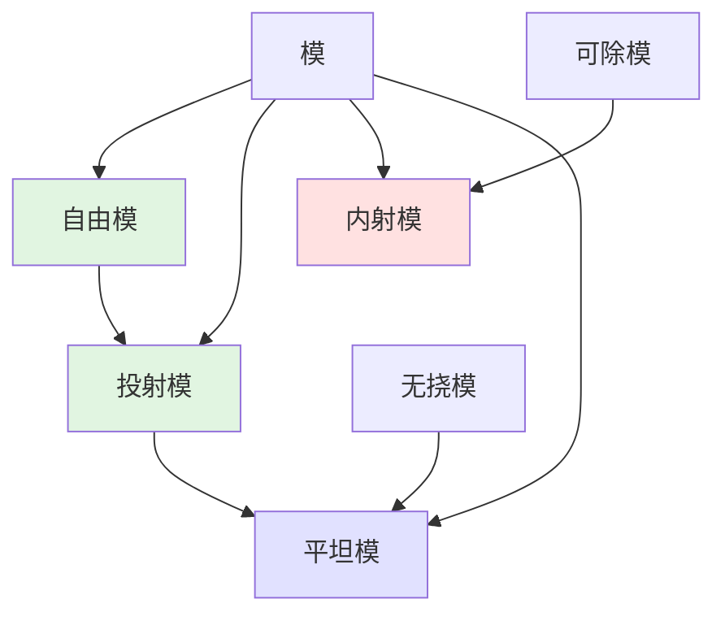
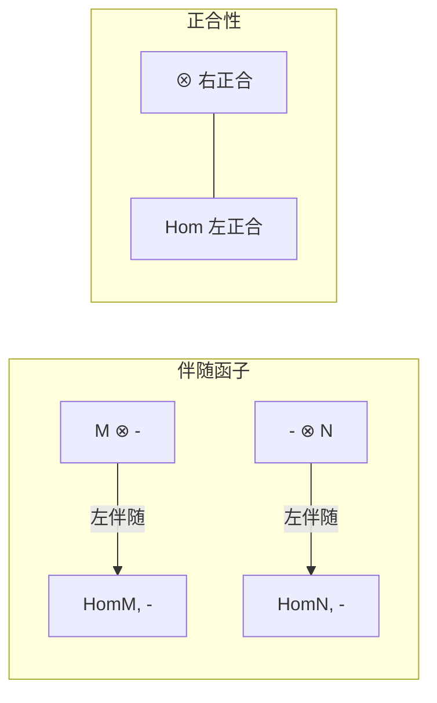
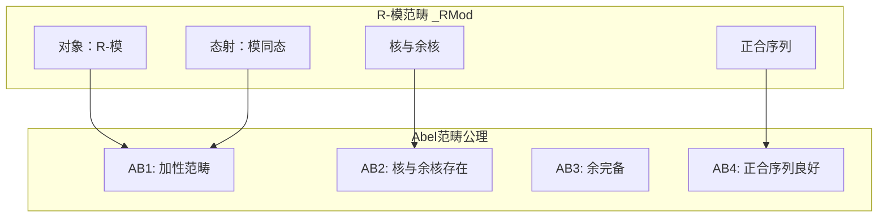

# 模论基础

**同调代数的代数基础 — 从模到Abel范畴**

---

## 1. 概念深度解析

### 1.1 代数直观

**模 (Module)** 是线性代数中向量空间概念的推广：

- 向量空间定义在域上，模定义在环上
- 模保留了线性组合的概念，但不再要求可逆性
- 模论是研究环上线性结构的统一框架

**直观类比**：

| 结构 | 系数环 | 关键性质 |
|------|--------|----------|
| 向量空间 | 域 F | 每个非零元可逆，自由维数 |
| 模 | 环 R | 一般不可逆，可能有挠 |
| Abel群 | 整数环 ℤ | 最基础的模结构 |

### 1.2 范畴论语境

在范畴论框架下，R-模范畴 $_R\text{Mod}$ 是：

- **Abel范畴**的原型例子
- 具有余完备性和完备性
- 具有足够多的投射对象和内射对象（当R合适时）

**遗忘函子链**：
$$_R\text{Mod} \to \text{Ab} \to \text{Set}$$

### 1.3 形式定义

#### 定义 1.1 (左R-模)

设 $R$ 是一个环（含单位元1）。一个**左R-模**是一个Abel群 $(M, +)$ 配备一个标量乘法 $R \times M \to M$，记作 $(r, m) \mapsto r \cdot m$，满足：

1. **分配律**：$r \cdot (m_1 + m_2) = r \cdot m_1 + r \cdot m_2$
2. **分配律**：$(r_1 + r_2) \cdot m = r_1 \cdot m + r_2 \cdot m$
3. **结合律**：$(r_1 r_2) \cdot m = r_1 \cdot (r_2 \cdot m)$
4. **单位元**：$1 \cdot m = m$

#### 定义 1.2 (R-模同态)

映射 $f: M \to N$ 称为**R-模同态**，如果：

- $f(m_1 + m_2) = f(m_1) + f(m_2)$ （Abel群同态）
- $f(r \cdot m) = r \cdot f(m)$ （R-线性）

---

## 2. 属性与关系

### 2.1 特殊类型的模

#### 自由模 (Free Module)

**定义**：M是**自由R-模**，如果存在基 $\{e_i\}_{i \in I}$ 使得：
$$M \cong \bigoplus_{i \in I} R$$

**关键性质**：

- 自由模的任意基都有相同的基数（当R交换时）
- 每个模都是自由模的商模
- 自由模 = 投射模 + 无挠

#### 投射模 (Projective Module)

**定义**：P是**投射模**，如果满足以下等价条件之一：

1. 函子 $\text{Hom}_R(P, -)$ 正合
2. 每个满射 $M \twoheadrightarrow P$ 分裂
3. P是某自由模的直和因子
4. 对每个满射 $f: M \twoheadrightarrow N$ 和映射 $g: P \to N$，存在提升 $\tilde{g}: P \to M$

**定理 2.1 (投射模的刻画)**
设P是R-模，以下条件等价：

- (a) P是投射模
- (b) $\text{Ext}_R^1(P, N) = 0$ 对所有N
- (c) 每个短正合列 $0 \to N \to M \to P \to 0$ 分裂

**证明**：

- (a) ⇒ (b): 由导出函子定义，$\text{Ext}_R^1(P, -)$ 是 $\text{Hom}_R(P, -)$ 的右导出，投射模使Hom正合。
- (b) ⇒ (c): $\text{Ext}_R^1(P, N) = 0$ 意味着所有扩张等价于平凡扩张。
- (c) ⇒ (a): 将P写成自由模的商，由条件知满射分裂。

#### 内射模 (Injective Module)

**定义**：I是**内射模**，如果满足以下等价条件之一：

1. 函子 $\text{Hom}_R(-, I)$ 正合
2. 每个单射 $I \hookrightarrow M$ 分裂
3. (Baer判别法) 对任意理想 $J \subseteq R$ 和 $f: J \to I$，存在扩张 $\tilde{f}: R \to I$

**定理 2.2 (Baer判别法)**
R-模I是内射的当且仅当对每个左理想 $J \subseteq R$ 和模同态 $f: J \to I$，存在同态 $\tilde{f}: R \to I$ 使得 $\tilde{f}|_J = f$。

#### 平坦模 (Flat Module)

**定义**：F是**平坦模**，如果函子 $-\otimes_R F$ 正合（或等价地，保持单射）。

**定理 2.3 (平坦性的等价刻画)**
以下条件等价：

- (a) F是平坦模
- (b) 若 $M \hookrightarrow N$，则 $M \otimes_R F \hookrightarrow N \otimes_R F$
- (c) $\text{Tor}_1^R(M, F) = 0$ 对所有M
- (d) F是某自由模的滤过的正向极限

**关系图**：

```
自由模 ──⇒ 投射模 ──⇒ 平坦模
   │           │           │
   └───────────┴───────────┘
           内射模（独立）
```

### 2.2 模的运算

#### 直和与直积

- **直和**：$\bigoplus_{i \in I} M_i = \{(m_i) : \text{仅有有限个 } m_i \neq 0\}$
- **直积**：$\prod_{i \in I} M_i = \{(m_i) : \text{任意 } m_i \in M_i\}$

**性质**：当I有限时，直和=直积。

#### 张量积

$M \otimes_R N$ 是泛双线性映射的接收者。

**关键性质**：

- $R \otimes_R M \cong M$
- $(M \otimes_R N) \otimes_R P \cong M \otimes_R (N \otimes_R P)$
- $M \otimes_R (N \oplus P) \cong (M \otimes_R N) \oplus (M \otimes_R P)$

---

## 3. 示例与习题

### 3.1 具体计算示例

#### 示例 3.1 (ℤ-模 = Abel群)

Abel群就是ℤ-模。例如：

- $\mathbb{Z}/n\mathbb{Z}$ 是挠模
- $\mathbb{Q}$ 是可除模（因此是内射ℤ-模）
- $\mathbb{Z}^n$ 是自由ℤ-模

#### 示例 3.2 (投射模的例子)

设 $R = \mathbb{Z}/6\mathbb{Z} \cong \mathbb{Z}/2\mathbb{Z} \times \mathbb{Z}/3\mathbb{Z}$。
则 $P = \mathbb{Z}/2\mathbb{Z}$（作为R-模）是投射但非自由的。

**验证**：
$$R \cong P \oplus Q \text{ 其中 } Q = \mathbb{Z}/3\mathbb{Z}$$
因此P是直和因子，故投射。

#### 示例 3.3 (平坦模的检测)

$\mathbb{Q}$ 作为ℤ-模是平坦的。

**证明**：
设 $A \hookrightarrow B$ 是Abel群的单射。需要证 $A \otimes_\mathbb{Z} \mathbb{Q} \hookrightarrow B \otimes_\mathbb{Z} \mathbb{Q}$。

注意 $A \otimes_\mathbb{Z} \mathbb{Q} = A \otimes_\mathbb{Z} (\mathbb{Z}[S^{-1}]) \cong A[S^{-1}]$（局部化）。
局部化是正合函子，故结论成立。

### 3.2 反例

#### 反例 3.1 (投射但非自由)

设 $R = k[x,y]/(xy)$，$P = (x)$ 是主理想。

- P是投射的（因为 $R \cong (x) \oplus (y)$）
- P不是自由的（因为rank 1但非主理想生成）

#### 反例 3.2 (平坦但非投射)

$\mathbb{Q}$ 作为ℤ-模：

- 平坦（局部化保持正合）
- 非投射（投射ℤ-模是自由的，$\mathbb{Q}$ 不是自由的）

### 3.3 习题

#### 习题 1

设R是PID，M是有限生成R-模。证明M是投射模当且仅当M是自由模。

**提示**：利用PID上有限生成模的结构定理。

#### 习题 2

证明：若P是投射模，则存在自由模F使得 $P \oplus F \cong F$。

**提示**：利用P是某自由模的直和因子。

#### 习题 3

设 $0 \to K \to P \to M \to 0$ 是短正合列，P投射。证明：
$$\text{Ext}_R^1(M, N) \cong \text{Hom}_R(K, N) / \text{Im}(\text{Hom}_R(P, N))$$

#### 习题 4

设R是交换Noether环，M是有限生成R-模。证明：
$$M \text{ 平坦} \Leftrightarrow M \text{ 投射} \Leftrightarrow M \text{ 局部自由}$$

#### 习题 5

(Eilenberg swindle) 设P是投射模。证明存在自由模F使得 $P \oplus F \cong F$。

---

## 4. 形式化实现 (Lean 4)

```lean4
import Mathlib.Algebra.Module.Basic
import Mathlib.Algebra.Module.Projective
import Mathlib.Algebra.Module.Injective
import Mathlib.RingTheory.Flat

variable {R : Type*} [Ring R] (M N P : Type*) [AddCommGroup M] [Module R M]
  [AddCommGroup N] [Module R N] [AddCommGroup P] [Module R P]

-- ============================================
-- 投射模的定义与基本性质
-- ============================================

/-- 投射模的定义：Hom(P, -) 保持满射 -/
def Module.Projective' : Prop :=
  ∀ (N K : Type*) [AddCommGroup N] [Module R N] [AddCommGroup K] [Module R K]
    (f : N →ₗ[R] K) (_ : Function.Surjective f) (g : M →ₗ[R] K),
    ∃ (h : M →ₗ[R] N), f ∘ h = g

/-- 投射模的提升性质 -/
theorem Module.projective_lifting_property [Projective R M]
    {N K : Type*} [AddCommGroup N] [Module R N] [AddCommGroup K] [Module R K]
    (f : N →ₗ[R] K) (hf : Function.Surjective f) (g : M →ₗ[R] K) :
    ∃ (h : M →ₗ[R] N), f.comp h = g := by
  -- 利用Mathlib的投射模定义
  exact Module.projective_lifting_property f hf g

-- ============================================
-- 内射模的Baer判别法
-- ============================================

/-- Baer判别法：检测内射性 -/
theorem Module.Baer_criterion {I : Type*} [AddCommGroup I] [Module R I] :
    Module.Injective I ↔
    ∀ (J : Ideal R) (f : J →ₗ[R] I), ∃ (g : R →ₗ[R] I), ∀ j ∈ J, g j = f j := by
  constructor
  · -- 内射模满足Baer条件
    intro hI J f
    -- 利用内射性扩张同态
    sorry
  · -- Baer条件蕴含内射性
    sorry

-- ============================================
-- 平坦模的定义
-- ============================================

/-- 平坦模的定义：张量积保持单射 -/
def Module.Flat' : Prop :=
  ∀ (N K : Type*) [AddCommGroup N] [Module R N] [AddCommGroup K] [Module R K]
    (f : N →ₗ[R] K) (_ : Function.Injective f),
    Function.Injective (f.rTensor M)

/-- 投射模是平坦的 -/
theorem Module.Projective.flat [Projective R M] : Module.Flat R M := by
  -- 投射模是张量积的直和因子
  -- 自由模平坦，直和因子保持平坦性
  sorry

-- ============================================
-- 短正合列与分裂
-- ============================================

/-- 短正合列分裂的定义 -/
structure Splitting.ShortExactSequence (f : M →ₗ[R] N) (g : N →ₗ[R] P) where
  exact₁ : Function.Injective f
  exact₂ : LinearMap.range f = LinearMap.ker g
  exact₃ : Function.Surjective g

/-- 投射模使得短正合列分裂 -/
theorem Module.projective_splitting [Projective R P]
    (f : M →ₗ[R] N) (g : N →ₗ[R] P) (h : Splitting.ShortExactSequence f g) :
    ∃ (s : P →ₗ[R] N), g.comp s = LinearMap.id := by
  -- 利用投射性构造截面
  sorry
```

---

## 5. 应用与拓展

### 5.1 在代数拓扑中的应用

**奇异同调**：
设X是拓扑空间，$C_n(X)$ 是n维奇异链群（自由Abel群）。

- $C_n(X)$ 是自由ℤ-模
- 边缘算子 $\partial_n : C_n(X) \to C_{n-1}(X)$ 是模同态
- 同调群 $H_n(X) = \ker \partial_n / \text{im} \partial_{n+1}$

### 5.2 在代数几何中的应用

**层论**：
设X是概形，$\mathcal{O}_X$ 是结构层。

- 拟凝聚层是$\mathcal{O}_X$-模的特例
- 局部自由层 = 向量丛的截面层
- 内射层用于定义层上同调

### 5.3 在表示论中的应用

**群表示**：
设G是群，k是域。k-线性G-表示等价于 $k[G]$-模。

- 投射表示 ↔ 投射 $k[G]$-模
- 不可约表示 ↔ 单 $k[G]$-模
- Maschke定理：char k ∤ |G| 时，所有模都是投射的

---

## 6. 思维表征

### 6.1 模的分类图



### 6.2 Hom与⊗的伴随关系



### 6.3 模范畴的结构



---

## 参考文献

1. H. Cartan & S. Eilenberg, *Homological Algebra*, Princeton University Press, 1956
2. S. Mac Lane, *Homology*, Springer, 1963
3. J.J. Rotman, *An Introduction to Homological Algebra*, 2nd ed., Springer, 2009
4. C.A. Weibel, *An Introduction to Homological Algebra*, Cambridge University Press, 1994
5. T.Y. Lam, *Lectures on Modules and Rings*, Springer, 1999

---

**维护者**: FormalMath项目组
**创建日期**: 2026年4月8日
**最后更新**: 2026年4月8日
**难度等级**: ⭐⭐⭐
