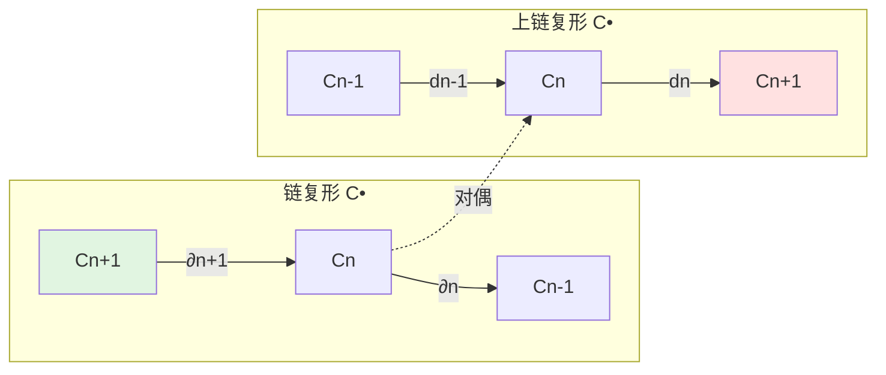
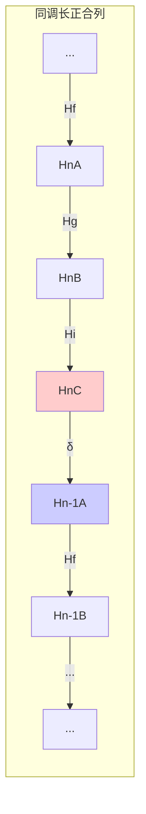

# 链复形与同调群

**同调代数的基本对象 — 从序列到不变量**

---

## 1. 概念深度解析

### 1.1 代数直观

**链复形 (Chain Complex)** 是一系列模和同态的序列：
$$\cdots \to C_{n+1} \xrightarrow{\partial_{n+1}} C_n \xrightarrow{\partial_n} C_{n-1} \to \cdots$$
满足核心条件：$\partial_n \circ \partial_{n+1} = 0$，即"两次边缘为零"。

**几何直观**（来自拓扑）：

- $C_n$ = n维"链"的集合（形式线性组合）
- $\partial_n$ = 取边缘操作
- $\partial^2 = 0$ = 边缘没有边缘

```
三角形 ABC：
    A
   / \
  /   \
 B-----C

∂(ABC) = BC - AC + AB  （三条边）
∂(BC) = C - B
∂(AC) = C - A
∂(AB) = B - A

∂²(ABC) = (C-B) - (C-A) + (B-A) = 0 ✓
```

### 1.2 范畴论语境

链复形构成范畴 $\text{Ch}(\mathcal{A})$：

- **对象**：链复形 $C_\bullet$
- **态射**：链映射 $f_\bullet : C_\bullet \to D_\bullet$
- **结构**：当 $\mathcal{A}$ 是Abel范畴时，$\text{Ch}(\mathcal{A})$ 也是Abel范畴

**关键函子**：

- 同调函子 $H_n : \text{Ch}(\mathcal{A}) \to \mathcal{A}$
- 这是同伦范畴上的同构不变量

### 1.3 形式定义

#### 定义 1.1 (链复形)

设 $\mathcal{A}$ 是Abel范畴，一个**链复形** $C_\bullet$ 是：

- 一列对象 $\{C_n\}_{n \in \mathbb{Z}}$
- 一列态射 $\partial_n : C_n \to C_{n-1}$（称为**边缘算子**或**微分**）
满足：$\partial_n \circ \partial_{n+1} = 0$（对所有n）

**记号**：常记 $d_n = \partial_n$，条件写成 $d^2 = 0$。

#### 定义 1.2 (上链复形)

**上链复形** $C^\bullet$ 是：

- 一列对象 $\{C^n\}_{n \in \mathbb{Z}}$
- 一列态射 $d^n : C^n \to C^{n+1}$
满足：$d^{n+1} \circ d^n = 0$

**对偶关系**：上链复形 = 链复形的反范畴

#### 定义 1.3 (链映射)

链映射 $f_\bullet : C_\bullet \to D_\bullet$ 是一列态射 $f_n : C_n \to D_n$ 使得下图交换：

```
... → C_{n+1} → C_n → C_{n-1} → ...
      ↓f_{n+1}   ↓f_n    ↓f_{n-1}
... → D_{n+1} → D_n → D_{n-1} → ...
```

即 $f_{n-1} \circ \partial_n^C = \partial_n^D \circ f_n$。

---

## 2. 属性与关系

### 2.1 同调群的构造

#### 定义 2.1 (同调群)

链复形 $C_\bullet$ 在n维的**同调**定义为：
$$H_n(C_\bullet) = \frac{\ker(\partial_n : C_n \to C_{n-1})}{\text{im}(\partial_{n+1} : C_{n+1} \to C_n)}$$

**术语**：

- $Z_n = \ker \partial_n$：n维**闭链** (cycles)
- $B_n = \text{im} \partial_{n+1}$：n维**边缘链** (boundaries)
- $H_n = Z_n / B_n$：同调类

#### 定义 2.2 (上同调群)

上链复形 $C^\bullet$ 的**上同调**：
$$H^n(C^\bullet) = \frac{\ker(d^n : C^n \to C^{n+1})}{\text{im}(d^{n-1} : C^{n-1} \to C^n)}$$

### 2.2 同调的基本性质

**定理 2.1 (链映射诱导同调映射)**
链映射 $f_\bullet : C_\bullet \to D_\bullet$ 诱导同调上的映射：
$$H_n(f) : H_n(C_\bullet) \to H_n(D_\bullet)$$
$$[z] \mapsto [f_n(z)]$$

**证明**：

- 若 $z \in Z_n(C)$，则 $\partial_n(z) = 0$
- $\partial_n(f_n(z)) = f_{n-1}(\partial_n(z)) = 0$，故 $f_n(z) \in Z_n(D)$
- 若 $z = \partial_{n+1}(c)$，则 $f_n(z) = \partial_{n+1}(f_{n+1}(c))$，故边缘映射到边缘

**定理 2.2 (同调的函子性)**
$H_n : \text{Ch}(\mathcal{A}) \to \mathcal{A}$ 是加性函子。

### 2.3 短正合列与长正合列

**定理 2.3 (短正合列诱导长正合列)**
设 $0 \to A_\bullet \xrightarrow{f} B_\bullet \xrightarrow{g} C_\bullet \to 0$ 是链复形的短正合列，则存在**连接同态** $\partial_n : H_n(C_\bullet) \to H_{n-1}(A_\bullet)$ 使得下列序列正合：
$$\cdots \to H_{n+1}(C) \xrightarrow{\partial} H_n(A) \xrightarrow{H(f)} H_n(B) \xrightarrow{H(g)} H_n(C) \xrightarrow{\partial} H_{n-1}(A) \to \cdots$$

**连接同态的构造**（蛇引理）：

```
对于 [c] ∈ H_n(C)：
1. 取 c ∈ Z_n(C) 为代表元
2. 由g满射，取 b ∈ B_n 使得 g(b) = c
3. ∂(b) ∈ B_{n-1} 满足 g(∂(b)) = ∂(g(b)) = ∂(c) = 0
4. 故 ∂(b) ∈ ker g = im f，存在 a ∈ A_{n-1} 使得 f(a) = ∂(b)
5. 定义 ∂[c] = [a]
```

---

## 3. 示例与习题

### 3.1 具体计算示例

#### 示例 3.1 (球的同调)

设 $S^n$ 是n维球面，其简化同调为：
$$\tilde{H}_k(S^n) = \begin{cases} \mathbb{Z} & k = n \\ 0 & k \neq n \end{cases}$$

**链复形实现**：

```
C_{n+1} = 0 → C_n = ℤ → C_{n-1} = 0 → ... → C_0 = ℤ → 0
            ↓0           ↓0              ↓0
```

#### 示例 3.2 (环面的细胞链复形)

环面 $T^2 = S^1 \times S^1$ 的细胞结构：

- 1个0-细胞 e₀
- 2个1-细胞 a, b
- 1个2-细胞 A（粘合关系: aba⁻¹b⁻¹）

链复形：
$$0 \to \mathbb{Z} \xrightarrow{\partial_2} \mathbb{Z}^2 \xrightarrow{\partial_1} \mathbb{Z} \to 0$$

边缘矩阵：

- $\partial_1(a) = \partial_1(b) = e_0 - e_0 = 0$
- $\partial_2(A) = a + b - a - b = 0$

同调：
$$H_0 = \mathbb{Z}, \quad H_1 = \mathbb{Z}^2, \quad H_2 = \mathbb{Z}$$

#### 示例 3.3 (Koszul复形)

设R是交换环，$x \in R$。Koszul复形：
$$K(x) : \quad 0 \to R \xrightarrow{\cdot x} R \to 0$$
集中在0度和1度。

同调：

- $H_0(K(x)) = R/(x)$
- $H_1(K(x)) = \text{Ann}_R(x)$（x的零化子）

### 3.2 习题

#### 习题 1

设 $C_\bullet$ 是链复形。证明：$C_\bullet$ 是正合的（即对所有n，$H_n(C_\bullet) = 0$）当且仅当 $C_\bullet$ 是正合序列。

#### 习题 2 (Mayer-Vietoris序列)

设X是拓扑空间，$U, V$ 是开覆盖。证明存在长正合列：
$$\cdots \to H_n(U \cap V) \to H_n(U) \oplus H_n(V) \to H_n(X) \xrightarrow{\partial} H_{n-1}(U \cap V) \to \cdots$$

**提示**：构造短正合列 $0 \to C_\bullet(U \cap V) \to C_\bullet(U) \oplus C_\bullet(V) \to C_\bullet(X) \to 0$。

#### 习题 3

设 $f_\bullet, g_\bullet : C_\bullet \to D_\bullet$ 是链同伦的链映射（即存在 $h_n : C_n \to D_{n+1}$ 使得 $f - g = \partial h + h \partial$）。证明 $H_n(f) = H_n(g)$。

#### 习题 4

证明：链复形 $C_\bullet$ 是**可缩的**（链同伦于零）当且仅当 $C_\bullet$ 正合且每个 $C_n$ 是投射模。

#### 习题 5 (代数Künneth公式)

设 $C_\bullet, D_\bullet$ 是自由Abel群的链复形。证明存在分裂短正合列：
$$0 \to \bigoplus_{p+q=n} H_p(C) \otimes H_q(D) \to H_n(C \otimes D) \to \bigoplus_{p+q=n-1} \text{Tor}(H_p(C), H_q(D)) \to 0$$

---

## 4. 形式化实现 (Lean 4)

```lean4
import Mathlib.Algebra.Homology.ChainComplex
import Mathlib.Algebra.Homology.Homology
import Mathlib.Algebra.Homology.ShortComplex

-- ============================================
-- 链复形的定义
-- ============================================

/-- 链复形：次数递减，∂² = 0 -/
abbrev ChainComplex' (C : Type*) [Category C] [Abelian C] :=
  ChainComplex C (ComplexShape.down ℤ)

/-- 上链复形：次数递增，d² = 0 -/
abbrev CochainComplex' (C : Type*) [Category C] [Abelian C] :=
  CochainComplex C (ComplexShape.up ℤ)

variable {C : Type*} [Category C] [Abelian C]
variable (K L : ChainComplex' C)

-- ============================================
-- 同调的定义与计算
-- ============================================

/-- n维同调群：Ker ∂ₙ / Im ∂ₙ₊₁ -/
noncomputable def HomologyGroup (n : ℤ) : C :=
  K.homology n

/-- 闭链子模 (Cycles) -/
def Cycles (n : ℤ) : C :=
  K.cycles n

/-- 边缘链子模 (Boundaries) -/
def Boundaries (n : ℤ) : C :=
  K.boundaries n

/-- 闭链包含边缘链 -/
def boundaries_le_cycles (n : ℤ) : Boundaries K n ⟶ Cycles K n :=
  K.boundariesToCycles n

-- ============================================
-- 链映射与同调诱导
-- ============================================

/-- 链映射诱导同调映射 -/
noncomputable def HomologyMap {K L : ChainComplex' C} (f : K ⟶ L) (n : ℤ) :
    HomologyGroup K n ⟶ HomologyGroup L n :=
  homologyMap f n

/-- 链映射同调诱导的函子性 -/
theorem HomologyMap_comp {K L M : ChainComplex' C} (f : K ⟶ L) (g : L ⟶ M) (n : ℤ) :
    HomologyMap (f ≫ g) n = HomologyMap f n ≫ HomologyMap g n := by
  simp [HomologyMap, homologyMap_comp]

-- ============================================
-- 长正合列（蛇引理的应用）
-- ============================================

/-- 短正合列的链复形 -/
structure ShortExactSequence (K L M : ChainComplex' C) where
  f : K ⟶ L
  g : L ⟶ M
  exact_f : ∀ n, (f.f n).range = (g.f n).ker
  mono_f : ∀ n, Mono (f.f n)
  epi_g : ∀ n, Epi (g.f n)

/-- 连接同态 -/
noncomputable def ConnectingHomomorphism {K L M : ChainComplex' C}
    (ses : ShortExactSequence K L M) (n : ℤ) :
    HomologyGroup M n ⟶ HomologyGroup K (n - 1) := by
  -- 使用蛇引理构造连接同态
  sorry

/-- 同调长正合列 -/
theorem HomologyLongExact {K L M : ChainComplex' C}
    (ses : ShortExactSequence K L M) (n : ℤ) :
    ∃ (δ : HomologyGroup M n ⟶ HomologyGroup K (n - 1)),
    Exact (HomologyMap ses.f n) (HomologyMap ses.g n) ∧
    Exact (HomologyMap ses.g n) δ := by
  sorry

-- ============================================
-- 同伦理论
-- ============================================

/-- 链同伦 -/
structure ChainHomotopy {K L : ChainComplex' C} (f g : K ⟶ L) where
  h : ∀ n, K.X n ⟶ L.X (n + 1)
  comm : ∀ n, f.f n - g.f n = L.d (n + 1) n ≫ h n + h (n - 1) ≫ K.d n (n - 1)

/-- 链同伦的映射在同调上相等 -/
theorem ChainHomotopy.homology_map_eq {K L : ChainComplex' C} {f g : K ⟶ L}
    (H : ChainHomotopy f g) (n : ℤ) :
    HomologyMap f n = HomologyMap g n := by
  -- 链同伦不改变自己
  sorry

-- ============================================
-- 示例：简单链复形的同调
-- ============================================

/-- 单点空间的链复形 -/
def PointChainComplex : ChainComplex' (ModuleCat ℤ) where
  X n := if n = 0 then ModuleCat.of ℤ ℤ else ModuleCat.of ℤ 0
  d n m := 0
  shape n m h := by simp [h]
  d_comp_d' n m l hnm hml := by simp

/-- 单点的同调 -/
theorem PointHomology (n : ℤ) :
    HomologyGroup PointChainComplex n ≅
    if n = 0 then ModuleCat.of ℤ ℤ else ModuleCat.of ℤ 0 := by
  sorry
```

---

## 5. 应用与拓展

### 5.1 在代数拓扑中的应用

**奇异同调**：
设X是拓扑空间，$S_n(X)$ 是n维奇异单形的集合。
$$C_n(X) = \mathbb{Z}[S_n(X)] \quad \text{(自由Abel群)}$$
边缘算子由单形的面诱导：
$$\partial(\sigma) = \sum_{i=0}^n (-1)^i \sigma|_{[0,...\hat{i},...,n]}$$

**关键定理**：

- 同伦不变性：$f \simeq g \Rightarrow H_n(f) = H_n(g)$
- 切除定理：$H_n(X, A) \cong H_n(X \setminus U, A \setminus U)$
- Mayer-Vietoris：开覆盖的同调计算

### 5.2 在代数几何中的应用

**代数de Rham上同调**：
设X是光滑代数簇，$\Omega_{X/k}^\bullet$ 是Kähler微分形式复形。
$$H^n_{dR}(X/k) = \mathbb{H}^n(X, \Omega_{X/k}^\bullet)$$

**相干层上同调**：
设$\mathcal{F}$ 是概形X上的相干层。
$$H^i(X, \mathcal{F}) = R^i\Gamma(X, \mathcal{F})$$

### 5.3 Hochschild同调

设A是k-代数，M是A-双模。
$$C_n(A, M) = M \otimes_k A^{\otimes n}$$
边缘算子涉及代数乘法。

**应用**：

- 形变理论的切空间
- 非交换几何中的微分形式
- 循环同调的基础

---

## 6. 思维表征

### 6.1 链复形与上链复形的关系



### 6.2 同调群计算流程

```mermaid
flowchart TB
    A[链复形 C•] --> B[计算核 Ker ∂n]
    A --> C[计算像 Im ∂n+1]
    B --> D[闭链 Zn]
    C --> E[边缘链 Bn]
    D --> F[商群 Hn = Zn / Bn]
    E --> F

    F --> G[同调类 [z]]

    style A fill:#e1e1ff
    style F fill:#fff4e1
    style G fill:#e1ffe1
```

### 6.3 长正合列的可视化



---

## 参考文献

1. A. Hatcher, *Algebraic Topology*, Cambridge University Press, 2002
2. R. Bott & L.W. Tu, *Differential Forms in Algebraic Topology*, Springer, 1982
3. J.P. May, *A Concise Course in Algebraic Topology*, University of Chicago Press, 1999
4. S.I. Gelfand & Y.I. Manin, *Methods of Homological Algebra*, 2nd ed., Springer, 2003

---

**维护者**: FormalMath项目组
**创建日期**: 2026年4月8日
**最后更新**: 2026年4月8日
**难度等级**: ⭐⭐⭐⭐
