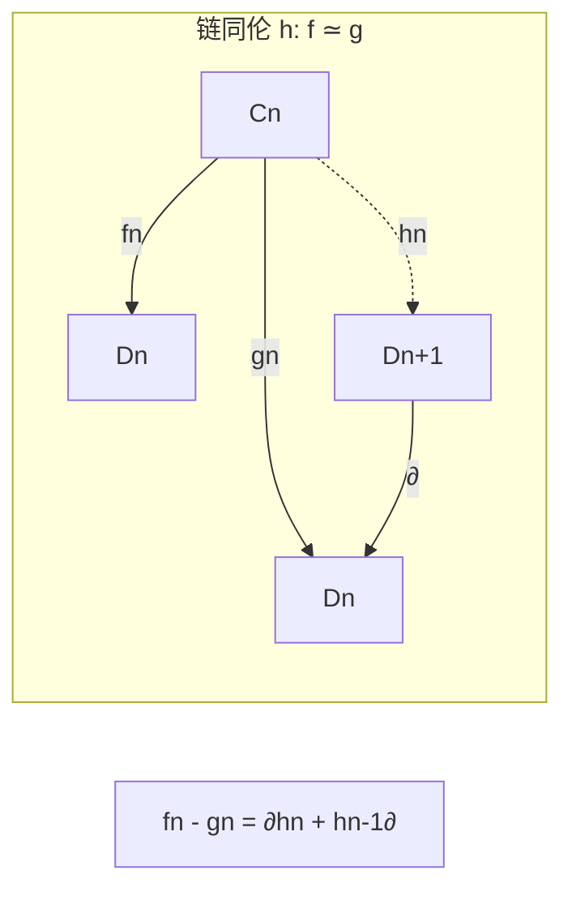
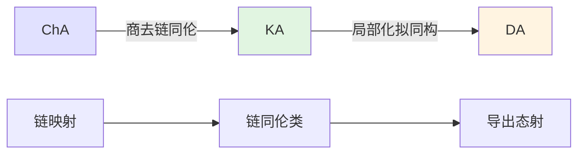

# 链映射与同伦理论

**同调代数的拓扑灵魂 — 从映射到范畴的升华**

---

## 1. 概念深度解析

### 1.1 代数直观

**链同伦 (Chain Homotopy)** 是拓扑同伦概念的代数类比：

- 拓扑：$f \simeq g$ 意味着存在连续形变 $H: X \times I \to Y$
- 代数：$f \simeq g$ 意味着存在"代数形变" $h$ 连接两个链映射

**核心直觉**：链同伦的映射在同调上诱导相同的映射，但逆命题一般不成立。

### 1.2 范畴论语境

**同伦范畴** $K(\mathcal{A})$：

- **对象**：链复形
- **态射**：链同伦等价类
- **关键**：这是导出范畴的中间步骤

$$
\text{Ch}(\mathcal{A}) \xrightarrow{Q} K(\mathcal{A}) \xrightarrow{L} D(\mathcal{A})
$$

### 1.3 形式定义

#### 定义 1.1 (链同伦)

设 $f, g : C_\bullet \to D_\bullet$ 是链映射。一个**链同伦** $h : f \simeq g$ 是一列映射 $h_n : C_n \to D_{n+1}$ 使得：
$$f_n - g_n = \partial_{n+1}^D \circ h_n + h_{n-1} \circ \partial_n^C$$

或写成：
$$f - g = dh + hd$$

#### 定义 1.2 (链同伦等价)

链复形 $C_\bullet, D_\bullet$ 是**链同伦等价的**，如果存在链映射 $f: C \to D$ 和 $g: D \to C$ 使得：
$$g \circ f \simeq \text{id}_C, \quad f \circ g \simeq \text{id}_D$$

#### 定义 1.3 (映射锥)

链映射 $f: C_\bullet \to D_\bullet$ 的**映射锥** $\text{Cone}(f)$ 是链复形：
$$\text{Cone}(f)_n = D_n \oplus C_{n-1}$$
微分：
$$\partial_n^{\text{Cone}} = \begin{pmatrix} \partial_n^D & f_{n-1} \\ 0 & -\partial_{n-1}^C \end{pmatrix}$$

---

## 2. 属性与关系

### 2.1 链同伦的基本性质

**定理 2.1 (同伦不改变自己)**
若 $f \simeq g : C_\bullet \to D_\bullet$，则对任意n：
$$H_n(f) = H_n(g) : H_n(C) \to H_n(D)$$

**证明**：
设 $h : f \simeq g$，即 $f - g = dh + hd$。
对 $[z] \in H_n(C)$，$z \in Z_n(C)$：
$$(f - g)(z) = d(h(z)) + h(d(z)) = d(h(z)) \in B_n(D)$$
因此 $[f(z)] = [g(z)]$。

**定理 2.2 (同伦等价是同调同构)**
若 $f: C \to D$ 是链同伦等价，则对所有n：
$$H_n(f) : H_n(C) \xrightarrow{\cong} H_n(D)$$

### 2.2 映射锥与同调

**定理 2.3 (锥的同调刻画)**
链映射 $f: C \to D$ 诱导长正合列：
$$\cdots \to H_n(C) \xrightarrow{H(f)} H_n(D) \to H_n(\text{Cone}(f)) \to H_{n-1}(C) \to \cdots$$

**推论**：$H_n(\text{Cone}(f)) = 0$ 对所有n当且仅当 $f$ 是**拟同构**（同调同构）。

### 2.3 柱构造

**定义 2.1 (映射柱)**
链映射 $f: C \to D$ 的**映射柱** $\text{Cyl}(f)$ 是：
$$\text{Cyl}(f)_n = D_n \oplus C_n \oplus C_{n-1}$$
微分适当定义使得有自然映射：
$$C \xrightarrow{i} \text{Cyl}(f) \xrightarrow{\sim} D$$

**定理 2.4 (柱的分解)**
每个链映射 $f: C \to D$ 可分解为：
$$C \xrightarrow{\text{包含}} \text{Cyl}(f) \xrightarrow{\text{拟同构}} D$$

---

## 3. 示例与习题

### 3.1 具体计算示例

#### 示例 3.1 (可缩复形)

链复形 $C_\bullet$ 称为**可缩的**，如果 $\text{id}_C \simeq 0$。

**等价条件**：存在 $h_n : C_n \to C_{n+1}$ 使得 $\text{id} = dh + hd$。

**例子**：设 $C_n = \mathbb{Z}$（对所有n），$\partial_n = \text{id}$。则：
$$dh + hd = \text{id} + \text{id} = 2\text{id} \neq \text{id}$$
此复形不是可缩的！

**正确例子**：设 $C_n = 0$（对所有n），显然是可缩的。

#### 示例 3.2 (圆周的细胞链复形)

$$C_1 = \mathbb{Z} \xrightarrow{0} C_0 = \mathbb{Z}$$

此复形与 $H_\bullet(S^1)$（集中在0度和1度的ℤ）同伦等价，但不链同伦等价于后者（因为前者是自由的，后者不是）。

#### 示例 3.3 (映射锥计算)

设 $f: \mathbb{Z}[0] \to \mathbb{Z}[0]$ 是乘以2的映射。
$$\text{Cone}(f)_1 = \mathbb{Z}, \quad \text{Cone}(f)_0 = \mathbb{Z}$$
$$\partial_1 = 2$$

同调：

- $H_0 = \mathbb{Z}/2\mathbb{Z}$
- $H_1 = 0$

### 3.2 习题

#### 习题 1

设 $f, g: C_\bullet \to D_\bullet$ 链同伦。证明对任意链复形 $E_\bullet$：

- $f \otimes \text{id}_E \simeq g \otimes \text{id}_E : C \otimes E \to D \otimes E$
- $\text{Hom}(f, \text{id}_E) \simeq \text{Hom}(g, \text{id}_E)$

#### 习题 2

证明：链复形 $C_\bullet$ 是可缩的当且仅当它是正合的且每个 $C_n$ 是投射模。

#### 习题 3 (映射锥的函子性)

设有交换图：

```
C --f--> D
|        |
v        v
C'--f'-> D'
```

证明存在诱导映射 $\text{Cone}(f) \to \text{Cone}(f')$。

#### 习题 4

设 $0 \to C' \to C \to C'' \to 0$ 是链复形的短正合列。证明 $C''$ 链同伦等价于 $\text{Cone}(C' \to C)$。

#### 习题 5

构造两个链复形 $C, D$ 使得 $H_\bullet(C) \cong H_\bullet(D)$ 但 $C$ 与 $D$ 不链同伦等价。

**提示**：考虑不同投射性的链复形。

---

## 4. 形式化实现 (Lean 4)

```lean4
import Mathlib.Algebra.Homology.ChainComplex
import Mathlib.Algebra.Homology.Homotopy
import Mathlib.Algebra.Homology.Cones

variable {C : Type*} [Category C] [Abelian C]

-- ============================================
-- 链同伦的定义
-- ============================================

/-- 链同伦：连接两个链映射的形变 -/
structure ChainHomotopy {K L : ChainComplex C (ComplexShape.down ℤ)}
    (f g : K ⟶ L) where
  hom : ∀ n, K.X n ⟶ L.X (n + 1)
  comm : ∀ n, f.f n - g.f n = L.d (n + 1) n ≫ hom n + hom (n - 1) ≫ K.d n (n - 1)

notation:50 f " ≃ " g => Nonempty (ChainHomotopy f g)

-- ============================================
-- 链同伦的基本性质
-- ============================================

/-- 链同伦的映射在同调上相等 -/
theorem ChainHomotopy.homology_map_eq {K L : ChainComplex C (ComplexShape.down ℤ)}
    {f g : K ⟶ L} (H : f ≃ g) (n : ℤ) :
    homologyMap f n = homologyMap g n := by
  rcases H with ⟨h⟩
  -- 同调映射由同伦不改变的性质
  sorry

/-- 链同伦等价关系 -/
def ChainHomotopyEquiv (K L : ChainComplex C (ComplexShape.down ℤ)) : Prop :=
  ∃ (f : K ⟶ L) (g : L ⟶ K),
    (g ≫ f ≃ 𝟙 K) ∧ (f ≫ g ≃ 𝟙 L)

/-- 链同伦等价蕴含同调同构 -/
theorem ChainHomotopyEquiv.homology_iso {K L} (h : ChainHomotopyEquiv K L) (n : ℤ) :
    K.homology n ≅ L.homology n := by
  rcases h with ⟨f, g, hgf, hfg⟩
  -- 构造同调上的同构
  sorry

-- ============================================
-- 映射锥
-- ============================================

/-- 链映射的锥：代数版本的映射锥 -/
noncomputable def MappingCone {K L : ChainComplex C (ComplexShape.down ℤ)}
    (f : K ⟶ L) : ChainComplex C (ComplexShape.down ℤ) :=
  -- 在Mathlib中是cone f
  cone f

/-- 锥的同调长正合列 -/
theorem Cone.homology_long_exact {K L : ChainComplex C (ComplexShape.down ℤ)}
    (f : K ⟶ L) (n : ℤ) :
    ∃ (δ : (MappingCone f).homology n ⟶ K.homology (n - 1)),
    Exact (homologyMap f n) (homologyMap (cone.ι f) n) ∧
    Exact (homologyMap (cone.ι f) n) δ := by
  -- 锥的标准长正合列
  sorry

/-- f是拟同构当且仅当Cone(f)零调 -/
theorem quasiIso_iff_cone_acyclic {K L : ChainComplex C (ComplexShape.down ℤ)}
    (f : K ⟶ L) :
    (∀ n, IsZero ((MappingCone f).homology n)) ↔
    (∀ n, IsIso (homologyMap f n)) := by
  sorry

-- ============================================
-- 同伦范畴
-- ============================================

/-- 同伦范畴：对象=链复形，态射=链同伦类 -/
def HomotopyCategory (C : Type*) [Category C] [Abelian C] :=
  HomotopyCategory C (ComplexShape.down ℤ)

/-- 商函子 Q : Ch(A) → K(A) -/
def quotientFunctor : ChainComplex C (ComplexShape.down ℤ) ⥤ HomotopyCategory C :=
  HomotopyCategory.quotient _ _

-- ============================================
-- 柱构造
-- ============================================

/-- 映射柱 -/
noncomputable def MappingCylinder {K L : ChainComplex C (ComplexShape.down ℤ)}
    (f : K ⟶ L) : ChainComplex C (ComplexShape.down ℤ) :=
  cylinder f

/-- 柱的分解性质 -/
theorem cylinder_decomposition {K L : ChainComplex C (ComplexShape.down ℤ)}
    (f : K ⟶ L) :
    ∃ (i : K ⟶ MappingCylinder f) (p : MappingCylinder f ⟶ L),
    p ≫ i = f ∧ (∀ n, IsIso (homologyMap p n)) := by
  sorry
```

---

## 5. 应用与拓展

### 5.1 导出范畴的构造

同伦范畴 $K(\mathcal{A})$ 是导出范畴的中间步骤：

1. **链复形范畴** $\text{Ch}(\mathcal{A})$：态射是链映射
2. **同伦范畴** $K(\mathcal{A})$：模去链同伦
3. **导出范畴** $D(\mathcal{A})$：对拟同构局部化

### 5.2 在代数拓扑中的应用

**细胞逼近定理**：任何映射 $f: X \to Y$ 都可细胞逼近，诱导链同伦等价的链映射。

**Whitehead定理**：单连通CW复形之间，弱同伦等价 = 同伦等价。

### 5.3 在代数几何中的应用

**D-模理论**：
设X是光滑代数簇，$\mathcal{D}_X$ 是微分算子层。

- 导出范畴 $D^b(\mathcal{D}_X)$ 研究微分方程
- 链同伦用于构造导出Hom

---

## 6. 思维表征

### 6.1 链同伦的可视化



### 6.2 映射锥的结构

```mermaid
graph TD
    A[Cone(f)] --> B[分量 Dn ⊕ Cn-1]
    B --> C[微分矩阵]
    C --> D["(∂d  f; 0 -∂c)"]

    E[同调解释] --> F[包含Dn的同调]
    E --> G[连接同态]

    style A fill:#e1f5e1
    style E fill:#ffe1e1
```

### 6.3 范畴构造层次



---

## 参考文献

1. S.I. Gelfand & Y.I. Manin, *Methods of Homological Algebra*, Springer, 2003
2. A. Neeman, *Triangulated Categories*, Princeton University Press, 2001
3. J.-L. Verdier, "Des catégories dérivées des catégories abéliennes"
4. M. Kashiwara & P. Schapira, *Categories and Sheaves*, Springer, 2006

---

**维护者**: FormalMath项目组
**创建日期**: 2026年4月8日
**最后更新**: 2026年4月8日
**难度等级**: ⭐⭐⭐⭐
