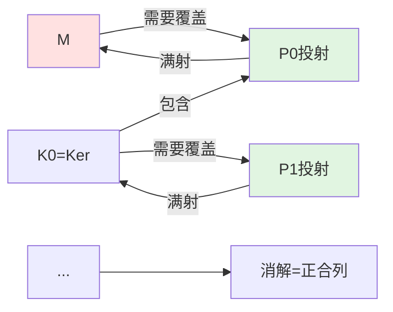
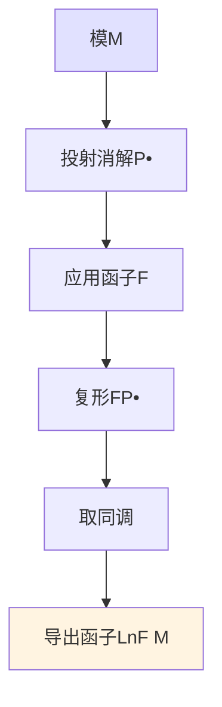
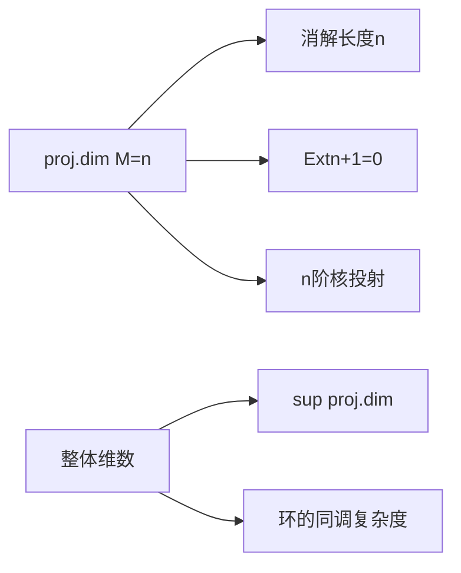

# 投射消解与内射消解

**导出函子的计算基础 — 从复形到不变量**

---

## 1. 概念深度解析

### 1.1 代数直观

**消解 (Resolution)** 是用"好"模来逼近一般模的方法：

- 投射消解：用投射模从左侧逼近
- 内射消解：用内射模从右侧逼近
- 核心思想：投射/内射模具有好的函子性质

**直观类比**：

- 模M就像"目标"
- 投射模像"平直的砖块"
- 消解 = 用砖块搭建通往目标的桥

### 1.2 范畴论语境

消解的本质是**Quasi-isomorphism**（拟同构）：

投射消解 $P_\bullet \to M$：

```
... → P₂ → P₁ → P₀ → M → 0
         ↓    ↓    ↓   ↓
... →  0 →  0 →  M → M → 0
```

这是链复形之间的拟同构，在导出范畴中变为同构。

### 1.3 形式定义

#### 定义 1.1 (投射消解)

设M是R-模，**投射消解**是正合序列：
$$\cdots \to P_2 \xrightarrow{d_2} P_1 \xrightarrow{d_1} P_0 \xrightarrow{\varepsilon} M \to 0$$
其中每个 $P_i$ 是投射R-模。

等价地，这是链复形 $P_\bullet$ 与链映射 $\varepsilon: P_\bullet \to M[0]$ 使得：
$$H_i(P_\bullet) = \begin{cases} M & i = 0 \\ 0 & i > 0 \end{cases}$$

#### 定义 1.2 (内射消解)

**内射消解**是正合序列：
$$0 \to M \xrightarrow{\eta} I^0 \xrightarrow{d^0} I^1 \xrightarrow{d^1} I^2 \to \cdots$$
其中每个 $I^i$ 是内射R-模。

#### 定义 1.3 (消解的长度)

投射消解的**长度**是：
$$\text{proj.dim}(M) = \inf\{n : \exists \text{ 投射消解 } P_\bullet \to M, P_i = 0 \text{ 对所有 } i > n\}$$

---

## 2. 属性与关系

### 2.1 消解的存在性

**定理 2.1 (投射消解存在性)**
若R-模范畴有足够多的投射对象，则每个R-模都有投射消解。

**证明**：
设M是R-模。

1. 取满射 $P_0 \twoheadrightarrow M$，$P_0$ 投射
2. 令 $K_0 = \ker(P_0 \to M)$
3. 取满射 $P_1 \twoheadrightarrow K_0$
4. 归纳继续...

**定理 2.2 (内射消解存在性)**
若R-模范畴有足够多的内射对象，则每个R-模都有内射消解。

**证明**：利用对偶构造。

### 2.2 消解的唯一性

**定理 2.3 (投射消解的唯一性)**
设 $P_\bullet \to M$ 和 $Q_\bullet \to M$ 是投射消解，则存在链同伦等价 $f_\bullet: P_\bullet \to Q_\bullet$ 使得下图交换：

```
P• → M
↓    ∥
Q• → M
```

**证明概要**：

- 逐次利用投射模的提升性质
- 验证构造的映射是链映射且链同伦于其他选择

### 2.3 同调维数

**定理 2.4 (投射维数的等价刻画)**
以下条件等价：

- (a) $\text{proj.dim}(M) \leq n$
- (b) $\text{Ext}_R^{n+1}(M, N) = 0$ 对所有N
- (c) 任意投射消解的第n核是投射的
- (d) 存在投射消解在n步后终止

**定理 2.5 (整体维数)**
环R的**左整体维数**：
$$\text{l.gl.dim}(R) = \sup\{\text{proj.dim}(M) : M \in {_R\text{Mod}}\}$$

**经典结果**：

- PID的维数 ≤ 1
- 域的维数 = 0
- 正则局部环的维数 = Krull维数

---

## 3. 示例与习题

### 3.1 具体计算示例

#### 示例 3.1 (ℤ-模的投射消解)

设 $M = \mathbb{Z}/n\mathbb{Z}$ 作为ℤ-模。

投射消解：
$$0 \to \mathbb{Z} \xrightarrow{\cdot n} \mathbb{Z} \to \mathbb{Z}/n\mathbb{Z} \to 0$$

因此 $\text{proj.dim}_\mathbb{Z}(\mathbb{Z}/n\mathbb{Z}) = 1$。

#### 示例 3.2 (多项式环的消解)

设 $R = k[x_1, ..., x_n]$，$k$ 是域。

Koszul复形给出消解：
$$0 \to \Lambda^n R^n \to \cdots \to \Lambda^1 R^n \to R \to k \to 0$$

因此 $\text{proj.dim}_R(k) = n$。

#### 示例 3.3 (局部环的最小消解)

设 $(R, \mathfrak{m}, k)$ 是Noether局部环，M是有限生成R-模。

**极小自由消解**：使用极小生成集构造。

**性质**：极小消解在同构意义下唯一。

### 3.2 习题

#### 习题 1

证明：若 $0 \to M' \to M \to M'' \to 0$ 短正合，则：
$$\text{proj.dim}(M) \leq \max\{\text{proj.dim}(M'), \text{proj.dim}(M'')\}$$

#### 习题 2 (Hilbert合冲定理)

设 $R = k[x_1, ..., x_n]$。证明：
$$\text{gl.dim}(R) = n$$

**提示**：用Koszul复形证明上界，用k的同调证明下界。

#### 习题 3

设R是半单环。证明：

- 每个R-模都是投射的
- $\text{gl.dim}(R) = 0$
- 反之亦然

#### 习题 4

设M是有限生成ℤ-模。利用结构定理计算 $\text{proj.dim}_\mathbb{Z}(M)$。

#### 习题 5

证明：若 $\text{proj.dim}(M) = n < \infty$，则存在有限生成模N使得 $\text{Ext}^n(M, N) \neq 0$。

---

## 4. 形式化实现 (Lean 4)

```lean4
import Mathlib.Algebra.Homology.Resolutions
import Mathlib.RingTheory.Regular.RegularSequence

variable {R : Type*} [Ring R] (M : Type*) [AddCommGroup M] [Module R M]

-- ============================================
-- 投射消解的定义
-- ============================================

/-- 投射消解 -/
structure ProjectiveResolution where
  complex : ChainComplex (ModuleCat R) (ComplexShape.down ℕ)
  isProjective : ∀ n, Projective (complex.X n)
  augmentation : complex.X 0 ⟶ ModuleCat.of R M
  isExact : ∀ n, Exact (complex.d (n + 1) n) (complex.d n (n - 1))
  surjective : Function.Surjective augmentation

/-- 内射消解 -/
structure InjectiveResolution where
  complex : CochainComplex (ModuleCat R) (ComplexShape.up ℕ)
  isInjective : ∀ n, Injective (complex.X n)
  coaugmentation : ModuleCat.of R M ⟶ complex.X 0
  isExact : ∀ n, Exact (complex.d n (n + 1)) (complex.d (n + 1) (n + 2))
  injective : Function.Injective coaugmentation

-- ============================================
-- 消解的存在性
-- ============================================

/-- 有足够多投射对象的范畴中投射消解存在 -/
theorem projectiveResolution_exists [EnoughProjectives (ModuleCat R)] :
    Nonempty (ProjectiveResolution R M) := by
  sorry

/-- 有足够多内射对象的范畴中内射消解存在 -/
theorem injectiveResolution_exists [EnoughInjectives (ModuleCat R)] :
    Nonempty (InjectiveResolution R M) := by
  sorry

-- ============================================
-- 投射维数
-- ============================================

/-- 投射维数 -/
noncomputable def projectiveDimension : ℕ∞ :=
  ⨅ (P : ProjectiveResolution R M), ⨅ n, if P.complex.X (n + 1) = 0 then n else ⊤

/-- 投射维数≤n的等价刻画 -/
theorem projectiveDimension_le_iff (n : ℕ) :
    projectiveDimension R M ≤ n ↔
    ∃ (P : ProjectiveResolution R M), ∀ m > n, P.complex.X m = 0 := by
  sorry

-- ============================================
-- Koszul复形
-- ============================================

/-- Koszul复形 -/
noncomputable def KoszulComplex {n : ℕ} (x : Fin n → R) :
    ChainComplex (ModuleCat R) (ComplexShape.down ℕ) :=
  -- 外代数构造
  sorry

/-- 正则序列的Koszul复形是消解 -/
theorem KoszulComplex_is_resolution {n : ℕ} {x : Fin n → R}
    (h : IsRegularSequence x) :
    ∀ i > 0, (KoszulComplex x).homology i = 0 := by
  sorry
```

---

## 5. 应用与拓展

### 5.1 在交换代数中的应用

**正则局部环的刻画**：
$(R, \mathfrak{m})$ 是正则局部环当且仅当 $\text{gl.dim}(R) = \dim(R)$。

**Cohen-Macaulay模**：
模M是Cohen-Macaulay的如果深度等于维数，这等价于某种消解的对称性。

### 5.2 在代数几何中的应用

**局部自由消解**：
设X是光滑簇，$\mathcal{F}$ 是凝聚层。存在局部自由消解：
$$0 \to \mathcal{E}_n \to \cdots \to \mathcal{E}_0 \to \mathcal{F} \to 0$$

这用于计算导出层函子。

### 5.3 在表示论中的应用

**Brauer特征标**：
有限群G在特征p域上的表示，投射消解用于定义Brauer特征标。

---

## 6. 思维表征

### 6.1 投射消解的构造



### 6.2 消解与同调的关系



### 6.3 维数层次



---

## 参考文献

1. H. Cartan & S. Eilenberg, *Homological Algebra*, Princeton, 1956
2. D. Eisenbud, *Commutative Algebra*, Springer, 1995
3. C.A. Weibel, *An Introduction to Homological Algebra*, Cambridge, 1994
4. J.-P. Serre, "Sur la dimension homologique des anneaux et des modules noethériens"

---

**维护者**: FormalMath项目组
**创建日期**: 2026年4月8日
**最后更新**: 2026年4月8日
**难度等级**: ⭐⭐⭐⭐
