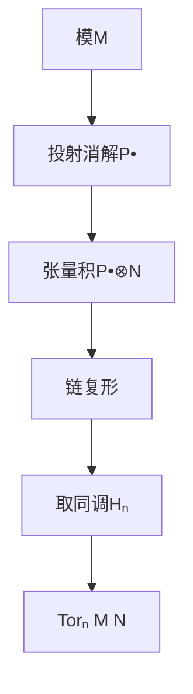
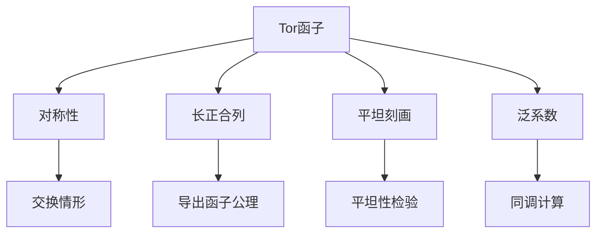

# 左导出函子与Tor

**张量积的派生 — 从正合性到挠理论**

---

## 1. 概念深度解析

### 1.1 代数直观

**Tor函子**是张量积函子 $-\otimes_R N$ 的左导出：

- 张量积是**右正合**的：保持 $M' \to M \to M'' \to 0$ 的正合性
- 但一般不保持左正合性
- Tor函子测量"左正合性的失败"

**直观理解**：
$$\text{Tor}_n^R(M, N) = \text{张量积的"n阶挠"}$$

### 1.2 范畴论语境

对于右正合加性函子 $F: \mathcal{A} \to \mathcal{B}$，左导出函子 $L_nF$：

```
A中投射对象 P:  LnF(P) = 0 (n > 0)
短正合列 0 → A' → A → A'' → 0 诱导长正合列
```

**通用性质**：$L_nF$ 是使投射对象无挠的普遍函子。

### 1.3 形式定义

#### 定义 1.1 (Tor函子)

设M是右R-模，N是左R-模。

取M的投射消解 $P_\bullet \to M$，定义：
$$\text{Tor}_n^R(M, N) = H_n(P_\bullet \otimes_R N)$$

**等价定义**：取N的投射消解 $Q_\bullet \to N$：
$$\text{Tor}_n^R(M, N) = H_n(M \otimes_R Q_\bullet)$$

#### 定义 1.2 (左导出函子)

设 $F: \mathcal{A} \to \mathcal{B}$ 是右正合加性函子。

对象A的**左导出函子**：
$$L_nF(A) = H_n(F(P_\bullet))$$
其中 $P_\bullet \to A$ 是投射消解。

---

## 2. 属性与关系

### 2.1 Tor的基本性质

**定理 2.1 (Tor的对称性)**
$$\text{Tor}_n^R(M, N) \cong \text{Tor}_n^R(N, M)$$

（当M, N都是双模或R交换时）

**定理 2.2 (Tor的长正合列)**
短正合列 $0 \to M' \to M \to M'' \to 0$ 诱导：
$$\cdots \to \text{Tor}_1(M'', N) \to M' \otimes N \to M \otimes N \to M'' \otimes N \to 0$$

**定理 2.3 (Tor与平坦性)**
以下条件等价：

- (a) N是平坦模
- (b) $\text{Tor}_n^R(M, N) = 0$ 对所有M，$n > 0$
- (c) $\text{Tor}_1^R(M, N) = 0$ 对所有M

### 2.2 低维Tor的解释

**定理 2.4 (Tor₀和Tor₁)**

- $\text{Tor}_0^R(M, N) = M \otimes_R N$
- $\text{Tor}_1^R(M, N)$ 是"挠"的度量

**例子**：设 $R = \mathbb{Z}$，$M = \mathbb{Z}/m\mathbb{Z}$，$N = \mathbb{Z}/n\mathbb{Z}$
$$\text{Tor}_1^\mathbb{Z}(\mathbb{Z}/m\mathbb{Z}, \mathbb{Z}/n\mathbb{Z}) = \mathbb{Z}/\gcd(m,n)\mathbb{Z}$$

### 2.3 泛系数定理

**定理 2.5 (同调的泛系数定理)**
设 $C_\bullet$ 是自由Abel群的链复形，G是Abel群：
$$0 \to H_n(C) \otimes G \to H_n(C \otimes G) \to \text{Tor}_1(H_{n-1}(C), G) \to 0$$
分裂但非自然分裂。

---

## 3. 示例与习题

### 3.1 具体计算示例

#### 示例 3.1 (ℤ-模的Tor)

计算 $\text{Tor}_i^\mathbb{Z}(\mathbb{Z}/m\mathbb{Z}, \mathbb{Z}/n\mathbb{Z})$。

**解**：
$\mathbb{Z}/m\mathbb{Z}$ 的投射消解：
$$0 \to \mathbb{Z} \xrightarrow{m} \mathbb{Z} \to \mathbb{Z}/m\mathbb{Z} \to 0$$

张量积 $-\otimes_\mathbb{Z} \mathbb{Z}/n\mathbb{Z}$：
$$0 \to \mathbb{Z}/n\mathbb{Z} \xrightarrow{m} \mathbb{Z}/n\mathbb{Z} \to 0$$

同调：

- $\text{Tor}_0 = \mathbb{Z}/n\mathbb{Z} / m(\mathbb{Z}/n\mathbb{Z}) = \mathbb{Z}/\gcd(m,n)\mathbb{Z}$
- $\text{Tor}_1 = \ker(m: \mathbb{Z}/n\mathbb{Z} \to \mathbb{Z}/n\mathbb{Z}) = \mathbb{Z}/\gcd(m,n)\mathbb{Z}$
- $\text{Tor}_i = 0$（i ≥ 2）

#### 示例 3.2 (群代数的Tor)

设G是有限群，$R = \mathbb{Z}[G]$。

$\mathbb{Z}$ 作为平凡G-模的投射消解给出群同调。

#### 示例 3.3 (局部环的Tor)

设 $(R, \mathfrak{m}, k)$ 是Noether局部环，$M$ 是有限生成模。

**Auslander-Buchsbaum公式**：
$$\text{proj.dim}(M) + \text{depth}(M) = \text{depth}(R)$$

### 3.2 习题

#### 习题 1

证明：若 $0 \to M' \to M \to M'' \to 0$ 分裂，则对每个n：
$$\text{Tor}_n(M, N) \cong \text{Tor}_n(M', N) \oplus \text{Tor}_n(M'', N)$$

#### 习题 2

设 $R = k[x]/(x^2)$，$k$ 是域。计算：
$$\text{Tor}_i^R(k, k) \quad \text{对所有 } i \geq 0$$

#### 习题 3

证明：N是平坦模当且仅当对所有有限生成理想 $I \subseteq R$：
$$\text{Tor}_1^R(R/I, N) = 0$$

#### 习题 4 (Künneth公式)

设 $C_\bullet, D_\bullet$ 是自由Abel群的链复形。证明存在正合列：
$$0 \to \bigoplus_{p+q=n} H_p(C) \otimes H_q(D) \to H_n(C \otimes D) \to \bigoplus_{p+q=n-1} \text{Tor}_1(H_p(C), H_q(D)) \to 0$$

#### 习题 5

设R是交换Noether环，M, N是有限生成模。证明：
$$\text{Tor}_i^R(M, N) \text{ 对所有i有限生成}$$

---

## 4. 形式化实现 (Lean 4)

```lean4
import Mathlib.Algebra.Homology.DerivedFunctor
import Mathlib.RingTheory.TensorProduct.Basic

variable {R : Type*} [CommRing R] (M N : Type*)
  [AddCommGroup M] [Module R M] [AddCommGroup N] [Module R N]

-- ============================================
-- Tor函子的定义
-- ============================================

/-- Tor函子：张量积的左导出 -/
noncomputable def Tor (n : ℕ) : Type _ :=
  -- 使用M的投射消解
  let P := projectiveResolution R M
  (P.complex ⋙ MonoidalCategory.tensorLeft (ModuleCat.of R N)).homology n

notation "Tor_" n "^" R "(" M "," N ")" => Tor R M N n

-- ============================================
-- Tor的基本性质
-- ============================================

/-- Tor₀ = 张量积 -/
theorem Tor_zero : Tor_0^R(M, N) ≅ ModuleCat.of R (M ⊗[R] N) := by
  sorry

/-- Tor的vanishing：平坦模Tor为0 -/
theorem Tor_vanishing [Module.Flat R N] (n : ℕ) (hn : n > 0) :
    Subsingleton (Tor_n^R(M, N)) := by
  sorry

/-- Tor的长正合列 -/
theorem Tor_long_exact {M' M M'' : Type*} [AddCommGroup M'] [Module R M']
    [AddCommGroup M''] [Module R M'']
    (f : M' →ₗ[R] M) (g : M →ₗ[R] M'') (h : Function.Exact f g)
    (hf : Function.Injective f) (hg : Function.Surjective g) (n : ℕ) :
    ∃ (δ : Tor_(n+1)^R(M'', N) → Tor_n^R(M', N)),
    Exact (Tor.map g n) (Tor.map f n) := by
  sorry

-- ============================================
-- 具体计算
-- ============================================

/-- ℤ/m ⊗ ℤ/n = ℤ/gcd(m,n) -/
theorem Tor_zero_cyclic (m n : ℕ) (hm : m > 0) (hn : n > 0) :
    let M := ZMod m
    let N := ZMod n
    Tor_0^ℤ(M, N) ≅ ModuleCat.of ℤ (ZMod (Nat.gcd m n)) := by
  sorry

/-- Tor₁(ℤ/m, ℤ/n) = ℤ/gcd(m,n) -/
theorem Tor_one_cyclic (m n : ℕ) (hm : m > 0) (hn : n > 0) :
    let M := ZMod m
    let N := ZMod n
    Tor_1^ℤ(M, N) ≅ ModuleCat.of ℤ (ZMod (Nat.gcd m n)) := by
  sorry

-- ============================================
-- 泛系数定理
-- ============================================

/-- 同调泛系数定理 -/
theorem universal_coefficient_homology
    (C : ChainComplex (ModuleCat ℤ) (ComplexShape.down ℤ))
    (G : Type*) [AddCommGroup G] (n : ℤ) :
    ∃ (f : (C.homology n) ⊗ (ModuleCat.of ℤ G) ⟶
           (C ⋙ MonoidalCategory.tensorLeft (ModuleCat.of ℤ G)).homology n)
    (g : _ → Tor_1^ℤ(C.homology (n-1), G)),
    ShortExact f g := by
  sorry
```

---

## 5. 应用与拓展

### 5.1 在代数拓扑中的应用

**Künneth定理**：
$$0 \to \bigoplus_{p+q=n} H_p(X) \otimes H_q(Y) \to H_n(X \times Y) \to \bigoplus_{p+q=n-1} \text{Tor}(H_p(X), H_q(Y)) \to 0$$

### 5.2 在代数几何中的应用

**相交理论**：
设X是光滑簇，Y, Z是子簇。
$$\text{Tor}_i^{\mathcal{O}_X}(\mathcal{O}_Y, \mathcal{O}_Z)$$
与相交重数相关。

### 5.3 在交换代数中的应用

**深度与投射维数**：
$$\text{Tor}_i^R(M, N) = 0 \text{ 对 } i > \text{depth}(R) - \text{depth}(N)$$

---

## 6. 思维表征

### 6.1 Tor作为挠的度量

```mermaid
graph LR
    A[短正合列] --> B[张量积后可能不正合]
    B --> C[Tor测量失败程度]
    C --> D[Tor₁是"真正"的挠]

    E[平坦模] --> F[Torₙ=0 n>0]
    F --> G[保持所有正合列]
```

### 6.2 Tor的计算流程



### 6.3 Tor的性质网络



---

## 参考文献

1. H. Cartan & S. Eilenberg, *Homological Algebra*, Princeton, 1956
2. S. Mac Lane, *Homology*, Springer, 1963
3. J.J. Rotman, *An Introduction to Homological Algebra*, Springer, 2009
4. C.A. Weibel, *An Introduction to Homological Algebra*, Cambridge, 1994

---

**维护者**: FormalMath项目组
**创建日期**: 2026年4月8日
**最后更新**: 2026年4月8日
**难度等级**: ⭐⭐⭐⭐
