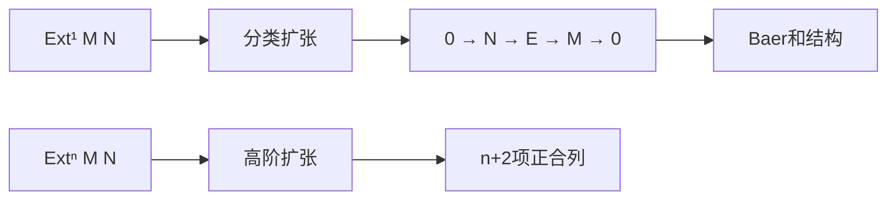
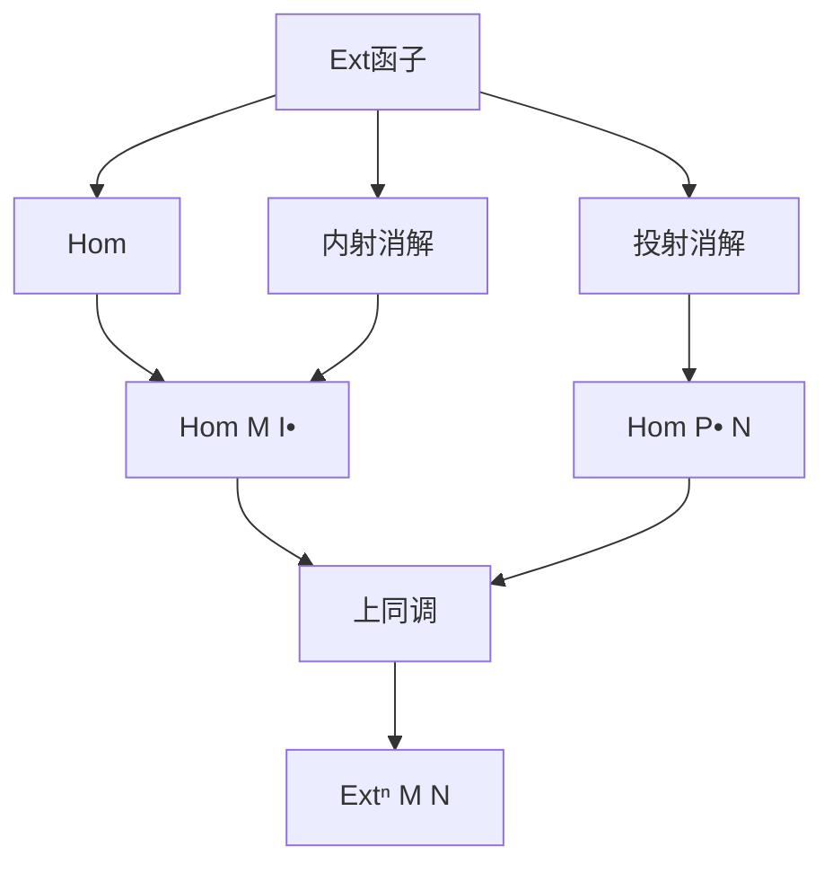
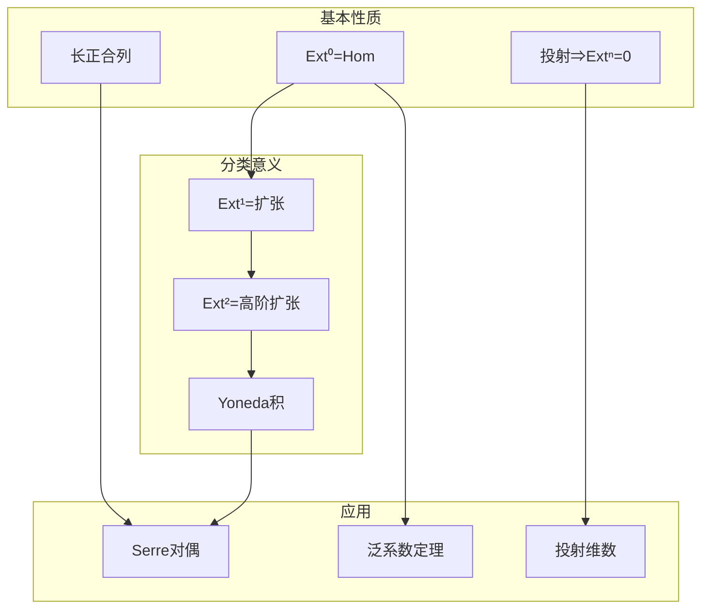

# 右导出函子与Ext

**Hom函子的派生 — 从映射到扩张理论**

---

## 1. 概念深度解析

### 1.1 代数直观

**Ext函子**是Hom函子 $\text{Hom}_R(M, -)$ 的右导出：

- Hom是**左正合**的：保持 $0 \to N' \to N \to N''$ 的正合性
- 但一般不保持右正合性
- Ext函子测量"右正合性的失败"

**核心关系**：
$$\text{Ext}^n_R(M, N) = n\text{阶扩张的分类}$$

### 1.2 范畴论语境

对于左正合加性函子 $F: \mathcal{A} \to \mathcal{B}$，右导出函子 $R^nF$：

```
A中内射对象 I:  RⁿF(I) = 0 (n > 0)
短正合列诱导长正合列（反向）
```

### 1.3 形式定义

#### 定义 1.1 (Ext函子)

设M, N是R-模。

**方法1**：取N的内射消解 $N \to I^\bullet$，定义：
$$\text{Ext}^n_R(M, N) = H^n(\text{Hom}_R(M, I^\bullet))$$

**方法2**：取M的投射消解 $P_\bullet \to M$，定义：
$$\text{Ext}^n_R(M, N) = H^n(\text{Hom}_R(P_\bullet, N))$$

**定理**：两种定义自然同构。

#### 定义 1.2 (Yoneda Ext)

n阶扩张是长正合列：
$$0 \to N \to E_n \to \cdots \to E_1 \to M \to 0$$

Yoneda Ext 是扩张的等价类集合，有加法（Baer和）。

---

## 2. 属性与关系

### 2.1 Ext的基本性质

**定理 2.1 (Ext⁰和Ext¹)**

- $\text{Ext}^0_R(M, N) = \text{Hom}_R(M, N)$
- $\text{Ext}^1_R(M, N)$ 分类扩张 $0 \to N \to E \to M \to 0$

**定理 2.2 (Ext的长正合列)**
短正合列 $0 \to N' \to N \to N'' \to 0$ 诱导：
$$0 \to \text{Hom}(M, N') \to \text{Hom}(M, N) \to \text{Hom}(M, N'') \to \text{Ext}^1(M, N') \to \cdots$$

**定理 2.3 (Ext与投射性)**
以下条件等价：

- (a) M是投射模
- (b) $\text{Ext}^n_R(M, N) = 0$ 对所有N，$n > 0$
- (c) $\text{Ext}^1_R(M, N) = 0$ 对所有N

### 2.2 低维Ext的解释

**定理 2.4 (Ext¹与扩张)**
$$\text{Ext}^1_R(M, N) \cong \{\text{扩张 } 0 \to N \to E \to M \to 0\} / \sim$$
其中等价关系是交换图的同构。

**Baer和**：给定两个扩张 $E_1, E_2$，构造推-拉：
$$E_1 + E_2 : \quad 0 \to N \to E' \to M \to 0$$

**定理 2.5 (Ext²与高阶扩张)**
$\text{Ext}^2_R(M, N)$ 分类4项扩张：
$$0 \to N \to E_2 \to E_1 \to M \to 0$$
模去可裂的扩张。

### 2.3 泛系数定理

**定理 2.6 (上同调泛系数定理)**
设 $C_\bullet$ 是自由Abel群的链复形，G是Abel群：
$$0 \to \text{Ext}^1(H_{n-1}(C), G) \to H^n(C; G) \to \text{Hom}(H_n(C), G) \to 0$$

---

## 3. 示例与习题

### 3.1 具体计算示例

#### 示例 3.1 (ℤ-模的Ext)

计算 $\text{Ext}^i_\mathbb{Z}(\mathbb{Z}/m\mathbb{Z}, \mathbb{Z}/n\mathbb{Z})$。

**解**：
$\mathbb{Z}/m\mathbb{Z}$ 的投射消解：
$$0 \to \mathbb{Z} \xrightarrow{m} \mathbb{Z} \to \mathbb{Z}/m\mathbb{Z} \to 0$$

应用 $\text{Hom}(-, \mathbb{Z}/n\mathbb{Z})$：
$$0 \to \mathbb{Z}/n\mathbb{Z} \xrightarrow{m} \mathbb{Z}/n\mathbb{Z} \to 0$$

同调：

- $\text{Ext}^0 = \ker(m) = \mathbb{Z}/\gcd(m,n)\mathbb{Z}$
- $\text{Ext}^1 = \text{coker}(m) = \mathbb{Z}/\gcd(m,n)\mathbb{Z}$
- $\text{Ext}^i = 0$（i ≥ 2）

#### 示例 3.2 (Ext与扩张)

$\text{Ext}^1_\mathbb{Z}(\mathbb{Z}/p\mathbb{Z}, \mathbb{Z}/p\mathbb{Z}) = \mathbb{Z}/p\mathbb{Z}$。

对应p个不同构的扩张：

- $0 \to \mathbb{Z}/p \to \mathbb{Z}/p^2 \to \mathbb{Z}/p \to 0$（非分裂）
- $0 \to \mathbb{Z}/p \to \mathbb{Z}/p \oplus \mathbb{Z}/p \to \mathbb{Z}/p \to 0$（分裂）

#### 示例 3.3 (正则局部环的Ext)

设 $(R, \mathfrak{m})$ 是维数d的正则局部环，M, N是有限生成模。

**局部对偶**：
$$\text{Ext}^i_R(M, N)^\wedge \cong \text{Ext}^{d-i}_R(N, M)$$

### 3.2 习题

#### 习题 1

证明：M是投射模当且仅当 $\text{Ext}^1_R(M, N) = 0$ 对所有N。

#### 习题 2

设 $R = k[x]/(x^2)$，$k$ 是域。计算 $\text{Ext}^i_R(k, k)$。

#### 习题 3 (Yoneda积)

构造乘法：
$$\text{Ext}^m(N, P) \times \text{Ext}^n(M, N) \to \text{Ext}^{m+n}(M, P)$$

**提示**：用扩张的splicing。

#### 习题 4

设 $0 \to A \to B \to C \to 0$ 是短正合列。证明存在6项正合列：
$$0 \to \text{Hom}(M, A) \to \text{Hom}(M, B) \to \text{Hom}(M, C) \to \text{Ext}^1(M, A) \to \cdots$$

#### 习题 5

设R是Noether环，M是有限生成模。证明：
$$\text{inj.dim}(N) = \sup\{n : \exists M, \text{Ext}^n(M, N) \neq 0\}$$

---

## 4. 形式化实现 (Lean 4)

```lean4
import Mathlib.Algebra.Homology.DerivedFunctor
import Mathlib.Algebra.Ext

variable {R : Type*} [Ring R] (M N : Type*)
  [AddCommGroup M] [Module R M] [AddCommGroup N] [Module R N]

-- ============================================
-- Ext函子的定义
-- ============================================

/-- Ext函子：Hom的右导出 -/
noncomputable def Ext (n : ℕ) : Type _ :=
  -- 使用N的内射消解
  let I := injectiveResolution R N
  (Functor.hom (ModuleCat.of R M) ⋙ I.complex).cohomology n

notation "Ext^" n "_" R "(" M "," N ")" => Ext R M N n

-- ============================================
-- Ext的基本性质
-- ============================================

/-- Ext⁰ = Hom -/
theorem Ext_zero : Ext^0_R(M, N) ≅ ModuleCat.of ℤ (M →ₗ[R] N) := by
  sorry

/-- Ext的vanishing：投射模Ext为0 -/
theorem Ext_vanishing [Projective R M] (n : ℕ) (hn : n > 0) :
    Subsingleton (Ext^n_R(M, N)) := by
  sorry

/-- Ext的长正合列 -/
theorem Ext_long_exact {N' N N'' : Type*} [AddCommGroup N'] [Module R N']
    [AddCommGroup N''] [Module R N'']
    (f : N' →ₗ[R] N) (g : N →ₗ[R] N'') (h : Function.Exact f g)
    (hf : Function.Injective f) (hg : Function.Surjective g) (n : ℕ) :
    ∃ (δ : Ext^n_R(M, N'') → Ext^(n+1)_R(M, N')),
    Exact (Ext.map f n) (Ext.map g n) := by
  sorry

-- ============================================
-- Ext¹与扩张
-- ============================================

/-- 扩张的定义 -/
structure Extension where
  E : Type _
  [addCommGroup : AddCommGroup E]
  [module : Module R E]
  i : N →ₗ[R] E
  p : E →ₗ[R] M
  exact₁ : Function.Injective i
  exact₂ : LinearMap.range i = LinearMap.ker p
  exact₃ : Function.Surjective p

/-- Ext¹分类扩张 -/
def Extension.toExt1 (e : Extension R M N) : Ext^1_R(M, N) := by
  -- 利用消解构造
  sorry

/-- Yoneda Ext -/
def YonedaExt : Type _ := Extension R M N ⧸ Setoid.r

-- ============================================
-- 具体计算
-- ============================================

/-- Ext⁰(ℤ/m, ℤ/n) = ℤ/gcd(m,n) -/
theorem Ext_zero_cyclic (m n : ℕ) (hm : m > 0) (hn : n > 0) :
    let M := ZMod m
    let N := ZMod n
    Ext^0_ℤ(M, N) ≅ ModuleCat.of ℤ (ZMod (Nat.gcd m n)) := by
  sorry

/-- Ext¹(ℤ/m, ℤ/n) = ℤ/gcd(m,n) -/
theorem Ext_one_cyclic (m n : ℕ) (hm : m > 0) (hn : n > 0) :
    let M := ZMod m
    let N := ZMod n
    Ext^1_ℤ(M, N) ≅ ModuleCat.of ℤ (ZMod (Nat.gcd m n)) := by
  sorry
```

---

## 5. 应用与拓展

### 5.1 在代数拓扑中的应用

**上同调泛系数定理**：
$$H^n(X; G) \cong \text{Hom}(H_n(X), G) \oplus \text{Ext}(H_{n-1}(X), G)$$

### 5.2 在代数几何中的应用

**Serre对偶**：
设X是n维光滑射影簇，$\omega_X$ 是典则层。
$$H^i(X, \mathcal{F})^* \cong \text{Ext}^{n-i}(\mathcal{F}, \omega_X)$$

### 5.3 在表示论中的应用

**Maschke定理**：
char k ∤ |G| 时，$k[G]$ 是半单的，故 $\text{Ext}^1_{k[G]} = 0$。

---

## 6. 思维表征

### 6.1 Ext作为扩张的分类



### 6.2 Ext的计算网络



### 6.3 Ext的性质层次



---

## 参考文献

1. H. Cartan & S. Eilenberg, *Homological Algebra*, Princeton, 1956
2. N. Yoneda, "On Ext and exact sequences"
3. D. Buchsbaum, "A note on homology in categories"
4. C.A. Weibel, *An Introduction to Homological Algebra*, Cambridge, 1994

---

**维护者**: FormalMath项目组
**创建日期**: 2026年4月8日
**最后更新**: 2026年4月8日
**难度等级**: ⭐⭐⭐⭐
