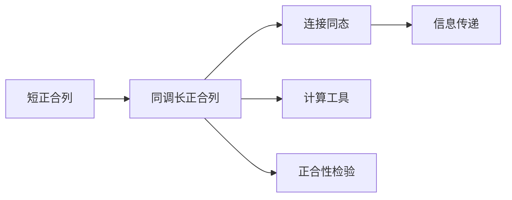

# 长正合序列

**同调代数的核心工具 — 从短正合到长正合的桥梁**

---

## 1. 概念深度解析

### 1.1 代数直观

**长正合序列**是同调代数最重要的计算工具：

- 输入：一个短正合列 $0 \to A \to B \to C \to 0$
- 输出：相关的同调长正合列

**直观理解**：

```
短正合列：    0 → A → B → C → 0
                    ↓
同调信息：    ... → Hn(A) → Hn(B) → Hn(C) → Hn-1(A) → ...
```

**关键特征**：连接同态 $\partial: H_n(C) \to H_{n-1}(A)$ 将"丢失的信息"传递下去。

### 1.2 范畴论语境

长正合序列体现了**导出函子**的本质性质：

- 同调函子 $H_n$ 不是正合的
- 但"失败的程度"被下一维捕获
- 这形成了长正合序列

### 1.3 形式定义

#### 定义 1.1 (同调长正合列)

设 $0 \to A_\bullet \xrightarrow{f} B_\bullet \xrightarrow{g} C_\bullet \to 0$ 是链复形的短正合列。存在**连接同态** $\partial_n: H_n(C) \to H_{n-1}(A)$ 使得序列正合：
$$\cdots \xrightarrow{\partial} H_n(A) \xrightarrow{H(f)} H_n(B) \xrightarrow{H(g)} H_n(C) \xrightarrow{\partial_n} H_{n-1}(A) \xrightarrow{H(f)} \cdots$$

#### 定义 1.2 (连接同态)

对 $[c] \in H_n(C)$，取代表元 $c \in Z_n(C)$：

1. 由g满射，取 $b \in B_n$ 使 $g(b) = c$
2. $\partial(b) \in B_{n-1}$ 满足 $g(\partial(b)) = \partial(c) = 0$
3. 故 $\partial(b) = f(a)$ 对某 $a \in A_{n-1}$
4. 定义 $\partial_n[c] = [a]$

---

## 2. 属性与关系

### 2.1 长正合列的自然性

**定理 2.1 (自然性)**
设有两短正合列的态射：

```
0 → A → B → C → 0
    ↓    ↓    ↓
0 → A'→ B'→ C'→ 0
```

则诱导的图交换：

```
... → Hn(A) → Hn(B) → Hn(C) → Hn-1(A) → ...
      ↓        ↓        ↓         ↓
... → Hn(A')→ Hn(B')→ Hn(C')→ Hn-1(A')→ ...
```

### 2.2 导出函子的长正合列

**定理 2.2 (左导出函子的长正合列)**
设F是右正合函子，$0 \to A' \to A \to A'' \to 0$ 短正合：
$$\cdots \to L_nF(A') \to L_nF(A) \to L_nF(A'') \xrightarrow{\partial} L_{n-1}F(A') \to \cdots$$

**定理 2.3 (右导出函子的长正合列)**
设F是左正合函子：
$$\cdots \to R^nF(A') \to R^nF(A) \to R^nF(A'') \xrightarrow{\partial} R^{n+1}F(A') \to \cdots$$

### 2.3 Mayer-Vietoris序列

**定理 2.4 (代数Mayer-Vietoris)**
设 $X = U \cup V$，则有正合列：
$$\cdots \to H_n(U \cap V) \to H_n(U) \oplus H_n(V) \to H_n(X) \xrightarrow{\partial} H_{n-1}(U \cap V) \to \cdots$$

---

## 3. 示例与习题

### 3.1 具体计算示例

#### 示例 3.1 (配对的长正合列)

设 $(X, A)$ 是拓扑空间对。有正合列：
$$\cdots \to H_n(A) \to H_n(X) \to H_n(X, A) \xrightarrow{\partial} H_{n-1}(A) \to \cdots$$

#### 示例 3.2 (球的约化同调)

$$\tilde{H}_i(S^n) = \begin{cases} \mathbb{Z} & i = n \\ 0 & i \neq n \end{cases}$$

由长正合列和 $S^n = D^n_+ \cup D^n_-$：
$$H_i(D^n) = 0 (i > 0) \Rightarrow H_i(S^n) \cong H_{i-1}(S^{n-1})$$

#### 示例 3.3 (Tor的长正合列)

$$\cdots \to \text{Tor}_1(M'', N) \to M' \otimes N \to M \otimes N \to M'' \otimes N \to 0$$

### 3.2 习题

#### 习题 1

验证连接同态 $\partial$ 是良定义的（不依赖于提升的选择）。

#### 习题 2

证明五引理：在给定交换图中，若外围四个映射是同构，则中间的也是。

#### 习题 3

设 $X = A \cup B$，$A, B$ 开。用Mayer-Vietoris计算 $H_*(S^1 \vee S^1)$。

#### 习题 4

证明：若 $0 \to A \to B \to C \to 0$ 分裂，则连接同态为零。

#### 习题 5

设 $(X, A)$ 是空间对，$i: A \hookrightarrow X$ 是同伦等价。证明 $H_n(X, A) = 0$ 对所有n。

---

## 4. 形式化实现 (Lean 4)

```lean4
import Mathlib.Algebra.Homology.ShortComplex.HomologicalComplex
import Mathlib.Algebra.Homology.LongExactSequence

variable {C : Type*} [Category C] [Abelian C]
variable {K L M : ChainComplex C (ComplexShape.down ℤ)}

-- ============================================
-- 长正合序列的定义
-- ============================================

/-- 链复形短正合列 -/
structure ShortExactSequence (K L M : ChainComplex C (ComplexShape.down ℤ)) where
  f : K ⟶ L
  g : L ⟶ M
  short_exact : ∀ n, ShortExact ((f.f n)) ((g.f n))

/-- 连接同态 -/
noncomputable def connectingHomomorphism
    {ses : ShortExactSequence K L M} (n : ℤ) :
    M.homology n ⟶ K.homology (n - 1) :=
  homologyConnectingHom ses.f ses.g n

/-- 同调长正合列的正合性 -/
theorem homology_long_exact {ses : ShortExactSequence K L M} (n : ℤ) :
    Exact (homologyMap ses.f n) (homologyMap ses.g n) ∧
    Exact (homologyMap ses.g n) (connectingHomomorphism (n + 1)) ∧
    Exact (connectingHomomorphism (n + 1)) (homologyMap ses.f (n - 1)) := by
  sorry

-- ============================================
-- 导出函子的长正合列
-- ============================================

/-- 左导出函子的长正合列 -/
theorem leftDerived_long_exact {A B C : C} (f : A ⟶ B) (g : B ⟶ C)
    (h : ShortExact f g) (F : C ⥤ D) [F.Additive] [RightExactFunctor F]
    (n : ℕ) :
    ∃ (δ : (F.leftDerived (n+1)).obj C ⟶ (F.leftDerived n).obj A),
    Exact ((F.leftDerived n).map f) ((F.leftDerived n).map g) := by
  sorry

/-- 右导出函子的长正合列 -/
theorem rightDerived_long_exact {A B C : C} (f : A ⟶ B) (g : B ⟶ C)
    (h : ShortExact f g) (F : C ⥤ D) [F.Additive] [LeftExactFunctor F]
    (n : ℕ) :
    ∃ (δ : (F.rightDerived n).obj C ⟶ (F.rightDerived (n+1)).obj A),
    Exact ((F.rightDerived n).map f) ((F.rightDerived n).map g) := by
  sorry
```

---

## 5. 应用与拓展

### 5.1 在代数拓扑中的应用

**切除定理的证明**：利用长正合列和五项引理。

**相对同调的计算**：通过配对的长正合列。

### 5.2 在同调代数中的应用

**维数转移**：利用长正合列将高维Ext/Tor与低维联系起来。

### 5.3 Gysin序列和Wang序列

纤维丛的同调计算工具。

---

## 6. 思维表征



---

**维护者**: FormalMath项目组
**创建日期**: 2026年4月8日
**难度等级**: ⭐⭐⭐⭐
