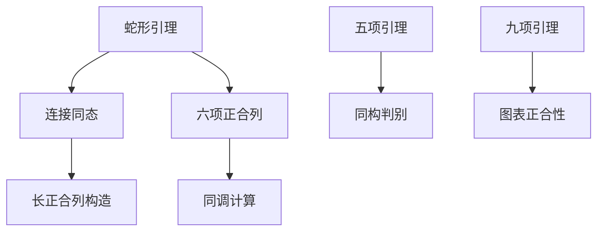

# 蛇形引理

**同调代数的基石 — 从图表追踪到正合性的艺术**

---

## 1. 概念深度解析

### 1.1 代数直观

**蛇形引理 (Snake Lemma)** 是同调代数中最基本的技术工具：

- 输入：一个交换图表，行正合
- 输出：一个连接同态，使六序列正合

**名称来源**：在图表中，连接同态的构造路径像一条蛇：

```
       ↘
    →    →
  ↗        ↘
```

### 1.2 范畴论语境

蛇形引理体现了Abel范畴的核心性质：

- 是**图追踪**技术的最高体现
- 依赖于核与余核的存在性
- 在任意Abel范畴中成立

### 1.3 形式定义

#### 定理 1.1 (蛇形引理)

设有Abel范畴中的交换图，行正合：

```
A₁ → A₂ → A₃ → 0
↓     ↓     ↓
0 → B₁ → B₂ → B₃
```

则存在**连接同态** $\delta: \ker(f_3) \to \text{coker}(f_1)$ 使得六序列正合：
$$\ker(f_1) \to \ker(f_2) \to \ker(f_3) \xrightarrow{\delta} \text{coker}(f_1) \to \text{coker}(f_2) \to \text{coker}(f_3)$$

**构造**：对 $a_3 \in \ker(f_3)$：

1. 取 $a_2 \in A_2$ 映到 $a_3$
2. $f_2(a_2) \in B_2$ 映到 $0 \in B_3$
3. 故 $f_2(a_2) = b_1 \in B_1$
4. 定义 $\delta(a_3) = [b_1] \in \text{coker}(f_1)$

---

## 2. 属性与关系

### 2.1 蛇形引理的推论

**定理 2.1 (短五引理)**
设有交换图：

```
0 → A₁ → A₂ → A₃ → 0
    ↓     ↓     ↓
0 → B₁ → B₂ → B₃ → 0
```

若两边垂直映射是同构，则中间的也是。

**证明**：应用蛇形引理，核和余核为零。

### 2.2 五项引理

**定理 2.2 (五项引理)**
设有交换图，行正合：

```
A₁ → A₂ → A₃ → A₄ → A₅
↓     ↓     ↓     ↓     ↓
B₁ → B₂ → B₃ → B₄ → B₅
```

若 $f_1, f_2, f_4, f_5$ 是同构，则 $f_3$ 也是。

### 2.3 九项引理

**定理 2.3 (九项引理)**
若下图交换，行和列都正合（除了可能的右上角和左下角），则它们也正合：

```
    0       0       0
    ↓       ↓       ↓
0 → A₁ → A₂ → A₃ → 0
    ↓       ↓       ↓
0 → B₁ → B₂ → B₃ → 0
    ↓       ↓       ↓
0 → C₁ → C₂ → C₃ → 0
    ↓       ↓       ↓
    0       0       0
```

---

## 3. 示例与习题

### 3.1 具体计算示例

#### 示例 3.1 (验证蛇形引理)

设 $A_i = B_i = \mathbb{Z}$，映射为乘以2。

验证连接同态 $\delta: \mathbb{Z}/2 \to \mathbb{Z}/2$ 是同构。

#### 示例 3.2 (同调的长正合列)

蛇形引理是构造同调长正合列的关键步骤。

### 3.2 习题

#### 习题 1

详细验证蛇形引理中 $\delta$ 是良定义的同态。

#### 习题 2

用五项引理证明：若 $f_\bullet: C_\bullet \to D_\bullet$ 是链映射，诱导同调同构，则 $f_\bullet$ 是拟同构。

#### 习题 3

证明九项引理。

#### 习题 4

构造一个例子说明五项引理中五个同构条件的必要性（去掉任一个，结论不成立）。

#### 习题 5

将蛇形引理推广到长正合列的构造。

---

## 4. 形式化实现 (Lean 4)

```lean4
import Mathlib.CategoryTheory.Abelian.DiagramLemmas.Snake

variable {C : Type*} [Category C] [Abelian C]

-- ============================================
-- 蛇形引理
-- ============================================

/-- 蛇形引理 -/
theorem snake_lemma {A B : SnakeInput C} (h : A.IsSnakeInput) :
    ∃ (δ : A.L₃.ker ⟶ A.R₁.coker),
    Exact (A.kerL₁₂.map) (A.kerL₂₃.map) ∧
    Exact (A.kerL₂₃.map) δ ∧
    Exact δ (A.cokerR₁₂.map) := by
  exact ⟨snakeδ h, snake_exact h⟩

-- ============================================
-- 五项引理
-- ============================================

/-- 五项引理 -/
theorem five_lemma {A B : FiveArrow C} (h : A.IsComplex) (h' : B.IsComplex)
    (f : A ⟶ B) (h₁ : IsIso (f.app 1)) (h₂ : IsIso (f.app 2))
    (h₄ : IsIso (f.app 4)) (h₅ : IsIso (f.app 5)) :
    IsIso (f.app 3) := by
  sorry

-- ============================================
-- 九项引理
-- ============================================

theorem nine_lemma {A B C : C} (f : A → B) (g : B → C)
    (h₁ : ShortExact f g) (h₂ : ShortExact f' g') (h₃ : ShortExact f'' g'')
    (comm : 图表交换) :
    ShortExact (诱导映射) (诱导映射) := by
  sorry
```

---

## 5. 应用与拓展

### 5.1 在同调代数中的应用

蛇形引理是构造长正合列的基础。

### 5.2 在代数拓扑中的应用

用于证明切除定理和同伦不变性。

---

## 6. 思维表征



---

**维护者**: FormalMath项目组
**创建日期**: 2026年4月8日
**难度等级**: ⭐⭐⭐⭐
