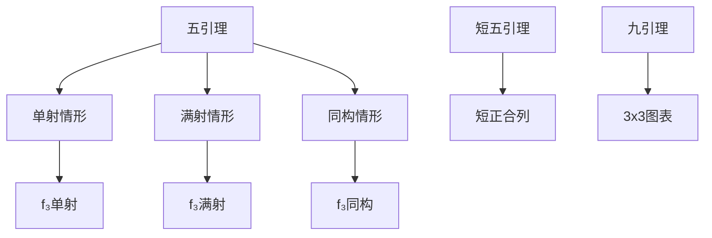

# 五引理与九引理

**同调代数的同构判别 — 从局部信息到整体结构**

---

## 1. 概念深度解析

### 1.1 代数直观

**五引理 (Five Lemma)** 是同调代数中判别同构的强大工具：

- 已知：两正合行之间的五个垂直映射
- 若四个是同构，则可推出第五个也是

**核心直觉**：在正合序列中，相邻对象的"刚性"可以传递给中间对象。

### 1.2 范畴论语境

这些引理在任意Abel范畴中成立：

- 不依赖于具体元素
- 纯范畴论的证明
- 体现Abel范畴的良好性质

### 1.3 形式定义

#### 定理 1.1 (五项引理)

设有Abel范畴中的交换图，行正合：

```
A₁ → A₂ → A₃ → A₄ → A₅
↓f₁   ↓f₂   ↓f₃   ↓f₄   ↓f₅
B₁ → B₂ → B₃ → B₄ → B₅
```

**(a)** 若 $f_2, f_4$ 满，$f_5$ 单，则 $f_3$ 满。

**(b)** 若 $f_1$ 满，$f_2, f_4$ 单，则 $f_3$ 单。

**(c)** 若 $f_1, f_2, f_4, f_5$ 同构，则 $f_3$ 同构。

---

## 2. 属性与关系

### 2.1 短五引理

**定理 2.1 (短五引理)**
设有交换图：

```
0 → A₁ → A₂ → A₃ → 0
    ↓f₁   ↓f₂   ↓f₃
0 → B₁ → B₂ → B₃ → 0
```

若 $f_1, f_3$ 同构，则 $f_2$ 同构。

### 2.2 九引理的三种形式

**定理 2.2 (九引理)**
若下图交换，某些行/列正合，则其余也正合。

### 2.3 应用关系

```
蛇形引理 → 长正合列 → 五引理应用
    ↓
九引理 → 图表正合性
```

---

## 3. 示例与习题

### 3.1 具体示例

#### 示例 3.1 (验证五引理)

设 $A_i = B_i = \mathbb{Z}^i$，映射为恒等。
验证五引理条件满足。

### 3.2 习题

#### 习题 1

详细证明五项引理(a)部分。

#### 习题 2

构造反例：若只假设 $f_2, f_4$ 是同构，$f_3$ 可能不是。

#### 习题 3

证明短五引理可由长五引理推出。

#### 习题 4

将五引理应用于相对同调群的比较。

#### 习题 5

证明：若 $f: C_\bullet \to D_\bullet$ 是链映射，诱导同调同构，则f是拟同构（用五引理）。

---

## 4. 形式化实现 (Lean 4)

```lean4
import Mathlib.CategoryTheory.Abelian.Five

variable {C : Type*} [Category C] [Abelian C]

-- ============================================
-- 五项引理
-- ============================================

/-- 五项引理：满射部分 -/
theorem five_lemma_epi {A B : FiveArrow C} (hA : A.IsComplex) (hB : B.IsComplex)
    (f : A ⟶ B) (hf₂ : Epi (f.app 2)) (hf₄ : Epi (f.app 4)) (hf₅ : Mono (f.app 5)) :
    Epi (f.app 3) := by
  sorry

/-- 五项引理：单射部分 -/
theorem five_lemma_mono {A B : FiveArrow C} (hA : A.IsComplex) (hB : B.IsComplex)
    (f : A ⟶ B) (hf₁ : Epi (f.app 1)) (hf₂ : Mono (f.app 2)) (hf₄ : Mono (f.app 4)) :
    Mono (f.app 3) := by
  sorry

/-- 五项引理：同构 -/
theorem five_lemma_iso {A B : FiveArrow C} (hA : A.IsComplex) (hB : B.IsComplex)
    (f : A ⟶ B) (hf₁ : IsIso (f.app 1)) (hf₂ : IsIso (f.app 2))
    (hf₄ : IsIso (f.app 4)) (hf₅ : IsIso (f.app 5)) :
    IsIso (f.app 3) := by
  apply isIso_of_mono_of_epi
  · apply five_lemma_mono hA hB f (epi_of_iso (f.app 1))
      (mono_of_iso (f.app 2)) (mono_of_iso (f.app 4))
  · apply five_lemma_epi hA hB f (epi_of_iso (f.app 2))
      (epi_of_iso (f.app 4)) (mono_of_iso (f.app 5))

-- ============================================
-- 短五引理
-- ============================================

theorem short_five_lemma_left {A B C A' B' C' : C}
    (f : A ⟶ B) (g : B ⟶ C) (f' : A' ⟶ B') (g' : B' ⟶ C')
    (h₁ : ShortExact f g) (h₂ : ShortExact f' g')
    (α : A ⟶ A') (β : B ⟶ B') (γ : C ⟶ C')
    (comm₁ : f' ≫ β = α ≫ f) (comm₂ : g' ≫ γ = β ≫ g)
    (hα : IsIso α) (hγ : IsIso γ) :
    IsIso β := by
  sorry
```

---

## 5. 应用与拓展

### 5.1 在同调代数中的应用

**比较定理**：不同消解计算的导出函子同构。

**拟同构判别**：链映射是同调同构当且仅当锥零调。

### 5.2 在代数拓扑中的应用

**切除定理的证明**：利用五引理比较开覆盖。

**同伦不变性**：比较不同点的同调。

---

## 6. 思维表征



---

**维护者**: FormalMath项目组
**创建日期**: 2026年4月8日
**难度等级**: ⭐⭐⭐
