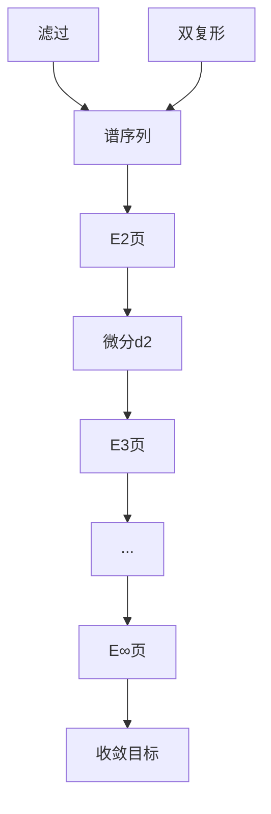

# 谱序列基础

**同调计算的渐近艺术 — 从滤过到收敛的极限过程**

---

## 1. 概念深度解析

### 1.1 代数直观

**谱序列 (Spectral Sequence)** 是逐步逼近同调群的工具：

- 从"粗糙"的近似开始（E¹页）
- 通过微分逐步细化（E², E³, ...）
- 最终收敛到目标（E^∞）

**直观类比**：

```
像翻书一样逐页逼近：
E¹页 → E²页 → E³页 → ... → E^∞页 = 目标同调
```

### 1.2 范畴论语境

谱序列是一种特殊的双分次微分对象：

- **对象**：双分次模 $E^{p,q}_r$
- **微分**：$d_r: E^{p,q}_r \to E^{p+r, q-r+1}_r$
- **同调**：$E^{p,q}_{r+1} = H(E^{p,q}_r, d_r)$

### 1.3 形式定义

#### 定义 1.1 (上同调谱序列)

**上同调谱序列** $(E_r, d_r)$ 包含：

- 对每个 $r \geq r_0$，双分次R-模 $E_r = \bigoplus_{p,q} E^{p,q}_r$
- 微分 $d_r: E^{p,q}_r \to E^{p+r, q-r+1}_r$ 满足 $d_r^2 = 0$
- $E_{r+1}^{p,q} = H(E_r^{p,q}, d_r)$

#### 定义 1.2 (收敛)

谱序列**收敛**到分次模 $H^*$（记 $E_r \Rightarrow H^*$），如果：

- 对每个 $(p,q)$，存在 $r_0$ 使得对所有 $r \geq r_0$，$d_r$ 进出 $E^{p,q}_r$ 都为零
- $E^{p,q}_\infty = E^{p,q}_{r_0}$ 与 $H^{p+q}$ 的某个滤过相关联

---

## 2. 属性与关系

### 2.1 从滤过构造谱序列

**定理 2.1 (滤过上同调谱序列)**
设复形 $C^*$ 有递减滤过 $F^p C^*$：
$$C^* = F^0 C^* \supseteq F^1 C^* \supseteq F^2 C^* \supseteq \cdots$$

则存在谱序列：
$$E_0^{p,q} = \frac{F^p C^{p+q}}{F^{p+1} C^{p+q}}$$
$$E_1^{p,q} = H^{p+q}(F^p C^*/F^{p+1} C^*)$$
$$E_\infty^{p,q} = \frac{F^p H^{p+q}}{F^{p+1} H^{p+q}}$$

### 2.2 第一象限谱序列

**定义 2.1 (第一象限谱序列)**
若 $E^{p,q}_r = 0$ 对 $p < 0$ 或 $q < 0$，则称为**第一象限谱序列**。

**性质**：

- 对固定 $(p,q)$，$E^{p,q}_r$ 最终稳定
- 微分 $d_r$ 的"长度"递增

### 2.3 边缘同态与传递

**定理 2.2 (边缘同态)**
第一象限谱序列有边缘同态：
$$E_2^{n,0} \to H^n \to E_2^{0,n}$$

**定理 2.3 (五项正合列)**
低维谱序列数据给出正合列：
$$0 \to E_2^{1,0} \to H^1 \to E_2^{0,1} \xrightarrow{d_2} E_2^{2,0} \to H^2$$

---

## 3. 示例与习题

### 3.1 具体计算示例

#### 示例 3.1 (平凡谱序列)

若 $E_2^{p,q} = 0$ 对 $q > 0$，则 $E_2 = E_\infty$，谱序列**退化**。

#### 示例 3.2 (双复形的谱序列)

双复形 $C^{p,q}$ 有两种滤过：

- **列滤过**：先算列同调，再算行
- **行滤过**：先算行同调，再算列

两个谱序列都收敛到全复形的上同调。

### 3.2 习题

#### 习题 1

证明：若第一象限谱序列在某页退化（所有微分为零），则 $E_r = E_\infty$。

#### 习题 2

设谱序列 $E_2^{p,q} = H^p(X, \mathcal{H}^q)$，其中 $\mathcal{H}^q$ 是局部系。证明收敛到 $H^*(X; \mathcal{L})$。

#### 习题 3

构造一个谱序列，其中 $E_2^{p,q} = E_2^{p,q}$ 对所有 $r$，但谱序列不退化。

#### 习题 4

设 $E_2^{p,q} = 0$ 除非 $q = 0$ 或 $q = n$。推导对应的正合列。

#### 习题 5

证明：谱序列的微分 $d_r$ 满足莱布尼茨法则（当定义乘法结构时）。

---

## 4. 形式化实现 (Lean 4)

```lean4nimport Mathlib.Algebra.Homology.SpectralSequence

variable {C : Type*} [Category C] [Abelian C]

-- ============================================
-- 谱序列的定义
-- ============================================

/-- 上同调谱序列 -/
structure SpectralSequence where
  E : ℕ → CochainComplex C (ComplexShape.up ℤ × ComplexShape.up ℤ)
  d (r : ℕ) : E r ⟶ E r(r, 1-r)
  d_comp_d (r : ℕ) : d r ≫ d r(r, 1-r)' = 0
  E_next (r : ℕ) : E (r + 1) ≅ (E r).homology

-- ============================================
-- 收敛
-- ============================================

/-- 谱序列收敛 -/
structure Convergence (S : SpectralSequence C) (H : GradedObject ℤ C) where
  isBounded : ∀ (p q : ℤ), ∃ r₀, ∀ r ≥ r₀,
    S.d r (p, q) = 0 ∧ S.d r (p - r, q + r - 1) = 0
  E_infty : GradedObject (ℤ × ℤ) C
  iso : ∀ (p q : ℤ), S.E_infty p q ≅ (S.E r₀) p q
  filtration : ∀ n, Filtration H n
  associated : ∀ (p q : ℤ), S.E_infty p q ≅
    (filtration (p + q)).subquotient p

-- ============================================
-- 第一象限谱序列
-- ============================================

/-- 第一象限谱序列 -/
def IsFirstQuadrant (S : SpectralSequence C) : Prop :=
  ∀ (r : ℕ) (p q : ℤ), p < 0 ∨ q < 0 → (S.E r) (p, q) = 0

/-- 第一象限谱序列最终稳定 -/
theorem first_quadrant_stabilizes (S : SpectralSequence C)
    (h : IsFirstQuadrant S) (p q : ℤ) :
    ∃ r₀, ∀ r ≥ r₀,
    S.d r (p, q) = 0 ∧ S.d r (p - r, q + r - 1) = 0 := by
  sorry
```

---

## 5. 应用与拓展

### 5.1 在代数拓扑中的应用

**Leray-Serre谱序列**：纤维丛的同调计算。

**Atiyah-Hirzebruch谱序列**：广义上同调论。

### 5.2 在同调代数中的应用

**Grothendieck谱序列**：复合函子的导出。

**双复形谱序列**：全复形的计算。

---

## 6. 思维表征



---

**维护者**: FormalMath项目组
**创建日期**: 2026年4月8日
**难度等级**: ⭐⭐⭐⭐⭐
