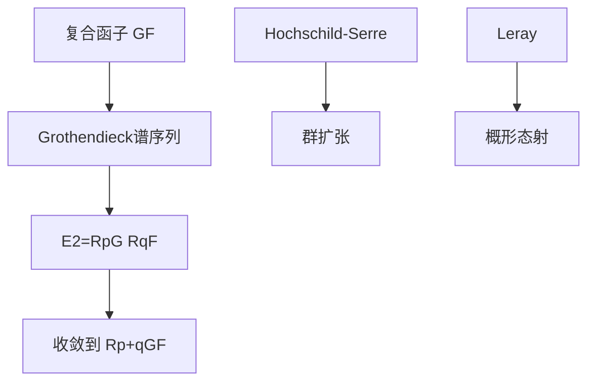

# Grothendieck谱序列

**复合函子的导出 — 从函子组合到谱序列的桥梁**

---

## 1. 概念深度解析

### 1.1 代数直观

**Grothendieck谱序列**计算复合函子的导出：

- 给定 $F: \mathcal{A} \to \mathcal{B}$，$G: \mathcal{B} \to \mathcal{C}$
- 如何计算 $R^n(G \circ F)$？
- 答案：用谱序列将问题分解

**核心思想**：
$$R^p G (R^q F(A)) \Rightarrow R^{p+q}(G \circ F)(A)$$

### 1.2 范畴论语境

**定理条件**：

- F：保持内射对象（或类似条件）
- G：左正合
- 足够多的内射对象

### 1.3 形式定义

#### 定理 1.1 (Grothendieck谱序列)

设 $F: \mathcal{A} \to \mathcal{B}$，$G: \mathcal{B} \to \mathcal{C}$ 是左正合函子。
假设：

- $\mathcal{A}$ 有足够多的F-零调对象
- F保持内射对象

则对每个 $A \in \mathcal{A}$，存在谱序列：
$$E_2^{p,q} = R^p G (R^q F(A)) \Rightarrow R^{p+q}(G \circ F)(A)$$

---

## 2. 属性与关系

### 2.1 特殊情况

**情形1：F正合**
$R^q F = 0$ 对 $q > 0$，谱序列退化：
$$R^n(G \circ F) = R^n G \circ F$$

**情形2：G正合**
类似地，谱序列退化。

### 2.2 边缘同态与正合列

**低维正合列**（五项）：
$$0 \to R^1 G(FA) \to R^1(GF)(A) \to G(R^1 F(A)) \xrightarrow{d_2} R^2 G(FA) \to R^2(GF)(A)$$

---

## 3. 示例与习题

### 3.1 具体示例

#### 示例 3.1 (群上同调的谱序列)

设 $H \triangleleft G$，$F = (-)^H$，$G = (-)^{G/H}$。

$$H^p(G/H, H^q(H, M)) \Rightarrow H^{p+q}(G, M)$$

这是Hochschild-Serre谱序列。

#### 示例 3.2 (Leray谱序列)

设 $f: X \to Y$ 是拓扑空间（或概形）的态射。

$$H^p(Y, R^q f_* \mathcal{F}) \Rightarrow H^{p+q}(X, \mathcal{F})$$

#### 示例 3.3 (局部上同调)

设 $Z \subseteq X$ 闭子集。

$$H^p_Z(X, \mathcal{F}) \text{ 与 } H^p(X, \mathcal{F}) \text{ 的关系}$$

### 3.2 习题

#### 习题 1

用Grothendieck谱序列证明：若F正合，则 $R^n(GF) = R^n G \circ F$。

#### 习题 2

对群扩张 $1 \to N \to G \to Q \to 1$，推导Hochschild-Serre谱序列。

#### 习题 3

设 $f: X \to Y$，$g: Y \to Z$。比较 $(gf)_*$ 和 $g_* f_*$ 的谱序列。

#### 习题 4

用Leray谱序列证明：若 $f$ 是有限态射，则 $R^q f_* = 0$ 对 $q > 0$。

#### 习题 5

构造一个例子说明Grothendieck谱序列不退化。

---

## 4. 形式化实现 (Lean 4)

```lean4
import Mathlib.Algebra.Homology.SpectralSequence.Grothendieck

variable {A B C : Type*} [Category A] [Category B] [Category C]
  [Abelian A] [Abelian B] [Abelian C]
variable (F : A ⥤ B) (G : B ⥤ C) [F.Additive] [G.Additive]
  [LeftExactFunctor F] [LeftExactFunctor G]

-- ============================================
-- Grothendieck谱序列
-- ============================================

/-- Grothendieck谱序列 -/
noncomputable def GrothendieckSpectralSequence (X : A) [EnoughInjectives A]
    [F.PreservesInjectiveObjects] :
    SpectralSequence C where
  E 2 (p, q) := (G.derived p).obj ((F.derived q).obj X)
  -- ...

/-- Grothendieck谱序列收敛 -/
theorem grothendieck_convergence (X : A) [EnoughInjectives A]
    [F.PreservesInjectiveObjects] :
    (GrothendieckSpectralSequence F G X).Convergence
      (fun n => ((F ⋙ G).derived n).obj X) := by
  sorry

-- ============================================
-- Hochschild-Serre谱序列
-- ============================================

/-- 群上同调的Grothendieck构造 -/
def HochschildSerre {G : Type*} [Group G] (N : Subgroup G) [N.Normal]
    (M : Rep ℤ G) :
    SpectralSequence (ModuleCat ℤ) :=
  let F := @GroupCohomology.invariantsFunctor N
  let G := @GroupCohomology.invariantsFunctor (G ⧸ N)
  GrothendieckSpectralSequence F G M
```

---

## 5. 应用与拓展

### 5.1 在层论中的应用

**Leray谱序列**：对概形态射计算上同调。

**局部-整体谱序列**：将局部上同调与整体上同调联系。

### 5.2 在代数群中的应用

**Hochschild-Serre**：群上同调的工具。

---

## 6. 思维表征



---

**维护者**: FormalMath项目组
**创建日期**: 2026年4月8日
**难度等级**: ⭐⭐⭐⭐⭐
