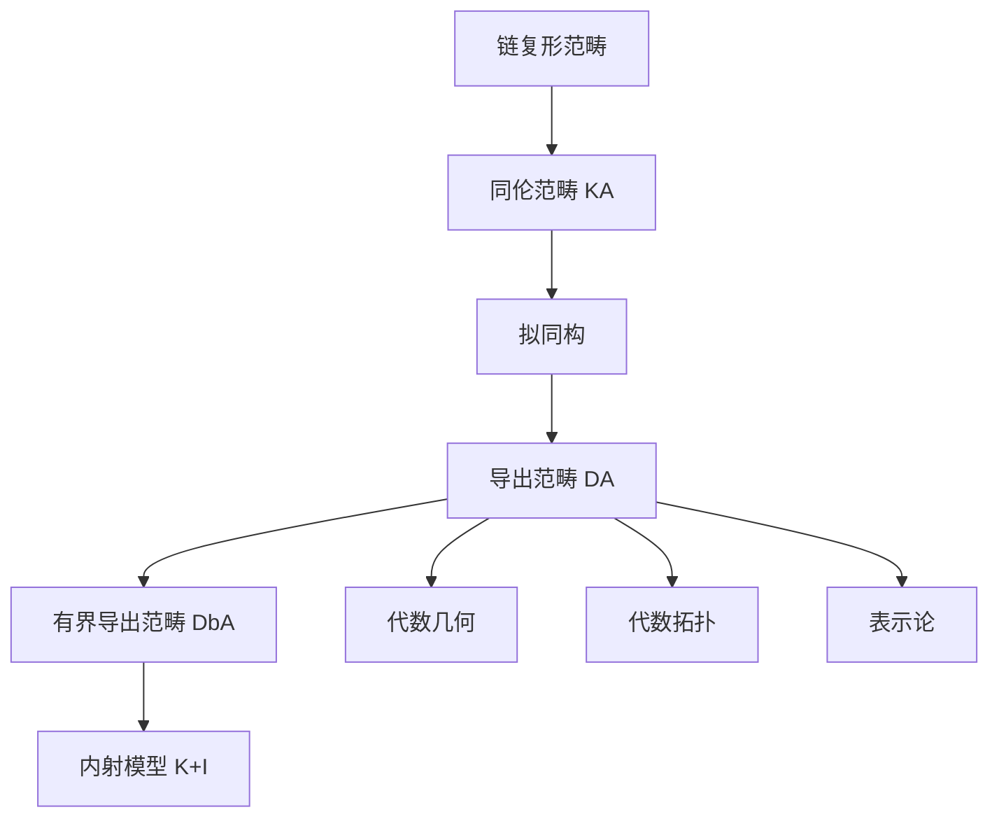

# 拟同构与局部化

**导出范畴的构造 — 从拟同构到同构的转化**

---

## 1. 概念深度解析

### 1.1 代数直观

在同调代数中，我们真正关心的往往不是链复形本身，而是它的**同调群**所携带的不变量。两个链复形可能形状截然不同，但只要它们的同调群同构，就应被视为“等价”。**拟同构（quasi-isomorphism）** 正是形式化这一思想的工具：它是诱导同调群同构的链映射。然而，在普通的同伦范畴 $K(\mathcal{A})$ 中，拟同构通常并非真正的同构——例如，一个模的投射分解与原模之间是拟同构，但一般不存在逆链映射。

为了将拟同构“反转”为同构，我们需要一种范畴论的手术：**局部化（localization）**。这与代数学中把非零整数 invert 得到有理数 $\mathbb{Q}$ 的直觉完全一致：给定范畴 $\mathcal{C}$ 和其中一类“希望可逆”的态射 $S$，构造新范畴 $S^{-1}\mathcal{C}$，使得 $S$ 中每个态射都成为同构，且该构造具有最小的泛性质。

### 1.2 拟同构的形式定义

设 $\mathcal{A}$ 为 Abel 范畴，$C_\bullet, D_\bullet$ 为 $\mathcal{A}$ 中的链复形。

**定义 1.1（拟同构）**。链映射 $f: C_\bullet \to D_\bullet$ 称为**拟同构**，如果对所有整数 $n$，诱导的同调映射
$$H_n(f): H_n(C_\bullet) \xrightarrow{\cong} H_n(D_\bullet)$$
都是 $\mathcal{A}$ 中的同构。

**注记 1.2**。拟同构的复合仍是拟同构。若 $f$ 与 $g$ 链同伦，则 $H_n(f)=H_n(g)$，因此链同伦等价蕴含拟同构，但反之不成立。

### 1.3 范畴论中的局部化

设 $\mathcal{C}$ 为范畴，$S \subseteq \operatorname{Mor}(\mathcal{C})$ 为一族态射。

**定义 1.3（局部化范畴）**。$\mathcal{C}$ 关于 $S$ 的**局部化** $S^{-1}\mathcal{C}$ 是一个范畴，配备函子 $Q: \mathcal{C} \to S^{-1}\mathcal{C}$，满足：

1. 对任意 $s \in S$，$Q(s)$ 是 $S^{-1}\mathcal{C}$ 中的同构；
2. 对任意函子 $F: \mathcal{C} \to \mathcal{D}$，若 $F(s)$ 对所有 $s \in S$ 为同构，则 $F$ 唯一通过 $Q$ 分解。

局部化的存在性一般要求 $S$ 满足**乘法系（multiplicative system）**的公理（左/右分数条件）。对于同伦范畴 $K(\mathcal{A})$ 与拟同构类 $\text{Qis}$，Verdier 证明了 $\text{Qis}$ 确实构成乘法系，从而保证导出范畴的存在。

---

## 2. 导出范畴的构造与泛性质

### 2.1 导出范畴的定义

**定义 2.1（导出范畴）**。Abel 范畴 $\mathcal{A}$ 的**导出范畴** $D(\mathcal{A})$ 定义为同伦范畴关于拟同构的局部化：
$$D(\mathcal{A}) := K(\mathcal{A})[\text{Qis}^{-1}].$$

$D(\mathcal{A})$ 的对象仍是链复形，但态射的描述需要借助 **roof 图（或 coroof 图）**：$C_\bullet$ 到 $D_\bullet$ 的一个态射由如下图表的等价类给出
$$C_\bullet \xleftarrow{\;s\;} E_\bullet \xrightarrow{\;f\;} D_\bullet,$$
其中 $s$ 是拟同构。两个 roof $(s, f)$ 与 $(t, g)$ 等价，如果存在交换 roof 使得下图交换：

```
        E_\bullet
       /    \
  s/t |      | f/g
     /        \
C_\bullet    D_\bullet
```

更严格地，若存在拟同构 $u: F_\bullet \to E_\bullet$ 使得 $s \circ u = t \circ v$（对某 $v$）且 $f \circ u = g \circ v$，则两 roof 等价。

### 2.2 泛性质

**定理 2.2（局部化的泛性质）**。局部化函子 $Q: K(\mathcal{A}) \to D(\mathcal{A})$ 满足：

- 对任意拟同构 $s$，$Q(s)$ 在 $D(\mathcal{A})$ 中为同构；
- 若函子 $F: K(\mathcal{A}) \to \mathcal{D}$ 将拟同构映为同构，则存在唯一的函子 $\tilde{F}: D(\mathcal{A}) \to \mathcal{D}$ 使得 $F = \tilde{F} \circ Q$。

*证明概要*。唯一性由局部化的泛性质直接得到。存在性的构造借助 roof 图：对对象 $C_\bullet$，令 $\tilde{F}(C_\bullet)=F(C_\bullet)$；对态射 $[s,f]: C_\bullet \to D_\bullet$，定义 $\tilde{F}([s,f]) = F(f) \circ F(s)^{-1}$。由于 $F(s)$ 可逆，此定义良好，且保持合成与恒等态射。$\square$

### 2.3 有界导出范畴与内射模型

**定义 2.3**。记

- $D^+(\mathcal{A})$：下有界复形（存在 $N$ 使得 $C_n=0$ 对 $n<N$）生成的全子范畴；
- $D^-(\mathcal{A})$：上有界复形生成的全子范畴；
- $D^b(\mathcal{A})$：有界复形生成的全子范畴。

**定理 2.4**。设 Abel 范畴 $\mathcal{A}$ 具有足够多的内射对象，则自然函子
$$K^+(\mathcal{I}) \longrightarrow D^+(\mathcal{A})$$
是范畴等价，其中 $K^+(\mathcal{I})$ 是由下有界内射复形构成的同伦范畴。

*证明概要*。分为两步：

1. **内射分解的存在性**：对任意下有界复形 $C^\bullet$，利用 Cartan–Eilenberg 分解或逐次构造，可找到拟同构 $C^\bullet \xrightarrow{\sim} I^\bullet$，其中 $I^\bullet$ 为下有界内射复形。这保证 $K^+(\mathcal{I}) \to D^+(\mathcal{A})$ 是本质满射。

2. **内射复形上的拟同构即同伦等价**：设 $f: I^\bullet \to J^\bullet$ 为两下有界内射复形之间的拟同构。由归纳法逐次提升恒等映射，可构造同伦逆 $g: J^\bullet \to I^\bullet$ 使得 $g \circ f \sim \mathrm{id}$、$f \circ g \sim \mathrm{id}$。关键在于内射对象满足同伦扩张性质：任何到内射对象的链映射若在同调上为零，则链同伦于零。

因此 $K^+(\mathcal{I})$ 中拟同构已被同伦等价所“逆转”，局部化不改变该范畴，从而得到等价。$\square$

---

## 3. 具体例子与计算

### 3.1 拟同构的基本例子

考虑 Abel 群范畴 $\mathbf{Ab}$ 中的链复形
$$C_\bullet: \quad \cdots \to 0 \to \mathbb{Z} \xrightarrow{\times 2} \mathbb{Z} \to 0 \to \cdots$$
其中两个 $\mathbb{Z}$ 分别位于度 $1$ 与度 $0$。其同调为
$$H_1(C_\bullet)=\ker(\times 2)=0, \quad H_0(C_\bullet)=\mathbb{Z}/2\mathbb{Z}.$$

再考虑复形
$$D_\bullet: \quad \cdots \to 0 \to 0 \to \mathbb{Z}/2\mathbb{Z} \to 0 \to \cdots$$
其中 $\mathbb{Z}/2\mathbb{Z}$ 位于度 $0$。显然 $H_0(D_\bullet)=\mathbb{Z}/2\mathbb{Z}$，其余为零。

链映射 $f: C_\bullet \to D_\bullet$ 在度 $0$ 为自然投影 $\mathbb{Z} \twoheadrightarrow \mathbb{Z}/2\mathbb{Z}$，其余度为零。则 $H_0(f)$ 为恒等同构，$H_n(f)$（$n \neq 0$）在零与零之间亦为同构。故 $f$ 是**拟同构**，但 $C_\bullet$ 与 $D_\bullet$ 在复形范畴中并不同构（$C_\bullet$ 含自由项，$D_\bullet$ 为挠项）。在导出范畴 $D(\mathbb{Z})$ 中，$f$ 成为真正的同构，即 $C_\bullet \cong \mathbb{Z}/2\mathbb{Z}[0]$。

### 3.2 导出范畴中的 Ext 计算

利用导出范畴可统一描述经典导出函子。对 $A, B \in \mathcal{A}$，视其为集中在度 $0$ 的复形，则
$$\operatorname{Ext}^n_\mathcal{A}(A, B) = \operatorname{Hom}_{D(\mathcal{A})}(A, B[n]).$$

**具体计算**：取 $\mathcal{A}=\mathbf{Ab}$，$A=\mathbb{Z}/2\mathbb{Z}$，$B=\mathbb{Z}$，计算 $\operatorname{Ext}^1_\mathbb{Z}(A,B)$。取 $A$ 的投射分解
$$P_\bullet: \quad 0 \longrightarrow \mathbb{Z} \xrightarrow{\times 2} \mathbb{Z} \longrightarrow 0$$
（$\mathbb{Z}$ 在度 $1$ 与度 $0$）。在导出范畴中，$A \cong P_\bullet$（自然投影 $P_\bullet \to A$ 是拟同构）。于是
$$\operatorname{Ext}^1(A,B) = \operatorname{Hom}_{D(\mathbb{Z})}(P_\bullet, B[1]).$$

链映射 $g: P_\bullet \to B[1]$ 由度 $1$ 的映射 $g_1: \mathbb{Z} \to \mathbb{Z}$ 决定（其余度自动为零，因 $B[1]$ 仅在度 $1$ 非零）。两个这样的映射 $g_1, g_1'$ 链同伦，当且仅当存在 $h: P_0 \to B[1]_0 = B$ 使得 $g_1 - g_1' = h \circ d_1^P$。这里 $d_1^P = \times 2: \mathbb{Z} \to \mathbb{Z}$，而 $h$ 是任意整数 $h \in \mathbb{Z}$。因此
$$g_1 \sim g_1' \iff g_1 - g_1' \in 2\mathbb{Z}.$$

故同伦类集合为 $\mathbb{Z}/2\mathbb{Z}$，即
$$\operatorname{Ext}^1_\mathbb{Z}(\mathbb{Z}/2\mathbb{Z}, \mathbb{Z}) \cong \mathbb{Z}/2\mathbb{Z}.$$

这与经典计算完全一致，但推导完全在导出范畴框架内完成，无需显式构造导出函子的长正合列。$\square$

---

## 4. 几何直观与应用背景

拟同构与导出范畴的引入，使得同调代数从“计算同调群”提升到“研究复形的同伦型”。在代数拓扑中，奇异链复形 $C_\bullet(X)$ 与胞腔链复形 $C_\bullet^{\text{cell}}(X)$ 通常仅拟同构而非同构；真正决定空间拓扑性质的是它们在导出范畴中的同构类。这类似于同伦论中弱等价的概念：CW 逼近定理断言任何空间都弱等价于一个 CW 复形，正如任何复形都拟同构于一个内射（或投射）复形。

在代数几何中，导出范畴是 **Fourier–Mukai 变换** 的舞台：若两个光滑射影簇 $X, Y$ 的凝聚层有界导出范畴等价
$$D^b(\operatorname{Coh}(X)) \simeq D^b(\operatorname{Coh}(Y)),$$
则 $X$ 与 $Y$ 往往共享许多深层几何不变量（Hodge 数、K-群等）。Orlov 的著名定理断言：当典范丛（或反典范丛）为丰富时，任何这样的等价必由某个“核”对象 $K \in D^b(X \times Y)$ 给出的 Fourier–Mukai 函子实现。这一理论深刻联系了代数几何与表示论中的 **倾斜理论（tilting theory）**。

在表示论中，导出等价是比 Morita 等价更精细的关系：两个代数可以有等价的导出范畴但不等价的模范畴。BGG 对应（Bernstein–Gelfand–Gelfand）就是导出范畴等价在李代数表示论中的典范实例。

---

## 5. 与其他分支的联系

- **代数拓扑**：导出范畴是稳定同伦范畴的代数原型。Dold–Kan 对应建立了链复形与单纯 Abel 群之间的等价，导出范畴则对应于谱（spectrum）的同伦范畴。拟同构在此对应于弱同伦等价。
- **代数几何与镜面对称**：**同调镜像对称**（Kontsevich, 1994）预言，Calabi–Yau 簇 $X$ 的 Fukaya 范畴（辛几何）与镜像簇 $\check{X}$ 的凝聚层导出范畴等价。该猜想的验证依赖于导出范畴的精细结构，如 t-结构、 hearts、稳定性条件（Bridgeland stability）。
- **数论与算术几何**：在概形的平展上同调与 $\ell$-进层的情形下，导出范畴为 perfect complex 与 Grothendieck 对偶提供了最自然的工作语言。平展上同调中的 Poincaré 对偶、Lefschetz 不动点公式均可在导出范畴框架内统一表述。
- **数学物理与弦论**：D-膜的开弦谱由导出范畴中的 Hom 群给出；B-膜的稳定性由 Bridgeland 稳定性条件刻画。导出范畴因此成为弦紧化与模空间研究的中心对象。

---

## 6. 思维表征



---

## 7. 练习

1. 证明：两个拟同构的复合仍为拟同构；若 $f \sim g$（链同伦），则 $f$ 是拟同构当且仅当 $g$ 是拟同构。
2. 对复形 $C_\bullet: 0 \to \mathbb{Z} \xrightarrow{\times 3} \mathbb{Z} \to 0$，构造到 $D_\bullet: 0 \to 0 \to \mathbb{Z}/3\mathbb{Z} \to 0$ 的显式拟同构，并在导出范畴 $D(\mathbb{Z})$ 中写出其逆态射的 roof 表示。
3. 利用定理 2.4 的证明思路，具体构造 $C_\bullet = (\mathbb{Z} \xrightarrow{\times 2} \mathbb{Z})$ 的一个内射分解，并验证该内射复形与 $C_\bullet$ 之间的自然映射是同伦等价。
4. 设 $\mathcal{A}$ 为域 $k$ 上的向量空间范畴。证明 $D^b(\mathcal{A})$ 等价于分次向量空间范畴，并解释为何此时拟同构与链同伦等价重合。

---

## 参考文献

1. C. A. Weibel, *An Introduction to Homological Algebra*, Cambridge Univ. Press, 1994. (Ch. 10)
2. S. I. Gelfand and Y. I. Manin, *Methods of Homological Algebra*, Springer, 2003. (Ch. III)
3. J.-L. Verdier, "Des catégories dérivées des catégories abéliennes", *Astérisque*, 1996.
4. A. Bondal and D. Orlov, "Reconstruction of a variety from the derived category and groups of autoequivalences", *Compositio Math.*, 2001.
5. nLab, "Derived category", https://ncatlab.org/nlab/show/derived+category.

---

**维护者**: FormalMath项目组
**创建日期**: 2026年4月8日
**难度等级**: ⭐⭐⭐⭐⭐
